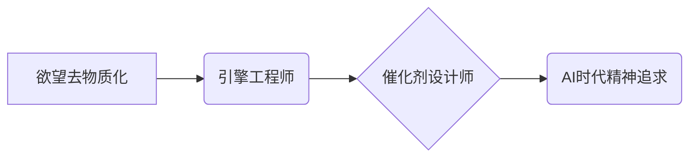

                 

## 欲望去物质化引擎工程师：AI时代的精神追求催化剂设计师

> 关键词：人工智能、物质化、引擎工程师、精神追求、催化剂设计师、AI时代、价值观、伦理

## 1. 背景介绍

当人工智能 (AI) 迅速发展，并开始渗透到我们生活的方方面面时，我们不禁要思考：AI 时代，人类的价值观和精神追求将何去何从？

传统的科技发展模式往往将物质利益作为首要目标，追求效率、速度和规模化生产。然而，在 AI 时代，这种模式面临着新的挑战和机遇。AI 拥有强大的计算能力和学习能力，能够帮助我们解决许多复杂问题，创造出前所未有的价值。但同时，AI 也可能带来新的伦理困境和社会问题，例如：

* **工作岗位的替代:** AI 自动化可能会导致大量工作岗位被取代，引发社会动荡和经济不平等。
* **算法偏见:** AI 算法的训练数据可能存在偏见，导致 AI 系统产生歧视性结果，加剧社会不公。
* **隐私泄露:** AI 系统的收集和分析个人数据可能会侵犯用户隐私，引发安全风险。

面对这些挑战，我们需要重新审视科技发展的方向，并探索 AI 如何更好地服务于人类精神追求。

## 2. 核心概念与联系

**2.1 欲望去物质化**

在 AI 时代，我们越来越意识到物质财富并非人生的唯一目标。精神追求，例如：

* **自我实现:** 通过学习、创造和探索，实现个人价值和潜能。
* **人际连接:** 建立真诚、有意义的人际关系，获得情感支持和归属感。
* **社会贡献:** 为社会做出积极贡献，提升人类福祉。

这些精神追求，可以被视为“欲望去物质化”的体现。

**2.2 引擎工程师**

引擎工程师是指能够构建和维护 AI 系统的专业人员。他们需要具备扎实的技术基础，以及对 AI 伦理和社会影响的深刻理解。

**2.3 催化剂设计师**

催化剂设计师是指能够引导 AI 技术朝着有利于人类精神追求的方向发展的专家。他们需要具备以下特质：

* **洞察力:** 能够洞察 AI 技术的潜在影响，并预测其对社会和人类精神的影响。
* **创造力:** 能够设计出能够促进人类精神追求的 AI 应用场景和解决方案。
* **责任感:** 能够承担 AI 技术发展带来的责任，并确保其安全、伦理和可持续发展。

**2.4 关系图**



## 3. 核心算法原理 & 具体操作步骤

**3.1 算法原理概述**

催化剂设计师需要掌握多种 AI 算法，例如：

* **深度学习:** 用于训练复杂的 AI 模型，例如图像识别、自然语言处理等。
* **强化学习:** 用于训练 AI 系统在特定环境中做出最佳决策。
* **迁移学习:** 用于将已训练好的 AI 模型应用于新的任务或领域。

**3.2 算法步骤详解**

例如，使用深度学习训练一个 AI 模型识别艺术作品的风格，具体步骤如下：

1. **数据收集:** 收集大量不同艺术风格的图像数据。
2. **数据预处理:** 对图像数据进行清洗、裁剪、缩放等预处理操作。
3. **模型构建:** 选择合适的深度学习模型架构，例如卷积神经网络 (CNN)。
4. **模型训练:** 使用训练数据训练深度学习模型，调整模型参数，使其能够准确识别艺术风格。
5. **模型评估:** 使用测试数据评估模型的识别准确率，并进行调整。
6. **模型部署:** 将训练好的模型部署到实际应用场景中，例如艺术品鉴赏平台。

**3.3 算法优缺点**

深度学习算法具有强大的学习能力和识别精度，但同时也存在一些缺点：

* **数据依赖:** 深度学习模型需要大量数据进行训练，否则性能会下降。
* **计算资源消耗:** 训练深度学习模型需要大量的计算资源，成本较高。
* **可解释性差:** 深度学习模型的决策过程较为复杂，难以解释其识别结果。

**3.4 算法应用领域**

深度学习算法广泛应用于各个领域，例如：

* **图像识别:** 人脸识别、物体检测、图像分类等。
* **自然语言处理:** 文本分类、机器翻译、语音识别等。
* **医疗诊断:** 疾病预测、影像分析、药物研发等。
* **金融分析:** 风险评估、欺诈检测、投资预测等。

## 4. 数学模型和公式 & 详细讲解 & 举例说明

**4.1 数学模型构建**

深度学习模型通常基于神经网络结构，其数学模型可以表示为：

$$
y = f(W x + b)
$$

其中：

* $y$ 是模型输出
* $x$ 是输入数据
* $W$ 是权重矩阵
* $b$ 是偏置向量
* $f$ 是激活函数

**4.2 公式推导过程**

深度学习模型的训练过程是通过反向传播算法来优化模型参数 $W$ 和 $b$ 的。反向传播算法的核心思想是：

1. 计算模型输出与真实值的误差。
2. 根据误差反向传播，计算每个参数的梯度。
3. 使用梯度下降算法更新参数，使得误差最小化。

**4.3 案例分析与讲解**

例如，在训练一个图像分类模型时，输入数据是图像像素值，输出是图像所属类别概率。训练过程中，模型会不断调整权重和偏置，使得模型输出与真实类别概率越接近。

## 5. 项目实践：代码实例和详细解释说明

**5.1 开发环境搭建**

使用 Python 语言和 TensorFlow 或 PyTorch 深度学习框架进行开发。

**5.2 源代码详细实现**

```python
import tensorflow as tf

# 定义模型架构
model = tf.keras.models.Sequential([
    tf.keras.layers.Conv2D(32, (3, 3), activation='relu', input_shape=(28, 28, 1)),
    tf.keras.layers.MaxPooling2D((2, 2)),
    tf.keras.layers.Conv2D(64, (3, 3), activation='relu'),
    tf.keras.layers.MaxPooling2D((2, 2)),
    tf.keras.layers.Flatten(),
    tf.keras.layers.Dense(10, activation='softmax')
])

# 编译模型
model.compile(optimizer='adam',
              loss='sparse_categorical_crossentropy',
              metrics=['accuracy'])

# 训练模型
model.fit(x_train, y_train, epochs=5)

# 评估模型
loss, accuracy = model.evaluate(x_test, y_test)
print('Test loss:', loss)
print('Test accuracy:', accuracy)
```

**5.3 代码解读与分析**

这段代码定义了一个简单的卷积神经网络模型，用于 MNIST 手写数字识别任务。

* `tf.keras.models.Sequential` 创建一个顺序模型，将层级依次连接。
* `tf.keras.layers.Conv2D` 定义卷积层，用于提取图像特征。
* `tf.keras.layers.MaxPooling2D` 定义最大池化层，用于降维和提高模型鲁棒性。
* `tf.keras.layers.Flatten` 将多维特征转换为一维向量。
* `tf.keras.layers.Dense` 定义全连接层，用于分类。
* `model.compile` 编译模型，指定优化器、损失函数和评价指标。
* `model.fit` 训练模型，使用训练数据进行迭代训练。
* `model.evaluate` 评估模型，使用测试数据计算损失和准确率。

**5.4 运行结果展示**

训练完成后，模型能够识别手写数字，并输出识别结果的概率分布。

## 6. 实际应用场景

**6.1 艺术品鉴赏平台**

使用 AI 识别艺术作品的风格，为用户提供个性化推荐和艺术鉴赏服务。

**6.2 教育辅助工具**

使用 AI 辅助学生学习，例如：个性化学习路径推荐、智能答疑系统、语言学习助手等。

**6.3 人文研究辅助**

使用 AI 分析文本数据，例如：挖掘历史文献中的隐含信息、研究文学作品的主题和风格等。

**6.4 未来应用展望**

随着 AI 技术的不断发展，催化剂设计师将能够开发出更多能够促进人类精神追求的 AI 应用场景，例如：

* **AI 辅助创作:** 使用 AI 辅助艺术家创作新的艺术作品，例如音乐、绘画、文学等。
* **AI 驱动的个人成长:** 使用 AI 为用户提供个性化的成长建议和指导，帮助用户实现自我提升。
* **AI 促进社会和谐:** 使用 AI 解决社会问题，例如：促进跨文化理解、缓解贫富差距等。

## 7. 工具和资源推荐

**7.1 学习资源推荐**

* **在线课程:** Coursera、edX、Udacity 等平台提供丰富的 AI 课程。
* **书籍:** 《深度学习》、《人工智能：一种现代方法》等书籍。
* **开源项目:** TensorFlow、PyTorch 等开源深度学习框架。

**7.2 开发工具推荐**

* **Python:** 广泛用于 AI 开发的编程语言。
* **Jupyter Notebook:** 用于编写和运行 Python 代码的交互式环境。
* **TensorFlow/PyTorch:** 深度学习框架。

**7.3 相关论文推荐**

* **《ImageNet Classification with Deep Convolutional Neural Networks》**
* **《Attention Is All You Need》**
* **《Generative Adversarial Networks》**

## 8. 总结：未来发展趋势与挑战

**8.1 研究成果总结**

催化剂设计师在 AI 时代发挥着越来越重要的作用，他们能够引导 AI 技术朝着有利于人类精神追求的方向发展。

**8.2 未来发展趋势**

* **更强大的 AI 模型:** 随着算法和计算资源的不断发展，AI 模型将更加强大，能够解决更复杂的问题。
* **更广泛的应用场景:** AI 将应用于更多领域，例如医疗、教育、金融等。
* **更注重伦理和社会影响:** 催化剂设计师将更加关注 AI 技术的伦理和社会影响，确保其安全、公平和可持续发展。

**8.3 面临的挑战**

* **数据安全和隐私保护:** AI 模型的训练需要大量数据，如何确保数据安全和隐私保护是一个重要挑战。
* **算法偏见和歧视:** AI 算法可能存在偏见，导致歧视性结果，需要采取措施解决这个问题。
* **AI 伦理和社会责任:** AI 技术的发展需要考虑其伦理和社会责任，需要制定相应的规范和制度。

**8.4 研究展望**

未来，催化剂设计师需要不断探索新的 AI 应用场景，并解决 AI 技术带来的挑战，确保 AI 技术真正服务于人类精神追求。


## 9. 附录：常见问题与解答

**9.1 如何成为一名催化剂设计师？**

成为一名催化剂设计师需要具备以下特质：

* 扎实的技术基础，例如 AI 算法、数据科学等。
* 对 AI 伦理和社会影响的深刻理解。
* 创造力和洞察力，能够设计出能够促进人类精神追求的 AI 应用场景。
* 责任感和使命感，能够承担 AI 技术发展带来的责任。

**9.2 AI 技术会取代人类工作吗？**

AI 技术可能会替代一些重复性、低技能的工作，但同时也创造出新的工作机会。重要的是，我们需要适应 AI 技术的发展，不断学习和提升自己的技能，才能在 AI 时代保持竞争力。

**9.3 如何确保 AI 技术的安全和伦理？**

确保 AI 技术的安全和伦理需要多方面的努力，例如：

* 制定相应的法律法规和规范。
* 加强 AI 技术的安全性测试和评估。
* 培养 AI 领域的伦理意识。
* 加强公众对 AI 技术的认知和监督。


作者：禅与计算机程序设计艺术 / Zen and the Art of Computer Programming 
<end_of_turn>

