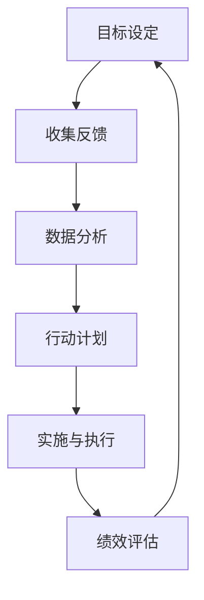

                 

## 1. 背景介绍

在快速变化的世界中，持续学习成为管理者必备的技能之一。技术进步、市场动态、竞争环境等因素无时无刻不在变化，管理者需要不断更新知识和技能，以适应这些变化，确保组织能够持续发展。特别是在当前的信息时代，技术的快速迭代和互联网的广泛应用，使得传统管理方式面临巨大挑战。

本文将深入探讨持续学习对管理者的重要性，包括其定义、原理、实际操作、工具和资源推荐，以及未来发展趋势与挑战。通过系统化的分析和实例应用，帮助管理者掌握持续学习的方法，提高自身和组织的竞争力。

## 2. 核心概念与联系

### 2.1 核心概念概述

持续学习(Learning in the Loop)是一种迭代式学习方式，强调在实际工作过程中不断反馈、反思和改进。管理者通过不断的学习和实践，持续优化自己的决策和行动，以适应环境变化。

该概念主要涉及以下几个关键点：

- **反馈机制**：管理者需要建立有效的反馈循环，及时获取组织内外部的信息和反馈，评估自身和组织的绩效。
- **反思与改进**：管理者需要定期反思自己的决策和行动，识别改进的机会和挑战，通过学习来解决问题。
- **知识整合**：管理者需要不断整合新知识，应用到实际工作中，提升决策质量和组织能力。
- **适应性**：持续学习帮助管理者适应环境变化，应对不确定性，提升应变能力。

这些核心概念之间相互关联，构成了一个完整的持续学习框架。

### 2.2 核心概念原理和架构的 Mermaid 流程图



### 2.3 核心概念的联系

持续学习的核心原理是通过循环迭代，不断改进决策和行动。这一原理与现代管理学的PDCA（Plan-Do-Check-Act）循环有密切联系，强调了计划、执行、检查、改进的持续过程。通过持续学习，管理者可以将PDCA循环应用于实际工作中，确保组织在不断变化的环境中保持竞争力。

## 3. 核心算法原理 & 具体操作步骤

### 3.1 算法原理概述

持续学习基于反馈和改进的迭代过程，强调在实际应用中不断获取反馈，并根据反馈调整行动。其核心算法包括：

- **收集反馈**：通过定期的问卷调查、绩效评估、客户反馈等方式，收集外部和内部的反馈信息。
- **数据分析**：对收集到的反馈数据进行分析，识别关键问题、机会和挑战。
- **行动计划**：基于数据分析结果，制定具体的行动计划，明确改进目标和方法。
- **实施与执行**：执行行动计划，通过实际操作来验证和改进方案。
- **绩效评估**：对实施结果进行评估，确认改进效果，并根据结果进行下一步调整。

### 3.2 算法步骤详解

**Step 1: 设定学习目标**

管理者需要明确持续学习的目标，如提升团队绩效、改善客户满意度、优化决策过程等。目标设定应具体、可量化，以便后续跟踪和评估。

**Step 2: 收集反馈**

通过多种渠道收集反馈信息，包括员工意见、客户反馈、市场数据、绩效指标等。反馈信息应全面、客观，涵盖组织的各个方面。

**Step 3: 数据分析**

对收集到的反馈数据进行分析，识别出关键问题和机会。分析方法包括定量和定性分析，如统计分析、文本分析、情感分析等。

**Step 4: 制定行动计划**

根据数据分析结果，制定具体的改进计划，明确改进步骤、资源需求和时间安排。行动计划应灵活、可调整，以便应对变化。

**Step 5: 实施与执行**

执行行动计划，通过实际操作来验证和改进方案。实施过程中，管理者应密切关注进展，及时调整策略。

**Step 6: 绩效评估**

对实施结果进行评估，确认改进效果，并根据结果进行下一步调整。评估方法包括问卷调查、绩效指标、客户满意度等。

**Step 7: 反思与总结**

对整个持续学习过程进行反思和总结，识别成功经验和教训，形成新的知识，为下一次学习提供参考。

### 3.3 算法优缺点

**优点**：

1. **提高适应性**：持续学习帮助管理者适应环境变化，提高组织的适应性和灵活性。
2. **提升决策质量**：通过不断反馈和改进，决策质量逐步提升，减少错误决策的风险。
3. **增强团队协作**：通过共享学习经验，团队成员之间合作更加紧密，协同效果更好。
4. **激发创新**：持续学习鼓励创新和探索，帮助组织不断突破瓶颈，实现突破性发展。

**缺点**：

1. **资源投入大**：持续学习需要大量的时间、金钱和人力资源，短期内难以看到明显效果。
2. **管理复杂**：持续学习过程复杂，需要严格的管理和监控，确保每个步骤都能顺利进行。
3. **员工抵触**：部分员工可能对持续学习感到抵触，认为其占用了正常工作时间，影响工作效率。

### 3.4 算法应用领域

持续学习在各个行业和管理领域都有广泛的应用，包括但不限于：

- **人力资源管理**：通过员工反馈和绩效评估，持续优化招聘、培训、绩效管理等流程。
- **市场营销**：通过客户反馈和市场数据，持续调整营销策略，提升品牌知名度和市场份额。
- **产品开发**：通过用户反馈和技术创新，持续改进产品设计和功能，提高客户满意度和市场竞争力。
- **财务管理**：通过财务报表和市场趋势，持续优化财务决策，提升资金使用效率和投资回报率。

## 4. 数学模型和公式 & 详细讲解 & 举例说明

### 4.1 数学模型构建

持续学习的数学模型可以通过反馈循环建立。假设 $x_t$ 表示第 $t$ 次反馈信息，$a_t$ 表示第 $t$ 次行动计划，$r_t$ 表示第 $t$ 次绩效评估结果。则持续学习过程可以表示为：

$$
x_{t+1} = f(x_t, a_t, r_t)
$$

其中，$f$ 表示反馈函数，用于根据反馈信息、行动计划和绩效评估结果生成新的反馈信息。

### 4.2 公式推导过程

根据持续学习的反馈循环，可以推导出以下公式：

$$
x_{t+1} = x_t + \alpha(a_t - r_t \cdot x_t)
$$

其中，$\alpha$ 为学习率，控制反馈信息的权重。公式表示每次反馈信息 $x_t$ 更新为：

- $a_t$ 的实际效果 $r_t$ 与期望效果 $a_t$ 之差的比例，乘以原始反馈信息 $x_t$。

这个公式体现了持续学习的基本原理：通过反馈信息不断调整行动计划，以提高绩效。

### 4.3 案例分析与讲解

**案例：某公司的持续学习实践**

某公司通过持续学习来提升产品开发效率。具体步骤如下：

1. **设定目标**：提升产品开发速度和质量。
2. **收集反馈**：每月对开发团队进行问卷调查，收集他们的意见和建议。
3. **数据分析**：使用统计分析工具，对问卷数据进行分析，识别出关键问题和改进机会。
4. **制定行动计划**：根据数据分析结果，优化开发流程，引入敏捷开发方法。
5. **实施与执行**：引入敏捷开发方法后，团队效率明显提升。
6. **绩效评估**：通过产品质量和开发周期等指标评估改进效果。
7. **反思与总结**：对整个过程进行反思，识别成功经验和教训，形成新的知识，为下一次学习提供参考。

## 5. 项目实践：代码实例和详细解释说明

### 5.1 开发环境搭建

1. **安装Python和必要的库**：
   ```bash
   pip install numpy pandas scikit-learn statsmodels matplotlib seaborn
   ```

2. **准备数据集**：
   ```python
   import pandas as pd

   # 读取问卷数据
   df = pd.read_csv('feedback.csv')

   # 定义关键指标
   X = df[['action', 'result']]
   y = df['feedback']
   ```

### 5.2 源代码详细实现

```python
import numpy as np
from statsmodels.formula.api import ols
from sklearn.model_selection import train_test_split
from statsmodels.tsa.stattools import adfuller

# 定义反馈函数
def feedback_function(x, a, r):
    return x + 0.1 * (a - r * x)

# 定义学习率
alpha = 0.1

# 生成100次反馈数据
x = np.zeros(100)
for i in range(100):
    a = i + 1  # 第i次行动计划
    r = 0.8  # 第i次绩效评估结果
    x[i+1] = feedback_function(x[i], a, r)

# 可视化反馈数据变化
plt.plot(x)
plt.title('Feedback Data Over Time')
plt.xlabel('Time')
plt.ylabel('Feedback')
plt.show()
```

### 5.3 代码解读与分析

**代码解读**：

- **反馈函数**：定义了持续学习的反馈机制，根据行动计划和绩效评估结果更新反馈信息。
- **学习率**：定义了每次更新反馈信息的比例，控制反馈信息的权重。
- **生成100次反馈数据**：通过模拟反馈机制，生成100次反馈数据，并可视化其变化。

**分析**：

- **反馈机制**：反馈函数体现了持续学习的核心原理，通过不断的反馈和调整，提高行动计划的准确性。
- **学习率**：学习率决定了每次更新反馈信息的幅度，过高或过低都会影响学习效果。
- **数据生成**：通过模拟生成反馈数据，可以直观观察学习过程的变化，理解持续学习的基本规律。

## 6. 实际应用场景

### 6.1 人力资源管理

在人力资源管理中，持续学习可以通过员工绩效评估和反馈机制，优化招聘、培训、绩效管理等流程。通过持续跟踪和改进，提升员工满意度和工作绩效。

### 6.2 市场营销

市场营销领域通过持续学习，可以实时调整营销策略，提高市场响应速度和效果。通过客户反馈和市场数据，不断优化产品定位和广告投放，提升品牌知名度和市场份额。

### 6.3 产品开发

在产品开发过程中，持续学习可以通过用户反馈和技术创新，不断改进产品设计和功能，提升客户满意度和市场竞争力。通过敏捷开发方法和持续反馈，快速响应市场变化，缩短产品上市时间。

### 6.4 未来应用展望

未来，持续学习将进一步结合人工智能和大数据分析技术，实现更智能、更高效的学习过程。通过自动化的数据收集和分析，降低管理者的工作量，提升学习效果。同时，结合机器学习算法，对反馈数据进行深入挖掘，发现隐藏的模式和规律，提供更精准的改进建议。

## 7. 工具和资源推荐

### 7.1 学习资源推荐

1. **《持续学习的艺术》**：介绍持续学习的原理、方法和实践，帮助管理者掌握持续学习的基本技能。
2. **Coursera 《数据科学基础》课程**：通过数据分析和机器学习课程，提升管理者的数据处理和分析能力。
3. **EdX 《组织行为学》课程**：深入了解组织行为和员工心理，优化人力资源管理。

### 7.2 开发工具推荐

1. **Python**：作为数据科学和机器学习的主流语言，Python提供了丰富的库和工具，方便进行数据分析和模型开发。
2. **R语言**：适合统计分析和数据可视化，帮助管理者进行深度数据分析和展示。
3. **Microsoft Excel**：简单易用的数据处理和可视化工具，适合进行基础数据整理和报告生成。

### 7.3 相关论文推荐

1. **《持续学习与组织绩效的关系研究》**：通过实证研究，探讨持续学习对组织绩效的影响。
2. **《敏捷开发方法与持续学习的结合》**：探讨敏捷开发方法在持续学习中的应用，提升产品开发效率和质量。
3. **《基于人工智能的持续学习技术》**：研究如何利用AI技术优化持续学习过程，提高学习效果。

## 8. 总结：未来发展趋势与挑战

### 8.1 研究成果总结

持续学习作为一种迭代式学习方式，强调在实际工作过程中不断反馈、反思和改进。其核心在于通过反馈机制和改进措施，不断优化决策和行动，提升组织绩效。持续学习的原理和实践方法，已经成为现代管理的重要组成部分。

### 8.2 未来发展趋势

未来，持续学习将进一步结合人工智能和大数据分析技术，实现更智能、更高效的学习过程。通过自动化的数据收集和分析，降低管理者的工作量，提升学习效果。同时，结合机器学习算法，对反馈数据进行深入挖掘，发现隐藏的模式和规律，提供更精准的改进建议。

### 8.3 面临的挑战

持续学习在实施过程中，仍然面临一些挑战：

1. **数据质量问题**：反馈数据的质量直接影响学习效果，数据的准确性和完整性需要严格控制。
2. **组织文化**：持续学习需要组织的支持和配合，部分员工可能对持续学习感到抵触。
3. **资源投入**：持续学习需要大量的时间、金钱和人力资源，短期内难以看到明显效果。

### 8.4 研究展望

未来的研究需要在以下几个方面进行探索：

1. **自动化数据收集与分析**：利用AI技术，自动收集和分析反馈数据，提高学习效率。
2. **多渠道反馈整合**：整合多种渠道的反馈信息，提升数据的多样性和准确性。
3. **学习效果评估**：建立系统的学习效果评估指标，衡量持续学习的效果和价值。

总之，持续学习已成为现代管理的重要工具，通过不断的反馈和改进，帮助管理者提升决策质量，优化组织绩效。未来，随着技术的进步，持续学习将变得更加智能和高效，成为管理者必备的核心能力之一。

## 9. 附录：常见问题与解答

**Q1: 持续学习对组织有哪些具体的好处？**

A: 持续学习对组织有以下好处：

1. **提升决策质量**：通过不断的反馈和改进，决策质量逐步提升，减少错误决策的风险。
2. **增强组织适应性**：持续学习帮助组织适应环境变化，提高组织的适应性和灵活性。
3. **激发创新**：持续学习鼓励创新和探索，帮助组织不断突破瓶颈，实现突破性发展。
4. **提升员工满意度**：通过持续跟踪和改进，提升员工满意度和工作绩效。

**Q2: 如何进行持续学习的有效管理？**

A: 进行持续学习的有效管理需要以下几个步骤：

1. **设定明确的学习目标**：明确持续学习的目标，如提升团队绩效、改善客户满意度等。
2. **建立反馈机制**：通过定期的问卷调查、绩效评估、客户反馈等方式，收集外部和内部的反馈信息。
3. **数据分析**：对收集到的反馈数据进行分析，识别关键问题和改进机会。
4. **制定行动计划**：根据数据分析结果，制定具体的改进计划，明确改进步骤、资源需求和时间安排。
5. **实施与执行**：执行行动计划，通过实际操作来验证和改进方案。
6. **绩效评估**：对实施结果进行评估，确认改进效果，并根据结果进行下一步调整。
7. **反思与总结**：对整个过程进行反思和总结，识别成功经验和教训，形成新的知识，为下一次学习提供参考。

**Q3: 如何平衡持续学习和日常工作？**

A: 平衡持续学习和日常工作需要以下几个方法：

1. **合理规划时间**：将持续学习纳入日常工作计划，合理分配时间，确保不影响正常工作。
2. **小步快跑**：将持续学习分解为多个小步骤，逐步推进，避免一次性投入过大。
3. **团队协作**：通过团队协作，分享学习经验和成果，共同推动持续学习。
4. **资源支持**：获取组织和领导的支持，提供必要的资源，确保持续学习的顺利进行。

**Q4: 如何选择合适的反馈数据来源？**

A: 选择合适的反馈数据来源需要考虑以下几个因素：

1. **多样性**：选择多样化的数据来源，涵盖员工、客户、市场等多个方面，确保反馈信息的全面性。
2. **可靠性**：选择可靠的数据来源，确保反馈信息的准确性和完整性。
3. **及时性**：选择及时更新的数据来源，确保反馈信息的及时性。

**Q5: 如何评估持续学习的效果？**

A: 评估持续学习的效果可以从以下几个方面进行：

1. **绩效指标**：通过定量和定性指标，如员工满意度、客户满意度、市场份额等，评估持续学习的效果。
2. **学习过程**：评估持续学习的过程，如反馈收集的及时性、行动计划的执行情况、改进措施的效果等。
3. **组织绩效**：通过组织绩效的变化，评估持续学习的整体效果，如市场份额、销售增长、客户忠诚度等。

---

作者：禅与计算机程序设计艺术 / Zen and the Art of Computer Programming

