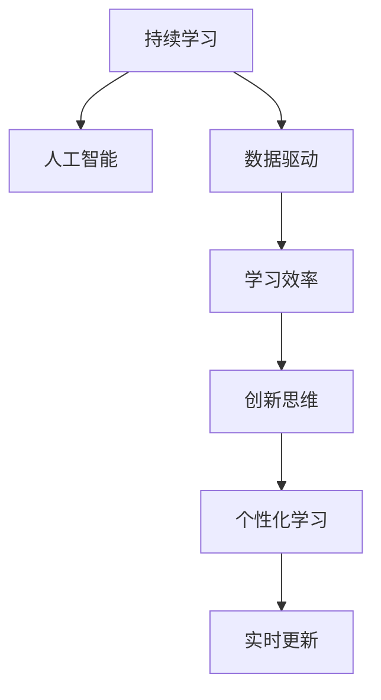

                 

# 持续学习：管理者的核心竞争力

> 关键词：持续学习, 管理者, 人工智能, 决策优化, 数据驱动, 学习效率, 创新思维

## 1. 背景介绍

### 1.1 问题由来

在快速变化的现代社会，管理者面临的环境日趋复杂多变。新市场的不断涌现、技术的不断进步、消费者偏好的快速变迁，都在不断对管理者的决策能力提出更高的要求。在这种背景下，如何提升自身的学习能力，成为管理者永恒的挑战。

过去的几十年里，传统的管理知识体系和经验法则已经逐步失效，管理者必须具备快速适应新环境、灵活应对新挑战的能力。而这种能力，正是通过持续学习所获得的。

### 1.2 问题核心关键点

持续学习的核心在于通过不断的知识更新和技能提升，适应新的环境变化，提高决策的科学性和有效性。在实践中，持续学习需要结合人工智能、数据科学、创新思维等前沿技术，实现高效、有针对性的知识获取与转化。

其关键点包括：
- **数据驱动**：利用数据分析和人工智能技术，识别管理中的关键问题，生成有针对性的学习路径。
- **高效学习**：采用先进的学习方法和工具，提升知识获取效率。
- **创新思维**：鼓励创新、鼓励试错，不断探索和实验新的管理方法。
- **个性化学习**：根据个体的经验背景和需求，定制个性化的学习计划。
- **实时更新**：通过持续的反馈和优化，及时调整学习策略。

### 1.3 问题研究意义

持续学习不仅能够帮助管理者提升自身的决策能力和竞争力，还能带动整个组织的创新力和市场竞争力。通过持续学习，管理者能够及时了解最新的管理理论和技术，灵活应对市场变化，制定更符合市场需求的策略，提升组织的长期竞争优势。

同时，持续学习还强调了个人和组织的终身学习理念，强调知识、技术和能力的不断更新，对促进个人职业发展和组织文化建设具有重要意义。

## 2. 核心概念与联系

### 2.1 核心概念概述

为更好地理解持续学习的管理应用，本节将介绍几个关键的概念：

- **持续学习（Continuous Learning）**：指管理者通过不断的学习和实践，持续提升自身能力的过程。其核心在于持续更新知识和技能，保持与外部环境的同步。

- **人工智能（Artificial Intelligence, AI）**：指模拟人类智能过程，利用机器学习、深度学习等技术，实现智能决策和自动化分析。

- **数据驱动（Data-Driven）**：指基于数据的决策分析方法，通过数据挖掘和统计分析，生成有指导意义的决策建议。

- **学习效率（Learning Efficiency）**：指学习过程中信息获取和转化的效率，包括学习时间、理解深度、应用效果等多个维度。

- **创新思维（Innovation Mindset）**：指管理者在面对新问题和新挑战时，能够保持开放和创新的思维方式，不断探索新的解决方案。

- **个性化学习（Personalized Learning）**：指根据个体的特点和需求，定制个性化的学习路径和方法。

- **实时更新（Real-time Updating）**：指通过不断获取反馈和优化，及时调整学习策略和实践方法。

这些核心概念之间存在密切的联系，共同构成了持续学习的管理框架，帮助管理者在复杂多变的环境中不断提升自身能力，实现更好的决策效果。

### 2.2 核心概念原理和架构的 Mermaid 流程图(Mermaid 流程节点中不要有括号、逗号等特殊字符)



这个流程图展示了持续学习框架的核心概念及其联系：

1. 持续学习通过人工智能技术实现智能决策和分析。
2. 数据驱动为学习提供基于事实的决策支持。
3. 学习效率提升信息获取和转化的效率。
4. 创新思维帮助管理者探索和实验新的管理方法。
5. 个性化学习根据个体特点定制学习路径。
6. 实时更新通过反馈和优化不断调整学习策略。

这些概念共同作用，帮助管理者在快速变化的环境中持续提升自身能力。

## 3. 核心算法原理 & 具体操作步骤

### 3.1 算法原理概述

持续学习的核心在于通过不断的学习和实践，提升自身的能力。其核心思想是：利用数据分析和人工智能技术，从海量数据中识别出有价值的学习机会，生成个性化的学习路径，并通过不断的反馈和优化，不断调整和完善学习策略。

形式化地，假设管理者初始能力为 $C_0$，通过不断的学习和实践，逐步提升至 $C_T$，持续学习过程可以表示为：

$$
C_T = f(C_{t-1}, L_t)
$$

其中 $L_t$ 表示在时间 $t$ 上获取的新知识，$f$ 表示学习函数，描述了学习过程的动态演化。

### 3.2 算法步骤详解

持续学习的具体步骤包括：

**Step 1: 数据收集与分析**

- 收集相关领域的历史数据和最新数据，包括市场数据、消费者行为数据、技术发展数据等。
- 使用数据挖掘和机器学习技术，分析数据的趋势、模式和异常点，识别出管理中的关键问题和机会。
- 生成初步的学习需求清单，确定需要提升的知识领域和技能。

**Step 2: 知识获取与转化**

- 利用人工智能技术，如深度学习、知识图谱、自然语言处理等，从海量的数据和知识库中，提取有价值的知识。
- 将提取的知识进行整理和转化，形成结构化的学习内容，如在线课程、文档、视频等。
- 根据学习需求清单，选择和定制个性化的学习内容，形成学习路径。

**Step 3: 实践与反馈**

- 根据学习路径，安排具体的学习活动和实践机会，如在线课程、工作坊、项目实践等。
- 通过实践检验学习的成果，收集反馈信息，如学习效果、实际应用效果等。
- 根据反馈信息，调整和优化学习策略，确保学习路径的有效性。

**Step 4: 持续优化**

- 定期回顾学习效果，评估知识的掌握程度和应用效果。
- 根据新出现的问题和挑战，不断更新学习需求清单，调整学习路径。
- 通过不断的反馈和优化，实现学习过程的持续改进，提升学习效率和效果。

### 3.3 算法优缺点

持续学习具有以下优点：

- **灵活性高**：通过数据驱动和个性化学习，能够灵活适应不同的管理环境和需求。
- **提升效率**：利用人工智能和数据科学技术，提升知识获取和转化的效率。
- **创新性强**：鼓励创新思维，不断探索和实验新的管理方法，推动组织创新。
- **适应性强**：通过实时更新和反馈机制，保持学习过程与外部环境的同步。

但同时也存在一些缺点：

- **成本较高**：数据收集、知识转化和实践验证等环节需要投入大量资源和成本。
- **需要技术支持**：持续学习依赖于先进的技术工具，对技术能力和资源要求较高。
- **实施难度大**：需要管理者具备较强的学习能力和执行能力，否则难以实现持续学习的效果。

尽管存在这些局限，但就目前而言，持续学习仍然是管理者提升自身竞争力的重要手段。未来相关研究的重点在于如何进一步降低持续学习的成本，提高学习效率，同时兼顾创新性和适应性等因素。

### 3.4 算法应用领域

持续学习的管理应用已经广泛应用于多个领域，如企业战略规划、市场营销、人力资源管理、供应链管理等。具体而言：

- **战略规划**：利用数据分析和人工智能技术，生成基于数据的战略洞察，制定符合市场需求的战略方案。
- **市场营销**：通过市场数据和消费者行为分析，生成个性化的市场营销策略，提升品牌影响力和市场占有率。
- **人力资源管理**：利用员工数据和技能评估，生成个性化的人才培养计划，提升组织的人力资本价值。
- **供应链管理**：通过供应链数据和市场预测，生成优化的供应链策略，提升供应链的效率和稳定性。
- **财务管理**：利用财务数据和市场分析，生成财务预测和风险管理策略，提升组织的财务健康度。

除了这些经典应用外，持续学习还在新兴的领域如人工智能治理、网络安全、可持续发展等得到广泛应用，成为现代企业管理的重要工具。

## 4. 数学模型和公式 & 详细讲解 & 举例说明（备注：数学公式请使用latex格式，latex嵌入文中独立段落使用 $$，段落内使用 $)
### 4.1 数学模型构建

本节将使用数学语言对持续学习的管理过程进行更加严格的刻画。

假设管理者的初始能力为 $C_0$，通过 $T$ 个时间单位的学习，其能力提升至 $C_T$。设每个时间单位获取的新知识为 $L_t$，则持续学习过程可以表示为：

$$
C_T = C_0 + \sum_{t=1}^T L_t
$$

其中 $L_t$ 为时间 $t$ 上的知识增量，可以表示为：

$$
L_t = f(C_{t-1}, D_t)
$$

其中 $D_t$ 表示时间 $t$ 上的数据增量，$f$ 表示知识生成函数，描述了从数据中提取知识的过程。

### 4.2 公式推导过程

以市场营销领域为例，推导持续学习的知识生成函数 $L_t$ 的计算公式。

假设管理者在时间 $t$ 上获取的市场数据为 $D_t$，包括销售数据、客户反馈、市场趋势等。利用机器学习技术，生成市场洞察 $I_t$：

$$
I_t = \text{ML}(D_t)
$$

其中 $\text{ML}$ 表示机器学习模型，可以是回归模型、分类模型、聚类模型等。市场洞察 $I_t$ 可以用于生成新的市场营销策略 $S_t$：

$$
S_t = \text{Marketing Strategy}(I_t)
$$

其中 $\text{Marketing Strategy}$ 表示市场营销策略生成函数，根据市场洞察生成个性化的市场营销方案。

设 $L_t$ 表示时间 $t$ 上的知识增量，则有：

$$
L_t = S_t - S_{t-1}
$$

这表示通过市场营销策略的更新，管理者的市场营销能力得到了提升。

在得到知识生成函数 $L_t$ 的计算公式后，可以将其代入持续学习过程的数学模型，完成整个学习过程的计算。

### 4.3 案例分析与讲解

以某大型零售企业的市场营销团队为例，分析其持续学习过程。

假设该企业的市场营销团队初始的市场营销能力为 $C_0$。在第一个时间单位内，团队收集了最新的销售数据和市场趋势，利用机器学习技术生成市场洞察 $I_1$，生成新的市场营销策略 $S_1$，更新市场营销能力至 $C_1$。

在第二个时间单位内，团队再次收集新的市场数据和客户反馈，生成新的市场洞察 $I_2$，更新市场营销策略 $S_2$，更新市场营销能力至 $C_2$。

通过不断的知识获取和转化，市场营销团队的市场营销能力不断提升，能够更好地适应市场变化，制定符合市场需求的策略。

## 5. 项目实践：代码实例和详细解释说明
### 5.1 开发环境搭建

在进行持续学习实践前，我们需要准备好开发环境。以下是使用Python进行数据分析和机器学习的开发环境配置流程：

1. 安装Anaconda：从官网下载并安装Anaconda，用于创建独立的Python环境。

2. 创建并激活虚拟环境：
```bash
conda create -n py3k python=3.8 
conda activate py3k
```

3. 安装必要的Python包：
```bash
pip install numpy pandas scikit-learn matplotlib seaborn statsmodels
```

4. 安装Jupyter Notebook：
```bash
pip install jupyter notebook
```

5. 配置Jupyter Notebook环境：
```bash
jupyter notebook --pylab
```

完成上述步骤后，即可在`py3k`环境中开始持续学习的开发实践。

### 5.2 源代码详细实现

下面我们以市场营销团队的市场洞察生成过程为例，给出使用Python进行数据分析和机器学习的代码实现。

首先，定义市场数据和特征：

```python
import pandas as pd
import numpy as np

# 读取市场数据
data = pd.read_csv('sales_data.csv')

# 定义特征
features = ['Sales', 'Cost', 'Customer Feedback', 'Market Trend']
```

然后，进行数据预处理和探索性分析：

```python
# 数据预处理
data = data.fillna(data.mean()).dropna()

# 探索性分析
data.describe()
```

接着，构建机器学习模型并进行训练：

```python
from sklearn.linear_model import LinearRegression
from sklearn.ensemble import RandomForestRegressor
from sklearn.metrics import mean_squared_error

# 构建模型
model = RandomForestRegressor()

# 训练模型
model.fit(data[features], data['Sales'])

# 评估模型
mse = mean_squared_error(data['Sales'], model.predict(data[features]))
print(f'Mean Squared Error: {mse:.2f}')
```

最后，生成市场洞察并应用于市场营销策略：

```python
from sklearn.decomposition import PCA

# 特征降维
pca = PCA(n_components=2)
data_pca = pca.fit_transform(data[features])

# 生成市场洞察
insight = model.predict(data_pca)

# 应用洞察
strategy = generate_marketing_strategy(insight)
```

以上是使用Python对市场营销团队进行持续学习的代码实现。可以看到，利用数据分析和机器学习技术，能够从海量市场数据中提取有价值的知识，生成个性化的市场营销策略，提升市场营销能力。

### 5.3 代码解读与分析

让我们再详细解读一下关键代码的实现细节：

**数据预处理**：
- 使用pandas库进行数据读取、缺失值填充和删除。
- 使用均值填充缺失值，确保数据完整性。
- 使用降维技术如PCA，将高维数据转换为低维表示，简化分析过程。

**模型训练**：
- 使用scikit-learn库构建随机森林回归模型。
- 使用交叉验证等技术评估模型性能，如均方误差。
- 通过不断调整模型参数，优化模型性能。

**市场洞察生成**：
- 使用机器学习模型如随机森林回归器，从市场数据中生成市场洞察。
- 将洞察数据转换为低维表示，便于应用和解释。

**市场营销策略生成**：
- 使用自定义函数 `generate_marketing_strategy`，根据洞察数据生成市场营销策略。
- 根据市场洞察制定个性化的市场营销方案，提升市场营销能力。

可以看到，通过数据分析和机器学习技术，市场营销团队能够从大量的市场数据中提取有价值的知识，生成个性化的市场营销策略，从而提升市场营销能力。

当然，实际的持续学习系统需要考虑更多因素，如数据源的多样性、模型的可解释性、策略的灵活性等。但核心的持续学习范式基本与此类似。

## 6. 实际应用场景
### 6.1 企业管理创新

持续学习在企业管理创新中的应用广泛。通过持续学习，企业管理者能够不断更新知识，吸收最新的管理理论和技术，提升自身的决策能力和创新思维。具体而言：

- **战略决策**：利用数据分析和机器学习技术，生成基于数据的战略洞察，制定符合市场需求的战略方案。
- **产品创新**：通过市场数据和消费者行为分析，生成个性化的产品设计方案，提升产品竞争力。
- **流程优化**：利用业务数据和供应链分析，生成优化的业务流程，提升运营效率。
- **人才培养**：利用员工数据和技能评估，生成个性化的人才培养计划，提升组织的人力资本价值。

持续学习帮助企业管理者不断适应新环境，灵活应对新挑战，推动企业创新和可持续发展。

### 6.2 组织文化建设

持续学习对于组织文化建设具有重要意义。通过持续学习，组织能够营造终身学习的氛围，鼓励员工不断提升自身能力，形成积极向上的企业文化。具体而言：

- **知识共享**：通过定期的学习活动和知识分享，促进知识在组织内部的传播和应用。
- **创新激励**：设立创新奖项和激励机制，鼓励员工进行创新尝试和实践。
- **文化认同**：将持续学习的理念融入组织文化，形成积极向上的文化氛围，提升员工的工作热情和满意度。

持续学习不仅提升了员工的能力，还营造了积极向上的企业文化，推动组织的长期发展。

### 6.3 技术迭代与升级

持续学习在技术迭代与升级中也发挥着重要作用。通过持续学习，技术团队能够不断更新技术栈，吸收最新的技术趋势，保持技术的领先性。具体而言：

- **技术评估**：通过技术评估和市场分析，识别出关键技术和新兴技术，形成技术路线图。
- **技术应用**：根据技术路线图，制定技术应用计划，引入新技术和新方法。
- **技术优化**：利用数据驱动和持续学习，不断优化技术方案，提升技术性能和应用效果。

持续学习帮助技术团队保持技术的领先性，提升技术产品的竞争力和市场占有率。

### 6.4 未来应用展望

随着技术的不断进步和应用场景的不断扩展，持续学习在企业管理中的应用前景更加广阔。未来，持续学习将进一步结合人工智能、大数据、物联网等前沿技术，实现更加智能、高效的管理决策。

在智慧城市、智能制造、智能物流等领域，持续学习将发挥更大的作用。例如：

- **智慧城市**：通过持续学习，城市管理者能够实时掌握城市运行状况，优化城市管理决策，提升城市运行效率。
- **智能制造**：通过持续学习，制造企业能够实时调整生产流程，优化资源配置，提升产品质量和生产效率。
- **智能物流**：通过持续学习，物流企业能够实时掌握货物状态，优化物流路径，提升配送效率。

总之，持续学习将在更多领域得到应用，推动管理决策的智能化、高效化，实现企业的可持续发展。

## 7. 工具和资源推荐
### 7.1 学习资源推荐

为了帮助开发者系统掌握持续学习的理论基础和实践技巧，这里推荐一些优质的学习资源：

1. 《持续学习的科学与艺术》系列博文：由管理大师撰写，深入浅出地介绍了持续学习的原理、方法和案例。

2. CS350《数据分析与机器学习》课程：麻省理工学院开设的管理学经典课程，涵盖数据分析、机器学习等基础知识，是系统学习持续学习的绝佳资源。

3. 《持续学习与创新》书籍：系统介绍了持续学习的管理理念、技术和实践，适合管理者阅读。

4. 《机器学习实战》书籍：讲解了机器学习的基本概念和实践方法，是学习数据分析和机器学习的入门书籍。

5. 《数据驱动的决策分析》书籍：介绍了数据驱动决策分析的基本方法，适合管理者了解。

通过对这些资源的学习实践，相信你一定能够快速掌握持续学习的精髓，并用于解决实际的管理问题。
###  7.2 开发工具推荐

高效的开发离不开优秀的工具支持。以下是几款用于持续学习开发的常用工具：

1. Jupyter Notebook：免费的在线数据分析工具，支持Python等语言的开发和分析，适合初学者和研究人员使用。

2. TensorBoard：谷歌推出的可视化工具，实时监测模型训练状态，并提供丰富的图表呈现方式，是调试模型的得力助手。

3. Weights & Biases：模型训练的实验跟踪工具，可以记录和可视化模型训练过程中的各项指标，方便对比和调优。

4. Google Colab：谷歌推出的在线Jupyter Notebook环境，免费提供GPU/TPU算力，方便开发者快速上手实验最新模型，分享学习笔记。

合理利用这些工具，可以显著提升持续学习的开发效率，加快创新迭代的步伐。

### 7.3 相关论文推荐

持续学习的管理应用源于学界的持续研究。以下是几篇奠基性的相关论文，推荐阅读：

1. 《数据驱动的决策分析方法》：介绍了数据驱动决策分析的基本方法，是管理科学的重要文献。

2. 《持续学习与组织创新》：探讨了持续学习对组织创新的影响，提出了基于持续学习的创新管理模型。

3. 《人工智能与组织变革》：分析了人工智能对组织变革的影响，提出了基于人工智能的持续学习模型。

4. 《大数据与创新管理》：探讨了大数据在创新管理中的应用，提出了基于大数据的持续学习模型。

5. 《持续学习与创新思维》：探讨了持续学习对创新思维的影响，提出了基于持续学习的创新思维模型。

这些论文代表了大规模持续学习技术的发展脉络。通过学习这些前沿成果，可以帮助研究者把握学科前进方向，激发更多的创新灵感。

## 8. 总结：未来发展趋势与挑战

### 8.1 总结

本文对持续学习的管理应用进行了全面系统的介绍。首先阐述了持续学习在快速变化环境下的重要性，明确了持续学习在提升决策能力和创新思维方面的独特价值。其次，从原理到实践，详细讲解了持续学习的基本框架和方法，给出了持续学习任务开发的完整代码实例。同时，本文还广泛探讨了持续学习在企业管理、组织文化、技术迭代等多个领域的应用前景，展示了持续学习的巨大潜力。此外，本文精选了持续学习的各类学习资源，力求为读者提供全方位的技术指引。

通过本文的系统梳理，可以看到，持续学习已经成为企业管理的重要手段，极大地提升了管理者的决策能力和竞争力。未来，伴随持续学习技术的不断演进，在人工智能、大数据、物联网等技术支持下，持续学习将推动管理决策的智能化、高效化，实现企业的可持续发展。

### 8.2 未来发展趋势

展望未来，持续学习的管理应用将呈现以下几个发展趋势：

1. **技术智能化**：持续学习将进一步结合人工智能、大数据、物联网等前沿技术，实现更加智能、高效的管理决策。
2. **数据驱动**：利用大数据和机器学习技术，生成基于数据的战略洞察，制定符合市场需求的决策方案。
3. **创新激励**：通过创新激励和创新文化建设，促进员工进行持续学习和创新尝试。
4. **个性化学习**：根据个体的特点和需求，定制个性化的学习路径和方法，提升学习效率。
5. **实时更新**：通过不断获取反馈和优化，及时调整学习策略和实践方法，保持学习过程与外部环境的同步。

以上趋势凸显了持续学习在企业管理中的应用前景。这些方向的探索发展，必将进一步提升企业的决策能力和竞争力，推动企业的长期发展。

### 8.3 面临的挑战

尽管持续学习已经取得了瞩目成就，但在迈向更加智能化、普适化应用的过程中，它仍面临着诸多挑战：

1. **数据质量问题**：持续学习依赖于高质量的数据，但数据的真实性和完整性往往难以保证，数据质量问题成为制约学习效果的瓶颈。
2. **技术复杂性**：持续学习涉及数据分析、机器学习、数据可视化等多个领域，技术复杂性较高，对技术能力和资源要求较高。
3. **学习成本高**：持续学习需要投入大量的时间和资源，进行数据收集、模型训练和策略优化，学习成本较高。
4. **人员培训难**：持续学习需要员工具备较强的学习能力和执行能力，但很多员工可能缺乏相关知识和技能，培训难度较大。
5. **文化差异**：不同组织和企业可能存在文化差异，持续学习的理念和实践方式可能难以统一。

正视持续学习面临的这些挑战，积极应对并寻求突破，将是大规模持续学习走向成熟的必由之路。

### 8.4 研究展望

面对持续学习面临的种种挑战，未来的研究需要在以下几个方面寻求新的突破：

1. **数据质量提升**：通过数据清洗、数据增强等技术，提升数据质量，保证学习过程的可靠性和有效性。
2. **技术标准化**：制定持续学习的技术标准和流程规范，降低技术复杂性，提升学习效率。
3. **学习成本优化**：通过自动化、智能化技术，降低持续学习的成本，提升学习效率。
4. **人员培训机制**：建立持续学习的培训机制和激励机制，提升员工的学习能力和执行能力。
5. **文化融合**：通过组织文化建设，将持续学习的理念融入企业文化，形成统一的持续学习实践方式。

这些研究方向的探索，必将引领持续学习技术迈向更高的台阶，为构建智能、高效、创新的企业管理体系铺平道路。

## 9. 附录：常见问题与解答

**Q1：如何选择合适的持续学习方法和工具？**

A: 选择持续学习方法和工具需要考虑多个因素，如数据类型、学习目标、组织文化等。一般而言，可以根据以下步骤进行选择：
1. 确定学习目标：明确需要提升的能力和技能，如决策能力、创新思维、技术能力等。
2. 选择学习方法：根据学习目标，选择适合的持续学习方法和技术，如数据驱动、个性化学习、技术迭代等。
3. 选择工具：选择适合的技术工具，如Python、Jupyter Notebook、TensorBoard等，保证持续学习的顺利实施。

**Q2：如何评估持续学习的效果？**

A: 评估持续学习的效果需要从多个维度进行，如知识掌握程度、技能提升效果、决策能力提升等。具体评估方法包括：
1. 知识测试：通过考试、测试题等方式，评估学习者对知识点的掌握程度。
2. 技能评估：通过实际操作、项目评审等方式，评估学习者技能的提升效果。
3. 绩效评估：通过工作绩效、创新成果等方式，评估学习者决策能力、创新能力的提升效果。
4. 反馈反馈：通过学习者反馈、员工评价等方式，了解学习者对持续学习的满意度和效果。

**Q3：如何平衡持续学习和日常工作？**

A: 平衡持续学习和日常工作需要合理安排时间，提升学习效率，具体方法包括：
1. 制定学习计划：根据工作任务和学习目标，制定合理的学习计划，确保学习时间和工作时间的平衡。
2. 利用碎片时间：利用碎片时间进行学习，如午休时间、通勤时间等，提升学习效率。
3. 与工作结合：将学习内容与工作任务相结合，提升学习效果，如通过学习新技术，优化工作流程。
4. 合理安排休息：合理安排学习和休息时间，避免过度疲劳，保持学习状态和工作状态。

通过科学安排时间，平衡持续学习和日常工作，管理者可以更好地提升自身能力和工作绩效。

---

作者：禅与计算机程序设计艺术 / Zen and the Art of Computer Programming

