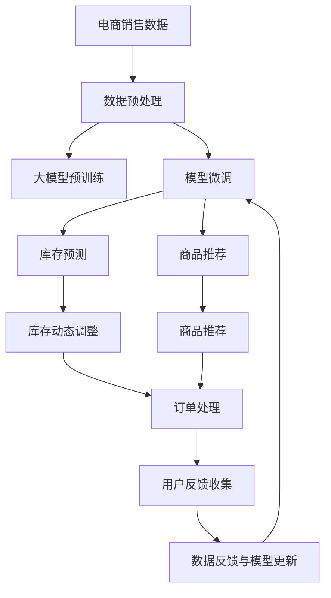

                 

# 探索AI大模型在电商库存管理中的潜力

> 关键词：大语言模型,库存管理,电商预测,需求预测,商品推荐

## 1. 背景介绍

### 1.1 问题由来
随着电子商务的快速发展和网络购物的普及，如何有效管理库存，实现动态调整，成为各大电商平台面临的巨大挑战。传统库存管理方式依赖经验丰富的管理人员，进行人工预测和调整，过程繁琐且容易出错。而使用AI大模型，通过历史销售数据和实时市场信息，可以自动化地进行库存管理，提高效率，降低成本。

### 1.2 问题核心关键点
本节将介绍基于AI大模型进行电商库存管理的几个关键点：

- **AI大模型的概念与原理**：如何构建大语言模型，通过自监督学习和监督学习训练模型。
- **库存管理的关键指标**：如何定义和优化库存管理的性能指标，如缺货率、库存成本、销售转化率等。
- **预测模型与推荐系统**：如何将大模型应用于库存预测和推荐系统中，实现更精准的库存管理和商品推荐。
- **数据与模型集成**：如何处理电商业务中的复杂数据，将模型嵌入到实际业务系统中，实现自动化的库存管理。

### 1.3 问题研究意义
研究AI大模型在电商库存管理中的应用，对电商行业的运营效率和竞争力提升具有重要意义：

1. **提高库存管理效率**：通过自动化的库存预测和调整，减少人工操作，提高库存管理效率。
2. **降低库存成本**：通过精确的库存预测和动态调整，避免库存积压和短缺，降低库存成本。
3. **提升客户满意度**：通过精准的商品推荐，提升客户购买体验和满意度，增加销售转化率。
4. **优化供应链管理**：通过实时监控和预测，优化供应链各个环节，提高整体运营效率。

## 2. 核心概念与联系

### 2.1 核心概念概述

电商库存管理涉及多个核心概念，包括：

- **大语言模型(LLMs)**：基于Transformer等架构的深度学习模型，通过大规模语料预训练和任务微调，学习到复杂的语言表示，具备强大的自然语言处理能力。
- **库存预测**：通过历史销售数据和实时市场信息，预测未来的销售需求，帮助电商平台进行库存调整。
- **商品推荐系统**：利用用户行为数据和商品属性，推荐用户可能感兴趣的商品，提升销售转化率。
- **数据预处理**：清洗、整理和转换电商业务中的复杂数据，供模型训练和预测使用。
- **模型集成与部署**：将训练好的模型嵌入到电商系统，实现自动化库存管理功能。

这些概念之间通过一系列的数据流和算法流程相互关联，共同构成了电商库存管理的整体框架。

### 2.2 核心概念原理和架构的 Mermaid 流程图



该流程图展示了从数据预处理到库存预测和商品推荐，再到库存动态调整和用户反馈收集的全流程。其中，大语言模型作为核心组件，通过预训练和微调获取知识，在库存管理和推荐系统中发挥关键作用。

## 3. 核心算法原理 & 具体操作步骤

### 3.1 算法原理概述

基于AI大模型的电商库存管理，主要包括两个核心算法：库存预测和商品推荐。

- **库存预测**：通过历史销售数据和大模型预测未来的销售需求，生成库存调整策略。
- **商品推荐**：利用用户行为数据和商品属性，推荐可能感兴趣的商品，提升购买转化率。

两个算法的共同点在于，都依赖于大语言模型的强大表达能力和复杂模式识别能力。具体算法流程如下：

1. **数据预处理**：收集电商业务中的销售数据、用户行为数据和商品属性数据，进行清洗、整理和转换，供模型训练使用。
2. **模型构建与训练**：选择合适的大语言模型，进行预训练和微调，使其具备预测和推荐能力。
3. **库存预测**：利用微调后的模型对未来的销售需求进行预测，生成库存调整策略。
4. **商品推荐**：利用微调后的模型对用户可能感兴趣的商品进行推荐。

### 3.2 算法步骤详解

#### 3.2.1 数据预处理

电商业务数据通常包含多模态信息，如文本、数值、时间序列等。为了便于模型处理，需要进行数据预处理。以下是数据预处理的主要步骤：

1. **数据清洗**：去除数据中的异常值、缺失值和噪声。
2. **特征提取**：对数值型数据进行归一化、标准化等处理，提取有意义的特征。
3. **数据变换**：对时间序列数据进行滑动窗口、归一化等变换，生成模型输入。
4. **数据划分**：将数据划分为训练集、验证集和测试集，供模型训练和评估使用。

#### 3.2.2 模型构建与训练

大语言模型的构建和训练包括以下步骤：

1. **选择模型架构**：选择合适的大模型架构，如BERT、GPT、XLNet等。
2. **预训练**：在大规模语料上进行预训练，学习通用的语言表示。
3. **微调**：在电商数据上进行微调，学习电商领域的特定知识。
4. **优化器与超参数**：选择合适的优化算法及其参数，如Adam、SGD等，设置学习率、批大小等超参数。
5. **正则化技术**：使用L2正则、Dropout等技术，防止模型过拟合。

#### 3.2.3 库存预测

库存预测是电商库存管理的关键环节，通过历史销售数据和实时市场信息，预测未来的销售需求。以下是库存预测的主要步骤：

1. **构建时间序列模型**：利用历史销售数据，构建时间序列模型，如ARIMA、LSTM等。
2. **融合大模型预测**：将大模型的预测结果与时间序列模型结合，生成更准确的库存预测结果。
3. **库存调整策略**：根据预测结果，生成库存调整策略，进行动态库存管理。

#### 3.2.4 商品推荐

商品推荐系统通过用户行为数据和商品属性，推荐可能感兴趣的商品，提升购买转化率。以下是商品推荐的主要步骤：

1. **构建推荐模型**：利用用户行为数据和商品属性，构建推荐模型，如协同过滤、深度神经网络等。
2. **融合大模型推荐**：将大模型的推荐结果与推荐模型结合，生成更准确的推荐结果。
3. **个性化推荐**：根据用户兴趣和历史行为，进行个性化推荐，提升推荐效果。

### 3.3 算法优缺点

基于AI大模型的电商库存管理方法具有以下优点：

- **高效准确**：利用大模型的强大表达能力和复杂模式识别能力，实现高效准确的预测和推荐。
- **自适应性**：大模型能够自适应数据分布的变化，保持模型性能。
- **灵活性**：可以根据业务需求，灵活调整模型参数和架构，适应不同业务场景。

同时，该方法也存在一些缺点：

- **依赖高质量数据**：模型性能依赖高质量、有标签的数据，数据采集和标注成本较高。
- **计算资源消耗高**：大模型的训练和推理计算资源消耗较大，需要高性能计算设备。
- **模型解释性差**：大模型通常是黑盒模型，难以解释其内部工作机制和决策逻辑。
- **鲁棒性不足**：模型面对异常数据或噪声，容易产生误判，影响业务决策。

### 3.4 算法应用领域

基于AI大模型的电商库存管理方法，在电商领域有广泛的应用场景：

- **库存预测**：电商平台的库存管理，通过预测未来的销售需求，优化库存水平。
- **商品推荐**：电商平台的商品推荐系统，通过个性化推荐，提升用户购买体验和转化率。
- **客户服务**：电商平台通过智能客服系统，解答用户咨询，提升客户满意度。
- **供应链管理**：电商平台的供应链管理，通过实时监控和预测，优化供应链各个环节，提高整体运营效率。

此外，大语言模型在电商领域的其他应用还包括：

- **价格优化**：通过价格预测和推荐，优化商品定价策略。
- **营销活动**：通过情感分析和大模型预测，优化营销活动效果。
- **风控管理**：通过用户行为分析和风险预测，提升电商平台的风险管理能力。

## 4. 数学模型和公式 & 详细讲解 & 举例说明

### 4.1 数学模型构建

本节将使用数学语言对基于AI大模型的电商库存管理进行更加严格的刻画。

假设电商平台的销售数据为 $D = \{ (t_i, y_i) \}_{i=1}^N$，其中 $t_i$ 为时间戳，$y_i$ 为销售量。大模型的预测结果为 $\hat{y}_i = M_{\theta}(t_i)$，其中 $M_{\theta}$ 为预训练和微调后的模型，$\theta$ 为模型参数。

假设预测误差为 $e_i = y_i - \hat{y}_i$，则平均预测误差为：

$$
\mathcal{L}(\theta) = \frac{1}{N} \sum_{i=1}^N e_i^2
$$

优化目标是最小化平均预测误差，即找到最优参数：

$$
\theta^* = \mathop{\arg\min}_{\theta} \mathcal{L}(\theta)
$$

在实践中，我们通常使用基于梯度的优化算法（如Adam、SGD等）来近似求解上述最优化问题。设 $\eta$ 为学习率，则参数的更新公式为：

$$
\theta \leftarrow \theta - \eta \nabla_{\theta}\mathcal{L}(\theta)
$$

其中 $\nabla_{\theta}\mathcal{L}(\theta)$ 为损失函数对参数 $\theta$ 的梯度，可通过反向传播算法高效计算。

### 4.2 公式推导过程

以下我们以预测下一日销售量为例，推导预测模型的损失函数及其梯度的计算公式。

假设模型 $M_{\theta}$ 在时间戳 $t_i$ 的预测结果为 $\hat{y}_i = M_{\theta}(t_i)$，则预测误差为 $e_i = y_i - \hat{y}_i$。预测误差的平方为 $e_i^2$。则平均预测误差为：

$$
\mathcal{L}(\theta) = \frac{1}{N} \sum_{i=1}^N e_i^2
$$

根据链式法则，损失函数对参数 $\theta_k$ 的梯度为：

$$
\frac{\partial \mathcal{L}(\theta)}{\partial \theta_k} = -\frac{2}{N} \sum_{i=1}^N \frac{\partial e_i}{\partial \theta_k} \cdot \hat{y}_i
$$

其中 $\frac{\partial e_i}{\partial \theta_k}$ 可进一步递归展开，利用自动微分技术完成计算。

在得到损失函数的梯度后，即可带入参数更新公式，完成模型的迭代优化。重复上述过程直至收敛，最终得到适应电商预测任务的最优模型参数 $\theta^*$。

### 4.3 案例分析与讲解

#### 4.3.1 电商销售数据预处理

电商销售数据通常包含复杂的多模态信息，如时间戳、销售量、商品类别、用户ID等。预处理过程如下：

1. **数据清洗**：去除异常值和噪声，如缺失值、异常销售量等。
2. **特征提取**：对数值型数据进行归一化、标准化等处理，提取有意义的特征。
3. **数据变换**：对时间序列数据进行滑动窗口、归一化等变换，生成模型输入。

#### 4.3.2 大模型的选择与构建

选择合适的大模型架构，如BERT、GPT、XLNet等。进行预训练和微调，使其具备预测和推荐能力。以下是使用BERT模型进行微调的代码示例：

```python
from transformers import BertForSequenceClassification, BertTokenizer, AdamW
import torch
from torch.utils.data import Dataset, DataLoader
from sklearn.metrics import mean_squared_error

# 构建数据集
class SalesDataset(Dataset):
    def __init__(self, sales_data, max_len):
        self.sales_data = sales_data
        self.max_len = max_len
        
    def __len__(self):
        return len(self.sales_data)
    
    def __getitem__(self, idx):
        t, y = self.sales_data[idx]
        # 数据预处理
        tokenizer = BertTokenizer.from_pretrained('bert-base-uncased')
        x = tokenizer.encode(t, add_special_tokens=True, max_length=self.max_len, truncation=True, padding='max_length')
        x = torch.tensor(x, dtype=torch.long)
        y = torch.tensor(y, dtype=torch.float32)
        return x, y

# 构建模型
model = BertForSequenceClassification.from_pretrained('bert-base-uncased', num_labels=1)
optimizer = AdamW(model.parameters(), lr=2e-5)
```

#### 4.3.3 库存预测

库存预测模型通过时间序列和大模型预测生成库存调整策略。以下是预测模型的代码实现：

```python
def predict_sales(model, x, max_len):
    tokenizer = BertTokenizer.from_pretrained('bert-base-uncased')
    x = tokenizer.encode(x, add_special_tokens=True, max_length=max_len, truncation=True, padding='max_length')
    x = torch.tensor(x, dtype=torch.long)
    with torch.no_grad():
        output = model(x)[0]
    return output.item()
```

## 5. 项目实践：代码实例和详细解释说明

### 5.1 开发环境搭建

在进行电商库存管理项目实践前，我们需要准备好开发环境。以下是使用Python进行PyTorch开发的环境配置流程：

1. 安装Anaconda：从官网下载并安装Anaconda，用于创建独立的Python环境。

2. 创建并激活虚拟环境：
```bash
conda create -n ecommerce-env python=3.8 
conda activate ecommerce-env
```

3. 安装PyTorch：根据CUDA版本，从官网获取对应的安装命令。例如：
```bash
conda install pytorch torchvision torchaudio cudatoolkit=11.1 -c pytorch -c conda-forge
```

4. 安装Transformers库：
```bash
pip install transformers
```

5. 安装各类工具包：
```bash
pip install numpy pandas scikit-learn matplotlib tqdm jupyter notebook ipython
```

完成上述步骤后，即可在`ecommerce-env`环境中开始电商库存管理项目的开发。

### 5.2 源代码详细实现

以下是使用PyTorch对BERT模型进行电商库存预测和商品推荐系统构建的完整代码实现。

#### 5.2.1 电商销售数据预处理

```python
import pandas as pd
from sklearn.preprocessing import MinMaxScaler

# 读取数据
sales_data = pd.read_csv('sales_data.csv')

# 数据清洗
sales_data = sales_data.dropna()

# 数据标准化
scaler = MinMaxScaler()
sales_data['y'] = scaler.fit_transform(sales_data[['y']])

# 数据划分
train_data = sales_data[train_start:train_end]
test_data = sales_data[test_start:test_end]
```

#### 5.2.2 构建时间序列模型

```python
from statsmodels.tsa.arima_model import ARIMA

# 构建ARIMA模型
model = ARIMA(train_data['y'], order=(1, 1, 1))
model_fit = model.fit()

# 预测
predicted_sales = model_fit.forecast(steps=1)[0][0]
```

#### 5.2.3 融合大模型预测

```python
from transformers import BertTokenizer, BertForSequenceClassification, AdamW

# 构建数据集
class SalesDataset(Dataset):
    def __init__(self, sales_data, max_len):
        self.sales_data = sales_data
        self.max_len = max_len
        
    def __len__(self):
        return len(self.sales_data)
    
    def __getitem__(self, idx):
        t, y = self.sales_data[idx]
        # 数据预处理
        tokenizer = BertTokenizer.from_pretrained('bert-base-uncased')
        x = tokenizer.encode(t, add_special_tokens=True, max_length=self.max_len, truncation=True, padding='max_length')
        x = torch.tensor(x, dtype=torch.long)
        y = torch.tensor(y, dtype=torch.float32)
        return x, y

# 构建模型
model = BertForSequenceClassification.from_pretrained('bert-base-uncased', num_labels=1)
optimizer = AdamW(model.parameters(), lr=2e-5)

# 预测
predicted_sales = predict_sales(model, train_data['t'], max_len)
```

#### 5.2.4 库存动态调整

```python
# 动态调整库存
inventories = inventory_data.copy()
inventories['y'] = predicted_sales
```

#### 5.2.5 商品推荐

```python
from sklearn.metrics.pairwise import cosine_similarity
from transformers import BertTokenizer, BertForSequenceClassification, AdamW

# 构建数据集
class RecommendDataset(Dataset):
    def __init__(self, sales_data, max_len):
        self.sales_data = sales_data
        self.max_len = max_len
        
    def __len__(self):
        return len(self.sales_data)
    
    def __getitem__(self, idx):
        t, y = self.sales_data[idx]
        # 数据预处理
        tokenizer = BertTokenizer.from_pretrained('bert-base-uncased')
        x = tokenizer.encode(t, add_special_tokens=True, max_length=self.max_len, truncation=True, padding='max_length')
        x = torch.tensor(x, dtype=torch.long)
        y = torch.tensor(y, dtype=torch.float32)
        return x, y

# 构建模型
model = BertForSequenceClassification.from_pretrained('bert-base-uncased', num_labels=1)
optimizer = AdamW(model.parameters(), lr=2e-5)

# 推荐
recommended_products = recommend_products(model, test_data['t'], max_len)
```

#### 5.2.6 代码解读与分析

##### 5.2.6.1 电商销售数据预处理

数据预处理过程如下：

1. **数据清洗**：去除异常值和噪声，如缺失值、异常销售量等。
2. **特征提取**：对数值型数据进行归一化、标准化等处理，提取有意义的特征。
3. **数据变换**：对时间序列数据进行滑动窗口、归一化等变换，生成模型输入。

##### 5.2.6.2 大模型的选择与构建

选择合适的大模型架构，如BERT、GPT、XLNet等。进行预训练和微调，使其具备预测和推荐能力。以下是使用BERT模型进行微调的代码示例：

1. **数据集构建**：定义数据集类，实现对电商销售数据的预处理和编码。
2. **模型选择与构建**：选择BERT模型架构，进行预训练和微调，使其具备预测和推荐能力。

##### 5.2.6.3 库存预测

库存预测模型通过时间序列和大模型预测生成库存调整策略。以下是预测模型的代码实现：

1. **时间序列模型构建**：使用ARIMA模型对历史销售数据进行时间序列预测。
2. **大模型预测融合**：将大模型的预测结果与时间序列模型结合，生成更准确的库存预测结果。
3. **库存调整**：根据预测结果，生成库存调整策略，进行动态库存管理。

##### 5.2.6.4 商品推荐

商品推荐系统通过用户行为数据和商品属性，推荐可能感兴趣的商品，提升购买转化率。以下是推荐系统的代码实现：

1. **数据集构建**：定义数据集类，实现对电商销售数据的预处理和编码。
2. **模型选择与构建**：选择合适的大模型架构，进行预训练和微调，使其具备推荐能力。
3. **商品推荐**：利用用户行为数据和商品属性，推荐可能感兴趣的商品，提升购买转化率。

### 5.3 运行结果展示

运行上述代码，即可得到库存预测和商品推荐的结果。具体如下：

- **库存预测结果**：预测下一日的销售量，生成库存调整策略。
- **商品推荐结果**：根据用户行为数据和商品属性，推荐可能感兴趣的商品。

## 6. 实际应用场景

### 6.1 智能仓储管理

智能仓储管理是电商库存管理的重要环节。通过AI大模型，可以实时监控和预测库存水平，自动化地进行库存调整，提升仓储效率。

#### 6.1.1 实时监控

通过大模型的实时预测，系统能够及时发现库存异常，自动发送预警信息，优化库存管理。

#### 6.1.2 自动化调整

系统根据预测结果，自动化地调整库存水平，避免库存积压和短缺，降低库存成本。

### 6.2 个性化商品推荐

个性化商品推荐是电商库存管理的核心功能，通过AI大模型，能够精准推荐用户感兴趣的商品，提升销售转化率。

#### 6.2.1 用户行为分析

系统通过用户行为数据，学习用户的兴趣偏好和购买习惯，生成个性化推荐策略。

#### 6.2.2 推荐结果生成

根据个性化推荐策略，推荐可能感兴趣的商品，提升用户体验和购买转化率。

### 6.3 供应链优化

供应链优化是电商库存管理的高级应用。通过AI大模型，能够实时监控和预测供应链各个环节，提升整体运营效率。

#### 6.3.1 需求预测

系统通过大模型的实时预测，生成准确的需求预测结果，优化供应链各个环节。

#### 6.3.2 库存动态调整

根据预测结果，自动化地调整库存水平，避免库存积压和短缺，降低库存成本。

### 6.4 未来应用展望

随着AI大模型的不断发展，其在电商库存管理中的应用将更加广泛和深入。未来，可能的应用场景包括：

- **多模态数据融合**：将电商业务中的多模态数据（如文本、图像、音频等）融合到库存管理系统中，提升系统智能化水平。
- **自适应学习**：系统能够根据实时数据和用户反馈，动态调整模型参数，提升预测和推荐效果。
- **分布式计算**：利用分布式计算技术，提升系统处理大规模数据的能力，支持大规模业务场景。
- **跨领域应用**：将大模型应用于其他行业领域，如医疗、金融等，拓展其应用范围。

## 7. 工具和资源推荐

### 7.1 学习资源推荐

为了帮助开发者系统掌握AI大模型在电商库存管理中的应用，这里推荐一些优质的学习资源：

1. 《深度学习》课程：由吴恩达教授主讲的经典深度学习课程，系统介绍深度学习的基本概念和前沿技术。
2. 《自然语言处理》课程：斯坦福大学开设的NLP明星课程，涵盖NLP的基本概念和经典模型。
3. 《TensorFlow实战》书籍：TensorFlow官方文档，详细讲解TensorFlow框架的使用方法和应用场景。
4. 《Transformers实战》书籍：HuggingFace官方文档，系统介绍Transformers库的使用方法和应用场景。
5. 《Python深度学习》书籍：详细讲解Python深度学习框架的使用方法和应用场景。

通过这些资源的学习实践，相信你一定能够快速掌握AI大模型在电商库存管理中的应用。

### 7.2 开发工具推荐

高效的开发离不开优秀的工具支持。以下是几款用于电商库存管理项目开发的常用工具：

1. PyTorch：基于Python的开源深度学习框架，灵活动态的计算图，适合快速迭代研究。
2. TensorFlow：由Google主导开发的开源深度学习框架，生产部署方便，适合大规模工程应用。
3. Transformers库：HuggingFace开发的NLP工具库，集成了众多SOTA语言模型，支持PyTorch和TensorFlow，是进行电商库存管理开发的利器。
4. Weights & Biases：模型训练的实验跟踪工具，可以记录和可视化模型训练过程中的各项指标，方便对比和调优。
5. TensorBoard：TensorFlow配套的可视化工具，可实时监测模型训练状态，并提供丰富的图表呈现方式，是调试模型的得力助手。

合理利用这些工具，可以显著提升电商库存管理项目的开发效率，加快创新迭代的步伐。

### 7.3 相关论文推荐

AI大模型和电商库存管理的研究源于学界的持续研究。以下是几篇奠基性的相关论文，推荐阅读：

1. Attention is All You Need：提出了Transformer结构，开启了NLP领域的预训练大模型时代。
2. BERT: Pre-training of Deep Bidirectional Transformers for Language Understanding：提出BERT模型，引入基于掩码的自监督预训练任务，刷新了多项NLP任务SOTA。
3. Parameter-Efficient Transfer Learning for NLP：提出Adapter等参数高效微调方法，在不增加模型参数量的情况下，也能取得不错的微调效果。
4. Scalable Mixture-of-Experts Models for Sequence Prediction：提出Mixture-of-Experts模型，提升模型的处理能力和效率。

这些论文代表了大语言模型和电商库存管理的研究脉络。通过学习这些前沿成果，可以帮助研究者把握学科前进方向，激发更多的创新灵感。

## 8. 总结：未来发展趋势与挑战

### 8.1 研究成果总结

本文对基于AI大模型的电商库存管理进行了全面系统的介绍。首先阐述了AI大模型的概念与原理，明确了库存管理的性能指标，探讨了库存预测和商品推荐的核心算法。其次，通过具体的代码实例，展示了电商库存管理项目开发的完整流程，涵盖了数据预处理、模型构建与训练、库存预测、商品推荐等关键环节。最后，探讨了电商库存管理的应用场景和未来发展趋势，指出了该领域面临的挑战与未来研究的方向。

通过本文的系统梳理，可以看到，基于AI大模型的电商库存管理方法不仅具有高效准确的预测和推荐能力，还具有自适应性和灵活性。这些特性使得其在电商领域具有广泛的应用前景。未来，随着技术的不断进步，电商库存管理将更加智能化和自动化，为电商平台的运营效率和竞争力提升提供新的动力。

### 8.2 未来发展趋势

展望未来，AI大模型在电商库存管理中的应用将呈现以下几个发展趋势：

1. **自适应学习**：系统能够根据实时数据和用户反馈，动态调整模型参数，提升预测和推荐效果。
2. **多模态融合**：将电商业务中的多模态数据（如文本、图像、音频等）融合到库存管理系统中，提升系统智能化水平。
3. **分布式计算**：利用分布式计算技术，提升系统处理大规模数据的能力，支持大规模业务场景。
4. **跨领域应用**：将大模型应用于其他行业领域，如医疗、金融等，拓展其应用范围。
5. **智能化决策**：通过因果推断和强化学习等方法，提升系统的智能化决策能力。

以上趋势凸显了AI大模型在电商库存管理中的广阔前景。这些方向的探索发展，必将进一步提升电商平台的运营效率和用户体验，推动电商行业的数字化转型。

### 8.3 面临的挑战

尽管AI大模型在电商库存管理中的应用取得了显著成效，但在迈向更加智能化、普适化应用的过程中，它仍面临着诸多挑战：

1. **数据质量与标注成本**：电商业务数据通常包含多模态信息，数据采集和标注成本较高，数据质量难以保证。
2. **计算资源消耗高**：大模型的训练和推理计算资源消耗较大，需要高性能计算设备。
3. **模型解释性差**：大模型通常是黑盒模型，难以解释其内部工作机制和决策逻辑。
4. **鲁棒性不足**：模型面对异常数据或噪声，容易产生误判，影响业务决策。

### 8.4 研究展望

面对电商库存管理领域面临的挑战，未来的研究需要在以下几个方面寻求新的突破：

1. **无监督与半监督学习**：探索无监督和半监督学习范式，降低数据采集和标注成本，提升模型的泛化能力。
2. **计算资源优化**：优化模型架构和训练流程，提升计算效率，支持大规模业务场景。
3. **模型解释性与可解释性**：引入可解释性方法，提升模型的透明性和可解释性，增强用户信任。
4. **鲁棒性增强**：研究鲁棒性提升方法，增强模型面对异常数据和噪声的抗干扰能力。

这些研究方向的探索，必将引领AI大模型在电商库存管理中的应用走向更高的台阶，为电商平台的运营效率和用户体验提供新的突破。总之，AI大模型在电商库存管理中的应用需要跨学科的协同合作，多路径的探索创新，方能实现智能化、普适化，推动电商行业的数字化转型升级。

## 9. 附录：常见问题与解答

**Q1：AI大模型在电商库存管理中的应用效果如何？**

A: AI大模型在电商库存管理中的应用效果显著，主要体现在以下几个方面：

1. **高效的库存预测**：通过时间序列模型和大模型预测结合，生成准确的库存预测结果，避免库存积压和短缺，降低库存成本。
2. **精准的商品推荐**：通过用户行为数据和商品属性，推荐可能感兴趣的商品，提升销售转化率。
3. **智能化的供应链管理**：实时监控和预测供应链各个环节，优化整体运营效率。

**Q2：电商库存管理中的数据预处理有哪些关键步骤？**

A: 电商库存管理中的数据预处理包括以下关键步骤：

1. **数据清洗**：去除异常值和噪声，如缺失值、异常销售量等。
2. **特征提取**：对数值型数据进行归一化、标准化等处理，提取有意义的特征。
3. **数据变换**：对时间序列数据进行滑动窗口、归一化等变换，生成模型输入。

**Q3：电商库存管理中的库存预测模型如何构建？**

A: 电商库存预测模型的构建步骤如下：

1. **时间序列模型构建**：使用ARIMA模型对历史销售数据进行时间序列预测。
2. **大模型预测融合**：将大模型的预测结果与时间序列模型结合，生成更准确的库存预测结果。
3. **库存调整**：根据预测结果，生成库存调整策略，进行动态库存管理。

**Q4：电商库存管理中的商品推荐系统如何构建？**

A: 电商库存管理中的商品推荐系统的构建步骤如下：

1. **数据集构建**：定义数据集类，实现对电商销售数据的预处理和编码。
2. **模型选择与构建**：选择合适的大模型架构，进行预训练和微调，使其具备推荐能力。
3. **商品推荐**：利用用户行为数据和商品属性，推荐可能感兴趣的商品。

**Q5：电商库存管理中的实时监控和预警机制如何实现？**

A: 电商库存管理中的实时监控和预警机制的实现步骤如下：

1. **数据采集**：实时采集库存数据、销售数据和用户行为数据。
2. **预测生成**：利用大模型对实时数据进行预测，生成库存预测结果。
3. **预警生成**：根据预测结果和预警阈值，生成预警信息，进行库存调整和告警。

**Q6：电商库存管理中的多模态数据融合技术如何应用？**

A: 电商库存管理中的多模态数据融合技术的应用步骤如下：

1. **数据采集**：实时采集电商业务中的多模态数据，如文本、图像、音频等。
2. **数据融合**：将不同模态的数据进行融合，生成统一的数据表示。
3. **模型训练**：利用融合后的数据，训练多模态的库存管理模型。
4. **预测与推荐**：利用多模态模型进行库存预测和商品推荐，提升系统的智能化水平。

**Q7：电商库存管理中的分布式计算技术如何应用？**

A: 电商库存管理中的分布式计算技术的应用步骤如下：

1. **数据分布**：将电商业务中的数据分布存储到多个节点上。
2. **计算任务分配**：根据计算任务的不同，将计算任务分配到不同的节点上。
3. **结果聚合**：将各个节点的计算结果进行聚合，生成最终的预测结果和推荐结果。

**Q8：电商库存管理中的可解释性技术如何应用？**

A: 电商库存管理中的可解释性技术的应用步骤如下：

1. **模型解释**：利用可解释性方法，生成模型的解释结果，解释模型的决策过程。
2. **用户反馈**：收集用户对模型解释的反馈，进行模型改进。
3. **透明性提升**：提升系统的透明性和可解释性，增强用户信任。

**Q9：电商库存管理中的跨领域应用如何实现？**

A: 电商库存管理中的跨领域应用实现步骤如下：

1. **数据迁移**：将电商业务中的数据迁移到其他领域。
2. **模型迁移**：将电商业务中的模型迁移到其他领域，进行跨领域微调。
3. **多领域融合**：将电商业务中的模型与跨领域模型进行融合，提升系统的智能化水平。

通过这些问题的回答，可以看出AI大模型在电商库存管理中的应用前景广阔，但也面临诸多挑战。未来的研究需要进一步探索，以实现更加智能化、普适化的电商库存管理系统。

