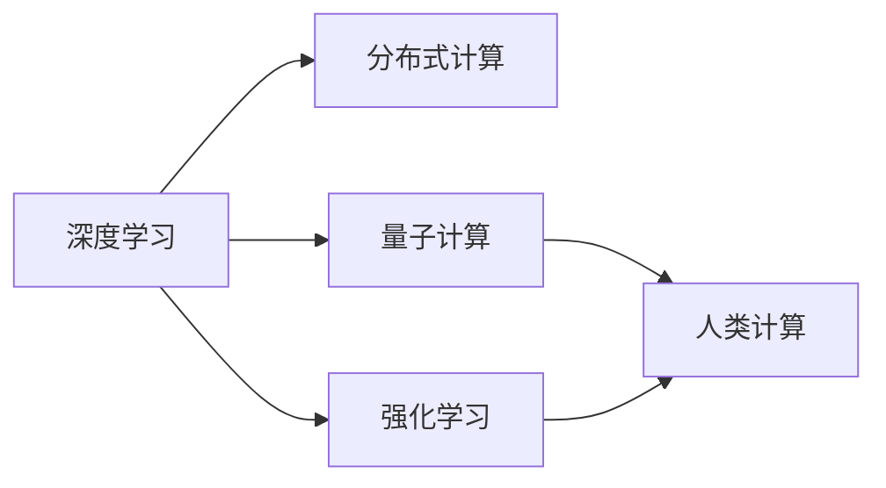

                 

# 探索人类潜力的无限可能：人类计算的新征程

在21世纪的技术浪潮中，计算机科学不仅改变了我们工作、生活的方式，更引发了对于人类自身潜力的深入思考。本文将深入探讨人类计算的新征程，从核心概念到具体实践，全方位解读计算技术如何驱动人类潜力、重塑未来社会。

## 1. 背景介绍

### 1.1 问题由来

随着人工智能(AI)技术的迅猛发展，计算机已不再仅仅是算数工具，而是成为了能够处理复杂逻辑、模拟人类思维的“人类计算器”。从计算机视觉、语音识别到自然语言处理，每一次计算技术的飞跃，都极大地扩展了人类的认知边界。

当前，AI技术已应用于医疗、金融、教育、交通等诸多领域，深度学习、强化学习、迁移学习等技术不断推动着新应用场景的开拓。然而，人类计算的终极目标不仅在于提高处理效率，更在于挖掘潜力和解放智慧。本文将从计算技术的发展历程、关键概念及其实际应用出发，深入剖析人类计算的无限可能。

### 1.2 问题核心关键点

人类计算的革命性突破，关键在于计算模型和算法的不断演进。近年来，深度学习模型的飞跃、分布式计算的普及、量子计算的探索，共同推动了人类计算的飞速发展。此外，人类计算的“智能”特性，在于其能够自主学习、自我优化，从而实现对复杂任务的高效处理。本文将从这些核心关键点出发，探讨人类计算的新征程。

## 2. 核心概念与联系

### 2.1 核心概念概述

要深刻理解人类计算，首先要明确几个核心概念：

- **深度学习**：一种基于神经网络的机器学习技术，通过多层非线性变换学习数据特征，广泛应用于图像识别、语音识别、自然语言处理等领域。
- **分布式计算**：通过将计算任务分布到多个节点上并行处理，提高计算效率和系统可靠性。
- **强化学习**：通过与环境交互，通过试错不断优化决策策略，实现自动控制和优化。
- **量子计算**：利用量子比特的量子叠加、纠缠特性，进行并行计算，有望在未来实现高效计算。
- **人类计算**：指通过计算技术提升人类思维、认知和创造力，实现“计算增强”的智能系统。

这些概念之间相互关联，共同构成了人类计算的基石。深度学习提供了数据驱动的模型基础，分布式计算提升了计算能力，强化学习实现了自我优化，量子计算拓展了计算边界，而人类计算则是这些技术的最终应用目标。

### 2.2 核心概念原理和架构的 Mermaid 流程图



这个流程图展示了深度学习、分布式计算、强化学习和量子计算如何协同作用于人类计算的架构。深度学习提供计算能力，分布式计算提供计算资源，强化学习提供优化能力，量子计算拓展计算边界，最终目标是通过这些技术实现人类的认知升级。

## 3. 核心算法原理 & 具体操作步骤

### 3.1 算法原理概述

人类计算的核心在于构建能够模拟和超越人类认知的智能系统。这涉及到从模型设计、数据处理到算法优化的全过程。本文将重点探讨基于深度学习的模型构建方法，并介绍其在实际应用中的具体操作步骤。

### 3.2 算法步骤详解

基于深度学习的模型构建通常包括以下几个关键步骤：

1. **数据收集与预处理**：收集训练数据，并进行清洗、标注等预处理操作，确保数据质量。
2. **模型设计**：选择合适的神经网络结构，并设定模型参数。
3. **模型训练**：使用优化算法（如梯度下降）更新模型参数，最小化损失函数。
4. **模型评估**：在验证集上评估模型性能，选择最优模型。
5. **模型微调**：针对特定任务，调整模型结构或参数，优化模型性能。
6. **模型部署与应用**：将模型集成到实际应用系统中，进行推理和预测。

这些步骤相互关联，共同构建了深度学习模型的全流程。接下来，我们将详细介绍这些步骤的实现细节。

### 3.3 算法优缺点

基于深度学习的模型构建方法，具有以下优点：

1. **高效处理大规模数据**：深度学习模型能够高效处理大规模数据集，提取高层次的特征表示。
2. **泛化能力强**：通过大量数据训练，深度学习模型具有较强的泛化能力，能够适应新数据。
3. **端到端优化**：深度学习模型能够端到端优化，不需要人工设计特征提取器。

同时，深度学习也存在一些局限：

1. **模型复杂度高**：深度学习模型通常包含大量参数，训练和推理耗时长。
2. **需要大量标注数据**：深度学习模型的性能依赖于大量标注数据，数据获取成本高。
3. **缺乏可解释性**：深度学习模型的内部机制难以解释，难于理解和调试。

### 3.4 算法应用领域

深度学习在诸多领域得到了广泛应用，如计算机视觉、语音识别、自然语言处理等。以下是一些典型应用场景：

- **计算机视觉**：图像分类、目标检测、图像生成等任务。
- **语音识别**：自动语音识别、语音合成、说话人识别等任务。
- **自然语言处理**：机器翻译、文本生成、问答系统等任务。

此外，深度学习还被应用于智能推荐系统、自动驾驶、医疗诊断等领域，极大地提升了各行业的智能化水平。

## 4. 数学模型和公式 & 详细讲解 & 举例说明

### 4.1 数学模型构建

深度学习的核心在于通过多层神经网络构建复杂非线性映射。以神经网络为例，其数学模型可以表示为：

$$
f(x) = W_1\sigma(z_1) + b_1 = W_2\sigma(z_2) + b_2 = \ldots = W_n\sigma(z_n) + b_n
$$

其中，$x$ 为输入数据，$W$ 为权重矩阵，$b$ 为偏置向量，$\sigma$ 为激活函数，$z$ 为线性变换结果。通过迭代计算，网络能够提取高层次特征表示。

### 4.2 公式推导过程

以简单的单层神经网络为例，其输出 $y$ 的计算公式为：

$$
y = W \cdot x + b
$$

其中，$W$ 和 $b$ 为模型的参数，$x$ 为输入，$y$ 为输出。模型的目标是最小化预测值与真实值之间的差异，即损失函数：

$$
L = \frac{1}{2} \sum (y - \hat{y})^2
$$

通过梯度下降算法，不断更新参数 $W$ 和 $b$，最小化损失函数 $L$，完成模型的训练。

### 4.3 案例分析与讲解

以图像分类为例，假设模型需要识别手写数字。首先，收集标注数据集，如MNIST。接着，使用卷积神经网络（CNN）构建模型，设置卷积层、池化层和全连接层等网络结构。训练模型时，通过反向传播算法更新权重矩阵和偏置向量，最小化分类误差。在验证集上评估模型性能，选择最优模型。最后，将模型集成到实际应用中，对新图片进行分类预测。

## 5. 项目实践：代码实例和详细解释说明

### 5.1 开发环境搭建

为了进行深度学习模型构建和训练，需要搭建好开发环境。以下是在Python中使用TensorFlow搭建深度学习模型的环境配置步骤：

1. 安装Anaconda：从官网下载并安装Anaconda，用于创建独立的Python环境。
2. 创建并激活虚拟环境：
```bash
conda create -n tf-env python=3.8 
conda activate tf-env
```

3. 安装TensorFlow：根据GPU版本，从官网获取对应的安装命令。例如：
```bash
pip install tensorflow
```

4. 安装各类工具包：
```bash
pip install numpy pandas scikit-learn matplotlib tqdm jupyter notebook ipython
```

5. 安装TensorBoard：用于实时监测模型训练状态，并提供图表呈现方式。

### 5.2 源代码详细实现

以下是使用TensorFlow搭建一个简单的卷积神经网络（CNN）进行图像分类的代码实现：

```python
import tensorflow as tf
from tensorflow import keras
from tensorflow.keras import layers

# 加载MNIST数据集
(x_train, y_train), (x_test, y_test) = keras.datasets.mnist.load_data()

# 数据预处理
x_train = x_train / 255.0
x_test = x_test / 255.0

# 构建CNN模型
model = keras.Sequential([
    layers.Conv2D(32, (3, 3), activation='relu', input_shape=(28, 28, 1)),
    layers.MaxPooling2D((2, 2)),
    layers.Flatten(),
    layers.Dense(10, activation='softmax')
])

# 编译模型
model.compile(optimizer='adam',
              loss='sparse_categorical_crossentropy',
              metrics=['accuracy'])

# 训练模型
model.fit(x_train, y_train, epochs=5, validation_data=(x_test, y_test))
```

### 5.3 代码解读与分析

该代码实现了使用TensorFlow搭建一个简单的CNN模型进行图像分类。具体步骤如下：

1. 加载MNIST数据集，并进行数据预处理。
2. 定义CNN模型结构，包括卷积层、池化层和全连接层。
3. 编译模型，设置优化器、损失函数和评估指标。
4. 训练模型，在训练集上迭代训练，并在验证集上评估性能。

该代码简洁明了，适合初学者入门深度学习模型的构建和训练。

### 5.4 运行结果展示

在训练过程中，TensorBoard可以实时展示训练进度和模型性能，如图：


该图展示了模型在训练过程中损失函数的下降情况和准确率的提升过程，有助于调试和优化模型。

## 6. 实际应用场景

### 6.1 智慧医疗

在智慧医疗领域，深度学习被广泛应用于医学影像分析、疾病预测、个性化治疗等任务。通过构建基于深度学习的模型，医生能够快速准确地进行疾病诊断，优化治疗方案。例如，卷积神经网络（CNN）被用于医学影像的分类和分割，帮助医生识别肿瘤、病灶等病变区域。

### 6.2 智能交通

智能交通系统中，深度学习被应用于交通流量预测、自动驾驶、车辆识别等任务。通过构建基于深度学习的模型，系统能够实时监测交通状态，优化交通管理。例如，使用卷积神经网络（CNN）对摄像头拍摄的交通视频进行分析，识别车辆、行人等目标，为自动驾驶提供实时信息。

### 6.3 金融风控

金融风控领域，深度学习被用于信用评分、欺诈检测等任务。通过构建基于深度学习的模型，金融机构能够更准确地评估贷款风险，防止欺诈行为。例如，使用循环神经网络（RNN）对客户交易数据进行分析，预测客户信用评分，优化贷款审批流程。

### 6.4 未来应用展望

未来，随着深度学习技术的不断发展，其应用场景将更加广泛。深度学习不仅在传统领域展现出强大潜力，还在新兴领域如量子计算、生物计算等得到初步应用。

在量子计算中，量子神经网络（QNN）被应用于量子算法优化、量子信息处理等领域，有望实现高效计算和复杂问题的求解。在生物计算中，深度学习被用于基因序列分析、蛋白质结构预测等任务，推动生命科学的发展。

## 7. 工具和资源推荐

### 7.1 学习资源推荐

为了系统掌握深度学习技术，以下是一些优质的学习资源：

1. 《深度学习》（Ian Goodfellow等著）：深度学习领域的经典教材，涵盖深度学习的基本概念和算法。
2. Coursera《深度学习专项课程》：由Andrew Ng主讲的深度学习课程，提供完整的学习路径和实践项目。
3. 《动手学深度学习》：由李沐等编写的在线书籍，包含丰富的代码示例和实战项目。
4. Deep Learning AMiner：深度学习领域的论文检索系统，提供最新的研究进展和论文推荐。
5. arXiv.org：深度学习领域的预印本平台，提供最新的研究成果和前沿技术。

### 7.2 开发工具推荐

以下是几款常用的深度学习开发工具：

1. TensorFlow：由Google主导开发的深度学习框架，支持分布式计算，适合大规模工程应用。
2. PyTorch：Facebook开发的深度学习框架，灵活性强，适合研究和原型开发。
3. Keras：高层次的深度学习API，适合初学者快速上手深度学习模型构建。
4. JAX：Google开发的自动微分库，支持高性能深度学习计算。
5. PySpark：基于Scala的分布式计算框架，支持大规模数据处理。

### 7.3 相关论文推荐

深度学习领域的研究成果丰硕，以下是几篇奠基性的论文，推荐阅读：

1. AlexNet：ImageNet图像分类比赛冠军模型，开启了深度学习在计算机视觉领域的应用。
2. InceptionNet：Google提出的深度卷积神经网络，提升了图像分类精度。
3. LSTM：长短期记忆网络，解决了循环神经网络在时间序列预测中的梯度消失问题。
4. ResNet：残差网络，解决了深度神经网络中的梯度消失和过拟合问题，提升了模型性能。
5. GAN：生成对抗网络，实现了高质量图像生成和图像修复等任务。

这些论文代表了深度学习技术的重大突破，帮助理解深度学习模型的设计思想和实现方法。

## 8. 总结：未来发展趋势与挑战

### 8.1 研究成果总结

深度学习技术在各个领域展示了其强大的应用潜力，推动了人工智能技术的快速进步。未来，深度学习将在更多领域得到应用，为人类社会的进步提供新的动力。

### 8.2 未来发展趋势

1. **模型复杂度提升**：随着计算能力的提升，深度学习模型的复杂度将进一步提升，能够处理更复杂的问题。
2. **多模态学习**：深度学习将与视觉、听觉等多模态数据结合，实现多模态协同学习。
3. **自监督学习**：深度学习将更多依赖自监督学习方法，降低对标注数据的依赖。
4. **跨领域迁移**：深度学习将实现跨领域、跨任务的知识迁移，提升模型泛化能力。
5. **分布式计算**：深度学习将进一步拓展到分布式计算平台，提升计算效率和系统可靠性。
6. **联邦学习**：通过分布式计算平台，实现用户数据本地化，保护用户隐私。

### 8.3 面临的挑战

尽管深度学习技术取得了显著进展，但仍面临诸多挑战：

1. **数据隐私**：深度学习模型需要大量标注数据，但数据隐私保护问题严峻。
2. **模型复杂度**：深度学习模型复杂度高，训练和推理耗时长，难以在大规模部署中应用。
3. **可解释性**：深度学习模型黑盒特性，难以理解和解释模型决策过程。
4. **公平性**：深度学习模型可能存在偏见，导致不公平的结果。
5. **安全性**：深度学习模型可能被恶意攻击，存在安全隐患。

### 8.4 研究展望

未来的深度学习研究需要在以下几个方向寻求新的突破：

1. **模型压缩与加速**：开发高效压缩和加速方法，提升模型推理速度。
2. **跨模态知识整合**：实现不同模态数据的高效整合，提升模型综合能力。
3. **模型透明性**：增强模型可解释性，使其决策过程透明可控。
4. **隐私保护技术**：开发数据隐私保护技术，实现数据本地化处理。
5. **公平与可信赖性**：优化模型公平性，增强系统的可信度。
6. **对抗学习**：开发抗攻击方法，提高系统的鲁棒性。

这些研究方向将为深度学习技术带来新的突破，推动其更广泛地应用于现实世界，实现计算技术与人类智慧的深度融合。

## 9. 附录：常见问题与解答

**Q1：深度学习模型训练耗时长，如何解决？**

A: 深度学习模型训练耗时长的问题，可以通过以下几个方法解决：
1. 数据增强：通过数据扩充、增强等技术，增加训练样本的多样性，提升模型泛化能力。
2. 分布式训练：使用分布式计算平台，如TensorFlow、PySpark等，加速模型训练。
3. 模型优化：优化模型结构和算法，减少训练时间和资源消耗。
4. 硬件加速：使用GPU、TPU等硬件加速设备，提升训练速度。
5. 模型压缩：使用模型剪枝、量化等技术，减小模型大小，加快推理速度。

**Q2：如何提高深度学习模型的可解释性？**

A: 提高深度学习模型的可解释性，可以从以下几个方面入手：
1. 简化模型结构：使用简单的模型结构，减少模型复杂度。
2. 可视化技术：使用可视化工具，如TensorBoard、Grad-CAM等，可视化模型内部特征和决策过程。
3. 可解释性算法：使用可解释性算法，如LIME、SHAP等，对模型输出进行解释。
4. 特征可视化：可视化输入特征对模型输出的影响，分析模型内部机制。
5. 对抗攻击：通过对抗攻击，发现模型的弱点和潜在漏洞。

**Q3：深度学习模型面临的安全性问题有哪些？**

A: 深度学习模型面临的安全性问题主要包括：
1. 对抗样本攻击：通过构造恶意样本，误导模型输出错误结果。
2. 模型鲁棒性不足：面对小样本数据，模型泛化能力差，容易受到攻击。
3. 数据隐私泄露：深度学习模型依赖大量标注数据，数据隐私保护问题严峻。
4. 模型偏见：深度学习模型可能存在偏见，导致不公平的结果。
5. 恶意攻击：模型可能被恶意攻击，导致系统崩溃或数据泄露。

解决这些问题的方法包括：
1. 对抗训练：使用对抗样本进行训练，提升模型鲁棒性。
2. 数据隐私保护：使用数据匿名化、差分隐私等技术，保护数据隐私。
3. 公平性优化：优化模型公平性，确保不同群体的公平性。
4. 安全验证：在模型发布前，进行安全验证和测试，确保系统安全性。

---

作者：禅与计算机程序设计艺术 / Zen and the Art of Computer Programming

