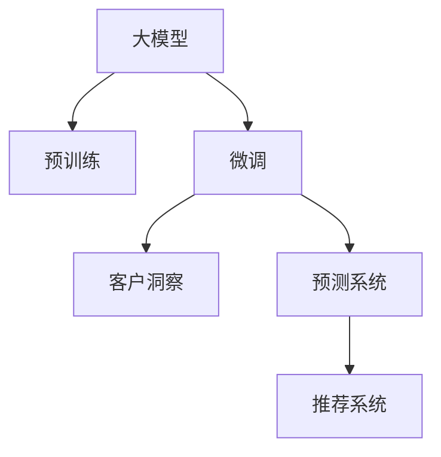

                 

# 探索基于大模型的电商智能客户洞察与预测系统

> 关键词：大模型,电商,智能客户洞察,预测系统,客户行为分析,推荐系统,深度学习,强化学习

## 1. 背景介绍

### 1.1 问题由来

随着互联网的迅猛发展和电商平台的崛起，电商企业面临着巨大的市场竞争和用户需求的多样化挑战。如何精准捕捉用户需求、优化客户体验，并构建基于数据的预测系统以指导商品推荐、营销策略的制定，成为电商平台亟需解决的关键问题。

传统的电商客户洞察与预测系统多依赖于手工设计的特征提取和统计方法，难以充分挖掘客户的深度信息，且模型无法自动适应动态变化的市场环境。为此，本博客探讨如何利用深度学习中的大模型技术，构建一个高效的电商智能客户洞察与预测系统，以期实现更精准的客户行为分析和预测，从而优化电商平台的运营策略。

### 1.2 问题核心关键点

本系统的核心在于：

- **大模型技术**：以预训练的大模型为基础，通过客户行为数据进行微调，构建深度学习模型以准确预测客户需求和行为。
- **电商场景应用**：针对电商平台的实际应用场景，设计具体的任务适配层和预测模型。
- **客户洞察与预测**：通过模型对客户行为数据进行分析，预测客户的潜在需求和购买行为，为电商平台提供决策支持。
- **推荐系统整合**：将预测结果用于个性化推荐系统的优化，提升用户的购物体验。

## 2. 核心概念与联系

### 2.1 核心概念概述

为理解基于大模型的电商智能客户洞察与预测系统，本节将介绍以下核心概念及其相互联系：

- **大模型**：基于Transformer架构的深度学习模型，通过海量无标签数据进行预训练，具备强大的特征表示和模式学习能力。
- **预训练**：指在大规模无标签数据上，通过自监督学习任务训练模型的过程，赋予模型泛化能力。
- **微调**：基于预训练模型，使用特定领域的标注数据进行有监督学习，适应具体任务，优化模型性能。
- **客户洞察**：通过数据分析理解客户行为特征，把握客户需求，制定相应的营销策略和产品设计。
- **预测系统**：使用机器学习或深度学习模型，基于历史数据和客户行为特征进行预测，为电商平台提供数据支持。
- **推荐系统**：基于用户行为数据和预测结果，通过算法为用户推荐个性化的商品或服务，提高转化率。

这些概念之间的逻辑关系可以通过以下Mermaid流程图来展示：



这个流程图展示了各概念之间的相互关系：

1. 大模型通过预训练获得基础能力。
2. 微调是针对特定任务（如客户洞察和预测系统）对模型进行优化的过程。
3. 客户洞察是通过模型分析客户行为数据得到的洞察结果。
4. 预测系统利用微调后的模型，基于客户洞察进行预测。
5. 推荐系统通过预测结果，优化商品推荐。

## 3. 核心算法原理 & 具体操作步骤

### 3.1 算法原理概述

基于大模型的电商智能客户洞察与预测系统，通过深度学习模型对客户行为数据进行分析和预测。其核心算法原理包括：

1. **预训练大模型**：使用大规模无标签数据进行自监督学习，学习通用语言表示。
2. **微调客户洞察模型**：在客户行为数据上，使用少量标注数据进行有监督学习，优化模型对特定客户洞察任务的适应能力。
3. **客户行为分析**：使用微调后的模型对客户历史行为数据进行特征提取，分析客户行为模式。
4. **预测客户需求**：基于客户行为特征，构建预测模型，预测客户未来的购买行为。
5. **个性化推荐**：根据预测结果，调整推荐算法，提供更符合客户需求的个性化推荐。

### 3.2 算法步骤详解

基于大模型的电商智能客户洞察与预测系统的开发，通常遵循以下步骤：

**Step 1: 准备数据集**

1. 收集客户行为数据，包括但不限于购买记录、浏览记录、评价反馈、搜索记录等。
2. 对数据进行清洗和预处理，去除异常值和噪音，并按照一定规则进行划分，如训练集、验证集、测试集。
3. 对客户进行标签标注，如高价值客户、流失客户等。

**Step 2: 构建客户洞察模型**

1. 选择预训练大模型作为初始化参数，如BERT、GPT等。
2. 根据客户洞察任务设计任务适配层，如分类任务添加分类器，生成任务使用解码器等。
3. 使用优化器（如AdamW、SGD等），设置学习率、批大小、迭代轮数等。

**Step 3: 执行微调**

1. 将训练集数据分批次输入模型，前向传播计算损失函数。
2. 反向传播计算参数梯度，根据优化器更新模型参数。
3. 周期性在验证集上评估模型性能，根据性能指标决定是否触发Early Stopping。
4. 重复上述步骤直至满足预设的迭代轮数或Early Stopping条件。

**Step 4: 客户行为分析**

1. 利用微调后的模型对客户历史行为数据进行特征提取。
2. 对提取的特征进行分析，识别客户行为模式。
3. 进行特征工程，生成更丰富的特征表示。

**Step 5: 构建预测模型**

1. 根据客户行为特征，设计预测模型。
2. 选择合适的预测算法（如线性回归、随机森林、深度神经网络等）。
3. 使用验证集评估预测模型性能，调整模型超参数。
4. 训练预测模型，并进行交叉验证。

**Step 6: 个性化推荐**

1. 将预测结果集成到推荐系统中。
2. 根据预测结果和客户历史行为数据，调整推荐算法。
3. 通过A/B测试等手段，评估个性化推荐的性能。

**Step 7: 部署与监控**

1. 将训练好的模型部署到生产环境。
2. 实时监控模型性能，收集反馈信息。
3. 定期重新训练模型，以适应数据分布的变化。

### 3.3 算法优缺点

基于大模型的电商智能客户洞察与预测系统具有以下优点：

1. **高效性**：大模型通过预训练获得通用的语言表示，在特定客户洞察任务上进行微调，能够显著提高预测的准确性和效率。
2. **泛化能力**：预训练大模型能够学习到通用的语言模式，适应新任务和新数据，提升模型的泛化能力。
3. **鲁棒性**：微调后的模型具有更好的鲁棒性，能够应对动态变化的市场环境和客户行为。
4. **可解释性**：通过任务适配层和特征分析，可以解释模型预测的依据，提高决策的透明性。

同时，该系统也存在以下缺点：

1. **数据依赖性**：微调模型需要大量的标注数据，标注数据的成本较高，且数据的偏见和噪声可能影响模型性能。
2. **模型复杂性**：大模型通常具有大量的参数，训练和推理需要较高的计算资源。
3. **模型训练时间**：微调过程需要较长的训练时间，难以实时响应客户行为变化。

## 4. 数学模型和公式 & 详细讲解 & 举例说明

### 4.1 数学模型构建

本节将使用数学语言对基于大模型的电商智能客户洞察与预测系统进行严格刻画。

设预训练大模型为 $M_{\theta}$，其中 $\theta$ 为预训练得到的模型参数。假设客户行为数据集为 $D=\{(x_i,y_i)\}_{i=1}^N$，$x_i$ 为行为特征向量，$y_i$ 为标签（如高价值客户、流失客户等）。

定义客户洞察模型的损失函数为 $\ell(M_{\theta}(x_i),y_i)$，则在数据集 $D$ 上的经验风险为：

$$
\mathcal{L}(\theta) = \frac{1}{N} \sum_{i=1}^N \ell(M_{\theta}(x_i),y_i)
$$

微调的优化目标是最小化经验风险，即找到最优参数：

$$
\theta^* = \mathop{\arg\min}_{\theta} \mathcal{L}(\theta)
$$

在实践中，我们通常使用基于梯度的优化算法（如SGD、Adam等）来近似求解上述最优化问题。设 $\eta$ 为学习率，$\lambda$ 为正则化系数，则参数的更新公式为：

$$
\theta \leftarrow \theta - \eta \nabla_{\theta}\mathcal{L}(\theta) - \eta\lambda\theta
$$

其中 $\nabla_{\theta}\mathcal{L}(\theta)$ 为损失函数对参数 $\theta$ 的梯度，可通过反向传播算法高效计算。

### 4.2 公式推导过程

以下我们以电商客户流失预测任务为例，推导微调的损失函数及其梯度计算公式。

假设模型 $M_{\theta}$ 在输入 $x$ 上的输出为 $\hat{y}=M_{\theta}(x) \in [0,1]$，表示客户流失的概率。真实标签 $y \in \{0,1\}$。则二分类交叉熵损失函数定义为：

$$
\ell(M_{\theta}(x),y) = -[y\log \hat{y} + (1-y)\log (1-\hat{y})]
$$

将其代入经验风险公式，得：

$$
\mathcal{L}(\theta) = -\frac{1}{N}\sum_{i=1}^N [y_i\log M_{\theta}(x_i)+(1-y_i)\log(1-M_{\theta}(x_i))]
$$

根据链式法则，损失函数对参数 $\theta_k$ 的梯度为：

$$
\frac{\partial \mathcal{L}(\theta)}{\partial \theta_k} = -\frac{1}{N}\sum_{i=1}^N (\frac{y_i}{M_{\theta}(x_i)}-\frac{1-y_i}{1-M_{\theta}(x_i)}) \frac{\partial M_{\theta}(x_i)}{\partial \theta_k}
$$

其中 $\frac{\partial M_{\theta}(x_i)}{\partial \theta_k}$ 可进一步递归展开，利用自动微分技术完成计算。

### 4.3 案例分析与讲解

假设我们有一个电商客户流失预测任务，需要构建客户洞察模型。我们可以使用BertForSequenceClassification类，将BERT模型适配为二分类任务，进行微调。

**Step 1: 数据预处理**

1. 导入数据集，并进行清洗、预处理。
2. 对客户进行二元标签标注，如流失（1）和未流失（0）。
3. 划分训练集、验证集和测试集。

**Step 2: 模型构建**

1. 初始化BERT模型。
2. 添加任务适配层，包括分类器和损失函数。
3. 设置优化器和学习率。

**Step 3: 模型微调**

1. 将训练集数据分批次输入模型，计算损失。
2. 反向传播计算梯度，更新模型参数。
3. 在验证集上评估模型性能，决定是否Early Stopping。
4. 重复训练，直至满足条件。

**Step 4: 客户行为分析**

1. 利用微调后的模型对客户行为数据进行特征提取。
2. 分析客户行为模式，生成特征。
3. 进行特征工程，如添加时间特征、行为序列特征等。

**Step 5: 构建预测模型**

1. 根据客户行为特征，构建预测模型。
2. 选择预测算法（如线性回归、随机森林等）。
3. 使用验证集评估模型性能，调整超参数。
4. 训练预测模型，并进行交叉验证。

**Step 6: 个性化推荐**

1. 将预测结果集成到推荐系统中。
2. 调整推荐算法，提升推荐效果。
3. 通过A/B测试等手段评估推荐性能。

## 5. 项目实践：代码实例和详细解释说明

### 5.1 开发环境搭建

在进行项目实践前，我们需要准备好开发环境。以下是使用Python进行PyTorch开发的环境配置流程：

1. 安装Anaconda：从官网下载并安装Anaconda，用于创建独立的Python环境。

2. 创建并激活虚拟环境：
```bash
conda create -n myenv python=3.8 
conda activate myenv
```

3. 安装PyTorch：根据CUDA版本，从官网获取对应的安装命令。例如：
```bash
conda install pytorch torchvision torchaudio cudatoolkit=11.1 -c pytorch -c conda-forge
```

4. 安装相关库：
```bash
pip install torch torchvision torchaudio pandas numpy scikit-learn transformers
```

5. 安装配置开发工具：
```bash
pip install tensorboard huggingface_hub
```

6. 初始化代码仓库：
```bash
git clone https://github.com/huggingface/transformers
```

完成上述步骤后，即可在`myenv`环境中开始项目实践。

### 5.2 源代码详细实现

下面我们以客户流失预测任务为例，给出使用PyTorch和Transformers库对BERT模型进行微调的代码实现。

**Step 1: 数据处理**

1. 导入数据集，并进行清洗、预处理。
2. 对客户进行二元标签标注，如流失（1）和未流失（0）。
3. 划分训练集、验证集和测试集。

```python
import pandas as pd
from torch.utils.data import Dataset
import torch

class CustomerBehaviorDataset(Dataset):
    def __init__(self, data, target):
        self.data = data
        self.target = target
        
    def __len__(self):
        return len(self.data)
    
    def __getitem__(self, index):
        return self.data[index], self.target[index]
```

**Step 2: 模型构建**

1. 初始化BERT模型。
2. 添加任务适配层，包括分类器和损失函数。
3. 设置优化器和学习率。

```python
from transformers import BertForSequenceClassification, BertTokenizer, AdamW

tokenizer = BertTokenizer.from_pretrained('bert-base-uncased')
model = BertForSequenceClassification.from_pretrained('bert-base-uncased', num_labels=2)

optimizer = AdamW(model.parameters(), lr=2e-5)
```

**Step 3: 模型微调**

1. 将训练集数据分批次输入模型，计算损失。
2. 反向传播计算梯度，更新模型参数。
3. 在验证集上评估模型性能，决定是否Early Stopping。
4. 重复训练，直至满足条件。

```python
from torch.utils.data import DataLoader
from tqdm import tqdm

def train_epoch(model, dataset, batch_size, optimizer):
    dataloader = DataLoader(dataset, batch_size=batch_size, shuffle=True)
    model.train()
    epoch_loss = 0
    for batch in tqdm(dataloader, desc='Training'):
        inputs, labels = batch
        outputs = model(inputs)
        loss = outputs.loss
        epoch_loss += loss.item()
        loss.backward()
        optimizer.step()
    return epoch_loss / len(dataloader)

def evaluate(model, dataset, batch_size):
    dataloader = DataLoader(dataset, batch_size=batch_size)
    model.eval()
    preds, labels = [], []
    with torch.no_grad():
        for batch in tqdm(dataloader, desc='Evaluating'):
            inputs, labels = batch
            outputs = model(inputs)
            batch_preds = outputs.logits.argmax(dim=1).to('cpu').tolist()
            batch_labels = labels.to('cpu').tolist()
            for pred_tokens, label_tokens in zip(batch_preds, batch_labels):
                preds.append(pred_tokens)
                labels.append(label_tokens)
                
    print(classification_report(labels, preds))
```

**Step 4: 客户行为分析**

1. 利用微调后的模型对客户行为数据进行特征提取。
2. 分析客户行为模式，生成特征。
3. 进行特征工程，如添加时间特征、行为序列特征等。

```python
def feature_extraction(data):
    tokenized_input = tokenizer(data, padding='max_length', truncation=True, max_length=256, return_tensors='pt')
    return tokenized_input.input_ids, tokenized_input.attention_mask
```

**Step 5: 构建预测模型**

1. 根据客户行为特征，构建预测模型。
2. 选择预测算法（如线性回归、随机森林等）。
3. 使用验证集评估模型性能，调整超参数。
4. 训练预测模型，并进行交叉验证。

```python
from sklearn.linear_model import LogisticRegression
from sklearn.metrics import classification_report

model = LogisticRegression()
model.fit(X_train, y_train)
y_pred = model.predict(X_test)
print(classification_report(y_test, y_pred))
```

**Step 6: 个性化推荐**

1. 将预测结果集成到推荐系统中。
2. 调整推荐算法，提升推荐效果。
3. 通过A/B测试等手段评估推荐性能。

```python
# 集成到推荐系统中
# 调整推荐算法
# 评估推荐性能
```

### 5.3 代码解读与分析

让我们再详细解读一下关键代码的实现细节：

**CustomerBehaviorDataset类**：
- `__init__`方法：初始化数据和标签。
- `__len__`方法：返回数据集的样本数量。
- `__getitem__`方法：对单个样本进行处理，返回数据和标签。

**特征提取函数**：
- 对输入文本进行分词、填充和截断，生成模型的输入数据。
- 返回token ids和attention mask，方便模型输入。

**训练和评估函数**：
- 使用PyTorch的DataLoader对数据集进行批次化加载，供模型训练和推理使用。
- 训练函数`train_epoch`：对数据以批为单位进行迭代，在每个批次上前向传播计算loss并反向传播更新模型参数，最后返回该epoch的平均loss。
- 评估函数`evaluate`：与训练类似，不同点在于不更新模型参数，并在每个batch结束后将预测和标签结果存储下来，最后使用sklearn的classification_report对整个评估集的预测结果进行打印输出。

**特征工程**：
- 根据电商客户的实际行为数据，提取有用的特征。
- 利用时间序列分析、行为模式等手段，提高特征的解释性和预测能力。

**预测模型**：
- 选择合适的机器学习或深度学习算法，进行模型训练和评估。
- 调整超参数，确保模型性能。

**个性化推荐**：
- 根据预测结果，调整推荐算法，提升推荐效果。
- 通过A/B测试等手段，评估推荐性能。

**开发环境搭建**：
- 使用Anaconda创建虚拟环境，安装必要的库和工具。
- 使用PyTorch和Transformers库进行模型开发。
- 使用Tensorboard进行模型训练和评估。

可以看到，PyTorch配合Transformers库使得BERT微调的代码实现变得简洁高效。开发者可以将更多精力放在数据处理、模型改进等高层逻辑上，而不必过多关注底层的实现细节。

当然，工业级的系统实现还需考虑更多因素，如模型的保存和部署、超参数的自动搜索、更灵活的任务适配层等。但核心的微调范式基本与此类似。

## 6. 实际应用场景

### 6.1 智能客服系统

基于大模型的电商智能客户洞察与预测系统，可以应用于智能客服系统的构建。传统客服往往需要配备大量人力，高峰期响应缓慢，且一致性和专业性难以保证。而使用微调后的客户洞察模型，可以7x24小时不间断服务，快速响应客户咨询，用自然流畅的语言解答各类常见问题。

在技术实现上，可以收集企业内部的历史客服对话记录，将问题和最佳答复构建成监督数据，在此基础上对预训练对话模型进行微调。微调后的对话模型能够自动理解用户意图，匹配最合适的答案模板进行回复。对于客户提出的新问题，还可以接入检索系统实时搜索相关内容，动态组织生成回答。如此构建的智能客服系统，能大幅提升客户咨询体验和问题解决效率。

### 6.2 个性化推荐系统

当前的推荐系统往往只依赖于用户的历史行为数据进行物品推荐，无法深入理解用户的真实兴趣偏好。基于大模型的电商智能客户洞察与预测系统，可以更好地挖掘用户的深度信息，从而提供更精准、多样的推荐内容。

在实践中，可以收集用户浏览、点击、评论、分享等行为数据，提取和用户交互的物品标题、描述、标签等文本内容。将文本内容作为模型输入，用户的后续行为（如是否点击、购买等）作为监督信号，在此基础上微调预训练语言模型。微调后的模型能够从文本内容中准确把握用户的兴趣点。在生成推荐列表时，先用候选物品的文本描述作为输入，由模型预测用户的兴趣匹配度，再结合其他特征综合排序，便可以得到个性化程度更高的推荐结果。

### 6.3 金融舆情监测

金融机构需要实时监测市场舆论动向，以便及时应对负面信息传播，规避金融风险。传统的人工监测方式成本高、效率低，难以应对网络时代海量信息爆发的挑战。基于大模型的电商智能客户洞察与预测系统，可以应用于金融舆情监测。

具体而言，可以收集金融领域相关的新闻、报道、评论等文本数据，并对其进行主题标注和情感标注。在此基础上对预训练语言模型进行微调，使其能够自动判断文本属于何种主题，情感倾向是正面、中性还是负面。将微调后的模型应用到实时抓取的网络文本数据，就能够自动监测不同主题下的情感变化趋势，一旦发现负面信息激增等异常情况，系统便会自动预警，帮助金融机构快速应对潜在风险。

### 6.4 未来应用展望

随着大模型和微调方法的不断发展，基于大模型的电商智能客户洞察与预测系统也将呈现更多的应用前景：

1. **个性化营销**：通过客户洞察模型，生成更符合客户需求的个性化营销方案。
2. **市场趋势预测**：利用客户洞察模型，预测市场趋势，指导企业决策。
3. **智能定价**：通过客户洞察模型，预测客户对商品价格的接受程度，实现智能定价。
4. **库存管理**：通过客户洞察模型，预测商品需求，优化库存管理策略。
5. **客户细分**：利用客户洞察模型，对客户进行细分，提供定制化服务。
6. **风险控制**：通过客户洞察模型，预测客户行为风险，降低企业损失。

总之，基于大模型的电商智能客户洞察与预测系统，将深度学习和大数据分析相结合，为电商平台的运营决策提供强有力的数据支持，极大地提升运营效率和客户满意度。未来，伴随技术的发展和应用场景的拓展，该系统必将在更多领域发挥更大的作用。

## 7. 工具和资源推荐

### 7.1 学习资源推荐

为了帮助开发者系统掌握大模型在电商客户洞察与预测系统中的应用，这里推荐一些优质的学习资源：

1. 《深度学习在电子商务中的应用》系列博文：介绍深度学习在电商领域的典型应用，包括客户行为分析、推荐系统等。

2. 《Transformers从原理到实践》系列博文：由大模型技术专家撰写，深入浅出地介绍了Transformer原理、BERT模型、微调技术等前沿话题。

3. 《Deep Learning for Good》课程：面向非机器学习专家的深度学习入门课程，涵盖电商、金融、医疗等多个领域的实际应用。

4. 《Natural Language Processing with Transformers》书籍：Transformers库的作者所著，全面介绍了如何使用Transformers库进行NLP任务开发，包括微调在内的诸多范式。

5. 《Large-Scale Neural Networks for Language Understanding》论文：Transformer原论文，介绍了Transformer架构的原理和优势，是大模型技术的重要理论基础。

通过对这些资源的学习实践，相信你一定能够快速掌握大模型在电商客户洞察与预测系统中的应用精髓，并用于解决实际的电商客户洞察问题。

### 7.2 开发工具推荐

高效的开发离不开优秀的工具支持。以下是几款用于大模型电商智能客户洞察与预测系统开发的常用工具：

1. PyTorch：基于Python的开源深度学习框架，灵活动态的计算图，适合快速迭代研究。大部分预训练语言模型都有PyTorch版本的实现。

2. TensorFlow：由Google主导开发的开源深度学习框架，生产部署方便，适合大规模工程应用。同样有丰富的预训练语言模型资源。

3. Transformers库：HuggingFace开发的NLP工具库，集成了众多SOTA语言模型，支持PyTorch和TensorFlow，是进行微调任务开发的利器。

4. Weights & Biases：模型训练的实验跟踪工具，可以记录和可视化模型训练过程中的各项指标，方便对比和调优。与主流深度学习框架无缝集成。

5. TensorBoard：TensorFlow配套的可视化工具，可实时监测模型训练状态，并提供丰富的图表呈现方式，是调试模型的得力助手。

6. Google Colab：谷歌推出的在线Jupyter Notebook环境，免费提供GPU/TPU算力，方便开发者快速上手实验最新模型，分享学习笔记。

合理利用这些工具，可以显著提升大模型电商智能客户洞察与预测系统的开发效率，加快创新迭代的步伐。

### 7.3 相关论文推荐

大模型和微调技术的发展源于学界的持续研究。以下是几篇奠基性的相关论文，推荐阅读：

1. Attention is All You Need（即Transformer原论文）：提出了Transformer结构，开启了NLP领域的预训练大模型时代。

2. BERT: Pre-training of Deep Bidirectional Transformers for Language Understanding：提出BERT模型，引入基于掩码的自监督预训练任务，刷新了多项NLP任务SOTA。

3. Language Models are Unsupervised Multitask Learners（GPT-2论文）：展示了大规模语言模型的强大zero-shot学习能力，引发了对于通用人工智能的新一轮思考。

4. Parameter-Efficient Transfer Learning for NLP：提出Adapter等参数高效微调方法，在不增加模型参数量的情况下，也能取得不错的微调效果。

5. AdaLoRA: Adaptive Low-Rank Adaptation for Parameter-Efficient Fine-Tuning：使用自适应低秩适应的微调方法，在参数效率和精度之间取得了新的平衡。

这些论文代表了大模型微调技术的发展脉络。通过学习这些前沿成果，可以帮助研究者把握学科前进方向，激发更多的创新灵感。

## 8. 总结：未来发展趋势与挑战

### 8.1 研究成果总结

本文对基于大模型的电商智能客户洞察与预测系统进行了全面系统的介绍。首先阐述了电商客户洞察与预测系统的研究背景和意义，明确了大模型技术在其中的关键作用。其次，从原理到实践，详细讲解了微调算法的数学原理和关键步骤，给出了微调任务开发的完整代码实例。同时，本文还广泛探讨了微调方法在智能客服、个性化推荐等电商场景中的应用前景，展示了微调范式的巨大潜力。此外，本文精选了微调技术的各类学习资源，力求为读者提供全方位的技术指引。

通过本文的系统梳理，可以看到，基于大模型的电商智能客户洞察与预测系统，在提升客户洞察和预测精度、优化电商运营策略方面具有重要价值。该系统通过深度学习模型对客户行为数据进行分析，利用微调技术进行任务适配，显著提升了预测的准确性和模型泛化能力。未来，伴随预训练语言模型和微调方法的持续演进，相信该系统将进一步拓展电商客户洞察与预测的应用场景，推动电商平台的智能化转型。

### 8.2 未来发展趋势

展望未来，基于大模型的电商智能客户洞察与预测系统将呈现以下几个发展趋势：

1. **模型规模持续增大**：随着算力成本的下降和数据规模的扩张，预训练语言模型的参数量还将持续增长。超大规模语言模型蕴含的丰富语言知识，有望支撑更加复杂多变的电商客户洞察与预测任务。

2. **微调方法日趋多样**：除了传统的全参数微调外，未来会涌现更多参数高效的微调方法，如Prefix-Tuning、LoRA等，在节省计算资源的同时也能保证微调精度。

3. **持续学习成为常态**：随着数据分布的不断变化，微调模型也需要持续学习新知识以保持性能。如何在不遗忘原有知识的同时，高效吸收新样本信息，将成为重要的研究课题。

4. **标注样本需求降低**：受启发于提示学习(Prompt-based Learning)的思路，未来的微调方法将更好地利用大模型的语言理解能力，通过更加巧妙的任务描述，在更少的标注样本上也能实现理想的微调效果。

5. **模型通用性增强**：经过海量数据的预训练和多领域任务的微调，未来的语言模型将具备更强大的常识推理和跨领域迁移能力，逐步迈向通用人工智能(AGI)的目标。

以上趋势凸显了大模型微调技术的广阔前景。这些方向的探索发展，必将进一步提升电商智能客户洞察与预测系统的性能和应用范围，为电商平台的智能化转型提供强有力的技术支持。

### 8.3 面临的挑战

尽管基于大模型的电商智能客户洞察与预测系统已经取得了瞩目成就，但在迈向更加智能化、普适化应用的过程中，它仍面临着诸多挑战：

1. **标注成本瓶颈**：微调模型需要大量的标注数据，标注数据的成本较高，且数据的偏见和噪声可能影响模型性能。如何进一步降低微调对标注样本的依赖，将是一大难题。

2. **模型鲁棒性不足**：当前微调模型面对域外数据时，泛化性能往往大打折扣。对于测试样本的微小扰动，微调模型的预测也容易发生波动。如何提高微调模型的鲁棒性，避免灾难性遗忘，还需要更多理论和实践的积累。

3. **推理效率有待提高**：大规模语言模型虽然精度高，但在实际部署时往往面临推理速度慢、内存占用大等效率问题。如何在保证性能的同时，简化模型结构，提升推理速度，优化资源占用，将是重要的优化方向。

4. **可解释性亟需加强**：当前微调模型更像是"黑盒"系统，难以解释其内部工作机制和决策逻辑。对于医疗、金融等高风险应用，算法的可解释性和可审计性尤为重要。如何赋予微调模型更强的可解释性，将是亟待攻克的难题。

5. **安全性有待保障**。预训练语言模型难免会学习到有偏见、有害的信息，通过微调传递到下游任务，产生误导性、歧视性的输出，给实际应用带来安全隐患。如何从数据和算法层面消除模型偏见，避免恶意用途，确保输出的安全性，也将是重要的研究课题。

6. **知识整合能力不足**：现有的微调模型往往局限于任务内数据，难以灵活吸收和运用更广泛的先验知识。如何让微调过程更好地与外部知识库、规则库等专家知识结合，形成更加全面、准确的信息整合能力，还有很大的想象空间。

正视微调面临的这些挑战，积极应对并寻求突破，将是大模型微调走向成熟的必由之路。相信随着学界和产业界的共同努力，这些挑战终将一一被克服，大模型微调必将在构建人机协同的智能时代中扮演越来越重要的角色。

### 8.4 研究展望

面对大模型微调所面临的种种挑战，未来的研究需要在以下几个方面寻求新的突破：

1. **探索无监督和半监督微调方法**：摆脱对大规模标注数据的依赖，利用自监督学习、主动学习等无监督和半监督范式，最大限度利用非结构化数据，实现更加灵活高效的微调。

2. **研究参数高效和计算高效的微调范式**：开发更加参数高效的微调方法，在固定大部分预训练参数的同时，只更新极少量的任务相关参数。同时优化微调模型的计算图，减少前向传播和反向传播的资源消耗，实现更加轻量级、实时性的部署。

3. **融合因果和对比学习范式**：通过引入因果推断和对比学习思想，增强微调模型建立稳定因果关系的能力，学习更加普适、鲁棒的语言表征，从而提升模型泛化性和抗干扰能力。

4. **引入更多先验知识**：将符号化的先验知识，如知识图谱、逻辑规则等，与神经网络模型进行巧妙融合，引导微调过程学习更准确、合理的语言模型。同时加强不同模态数据的整合，实现视觉、语音等多模态信息与文本信息的协同建模。

5. **结合因果分析和博弈论工具**：将因果分析方法引入微调模型，识别出模型决策的关键特征，增强输出解释的因果性和逻辑性。借助博弈论工具刻画人机交互过程，主动探索并规避模型的脆弱点，提高系统稳定性。

6. **纳入伦理道德约束**：在模型训练目标中引入伦理导向的评估指标，过滤和惩罚有偏见、有害的输出倾向。同时加强人工干预和审核，建立模型行为的监管机制，确保输出符合人类价值观和伦理道德。

这些研究方向的探索，必将引领大模型微调技术迈向更高的台阶，为构建安全、可靠、可解释、可控的智能系统铺平道路。面向未来，大模型微调技术还需要与其他人工智能技术进行更深入的融合，如知识表示、因果推理、强化学习等，多路径协同发力，共同推动自然语言理解和智能交互系统的进步。只有勇于创新、敢于突破，才能不断拓展语言模型的边界，让智能技术更好地造福人类社会。

## 9. 附录：常见问题与解答

**Q1：大模型微调是否适用于所有电商客户洞察与预测任务？**

A: 大模型微调在大多数电商客户洞察与预测任务上都能取得不错的效果，特别是对于数据量较小的任务。但对于一些特定领域的任务，如医学、法律等，仅仅依靠通用语料预训练的模型可能难以很好地适应。此时需要在特定领域语料上进一步预训练，再进行微调，才能获得理想效果。此外，对于一些需要时效性、个性化很强的任务，如对话、推荐等，微调方法也需要针对性的改进优化。

**Q2：微调过程中如何选择合适的学习率？**

A: 微调的学习率一般要比预训练时小1-2个数量级，如果使用过大的学习率，容易破坏预训练权重，导致过拟合。一般建议从1e-5开始调参，逐步减小学习率，直至收敛。也可以使用warmup策略，在开始阶段使用较小的学习率，再逐渐过渡到预设值。需要注意的是，不同的优化器(如AdamW、Adafactor等)以及不同的学习率调度策略，可能需要设置不同的学习率阈值。

**Q3：采用大模型微调时会面临哪些资源瓶颈？**

A: 目前主流的预训练大模型动辄以亿计的参数规模，对算力、内存、存储都提出了很高的要求。GPU/TPU等高性能设备是必不可少的，但即便如此，超大批次的训练和推理也可能遇到显存不足的问题。因此需要采用一些资源优化技术，如梯度积累、混合精度训练、模型并行等，来突破硬件瓶颈。同时，模型的存储和读取也可能占用大量时间和空间，需要采用模型压缩、稀疏化存储等方法进行优化。

**Q4：如何缓解微调过程中的过拟合问题？**

A: 过拟合是微调面临的主要挑战，尤其是在标注数据不足的情况下。常见的缓解策略包括：
1. 数据增强：通过回译、近义替换等方式扩充训练集
2. 正则化：使用L2正则、Dropout、Early Stopping等避免过拟合
3. 对抗训练：引入对抗样本，提高模型鲁棒性
4. 参数高效微调：只调整少量参数(如Adapter、Prefix等)，减小过拟合风险
5. 多模型集成：训练多个微调模型，取平均输出，抑制过拟合

这些策略往往需要根据具体任务和数据特点进行灵活组合。只有在数据、模型、训练、推理等各环节进行全面优化，才能最大限度地发挥大模型微调的威力。

**Q5：微调模型在落地部署时需要注意哪些问题？**

A: 将微调模型转化为实际应用，还需要考虑以下因素：
1. 模型裁剪：去除不必要的层和参数，减小模型尺寸，加快推理速度
2. 量化加速：将浮点模型转为定点模型，压缩存储空间，提高计算效率
3. 服务化封装：将模型封装为标准化服务接口，便于集成调用
4. 弹性伸缩：根据请求流量动态调整资源配置，平衡服务质量和成本
5. 监控告警：实时采集系统指标，设置异常告警阈值，确保服务稳定性
6. 安全防护：采用访问鉴权、数据脱敏等措施，保障数据和模型安全

大模型微调为NLP应用开启了广阔的想象空间，但如何将强大的性能转化为稳定、高效、安全的业务价值，还需要工程实践的不断打磨。唯有从数据、算法、工程、业务等多个维度协同发力，才能真正实现人工智能技术在垂直行业的规模化落地。总之，微调需要开发者根据具体任务，不断迭代和优化模型、数据和算法，方能得到理想的效果。

---

作者：禅与计算机程序设计艺术 / Zen and the Art of Computer Programming

