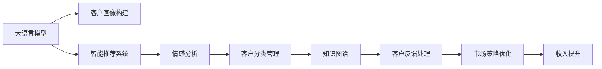

                 

# 探索基于大模型的电商智能客户生命周期管理系统

> 关键词：电商客户生命周期管理,大语言模型,智能推荐系统,情感分析,知识图谱,Transformer,深度学习,自然语言处理

## 1. 背景介绍

### 1.1 问题由来

随着互联网电商的快速发展，用户行为数据呈现爆发式增长，电商企业面临着如何高效管理和利用用户数据以提升客户满意度和忠诚度、增加销售转化率的挑战。传统的基于规则和统计的客户关系管理（CRM）系统已难以满足日益增长的需求。而基于大模型的客户生命周期管理系统，则有望通过深度学习和自然语言处理（NLP）技术，实现对用户行为和情感的精准洞察，提供智能化的客户服务，从而提升客户体验和企业的经营效益。

### 1.2 问题核心关键点

基于大模型的客户生命周期管理系统，通过深度学习模型和自然语言处理技术，实现对用户行为、情感和交易数据的多维度分析，提供智能化的客户服务，实现客户生命周期各阶段的精准管理。具体来说，它包括以下几个核心点：

- **用户画像构建**：通过大模型对用户行为、交易、评价等数据进行分析和建模，构建多维度的用户画像。
- **客户分类管理**：利用大模型对客户进行分类，制定个性化管理策略，实现精准营销。
- **情感分析与反馈处理**：通过大模型分析用户反馈和评论，获取情感倾向，优化服务质量。
- **智能推荐系统**：利用大模型生成个性化推荐，提升用户体验，增加销售转化率。

### 1.3 问题研究意义

深入探索基于大模型的电商智能客户生命周期管理系统，对于电商企业提升客户满意度、优化营销策略、增加收入、增强市场竞争力具有重要意义：

1. **提升客户满意度**：通过深入分析用户行为和情感，提供个性化的服务，提升客户体验。
2. **优化营销策略**：利用智能推荐和精准分类，实现更加高效的市场定位和个性化营销。
3. **增加收入**：通过精准的管理和服务，提升客户忠诚度，增加重复购买和推荐率，从而提高收入。
4. **增强市场竞争力**：利用先进的技术手段，提升企业数据管理和客户服务能力，增强在市场中的竞争优势。

## 2. 核心概念与联系

### 2.1 核心概念概述

在深入探讨基于大模型的电商智能客户生命周期管理系统前，我们需要理解以下核心概念及其之间的联系：

- **大语言模型(Large Language Model, LLM)**：以自回归(如GPT)或自编码(如BERT)模型为代表的大规模预训练语言模型。通过在大规模无标签文本语料上进行预训练，学习通用的语言表示，具备强大的语言理解和生成能力。

- **电商客户生命周期管理**：通过对电商客户从潜在客户到流失客户的全生命周期进行系统管理，提升客户价值和销售转化率。

- **智能推荐系统**：利用机器学习和数据分析技术，根据用户历史行为和兴趣，生成个性化推荐，提高用户满意度和转化率。

- **情感分析**：通过对用户评论和反馈进行情感分析，获取用户满意度和情感倾向，优化服务质量。

- **知识图谱**：构建实体和关系的网络结构，用于知识管理和推理，辅助数据驱动的决策。

这些核心概念通过大模型微调等技术，紧密地联系在一起，共同构建了电商智能客户生命周期管理系统的基础架构。

### 2.2 核心概念原理和架构的 Mermaid 流程图



这个流程图展示了基于大模型的客户生命周期管理系统的主要流程：

1. 大语言模型通过对用户数据进行分析和建模，构建客户画像。
2. 基于客户画像，智能推荐系统生成个性化推荐。
3. 情感分析获取用户反馈情感，优化服务质量。
4. 客户分类管理，实现精准营销。
5. 客户反馈处理，实时调整策略。
6. 市场策略优化，提升收入。

通过这种多维度、全周期的管理方式，电商企业能够更有效地提升客户满意度和忠诚度，增加收入。

## 3. 核心算法原理 & 具体操作步骤

### 3.1 算法原理概述

基于大模型的电商智能客户生命周期管理系统，主要通过大语言模型对用户数据进行分析和建模，构建客户画像，并结合智能推荐、情感分析、知识图谱等技术，实现客户生命周期全周期的管理。

### 3.2 算法步骤详解

基于大模型的客户生命周期管理系统，主要包括以下步骤：

**Step 1: 数据收集与预处理**

1. 收集用户行为数据，包括点击、浏览、购买、评价等。
2. 收集客户反馈数据，包括在线评论、客服记录等。
3. 将收集到的数据进行清洗和预处理，去除噪音和缺失值。

**Step 2: 客户画像构建**

1. 使用大语言模型对用户行为数据进行分析，提取用户兴趣、行为模式等特征。
2. 构建多维度的用户画像，包括人口统计、行为、兴趣、情感等维度。

**Step 3: 智能推荐系统设计**

1. 根据用户画像，设计推荐模型，如基于深度学习的推荐模型。
2. 使用大语言模型生成推荐语义，增加推荐的个性化和多样性。
3. 设计推荐评估指标，如点击率、转化率等。

**Step 4: 情感分析与反馈处理**

1. 使用大语言模型对客户反馈数据进行情感分析，识别用户情感倾向。
2. 根据情感分析结果，优化服务质量，改进产品或服务。
3. 设计反馈处理流程，及时响应客户问题，提升客户满意度。

**Step 5: 客户分类管理**

1. 使用大语言模型对客户进行分类，如高价值客户、潜在流失客户等。
2. 根据客户分类结果，制定不同的管理策略，如高价值客户定向营销，潜在流失客户预警等。
3. 设计客户分类模型，如聚类算法、分类器等。

**Step 6: 知识图谱构建与优化**

1. 构建电商领域的知识图谱，包含商品、品牌、用户等实体及其关系。
2. 使用大语言模型对知识图谱进行优化，增加实体和关系的准确性和完备性。
3. 设计知识图谱的应用场景，如智能问答、推荐等。

**Step 7: 市场策略优化**

1. 根据客户画像和情感分析结果，优化市场策略，如定价、促销、广告等。
2. 设计市场策略评估指标，如市场覆盖率、转化率等。
3. 定期更新市场策略，根据客户反馈和市场变化进行调整。

### 3.3 算法优缺点

基于大模型的电商智能客户生命周期管理系统，具有以下优点：

1. **全面性**：通过多维度数据建模，实现对客户生命周期的全面管理。
2. **精准性**：通过大模型进行深度学习和情感分析，实现对客户行为的精准洞察。
3. **高效性**：利用智能推荐系统，提高用户满意度和转化率。
4. **灵活性**：根据市场变化和客户反馈，动态调整策略，提升策略效果。

同时，该方法也存在以下局限性：

1. **数据依赖性**：需要收集和处理大量用户数据，数据质量对模型效果影响较大。
2. **模型复杂性**：大模型的训练和优化过程复杂，需要大量计算资源。
3. **隐私风险**：客户数据隐私保护和数据安全需要严格把控。
4. **模型过拟合**：在标注数据不足的情况下，存在过拟合风险。
5. **计算成本高**：大模型训练和推理计算成本高，需要高效优化算法和硬件支持。

### 3.4 算法应用领域

基于大模型的电商智能客户生命周期管理系统，已经在电商、零售、金融等多个领域得到广泛应用，取得了显著的业务提升和客户满意度提升效果。

1. **电商客户管理**：对电商客户的全生命周期进行精准管理，提升客户价值和忠诚度。
2. **智能推荐系统**：提高推荐准确性和个性化，增加用户粘性和转化率。
3. **情感分析与客户反馈**：提升服务质量和客户满意度，优化客户体验。
4. **市场策略优化**：提升市场策略效果，增加收入和市场覆盖率。
5. **知识图谱应用**：增强数据驱动决策能力，提升数据管理效率。

## 4. 数学模型和公式 & 详细讲解 & 举例说明

### 4.1 数学模型构建

基于大模型的电商智能客户生命周期管理系统，主要利用大语言模型对用户数据进行分析和建模。我们以情感分析为例，介绍其数学模型构建过程。

假设用户评论数据集为 $D=\{(x_i,y_i)\}_{i=1}^N$，其中 $x_i$ 为评论文本，$y_i$ 为评论情感标签。设大语言模型为 $M_{\theta}$，其中 $\theta$ 为模型参数。定义模型在评论数据集上的损失函数为：

$$
\mathcal{L}(\theta) = \frac{1}{N} \sum_{i=1}^N \ell(M_{\theta}(x_i),y_i)
$$

其中 $\ell$ 为损失函数，一般使用交叉熵损失。

### 4.2 公式推导过程

以下我们以二分类任务为例，推导交叉熵损失函数及其梯度的计算公式。

假设模型 $M_{\theta}$ 在输入 $x$ 上的输出为 $\hat{y}=M_{\theta}(x) \in [0,1]$，表示样本属于正类的概率。真实标签 $y \in \{0,1\}$。则二分类交叉熵损失函数定义为：

$$
\ell(M_{\theta}(x),y) = -[y\log \hat{y} + (1-y)\log (1-\hat{y})]
$$

将其代入经验风险公式，得：

$$
\mathcal{L}(\theta) = -\frac{1}{N}\sum_{i=1}^N [y_i\log M_{\theta}(x_i)+(1-y_i)\log(1-M_{\theta}(x_i))]
$$

根据链式法则，损失函数对参数 $\theta_k$ 的梯度为：

$$
\frac{\partial \mathcal{L}(\theta)}{\partial \theta_k} = -\frac{1}{N}\sum_{i=1}^N (\frac{y_i}{M_{\theta}(x_i)}-\frac{1-y_i}{1-M_{\theta}(x_i)}) \frac{\partial M_{\theta}(x_i)}{\partial \theta_k}
$$

其中 $\frac{\partial M_{\theta}(x_i)}{\partial \theta_k}$ 可进一步递归展开，利用自动微分技术完成计算。

### 4.3 案例分析与讲解

假设我们收集到一批用户评论数据，包括正面和负面评论，使用BERT模型进行情感分析。我们可以将评论文本输入BERT模型，得到评论的情感得分 $\hat{y}=M_{\theta}(x)$。然后计算模型在数据集上的交叉熵损失：

$$
\mathcal{L}(\theta) = -\frac{1}{N}\sum_{i=1}^N [y_i\log \hat{y}_i+(1-y_i)\log(1-\hat{y}_i)]
$$

接着，利用链式法则求得模型参数 $\theta_k$ 的梯度，更新模型参数，最小化损失函数。通过多次迭代，模型将不断学习，提高情感分类的准确性。

## 5. 项目实践：代码实例和详细解释说明

### 5.1 开发环境搭建

在进行项目实践前，我们需要准备好开发环境。以下是使用Python进行PyTorch开发的环境配置流程：

1. 安装Anaconda：从官网下载并安装Anaconda，用于创建独立的Python环境。

2. 创建并激活虚拟环境：
```bash
conda create -n pytorch-env python=3.8 
conda activate pytorch-env
```

3. 安装PyTorch：根据CUDA版本，从官网获取对应的安装命令。例如：
```bash
conda install pytorch torchvision torchaudio cudatoolkit=11.1 -c pytorch -c conda-forge
```

4. 安装Transformers库：
```bash
pip install transformers
```

5. 安装各类工具包：
```bash
pip install numpy pandas scikit-learn matplotlib tqdm jupyter notebook ipython
```

完成上述步骤后，即可在`pytorch-env`环境中开始项目实践。

### 5.2 源代码详细实现

这里我们以情感分析为例，给出使用PyTorch和Transformers库对BERT模型进行情感分析的代码实现。

首先，定义数据预处理函数：

```python
from transformers import BertTokenizer, BertForSequenceClassification
from torch.utils.data import Dataset, DataLoader
import torch

class ReviewDataset(Dataset):
    def __init__(self, texts, labels):
        self.texts = texts
        self.labels = labels
        self.tokenizer = BertTokenizer.from_pretrained('bert-base-uncased')
        self.max_len = 128
        
    def __len__(self):
        return len(self.texts)
    
    def __getitem__(self, item):
        text = self.texts[item]
        label = self.labels[item]
        
        encoding = self.tokenizer(text, return_tensors='pt', max_length=self.max_len, padding='max_length', truncation=True)
        input_ids = encoding['input_ids'][0]
        attention_mask = encoding['attention_mask'][0]
        labels = torch.tensor(label, dtype=torch.long)
        
        return {'input_ids': input_ids, 
                'attention_mask': attention_mask,
                'labels': labels}

# 加载数据集
train_dataset = ReviewDataset(train_texts, train_labels)
dev_dataset = ReviewDataset(dev_texts, dev_labels)
test_dataset = ReviewDataset(test_texts, test_labels)
```

然后，定义模型和优化器：

```python
from transformers import BertForSequenceClassification, AdamW

model = BertForSequenceClassification.from_pretrained('bert-base-uncased', num_labels=2)

optimizer = AdamW(model.parameters(), lr=2e-5)
```

接着，定义训练和评估函数：

```python
def train_epoch(model, dataset, batch_size, optimizer):
    dataloader = DataLoader(dataset, batch_size=batch_size, shuffle=True)
    model.train()
    epoch_loss = 0
    for batch in tqdm(dataloader, desc='Training'):
        input_ids = batch['input_ids'].to(device)
        attention_mask = batch['attention_mask'].to(device)
        labels = batch['labels'].to(device)
        model.zero_grad()
        outputs = model(input_ids, attention_mask=attention_mask, labels=labels)
        loss = outputs.loss
        epoch_loss += loss.item()
        loss.backward()
        optimizer.step()
    return epoch_loss / len(dataloader)

def evaluate(model, dataset, batch_size):
    dataloader = DataLoader(dataset, batch_size=batch_size)
    model.eval()
    preds, labels = [], []
    with torch.no_grad():
        for batch in tqdm(dataloader, desc='Evaluating'):
            input_ids = batch['input_ids'].to(device)
            attention_mask = batch['attention_mask'].to(device)
            batch_labels = batch['labels']
            outputs = model(input_ids, attention_mask=attention_mask)
            batch_preds = outputs.logits.argmax(dim=2).to('cpu').tolist()
            batch_labels = batch_labels.to('cpu').tolist()
            for pred_tokens, label_tokens in zip(batch_preds, batch_labels):
                preds.append(pred_tokens)
                labels.append(label_tokens)
                
    print(classification_report(labels, preds))
```

最后，启动训练流程并在测试集上评估：

```python
epochs = 5
batch_size = 16

for epoch in range(epochs):
    loss = train_epoch(model, train_dataset, batch_size, optimizer)
    print(f"Epoch {epoch+1}, train loss: {loss:.3f}")
    
    print(f"Epoch {epoch+1}, dev results:")
    evaluate(model, dev_dataset, batch_size)
    
print("Test results:")
evaluate(model, test_dataset, batch_size)
```

以上就是使用PyTorch和Transformers库对BERT模型进行情感分析的完整代码实现。可以看到，Transformer库提供了便捷的预训练模型封装和微调接口，使得情感分析任务开发变得相对简单。

### 5.3 代码解读与分析

让我们再详细解读一下关键代码的实现细节：

**ReviewDataset类**：
- `__init__`方法：初始化文本、标签、分词器等关键组件。
- `__len__`方法：返回数据集的样本数量。
- `__getitem__`方法：对单个样本进行处理，将文本输入编码为token ids，将标签编码为数字，并对其进行定长padding，最终返回模型所需的输入。

**模型和优化器定义**：
- 使用BERT模型进行情感分类，设置合适的优化器和超参数。

**训练和评估函数**：
- 使用PyTorch的DataLoader对数据集进行批次化加载，供模型训练和推理使用。
- 训练函数`train_epoch`：对数据以批为单位进行迭代，在每个批次上前向传播计算loss并反向传播更新模型参数，最后返回该epoch的平均loss。
- 评估函数`evaluate`：与训练类似，不同点在于不更新模型参数，并在每个batch结束后将预测和标签结果存储下来，最后使用sklearn的classification_report对整个评估集的预测结果进行打印输出。

**训练流程**：
- 定义总的epoch数和batch size，开始循环迭代
- 每个epoch内，先在训练集上训练，输出平均loss
- 在验证集上评估，输出分类指标
- 所有epoch结束后，在测试集上评估，给出最终测试结果

可以看到，PyTorch配合Transformer库使得BERT情感分析的代码实现变得简洁高效。开发者可以将更多精力放在数据处理、模型改进等高层逻辑上，而不必过多关注底层的实现细节。

当然，工业级的系统实现还需考虑更多因素，如模型的保存和部署、超参数的自动搜索、更灵活的任务适配层等。但核心的情感分析过程基本与此类似。

## 6. 实际应用场景

### 6.1 智能客服系统

智能客服系统可以通过大模型对用户评论和反馈进行情感分析，识别客户情感倾向，优化服务质量。具体实现步骤如下：

1. 收集用户评论数据，包括在线评论、客服记录等。
2. 使用大模型对评论进行情感分析，识别客户情感倾向。
3. 根据情感分析结果，优化客服策略，改进服务质量。
4. 实时监控客户情感，预警潜在问题，提升客户满意度。

通过这种方式，电商企业可以更加精准地把握客户需求，提升客户体验，增加客户忠诚度和满意度。

### 6.2 个性化推荐系统

个性化推荐系统可以通过大模型生成个性化推荐，提高用户满意度和转化率。具体实现步骤如下：

1. 收集用户行为数据，包括浏览、点击、购买等。
2. 使用大模型分析用户行为数据，提取用户兴趣、行为模式等特征。
3. 设计推荐模型，如基于深度学习的推荐模型。
4. 使用大模型生成推荐语义，增加推荐的个性化和多样性。
5. 设计推荐评估指标，如点击率、转化率等。
6. 实时生成个性化推荐，提升用户体验，增加销售转化率。

通过这种方式，电商企业可以更精准地匹配用户需求，提升用户粘性和转化率，增加收入。

### 6.3 市场策略优化

市场策略优化可以通过大模型分析市场趋势和用户反馈，优化市场策略。具体实现步骤如下：

1. 收集市场数据，包括销售数据、广告效果等。
2. 使用大模型分析市场数据，提取市场趋势和用户偏好。
3. 根据市场分析结果，优化市场策略，如定价、促销、广告等。
4. 设计市场策略评估指标，如市场覆盖率、转化率等。
5. 定期更新市场策略，根据市场变化和客户反馈进行调整。

通过这种方式，电商企业可以更精准地把握市场趋势，优化营销策略，增加收入和市场覆盖率。

### 6.4 未来应用展望

未来，基于大模型的电商智能客户生命周期管理系统将在更多领域得到应用，为传统行业带来变革性影响。

在智慧医疗领域，可以通过大模型构建健康数据分析系统，提供个性化的医疗服务。

在智能教育领域，可以通过大模型分析学生学习行为，提供个性化的教育资源和教学策略，提高教育质量。

在智慧城市治理中，可以通过大模型分析城市舆情，提供智能化的城市管理服务。

此外，在金融、物流、制造等众多领域，基于大模型的智能客户生命周期管理系统也将不断涌现，为各行各业带来新的机遇和挑战。

## 7. 工具和资源推荐

### 7.1 学习资源推荐

为了帮助开发者系统掌握大模型技术在电商智能客户生命周期管理系统中的应用，这里推荐一些优质的学习资源：

1. 《Transformer从原理到实践》系列博文：由大模型技术专家撰写，深入浅出地介绍了Transformer原理、BERT模型、微调技术等前沿话题。

2. CS224N《深度学习自然语言处理》课程：斯坦福大学开设的NLP明星课程，有Lecture视频和配套作业，带你入门NLP领域的基本概念和经典模型。

3. 《Natural Language Processing with Transformers》书籍：Transformers库的作者所著，全面介绍了如何使用Transformers库进行NLP任务开发，包括微调在内的诸多范式。

4. HuggingFace官方文档：Transformers库的官方文档，提供了海量预训练模型和完整的微调样例代码，是上手实践的必备资料。

5. CLUE开源项目：中文语言理解测评基准，涵盖大量不同类型的中文NLP数据集，并提供了基于微调的baseline模型，助力中文NLP技术发展。

通过对这些资源的学习实践，相信你一定能够快速掌握大模型技术在电商智能客户生命周期管理系统中的应用，并用于解决实际的NLP问题。

### 7.2 开发工具推荐

高效的开发离不开优秀的工具支持。以下是几款用于大模型开发和电商智能客户生命周期管理系统实践的常用工具：

1. PyTorch：基于Python的开源深度学习框架，灵活动态的计算图，适合快速迭代研究。大部分预训练语言模型都有PyTorch版本的实现。

2. TensorFlow：由Google主导开发的开源深度学习框架，生产部署方便，适合大规模工程应用。同样有丰富的预训练语言模型资源。

3. Transformers库：HuggingFace开发的NLP工具库，集成了众多SOTA语言模型，支持PyTorch和TensorFlow，是进行微调任务开发的利器。

4. Weights & Biases：模型训练的实验跟踪工具，可以记录和可视化模型训练过程中的各项指标，方便对比和调优。与主流深度学习框架无缝集成。

5. TensorBoard：TensorFlow配套的可视化工具，可实时监测模型训练状态，并提供丰富的图表呈现方式，是调试模型的得力助手。

6. Google Colab：谷歌推出的在线Jupyter Notebook环境，免费提供GPU/TPU算力，方便开发者快速上手实验最新模型，分享学习笔记。

合理利用这些工具，可以显著提升大模型微调和电商智能客户生命周期管理系统的开发效率，加快创新迭代的步伐。

### 7.3 相关论文推荐

大模型技术在电商智能客户生命周期管理系统中的应用源于学界的持续研究。以下是几篇奠基性的相关论文，推荐阅读：

1. Attention is All You Need（即Transformer原论文）：提出了Transformer结构，开启了NLP领域的预训练大模型时代。

2. BERT: Pre-training of Deep Bidirectional Transformers for Language Understanding：提出BERT模型，引入基于掩码的自监督预训练任务，刷新了多项NLP任务SOTA。

3. Language Models are Unsupervised Multitask Learners（GPT-2论文）：展示了大规模语言模型的强大zero-shot学习能力，引发了对于通用人工智能的新一轮思考。

4. Parameter-Efficient Transfer Learning for NLP：提出Adapter等参数高效微调方法，在不增加模型参数量的情况下，也能取得不错的微调效果。

5. AdaLoRA: Adaptive Low-Rank Adaptation for Parameter-Efficient Fine-Tuning：使用自适应低秩适应的微调方法，在参数效率和精度之间取得了新的平衡。

6. Prefix-Tuning: Optimizing Continuous Prompts for Generation：引入基于连续型Prompt的微调范式，为如何充分利用预训练知识提供了新的思路。

这些论文代表了大模型技术在电商智能客户生命周期管理系统中的应用发展脉络。通过学习这些前沿成果，可以帮助研究者把握学科前进方向，激发更多的创新灵感。

## 8. 总结：未来发展趋势与挑战

### 8.1 总结

本文对基于大模型的电商智能客户生命周期管理系统进行了全面系统的介绍。首先阐述了电商智能客户生命周期管理的背景和意义，明确了其通过深度学习和自然语言处理技术，实现对客户行为和情感的精准洞察，提升客户满意度和忠诚度，增加收入的目的。其次，从原理到实践，详细讲解了电商智能客户生命周期管理系统的数学模型和算法步骤，给出了完整的代码实例和详细解读。最后，探讨了电商智能客户生命周期管理系统在实际应用中的场景和未来发展趋势，提供了全面的工具和资源推荐。

通过本文的系统梳理，可以看到，基于大模型的电商智能客户生命周期管理系统已经在电商、零售、金融等多个领域得到广泛应用，取得了显著的业务提升和客户满意度提升效果。未来，伴随大语言模型和深度学习技术的不断发展，基于大模型的客户生命周期管理系统将在更多领域得到应用，为传统行业带来变革性影响。

### 8.2 未来发展趋势

展望未来，基于大模型的电商智能客户生命周期管理系统将呈现以下几个发展趋势：

1. **模型规模持续增大**：随着算力成本的下降和数据规模的扩张，预训练语言模型的参数量还将持续增长。超大规模语言模型蕴含的丰富语言知识，有望支撑更加复杂多变的下游任务微调。

2. **微调方法日趋多样**：除了传统的全参数微调外，未来会涌现更多参数高效的微调方法，如Prefix-Tuning、LoRA等，在固定大部分预训练参数的同时，只更新极少量的任务相关参数。

3. **持续学习成为常态**：随着数据分布的不断变化，微调模型也需要持续学习新知识以保持性能。如何在不遗忘原有知识的同时，高效吸收新样本信息，将成为重要的研究课题。

4. **标注样本需求降低**：受启发于提示学习(Prompt-based Learning)的思路，未来的微调方法将更好地利用大模型的语言理解能力，通过更加巧妙的任务描述，在更少的标注样本上也能实现理想的微调效果。

5. **多模态微调崛起**：当前的微调主要聚焦于纯文本数据，未来会进一步拓展到图像、视频、语音等多模态数据微调。多模态信息的融合，将显著提升语言模型对现实世界的理解和建模能力。

6. **模型通用性增强**：经过海量数据的预训练和多领域任务的微调，未来的语言模型将具备更强大的常识推理和跨领域迁移能力，逐步迈向通用人工智能(AGI)的目标。

以上趋势凸显了大模型在电商智能客户生命周期管理系统中的应用前景。这些方向的探索发展，必将进一步提升客户管理系统的性能和应用范围，为电商企业带来新的业务机遇。

### 8.3 面临的挑战

尽管基于大模型的电商智能客户生命周期管理系统已经取得了显著成效，但在迈向更加智能化、普适化应用的过程中，仍面临以下挑战：

1. **数据依赖性**：需要收集和处理大量用户数据，数据质量对模型效果影响较大。
2. **模型鲁棒性不足**：在标注数据不足的情况下，存在过拟合风险。
3. **计算成本高**：大模型训练和推理计算成本高，需要高效优化算法和硬件支持。
4. **隐私风险**：客户数据隐私保护和数据安全需要严格把控。
5. **模型过拟合**：在标注数据不足的情况下，存在过拟合风险。
6. **资源瓶颈**：计算资源和存储空间成为限制系统性能的重要因素。

### 8.4 研究展望

面对电商智能客户生命周期管理系统所面临的种种挑战，未来的研究需要在以下几个方面寻求新的突破：

1. **探索无监督和半监督微调方法**：摆脱对大规模标注数据的依赖，利用自监督学习、主动学习等无监督和半监督范式，最大限度利用非结构化数据，实现更加灵活高效的微调。

2. **研究参数高效和计算高效的微调范式**：开发更加参数高效的微调方法，在固定大部分预训练参数的同时，只更新极少量的任务相关参数。同时优化微调模型的计算图，减少前向传播和反向传播的资源消耗，实现更加轻量级、实时性的部署。

3. **引入因果推断和对比学习范式**：通过引入因果推断和对比学习思想，增强微调模型建立稳定因果关系的能力，学习更加普适、鲁棒的语言表征，从而提升模型泛化性和抗干扰能力。

4. **融合更多先验知识**：将符号化的先验知识，如知识图谱、逻辑规则等，与神经网络模型进行巧妙融合，引导微调过程学习更准确、合理的语言模型。同时加强不同模态数据的整合，实现视觉、语音等多模态信息与文本信息的协同建模。

5. **结合因果分析和博弈论工具**：将因果分析方法引入微调模型，识别出模型决策的关键特征，增强输出解释的因果性和逻辑性。借助博弈论工具刻画人机交互过程，主动探索并规避模型的脆弱点，提高系统稳定性。

6. **纳入伦理道德约束**：在模型训练目标中引入伦理导向的评估指标，过滤和惩罚有偏见、有害的输出倾向。同时加强人工干预和审核，建立模型行为的监管机制，确保输出符合人类价值观和伦理道德。

这些研究方向的探索，必将引领基于大模型的电商智能客户生命周期管理系统走向更高的台阶，为构建安全、可靠、可解释、可控的智能系统铺平道路。面向未来，基于大模型的客户生命周期管理系统还需要与其他人工智能技术进行更深入的融合，如知识表示、因果推理、强化学习等，多路径协同发力，共同推动自然语言理解和智能交互系统的进步。只有勇于创新、敢于突破，才能不断拓展语言模型的边界，让智能技术更好地造福人类社会。

## 9. 附录：常见问题与解答

**Q1：基于大模型的电商智能客户生命周期管理系统是否适用于所有电商场景？**

A: 基于大模型的电商智能客户生命周期管理系统在大多数电商场景中都能取得显著的效果，但对于一些特殊场景，如垂直电商、ToB市场等，可能需要进行针对性的模型优化和数据收集。

**Q2：在构建客户画像时，如何选择和处理特征？**

A: 在构建客户画像时，需要根据电商企业的具体业务需求，选择和处理合适的特征。常见的特征包括用户基本信息、行为特征、交易特征等。可以通过大模型对特征进行建模，提取更有意义的特征维度。

**Q3：在智能推荐系统中，如何平衡个性化和多样性？**

A: 在智能推荐系统中，可以通过大模型生成个性化推荐，同时引入多样性约束，保证推荐结果的多样性。可以通过设置多样性损失函数、引入多种推荐策略等方式实现。

**Q4：在情感分析中，如何应对多义词和歧义句？**

A: 在情感分析中，多义词和歧义句是常见的问题。可以通过大模型对情感语料进行建模，学习词汇和句法的多义性，提高情感分析的准确性。同时可以通过上下文信息、词向量等技术，进一步提升情感分析的效果。

**Q5：在市场策略优化中，如何实时监控市场变化？**

A: 在市场策略优化中，可以通过大模型实时监控市场趋势和用户反馈，及时调整策略。可以利用实时数据流处理技术，构建实时监控系统，提高市场策略的响应速度和效果。

通过本文的系统梳理，可以看到，基于大模型的电商智能客户生命周期管理系统已经在电商、零售、金融等多个领域得到广泛应用，取得了显著的业务提升和客户满意度提升效果。未来，伴随大语言模型和深度学习技术的不断发展，基于大模型的客户生命周期管理系统将在更多领域得到应用，为传统行业带来变革性影响。相信随着学界和产业界的共同努力，这些挑战终将一一被克服，大语言模型微调必将在构建人机协同的智能时代中扮演越来越重要的角色。

