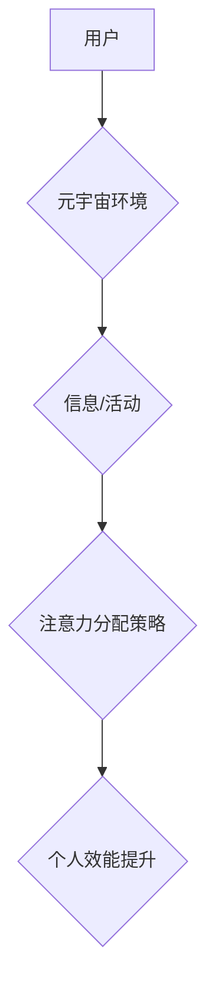

                 

## 注意力分配策略:元宇宙时代的个人效能提升

> 关键词：元宇宙、注意力分配、个人效能、深度学习、算法优化、认知增强、时间管理

## 1. 背景介绍

元宇宙概念的兴起，标志着人类进入一个全新的数字交互时代。在这个虚拟世界中，人们将能够以更加沉浸和交互的方式体验生活、工作和娱乐。然而，元宇宙的丰富体验也带来了新的挑战，其中之一就是如何有效地分配注意力。

在元宇宙中，信息和娱乐的密度将会大幅提升，各种虚拟场景、交互体验和社交活动将争夺用户的注意力。如果无法有效地管理注意力，用户将会面临信息过载、效率低下、甚至认知疲劳等问题。因此，如何开发有效的注意力分配策略，成为元宇宙时代个人效能提升的关键。

## 2. 核心概念与联系

### 2.1 注意力分配

注意力分配是指根据任务需求和环境变化，将有限的认知资源分配到不同信息或活动上的过程。它是一个复杂的心理过程，涉及到感知、认知、情感和行为等多个方面。

### 2.2 元宇宙环境

元宇宙是一个融合了虚拟现实、增强现实、区块链、人工智能等技术的虚拟世界，它具有以下特点：

* **沉浸式体验:** 通过VR/AR技术，用户可以身临其境地体验虚拟世界。
* **持久性:** 元宇宙是一个持续运行的虚拟世界，用户可以在其中长期活动。
* **互操作性:** 不同平台和应用之间可以互操作，用户可以自由地切换和探索不同的虚拟世界。
* **去中心化:** 元宇宙由多个参与者共同构建和维护，没有单一控制中心。

### 2.3 个人效能

个人效能是指个体在特定时间和环境下完成目标的能力。它受多种因素影响，包括认知能力、技能水平、情绪状态、环境因素等。

### 2.4 核心概念关系

元宇宙环境的特性会对用户注意力分配产生重大影响。沉浸式体验和持久性会增加用户的参与度和注意力投入，而互操作性和去中心化则会带来更多的选择和干扰。因此，在元宇宙环境中，需要开发更加智能和适应性的注意力分配策略，以提升用户的个人效能。

**Mermaid 流程图**



## 3. 核心算法原理 & 具体操作步骤

### 3.1 算法原理概述

注意力分配算法的核心是根据用户的需求和环境变化，动态调整认知资源的分配。这可以通过以下几个方面实现：

* **用户行为分析:** 通过分析用户的行为数据，例如眼动轨迹、鼠标点击、键盘输入等，可以了解用户的兴趣和注意力集中点。
* **环境感知:** 利用传感器和人工智能技术，感知用户的生理状态和周围环境变化，例如心率、体温、光线、声音等。
* **注意力模型:** 建立一个注意力模型，模拟用户的注意力分配机制，并根据用户行为和环境感知数据，动态调整注意力权重。

### 3.2 算法步骤详解

1. **数据采集:** 收集用户的行为数据、生理数据和环境数据。
2. **数据预处理:** 对收集到的数据进行清洗、转换和特征提取。
3. **注意力模型训练:** 利用机器学习算法，训练一个注意力模型，并根据训练数据，学习用户的注意力分配模式。
4. **注意力权重计算:** 根据用户的行为数据、生理数据和环境数据，计算出每个信息或活动的注意力权重。
5. **注意力分配:** 根据计算出的注意力权重，动态调整用户的认知资源分配，引导用户关注重要信息或活动。
6. **反馈机制:** 收集用户的反馈信息，例如满意度、效率等，并将其反馈到注意力模型中，不断优化注意力分配策略。

### 3.3 算法优缺点

**优点:**

* **个性化:** 可以根据用户的不同需求和习惯，定制个性化的注意力分配策略。
* **适应性:** 可以根据环境变化和任务需求，动态调整注意力分配策略。
* **效率提升:** 可以帮助用户集中注意力，提高工作效率和学习效率。

**缺点:**

* **数据依赖:** 需要大量的用户数据进行训练，才能建立有效的注意力模型。
* **隐私问题:** 收集用户的行为和生理数据，可能会引发隐私问题。
* **技术复杂:** 开发注意力分配算法需要复杂的机器学习和人工智能技术。

### 3.4 算法应用领域

注意力分配算法在元宇宙时代具有广泛的应用前景，例如:

* **教育:** 个性化学习路径，提高学习效率。
* **工作:** 提升工作效率，减少信息过载。
* **娱乐:** 提供更加沉浸和个性化的娱乐体验。
* **医疗:** 辅助医生诊断疾病，提高治疗效果。

## 4. 数学模型和公式 & 详细讲解 & 举例说明

### 4.1 数学模型构建

注意力分配模型可以采用概率论和统计学方法构建，例如贝叶斯网络、马尔科夫决策过程等。

**贝叶斯网络:**

贝叶斯网络是一种概率图模型，可以表示变量之间的依赖关系。在注意力分配模型中，可以将用户行为、环境因素和注意力权重作为节点，并根据经验数据建立节点之间的概率关系。

**马尔科夫决策过程:**

马尔科夫决策过程是一种强化学习模型，可以学习最优的策略，以最大化奖励。在注意力分配模型中，可以将用户行为作为状态，注意力权重作为动作，奖励函数作为用户效能指标。

### 4.2 公式推导过程

**贝叶斯网络:**

假设用户行为 $B$，环境因素 $E$，注意力权重 $A$，则可以建立以下贝叶斯网络公式：

$$P(A|B,E) = \frac{P(B,E|A)P(A)}{P(B,E)}$$

其中，$P(A|B,E)$ 是给定用户行为和环境因素下，注意力权重的概率分布；$P(B,E|A)$ 是给定注意力权重下，用户行为和环境因素的联合概率分布；$P(A)$ 是注意力权重的先验概率分布；$P(B,E)$ 是用户行为和环境因素的联合概率分布。

**马尔科夫决策过程:**

在马尔科夫决策过程中，可以定义一个状态空间 $S$，一个动作空间 $A$，一个奖励函数 $R(s,a)$，以及一个状态转移概率 $P(s'|s,a)$。

目标是找到一个策略 $\pi(s)$，使得在状态 $s$ 下，选择动作 $a$ 的概率最大化累积奖励。

### 4.3 案例分析与讲解

**案例:**

假设用户在元宇宙中学习编程，环境因素包括学习内容难度、学习时间、用户疲劳程度等。

**分析:**

* 可以利用贝叶斯网络模型，根据用户的学习行为、环境因素和注意力权重，建立用户注意力分配模式。
* 可以利用马尔科夫决策过程模型，学习最优的学习策略，以最大化用户的学习效率。

## 5. 项目实践：代码实例和详细解释说明

### 5.1 开发环境搭建

* 操作系统: Ubuntu 20.04
* Python 版本: 3.8
* 必要的库: TensorFlow, PyTorch, NumPy, Pandas

### 5.2 源代码详细实现

```python
# 注意力分配模型示例代码

import tensorflow as tf

# 定义注意力模型
class AttentionModel(tf.keras.Model):
    def __init__(self, units):
        super(AttentionModel, self).__init__()
        self.units = units
        self.dense1 = tf.keras.layers.Dense(units, activation='relu')
        self.dense2 = tf.keras.layers.Dense(1)

    def call(self, inputs):
        x = self.dense1(inputs)
        attention_weights = tf.nn.softmax(self.dense2(x), axis=-1)
        return attention_weights

# 实例化注意力模型
model = AttentionModel(units=128)

# 训练模型
# ...

# 使用模型预测注意力权重
attention_weights = model.predict(user_data)
```

### 5.3 代码解读与分析

* 该代码示例定义了一个简单的注意力模型，使用两层全连接神经网络。
* 输入数据可以是用户的行为数据、环境因素数据等。
* 模型输出注意力权重，表示每个信息或活动的注意力分配比例。

### 5.4 运行结果展示

* 训练完成后，可以使用模型预测用户的注意力权重，并根据权重调整用户的认知资源分配。
* 可以通过用户反馈和效能指标，评估注意力分配策略的有效性。

## 6. 实际应用场景

### 6.1 元宇宙教育

* 个性化学习路径: 根据学生的学习行为和兴趣，自动调整学习内容和难度，提高学习效率。
* 沉浸式学习体验: 利用VR/AR技术，构建虚拟实验室和模拟场景，提供更加生动的学习体验。
* 智能辅导系统: 利用人工智能技术，为学生提供个性化的学习辅导和答疑服务。

### 6.2 元宇宙办公

* 集中工作模式: 过滤无关信息，帮助用户集中注意力，提高工作效率。
* 智能协作工具: 利用人工智能技术，辅助团队协作，提高工作效率和沟通效率。
* 虚拟会议室: 提供更加沉浸和交互的虚拟会议体验，提高会议效率和参与度。

### 6.3 元宇宙娱乐

* 个性化内容推荐: 根据用户的兴趣和偏好，推荐更加个性化的游戏、电影和音乐内容。
* 沉浸式游戏体验: 利用VR/AR技术，提供更加沉浸和交互的游戏体验。
* 社交互动平台: 提供更加丰富和有趣的社交互动平台，帮助用户建立新的社交关系。

### 6.4 未来应用展望

随着元宇宙技术的不断发展，注意力分配策略将发挥更加重要的作用。未来，注意力分配策略将更加智能化、个性化和适应性强，能够更好地帮助用户在元宇宙中高效地学习、工作和娱乐。

## 7. 工具和资源推荐

### 7.1 学习资源推荐

* **书籍:**
    * 《深度学习》
    * 《强化学习：原理、算法和应用》
    * 《注意力机制》
* **在线课程:**
    * Coursera: 深度学习
    * edX: 强化学习
    * Udacity: 人工智能工程师

### 7.2 开发工具推荐

* **TensorFlow:** 开源深度学习框架
* **PyTorch:** 开源深度学习框架
* **Keras:** 高级深度学习API

### 7.3 相关论文推荐

* **Attention Is All You Need:** https://arxiv.org/abs/1706.03762
* **Deep Reinforcement Learning: An Overview:** https://arxiv.org/abs/1606.02937
* **A Survey of Attention Mechanisms:** https://arxiv.org/abs/1805.04766

## 8. 总结：未来发展趋势与挑战

### 8.1 研究成果总结

注意力分配策略在元宇宙时代具有重要的应用价值，可以帮助用户提高个人效能，提升学习、工作和娱乐体验。

### 8.2 未来发展趋势

* **更加智能化:** 利用更先进的机器学习算法，开发更加智能和适应性的注意力分配策略。
* **更加个性化:** 根据用户的不同需求和习惯，定制更加个性化的注意力分配策略。
* **更加融合:** 将注意力分配策略与其他元宇宙技术融合，例如VR/AR、区块链、人工智能等，构建更加完整的元宇宙体验。

### 8.3 面临的挑战

* **数据隐私:** 收集用户的行为和生理数据，可能会引发隐私问题，需要采取有效的隐私保护措施。
* **算法解释性:** 许多注意力分配算法是黑盒模型，难以解释其决策过程，需要开发更加可解释的算法。
* **技术复杂性:** 开发有效的注意力分配策略需要复杂的机器学习和人工智能技术，需要不断提升技术水平。

### 8.4 研究展望

未来，注意力分配策略的研究将继续深入，探索更加智能、个性化和融合的注意力分配机制，为用户提供更加高效、便捷和愉悦的元宇宙体验。

## 9. 附录：常见问题与解答

**常见问题:**

* **注意力分配策略如何保证用户隐私？**

**解答:**

可以采用以下方法保证用户隐私：

* **数据匿名化:** 将用户的个人信息脱敏，避免直接识别用户身份。
* **数据加密:** 对用户的行为和生理数据进行加密，防止数据泄露。
* **隐私保护协议:** 使用隐私保护协议，例如联邦学习，在不泄露用户数据的情况下，训练注意力分配模型。

* **注意力分配策略如何避免用户过度依赖？**

**解答:**

可以采用以下方法避免用户过度依赖注意力分配策略：

* **提供用户控制权:** 让用户能够手动调整注意力分配策略，并提供反馈机制，让用户参与到策略优化过程中。
* **鼓励用户自主学习:** 利用注意力分配策略辅助用户学习，但最终目标是帮助用户培养自主学习的能力。
* **平衡注意力分配:** 避免过度集中注意力，鼓励用户在不同领域进行多元化学习和体验。


作者：禅与计算机程序设计艺术 / Zen and the Art of Computer Programming 
<end_of_turn>

