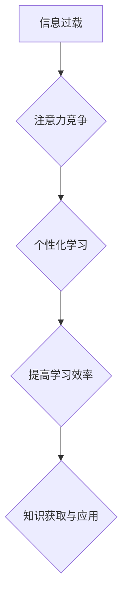

                 

##  注意力经济与个人学习方式的革新

> 关键词：注意力经济、深度学习、个性化学习、知识图谱、推荐系统、学习算法、认知科学

### 1. 背景介绍

在信息爆炸的时代，我们每天都被海量信息淹没。如何有效地获取、处理和利用信息，成为了当今社会面临的重大挑战。注意力经济的概念应运而生，它强调了在信息过载的时代，注意力是稀缺的资源，而获取和保持注意力是个人和组织竞争力的关键。

传统的教育模式和学习方式，往往是“一刀切”式的，无法满足个性化的学习需求。随着深度学习、人工智能等技术的快速发展，个性化学习逐渐成为可能。通过对用户的学习行为、兴趣偏好、知识结构等进行分析，我们可以构建个性化的学习路径，并提供更精准、有效的学习内容和方法。

### 2. 核心概念与联系

#### 2.1 注意力经济

注意力经济是指在信息爆炸的时代，注意力成为一种稀缺资源，而获取和保持注意力是个人和组织竞争力的关键。

#### 2.2 个人学习方式

个人学习方式是指个体在学习过程中所采用的策略、方法和习惯。每个人的学习风格、认知能力、兴趣爱好等都不同，因此学习方式也千差万别。

#### 2.3 关联性

注意力经济与个人学习方式密切相关。在信息过载的时代，如何有效地获取和保持注意力，成为了个人学习的关键。个性化的学习方式可以帮助用户更好地集中注意力，提高学习效率。

**Mermaid 流程图**



### 3. 核心算法原理 & 具体操作步骤

#### 3.1 算法原理概述

个性化学习算法的核心是根据用户的学习行为、兴趣偏好、知识结构等进行分析，并推荐最适合用户的学习内容和方法。常用的算法包括：

* **协同过滤算法:** 根据用户的历史学习行为和与其他用户的相似性，推荐相关的学习内容。
* **内容基准算法:** 根据学习内容的主题、标签、关键词等信息，推荐与用户兴趣相符的内容。
* **深度学习算法:** 利用深度神经网络，对用户的学习数据进行更深入的分析，并生成更精准的个性化推荐。

#### 3.2 算法步骤详解

以协同过滤算法为例，其具体操作步骤如下：

1. **数据收集:** 收集用户的学习行为数据，包括学习过的课程、学习时间、学习进度、评价等。
2. **用户相似度计算:** 计算用户之间的相似度，可以使用余弦相似度、皮尔逊相关系数等方法。
3. **推荐内容生成:** 根据用户的相似用户，推荐他们学习过的课程或内容。
4. **推荐结果评估:** 对推荐结果进行评估，可以使用点击率、转化率等指标。

#### 3.3 算法优缺点

**优点:**

* 可以根据用户的个性化需求，提供更精准的学习推荐。
* 可以挖掘用户的潜在兴趣，帮助用户发现新的学习资源。

**缺点:**

* 需要大量的用户数据才能训练出准确的模型。
* 容易出现冷启动问题，对于新用户或新内容的推荐效果较差。

#### 3.4 算法应用领域

个性化学习算法广泛应用于教育、培训、在线学习平台等领域，例如：

* **在线课程推荐:** 根据用户的学习兴趣和进度，推荐相关的课程。
* **个性化学习路径:** 根据用户的学习目标和能力，构建个性化的学习路径。
* **智能辅导系统:** 根据用户的学习情况，提供个性化的辅导和帮助。

### 4. 数学模型和公式 & 详细讲解 & 举例说明

#### 4.1 数学模型构建

协同过滤算法的核心是用户-项目矩阵，该矩阵表示每个用户对每个项目的评分或偏好。

**用户-项目矩阵:**

$$
\mathbf{R} = \begin{bmatrix}
r_{11} & r_{12} & \dots & r_{1m} \\
r_{21} & r_{22} & \dots & r_{2m} \\
\vdots & \vdots & \ddots & \vdots \\
r_{n1} & r_{n2} & \dots & r_{nm}
\end{bmatrix}
$$

其中：

* $r_{ij}$ 表示用户 $i$ 对项目 $j$ 的评分或偏好。
* $n$ 是用户数量。
* $m$ 是项目数量。

#### 4.2 公式推导过程

协同过滤算法的目标是预测用户 $i$ 对项目 $j$ 的评分或偏好。可以使用以下公式进行预测：

$$
\hat{r}_{ij} = \mathbf{u}_i^T \mathbf{v}_j
$$

其中：

* $\hat{r}_{ij}$ 是预测的用户 $i$ 对项目 $j$ 的评分或偏好。
* $\mathbf{u}_i$ 是用户 $i$ 的特征向量。
* $\mathbf{v}_j$ 是项目 $j$ 的特征向量。

#### 4.3 案例分析与讲解

假设我们有一个用户-项目矩阵，其中包含用户对电影的评分数据。我们可以使用协同过滤算法，预测用户 $A$ 对电影 $B$ 的评分。

1. 计算用户 $A$ 和所有其他用户的相似度。
2. 根据相似度，找到与用户 $A$ 最相似的用户 $B$。
3. 将用户 $B$ 对电影 $B$ 的评分作为预测值。

### 5. 项目实践：代码实例和详细解释说明

#### 5.1 开发环境搭建

* Python 3.x
* scikit-learn 库
* Pandas 库
* Matplotlib 库

#### 5.2 源代码详细实现

```python
import pandas as pd
from sklearn.metrics.pairwise import cosine_similarity

# 加载用户-项目矩阵
data = pd.read_csv('ratings.csv')

# 计算用户之间的相似度
user_similarity = cosine_similarity(data.T)

# 预测用户 A 对电影 B 的评分
user_A_index = data.index.get_loc('user_A')
movie_B_index = data.columns.get_loc('movie_B')

# 找到与用户 A 最相似的用户
similar_users = user_similarity[user_A_index].argsort()[::-1][1:6]

# 计算预测评分
predicted_rating = sum([data.iloc[user, movie_B_index] for user in similar_users]) / len(similar_users)

print(f'预测用户 A 对电影 B 的评分: {predicted_rating}')
```

#### 5.3 代码解读与分析

* 首先，我们加载用户-项目矩阵数据。
* 然后，使用 cosine_similarity 函数计算用户之间的相似度。
* 接着，根据用户 A 的索引和电影 B 的索引，找到与用户 A 最相似的用户。
* 最后，根据相似用户的评分，计算预测评分。

#### 5.4 运行结果展示

运行上述代码，可以得到用户 A 对电影 B 的预测评分。

### 6. 实际应用场景

#### 6.1 在线教育平台

个性化学习算法可以帮助在线教育平台推荐更适合用户的课程和学习资源，提高用户的学习效率和满意度。

#### 6.2 智能辅导系统

智能辅导系统可以根据用户的学习情况，提供个性化的辅导和帮助，帮助用户克服学习困难。

#### 6.3 企业培训

企业可以利用个性化学习算法，为员工提供个性化的培训方案，提高员工的技能水平和工作效率。

#### 6.4 未来应用展望

随着人工智能技术的不断发展，个性化学习将更加智能化、精准化。未来，个性化学习将应用于更广泛的领域，例如：

* **医疗保健:** 为患者提供个性化的医疗建议和治疗方案。
* **金融服务:** 为客户提供个性化的理财建议和投资方案。
* **个性化娱乐:** 为用户推荐个性化的音乐、电影和游戏。

### 7. 工具和资源推荐

#### 7.1 学习资源推荐

* **深度学习课程:** Coursera、edX、Udacity 等平台提供丰富的深度学习课程。
* **机器学习书籍:** 《机器学习》 (周志华)、《深度学习》 (Ian Goodfellow) 等书籍。
* **在线社区:** Kaggle、Stack Overflow 等在线社区可以帮助你学习和交流。

#### 7.2 开发工具推荐

* **Python:** Python 是机器学习和深度学习的常用编程语言。
* **scikit-learn:** scikit-learn 是 Python 的一个机器学习库，提供了丰富的算法和工具。
* **TensorFlow:** TensorFlow 是 Google 开发的深度学习框架。

#### 7.3 相关论文推荐

* **Collaborative Filtering for Implicit Feedback Datasets**
* **Deep Learning for Recommender Systems**
* **Personalized Learning: A Survey**

### 8. 总结：未来发展趋势与挑战

#### 8.1 研究成果总结

注意力经济与个性化学习的结合，为提升学习效率和效果提供了新的思路和方法。深度学习算法在个性化推荐领域取得了显著的成果，为用户提供更加精准、有效的学习体验。

#### 8.2 未来发展趋势

* **更精准的个性化推荐:** 利用更先进的算法和数据分析技术，对用户的学习行为进行更深入的分析，提供更精准的个性化推荐。
* **更丰富的学习资源:** 开发更多类型的个性化学习资源，例如：互动式课程、虚拟现实体验、个性化学习计划等。
* **更智能的学习助手:** 开发更智能的学习助手，能够根据用户的学习情况，提供个性化的辅导和帮助。

#### 8.3 面临的挑战

* **数据隐私保护:** 个性化学习算法需要收集大量的用户数据，如何保护用户隐私是一个重要的挑战。
* **算法公平性:** 个性化学习算法可能会存在偏见，导致某些用户获得更好的学习体验，而另一些用户则受到不利影响。
* **技术可访问性:** 个性化学习技术需要强大的计算能力和数据存储能力，如何让这些技术更易于普及是一个重要的挑战。

#### 8.4 研究展望

未来，我们将继续研究个性化学习算法，探索更精准、更智能、更公平的个性化学习方法，为用户提供更好的学习体验。

### 9. 附录：常见问题与解答

* **Q1: 个性化学习算法需要收集哪些数据？**

* **A1:** 个性化学习算法需要收集用户的学习行为数据，例如：学习过的课程、学习时间、学习进度、评价等。

* **Q2: 个性化学习算法的优点是什么？**

* **A2:** 个性化学习算法可以根据用户的个性化需求，提供更精准的学习推荐，并帮助用户发现新的学习资源。

* **Q3: 个性化学习算法的缺点是什么？**

* **A3:** 个性化学习算法需要大量的用户数据才能训练出准确的模型，并且容易出现冷启动问题。


作者：禅与计算机程序设计艺术 / Zen and the Art of Computer Programming 
<end_of_turn>

