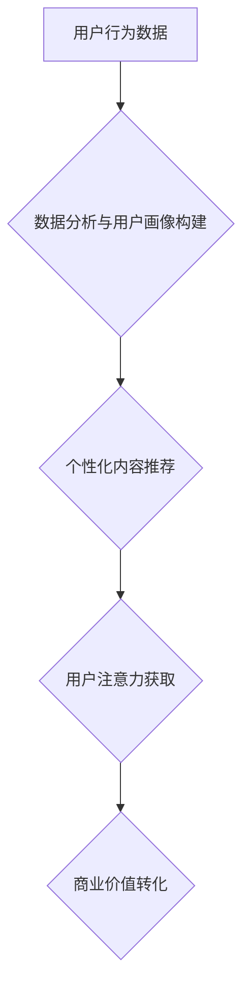

                 

##  注意力经济与个性化营销技术：为受众创建定制、有针对性的体验

> 关键词：注意力经济、个性化营销、深度学习、推荐系统、用户画像、A/B测试、数据分析、机器学习

### 1. 背景介绍

在当今信息爆炸的时代，人们每天面临着海量的信息冲击。如何有效地抓住用户的注意力，并将其转化为商业价值，成为企业面临的重大挑战。注意力经济应运而生，它强调了注意力是稀缺资源，而获取和利用注意力是企业竞争的关键。

个性化营销技术作为注意力经济的重要组成部分，旨在通过对用户的深入了解和分析，为其提供定制化的产品、服务和体验。传统的营销方式往往采用“一刀切”的策略，难以满足用户日益增长的个性化需求。而个性化营销技术则通过数据驱动和人工智能技术，能够精准地识别用户的兴趣、偏好和行为模式，从而提供更精准、更有效的营销服务。

### 2. 核心概念与联系

#### 2.1 注意力经济

注意力经济是指在信息过载的时代，人们对信息的筛选和选择能力成为重要的经济资源。注意力是稀缺的，而获取和利用注意力是企业竞争的关键。

#### 2.2 个性化营销

个性化营销是指根据用户的个人特征、行为模式和偏好，提供定制化的产品、服务和体验。其目标是提高用户参与度、增强用户粘性，最终提升营销效果。

#### 2.3 核心概念联系

注意力经济和个性化营销是相互关联的。个性化营销技术可以帮助企业更有效地获取和利用用户的注意力。通过提供定制化的内容和体验，个性化营销可以吸引用户的注意力，并将其转化为商业价值。

**Mermaid 流程图**



### 3. 核心算法原理 & 具体操作步骤

#### 3.1 算法原理概述

个性化营销技术的核心算法主要包括：

* **协同过滤算法:** 基于用户的历史行为数据，预测用户对特定产品的兴趣。
* **内容基准算法:** 基于产品的特征和用户偏好，推荐与用户兴趣相符的内容。
* **深度学习算法:** 利用深度神经网络，从海量数据中学习用户行为模式，进行更精准的个性化推荐。

#### 3.2 算法步骤详解

以协同过滤算法为例，其具体操作步骤如下：

1. **数据收集:** 收集用户的行为数据，例如浏览记录、购买记录、评分等。
2. **数据预处理:** 对收集到的数据进行清洗、转换和格式化，以便于算法的训练和使用。
3. **用户相似度计算:** 计算用户之间的相似度，例如基于余弦相似度、皮尔逊相关系数等。
4. **推荐生成:** 根据用户的相似用户，推荐与其相似用户喜欢的产品或内容。

#### 3.3 算法优缺点

**协同过滤算法:**

* **优点:** 能够发现用户之间的隐性关联，推荐个性化内容。
* **缺点:** 数据稀疏性问题，新用户或新产品难以推荐。

**内容基准算法:**

* **优点:** 不需要用户历史行为数据，能够推荐与用户兴趣相符的内容。
* **缺点:** 难以捕捉用户细微的偏好，推荐结果可能不够个性化。

**深度学习算法:**

* **优点:** 能够从海量数据中学习用户行为模式，推荐更精准的个性化内容。
* **缺点:** 需要大量的训练数据，训练成本较高。

#### 3.4 算法应用领域

个性化营销算法广泛应用于以下领域：

* **电商平台:** 商品推荐、个性化广告、用户画像构建。
* **社交媒体:** 内容推荐、用户匹配、广告投放。
* **流媒体平台:** 内容推荐、用户画像构建、个性化广告。
* **金融服务:** 产品推荐、风险评估、个性化理财建议。

### 4. 数学模型和公式 & 详细讲解 & 举例说明

#### 4.1 数学模型构建

协同过滤算法的数学模型可以表示为用户-物品评分矩阵，其中每个元素代表用户对特定物品的评分。

**用户-物品评分矩阵:**

$$
R = \begin{bmatrix}
r_{11} & r_{12} & \cdots & r_{1m} \\
r_{21} & r_{22} & \cdots & r_{2m} \\
\vdots & \vdots & \ddots & \vdots \\
r_{n1} & r_{n2} & \cdots & r_{nm}
\end{bmatrix}
$$

其中：

* $r_{ij}$ 表示用户 $i$ 对物品 $j$ 的评分。
* $n$ 表示用户数量。
* $m$ 表示物品数量。

#### 4.2 公式推导过程

协同过滤算法的目标是预测用户对特定物品的评分。常用的预测公式包括：

* **基于用户的协同过滤:**

$$
\hat{r}_{ui} = \bar{r}_u + \frac{\sum_{v \in N(u)} (r_{uv} - \bar{r}_u) \cdot s_{uv}}{\sum_{v \in N(u)} s_{uv}}
$$

其中：

* $\hat{r}_{ui}$ 表示预测用户 $u$ 对物品 $i$ 的评分。
* $\bar{r}_u$ 表示用户 $u$ 的平均评分。
* $N(u)$ 表示与用户 $u$ 相似的用户集合。
* $r_{uv}$ 表示用户 $u$ 对物品 $v$ 的评分。
* $s_{uv}$ 表示用户 $u$ 和用户 $v$ 的相似度。

* **基于物品的协同过滤:**

$$
\hat{r}_{ui} = \bar{r}_i + \frac{\sum_{v \in N(i)} (r_{uv} - \bar{r}_i) \cdot s_{vi}}{\sum_{v \in N(i)} s_{vi}}
$$

其中：

* $N(i)$ 表示与物品 $i$ 相似的物品集合。
* $\bar{r}_i$ 表示物品 $i$ 的平均评分。

#### 4.3 案例分析与讲解

假设有一个电商平台，用户购买记录如下：

| 用户 | 商品 A | 商品 B | 商品 C |
|---|---|---|---|
| 用户 1 | 5 | 4 | 3 |
| 用户 2 | 3 | 5 | 4 |
| 用户 3 | 4 | 3 | 5 |

我们可以使用协同过滤算法，预测用户 1 对商品 C 的评分。

根据用户 1 和用户 2 的购买记录，我们可以计算出用户 1 和用户 2 的相似度。假设用户 1 和用户 2 的相似度为 0.8。

然后，我们可以使用基于用户的协同过滤公式，预测用户 1 对商品 C 的评分：

$$
\hat{r}_{1C} = \bar{r}_1 + \frac{(r_{2C} - \bar{r}_1) \cdot 0.8}{0.8}
$$

其中：

* $\bar{r}_1$ 是用户 1 的平均评分。
* $r_{2C}$ 是用户 2 对商品 C 的评分。

通过计算，我们可以得到用户 1 对商品 C 的预测评分。

### 5. 项目实践：代码实例和详细解释说明

#### 5.1 开发环境搭建

* Python 3.x
* scikit-learn 库
* pandas 库
* numpy 库

#### 5.2 源代码详细实现

```python
import pandas as pd
from sklearn.metrics.pairwise import cosine_similarity

# 加载用户-物品评分数据
ratings_data = pd.read_csv('ratings.csv')

# 计算用户之间的余弦相似度
user_similarity = cosine_similarity(ratings_data)

# 预测用户对特定物品的评分
def predict_rating(user_id, item_id):
    # 获取用户相似用户
    similar_users = user_similarity[user_id].argsort()[:-10:-1]
    
    # 计算预测评分
    predicted_rating = 0
    for similar_user in similar_users:
        if ratings_data.loc[similar_user, item_id] != 0:
            predicted_rating += ratings_data.loc[similar_user, item_id] * user_similarity[user_id][similar_user]
    
    return predicted_rating / sum(user_similarity[user_id][similar_users])

# 预测用户 1 对商品 C 的评分
predicted_rating = predict_rating(0, 2)
print(f'预测用户 1 对商品 C 的评分: {predicted_rating}')
```

#### 5.3 代码解读与分析

* 代码首先加载用户-物品评分数据。
* 然后使用 scikit-learn 库的 cosine_similarity 函数计算用户之间的余弦相似度。
* predict_rating 函数用于预测用户对特定物品的评分。
* 该函数首先获取用户相似用户，然后根据相似用户的评分和相似度，计算预测评分。

#### 5.4 运行结果展示

运行代码后，可以得到用户 1 对商品 C 的预测评分。

### 6. 实际应用场景

#### 6.1 电商平台

* **商品推荐:** 根据用户的浏览记录、购买记录和评分等数据，推荐与用户兴趣相符的商品。
* **个性化广告:** 根据用户的兴趣爱好和行为模式，推送个性化的广告，提高广告点击率和转化率。
* **用户画像构建:** 通过分析用户的行为数据，构建用户画像，了解用户的兴趣、偏好和消费习惯。

#### 6.2 社交媒体

* **内容推荐:** 根据用户的浏览记录、点赞记录和评论记录等数据，推荐与用户兴趣相符的内容。
* **用户匹配:** 根据用户的兴趣爱好和行为模式，匹配用户之间的潜在关系，促进用户之间的互动。
* **个性化广告:** 根据用户的兴趣爱好和行为模式，推送个性化的广告，提高广告点击率和转化率。

#### 6.3 流媒体平台

* **内容推荐:** 根据用户的观看记录、评分记录和点赞记录等数据，推荐与用户兴趣相符的视频内容。
* **用户画像构建:** 通过分析用户的观看数据，构建用户画像，了解用户的兴趣、偏好和观看习惯。
* **个性化广告:** 根据用户的兴趣爱好和行为模式，推送个性化的广告，提高广告点击率和转化率。

#### 6.4 未来应用展望

随着人工智能技术的不断发展，个性化营销技术将更加智能化、精准化和个性化。未来，个性化营销技术将应用于更多领域，例如：

* **医疗保健:** 提供个性化的医疗建议和治疗方案。
* **教育:** 提供个性化的学习内容和教学方法。
* **金融服务:** 提供个性化的理财建议和投资方案。

### 7. 工具和资源推荐

#### 7.1 学习资源推荐

* **书籍:**
    * 《深度学习》
    * 《机器学习实战》
    * 《推荐系统实践》
* **在线课程:**
    * Coursera: 深度学习
    * edX: 机器学习
    * Udacity: 数据科学

#### 7.2 开发工具推荐

* **Python:** 
    * scikit-learn
    * pandas
    * numpy
* **Spark:** 大数据处理框架
* **TensorFlow:** 深度学习框架
* **PyTorch:** 深度学习框架

#### 7.3 相关论文推荐

* **Collaborative Filtering for Implicit Feedback Datasets**
* **Matrix Factorization Techniques for Recommender Systems**
* **Deep Learning for Recommender Systems**

### 8. 总结：未来发展趋势与挑战

#### 8.1 研究成果总结

注意力经济与个性化营销技术的发展取得了显著成果，为企业提供了更精准、更有效的营销手段。协同过滤算法、内容基准算法和深度学习算法等技术为个性化推荐提供了强大的支持。

#### 8.2 未来发展趋势

* **更精准的个性化推荐:** 利用更先进的机器学习算法和深度学习模型，从海量数据中学习用户行为模式，提供更精准的个性化推荐。
* **跨平台个性化体验:** 将个性化体验扩展到多个平台，例如电商平台、社交媒体平台和流媒体平台，为用户提供更完整的个性化服务。
* **隐私保护与数据安全:** 随着用户隐私意识的增强，个性化营销技术需要更加注重用户隐私保护和数据安全。

#### 8.3 面临的挑战

* **数据稀疏性问题:** 对于新用户或新产品，数据稀疏性问题难以解决，导致推荐结果不准确。
* **冷启动问题:** 新用户或新产品难以获得足够的推荐数据，导致推荐效果不佳。
* **用户反馈机制:** 如何有效地收集用户反馈，并将其用于改进个性化推荐算法，是一个重要的挑战。

#### 8.4 研究展望

未来，个性化营销技术将继续朝着更智能化、更精准化和更个性化的方向发展。研究者将继续探索新的算法和模型，以解决数据稀疏性问题、冷启动问题和用户反馈机制等挑战。


### 9. 附录：常见问题与解答

#### 9.1 如何解决数据稀疏性问题？

数据稀疏性问题可以通过以下方法解决：

* **利用协同过滤算法的扩展版本:** 例如，基于物品的协同过滤算法，可以利用物品之间的相似性来弥补用户数据稀疏性。
* **引入其他数据源:** 例如，利用用户 demographics 信息、兴趣爱好信息等，丰富用户数据。
* **使用深度学习算法:** 深度学习算法能够从海量数据中学习用户行为模式，即使数据稀疏，也能获得较好的推荐效果。

#### 9.2 如何解决冷启动问题？

冷启动问题可以通过以下方法解决：

* **利用用户提供的初始信息:** 例如，用户可以手动输入自己的兴趣爱好，或者选择一些喜欢的商品。
* **利用物品的特征信息:** 例如，可以利用物品的类别、描述、价格等信息，进行推荐。
* **使用基于内容的推荐算法:** 基于内容的推荐算法可以利用物品的特征信息，推荐与用户兴趣相符的物品。


作者：禅与计算机程序设计艺术 / Zen and the Art of Computer Programming 
<end_of_turn>

