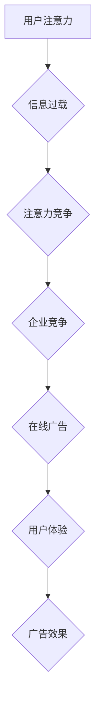

                 

##  注意力经济与在线广告目标与实践：在不牺牲用户体验的情况下吸引受众

> 关键词：注意力经济，在线广告，用户体验，目标化广告，深度学习，推荐系统

## 1. 背景介绍

在数字时代，信息爆炸式增长，用户每天面临着海量信息的选择和处理。如何有效地吸引用户注意力，并将其转化为商业价值，成为企业和广告主面临的重大挑战。

注意力经济的概念应运而生，它强调了在信息过载的时代，用户注意力是稀缺的资源，而获取和利用用户注意力是企业竞争的关键。在线广告作为获取用户注意力的重要手段，也面临着新的挑战。传统的广告模式，例如横幅广告和弹窗广告，往往具有侵入性和干扰性，容易导致用户反感和屏蔽。

因此，如何设计和投放有效的在线广告，既能吸引用户注意力，又能保证用户体验，成为当前在线广告领域的研究热点。

## 2. 核心概念与联系

### 2.1 注意力经济

注意力经济是指在信息爆炸时代，用户注意力成为一种稀缺资源，而获取和利用用户注意力是企业竞争的关键。

**核心概念：**

* **注意力：** 指用户对特定信息或内容的集中和投入。
* **稀缺性：** 在信息过载的时代，用户注意力是有限的，无法同时关注所有信息。
* **价值：** 用户注意力具有商业价值，企业可以通过获取和利用用户注意力来实现商业目标。

**注意力经济的本质：**

注意力经济的核心是用户行为的改变。随着互联网和移动互联网的发展，用户的信息获取方式和消费习惯发生了巨大变化。用户不再被动接受信息，而是主动选择和过滤信息。因此，企业需要更加注重用户体验，并通过提供有价值、个性化的内容来吸引用户注意力。

### 2.2 在线广告

在线广告是指在互联网平台上投放广告的一种形式。

**核心概念：**

* **目标受众：** 在线广告的目标是吸引特定群体的用户。
* **广告投放：** 通过各种渠道和平台投放广告，例如搜索引擎、社交媒体、网站等。
* **广告效果：** 在线广告的效果可以通过各种指标来衡量，例如点击率、转化率、品牌知名度等。

**在线广告的挑战：**

* **用户注意力分散：** 用户在互联网上面临着海量信息的选择和处理，注意力容易分散。
* **广告屏蔽：** 用户使用广告屏蔽软件来阻止广告的显示。
* **用户隐私保护：** 在线广告需要收集用户数据，而用户隐私保护问题日益受到关注。

### 2.3 用户体验

用户体验是指用户使用产品或服务时的感受和体验。

**核心概念：**

* **易用性：** 产品或服务易于理解和使用。
* **可用性：** 产品或服务能够满足用户的需求。
* **愉悦性：** 用户使用产品或服务感到愉悦和满足。

**用户体验的重要性：**

良好的用户体验可以提高用户满意度、忠诚度和转化率。而糟糕的用户体验则会导致用户流失和负面评价。

**用户体验与在线广告的关系：**

在线广告需要在保证用户体验的前提下吸引用户注意力。如果广告过于侵入性和干扰性，会损害用户体验，导致用户反感和屏蔽。

**Mermaid 流程图：**



## 3. 核心算法原理 & 具体操作步骤

### 3.1 算法原理概述

目标化广告的核心算法原理是通过分析用户行为数据，预测用户的兴趣和需求，并根据这些预测结果，向用户展示最相关的广告。

**主要算法类型：**

* **协同过滤：** 基于用户的历史行为数据，推荐与用户兴趣相似的其他用户或商品。
* **内容过滤：** 基于广告内容和用户的兴趣偏好，推荐相关的广告。
* **深度学习：** 利用深度神经网络，从海量用户数据中学习用户特征和行为模式，进行更精准的广告推荐。

### 3.2 算法步骤详解

**以深度学习算法为例，详细说明目标化广告的具体操作步骤：**

1. **数据收集：** 收集用户行为数据，例如浏览历史、搜索记录、点击行为、购买记录等。
2. **数据预处理：** 对收集到的数据进行清洗、转换和特征提取，以便于模型训练。
3. **模型训练：** 利用深度学习算法，训练一个广告推荐模型。
4. **模型评估：** 使用测试数据评估模型的性能，例如准确率、召回率、点击率等。
5. **模型部署：** 将训练好的模型部署到线上环境，用于实时广告推荐。

### 3.3 算法优缺点

**深度学习算法的优缺点：**

**优点：**

* **精准度高：** 深度学习算法能够从海量数据中学习用户特征和行为模式，进行更精准的广告推荐。
* **可扩展性强：** 深度学习算法能够处理海量数据，并随着数据量的增加而不断提升性能。

**缺点：**

* **训练成本高：** 深度学习模型的训练需要大量的计算资源和时间。
* **数据依赖性强：** 深度学习算法的性能依赖于训练数据的质量和数量。

### 3.4 算法应用领域

目标化广告算法广泛应用于以下领域：

* **搜索引擎广告：** 根据用户的搜索关键词，推荐相关的广告。
* **社交媒体广告：** 根据用户的兴趣爱好和社交关系，推荐相关的广告。
* **电商广告：** 根据用户的浏览历史和购买记录，推荐相关的商品广告。

## 4. 数学模型和公式 & 详细讲解 & 举例说明

### 4.1 数学模型构建

目标化广告的数学模型通常基于概率论和统计学，旨在预测用户对特定广告的点击概率。

**常用的模型：**

* **逻辑回归模型：** 用于预测用户点击广告的概率，模型假设用户点击行为服从伯努利分布。

* **支持向量机模型：** 用于分类用户，将用户分为点击和不点击两类，模型试图找到一个最佳的超平面将两类用户分开。

* **深度神经网络模型：** 用于学习用户特征和行为模式，并预测用户点击广告的概率，模型能够处理更复杂的特征关系。

### 4.2 公式推导过程

**以逻辑回归模型为例，推导其点击概率的公式：**

假设用户 $i$ 点击广告 $j$ 的概率为 $p_{ij}$，则可以使用逻辑回归模型来预测 $p_{ij}$：

$$
p_{ij} = \frac{1}{1 + e^{-(w_0 + w_1x_{i1} + w_2x_{i2} + ... + w_nx_{in})}}
$$

其中：

* $w_0$ 是模型的截距项。
* $w_1, w_2, ..., w_n$ 是模型的权重参数，分别对应用户特征 $x_{i1}, x_{i2}, ..., x_{in}$。
* $x_{i1}, x_{i2}, ..., x_{in}$ 是用户 $i$ 的特征向量。

### 4.3 案例分析与讲解

**举例说明：**

假设我们想要预测用户是否点击一个电商平台的广告，用户特征包括年龄、性别、浏览历史、购买记录等。我们可以使用逻辑回归模型训练一个广告点击预测模型。

通过训练模型，我们可以得到模型的权重参数，例如：

* $w_0 = 0.5$
* $w_1 = 0.2$ (年龄特征)
* $w_2 = 0.3$ (性别特征)
* $w_3 = 0.1$ (浏览历史特征)
* $w_4 = 0.4$ (购买记录特征)

当我们收到一个新的用户请求时，我们可以将用户的特征向量输入到模型中，得到该用户的点击概率。

## 5. 项目实践：代码实例和详细解释说明

### 5.1 开发环境搭建

**开发环境：**

* 操作系统：Windows/macOS/Linux
* Python 版本：3.6+
* 必要的库：TensorFlow/PyTorch、Scikit-learn、Pandas、NumPy

**步骤：**

1. 安装 Python 和必要的库。
2. 创建一个新的 Python 项目文件夹。
3. 在项目文件夹中创建一个 `requirements.txt` 文件，列出项目所需的库。

### 5.2 源代码详细实现

```python
import tensorflow as tf
from tensorflow.keras.models import Sequential
from tensorflow.keras.layers import Dense

# 构建模型
model = Sequential()
model.add(Dense(64, activation='relu', input_shape=(4,)))
model.add(Dense(32, activation='relu'))
model.add(Dense(1, activation='sigmoid'))

# 编译模型
model.compile(optimizer='adam',
              loss='binary_crossentropy',
              metrics=['accuracy'])

# 训练模型
model.fit(X_train, y_train, epochs=10, batch_size=32)

# 评估模型
loss, accuracy = model.evaluate(X_test, y_test)
print('Loss:', loss)
print('Accuracy:', accuracy)
```

**代码解释：**

* 首先，我们使用 TensorFlow 库构建一个简单的深度神经网络模型。
* 模型包含三个全连接层，第一层输入层有 4 个神经元，对应用户特征的维度。
* 激活函数使用 ReLU 函数，输出层使用 sigmoid 函数，用于预测点击概率。
* 然后，我们使用 Adam 优化器，交叉熵损失函数和准确率指标来编译模型。
* 最后，我们使用训练数据训练模型，并使用测试数据评估模型的性能。

### 5.3 代码解读与分析

**代码解读：**

* 代码中使用了 TensorFlow 库构建了一个简单的深度神经网络模型。
* 模型的结构可以根据实际需求进行调整，例如增加层数、改变神经元数量等。
* 训练模型时，可以使用不同的优化器、损失函数和指标。
* 评估模型时，可以使用准确率、召回率、F1-score 等指标来衡量模型的性能。

**代码分析：**

* 代码中使用了 TensorFlow 的简洁语法，易于理解和修改。
* 代码中使用了常见的深度学习模型结构和训练方法。
* 代码中没有使用复杂的数学公式和算法，易于入门学习。

### 5.4 运行结果展示

**运行结果展示：**

训练完成后，我们可以使用测试数据评估模型的性能。

例如，如果模型的准确率为 0.85，则表示模型能够正确预测 85% 的用户点击行为。

## 6. 实际应用场景

### 6.1 搜索引擎广告

搜索引擎广告是目标化广告应用最广泛的场景之一。

**应用方式：**

* 根据用户的搜索关键词，推荐相关的广告。
* 根据用户的搜索历史和浏览记录，推荐个性化的广告。

**优势：**

* 精准度高：搜索引擎广告能够根据用户的搜索意图精准推荐广告。
* 成本效益高：搜索引擎广告的付费模式是按点击付费，能够有效控制广告成本。

### 6.2 社交媒体广告

社交媒体广告是指在社交媒体平台上投放广告的一种形式。

**应用方式：**

* 根据用户的兴趣爱好和社交关系，推荐相关的广告。
* 利用社交媒体平台的用户数据，进行精准的广告投放。

**优势：**

* 覆盖面广：社交媒体平台拥有庞大的用户群体，能够覆盖广泛的受众。
* 互动性强：社交媒体广告能够与用户进行互动，提高用户参与度。

### 6.3 电商广告

电商广告是指在电商平台上投放广告的一种形式。

**应用方式：**

* 根据用户的浏览历史和购买记录，推荐相关的商品广告。
* 利用电商平台的用户数据，进行精准的商品推荐。

**优势：**

* 转化率高：电商广告能够直接引导用户购买商品，转化率较高。
* 数据丰富：电商平台拥有丰富的用户数据，能够进行更精准的广告投放。

### 6.4 未来应用展望

目标化广告的未来应用前景广阔，例如：

* **个性化推荐：** 利用深度学习算法，对用户的兴趣爱好和需求进行更精准的分析，提供更个性化的广告推荐。
* **跨平台广告投放：** 将用户数据整合到多个平台，实现跨平台的广告投放，提高广告覆盖率和效果。
* **增强现实广告：** 利用增强现实技术，将广告融入到用户的现实世界中，提供更沉浸式的广告体验。

## 7. 工具和资源推荐

### 7.1 学习资源推荐

* **书籍：**
    * 《深度学习》
    * 《机器学习》
    * 《广告算法》
* **在线课程：**
    * Coursera
    * edX
    * Udacity

### 7.2 开发工具推荐

* **TensorFlow：** 开源深度学习框架，支持多种硬件平台。
* **PyTorch：** 开源深度学习框架，以其灵活性和易用性而闻名。
* **Scikit-learn：** 开源机器学习库，提供各种机器学习算法和工具。

### 7.3 相关论文推荐

* **Attention Is All You Need**
* **BERT: Pre-training of Deep Bidirectional Transformers for Language Understanding**
* **Deep Learning for Recommender Systems**

## 8. 总结：未来发展趋势与挑战

### 8.1 研究成果总结

目标化广告算法在过去几年取得了显著的进展，能够实现更精准的广告推荐，提高广告效果。

**主要成果：**

* 深度学习算法的应用，提高了广告推荐的精准度和效率。
* 用户行为数据的收集和分析，为广告投放提供了更丰富的依据。
* 广告投放技术的不断创新，例如增强现实广告、跨平台广告投放等。

### 8.2 未来发展趋势

目标化广告的未来发展趋势包括：

* **更精准的个性化推荐：** 利用更先进的深度学习算法和用户数据分析技术，实现更精准的个性化广告推荐。
* **更丰富的广告形式：** 开发更具创意和互动性的广告形式，例如增强现实广告、虚拟现实广告等。
* **更注重用户隐私保护：** 开发更隐私友好的广告投放技术，保护用户的个人信息安全。

### 8.3 面临的挑战

目标化广告也面临着一些挑战：

* **数据安全和隐私保护：** 广告投放需要收集和分析用户的个人数据，如何保护用户的隐私安全是一个重要的挑战。
* **广告屏蔽和欺诈行为：** 用户使用广告屏蔽软件来阻止广告显示，以及广告欺诈行为，都会对广告效果造成影响。
* **算法偏见和公平性：** 深度学习算法可能会存在偏见，导致广告推荐不公平，需要进行算法调优和监督。

### 8.4 研究展望

未来，目标化广告的研究将更加注重以下方面：

* **隐私保护技术：** 开发更隐私友好的广告投放技术，例如联邦学习、差分隐私等。
* **广告欺诈检测技术：** 开发更有效的广告欺诈检测技术，防止广告欺诈行为。
* **算法公平性研究：** 研究深度学习算法的公平性问题，并提出相应的解决方案。

## 9. 附录：常见问题与解答

### 9.1 如何提高广告点击率？

提高广告点击率可以通过以下方式：

* **精准定位目标受众：** 了解目标受众的兴趣爱好和需求，精准投放广告。
* **设计吸引眼球的广告创意：** 使用生动、有趣、有吸引力的广告创意，吸引用户的注意力。
* **优化广告文案和标题：** 使用简洁、明了、有吸引力的广告文案和标题，突出广告的价值。
* **选择合适的广告平台：** 选择与目标受众匹配的广告平台，提高广告曝光率。

### 9.2 如何保护用户隐私？

保护用户隐私可以通过以下方式：

* **明示获取用户同意：** 在收集用户数据时，需要明确告知用户数据用途，并获得用户的同意。
* **数据加密和脱敏：** 对用户数据进行加密和脱敏处理，保护用户隐私安全。
* **限制数据使用范围：** 限制广告投放系统对用户数据的访问权限，防止数据泄露。
* **提供用户隐私控制选项：** 给予用户控制自身数据使用的选项，例如选择性接受广告、删除个人数据等。


作者：禅与计算机程序设计艺术 / Zen and the Art of Computer Programming<end_of_turn>

