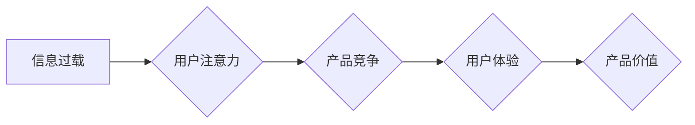

                 

##  注意力经济与用户体验设计：如何创建引人入胜的产品

> 关键词：注意力经济、用户体验设计、产品设计、认知心理学、信息过载、用户行为、可持续设计

### 1. 背景介绍

在当今信息爆炸的时代，人们每天面临着海量的信息冲击。从手机推送的通知到社交媒体的动态，从新闻网站的标题到广告横幅，无处不在的数字信息争夺着我们的注意力。这种“注意力经济”的竞争日益激烈，用户对信息的筛选和选择能力也日益提高。

在这种背景下，用户体验设计（UX Design）的重要性愈发凸显。优秀的UX设计能够帮助产品在信息洪流中脱颖而出，吸引用户的注意力，并引导他们完成目标任务。

### 2. 核心概念与联系

**2.1 注意力经济**

注意力经济是指在信息过载的时代，人们的注意力成为一种稀缺资源，而能够有效获取和利用用户注意力的产品和服务能够获得更大的价值。

**2.2 用户体验设计**

用户体验设计是指以用户为中心，通过研究用户需求、行为和心理，设计出易用、愉悦、高效的产品和服务。

**2.3 联系**

注意力经济和用户体验设计相互关联，相互影响。

* **注意力经济为用户体验设计提供了背景和意义：** 在信息过载的时代，用户对产品的注意力更加宝贵，因此，设计出能够吸引和保持用户注意力的产品至关重要。
* **用户体验设计是获取和利用用户注意力的关键手段：** 通过优化产品界面、交互流程、内容结构等方面，可以有效地吸引和引导用户的注意力，提高用户体验。

**Mermaid 流程图**



### 3. 核心算法原理 & 具体操作步骤

**3.1 算法原理概述**

在注意力经济下，用户体验设计需要考虑用户注意力分配的动态变化。一些核心算法可以帮助设计师更好地理解和利用用户注意力。

* **眼动追踪技术：** 通过追踪用户的眼球运动，可以了解用户在界面上的视觉焦点，以及他们对不同元素的关注程度。
* **热力图分析：** 将用户交互数据可视化，呈现出用户点击、停留时间等行为的分布情况，帮助设计师识别用户关注的重点区域。
* **A/B测试：** 通过比较不同设计方案的用户行为数据，可以评估不同设计对用户注意力的影响，并选择最有效的方案。

**3.2 算法步骤详解**

1. **数据收集：** 使用眼动追踪设备、热力图分析工具或A/B测试平台收集用户交互数据。
2. **数据分析：** 对收集到的数据进行分析，识别用户关注的重点区域、停留时间、点击行为等。
3. **设计优化：** 根据数据分析结果，对产品界面、交互流程、内容结构等方面进行优化，以吸引和引导用户注意力。
4. **测试验证：** 对优化后的设计方案进行A/B测试，验证其对用户注意力的影响。

**3.3 算法优缺点**

* **优点：** 能够提供用户行为的客观数据，帮助设计师做出数据驱动的设计决策。
* **缺点：** 数据收集成本较高，数据分析需要专业技能，结果可能受到测试环境和样本人群的影响。

**3.4 算法应用领域**

* **网站设计：** 优化网站布局、导航结构、内容排版，提高用户浏览体验。
* **移动应用设计：** 设计用户友好的界面、交互流程、引导机制，提升用户留存率。
* **广告设计：** 吸引用户注意力，提高广告点击率和转化率。

### 4. 数学模型和公式 & 详细讲解 & 举例说明

**4.1 数学模型构建**

注意力经济可以抽象为一个资源分配模型，其中用户注意力是有限的资源，而各种信息和产品是竞争者。我们可以用以下数学模型来描述用户注意力分配的过程：

$$
Attention(i) = \frac{Value(i)}{Sum(Value(j))}
$$

其中：

* $Attention(i)$ 表示用户对第 $i$ 个信息或产品的注意力分配比例。
* $Value(i)$ 表示用户对第 $i$ 个信息或产品的感知价值。
* $Sum(Value(j))$ 表示所有信息或产品的总感知价值。

**4.2 公式推导过程**

该公式基于以下假设：

* 用户注意力是有限的，总和为1。
* 用户对信息的感知价值是主观的，取决于用户的兴趣、需求和认知水平。
* 用户会将注意力分配给感知价值最高的那些信息或产品。

**4.3 案例分析与讲解**

假设用户面临三个信息源：新闻网站、社交媒体和电子邮件。

* 新闻网站提供最新的时事新闻，用户对时事新闻的感知价值为5。
* 社交媒体提供朋友的动态和娱乐内容，用户对社交媒体的感知价值为3。
* 电子邮件提供工作和生活相关的通知，用户对电子邮件的感知价值为2。

根据公式，用户对三个信息源的注意力分配比例为：

* $Attention(新闻网站) = \frac{5}{5+3+2} = 0.45$
* $Attention(社交媒体) = \frac{3}{5+3+2} = 0.27$
* $Attention(电子邮件) = \frac{2}{5+3+2} = 0.28$

因此，用户会将大部分注意力分配给新闻网站，其次是电子邮件，最后是社交媒体。

### 5. 项目实践：代码实例和详细解释说明

**5.1 开发环境搭建**

* 操作系统：Windows/macOS/Linux
* 编程语言：Python
* 工具：

    * Jupyter Notebook
    * Matplotlib
    * Seaborn

**5.2 源代码详细实现**

```python
import matplotlib.pyplot as plt
import seaborn as sns

# 模拟用户注意力分配数据
attention_data = [0.45, 0.27, 0.28]
labels = ['新闻网站', '社交媒体', '电子邮件']

# 绘制饼图
plt.figure(figsize=(8, 6))
plt.pie(attention_data, labels=labels, autopct='%1.1f%%', startangle=90)
plt.title('用户注意力分配比例')
plt.show()
```

**5.3 代码解读与分析**

* 该代码使用Matplotlib和Seaborn库绘制饼图，展示用户对不同信息源的注意力分配比例。
* `attention_data`变量存储用户对不同信息源的注意力分配比例。
* `labels`变量存储不同信息源的名称。
* `plt.pie()`函数绘制饼图，参数包括注意力分配比例、标签、百分比格式和起始角度。
* `plt.title()`函数设置饼图标题。
* `plt.show()`函数显示饼图。

**5.4 运行结果展示**

运行该代码将生成一个饼图，展示用户对新闻网站、社交媒体和电子邮件的注意力分配比例。

### 6. 实际应用场景

**6.1 网站设计**

* 优化网站布局，将重要信息放置在用户视线最容易触及的位置。
* 使用醒目的标题和图像吸引用户注意力。
* 简化导航结构，引导用户快速找到所需信息。

**6.2 移动应用设计**

* 设计简洁易懂的界面，避免信息过载。
* 使用动画和交互效果增强用户体验。
* 提供个性化定制选项，满足不同用户的需求。

**6.3 广告设计**

* 使用吸引眼球的视觉元素，例如鲜艳的颜色、动态的图形和简短的文字。
* 针对不同用户群体进行个性化广告投放。
* 使用互动式广告形式，例如游戏或问卷调查，提高用户参与度。

**6.4 未来应用展望**

随着人工智能技术的不断发展，注意力经济和用户体验设计将更加紧密地结合在一起。

* **个性化推荐：** 基于用户的行为数据和偏好，提供更加精准的个性化推荐，提高用户体验。
* **沉浸式体验：** 利用虚拟现实和增强现实技术，创造更加沉浸式的用户体验，吸引用户的注意力。
* **可持续设计：** 关注用户心理健康，设计出更加可持续的用户体验，避免信息过载和注意力疲劳。

### 7. 工具和资源推荐

**7.1 学习资源推荐**

* 书籍：《Hooked：How to Build Habit-Forming Products》 by Nir Eyal
* 文章：《The Attention Economy》 by Herbert Simon
* 课程：Coursera上的《User Experience Design》

**7.2 开发工具推荐**

* Eye-tracking设备：Tobii Eye Tracker、Pupil Labs
* 热力图分析工具：Hotjar、Crazy Egg
* A/B测试平台：Optimizely、Google Optimize

**7.3 相关论文推荐**

* 《The Attention Economy: A Framework for Understanding User Behavior in Digital Environments》
* 《Designing for Attention: A User-Centered Approach》
* 《The Impact of Information Overload on User Experience》

### 8. 总结：未来发展趋势与挑战

**8.1 研究成果总结**

注意力经济和用户体验设计的研究成果表明，用户注意力是有限的，并且在信息过载的时代变得更加宝贵。通过理解用户注意力分配的动态变化，设计师可以设计出更加吸引和引导用户注意力的产品和服务。

**8.2 未来发展趋势**

未来，注意力经济和用户体验设计将更加注重个性化、沉浸式和可持续性。

* **个性化推荐：** 基于用户的行为数据和偏好，提供更加精准的个性化推荐，提高用户体验。
* **沉浸式体验：** 利用虚拟现实和增强现实技术，创造更加沉浸式的用户体验，吸引用户的注意力。
* **可持续设计：** 关注用户心理健康，设计出更加可持续的用户体验，避免信息过载和注意力疲劳。

**8.3 面临的挑战**

* **数据隐私：** 收集和使用用户行为数据需要考虑数据隐私和安全问题。
* **算法偏见：** 个性化推荐算法可能存在偏见，导致用户体验不均。
* **用户心理健康：** 过度关注用户注意力可能会损害用户的精神健康。

**8.4 研究展望**

未来研究需要关注以下几个方面：

* 开发更加公平、透明和可解释的注意力经济模型。
* 研究用户注意力分配的认知机制，并开发更加有效的注意力引导策略。
* 探索注意力经济对社会和文化的影响，并制定相应的伦理规范。

### 9. 附录：常见问题与解答

**9.1 如何衡量用户注意力？**

用户注意力的衡量方法包括眼动追踪、热力图分析、A/B测试等。

**9.2 如何设计吸引用户注意力的产品？**

可以通过优化界面布局、使用醒目的视觉元素、提供个性化定制选项等方式设计吸引用户注意力的产品。

**9.3 注意力经济对用户体验设计有什么影响？**

注意力经济促使设计师更加注重用户注意力分配的动态变化，并开发更加有效的注意力引导策略。


作者：禅与计算机程序设计艺术 / Zen and the Art of Computer Programming 
<end_of_turn>

