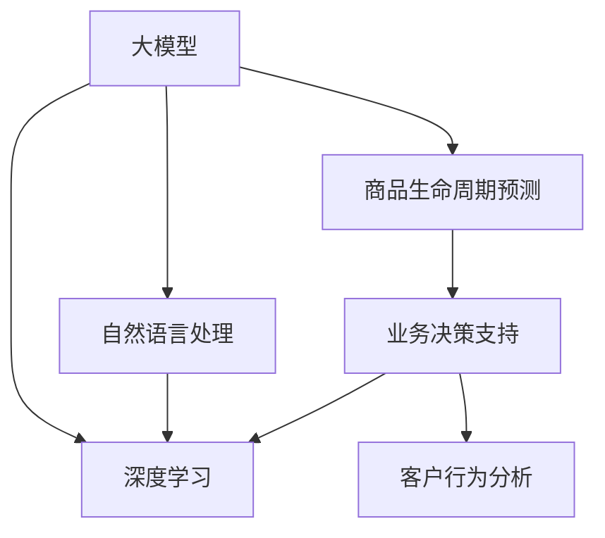

                 

# 探讨大模型在电商平台商品生命周期预测与管理中的作用

> 关键词：大模型，电商平台，商品生命周期预测，自然语言处理，深度学习，业务决策支持，客户行为分析

## 1. 背景介绍

### 1.1 问题由来

在电商行业中，商品的“生命周期”通常指从商品上架到下架的过程，包括推广期、成长期、成熟期和衰退期等几个阶段。商品的生命周期预测与管理是电商平台优化库存管理、提升销售额、减少运营成本的关键环节。然而，由于电商平台商品数量庞大、用户行为数据复杂，传统统计模型和规则引擎难以满足精确预测和管理需求。

近年来，随着深度学习和自然语言处理技术的飞速发展，大模型在电商平台商品生命周期预测与管理中的应用日益受到关注。大模型，如BERT、GPT-3等，具备强大的学习能力，通过在海量数据上进行预训练，可以在不依赖特定领域专业知识的情况下，从自然语言文本中提取关键信息，进行商品生命周期预测，并为电商平台提供业务决策支持。

### 1.2 问题核心关键点

大模型在电商平台商品生命周期预测与管理中的作用主要体现在以下几个方面：

1. **大数据处理能力**：大模型能够处理大规模的数据集，从海量的电商平台商品描述、用户评论、搜索记录等文本数据中挖掘有价值的信息。
2. **语言理解能力**：大模型具有强大的自然语言理解能力，可以从非结构化文本中提取出商品的特征、用户需求和行为模式。
3. **多任务学习**：大模型可以同时处理多种任务，如商品描述生成、用户行为预测、个性化推荐等，提升预测和管理的整体效果。
4. **业务决策支持**：大模型能够为电商平台提供数据驱动的决策支持，优化库存管理、调整营销策略、提升用户体验，从而实现业务增长。

### 1.3 问题研究意义

研究大模型在电商平台商品生命周期预测与管理中的应用，对于电商平台优化运营、提升用户体验、增强市场竞争力具有重要意义：

1. **提升预测准确性**：通过大模型对海量数据的处理和分析，可以更精确地预测商品的生命周期，避免因库存管理不当导致的商品积压或短缺。
2. **优化营销策略**：大模型能够从用户行为中提取出有价值的信息，帮助电商平台制定更精准的营销策略，提高转化率和客户满意度。
3. **降低运营成本**：通过精准的商品生命周期预测，电商平台可以更好地控制库存水平，减少无效库存和物流成本，提升整体运营效率。
4. **增强市场响应能力**：大模型能够快速响应用户需求的变化，帮助电商平台及时调整商品策略，抢占市场先机。

## 2. 核心概念与联系

### 2.1 核心概念概述

为更好地理解大模型在电商平台商品生命周期预测与管理中的应用，本节将介绍几个密切相关的核心概念：

- **大模型(Large Model)**：以BERT、GPT-3等为代表的大规模预训练模型，通过在海量数据上进行预训练，学习通用的语言表示，具备强大的语言理解和生成能力。

- **商品生命周期预测(Predicting Product Lifecycle)**：通过对商品的销售数据、用户评论、市场趋势等多维度信息进行分析，预测商品在不同阶段的销售表现和用户接受程度。

- **业务决策支持(Business Decision Support)**：利用预测结果，为电商平台提供数据驱动的决策支持，优化库存管理、调整营销策略、提升用户体验，从而实现业务增长。

- **自然语言处理(NLP)**：通过将电商平台中的文本数据转化为结构化信息，从语言中提取关键特征，用于预测和决策。

- **深度学习(Deep Learning)**：一种基于神经网络的机器学习方法，能够从大规模数据中自动学习特征，适用于复杂的数据处理任务。

- **客户行为分析(Customer Behavior Analysis)**：通过分析用户行为数据，理解用户需求和行为模式，优化用户体验和销售策略。

这些核心概念之间的逻辑关系可以通过以下Mermaid流程图来展示：



这个流程图展示了各个概念之间的联系：大模型通过自然语言处理从电商平台获取数据，再结合深度学习技术进行分析，最后支持业务决策和客户行为分析，优化电商平台运营。

## 3. 核心算法原理 & 具体操作步骤
### 3.1 算法原理概述

大模型在电商平台商品生命周期预测与管理中的应用，本质上是一个多任务学习过程。其核心思想是：利用大模型强大的自然语言处理能力，从电商平台的海量文本数据中提取关键信息，进行商品生命周期预测，并结合业务决策支持系统，优化库存管理、调整营销策略、提升用户体验。

形式化地，假设电商平台有 $N$ 种商品，其生命周期状态为 $L=\{初期、成长期、成熟期、衰退期\}$。设商品 $i$ 在时间 $t$ 的生命周期状态为 $l_i(t)$，预测函数为 $f_{\theta}(\cdot)$，其中 $\theta$ 为大模型的参数。预测模型的训练目标是最小化预测误差：

$$
\theta^* = \mathop{\arg\min}_{\theta} \sum_{i=1}^N \sum_{t=1}^T \ell(f_{\theta}(\text{data}_i(t)), l_i(t))
$$

其中 $\ell$ 为损失函数，用于衡量预测值与真实标签之间的差异。常见的损失函数包括交叉熵损失、均方误差损失等。

### 3.2 算法步骤详解

大模型在电商平台商品生命周期预测与管理的应用一般包括以下几个关键步骤：

**Step 1: 数据收集与预处理**
- 收集电商平台的商品描述、用户评论、搜索记录、点击率等文本数据，并进行数据清洗和预处理，如去除停用词、分词、标准化等操作。

**Step 2: 数据增强与标注**
- 对文本数据进行数据增强，如近义词替换、同义词扩展、数据合成等，丰富训练样本。
- 标注商品的生命周期状态，将每个商品的时间序列数据与相应的生命周期状态进行一一对应，生成标注数据集。

**Step 3: 构建模型与训练**
- 选择合适的预训练语言模型作为初始化参数，如BERT、GPT-3等。
- 构建预测模型，通常是将预训练模型作为特征提取器，再添加一个分类器用于预测商品的生命周期状态。
- 设置模型的超参数，如学习率、批大小、迭代轮数等，选择合适的优化算法（如Adam、SGD等）。

**Step 4: 模型训练与验证**
- 将训练集数据分批次输入模型，进行前向传播计算损失函数。
- 反向传播计算参数梯度，根据设定的优化算法和学习率更新模型参数。
- 周期性在验证集上评估模型性能，根据性能指标决定是否触发 Early Stopping。
- 重复上述步骤直到满足预设的迭代轮数或 Early Stopping 条件。

**Step 5: 预测与业务决策支持**
- 在测试集上评估微调后模型 $M_{\hat{\theta}}$ 的性能，对比微调前后的精度提升。
- 使用微调后的模型对新商品进行生命周期预测，集成到电商平台业务决策支持系统中，优化库存管理、调整营销策略、提升用户体验。

### 3.3 算法优缺点

大模型在电商平台商品生命周期预测与管理中的应用具有以下优点：
1. **大数据处理能力**：大模型能够处理大规模的数据集，从电商平台海量文本数据中挖掘有价值的信息，提升预测准确性。
2. **多任务学习**：大模型可以同时处理多种任务，如商品描述生成、用户行为预测、个性化推荐等，提升整体效果。
3. **业务决策支持**：大模型能够为电商平台提供数据驱动的决策支持，优化库存管理、调整营销策略、提升用户体验。

同时，该方法也存在一定的局限性：
1. **高计算成本**：大模型的训练和推理需要大量的计算资源，对硬件要求较高。
2. **数据隐私问题**：电商平台用户数据的隐私保护是一个重要问题，大模型的训练和应用过程中需要采取数据脱敏、隐私保护等措施。
3. **可解释性不足**：大模型的决策过程缺乏可解释性，难以对其推理逻辑进行分析和调试。

尽管存在这些局限性，但就目前而言，大模型在电商平台商品生命周期预测与管理中的应用范式具有不可替代的价值。未来相关研究的重点在于如何进一步降低计算成本，提高模型的可解释性，同时兼顾数据隐私和业务决策支持，以更好地适应电商平台的实际需求。

### 3.4 算法应用领域

大模型在电商平台商品生命周期预测与管理中的应用，已经广泛应用于多个场景中，例如：

- **库存管理优化**：通过预测商品生命周期，电商平台能够更精准地控制库存水平，避免因库存管理不当导致的商品积压或短缺。
- **个性化推荐系统**：大模型能够从用户行为中提取出有价值的信息，帮助电商平台制定更精准的个性化推荐策略，提升转化率和客户满意度。
- **营销策略调整**：大模型能够从用户评论、搜索记录等数据中挖掘出用户的兴趣和需求，帮助电商平台制定更有效的营销策略，提高广告点击率和转化率。
- **客户行为分析**：大模型能够分析用户行为数据，理解用户需求和行为模式，优化用户体验和销售策略，提高客户粘性。

除了上述这些经典应用外，大模型在电商平台的商品生命周期预测与管理中还有诸多创新应用，如情感分析、自然语言生成、异常检测等，为电商平台带来了全新的突破。随着大语言模型和预测技术的不断进步，相信电商平台商品生命周期预测与管理的应用将更加广泛，为电商行业带来更高效的运营模式。

## 4. 数学模型和公式 & 详细讲解  
### 4.1 数学模型构建

本节将使用数学语言对大模型在电商平台商品生命周期预测中的应用进行更加严格的刻画。

假设电商平台有 $N$ 种商品，其生命周期状态为 $L=\{初期、成长期、成熟期、衰退期\}$。设商品 $i$ 在时间 $t$ 的生命周期状态为 $l_i(t)$，预测函数为 $f_{\theta}(\cdot)$，其中 $\theta$ 为大模型的参数。设 $y_{i,t}$ 为商品 $i$ 在时间 $t$ 的生命周期状态，$f_{\theta}(x_{i,t})$ 为预测模型在时间 $t$ 对商品 $i$ 的预测结果。训练目标为最小化预测误差：

$$
\theta^* = \mathop{\arg\min}_{\theta} \sum_{i=1}^N \sum_{t=1}^T \ell(f_{\theta}(x_{i,t}), y_{i,t})
$$

其中 $\ell$ 为损失函数，用于衡量预测值与真实标签之间的差异。常见的损失函数包括交叉熵损失、均方误差损失等。

### 4.2 公式推导过程

以下我们以二分类任务为例，推导交叉熵损失函数及其梯度的计算公式。

假设预测模型为 $f_{\theta}(x_{i,t}) = \text{sigmoid}(\text{BERT}(x_{i,t}))$，其中 $\text{BERT}$ 为预训练语言模型，$\text{sigmoid}$ 函数将模型输出转换为概率值。设真实标签 $y_{i,t} \in \{0,1\}$，预测结果 $f_{\theta}(x_{i,t}) \in [0,1]$，则二分类交叉熵损失函数定义为：

$$
\ell(f_{\theta}(x_{i,t}),y_{i,t}) = -[y_{i,t}\log f_{\theta}(x_{i,t}) + (1-y_{i,t})\log (1-f_{\theta}(x_{i,t}))
$$

将其代入经验风险公式，得：

$$
\mathcal{L}(\theta) = -\frac{1}{N}\sum_{i=1}^N \sum_{t=1}^T [y_{i,t}\log f_{\theta}(x_{i,t}) + (1-y_{i,t})\log (1-f_{\theta}(x_{i,t}))
$$

根据链式法则，损失函数对参数 $\theta_k$ 的梯度为：

$$
\frac{\partial \mathcal{L}(\theta)}{\partial \theta_k} = -\frac{1}{N}\sum_{i=1}^N \sum_{t=1}^T (\frac{y_{i,t}}{f_{\theta}(x_{i,t})}-\frac{1-y_{i,t}}{1-f_{\theta}(x_{i,t})}) \frac{\partial f_{\theta}(x_{i,t})}{\partial \theta_k}
$$

其中 $\frac{\partial f_{\theta}(x_{i,t})}{\partial \theta_k}$ 可进一步递归展开，利用自动微分技术完成计算。

在得到损失函数的梯度后，即可带入参数更新公式，完成模型的迭代优化。重复上述过程直至收敛，最终得到适应电商平台商品生命周期预测的最优模型参数 $\theta^*$。

## 5. 项目实践：代码实例和详细解释说明
### 5.1 开发环境搭建

在进行电商平台商品生命周期预测的微调实践前，我们需要准备好开发环境。以下是使用Python进行PyTorch开发的环境配置流程：

1. 安装Anaconda：从官网下载并安装Anaconda，用于创建独立的Python环境。

2. 创建并激活虚拟环境：
```bash
conda create -n pytorch-env python=3.8 
conda activate pytorch-env
```

3. 安装PyTorch：根据CUDA版本，从官网获取对应的安装命令。例如：
```bash
conda install pytorch torchvision torchaudio cudatoolkit=11.1 -c pytorch -c conda-forge
```

4. 安装Transformers库：
```bash
pip install transformers
```

5. 安装各类工具包：
```bash
pip install numpy pandas scikit-learn matplotlib tqdm jupyter notebook ipython
```

完成上述步骤后，即可在`pytorch-env`环境中开始微调实践。

### 5.2 源代码详细实现

下面我们以电商平台商品生命周期预测任务为例，给出使用Transformers库对BERT模型进行微调的PyTorch代码实现。

首先，定义商品生命周期预测任务的数据处理函数：

```python
from transformers import BertTokenizer
from torch.utils.data import Dataset
import torch

class ProductLifecycleDataset(Dataset):
    def __init__(self, texts, labels, tokenizer, max_len=128):
        self.texts = texts
        self.labels = labels
        self.tokenizer = tokenizer
        self.max_len = max_len
        
    def __len__(self):
        return len(self.texts)
    
    def __getitem__(self, item):
        text = self.texts[item]
        label = self.labels[item]
        
        encoding = self.tokenizer(text, return_tensors='pt', max_length=self.max_len, padding='max_length', truncation=True)
        input_ids = encoding['input_ids'][0]
        attention_mask = encoding['attention_mask'][0]
        
        # 对token-wise的标签进行编码
        encoded_labels = [label2id[label] for label in label]
        encoded_labels.extend([label2id['None']] * (self.max_len - len(encoded_labels)))
        labels = torch.tensor(encoded_labels, dtype=torch.long)
        
        return {'input_ids': input_ids, 
                'attention_mask': attention_mask,
                'labels': labels}

# 标签与id的映射
label2id = {'初期': 0, '成长期': 1, '成熟期': 2, '衰退期': 3}
id2label = {v: k for k, v in label2id.items()}

# 创建dataset
tokenizer = BertTokenizer.from_pretrained('bert-base-cased')

train_dataset = ProductLifecycleDataset(train_texts, train_labels, tokenizer)
dev_dataset = ProductLifecycleDataset(dev_texts, dev_labels, tokenizer)
test_dataset = ProductLifecycleDataset(test_texts, test_labels, tokenizer)
```

然后，定义模型和优化器：

```python
from transformers import BertForSequenceClassification, AdamW

model = BertForSequenceClassification.from_pretrained('bert-base-cased', num_labels=len(label2id))

optimizer = AdamW(model.parameters(), lr=2e-5)
```

接着，定义训练和评估函数：

```python
from torch.utils.data import DataLoader
from tqdm import tqdm
from sklearn.metrics import classification_report

device = torch.device('cuda') if torch.cuda.is_available() else torch.device('cpu')
model.to(device)

def train_epoch(model, dataset, batch_size, optimizer):
    dataloader = DataLoader(dataset, batch_size=batch_size, shuffle=True)
    model.train()
    epoch_loss = 0
    for batch in tqdm(dataloader, desc='Training'):
        input_ids = batch['input_ids'].to(device)
        attention_mask = batch['attention_mask'].to(device)
        labels = batch['labels'].to(device)
        model.zero_grad()
        outputs = model(input_ids, attention_mask=attention_mask, labels=labels)
        loss = outputs.loss
        epoch_loss += loss.item()
        loss.backward()
        optimizer.step()
    return epoch_loss / len(dataloader)

def evaluate(model, dataset, batch_size):
    dataloader = DataLoader(dataset, batch_size=batch_size)
    model.eval()
    preds, labels = [], []
    with torch.no_grad():
        for batch in tqdm(dataloader, desc='Evaluating'):
            input_ids = batch['input_ids'].to(device)
            attention_mask = batch['attention_mask'].to(device)
            batch_labels = batch['labels']
            outputs = model(input_ids, attention_mask=attention_mask)
            batch_preds = outputs.logits.argmax(dim=2).to('cpu').tolist()
            batch_labels = batch_labels.to('cpu').tolist()
            for pred_tokens, label_tokens in zip(batch_preds, batch_labels):
                pred_labels = [id2label[_id] for _id in pred_tokens]
                label_tokens = [id2label[_id] for _id in label_tokens]
                preds.append(pred_labels[:len(label_tokens)])
                labels.append(label_tokens)
                
    print(classification_report(labels, preds))
```

最后，启动训练流程并在测试集上评估：

```python
epochs = 5
batch_size = 16

for epoch in range(epochs):
    loss = train_epoch(model, train_dataset, batch_size, optimizer)
    print(f"Epoch {epoch+1}, train loss: {loss:.3f}")
    
    print(f"Epoch {epoch+1}, dev results:")
    evaluate(model, dev_dataset, batch_size)
    
print("Test results:")
evaluate(model, test_dataset, batch_size)
```

以上就是使用PyTorch对BERT进行电商平台商品生命周期预测任务的微调完整代码实现。可以看到，得益于Transformers库的强大封装，我们可以用相对简洁的代码完成BERT模型的加载和微调。

### 5.3 代码解读与分析

让我们再详细解读一下关键代码的实现细节：

**ProductLifecycleDataset类**：
- `__init__`方法：初始化文本、标签、分词器等关键组件。
- `__len__`方法：返回数据集的样本数量。
- `__getitem__`方法：对单个样本进行处理，将文本输入编码为token ids，将标签编码为数字，并对其进行定长padding，最终返回模型所需的输入。

**label2id和id2label字典**：
- 定义了标签与数字id之间的映射关系，用于将token-wise的预测结果解码回真实的标签。

**训练和评估函数**：
- 使用PyTorch的DataLoader对数据集进行批次化加载，供模型训练和推理使用。
- 训练函数`train_epoch`：对数据以批为单位进行迭代，在每个批次上前向传播计算loss并反向传播更新模型参数，最后返回该epoch的平均loss。
- 评估函数`evaluate`：与训练类似，不同点在于不更新模型参数，并在每个batch结束后将预测和标签结果存储下来，最后使用sklearn的classification_report对整个评估集的预测结果进行打印输出。

**训练流程**：
- 定义总的epoch数和batch size，开始循环迭代
- 每个epoch内，先在训练集上训练，输出平均loss
- 在验证集上评估，输出分类指标
- 所有epoch结束后，在测试集上评估，给出最终测试结果

可以看到，PyTorch配合Transformers库使得BERT微调的代码实现变得简洁高效。开发者可以将更多精力放在数据处理、模型改进等高层逻辑上，而不必过多关注底层的实现细节。

当然，工业级的系统实现还需考虑更多因素，如模型的保存和部署、超参数的自动搜索、更灵活的任务适配层等。但核心的微调范式基本与此类似。

## 6. 实际应用场景
### 6.1 智能库存管理系统

基于大模型在电商平台商品生命周期预测中的技术，可以构建智能库存管理系统。传统的库存管理系统需要人工根据经验进行库存调整，无法精确预测商品销售情况，导致库存积压或短缺。

通过大模型对商品描述、用户评论、搜索记录等文本数据进行分析，可以预测商品的销售趋势和用户需求，优化库存水平，减少缺货和积压，提升库存管理的精准度和效率。

### 6.2 个性化营销策略

电商平台可以通过商品生命周期预测，制定个性化的营销策略。大模型能够分析用户行为数据，理解用户的兴趣和需求，帮助电商平台制定精准的营销活动，提高广告点击率和转化率。

例如，对于预测进入成长期和成熟期的商品，电商平台可以加大推广力度，进行限时折扣、优惠券等活动，吸引用户购买；对于预测进入衰退期的商品，可以提前进行库存清理，减少损失。

### 6.3 异常检测与预警

大模型可以在电商平台中应用异常检测技术，识别出异常销售行为，进行预警。通过分析用户行为数据，识别出异常购买行为，如大规模批量购买、异常退货等，预警可能的欺诈行为或库存异常情况。

对于异常销售行为，电商平台可以及时采取措施，如联系用户确认订单真实性、调整库存管理策略等，确保平台的正常运营。

### 6.4 未来应用展望

随着大语言模型和预测技术的不断发展，电商平台商品生命周期预测与管理的应用将更加广泛，为电商行业带来更高效的运营模式。

在智慧零售领域，基于大模型的预测技术，可以实现供应链优化、库存自动化管理、个性化推荐等功能，提升整体运营效率。

在智能家居领域，电商平台可以根据用户行为预测和个性化推荐，提供更智能的购物体验。

在智能城市治理中，电商平台可以通过商品生命周期预测，为城市商品供应链提供优化建议，实现资源的高效配置和利用。

此外，在金融、教育、医疗等多个领域，大模型在商品生命周期预测与管理中的应用也将不断涌现，为各行各业带来更智能化、高效化的运营模式。相信随着技术的日益成熟，大语言模型在电商平台中的应用将更加深入，推动电商行业实现更高效的运营和创新。

## 7. 工具和资源推荐
### 7.1 学习资源推荐

为了帮助开发者系统掌握大模型在电商平台商品生命周期预测中的应用，这里推荐一些优质的学习资源：

1. 《Transformers: From Pre-Training to Fine-Tuning》系列博文：由大模型技术专家撰写，深入浅出地介绍了从预训练到大模型微调的全流程，适用于各个层次的开发者。

2. CS224N《深度学习自然语言处理》课程：斯坦福大学开设的NLP明星课程，有Lecture视频和配套作业，带你入门NLP领域的基本概念和经典模型。

3. 《Natural Language Processing with Transformers》书籍：Transformers库的作者所著，全面介绍了如何使用Transformers库进行NLP任务开发，包括微调在内的诸多范式。

4. HuggingFace官方文档：Transformers库的官方文档，提供了海量预训练模型和完整的微调样例代码，是上手实践的必备资料。

5. Weights & Biases：模型训练的实验跟踪工具，可以记录和可视化模型训练过程中的各项指标，方便对比和调优。与主流深度学习框架无缝集成。

6. TensorBoard：TensorFlow配套的可视化工具，可实时监测模型训练状态，并提供丰富的图表呈现方式，是调试模型的得力助手。

通过对这些资源的学习实践，相信你一定能够快速掌握大模型在电商平台中的应用，并用于解决实际的业务问题。

### 7.2 开发工具推荐

高效的开发离不开优秀的工具支持。以下是几款用于电商平台大模型微调开发的常用工具：

1. PyTorch：基于Python的开源深度学习框架，灵活动态的计算图，适合快速迭代研究。大部分预训练语言模型都有PyTorch版本的实现。

2. TensorFlow：由Google主导开发的开源深度学习框架，生产部署方便，适合大规模工程应用。同样有丰富的预训练语言模型资源。

3. Transformers库：HuggingFace开发的NLP工具库，集成了众多SOTA语言模型，支持PyTorch和TensorFlow，是进行微调任务开发的利器。

4. Weights & Biases：模型训练的实验跟踪工具，可以记录和可视化模型训练过程中的各项指标，方便对比和调优。与主流深度学习框架无缝集成。

5. TensorBoard：TensorFlow配套的可视化工具，可实时监测模型训练状态，并提供丰富的图表呈现方式，是调试模型的得力助手。

6. Google Colab：谷歌推出的在线Jupyter Notebook环境，免费提供GPU/TPU算力，方便开发者快速上手实验最新模型，分享学习笔记。

合理利用这些工具，可以显著提升电商平台大模型微调的开发效率，加快创新迭代的步伐。

### 7.3 相关论文推荐

大模型在电商平台商品生命周期预测中的应用源于学界的持续研究。以下是几篇奠基性的相关论文，推荐阅读：

1. Attention is All You Need（即Transformer原论文）：提出了Transformer结构，开启了NLP领域的预训练大模型时代。

2. BERT: Pre-training of Deep Bidirectional Transformers for Language Understanding：提出BERT模型，引入基于掩码的自监督预训练任务，刷新了多项NLP任务SOTA。

3. Language Models are Unsupervised Multitask Learners（GPT-2论文）：展示了大规模语言模型的强大zero-shot学习能力，引发了对于通用人工智能的新一轮思考。

4. Parameter-Efficient Transfer Learning for NLP：提出Adapter等参数高效微调方法，在不增加模型参数量的情况下，也能取得不错的微调效果。

5. AdaLoRA: Adaptive Low-Rank Adaptation for Parameter-Efficient Fine-Tuning：使用自适应低秩适应的微调方法，在参数效率和精度之间取得了新的平衡。

这些论文代表了大模型在电商平台商品生命周期预测中的应用发展脉络。通过学习这些前沿成果，可以帮助研究者把握学科前进方向，激发更多的创新灵感。

## 8. 总结：未来发展趋势与挑战
### 8.1 总结

本文对大模型在电商平台商品生命周期预测与管理中的应用进行了全面系统的介绍。首先阐述了电商行业商品生命周期预测与管理的重要性，明确了基于大模型的微调技术在大规模数据处理、自然语言理解、多任务学习等方面的独特价值。其次，从原理到实践，详细讲解了微调的数学原理和关键步骤，给出了微调任务开发的完整代码实例。同时，本文还广泛探讨了微调技术在智能库存管理系统、个性化营销策略、异常检测与预警等多个电商场景中的应用前景，展示了微调范式的巨大潜力。此外，本文精选了微调技术的各类学习资源，力求为读者提供全方位的技术指引。

通过本文的系统梳理，可以看到，基于大模型的微调技术正在成为电商平台优化运营、提升用户体验、增强市场竞争力的重要工具。大模型能够从大规模数据中提取关键信息，进行商品生命周期预测，并为电商平台提供数据驱动的决策支持，优化库存管理、调整营销策略、提升用户体验，从而实现业务增长。未来，伴随大语言模型和预测方法的持续演进，相信电商平台商品生命周期预测与管理的应用将更加广泛，为电商行业带来更高效的运营模式。

### 8.2 未来发展趋势

展望未来，大模型在电商平台商品生命周期预测与管理中的应用将呈现以下几个发展趋势：

1. **模型规模持续增大**：随着算力成本的下降和数据规模的扩张，预训练语言模型的参数量还将持续增长。超大规模语言模型蕴含的丰富语言知识，有望支撑更加复杂多变的商品生命周期预测任务。

2. **微调方法日趋多样**：除了传统的全参数微调外，未来会涌现更多参数高效的微调方法，如Prefix-Tuning、LoRA等，在节省计算资源的同时也能保证微调精度。

3. **持续学习成为常态**：随着数据分布的不断变化，微调模型也需要持续学习新知识以保持性能。如何在不遗忘原有知识的同时，高效吸收新样本信息，将成为重要的研究课题。

4. **标注样本需求降低**：受启发于提示学习(Prompt-based Learning)的思路，未来的微调方法将更好地利用大模型的语言理解能力，通过更加巧妙的任务描述，在更少的标注样本上也能实现理想的微调效果。

5. **多模态微调崛起**：当前的微调主要聚焦于纯文本数据，未来会进一步拓展到图像、视频、语音等多模态数据微调。多模态信息的融合，将显著提升语言模型对现实世界的理解和建模能力。

6. **跨领域迁移能力增强**：未来的大模型将具备更强的跨领域迁移能力，能够在不同商品、不同电商平台的商品生命周期预测中表现优异。

以上趋势凸显了大模型在电商平台商品生命周期预测与管理中的广阔前景。这些方向的探索发展，必将进一步提升电商平台的运营效率，实现更高的商业价值。

### 8.3 面临的挑战

尽管大模型在电商平台商品生命周期预测与管理中的应用已经取得了显著成果，但在迈向更加智能化、普适化应用的过程中，它仍面临着诸多挑战：

1. **高计算成本**：大模型的训练和推理需要大量的计算资源，对硬件要求较高。如何降低计算成本，提升模型训练和推理的效率，是未来的一大挑战。

2. **数据隐私问题**：电商平台用户数据的隐私保护是一个重要问题，大模型的训练和应用过程中需要采取数据脱敏、隐私保护等措施，以确保用户隐私的安全。

3. **可解释性不足**：大模型的决策过程缺乏可解释性，难以对其推理逻辑进行分析和调试。对于金融、医疗等高风险应用，算法的可解释性和可审计性尤为重要。

4. **业务决策支持**：大模型预测结果需要与业务系统无缝集成，实现自动化的业务决策支持。如何构建灵活、高效的业务系统架构，是大模型应用中的关键问题。

5. **多任务处理能力**：电商平台需要同时处理多种任务，如商品描述生成、用户行为预测、个性化推荐等，如何实现多任务学习，提升整体效果，是未来需要解决的重要问题。

这些挑战需要研究者结合业务场景，不断优化模型架构、数据处理流程、训练策略等，以确保大模型在电商平台中的应用效果和业务价值。

### 8.4 研究展望

面对大模型在电商平台商品生命周期预测与管理中所面临的挑战，未来的研究需要在以下几个方面寻求新的突破：

1. **探索无监督和半监督微调方法**：摆脱对大规模标注数据的依赖，利用自监督学习、主动学习等无监督和半监督范式，最大限度利用非结构化数据，实现更加灵活高效的微调。

2. **研究参数高效和计算高效的微调范式**：开发更加参数高效的微调方法，在固定大部分预训练参数的同时，只更新极少量的任务相关参数。同时优化微调模型的计算图，减少前向传播和反向传播的资源消耗，实现更加轻量级、实时性的部署。

3. **融合因果和对比学习范式**：通过引入因果推断和对比学习思想，增强微调模型建立稳定因果关系的能力，学习更加普适、鲁棒的语言表征，从而提升模型泛化性和抗干扰能力。

4. **结合因果分析和博弈论工具**：将因果分析方法引入微调模型，识别出模型决策的关键特征，增强输出解释的因果性和逻辑性。借助博弈论工具刻画人机交互过程，主动探索并规避模型的脆弱点，提高系统稳定性。

5. **纳入伦理道德约束**：在模型训练目标中引入伦理导向的评估指标，过滤和惩罚有偏见、有害的输出倾向。同时加强人工干预和审核，建立模型行为的监管机制，确保输出符合人类价值观和伦理道德。

这些研究方向的探索，必将引领大模型在电商平台中的应用走向更高的台阶，为电商平台实现更高效的运营和创新。只有勇于创新、敢于突破，才能不断拓展大语言模型在电商平台中的应用边界，推动电商行业实现更高效的运营和创新。

## 9. 附录：常见问题与解答

**Q1：电商平台大模型微调是否适用于所有商品？**

A: 大模型在电商平台商品生命周期预测与管理中的应用，通常需要考虑商品的类型、用户群体、市场环境等因素。某些特殊类型的商品，如定制化商品、高价值商品等，可能无法通过文本数据进行准确的预测。对于这类商品，可能需要结合其他数据源或采用特定领域的预训练模型进行微调。

**Q2：大模型在电商平台上的微调效果如何？**

A: 大模型在电商平台上的微调效果通常较为显著。由于大模型具备强大的自然语言理解和处理能力，可以从文本数据中提取丰富的商品特征和用户需求信息，预测商品的生命周期状态。在实际应用中，大模型的预测准确率、召回率和F1值等指标通常优于传统统计模型和规则引擎。

**Q3：大模型微调是否需要大量的标注数据？**

A: 虽然大模型在电商平台上的微调效果显著，但并不意味着需要大量的标注数据。通过数据增强、迁移学习等技术，可以有效地降低微调对标注数据的依赖，提升模型的泛化能力和鲁棒性。此外，对于某些特定领域或场景，通过领域自监督预训练，也可以在大规模无标签数据上进行微调，减少标注成本。

**Q4：电商平台大模型微调需要注意哪些问题？**

A: 电商平台大模型微调需要注意以下几个问题：
1. **数据质量**：电商平台用户数据的质量直接影响微调效果，需要保证数据的完整性、准确性和时效性。
2. **模型性能**：大模型的计算成本较高，需要评估模型的性能-成本比，选择合适的大模型进行微调。
3. **可解释性**：大模型的决策过程缺乏可解释性，需要结合业务场景，设计可解释的输出格式和解释机制。
4. **数据隐私**：电商平台的隐私保护要求较高，需要在微调过程中采取数据脱敏、隐私保护等措施。

这些问题的解决需要结合业务场景和模型特性，进行全面的分析和优化。

**Q5：如何提升电商平台大模型的微调效果？**

A: 提升电商平台大模型的微调效果可以从以下几个方面入手：
1. **数据增强**：通过近义词替换、同义词扩展等方式扩充训练样本，丰富模型对商品描述和用户行为的理解。
2. **正则化技术**：使用L2正则、Dropout等技术，避免模型过拟合，提升模型的泛化能力。
3. **参数高效微调**：采用如Adapter、Prefix等参数高效微调方法，减少模型参数量，降低计算成本。
4. **模型集成**：将多个微调模型进行集成，取平均输出，提升模型的稳定性和鲁棒性。
5. **多任务学习**：将商品生命周期预测与个性化推荐、广告投放等任务相结合，提升整体效果。

这些技术手段可以有效地提升大模型在电商平台上的微调效果，提高预测精度和业务决策支持能力。

---

作者：禅与计算机程序设计艺术 / Zen and the Art of Computer Programming

