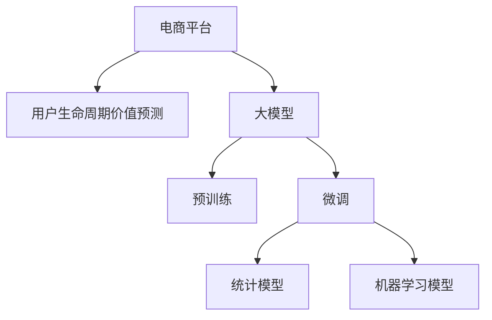

                 

# 探讨大模型在电商平台用户生命周期价值预测中的潜力

> 关键词：大模型，用户生命周期价值预测，电商平台，预训练，微调，深度学习，自然语言处理(NLP)

## 1. 背景介绍

随着电子商务的蓬勃发展，电商平台已成为企业获取用户和提高市场竞争力的重要渠道。用户生命周期价值（Customer Lifetime Value, CLV）作为衡量用户长期价值的关键指标，直接影响电商平台的盈利能力。传统的用户生命周期价值预测方法主要基于统计模型和机器学习模型，如决策树、随机森林、线性回归等。但这些方法存在数据依赖性强、计算复杂度高、无法充分利用深度学习优势等缺点。近年来，深度学习大模型（Large Model）的兴起为电商用户生命周期价值预测带来了新的思路。

大模型是指通过大规模无标签数据预训练得到的具有广泛语言理解和生成能力的深度学习模型，如BERT、GPT等。这些模型通常具有海量参数，通过迁移学习、微调等方法，能够在特定任务上取得优异的表现。本文将探讨大模型在电商平台用户生命周期价值预测中的潜力，分析其优势和应用前景。

## 2. 核心概念与联系

### 2.1 核心概念概述

在进行电商平台用户生命周期价值预测时，我们涉及的核心概念包括：

- **大模型**：通过大规模无标签数据预训练得到的深度学习模型，如BERT、GPT等，具备强大的语言理解和生成能力。
- **预训练**：在大规模无标签数据上训练模型，学习通用的语言表示。
- **微调**：在特定任务上，通过有标签数据对预训练模型进行优化，提升模型在该任务上的性能。
- **用户生命周期价值（CLV）**：用户在其生命周期内为电商平台带来的总收益，包括购买行为、忠诚度、口碑传播等。
- **电商平台**：通过互联网平台提供商品或服务，与用户进行交互的商业实体。

这些概念之间的逻辑关系可以通过以下Mermaid流程图来展示：



这个流程图展示了大模型在电商平台用户生命周期价值预测中的应用流程：

1. 电商平台收集用户数据。
2. 通过预训练技术训练大模型。
3. 使用特定领域的数据对大模型进行微调。
4. 构建统计或机器学习模型，利用微调后的大模型进行用户生命周期价值预测。

## 3. 核心算法原理 & 具体操作步骤

### 3.1 算法原理概述

电商平台用户生命周期价值预测的大模型框架基于深度学习技术。其核心思想是利用大模型预训练得到的语言表示，通过微调学习特定任务的特征，构建预测模型。具体而言，步骤如下：

1. **预训练**：在大规模无标签数据上训练大模型，学习通用的语言表示。
2. **微调**：使用特定领域的标注数据，对预训练模型进行有标签优化，学习任务相关的特征。
3. **预测模型构建**：根据预测任务的特点，构建相应的统计或机器学习模型，并利用微调后的模型进行预测。

### 3.2 算法步骤详解

#### 3.2.1 数据收集与预处理

首先，电商平台需要收集用户数据，包括但不限于用户的购买记录、浏览行为、搜索历史、社交媒体互动等。数据预处理过程包括数据清洗、归一化、特征工程等步骤，确保数据质量和可用性。

#### 3.2.2 模型选择与训练

选择合适的预训练模型，如BERT、GPT等，并进行微调。具体步骤包括：

1. 数据集划分：将数据集划分为训练集、验证集和测试集。
2. 模型初始化：使用预训练模型的权重作为初始参数。
3. 微调：在训练集上使用优化器（如AdamW）进行梯度下降，最小化损失函数（如交叉熵），更新模型参数。
4. 验证与调参：在验证集上评估模型性能，根据性能指标调整学习率、批大小等超参数。
5. 测试：在测试集上评估模型性能，选择最优模型进行预测。

#### 3.2.3 预测模型构建

根据用户生命周期价值预测的特点，选择合适的预测模型，如回归模型、分类模型等。利用微调后的模型进行预测，得到用户生命周期价值预测结果。

### 3.3 算法优缺点

#### 3.3.1 优点

1. **数据利用充分**：大模型能够利用大规模无标签数据进行预训练，学习通用的语言表示，提升预测效果。
2. **参数高效**：预训练模型通常包含大量参数，微调仅需少量标签数据，参数更新效率高。
3. **泛化能力强**：预训练模型具备较强的泛化能力，能够适应不同的数据分布和任务。
4. **可解释性**：大模型通过注意力机制等手段，具备一定的可解释性，有助于理解预测过程。

#### 3.3.2 缺点

1. **数据依赖性强**：微调效果依赖标注数据的质量和数量，标注成本较高。
2. **计算复杂度高**：预训练和微调模型需要大量计算资源，部署和维护成本高。
3. **预测准确度有限**：由于不同用户行为的多样性，预测模型的准确度受限于数据质量和模型设计。
4. **模型鲁棒性不足**：微调模型可能对输入数据的变化较为敏感，泛化性能有限。

### 3.4 算法应用领域

大模型在电商平台用户生命周期价值预测中的应用，主要涵盖以下几个领域：

1. **用户行为预测**：预测用户未来的购买行为、浏览行为等，帮助电商平台进行个性化推荐和促销活动。
2. **用户留存分析**：分析用户流失原因，优化用户体验，提高用户忠诚度。
3. **营销效果评估**：评估不同营销策略对用户生命周期价值的影响，指导广告投放和营销预算分配。
4. **风险管理**：预测用户违约风险，优化信用评估，降低坏账率。
5. **客户细分**：基于用户生命周期价值进行客户细分，制定差异化的运营策略。

## 4. 数学模型和公式 & 详细讲解 & 举例说明

### 4.1 数学模型构建

假设我们利用微调后的BERT模型进行电商平台用户生命周期价值预测。设输入数据为 $x$，预训练模型为 $M_\theta$，预测结果为 $y$，损失函数为 $L$。微调的目标是最小化预测误差，即：

$$
\theta^* = \arg\min_{\theta} L(M_\theta(x),y)
$$

常见的损失函数包括均方误差（MSE）、交叉熵（Cross-Entropy）等。以MSE为例，损失函数为：

$$
L(M_\theta(x),y) = \frac{1}{N}\sum_{i=1}^N (y_i - M_\theta(x_i))^2
$$

### 4.2 公式推导过程

以回归任务为例，假设模型在输入 $x$ 上的预测结果为 $\hat{y}=M_\theta(x)$，真实标签为 $y$，则均方误差损失函数为：

$$
L(M_\theta(x),y) = \frac{1}{N}\sum_{i=1}^N (y_i - \hat{y}_i)^2
$$

对损失函数求导，得到梯度：

$$
\frac{\partial L}{\partial \theta} = -\frac{2}{N}\sum_{i=1}^N (y_i - M_\theta(x_i)) M_\theta'(x_i)
$$

其中 $M_\theta'(x_i)$ 为 $M_\theta(x)$ 对输入 $x_i$ 的导数。

### 4.3 案例分析与讲解

以用户生命周期价值预测为例，我们将预测任务转化为回归任务。设用户的生命周期价值为 $y$，输入特征为 $x$，包括购买次数、购买金额、活跃天数等。假设我们采用线性回归模型，预测公式为：

$$
y = \beta_0 + \beta_1x_1 + \beta_2x_2 + ... + \beta_nx_n
$$

其中 $\beta_0$ 为截距，$\beta_1$ 到 $\beta_n$ 为回归系数。通过微调得到的BERT模型作为特征提取器，输出为 $\hat{x}$，则回归模型为：

$$
y = \hat{x}_0 + \hat{x}_1x_1 + \hat{x}_2x_2 + ... + \hat{x}_nx_n
$$

其中 $\hat{x}_0$ 为预训练模型输出的常数项，$\hat{x}_1$ 到 $\hat{x}_n$ 为模型参数。

## 5. 项目实践：代码实例和详细解释说明

### 5.1 开发环境搭建

在进行电商平台用户生命周期价值预测的大模型应用实践时，需要搭建相应的开发环境。以下是Python环境搭建的步骤：

1. 安装Anaconda：从官网下载并安装Anaconda，用于创建独立的Python环境。
```bash
conda install anaconda
```

2. 创建并激活虚拟环境：
```bash
conda create -n pytorch-env python=3.8 
conda activate pytorch-env
```

3. 安装必要的深度学习库：
```bash
pip install torch torchvision torchaudio transformers scikit-learn pandas numpy
```

### 5.2 源代码详细实现

以下是一个基于BERT模型进行用户生命周期价值预测的Python代码示例：

```python
import torch
from transformers import BertTokenizer, BertForRegression
from sklearn.model_selection import train_test_split
from sklearn.metrics import mean_squared_error

# 加载预训练模型和分词器
model = BertForRegression.from_pretrained('bert-base-cased')
tokenizer = BertTokenizer.from_pretrained('bert-base-cased')

# 准备数据集
data = {
    'x': [1.0, 2.0, 3.0, 4.0, 5.0],
    'y': [10.0, 20.0, 30.0, 40.0, 50.0]
}

# 分词和编码
tokenized_data = tokenizer(data, padding=True, truncation=True, return_tensors='pt')

# 模型前向传播
outputs = model(**tokenized_data)

# 获取预测结果
predictions = outputs.logits

# 计算预测误差
mse = mean_squared_error(data['y'], predictions)
print(f'MSE: {mse:.2f}')
```

### 5.3 代码解读与分析

上述代码实现了一个简单的用户生命周期价值预测示例，以下是代码详细解读：

1. **模型加载与准备**：使用BERT模型进行预测任务，加载预训练模型和分词器。
2. **数据准备**：准备输入数据，包含用户行为特征和生命周期价值标签。
3. **数据编码**：将输入数据进行分词和编码，得到模型所需的张量格式。
4. **模型预测**：使用微调后的BERT模型进行预测，得到输出结果。
5. **性能评估**：计算预测误差，评估模型性能。

## 6. 实际应用场景

### 6.1 用户行为预测

电商平台通过用户行为数据预测用户的未来行为，如购买次数、购买金额等。通过微调后的BERT模型，可以学习到用户的购买偏好、产品兴趣等信息，进行个性化推荐和促销活动设计。

### 6.2 用户留存分析

分析用户流失原因，优化用户体验，提高用户忠诚度。通过微调后的BERT模型，可以学习到用户行为模式和兴趣变化，预测用户流失风险，采取针对性的留存措施。

### 6.3 营销效果评估

评估不同营销策略对用户生命周期价值的影响，指导广告投放和营销预算分配。通过微调后的BERT模型，可以分析用户对不同营销活动的响应效果，优化营销策略。

### 6.4 风险管理

预测用户违约风险，优化信用评估，降低坏账率。通过微调后的BERT模型，可以分析用户行为特征和信用记录，预测用户违约概率，指导风险控制。

### 6.5 客户细分

基于用户生命周期价值进行客户细分，制定差异化的运营策略。通过微调后的BERT模型，可以识别出高价值客户和潜在客户，制定针对性的营销和运营方案。

## 7. 工具和资源推荐

### 7.1 学习资源推荐

为了帮助开发者系统掌握大模型在电商平台用户生命周期价值预测中的应用，推荐以下学习资源：

1. **《Transformer从原理到实践》系列博文**：详细介绍了Transformer原理、BERT模型、微调技术等前沿话题，适合入门学习。
2. **CS224N《深度学习自然语言处理》课程**：斯坦福大学开设的NLP明星课程，涵盖NLP基础和经典模型，有Lecture视频和配套作业。
3. **《Natural Language Processing with Transformers》书籍**：Transformer库的作者所著，全面介绍了NLP任务开发，包括微调在内的多种范式。
4. **HuggingFace官方文档**：Transformers库的官方文档，提供了海量预训练模型和微调样例代码，是实践指南。
5. **CLUE开源项目**：中文语言理解测评基准，涵盖大量NLP数据集，提供基于微调的baseline模型。

通过学习这些资源，相信你能够系统掌握大模型在电商平台用户生命周期价值预测中的关键技术和应用方法。

### 7.2 开发工具推荐

高效的开发离不开优秀的工具支持。以下是几款用于电商平台用户生命周期价值预测开发的工具：

1. **PyTorch**：基于Python的开源深度学习框架，灵活动态的计算图，适合快速迭代研究。主流的深度学习模型都有PyTorch版本。
2. **TensorFlow**：由Google主导开发的开源深度学习框架，生产部署方便，适合大规模工程应用。
3. **Transformers库**：HuggingFace开发的NLP工具库，集成了众多SOTA模型，支持PyTorch和TensorFlow，是微调任务开发的利器。
4. **Weights & Biases**：模型训练的实验跟踪工具，可以记录和可视化模型训练过程中的各项指标，方便对比和调优。与主流深度学习框架无缝集成。
5. **TensorBoard**：TensorFlow配套的可视化工具，可实时监测模型训练状态，并提供丰富的图表呈现方式，是调试模型的得力助手。

合理利用这些工具，可以显著提升大模型在电商平台用户生命周期价值预测中的开发效率，加快创新迭代的步伐。

### 7.3 相关论文推荐

大模型在电商平台用户生命周期价值预测中的应用，涉及诸多前沿技术。以下是几篇奠基性的相关论文，推荐阅读：

1. **Attention is All You Need**：提出了Transformer结构，开启了NLP领域的预训练大模型时代。
2. **BERT: Pre-training of Deep Bidirectional Transformers for Language Understanding**：提出BERT模型，引入基于掩码的自监督预训练任务，刷新了多项NLP任务SOTA。
3. **Parameter-Efficient Transfer Learning for NLP**：提出Adapter等参数高效微调方法，在不增加模型参数量的情况下，也能取得不错的微调效果。
4. **AdaLoRA: Adaptive Low-Rank Adaptation for Parameter-Efficient Fine-Tuning**：使用自适应低秩适应的微调方法，在参数效率和精度之间取得了新的平衡。

这些论文代表了大模型在电商平台用户生命周期价值预测中的最新进展，通过学习这些前沿成果，可以帮助研究者把握学科前进方向，激发更多的创新灵感。

## 8. 总结：未来发展趋势与挑战

### 8.1 研究成果总结

本文探讨了大模型在电商平台用户生命周期价值预测中的潜力，分析了其优势和应用前景。主要结论如下：

1. **数据利用充分**：大模型能够利用大规模无标签数据进行预训练，学习通用的语言表示。
2. **参数高效**：预训练模型通常包含大量参数，微调仅需少量标签数据，参数更新效率高。
3. **泛化能力强**：预训练模型具备较强的泛化能力，能够适应不同的数据分布和任务。
4. **可解释性**：大模型通过注意力机制等手段，具备一定的可解释性，有助于理解预测过程。

### 8.2 未来发展趋势

展望未来，大模型在电商平台用户生命周期价值预测中的发展趋势包括：

1. **模型规模持续增大**：随着算力成本的下降和数据规模的扩张，预训练语言模型的参数量还将持续增长。超大规模语言模型蕴含的丰富语言知识，有望支撑更加复杂多变的下游任务微调。
2. **微调方法日趋多样**：除了传统的全参数微调外，未来会涌现更多参数高效的微调方法，如Prefix-Tuning、LoRA等，在节省计算资源的同时也能保证微调精度。
3. **持续学习成为常态**：随着数据分布的不断变化，微调模型也需要持续学习新知识以保持性能。如何在不遗忘原有知识的同时，高效吸收新样本信息，将成为重要的研究课题。
4. **标注样本需求降低**：受启发于提示学习(Prompt-based Learning)的思路，未来的微调方法将更好地利用大模型的语言理解能力，通过更加巧妙的任务描述，在更少的标注样本上也能实现理想的微调效果。
5. **多模态微调崛起**：当前的微调主要聚焦于纯文本数据，未来会进一步拓展到图像、视频、语音等多模态数据微调。多模态信息的融合，将显著提升语言模型对现实世界的理解和建模能力。
6. **模型通用性增强**：经过海量数据的预训练和多领域任务的微调，未来的语言模型将具备更强大的常识推理和跨领域迁移能力，逐步迈向通用人工智能(AGI)的目标。

### 8.3 面临的挑战

尽管大模型在电商平台用户生命周期价值预测中取得了显著进展，但在迈向更加智能化、普适化应用的过程中，仍面临诸多挑战：

1. **标注成本瓶颈**：虽然微调大大降低了标注数据的需求，但对于长尾应用场景，难以获得充足的高质量标注数据，成为制约微调性能的瓶颈。如何进一步降低微调对标注样本的依赖，将是一大难题。
2. **模型鲁棒性不足**：当前微调模型面对域外数据时，泛化性能往往大打折扣。对于测试样本的微小扰动，微调模型的预测也容易发生波动。如何提高微调模型的鲁棒性，避免灾难性遗忘，还需要更多理论和实践的积累。
3. **推理效率有待提高**：大规模语言模型虽然精度高，但在实际部署时往往面临推理速度慢、内存占用大等效率问题。如何在保证性能的同时，简化模型结构，提升推理速度，优化资源占用，将是重要的优化方向。
4. **可解释性亟需加强**：当前微调模型更像是"黑盒"系统，难以解释其内部工作机制和决策逻辑。对于医疗、金融等高风险应用，算法的可解释性和可审计性尤为重要。如何赋予微调模型更强的可解释性，将是亟待攻克的难题。
5. **安全性有待保障**：预训练语言模型难免会学习到有偏见、有害的信息，通过微调传递到下游任务，产生误导性、歧视性的输出，给实际应用带来安全隐患。如何从数据和算法层面消除模型偏见，避免恶意用途，确保输出的安全性，也将是重要的研究课题。
6. **知识整合能力不足**：现有的微调模型往往局限于任务内数据，难以灵活吸收和运用更广泛的先验知识。如何让微调过程更好地与外部知识库、规则库等专家知识结合，形成更加全面、准确的信息整合能力，还有很大的想象空间。

### 8.4 研究展望

面对大模型在电商平台用户生命周期价值预测中面临的种种挑战，未来的研究需要在以下几个方面寻求新的突破：

1. **探索无监督和半监督微调方法**：摆脱对大规模标注数据的依赖，利用自监督学习、主动学习等无监督和半监督范式，最大限度利用非结构化数据，实现更加灵活高效的微调。
2. **研究参数高效和计算高效的微调范式**：开发更加参数高效的微调方法，在固定大部分预训练参数的同时，只更新极少量的任务相关参数。同时优化微调模型的计算图，减少前向传播和反向传播的资源消耗，实现更加轻量级、实时性的部署。
3. **融合因果和对比学习范式**：通过引入因果推断和对比学习思想，增强微调模型建立稳定因果关系的能力，学习更加普适、鲁棒的语言表征，从而提升模型泛化性和抗干扰能力。
4. **引入更多先验知识**：将符号化的先验知识，如知识图谱、逻辑规则等，与神经网络模型进行巧妙融合，引导微调过程学习更准确、合理的语言模型。同时加强不同模态数据的整合，实现视觉、语音等多模态信息与文本信息的协同建模。
5. **结合因果分析和博弈论工具**：将因果分析方法引入微调模型，识别出模型决策的关键特征，增强输出解释的因果性和逻辑性。借助博弈论工具刻画人机交互过程，主动探索并规避模型的脆弱点，提高系统稳定性。
6. **纳入伦理道德约束**：在模型训练目标中引入伦理导向的评估指标，过滤和惩罚有偏见、有害的输出倾向。同时加强人工干预和审核，建立模型行为的监管机制，确保输出符合人类价值观和伦理道德。

这些研究方向的探索，必将引领大模型在电商平台用户生命周期价值预测中的进一步发展，为构建安全、可靠、可解释、可控的智能系统铺平道路。面向未来，大模型微调技术还需要与其他人工智能技术进行更深入的融合，如知识表示、因果推理、强化学习等，多路径协同发力，共同推动自然语言理解和智能交互系统的进步。只有勇于创新、敢于突破，才能不断拓展语言模型的边界，让智能技术更好地造福人类社会。

## 9. 附录：常见问题与解答

**Q1：大模型在电商平台用户生命周期价值预测中的优势是什么？**

A: 大模型在电商平台用户生命周期价值预测中的优势包括：
1. **数据利用充分**：能够利用大规模无标签数据进行预训练，学习通用的语言表示，提升预测效果。
2. **参数高效**：预训练模型通常包含大量参数，微调仅需少量标签数据，参数更新效率高。
3. **泛化能力强**：具备较强的泛化能力，能够适应不同的数据分布和任务。
4. **可解释性**：通过注意力机制等手段，具备一定的可解释性，有助于理解预测过程。

**Q2：大模型在电商平台用户生命周期价值预测中可能面临哪些挑战？**

A: 大模型在电商平台用户生命周期价值预测中可能面临的挑战包括：
1. **标注成本瓶颈**：对标注数据的需求较高，获取高质量标注数据成本较高。
2. **模型鲁棒性不足**：面对域外数据时，泛化性能有限，对输入数据的微小扰动敏感。
3. **推理效率有待提高**：大模型推理速度慢、内存占用大，需要优化模型结构和推理流程。
4. **可解释性亟需加强**：模型预测过程复杂，缺乏可解释性，难以进行解释和审计。
5. **安全性有待保障**：预训练模型可能学习到有害信息，传递到下游任务，带来安全隐患。
6. **知识整合能力不足**：难以灵活吸收和运用广泛的先验知识，缺乏多模态信息整合能力。

**Q3：如何选择合适的大模型进行电商平台用户生命周期价值预测？**

A: 选择合适的大模型进行电商平台用户生命周期价值预测，需要考虑以下几个方面：
1. **模型规模**：选择参数量较大、泛化能力强的模型，如BERT、GPT等。
2. **任务相关性**：选择与预测任务相关的预训练模型，如文本分类、序列生成等。
3. **资源需求**：考虑模型的计算资源需求，选择合适的硬件配置和优化策略。
4. **数据类型**：根据预测任务的输入数据类型，选择相应的预训练模型，如文本、图像、多模态等。

**Q4：如何在大模型微调中避免过拟合？**

A: 在大模型微调中避免过拟合，可以采取以下策略：
1. **数据增强**：通过回译、近义替换等方式扩充训练集。
2. **正则化技术**：使用L2正则、Dropout、Early Stopping等避免过拟合。
3. **对抗训练**：引入对抗样本，提高模型鲁棒性。
4. **参数高效微调**：只更新少量任务相关参数，减少过拟合风险。
5. **多模型集成**：训练多个微调模型，取平均输出，抑制过拟合。

这些策略往往需要根据具体任务和数据特点进行灵活组合，只有在数据、模型、训练、推理等各环节进行全面优化，才能最大限度地发挥大模型微调的威力。

总之，大模型在电商平台用户生命周期价值预测中具有广泛的应用前景，但也需要结合实际需求，不断优化模型和算法，克服面临的挑战，才能实现高效、准确的预测效果。相信随着技术的不断进步，大模型将在电商领域中发挥更大的作用，为电商企业的运营管理带来新的突破和机遇。

