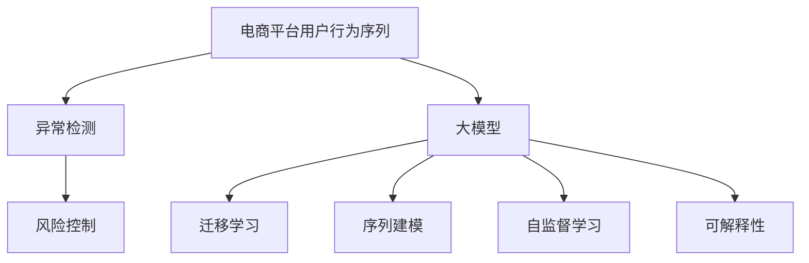

                 

# 探讨大模型在电商平台用户行为序列异常检测与风控中的潜力

## 1. 背景介绍

### 1.1 问题由来

随着电商平台的快速发展和普及，用户行为序列数据变得愈加庞大和复杂。这些序列数据不仅包含了用户的浏览、购买、评价等行为信息，还蕴含了用户的心理状态、偏好倾向等潜在价值。然而，传统的机器学习模型在处理复杂序列数据时，往往存在特征工程繁琐、难以捕捉序列依赖等问题，导致模型性能受到限制。

近年来，大模型在自然语言处理(NLP)、计算机视觉(CV)等领域取得了巨大突破。这些大模型通过大规模无监督学习，获得了强大的表征能力，能够从海量数据中学习到复杂的序列模式和依赖关系。大模型在电商领域的应用，也为电商平台的用户行为序列异常检测与风险控制提供了新的思路。

### 1.2 问题核心关键点

大模型在电商平台用户行为序列异常检测与风控中的潜力主要体现在以下几个方面：

- **序列建模能力**：大模型能够从用户行为序列中学习到复杂的依赖关系和模式，从而更好地捕捉用户行为的变化趋势和异常点。
- **泛化能力**：大模型通过大规模数据预训练，获得了较强的泛化能力，能够适应不同电商平台和用户行为模式的复杂性。
- **自动化特征提取**：大模型能够自动学习到特征提取能力，减少了特征工程的工作量，提升了模型构建效率。
- **可解释性**：大模型通过注意力机制和权重调整，提供了对序列中各个元素重要性的解释，有助于理解和诊断异常原因。
- **模型迁移**：大模型在不同任务之间具有较好的迁移能力，可以在电商领域进行迁移学习，快速适配新任务。

这些关键点表明，大模型有望在电商平台用户行为序列异常检测与风控中发挥重要作用，提升电商平台的运营效率和风险控制能力。

## 2. 核心概念与联系

### 2.1 核心概念概述

为了更好地理解大模型在电商平台用户行为序列异常检测与风控中的应用，本节将介绍几个核心概念及其联系：

- **电商平台用户行为序列**：用户在电商平台上的行为数据，如浏览记录、购买历史、评价内容等，以序列形式记录。
- **异常检测**：从用户行为序列中检测出异常行为或模式，如恶意欺诈、高风险交易等，以保障电商平台的安全性和用户权益。
- **风险控制**：通过识别和拦截异常行为，降低电商平台的风险损失，提升用户体验。
- **大模型**：基于大规模无监督学习的大语言模型，如GPT、BERT等，具有强大的序列建模和特征提取能力。
- **迁移学习**：利用大模型在不同任务之间的迁移能力，快速适应新任务，减少数据和计算资源投入。
- **序列建模**：大模型能够学习到序列中的复杂依赖关系，捕捉用户行为的变化趋势和异常点。
- **自监督学习**：大模型通过大规模无监督学习，学习到通用的语言和数据表示，能够应用于多种任务。
- **可解释性**：大模型通过注意力机制和权重调整，提供对模型决策过程的解释，有助于理解和诊断异常原因。

这些核心概念之间的逻辑关系可以通过以下Mermaid流程图来展示：



这个流程图展示了大模型在电商平台用户行为序列异常检测与风控中的应用框架：

1. 电商平台用户行为序列作为输入数据。
2. 利用大模型的序列建模能力，识别出异常行为或模式。
3. 基于异常检测结果，进行风险控制，如拦截欺诈交易。
4. 利用大模型的迁移学习能力和自监督学习知识，提升模型在新任务上的泛化能力。
5. 通过大模型的可解释性，理解异常原因，优化模型策略。

## 3. 核心算法原理 & 具体操作步骤
### 3.1 算法原理概述

大模型在电商平台用户行为序列异常检测与风控中的应用，本质上是一个序列异常检测与分类任务。其核心思想是：将电商平台用户行为序列作为输入数据，通过大模型学习到序列中的复杂依赖关系和模式，从而识别出异常行为或模式，并进行相应的风险控制。

形式化地，假设电商平台用户行为序列为 $X=\{x_1, x_2, ..., x_t\}$，其中 $x_t$ 表示用户在时间 $t$ 的某个行为（如浏览商品、购买商品等）。异常检测的目标是判断序列中是否存在异常行为，即：

$$
y = f(X)
$$

其中 $y \in \{0, 1\}$，$0$ 表示正常行为，$1$ 表示异常行为。$f$ 表示大模型从用户行为序列中学习到的异常检测函数。

### 3.2 算法步骤详解

大模型在电商平台用户行为序列异常检测与风控中的具体应用步骤如下：

**Step 1: 数据预处理**
- 收集电商平台用户行为序列数据，并进行清洗和预处理，如去除噪声、填补缺失值等。
- 对序列进行归一化、标准化等预处理操作，保证数据的一致性和稳定性。

**Step 2: 模型选择与训练**
- 选择合适的预训练大模型，如BERT、GPT等。
- 在预训练大模型的基础上，构建适应电商平台的异常检测任务，如设计任务适配层。
- 在电商平台的标注数据集上，使用监督学习算法训练大模型，优化异常检测函数。

**Step 3: 异常检测**
- 将电商平台用户行为序列输入训练好的大模型，得到异常检测结果。
- 根据异常检测结果，进行相应的风险控制，如拦截欺诈交易、提醒用户等。

**Step 4: 风险控制**
- 对于检测出的异常行为，进行深入分析和处理。
- 利用大模型的可解释性，理解异常原因，优化风险控制策略。
- 定期更新模型参数，以应对用户行为模式的动态变化。

### 3.3 算法优缺点

大模型在电商平台用户行为序列异常检测与风控中的应用具有以下优点：

- **高精度**：大模型具有强大的表征能力，能够学习到复杂序列中的依赖关系，从而提高异常检测的精度。
- **泛化能力强**：通过大规模数据预训练，大模型能够适应不同电商平台和用户行为模式的复杂性，提升模型泛化能力。
- **自动化特征提取**：大模型能够自动学习到特征提取能力，减少了特征工程的工作量，提升了模型构建效率。
- **可解释性强**：大模型通过注意力机制和权重调整，提供对模型决策过程的解释，有助于理解和诊断异常原因。

同时，该方法也存在一定的局限性：

- **高计算资源需求**：大模型的训练和推理需要大量的计算资源，初期投入成本较高。
- **模型解释性有限**：尽管大模型具有一定程度的可解释性，但在复杂序列中，模型决策过程仍可能难以完全理解。
- **过拟合风险**：大模型在训练过程中，如果数据量不足，可能存在过拟合风险，影响模型的泛化能力。
- **数据隐私问题**：电商平台用户行为数据涉及用户隐私，需要确保数据使用的合法性和隐私保护。

尽管存在这些局限性，但就目前而言，大模型在电商平台用户行为序列异常检测与风控中的应用仍是大数据时代的重要趋势。未来相关研究的重点在于如何进一步降低大模型对计算资源的需求，提高模型的可解释性，同时兼顾数据隐私保护。

### 3.4 算法应用领域

大模型在电商平台用户行为序列异常检测与风控中的应用，主要体现在以下几个领域：

- **用户行为异常检测**：识别用户行为序列中的异常行为，如欺诈交易、恶意评论等。
- **风险预警与控制**：根据异常检测结果，进行风险预警，并采取相应的风险控制措施，如拦截欺诈交易、限制交易额度等。
- **用户行为分析**：分析用户行为序列中的模式和趋势，提升用户画像构建和个性化推荐。
- **营销策略优化**：通过异常检测和风险控制，优化电商平台的营销策略，提升用户体验和交易转化率。
- **数据安全与隐私保护**：利用大模型的可解释性，理解用户行为序列中的异常原因，提升数据安全与隐私保护水平。

除了上述这些领域外，大模型还被创新性地应用于更多场景中，如基于用户行为序列的情感分析、基于用户行为序列的推荐系统等，为电商平台带来了新的技术突破。

## 4. 数学模型和公式 & 详细讲解 & 举例说明（备注：数学公式请使用latex格式，latex嵌入文中独立段落使用 $$，段落内使用 $)
### 4.1 数学模型构建

本节将使用数学语言对大模型在电商平台用户行为序列异常检测与风控中的应用进行更加严格的刻画。

假设电商平台用户行为序列为 $X=\{x_1, x_2, ..., x_t\}$，其中 $x_t$ 表示用户在时间 $t$ 的某个行为（如浏览商品、购买商品等）。异常检测的目标是判断序列中是否存在异常行为，即：

$$
y = f(X)
$$

其中 $y \in \{0, 1\}$，$0$ 表示正常行为，$1$ 表示异常行为。$f$ 表示大模型从用户行为序列中学习到的异常检测函数。

假设大模型为 $M_{\theta}$，其中 $\theta$ 为模型参数。大模型的输入为电商平台用户行为序列 $X$，输出为异常检测结果 $y$。则大模型的损失函数为：

$$
\mathcal{L}(\theta) = -\frac{1}{N}\sum_{i=1}^N [y_i\log M_{\theta}(X_i)+(1-y_i)\log(1-M_{\theta}(X_i))]
$$

其中 $N$ 为训练集大小，$y_i$ 为序列 $X_i$ 的标注结果。

大模型的预测结果为 $\hat{y}=M_{\theta}(X)$，则异常检测的准确率为：

$$
\text{Accuracy} = \frac{1}{N}\sum_{i=1}^N \mathbb{I}(y_i=\hat{y}_i)
$$

其中 $\mathbb{I}$ 为示性函数，$1$ 表示 $y_i=\hat{y}_i$，$0$ 表示 $y_i\neq\hat{y}_i$。

### 4.2 公式推导过程

以下我们以二分类任务为例，推导异常检测的交叉熵损失函数及其梯度的计算公式。

假设大模型 $M_{\theta}$ 在输入 $X$ 上的输出为 $\hat{y}=M_{\theta}(X) \in [0,1]$，表示序列 $X$ 属于异常行为的预测概率。真实标签 $y \in \{0,1\}$。则二分类交叉熵损失函数定义为：

$$
\ell(M_{\theta}(X),y) = -[y\log \hat{y} + (1-y)\log(1-\hat{y})]
$$

将其代入经验风险公式，得：

$$
\mathcal{L}(\theta) = -\frac{1}{N}\sum_{i=1}^N [y_i\log M_{\theta}(X_i)+(1-y_i)\log(1-M_{\theta}(X_i))]
$$

根据链式法则，损失函数对参数 $\theta_k$ 的梯度为：

$$
\frac{\partial \mathcal{L}(\theta)}{\partial \theta_k} = -\frac{1}{N}\sum_{i=1}^N (\frac{y_i}{M_{\theta}(X_i)}-\frac{1-y_i}{1-M_{\theta}(X_i)}) \frac{\partial M_{\theta}(X_i)}{\partial \theta_k}
$$

其中 $\frac{\partial M_{\theta}(X_i)}{\partial \theta_k}$ 可进一步递归展开，利用自动微分技术完成计算。

在得到损失函数的梯度后，即可带入参数更新公式，完成模型的迭代优化。重复上述过程直至收敛，最终得到适应电商平台用户行为序列异常检测的最优模型参数 $\theta^*$。

## 5. 项目实践：代码实例和详细解释说明
### 5.1 开发环境搭建

在进行大模型在电商平台用户行为序列异常检测与风控的实践前，我们需要准备好开发环境。以下是使用Python进行PyTorch开发的环境配置流程：

1. 安装Anaconda：从官网下载并安装Anaconda，用于创建独立的Python环境。

2. 创建并激活虚拟环境：
```bash
conda create -n pytorch-env python=3.8 
conda activate pytorch-env
```

3. 安装PyTorch：根据CUDA版本，从官网获取对应的安装命令。例如：
```bash
conda install pytorch torchvision torchaudio cudatoolkit=11.1 -c pytorch -c conda-forge
```

4. 安装Transformers库：
```bash
pip install transformers
```

5. 安装各类工具包：
```bash
pip install numpy pandas scikit-learn matplotlib tqdm jupyter notebook ipython
```

完成上述步骤后，即可在`pytorch-env`环境中开始大模型在电商平台用户行为序列异常检测与风控的实践。

### 5.2 源代码详细实现

下面我们以电商平台用户行为序列异常检测任务为例，给出使用Transformers库对BERT模型进行异常检测的PyTorch代码实现。

首先，定义异常检测任务的数据处理函数：

```python
from transformers import BertTokenizer
from torch.utils.data import Dataset
import torch

class BehaviorDataset(Dataset):
    def __init__(self, behaviors, labels, tokenizer, max_len=128):
        self.behaviors = behaviors
        self.labels = labels
        self.tokenizer = tokenizer
        self.max_len = max_len
        
    def __len__(self):
        return len(self.behaviors)
    
    def __getitem__(self, item):
        behavior = self.behaviors[item]
        label = self.labels[item]
        
        encoding = self.tokenizer(behavior, return_tensors='pt', max_length=self.max_len, padding='max_length', truncation=True)
        input_ids = encoding['input_ids'][0]
        attention_mask = encoding['attention_mask'][0]
        
        # 对label进行编码
        encoded_labels = [label] 
        encoded_labels.extend([0] * (self.max_len - len(encoded_labels)))
        labels = torch.tensor(encoded_labels, dtype=torch.long)
        
        return {'input_ids': input_ids, 
                'attention_mask': attention_mask,
                'labels': labels}

# 标签与id的映射
label2id = {0: 0, 1: 1}
id2label = {v: k for k, v in label2id.items()}

# 创建dataset
tokenizer = BertTokenizer.from_pretrained('bert-base-cased')

train_dataset = BehaviorDataset(train_behaviors, train_labels, tokenizer)
dev_dataset = BehaviorDataset(dev_behaviors, dev_labels, tokenizer)
test_dataset = BehaviorDataset(test_behaviors, test_labels, tokenizer)
```

然后，定义模型和优化器：

```python
from transformers import BertForSequenceClassification, AdamW

model = BertForSequenceClassification.from_pretrained('bert-base-cased', num_labels=2)

optimizer = AdamW(model.parameters(), lr=2e-5)
```

接着，定义训练和评估函数：

```python
from torch.utils.data import DataLoader
from tqdm import tqdm
from sklearn.metrics import accuracy_score

device = torch.device('cuda') if torch.cuda.is_available() else torch.device('cpu')
model.to(device)

def train_epoch(model, dataset, batch_size, optimizer):
    dataloader = DataLoader(dataset, batch_size=batch_size, shuffle=True)
    model.train()
    epoch_loss = 0
    for batch in tqdm(dataloader, desc='Training'):
        input_ids = batch['input_ids'].to(device)
        attention_mask = batch['attention_mask'].to(device)
        labels = batch['labels'].to(device)
        model.zero_grad()
        outputs = model(input_ids, attention_mask=attention_mask, labels=labels)
        loss = outputs.loss
        epoch_loss += loss.item()
        loss.backward()
        optimizer.step()
    return epoch_loss / len(dataloader)

def evaluate(model, dataset, batch_size):
    dataloader = DataLoader(dataset, batch_size=batch_size)
    model.eval()
    preds, labels = [], []
    with torch.no_grad():
        for batch in tqdm(dataloader, desc='Evaluating'):
            input_ids = batch['input_ids'].to(device)
            attention_mask = batch['attention_mask'].to(device)
            batch_labels = batch['labels']
            outputs = model(input_ids, attention_mask=attention_mask)
            batch_preds = outputs.logits.argmax(dim=2).to('cpu').tolist()
            batch_labels = batch_labels.to('cpu').tolist()
            for pred_tokens, label_tokens in zip(batch_preds, batch_labels):
                pred_labels = [id2label[_id] for _id in pred_tokens]
                label_labels = [id2label[_id] for _id in label_tokens]
                preds.append(pred_labels[:len(label_labels)])
                labels.append(label_labels)
                
    print(accuracy_score(labels, preds))
```

最后，启动训练流程并在测试集上评估：

```python
epochs = 5
batch_size = 16

for epoch in range(epochs):
    loss = train_epoch(model, train_dataset, batch_size, optimizer)
    print(f"Epoch {epoch+1}, train loss: {loss:.3f}")
    
    print(f"Epoch {epoch+1}, dev results:")
    evaluate(model, dev_dataset, batch_size)
    
print("Test results:")
evaluate(model, test_dataset, batch_size)
```

以上就是使用PyTorch对BERT进行电商平台用户行为序列异常检测任务微调的完整代码实现。可以看到，得益于Transformers库的强大封装，我们可以用相对简洁的代码完成BERT模型的加载和微调。

### 5.3 代码解读与分析

让我们再详细解读一下关键代码的实现细节：

**BehaviorDataset类**：
- `__init__`方法：初始化行为序列、标签、分词器等关键组件。
- `__len__`方法：返回数据集的样本数量。
- `__getitem__`方法：对单个样本进行处理，将行为序列输入编码为token ids，将标签编码为数字，并对其进行定长padding，最终返回模型所需的输入。

**label2id和id2label字典**：
- 定义了标签与数字id之间的映射关系，用于将标签解码回原始标签。

**训练和评估函数**：
- 使用PyTorch的DataLoader对数据集进行批次化加载，供模型训练和推理使用。
- 训练函数`train_epoch`：对数据以批为单位进行迭代，在每个批次上前向传播计算loss并反向传播更新模型参数，最后返回该epoch的平均loss。
- 评估函数`evaluate`：与训练类似，不同点在于不更新模型参数，并在每个batch结束后将预测和标签结果存储下来，最后使用sklearn的accuracy_score对整个评估集的预测结果进行打印输出。

**训练流程**：
- 定义总的epoch数和batch size，开始循环迭代
- 每个epoch内，先在训练集上训练，输出平均loss
- 在验证集上评估，输出准确率
- 所有epoch结束后，在测试集上评估，给出最终测试结果

可以看到，PyTorch配合Transformers库使得BERT微调的代码实现变得简洁高效。开发者可以将更多精力放在数据处理、模型改进等高层逻辑上，而不必过多关注底层的实现细节。

当然，工业级的系统实现还需考虑更多因素，如模型的保存和部署、超参数的自动搜索、更灵活的任务适配层等。但核心的微调范式基本与此类似。

## 6. 实际应用场景
### 6.1 电商平台欺诈检测

电商平台用户在交易过程中，可能会遭遇各种欺诈行为，如虚假交易、恶意评价等。传统的欺诈检测方法依赖于手工规则和特征工程，难以覆盖所有欺诈手段，且易受规则设计的影响。而大模型能够自动学习到复杂的序列模式，从用户行为序列中识别出欺诈行为，大大提升了欺诈检测的准确性和效率。

具体而言，可以收集电商平台的交易记录、评价内容等数据，提取用户行为序列作为训练集，标注正常和异常的交易记录。在此基础上对BERT等预训练大模型进行微调，使其能够从行为序列中学习到欺诈行为的特征。在新的交易记录到达时，将记录的行为序列输入微调后的模型，即可判断其是否为欺诈行为，并采取相应的风险控制措施。

### 6.2 电商平台高风险交易预警

电商平台的高风险交易通常表现为交易金额异常、交易地点异常等。通过大模型对用户行为序列进行异常检测，可以有效识别出高风险交易行为，及时预警并采取措施，保障平台的安全性。

具体而言，可以收集电商平台的交易记录，提取用户行为序列作为训练集，标注高风险交易记录。在此基础上对BERT等预训练大模型进行微调，使其能够从行为序列中学习到高风险交易的特征。在新的交易记录到达时，将记录的行为序列输入微调后的模型，即可判断其是否为高风险交易，并及时预警。

### 6.3 电商平台情感分析

电商平台的评价内容包含了大量用户的主观情感信息，通过情感分析可以更好地理解用户对商品、服务的真实感受，从而优化电商平台的用户体验和产品设计。

具体而言，可以收集电商平台的评价内容，提取评价文本作为训练集，标注文本的情感倾向。在此基础上对BERT等预训练大模型进行微调，使其能够从文本中学习到情感信息。在新的评价内容到达时，将评价文本输入微调后的模型，即可判断其情感倾向，帮助电商平台及时响应用户需求，提升服务质量。

### 6.4 未来应用展望

随着大语言模型和微调方法的不断发展，基于微调范式将在更多领域得到应用，为电商平台带来变革性影响。

在智慧零售领域，基于大模型微调的推荐系统可以更好地理解用户行为，提升推荐精准度和用户体验。

在智慧物流领域，基于大模型微调的用户行为序列分析，可以预测用户的收货时间和地点，提升物流配送的效率和准确性。

在智慧客服领域，基于大模型微调的对话系统可以更好地理解用户需求，提供更精准的客户服务，提升客户满意度。

此外，在智能营销、数据治理等众多领域，基于大模型微调的技术也将不断涌现，为电商平台带来更多的创新应用。相信随着技术的日益成熟，微调方法将成为电商平台发展的核心驱动力，推动电商平台的运营效率和用户体验不断提升。

## 7. 工具和资源推荐
### 7.1 学习资源推荐

为了帮助开发者系统掌握大模型在电商平台用户行为序列异常检测与风控中的应用，这里推荐一些优质的学习资源：

1. 《Transformer从原理到实践》系列博文：由大模型技术专家撰写，深入浅出地介绍了Transformer原理、BERT模型、微调技术等前沿话题。

2. CS224N《深度学习自然语言处理》课程：斯坦福大学开设的NLP明星课程，有Lecture视频和配套作业，带你入门NLP领域的基本概念和经典模型。

3. 《Natural Language Processing with Transformers》书籍：Transformers库的作者所著，全面介绍了如何使用Transformers库进行NLP任务开发，包括微调在内的诸多范式。

4. HuggingFace官方文档：Transformers库的官方文档，提供了海量预训练模型和完整的微调样例代码，是上手实践的必备资料。

5. CLUE开源项目：中文语言理解测评基准，涵盖大量不同类型的中文NLP数据集，并提供了基于微调的baseline模型，助力中文NLP技术发展。

通过对这些资源的学习实践，相信你一定能够快速掌握大模型在电商平台用户行为序列异常检测与风控的应用精髓，并用于解决实际的电商平台问题。
###  7.2 开发工具推荐

高效的开发离不开优秀的工具支持。以下是几款用于大模型在电商平台用户行为序列异常检测与风控开发的常用工具：

1. PyTorch：基于Python的开源深度学习框架，灵活动态的计算图，适合快速迭代研究。大部分预训练语言模型都有PyTorch版本的实现。

2. TensorFlow：由Google主导开发的开源深度学习框架，生产部署方便，适合大规模工程应用。同样有丰富的预训练语言模型资源。

3. Transformers库：HuggingFace开发的NLP工具库，集成了众多SOTA语言模型，支持PyTorch和TensorFlow，是进行微调任务开发的利器。

4. Weights & Biases：模型训练的实验跟踪工具，可以记录和可视化模型训练过程中的各项指标，方便对比和调优。与主流深度学习框架无缝集成。

5. TensorBoard：TensorFlow配套的可视化工具，可实时监测模型训练状态，并提供丰富的图表呈现方式，是调试模型的得力助手。

6. Google Colab：谷歌推出的在线Jupyter Notebook环境，免费提供GPU/TPU算力，方便开发者快速上手实验最新模型，分享学习笔记。

合理利用这些工具，可以显著提升大模型在电商平台用户行为序列异常检测与风控任务的开发效率，加快创新迭代的步伐。

### 7.3 相关论文推荐

大模型在电商平台用户行为序列异常检测与风控的应用源于学界的持续研究。以下是几篇奠基性的相关论文，推荐阅读：

1. Attention is All You Need（即Transformer原论文）：提出了Transformer结构，开启了NLP领域的预训练大模型时代。

2. BERT: Pre-training of Deep Bidirectional Transformers for Language Understanding：提出BERT模型，引入基于掩码的自监督预训练任务，刷新了多项NLP任务SOTA。

3. Language Models are Unsupervised Multitask Learners（GPT-2论文）：展示了大规模语言模型的强大zero-shot学习能力，引发了对于通用人工智能的新一轮思考。

4. Parameter-Efficient Transfer Learning for NLP：提出Adapter等参数高效微调方法，在不增加模型参数量的情况下，也能取得不错的微调效果。

5. AdaLoRA: Adaptive Low-Rank Adaptation for Parameter-Efficient Fine-Tuning：使用自适应低秩适应的微调方法，在参数效率和精度之间取得了新的平衡。

6. Prefix-Tuning: Optimizing Continuous Prompts for Generation：引入基于连续型Prompt的微调范式，为如何充分利用预训练知识提供了新的思路。

这些论文代表了大模型在电商平台用户行为序列异常检测与风控的应用发展的脉络。通过学习这些前沿成果，可以帮助研究者把握学科前进方向，激发更多的创新灵感。

## 8. 总结：未来发展趋势与挑战
### 8.1 总结

本文对大模型在电商平台用户行为序列异常检测与风控中的应用进行了全面系统的介绍。首先阐述了大模型和微调技术的研究背景和意义，明确了微调在拓展预训练模型应用、提升电商平台风险控制能力方面的独特价值。其次，从原理到实践，详细讲解了电商平台用户行为序列异常检测与风控的数学原理和关键步骤，给出了微调任务开发的完整代码实例。同时，本文还广泛探讨了微调方法在电商平台欺诈检测、高风险交易预警、情感分析等多个应用场景中的实践，展示了微调范式的巨大潜力。此外，本文精选了微调技术的各类学习资源，力求为读者提供全方位的技术指引。

通过本文的系统梳理，可以看到，大模型在电商平台用户行为序列异常检测与风控中具有重要的应用潜力，能够显著提升电商平台的运营效率和风险控制能力。未来，伴随大模型和微调方法的持续演进，相信基于微调范式的电商平台风险控制技术将不断成熟，推动电商平台的智能化进程。

### 8.2 未来发展趋势

展望未来，大模型在电商平台用户行为序列异常检测与风控中的应用将呈现以下几个发展趋势：

1. **序列建模能力的提升**：随着大模型的规模和复杂度的增加，其序列建模能力将进一步提升，能够更好地捕捉用户行为序列中的依赖关系和模式。

2. **自动化特征提取与建模**：大模型能够自动学习到序列中的特征提取和建模能力，减少了特征工程的工作量，提升了模型构建效率。

3. **可解释性增强**：大模型通过注意力机制和权重调整，提供对模型决策过程的解释，有助于理解和诊断异常原因，提升模型透明度和可信度。

4. **模型迁移能力的增强**：大模型在不同任务之间的迁移能力将进一步增强，能够在不同电商平台和用户行为模式中表现优异。

5. **持续学习的实现**：随着数据分布的不断变化，大模型需要具备持续学习的能力，保持模型的性能和泛化能力。

6. **数据隐私保护的提升**：电商平台用户行为数据的隐私保护将得到更多重视，大模型需要确保数据使用的合法性和隐私保护。

以上趋势凸显了大模型在电商平台用户行为序列异常检测与风控中的应用前景。这些方向的探索发展，必将进一步提升电商平台的运营效率和风险控制能力，为用户带来更好的体验。

### 8.3 面临的挑战

尽管大模型在电商平台用户行为序列异常检测与风控中的应用取得了显著成果，但在迈向更加智能化、普适化应用的过程中，仍面临诸多挑战：

1. **高计算资源需求**：大模型的训练和推理需要大量的计算资源，初期投入成本较高。

2. **模型解释性有限**：尽管大模型具有一定程度的可解释性，但在复杂序列中，模型决策过程仍可能难以完全理解。

3. **过拟合风险**：大模型在训练过程中，如果数据量不足，可能存在过拟合风险，影响模型的泛化能力。

4. **数据隐私问题**：电商平台用户行为数据涉及用户隐私，需要确保数据使用的合法性和隐私保护。

尽管存在这些挑战，但就目前而言，大模型在电商平台用户行为序列异常检测与风控中的应用仍是大数据时代的重要趋势。未来相关研究的重点在于如何进一步降低大模型对计算资源的需求，提高模型的可解释性，同时兼顾数据隐私保护。

### 8.4 研究展望

面对大模型在电商平台用户行为序列异常检测与风控所面临的种种挑战，未来的研究需要在以下几个方面寻求新的突破：

1. **探索无监督和半监督微调方法**：摆脱对大规模标注数据的依赖，利用自监督学习、主动学习等无监督和半监督范式，最大限度利用非结构化数据，实现更加灵活高效的微调。

2. **研究参数高效和计算高效的微调范式**：开发更加参数高效的微调方法，在固定大部分预训练参数的同时，只更新极少量的任务相关参数。同时优化微调模型的计算图，减少前向传播和反向传播的资源消耗，实现更加轻量级、实时性的部署。

3. **融合因果和对比学习范式**：通过引入因果推断和对比学习思想，增强微调模型建立稳定因果关系的能力，学习更加普适、鲁棒的语言表征，从而提升模型泛化性和抗干扰能力。

4. **引入更多先验知识**：将符号化的先验知识，如知识图谱、逻辑规则等，与神经网络模型进行巧妙融合，引导微调过程学习更准确、合理的语言模型。同时加强不同模态数据的整合，实现视觉、语音等多模态信息与文本信息的协同建模。

5. **结合因果分析和博弈论工具**：将因果分析方法引入微调模型，识别出模型决策的关键特征，增强输出解释的因果性和逻辑性。借助博弈论工具刻画人机交互过程，主动探索并规避模型的脆弱点，提高系统稳定性。

6. **纳入伦理道德约束**：在模型训练目标中引入伦理导向的评估指标，过滤和惩罚有偏见、有害的输出倾向。同时加强人工干预和审核，建立模型行为的监管机制，确保输出符合人类价值观和伦理道德。

这些研究方向的探索，必将引领大模型在电商平台用户行为序列异常检测与风控技术迈向更高的台阶，为电商平台带来新的技术突破。面向未来，大模型在电商平台用户行为序列异常检测与风控领域的应用还需要与其他人工智能技术进行更深入的融合，如知识表示、因果推理、强化学习等，多路径协同发力，共同推动自然语言理解和智能交互系统的进步。只有勇于创新、敢于突破，才能不断拓展语言模型的边界，让智能技术更好地造福人类社会。

## 9. 附录：常见问题与解答

**Q1：大模型在电商平台用户行为序列异常检测与风控中是否适用于所有任务？**

A: 大模型在电商平台用户行为序列异常检测与风控中主要适用于序列数据，如行为序列、交易记录等。对于非序列数据，如商品信息、用户画像等，大模型可能难以直接应用。此时可以结合其他模型或数据，进行联合建模。

**Q2：微调过程中如何选择合适的学习率？**

A: 微调的学习率一般要比预训练时小1-2个数量级，如果使用过大的学习率，容易破坏预训练权重，导致过拟合。一般建议从1e-5开始调参，逐步减小学习率，直至收敛。也可以使用warmup策略，在开始阶段使用较小的学习率，再逐渐过渡到预设值。需要注意的是，不同的优化器(如AdamW、Adafactor等)以及不同的学习率调度策略，可能需要设置不同的学习率阈值。

**Q3：大模型在电商平台用户行为序列异常检测与风控中的计算资源需求如何？**

A: 大模型的训练和推理需要大量的计算资源，初期投入成本较高。可以通过GPU/TPU等高性能设备进行优化，同时优化模型结构和算法，减少资源消耗。

**Q4：如何缓解大模型在电商平台用户行为序列异常检测与风控中的过拟合风险？**

A: 缓解大模型在电商平台用户行为序列异常检测与风控中的过拟合风险，可以采用以下策略：
1. 数据增强：通过回译、近义替换等方式扩充训练集
2. 正则化：使用L2正则、Dropout、Early Stopping等避免过拟合
3. 对抗训练：引入对抗样本，提高模型鲁棒性
4. 参数高效微调：只调整少量参数(如Adapter、Prefix等)，减小过拟合风险
5. 多模型集成：训练多个微调模型，取平均输出，抑制过拟合

这些策略往往需要根据具体任务和数据特点进行灵活组合。只有在数据、模型、训练、推理等各环节进行全面优化，才能最大限度地发挥大模型的潜力。

**Q5：大模型在电商平台用户行为序列异常检测与风控中的应用是否涉及用户隐私问题？**

A: 大模型在电商平台用户行为序列异常检测与风控中的应用确实涉及用户隐私问题。电商平台需要确保用户行为数据的使用合法，并采取隐私保护措施，如数据匿名化、访问控制等。同时，大模型的训练和推理过程也需要遵守相关的隐私保护法律法规。

---

作者：禅与计算机程序设计艺术 / Zen and the Art of Computer Programming

