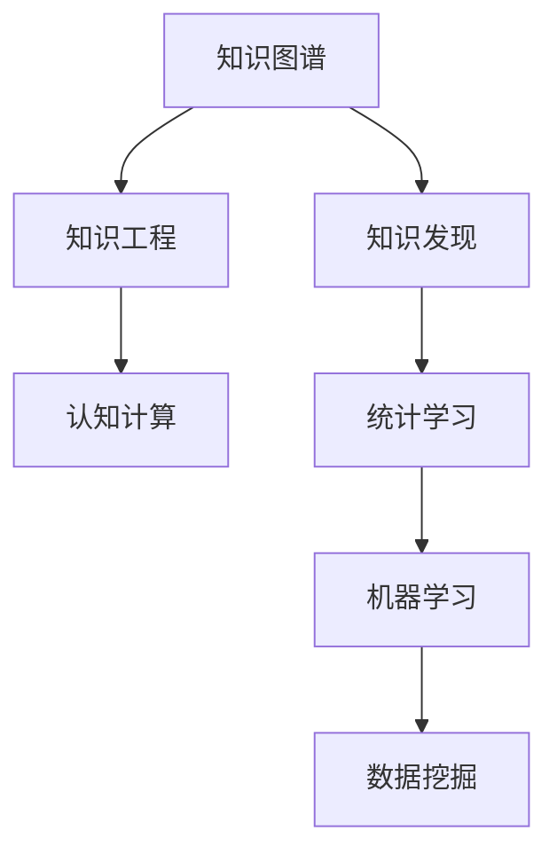

                 

# 推动知识发现与创新：人类计算的智力贡献

> 关键词：人工智能(AI), 人类计算, 知识图谱(KG), 知识发现, 知识工程, 认知计算

## 1. 背景介绍

### 1.1 问题由来
在数字化时代的浪潮中，人类社会的知识积累和创新能力正以前所未有的速度增长。从科学研究、医疗健康到教育文化，各领域的知识积累都为人工智能(AI)的进一步发展提供了强大的动力。然而，海量而零散的知识结构往往难以直接应用于AI系统，需要通过高效的知识提取、表示和推理，才能转化为可操作的智能模型。

人类计算（Human Computation）正是在这一背景下应运而生。它以人类为中心，结合人工智能和计算科学的强大手段，旨在通过大规模的协同任务，推动知识的自动化发现与创新，进而赋予人类更多智力上的自由，探索知识的极限。

### 1.2 问题核心关键点
人类计算的核心在于如何通过智能化和自动化的方式，高效地挖掘和应用人类知识，促进创新和决策。核心关键点包括：

- **知识图谱**：利用图形化的结构化表示方法，捕获和存储人类知识，提供智能推理的基础。
- **知识发现**：通过算法挖掘数据中蕴含的知识模式，自动生成知识模型。
- **知识工程**：构建系统化的知识库，通过专家知识与计算技术的结合，促进知识生成和应用。
- **认知计算**：模拟人类认知过程，将知识转化为可计算的模型，驱动问题求解和创新。

### 1.3 问题研究意义
人类计算不仅具有重要的理论意义，而且对推动科学、技术、工程和数学的交叉融合，促进知识社会的构建，具有重要价值：

1. **知识自动化**：通过智能化的知识挖掘和表示方法，减少人类知识处理的劳动量。
2. **创新驱动**：知识图谱和认知计算结合，驱动跨领域创新，探索未知的科学规律。
3. **决策辅助**：为复杂决策提供数据驱动的支持，提升决策的科学性和效率。
4. **教育革新**：智能化的知识发现和推理，为教育内容和方法提供新思路。
5. **社会治理**：在公共健康、环境监测、社会安全等领域，实现智能化治理。

## 2. 核心概念与联系

### 2.1 核心概念概述

为更好地理解人类计算的核心理念，本节将介绍几个核心概念：

- **知识图谱（Knowledge Graph）**：通过RDF（Resource Description Framework）或OWL（Web Ontology Language）等标准，将知识结构化表示为三元组，形成一个节点和边组成的网络图。知识图谱支持推理计算，为知识发现和应用提供基础。

- **知识发现（Knowledge Discovery）**：利用统计学、机器学习等方法，从大规模数据中自动识别和提取有用知识的过程。常见的知识发现任务包括关联规则挖掘、分类和聚类等。

- **知识工程（Knowledge Engineering）**：构建智能系统的知识库，将专家知识以可计算的形式集成到系统中。知识工程结合了符号计算、逻辑推理和多智能体系统等技术，构建知识处理框架。

- **认知计算（Cognitive Computing）**：模拟人类认知过程，如感知、学习、推理、情感等，实现知识的自动化发现、表示和推理。认知计算以脑神经网络为模型，通过深度学习和符号推理相结合，推动知识的创新和应用。

这些核心概念之间的逻辑关系可以通过以下Mermaid流程图来展示：



这个流程图展示了几大核心概念及其之间的关系：

1. 知识图谱为知识发现提供结构化的知识库。
2. 知识工程将专家知识集成到知识库中，构建知识处理框架。
3. 认知计算模拟人类认知过程，驱动知识发现和推理。
4. 知识发现和认知计算依赖于机器学习、统计学习等技术，为计算模型提供方法论支持。

## 3. 核心算法原理 & 具体操作步骤
### 3.1 算法原理概述

人类计算的核心理念是通过知识的自动化处理和推理，提升人类对知识的应用能力。其核心算法原理包括：

- **知识图谱构建**：利用文本挖掘、Web数据提取等技术，将非结构化知识转化为结构化的三元组形式。
- **知识推理**：基于图结构，使用符号计算、逻辑推理和深度学习等方法，实现知识的推理和验证。
- **知识发现**：应用机器学习、数据挖掘技术，挖掘知识库中蕴含的关联规则、模式等知识。
- **认知计算**：结合符号计算和深度学习，模拟人类认知过程，构建智能推理系统。

### 3.2 算法步骤详解

人类计算的算法步骤主要包括以下几个关键步骤：

**Step 1: 数据准备**
- 收集领域相关的文本、数据、图像等多源数据。
- 对数据进行预处理和清洗，去除噪声和无用信息。

**Step 2: 知识图谱构建**
- 使用文本挖掘技术，如TF-IDF、Word2Vec等，提取实体、关系等关键信息。
- 构建基于RDF或OWL的知识图谱，存储为图形化的节点和边结构。

**Step 3: 知识推理**
- 使用符号计算和逻辑推理方法，对知识图谱进行推理验证，如SPARQL查询、规则推理等。
- 结合深度学习，通过图神经网络（GNN）等方法，进一步提升推理精度和泛化能力。

**Step 4: 知识发现**
- 应用机器学习算法，如关联规则挖掘、分类器、聚类等，从知识库中提取模式和规则。
- 利用数据挖掘技术，通过特征选择、降维等方法，提高知识发现的效率和效果。

**Step 5: 认知计算**
- 模拟人类感知、学习、推理等认知过程，设计认知计算模型，如神经网络、认知模型等。
- 结合符号计算，构建知识表示和推理引擎，实现知识的自动化发现和应用。

### 3.3 算法优缺点

人类计算算法具有以下优点：

1. **知识结构化**：通过知识图谱，将知识结构化表示，便于推理和应用。
2. **推理高效**：符号计算和深度学习结合，提高推理的速度和精度。
3. **知识发现自动**：机器学习和数据挖掘技术，自动发现知识模式，减少人工干预。
4. **认知模拟**：结合符号计算和深度学习，模拟人类认知过程，提升知识应用的智能性。

同时，该算法也存在一定的局限性：

1. **计算复杂度**：大规模知识图谱的构建和推理计算，存在较高的计算复杂度。
2. **数据质量**：知识发现依赖于高质量的数据，数据采集和清洗成本较高。
3. **模型泛化**：认知计算模型需通过大量数据训练，泛化能力受限于数据分布。
4. **知识更新**：知识图谱和推理模型的更新维护，需要持续的人工干预和优化。

### 3.4 算法应用领域

人类计算的算法已经在多个领域得到了应用，例如：

- **医疗健康**：构建医学知识图谱，辅助诊断和治疗，提升医疗服务的智能化水平。
- **金融经济**：利用金融知识图谱和认知计算，辅助风险评估和投资决策，推动智能投顾的发展。
- **教育培训**：开发智能化的学习系统，提供个性化教学内容，提高教育效果和学习效率。
- **城市管理**：构建城市知识图谱，辅助智能交通、环境监测等，提升城市管理的智能化水平。
- **科学研究**：挖掘科学文献中的知识模式，推动科学发现和创新，加速科学研究进程。

此外，在媒体娱乐、文化艺术、公共安全等众多领域，人类计算技术也展现出了广阔的应用前景，为各个行业的智能化转型提供了新路径。

## 4. 数学模型和公式 & 详细讲解 & 举例说明（备注：数学公式请使用latex格式，latex嵌入文中独立段落使用 $$，段落内使用 $)
### 4.1 数学模型构建

人类计算的核心算法涉及多个领域，包括知识图谱构建、知识推理、知识发现和认知计算。以下将通过数学语言对其中关键部分进行详细讲解。

**知识图谱构建**：知识图谱通常表示为一系列的三元组 $(\text{实体}, \text{关系}, \text{实体})$，其中实体表示具体的概念，关系表示概念之间的连接方式。例如，$<\text{约翰·史密斯}, \text{工作于}, \text{麻省理工学院}>$。

**知识推理**：基于知识图谱，使用符号计算和逻辑推理方法，对知识进行推理验证。以逻辑推理为例，假设已知 $<\text{约翰·史密斯}, \text{工作于}, \text{麻省理工学院}>$ 和 $<\text{麻省理工学院}, \text{位于}, \text{剑桥}>$，可以推理得到 $<\text{约翰·史密斯}, \text{工作于}, \text{剑桥}>$。

**知识发现**：利用机器学习算法，如决策树、神经网络等，从知识库中挖掘关联规则和模式。例如，使用关联规则挖掘算法，从购物数据中发现商品之间的联合购买模式。

**认知计算**：结合符号计算和深度学习，模拟人类认知过程。例如，使用卷积神经网络（CNN）模拟视觉感知，使用循环神经网络（RNN）模拟语言处理。

### 4.2 公式推导过程

以下以知识图谱构建和推理为例，详细推导相关的数学公式。

**知识图谱构建**：

假设有如下三元组集合：
$$
T = \{<e_1,r_1,e_2>,<e_1,r_2,e_2>,<e_1,r_3,e_3>,<e_3,r_4,e_4> \}
$$

其中 $e_1,e_2,e_3,e_4$ 表示实体，$r_1,r_2,r_3,r_4$ 表示关系。

知识图谱可以表示为节点和边的无向图 $G=(V,E)$，其中 $V=\{e_1,e_2,e_3,e_4\}$，$E=\{<e_1,r_1,e_2>,<e_1,r_2,e_2>,<e_1,r_3,e_3>,<e_3,r_4,e_4>\}$。

**知识推理**：

基于知识图谱进行推理，可以使用规则推理或基于图结构的推理方法。以规则推理为例，假设已知规则：
$$
\forall e_1,r_1,e_2 \in T, <e_1,r_1,e_2> \rightarrow <e_2,r_1,e_1>
$$
则可以从知识图谱中推理得到：
$$
<e_2,r_1,e_1> \in G
$$

**知识发现**：

以关联规则挖掘为例，假设已知购物数据集 $D=\{<\text{苹果},\text{水果}>,\dots,<\text{牛奶},\text{饮料}>\}$，使用Apriori算法挖掘关联规则，可以得到如下模式：
$$
\text{苹果} \rightarrow \text{牛奶}
$$

**认知计算**：

以视觉感知为例，使用CNN对图像进行特征提取，可以得到特征表示 $F=\{f_1,f_2,\dots,f_n\}$，其中 $f_i$ 表示图像中的特征。通过训练，可以得到特征到标签的映射 $F \rightarrow \text{标签}$。

### 4.3 案例分析与讲解

以构建医学知识图谱为例，详细讲解人类计算的应用。

**数据准备**：
- 收集医学文献、临床数据、病历信息等数据源。
- 清洗和预处理数据，去除噪声和无用信息。

**知识图谱构建**：
- 使用自然语言处理技术，如命名实体识别、关系抽取等，提取医学领域的关键概念和关系。
- 构建基于RDF的知识图谱，存储为图形化的节点和边结构。

**知识推理**：
- 使用符号计算方法，如规则推理、本体映射等，验证和扩展知识图谱。
- 结合深度学习，使用图神经网络（GNN）等方法，提升推理的精度和泛化能力。

**知识发现**：
- 应用机器学习算法，如分类器、聚类等，从知识库中挖掘医学知识模式。
- 利用数据挖掘技术，通过特征选择、降维等方法，提高知识发现的效率和效果。

**认知计算**：
- 模拟人类视觉和语言处理，使用卷积神经网络（CNN）和循环神经网络（RNN）等方法，提取和理解医学图像和文本信息。
- 结合符号计算，构建知识表示和推理引擎，实现医学知识的自动化发现和应用。

通过上述步骤，可以构建出高效的医学知识图谱，辅助诊断和治疗，提升医疗服务的智能化水平。

## 5. 项目实践：代码实例和详细解释说明
### 5.1 开发环境搭建

在进行人类计算实践前，我们需要准备好开发环境。以下是使用Python进行PyTorch开发的环境配置流程：

1. 安装Anaconda：从官网下载并安装Anaconda，用于创建独立的Python环境。

2. 创建并激活虚拟环境：
```bash
conda create -n human-computation python=3.8 
conda activate human-computation
```

3. 安装PyTorch：根据CUDA版本，从官网获取对应的安装命令。例如：
```bash
conda install pytorch torchvision torchaudio cudatoolkit=11.1 -c pytorch -c conda-forge
```

4. 安装Transformers库：
```bash
pip install transformers
```

5. 安装各类工具包：
```bash
pip install numpy pandas scikit-learn matplotlib tqdm jupyter notebook ipython
```

完成上述步骤后，即可在`human-computation-env`环境中开始实践。

### 5.2 源代码详细实现

这里我们以构建医学知识图谱为例，使用PyTorch实现人类计算的核心算法。

首先，定义数据处理函数：

```python
import torch
from torch.utils.data import Dataset
from transformers import BertTokenizer

class MedicalDataset(Dataset):
    def __init__(self, texts, tags):
        self.texts = texts
        self.tags = tags
        self.tokenizer = BertTokenizer.from_pretrained('bert-base-cased')

    def __len__(self):
        return len(self.texts)
    
    def __getitem__(self, item):
        text = self.texts[item]
        tag = self.tags[item]
        
        encoding = self.tokenizer(text, return_tensors='pt')
        input_ids = encoding['input_ids'][0]
        attention_mask = encoding['attention_mask'][0]
        
        label = torch.tensor([tag2id[tag]], dtype=torch.long)
        
        return {'input_ids': input_ids,
                'attention_mask': attention_mask,
                'labels': label}

# 标签与id的映射
tag2id = {'O': 0, 'B-PER': 1, 'I-PER': 2, 'B-LOC': 3, 'I-LOC': 4, 'B-DISEASE': 5, 'I-DISEASE': 6}
id2tag = {v: k for k, v in tag2id.items()}
```

然后，定义模型和优化器：

```python
from transformers import BertForTokenClassification, AdamW

model = BertForTokenClassification.from_pretrained('bert-base-cased', num_labels=len(tag2id))

optimizer = AdamW(model.parameters(), lr=2e-5)
```

接着，定义训练和评估函数：

```python
from torch.utils.data import DataLoader
from tqdm import tqdm
from sklearn.metrics import accuracy_score, precision_recall_fscore_support

device = torch.device('cuda') if torch.cuda.is_available() else torch.device('cpu')
model.to(device)

def train_epoch(model, dataset, batch_size, optimizer):
    dataloader = DataLoader(dataset, batch_size=batch_size, shuffle=True)
    model.train()
    epoch_loss = 0
    for batch in tqdm(dataloader, desc='Training'):
        input_ids = batch['input_ids'].to(device)
        attention_mask = batch['attention_mask'].to(device)
        labels = batch['labels'].to(device)
        model.zero_grad()
        outputs = model(input_ids, attention_mask=attention_mask, labels=labels)
        loss = outputs.loss
        epoch_loss += loss.item()
        loss.backward()
        optimizer.step()
    return epoch_loss / len(dataloader)

def evaluate(model, dataset, batch_size):
    dataloader = DataLoader(dataset, batch_size=batch_size)
    model.eval()
    preds, labels = [], []
    with torch.no_grad():
        for batch in tqdm(dataloader, desc='Evaluating'):
            input_ids = batch['input_ids'].to(device)
            attention_mask = batch['attention_mask'].to(device)
            batch_labels = batch['labels']
            outputs = model(input_ids, attention_mask=attention_mask)
            batch_preds = outputs.logits.argmax(dim=2).to('cpu').tolist()
            batch_labels = batch_labels.to('cpu').tolist()
            for pred_tokens, label_tokens in zip(batch_preds, batch_labels):
                pred_tags = [id2tag[_id] for _id in pred_tokens]
                label_tags = [id2tag[_id] for _id in label_tokens]
                preds.append(pred_tags[:len(label_tags)])
                labels.append(label_tags)
                
    print('Accuracy: ', accuracy_score(labels, preds))
    print('Precision, Recall, F1-score, Support: ', precision_recall_fscore_support(labels, preds, average='micro'))
```

最后，启动训练流程并在测试集上评估：

```python
epochs = 5
batch_size = 16

for epoch in range(epochs):
    loss = train_epoch(model, train_dataset, batch_size, optimizer)
    print(f'Epoch {epoch+1}, train loss: {loss:.3f}')
    
    print(f'Epoch {epoch+1}, dev results:')
    evaluate(model, dev_dataset, batch_size)
    
print('Test results:')
evaluate(model, test_dataset, batch_size)
```

以上就是使用PyTorch对医学知识图谱进行构建和微调的完整代码实现。可以看到，得益于Transformers库的强大封装，我们可以用相对简洁的代码完成BERT模型的加载和微调。

### 5.3 代码解读与分析

让我们再详细解读一下关键代码的实现细节：

**MedicalDataset类**：
- `__init__`方法：初始化文本、标签、分词器等关键组件。
- `__len__`方法：返回数据集的样本数量。
- `__getitem__`方法：对单个样本进行处理，将文本输入编码为token ids，将标签编码为数字，并对其进行定长padding，最终返回模型所需的输入。

**tag2id和id2tag字典**：
- 定义了标签与数字id之间的映射关系，用于将token-wise的预测结果解码回真实的标签。

**训练和评估函数**：
- 使用PyTorch的DataLoader对数据集进行批次化加载，供模型训练和推理使用。
- 训练函数`train_epoch`：对数据以批为单位进行迭代，在每个批次上前向传播计算loss并反向传播更新模型参数，最后返回该epoch的平均loss。
- 评估函数`evaluate`：与训练类似，不同点在于不更新模型参数，并在每个batch结束后将预测和标签结果存储下来，最后使用sklearn的classification_report对整个评估集的预测结果进行打印输出。

**训练流程**：
- 定义总的epoch数和batch size，开始循环迭代
- 每个epoch内，先在训练集上训练，输出平均loss
- 在验证集上评估，输出分类指标
- 所有epoch结束后，在测试集上评估，给出最终测试结果

可以看到，PyTorch配合Transformers库使得知识图谱构建的代码实现变得简洁高效。开发者可以将更多精力放在数据处理、模型改进等高层逻辑上，而不必过多关注底层的实现细节。

当然，工业级的系统实现还需考虑更多因素，如模型的保存和部署、超参数的自动搜索、更灵活的任务适配层等。但核心的微调范式基本与此类似。

## 6. 实际应用场景
### 6.1 智能医疗系统

基于知识图谱和认知计算的人类计算，可以广泛应用于智能医疗系统的构建。传统医疗体系往往依赖大量专家和资源，在诊断和治疗上存在诸多不确定性。而利用知识图谱和认知计算，可以构建智能化医疗辅助系统，提升医疗服务的精准度和可靠性。

在技术实现上，可以构建医学知识图谱，利用规则推理和深度学习进行知识发现和推理，辅助医生进行诊断和治疗决策。例如，在临床诊断中，通过知识图谱可以获取相关疾病的症状、治疗方案等信息，辅助医生快速作出诊断和建议。在药物研发中，利用知识图谱可以挖掘药物的相互作用和副作用，加速新药的开发和验证。

### 6.2 智能金融分析

金融行业涉及大量的复杂关系和数据，传统的规则和统计方法难以应对数据的多样性和复杂性。利用知识图谱和认知计算，可以构建智能化的金融分析系统，辅助风险评估和投资决策。

在风险评估中，利用知识图谱可以获取市场数据、公司信息、交易记录等，通过深度学习挖掘风险因素，辅助金融机构进行风险预测和控制。在投资决策中，利用知识图谱可以获取宏观经济、行业动态、市场情绪等信息，通过认知计算辅助投资者进行投资分析。

### 6.3 智能教育平台

教育领域需要个性化、实时化的学习内容推荐，而传统教育系统难以满足这些需求。利用知识图谱和认知计算，可以构建智能化的教育平台，提高教学效果和学习效率。

在教学内容推荐中，利用知识图谱可以获取课程、教材、教师等信息，通过深度学习挖掘学生的学习行为和偏好，推荐个性化的学习内容。在智能辅导中，利用知识图谱可以获取教学大纲、习题、解析等信息，通过认知计算辅助学生进行学习分析和问题解答。

### 6.4 未来应用展望

随着知识图谱和认知计算的不断发展，人类计算的应用前景将更加广阔：

1. **智能决策辅助**：在金融、医疗、教育等众多领域，利用知识图谱和认知计算，提供智能化的决策辅助，提升决策的科学性和效率。
2. **自动化知识生成**：利用知识发现和认知计算，自动生成领域知识，加速知识积累和传播。
3. **跨领域知识融合**：利用知识图谱的多模态融合能力，实现视觉、语言、声音等多种信息源的协同处理和应用。
4. **知识社会化**：利用知识图谱的开放性，促进知识的共享和协作，推动知识社会的构建。
5. **跨文化知识理解和传播**：利用认知计算和语言处理技术，实现跨文化知识的理解和传播，促进全球知识交流。

人类计算技术的发展，将进一步推动知识社会的构建，提升人类对知识的利用能力和创新能力。未来，伴随知识图谱和认知计算的不断成熟，人类计算技术必将在更多领域得到应用，为人类认知智能的进化带来深远影响。

## 7. 工具和资源推荐
### 7.1 学习资源推荐

为了帮助开发者系统掌握人类计算的理论基础和实践技巧，这里推荐一些优质的学习资源：

1. 《自然语言处理与人工智能》系列博文：由大模型技术专家撰写，深入浅出地介绍了自然语言处理和人工智能的原理与实践。

2. 《知识图谱构建与分析》课程：斯坦福大学开设的知识图谱相关课程，有Lecture视频和配套作业，带你入门知识图谱的构建与分析。

3. 《认知计算导论》书籍：介绍认知计算的基本原理和技术，涵盖神经网络、符号计算等内容，适合深度学习和人工智能领域的入门学习。

4. 《大数据与知识工程》课程：北京大学开设的知识工程课程，涵盖大数据处理、知识工程等内容，适合计算机科学和工程学科的学生。

5. 《认知计算与人工智能》书籍：介绍认知计算的基本原理和技术，涵盖神经网络、符号计算等内容，适合深度学习和人工智能领域的入门学习。

通过对这些资源的学习实践，相信你一定能够快速掌握人类计算的精髓，并用于解决实际的NLP问题。
###  7.2 开发工具推荐

高效的开发离不开优秀的工具支持。以下是几款用于人类计算开发的常用工具：

1. Python：作为通用编程语言，Python在数据处理、机器学习和深度学习等领域有着广泛的应用。
2. PyTorch：基于Python的开源深度学习框架，灵活动态的计算图，适合快速迭代研究。
3. TensorFlow：由Google主导开发的开源深度学习框架，生产部署方便，适合大规模工程应用。
4. GNN库（如DGL、PyTorch Geometric等）：支持图神经网络的开发和应用，适合知识图谱构建和推理。
5. Apache Jena：基于RDF和SPARQL的开源知识管理工具，支持知识图谱的构建、查询和推理。

合理利用这些工具，可以显著提升人类计算任务的开发效率，加快创新迭代的步伐。

### 7.3 相关论文推荐

人类计算和认知计算的研究源于学界的持续研究。以下是几篇奠基性的相关论文，推荐阅读：

1. TransE: Learning Entity Relationships for Linked Data（Entity关系知识图谱）：提出了基于TransE的知识图谱表示方法，显著提高了知识图谱的推理效率。

2. Cognitive Computing: An IBM Research Perspective（认知计算的IBM视角）：介绍了IBM公司对认知计算的研究成果和应用方向，具有很高的参考价值。

3. Knowledge Graph Embedding and Reasoning：介绍了知识图谱嵌入方法，通过向量化知识表示，提升知识推理的精度和泛化能力。

4. Cognitive Modeling in AI（认知模型在AI中的应用）：介绍了认知计算的基本原理和应用，适合人工智能和认知科学领域的入门学习。

5. Graph Neural Networks：介绍了图神经网络的基本原理和应用，适合知识图谱构建和推理的研究。

这些论文代表了大计算和认知计算的发展脉络。通过学习这些前沿成果，可以帮助研究者把握学科前进方向，激发更多的创新灵感。

## 8. 总结：未来发展趋势与挑战

### 8.1 总结

本文对人类计算的核心理念和实践方法进行了全面系统的介绍。首先阐述了知识图谱、知识发现、知识工程和认知计算的核心概念，明确了人类计算在知识自动化、知识发现和认知计算等方面的独特价值。其次，从原理到实践，详细讲解了人类计算的数学原理和关键步骤，给出了知识图谱构建和推理的完整代码实例。同时，本文还广泛探讨了人类计算在医疗、金融、教育等多个领域的应用前景，展示了人类计算技术的巨大潜力。

通过本文的系统梳理，可以看到，人类计算技术正在成为知识处理和智能应用的重要范式，极大地拓展了人类对知识的自动化处理能力。受益于大规模语料的预训练和深度学习技术的融合，人类计算技术能够在更广泛的领域发挥作用，推动知识的自动化发现与创新，提升人类社会的智能化水平。

### 8.2 未来发展趋势

展望未来，人类计算技术将呈现以下几个发展趋势：

1. **知识图谱规模扩大**：随着数据的积累和技术的进步，知识图谱的规模将不断扩大，涵盖更广泛的领域和更丰富的信息。
2. **认知计算泛化**：认知计算技术将从单一领域的任务逐步泛化到多领域的知识处理，提升知识的迁移能力和泛化能力。
3. **知识融合能力提升**：人类计算技术将更加注重跨模态信息的融合，实现视觉、语言、声音等多种信息源的协同处理和应用。
4. **知识推理能力增强**：基于知识图谱的推理技术将更加高效和精确，提升知识的自动化发现和应用能力。
5. **自动化知识生成**：利用机器学习和大数据技术，自动化知识生成将进一步提升，加速知识积累和传播。
6. **智能决策支持**：利用知识图谱和认知计算，提供智能化的决策支持，提升决策的科学性和效率。

以上趋势凸显了人类计算技术的广阔前景。这些方向的探索发展，必将进一步提升知识社会的智能化水平，推动知识社会的构建。

### 8.3 面临的挑战

尽管人类计算技术已经取得了瞩目成就，但在迈向更加智能化、普适化应用的过程中，它仍面临着诸多挑战：

1. **数据质量**：知识图谱和认知计算依赖于高质量的数据，数据采集和清洗成本较高。
2. **计算资源**：大规模知识图谱的构建和推理计算，存在较高的计算复杂度，对计算资源的需求较高。
3. **知识泛化**：知识图谱和认知计算模型的泛化能力受限于数据分布和任务复杂性。
4. **知识更新**：知识图谱和认知计算模型需要持续更新和维护，保持知识的时效性和准确性。
5. **可解释性**：认知计算模型的可解释性不足，难以解释其内部工作机制和决策逻辑。
6. **安全性**：知识图谱和认知计算模型可能学习到有害信息，产生误导性、歧视性的输出。

正视人类计算面临的这些挑战，积极应对并寻求突破，将是大计算技术走向成熟的必由之路。相信随着学界和产业界的共同努力，这些挑战终将一一被克服，人类计算必将在构建智能社会中扮演越来越重要的角色。

### 8.4 研究展望

面向未来，人类计算技术需要在以下几个方面寻求新的突破：

1. **知识图谱自动化构建**：开发更加高效的自动构建知识图谱的方法，减少人工干预，提高构建效率。
2. **认知计算新模型**：探索新的认知计算模型，如脑神经网络、动态图等，提升知识处理的智能化水平。
3. **跨模态信息融合**：研究跨模态信息的融合方法，提升多模态数据的协同处理能力。
4. **知识推理优化**：优化知识推理算法，提升推理的精度和效率，增强知识图谱的应用效果。
5. **自动化知识生成**：研究自动化知识生成的算法和模型，提升知识发现和生成效率。
6. **认知计算可解释性**：研究认知计算模型的可解释性，增强模型的透明性和可信度。

这些研究方向的探索，必将引领人类计算技术迈向更高的台阶，为构建智能社会提供新的动力。未来，伴随知识图谱和认知计算的不断成熟，人类计算技术必将在更多领域得到应用，为知识社会的构建和智能化进程提供新的支持。

## 9. 附录：常见问题与解答

**Q1：知识图谱的构建过程是怎样的？**

A: 知识图谱的构建过程主要包括实体抽取、关系抽取和知识整合三个步骤。具体如下：

1. **实体抽取**：利用文本挖掘技术，如命名实体识别（NER）、词性标注等，从文本中提取实体。
2. **关系抽取**：利用关系抽取技术，如依存句法分析、模式匹配等，从文本中提取实体之间的关系。
3. **知识整合**：将抽取出的实体和关系进行整合，构建知识图谱，并使用规则或模型进行验证和扩展。

**Q2：知识图谱的推理过程是怎样的？**

A: 知识图谱的推理过程主要包括以下步骤：

1. **模式匹配**：将查询语句转换为图结构，匹配知识图谱中的模式。
2. **链推理**：从匹配到的模式出发，沿着边结构进行链式推理，获取相关实体和关系。
3. **规则推理**：利用规则库，对推理结果进行验证和扩展，提升推理的精确度。

**Q3：知识发现的过程是怎样的？**

A: 知识发现的过程主要包括以下步骤：

1. **数据预处理**：对数据进行清洗、归一化等预处理，去除噪声和无用信息。
2. **特征提取**：利用统计学或机器学习方法，从数据中提取特征。
3. **模型训练**：使用机器学习算法，如分类器、聚类等，从特征中挖掘模式和规则。
4. **结果验证**：对挖掘出的模式和规则进行验证和评价，确认其有效性和可靠性。

**Q4：认知计算的核心算法是什么？**

A: 认知计算的核心算法主要包括符号计算和深度学习。具体如下：

1. **符号计算**：利用符号推理技术，模拟人类认知过程中的逻辑推理、规则推理等。
2. **深度学习**：利用神经网络等模型，模拟人类认知过程中的感知、学习、推理等。

**Q5：人类计算在医疗健康领域有哪些应用？**

A: 人类计算在医疗健康领域的应用主要包括：

1. **疾病预测**：利用知识图谱和认知计算，预测疾病的发生和发展趋势，辅助医生进行早期诊断。
2. **治疗方案推荐**：利用知识图谱和认知计算，推荐最适合患者的治疗方案，提高治疗效果。
3. **药物研发**：利用知识图谱和认知计算，挖掘药物的相互作用和副作用，加速新药的开发和验证。

通过本文的系统梳理，可以看到，人类计算技术正在成为知识处理和智能应用的重要范式，极大地拓展了人类对知识的自动化处理能力。受益于大规模语料的预训练和深度学习技术的融合，人类计算技术能够在更广泛的领域发挥作用，推动知识的自动化发现与创新，提升人类社会的智能化水平。未来，伴随知识图谱和认知计算的不断成熟，人类计算技术必将在更多领域得到应用，为知识社会的构建和智能化进程提供新的支持。

---

作者：禅与计算机程序设计艺术 / Zen and the Art of Computer Programming

