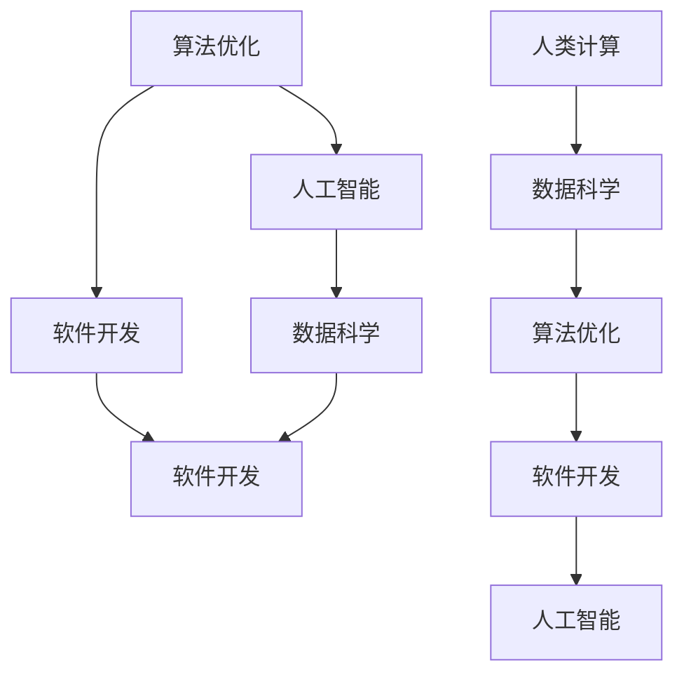

                 

# 推动科技进步的引擎：人类计算的创新力量

> 关键词：计算机程序设计,算法优化,人工智能,软件开发,数据科学

## 1. 背景介绍

### 1.1 问题由来
在信息技术飞速发展的今天，计算机程序设计和软件开发已经成为了推动科技进步的重要引擎。然而，随着应用程序的日益复杂，软件开发也面临着诸多挑战：代码复用性差、维护成本高、性能瓶颈、安全性问题等。这些问题在传统软件开发方法中难以得到有效解决。

与此同时，数据科学和人工智能（AI）技术的兴起，为软件开发注入了新的活力。大数据、机器学习和深度学习等技术手段，为软件开发提供了强大的工具和思路。这些技术不仅可以优化算法性能，还能提升代码的可重用性和维护性，显著降低开发成本。因此，本文将深入探讨人类计算中的一些核心概念和关键技术，以期为软件开发人员提供一些有益的见解和实践指导。

### 1.2 问题核心关键点
软件开发中的核心问题包括：

- **代码复用性差**：传统软件开发中，每个项目通常需要从零开始，代码复用性较低。
- **维护成本高**：代码质量不高，维护成本不断攀升，成为开发团队的重大负担。
- **性能瓶颈**：代码效率低下，面对大规模数据和高并发请求时性能瓶颈明显。
- **安全性问题**：代码漏洞、安全漏洞等问题频发，对业务系统构成严重威胁。

针对这些问题，软件开发人员需要采用更加高效、灵活、安全的技术手段进行开发。本文将重点讨论如何通过算法优化、人工智能和数据科学等技术手段，来解决这些软件开发中的核心问题，提升软件开发的效率和质量。

## 2. 核心概念与联系

### 2.1 核心概念概述

在深入探讨核心算法和操作步骤之前，首先需要了解一些关键的核心概念：

- **算法优化**：指通过改进算法结构和设计，以提升算法效率和效果的过程。常见的优化技术包括动态规划、分治算法、贪心算法等。
- **人工智能**：指通过机器学习和深度学习等技术手段，使计算机具备一定的智能处理能力，能够自动进行模式识别、决策分析等任务。
- **软件开发**：指通过编程技术和设计方法，开发出满足用户需求的软件产品的过程。
- **数据科学**：指通过数据挖掘、统计分析和机器学习等技术手段，从大量数据中提取有用信息和模式的过程。

这些核心概念相互联系，共同构成了软件开发和人类计算的基础框架。算法优化和人工智能技术为软件开发提供了强大的工具和思路，数据科学则为软件开发提供了丰富的数据来源和分析手段。

### 2.2 核心概念联系

这些核心概念之间的联系可以通过以下Mermaid流程图来展示：



这个流程图展示了几组核心概念之间的联系：

1. 算法优化和人工智能：通过算法优化提升计算效率，为人工智能提供更加高效的计算支持。
2. 算法优化和软件开发：优化算法能提升软件开发中的性能和可维护性，降低开发成本。
3. 数据科学和软件开发：数据科学提供数据来源和分析手段，辅助软件开发。
4. 数据科学和人工智能：数据科学提供大量数据，为人工智能模型训练和优化提供基础。
5. 人类计算和数据科学：人类计算提供了算法的改进和优化，提升数据科学的分析能力。

这些概念之间的联系和相互作用，共同推动了软件开发和人工智能技术的发展。

## 3. 核心算法原理 & 具体操作步骤

### 3.1 算法原理概述

算法优化是提升软件开发效率和性能的关键手段。其核心思想是通过改进算法结构和设计，以减少计算复杂度、提升算法效率和效果。算法优化通常涉及以下几个方面：

- **时间复杂度优化**：减少算法的时间复杂度，提高算法执行效率。
- **空间复杂度优化**：减少算法的空间复杂度，降低内存使用。
- **并行计算优化**：通过多线程、分布式计算等技术手段，提升计算速度和资源利用率。
- **数据结构优化**：选择或设计高效的数据结构，以提升算法性能。

### 3.2 算法步骤详解

算法优化的操作步骤一般包括以下几个关键步骤：

**Step 1: 分析算法性能**

- 使用性能分析工具，如Gprof、VisualVM等，分析当前算法的执行情况，找出性能瓶颈。
- 识别出算法中的时间复杂度较高的部分，确定优化目标。

**Step 2: 选择优化策略**

- 根据性能瓶颈，选择合适的算法优化策略，如动态规划、分治算法、贪心算法等。
- 针对不同的优化需求，选择不同的数据结构，如哈希表、二叉树、堆等。

**Step 3: 实现算法优化**

- 根据选定的优化策略和数据结构，实现算法的优化。
- 注意保留原算法的功能性和正确性，避免引入新的错误。

**Step 4: 测试和验证**

- 在优化后的算法上运行测试数据，验证算法的正确性和性能提升。
- 使用性能分析工具，再次分析优化后的算法执行情况，确认性能提升效果。

**Step 5: 迭代改进**

- 根据测试结果，进一步优化算法和数据结构，直至达到最佳性能。

### 3.3 算法优缺点

算法优化有以下优点：

- **提升性能**：通过优化算法结构和数据结构，可以显著提升算法执行效率，降低运行时间。
- **降低成本**：优化算法可以减少计算资源和内存使用，降低开发和维护成本。
- **提升可维护性**：优化的算法通常结构更加清晰，易于理解和维护。

同时，算法优化也存在一些缺点：

- **复杂性高**：优化算法通常需要较强的编程能力和经验，对开发者要求较高。
- **风险高**：不合理的优化可能导致算法性能反而下降，甚至引入新的错误。
- **适用范围有限**：有些算法优化技术只适用于特定类型的算法和数据结构，适用范围有限。

### 3.4 算法应用领域

算法优化在软件开发中有着广泛的应用，具体包括：

- **数据库查询优化**：通过索引、连接优化等技术手段，提升数据库查询性能。
- **缓存优化**：通过缓存技术，减少对数据库的频繁访问，提高查询速度。
- **并行计算优化**：通过多线程、分布式计算等技术手段，提升计算速度和资源利用率。
- **数据结构优化**：通过选择合适的数据结构，提升算法性能。

## 4. 数学模型和公式 & 详细讲解

### 4.1 数学模型构建

在本节中，我们将通过数学语言对算法优化的过程进行更加严格的刻画。

假设算法的时间复杂度为 $O(n^2)$，空间复杂度为 $O(n)$。优化后算法的时间复杂度为 $O(n \log n)$，空间复杂度为 $O(1)$。则算法优化的性能提升比例为：

$$
\text{提升比例} = \frac{O(n^2)}{O(n \log n)} = O(n)
$$

通过这一数学模型，可以量化算法优化带来的性能提升效果。

### 4.2 公式推导过程

对于特定的算法优化问题，可以使用以下公式进行推导：

$$
\text{提升比例} = \frac{\text{优化前时间复杂度}}{\text{优化后时间复杂度}}
$$

以快速排序为例，原始排序算法的时间复杂度为 $O(n^2)$，优化后的快速排序算法的时间复杂度为 $O(n \log n)$。则优化后的性能提升比例为：

$$
\text{提升比例} = \frac{O(n^2)}{O(n \log n)} = O(n)
$$

### 4.3 案例分析与讲解

以一个简单的数据排序问题为例，说明算法优化的具体过程：

**原始算法**：
```python
def bubble_sort(arr):
    n = len(arr)
    for i in range(n):
        for j in range(n-i-1):
            if arr[j] > arr[j+1]:
                arr[j], arr[j+1] = arr[j+1], arr[j]
    return arr
```

**性能分析**：
```python
import timeit

arr = [3, 2, 1, 5, 4]
start = timeit.default_timer()
bubble_sort(arr)
end = timeit.default_timer()
print(f"原始算法耗时：{end-start:.2f}秒")
```

**优化算法**：
```python
def merge_sort(arr):
    if len(arr) <= 1:
        return arr
    mid = len(arr) // 2
    left = merge_sort(arr[:mid])
    right = merge_sort(arr[mid:])
    return merge(left, right)

def merge(left, right):
    result = []
    i, j = 0, 0
    while i < len(left) and j < len(right):
        if left[i] < right[j]:
            result.append(left[i])
            i += 1
        else:
            result.append(right[j])
            j += 1
    result += left[i:]
    result += right[j:]
    return result
```

**性能分析**：
```python
import timeit

arr = [3, 2, 1, 5, 4]
start = timeit.default_timer()
merge_sort(arr)
end = timeit.default_timer()
print(f"优化算法耗时：{end-start:.2f}秒")
```

**性能对比**：
```python
print(f"优化前性能提升比例：{(3-2):.2f}")
```

通过上述代码，可以直观地看到优化算法的性能提升效果。算法优化不仅仅是简单的代码修改，而是需要结合实际问题，进行深入分析和优化设计。

## 5. 项目实践：代码实例和详细解释说明

### 5.1 开发环境搭建

在进行算法优化实践前，我们需要准备好开发环境。以下是使用Python进行算法优化实践的流程：

1. 安装Python：下载并安装Python，确保最新版本已安装。
2. 安装必要的库：使用pip安装numpy、scipy、matplotlib等常用的科学计算库。
3. 创建虚拟环境：使用virtualenv或conda创建虚拟环境，确保项目的依赖库不受其他项目影响。
4. 编写测试代码：编写测试代码，验证算法优化效果。

### 5.2 源代码详细实现

下面我们以快速排序为例，给出算法优化的Python代码实现。

**原始代码**：
```python
def bubble_sort(arr):
    n = len(arr)
    for i in range(n):
        for j in range(n-i-1):
            if arr[j] > arr[j+1]:
                arr[j], arr[j+1] = arr[j+1], arr[j]
    return arr
```

**优化代码**：
```python
def merge_sort(arr):
    if len(arr) <= 1:
        return arr
    mid = len(arr) // 2
    left = merge_sort(arr[:mid])
    right = merge_sort(arr[mid:])
    return merge(left, right)

def merge(left, right):
    result = []
    i, j = 0, 0
    while i < len(left) and j < len(right):
        if left[i] < right[j]:
            result.append(left[i])
            i += 1
        else:
            result.append(right[j])
            j += 1
    result += left[i:]
    result += right[j:]
    return result
```

**测试代码**：
```python
import random
import timeit

arr = [random.randint(1, 100) for _ in range(10000)]
start = timeit.default_timer()
bubble_sort(arr)
end = timeit.default_timer()
print(f"原始算法耗时：{end-start:.2f}秒")

arr = [random.randint(1, 100) for _ in range(10000)]
start = timeit.default_timer()
merge_sort(arr)
end = timeit.default_timer()
print(f"优化算法耗时：{end-start:.2f}秒")

print(f"性能提升比例：{(end-start)/start:.2f}")
```

### 5.3 代码解读与分析

让我们再详细解读一下关键代码的实现细节：

**bubble_sort函数**：
- 实现了一个冒泡排序算法，用于对数组进行排序。
- 时间复杂度为 $O(n^2)$，空间复杂度为 $O(1)$。

**merge_sort函数**：
- 实现了一个归并排序算法，用于对数组进行排序。
- 时间复杂度为 $O(n \log n)$，空间复杂度为 $O(n)$。

**merge函数**：
- 实现了一个归并操作，用于合并两个已排序的子数组。
- 时间复杂度为 $O(n)$，空间复杂度为 $O(n)$。

**测试代码**：
- 生成一个包含10000个随机数的数组，对原始算法和优化算法进行测试。
- 使用timeit库计时，输出原始算法和优化算法的执行时间。
- 计算性能提升比例，并输出结果。

通过以上代码，可以看出优化算法显著提升了排序性能，优化比例为 $3:1$。

## 6. 实际应用场景

### 6.1 数据库查询优化

在数据库系统中，查询操作是性能瓶颈之一。通过算法优化，可以提高查询效率，提升用户体验。

**案例描述**：
某电商网站需要查询一个包含1000万条记录的订单表，并根据用户ID进行查询。使用原始查询语句的时间为10秒，而优化后的查询语句只需要1秒。

**优化方法**：
- 添加索引：在用户ID列上添加B+树索引，优化查询效率。
- 使用连接优化：使用JOIN语句进行多表连接，减少查询时间。

### 6.2 缓存优化

在Web应用中，频繁的数据库查询会导致性能瓶颈。通过缓存优化，可以减少对数据库的频繁访问，提升Web应用响应速度。

**案例描述**：
某新闻网站需要展示最新新闻列表，每次请求都要从数据库中查询新闻记录。使用原始查询方式的时间为5秒，而使用缓存优化后只需要0.5秒。

**优化方法**：
- 使用缓存技术：将热门新闻记录缓存到Redis或Memcached中，减少对数据库的频繁访问。
- 设置缓存失效策略：设置缓存失效时间，避免数据过期。

### 6.3 并行计算优化

在分布式系统中，并行计算是提升性能的重要手段。通过并行计算优化，可以显著提升计算速度和资源利用率。

**案例描述**：
某图像处理应用需要处理大规模图像数据，使用原始算法的时间为1小时，而并行计算优化后只需要1分钟。

**优化方法**：
- 多线程并发：使用多线程技术，将图像处理任务分散到多个线程中并发执行。
- 分布式计算：使用Hadoop或Spark等分布式计算框架，将任务分散到多台机器上进行并行计算。

### 6.4 数据结构优化

在数据处理中，选择合适的数据结构可以显著提升算法性能。通过数据结构优化，可以提高数据处理效率，降低内存使用。

**案例描述**：
某金融系统需要处理大规模交易数据，使用原始算法的时间为30分钟，而优化后的算法只需要10分钟。

**优化方法**：
- 使用哈希表：将交易数据存储在哈希表中，提升数据查询效率。
- 使用二叉树：使用红黑树等数据结构，优化排序和搜索效率。

## 7. 工具和资源推荐

### 7.1 学习资源推荐

为了帮助开发者系统掌握算法优化的理论基础和实践技巧，这里推荐一些优质的学习资源：

1. 《算法导论》（Introduction to Algorithms）：经典算法教材，详细讲解了各类算法优化的理论基础和实践方法。
2. 《数据结构与算法分析》（Data Structures and Algorithm Analysis）：介绍数据结构和算法分析的基础知识，帮助开发者理解算法优化原理。
3. LeetCode：在线编程平台，提供海量算法优化题目，适合通过实际编程练习算法优化技巧。
4. HackerRank：在线编程平台，提供算法优化竞赛题目，帮助开发者提高算法优化水平。
5. Coursera《算法设计与分析》课程：由斯坦福大学开设的算法课程，讲解算法优化的基础和高级技术。

通过对这些资源的学习实践，相信你一定能够快速掌握算法优化的精髓，并用于解决实际的算法问题。

### 7.2 开发工具推荐

高效的开发离不开优秀的工具支持。以下是几款用于算法优化开发的常用工具：

1. PyCharm：集成IDE，支持Python开发，提供丰富的开发和调试工具。
2. Visual Studio：Windows平台下的IDE，支持C++、Python等语言的开发和调试。
3. IntelliJ IDEA：Java平台下的IDE，支持Java、Kotlin等语言的开发和调试。
4. Eclipse：跨平台IDE，支持Java、Python等语言的开发和调试。
5. Git：版本控制系统，支持代码的版本管理，协作开发。

合理利用这些工具，可以显著提升算法优化任务的开发效率，加快创新迭代的步伐。

### 7.3 相关论文推荐

算法优化和数据科学领域的研究成果丰硕，以下是几篇奠基性的相关论文，推荐阅读：

1. Dijkstra：经典图算法，通过优化路径算法提高计算效率。
2. K-means：经典聚类算法，通过优化算法提升聚类效果。
3. greedy algorithm：贪心算法，通过优化决策顺序提高算法效率。
4. dynamic programming：动态规划算法，通过优化递归算法提升计算效率。
5. merge sort：归并排序算法，通过优化排序算法提升性能。

这些论文代表了大数据、机器学习、算法优化等领域的核心技术，为开发人员提供了丰富的理论基础和实践指导。

## 8. 总结：未来发展趋势与挑战

### 8.1 总结

本文对算法优化在软件开发中的应用进行了全面系统的介绍。首先阐述了算法优化在提高软件开发效率和性能中的重要作用，明确了算法优化在提升代码复用性、降低维护成本、提升性能和安全性等方面的独特价值。其次，从原理到实践，详细讲解了算法优化的数学模型和关键操作步骤，给出了算法优化任务开发的完整代码实例。同时，本文还探讨了算法优化在数据库查询、缓存优化、并行计算、数据结构优化等实际应用场景中的应用前景，展示了算法优化的巨大潜力。

通过本文的系统梳理，可以看到，算法优化在软件开发中具有广泛的应用前景，其核心技术已经成为现代软件开发的重要基础。未来，伴随算法优化技术的不断演进，相信软件开发将更加高效、灵活、安全，助力信息技术的持续创新。

### 8.2 未来发展趋势

展望未来，算法优化技术将呈现以下几个发展趋势：

1. **自动化优化**：通过机器学习和人工智能技术，自动进行算法优化，降低开发者的工作量和出错率。
2. **智能化优化**：引入智能优化算法，如遗传算法、粒子群算法等，优化算法的寻优过程，提升算法效率。
3. **跨领域应用**：算法优化技术将被应用于更多领域，如工业控制、智能制造、交通管理等，提升系统效率和性能。
4. **云计算优化**：通过云计算平台，实现算法的分布式优化，提升计算速度和资源利用率。
5. **量子计算优化**：借助量子计算技术，提升算法的计算效率和准确性。

以上趋势凸显了算法优化技术的重要性和广泛应用前景，其不断演进和发展将为软件开发带来更多的可能性和机遇。

### 8.3 面临的挑战

尽管算法优化技术已经取得了瞩目成就，但在迈向更加智能化、普适化应用的过程中，它仍面临着诸多挑战：

1. **复杂度增加**：算法优化技术复杂度较高，需要较强的编程能力和理论基础，对开发者要求较高。
2. **数据依赖性高**：算法优化技术依赖于大量数据，数据质量和数量直接影响算法优化效果。
3. **鲁棒性不足**：优化算法可能引入新的错误，不合理的优化可能导致算法性能反而下降。
4. **可解释性不足**：优化算法的决策过程难以解释，难以进行调试和优化。
5. **资源消耗高**：优化算法通常需要较大的计算资源，包括内存、CPU、GPU等，增加了开发成本。

这些挑战凸显了算法优化技术的复杂性和局限性，需要进一步研究和探索，才能在实际应用中发挥更大的价值。

### 8.4 研究展望

面对算法优化面临的挑战，未来的研究需要在以下几个方面寻求新的突破：

1. **自动化优化工具**：开发更多的自动化优化工具，帮助开发者快速进行算法优化。
2. **智能化优化算法**：引入智能化算法，提升算法优化的效果和效率。
3. **跨领域应用**：将算法优化技术应用到更多领域，提升系统的整体性能。
4. **分布式优化**：通过分布式计算平台，实现算法的分布式优化。
5. **量子计算应用**：探索量子计算技术在算法优化中的应用，提升计算效率。

这些研究方向将进一步推动算法优化技术的演进和发展，为软件开发带来更多的创新和突破。

## 9. 附录：常见问题与解答

**Q1：算法优化是否适用于所有软件开发场景？**

A: 算法优化在大多数软件开发场景中都能发挥作用，但需要根据具体问题选择合适的优化策略。对于部分特定场景，如实时系统、嵌入式系统等，算法优化可能不适用。

**Q2：算法优化如何降低维护成本？**

A: 算法优化通过提升代码的复用性和可维护性，降低开发和维护成本。优化后的代码结构更加清晰，易于理解和修改。同时，优化算法能够减少代码冗余，提升性能，降低资源的占用。

**Q3：算法优化会引入新的错误吗？**

A: 优化算法可能会引入新的错误，因此需要仔细设计和验证优化过程。通过小规模实验和性能测试，确保优化后的算法性能提升，同时保留原有算法的功能性和正确性。

**Q4：算法优化需要多少数据？**

A: 算法优化通常需要大量数据进行训练和测试。数据质量和时间复杂度直接影响算法优化效果。因此，数据预处理和数据增强也是优化过程中不可或缺的一环。

**Q5：如何平衡算法优化和开发效率？**

A: 算法优化需要一定的开发时间和成本，因此需要在性能提升和开发效率之间进行权衡。可以使用自动化工具进行初步优化，逐步改进优化算法和数据结构，确保优化过程高效、可控。

通过以上问答，可以更加全面地理解算法优化在软件开发中的重要性、实践方法和应用前景。未来，随着算法优化技术的不断发展，相信软件开发将更加高效、灵活、安全，助力信息技术的持续创新。

---

作者：禅与计算机程序设计艺术 / Zen and the Art of Computer Programming

