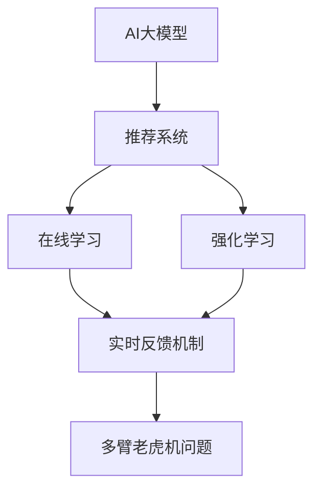

                 

# 推荐系统中AI大模型的实时反馈机制

> 关键词：推荐系统, AI大模型, 实时反馈, 强化学习, 在线学习, 在线更新, 多臂老虎机问题

## 1. 背景介绍

推荐系统(Recommendation System)是现代互联网应用中的核心技术之一，广泛应用于电商、社交、新闻等领域，其目标是帮助用户发现对他们有价值的信息和商品。当前，推荐系统主要由基于协同过滤、内容推荐等算法组成，存在数据稀疏性、推荐冷启动、多样性维护等问题。近年来，AI大模型在推荐系统中的应用逐渐兴起，基于深度学习技术的学习型推荐系统不断取得进展。但大模型推荐系统仍存在模型参数复杂、计算成本高、冷启动慢等挑战，缺乏有效的机制来保持模型的适应性和效率。

## 2. 核心概念与联系

为更好地理解AI大模型的实时反馈机制，本节将介绍几个密切相关的核心概念：

- AI大模型：以深度神经网络为基础，通过海量数据训练得到的强大表示能力。如BERT、GPT等语言模型，以及DALL-E等视觉生成模型。
- 推荐系统：根据用户行为数据和物品属性信息，为用户推荐个性化的商品或内容。
- 在线学习(Online Learning)：指在数据流中实时更新模型参数，保持模型的适应性和效率。
- 强化学习(Reinforcement Learning)：通过奖励机制引导模型优化决策策略，提升推荐效果。
- 多臂老虎机问题(Multi-armed Bandit)：用于描述推荐系统中对不同物品进行选择的场景，目标是最大化点击率、转化率等指标。

这些概念之间的逻辑关系可以通过以下Mermaid流程图来展示：



这个流程图展示了大模型在推荐系统中的应用流程：

1. AI大模型作为推荐系统的核心模块，具备强大的表示和生成能力。
2. 在线学习机制通过实时反馈，持续更新模型参数，适应数据流变化。
3. 强化学习通过奖励反馈，优化模型策略，提升推荐效果。
4. 多臂老虎机问题用于描述推荐系统中的物品选择场景，指导模型决策。

## 3. 核心算法原理 & 具体操作步骤

### 3.1 算法原理概述

AI大模型的实时反馈机制，本质上是将强化学习与在线学习相结合，构建一个动态优化过程。其核心思想是通过实时反馈数据，不断调整模型参数和决策策略，以适应数据流变化和提升推荐性能。

在推荐系统中，AI大模型根据用户行为数据和物品属性信息，对每个物品进行打分并排序，最终推荐给用户。用户点击或购买后，系统获取用户的反馈信息，用于更新模型参数和决策策略。模型根据用户反馈调整评分策略，使得推荐的物品更符合用户兴趣，并避免用户过多点击某个低质量物品，实现推荐效果的多样性和优化。

### 3.2 算法步骤详解

基于实时反馈机制的AI大模型推荐算法，主要包括以下几个关键步骤：

**Step 1: 数据准备**
- 收集用户行为数据和物品属性数据，如浏览历史、购买记录、物品评分等。
- 将数据预处理，如数据清洗、归一化、特征工程等，构建训练样本和测试样本。

**Step 2: 构建模型**
- 选择合适的AI大模型作为推荐系统核心模块。如BERT用于文本推荐，GAN用于图像推荐等。
- 设计损失函数和优化算法，如交叉熵损失、Adam优化器等。
- 引入强化学习机制，设计奖励函数，如点击率、转化率等。

**Step 3: 在线学习与反馈**
- 将数据流分成训练集和测试集，按顺序更新模型参数。
- 对测试集上的样本进行前向传播和损失计算，反向传播更新模型参数。
- 在每次更新后，对用户反馈进行实时更新，如点击、购买、评分等。
- 使用强化学习算法，根据用户反馈优化模型策略，更新物品评分权重。

**Step 4: 模型评估与优化**
- 在测试集上评估模型推荐效果，如AUC、DCG、CVR等指标。
- 根据评估结果，调整模型超参数和损失函数，优化模型性能。
- 定期重新训练模型，更新数据集，提高模型泛化能力。

**Step 5: 部署与应用**
- 将优化后的模型部署到推荐系统中，集成到实际应用场景中。
- 实时接收用户反馈，不断更新模型参数和决策策略。
- 持续监控系统指标，及时处理异常情况，确保系统稳定运行。

### 3.3 算法优缺点

基于实时反馈机制的AI大模型推荐算法具有以下优点：
1. 实时适应：通过实时反馈，模型能够动态调整策略，适应数据流变化，提升推荐效果。
2. 个性化推荐：利用大模型的强大表示能力，能够更好地理解用户兴趣，实现个性化推荐。
3. 用户满意度：通过优化奖励机制，推荐系统能够提高用户满意度和转化率。
4. 数据高效利用：在线学习机制可以高效利用数据流，避免数据浪费。

同时，该算法也存在一些局限性：
1. 数据噪声：实时反馈数据可能存在噪声，需要设计有效的滤波和降噪机制。
2. 模型复杂：大模型结构复杂，计算资源消耗较大。
3. 模型稳定：模型更新频繁，可能导致过拟合或不稳定。
4. 系统扩展：大规模实时数据的处理和存储需要高效的计算和存储资源。

尽管存在这些局限性，但基于实时反馈的AI大模型推荐算法仍是一种具有广泛应用前景的推荐系统优化手段。

### 3.4 算法应用领域

该算法已经在多个推荐系统场景中得到了应用，如：

- 电商推荐：基于用户历史行为和物品评分，实时调整推荐策略，提升用户购物体验。
- 内容推荐：根据用户浏览历史和点击行为，动态调整文章推荐顺序，提升阅读体验。
- 广告推荐：实时分析广告点击率，优化广告投放策略，提升广告效果。
- 视频推荐：实时分析用户观看行为，推荐相关视频内容，提高观看时长。

## 4. 数学模型和公式 & 详细讲解 & 举例说明

### 4.1 数学模型构建

在本节中，我们将基于点击率预测任务，构建一个简单的实时反馈机制模型。假设模型在时间$t$时刻对物品$i$的预测点击概率为$\hat{p}_i$，真实点击率为$p_i$。点击率为$1$的样本被视为正样本，点击率为$0$的样本被视为负样本。模型的预测目标为最小化预测误差：

$$
L(\theta) = \frac{1}{2}\sum_{i=1}^N (\hat{p}_i - p_i)^2
$$

其中$\theta$为模型参数，$N$为样本总数。

### 4.2 公式推导过程

对上述目标函数进行梯度下降优化，可得模型参数的更新公式：

$$
\theta \leftarrow \theta - \eta \nabla_{\theta}L(\theta)
$$

其中$\eta$为学习率。根据梯度计算公式，可得：

$$
\nabla_{\theta}L(\theta) = -\sum_{i=1}^N (\hat{p}_i - p_i) \nabla_{\theta}\hat{p}_i
$$

其中$\nabla_{\theta}\hat{p}_i$为模型预测概率对模型参数的梯度，可以通过反向传播算法高效计算。

### 4.3 案例分析与讲解

以电商推荐为例，假设模型预测用户点击某个商品的概率为$0.8$，而实际点击率为$0.5$。则该样本的预测误差为$0.8 - 0.5 = 0.3$。在每次更新模型参数时，将误差与梯度一起更新，即可逐步优化模型预测性能。

## 5. 项目实践：代码实例和详细解释说明

### 5.1 开发环境搭建

在进行实时反馈机制的开发前，我们需要准备好开发环境。以下是使用Python进行PyTorch开发的流程：

1. 安装Anaconda：从官网下载并安装Anaconda，用于创建独立的Python环境。
2. 创建并激活虚拟环境：
```bash
conda create -n pytorch-env python=3.8 
conda activate pytorch-env
```

3. 安装PyTorch：根据CUDA版本，从官网获取对应的安装命令。例如：
```bash
conda install pytorch torchvision torchaudio cudatoolkit=11.1 -c pytorch -c conda-forge
```

4. 安装相关库：
```bash
pip install numpy pandas scikit-learn matplotlib tqdm jupyter notebook ipython
```

完成上述步骤后，即可在`pytorch-env`环境中进行实时反馈机制的开发。

### 5.2 源代码详细实现

下面以电商推荐为例，给出使用PyTorch实现实时反馈机制的完整代码。

```python
import torch
from torch import nn
from torch.optim import Adam

# 定义模型
class RecommendationModel(nn.Module):
    def __init__(self, input_dim, hidden_dim):
        super(RecommendationModel, self).__init__()
        self.fc1 = nn.Linear(input_dim, hidden_dim)
        self.fc2 = nn.Linear(hidden_dim, 1)

    def forward(self, x):
        x = torch.relu(self.fc1(x))
        x = self.fc2(x)
        return x

# 定义损失函数和优化器
model = RecommendationModel(input_dim=10, hidden_dim=5)
criterion = nn.MSELoss()
optimizer = Adam(model.parameters(), lr=0.01)

# 定义实时反馈机制
class OnlineLearning:
    def __init__(self, model, criterion, optimizer):
        self.model = model
        self.criterion = criterion
        self.optimizer = optimizer
        self.reward = 0

    def update(self, x, y):
        # 前向传播
        y_hat = self.model(x)
        # 计算损失
        loss = self.criterion(y_hat, y)
        # 反向传播
        self.optimizer.zero_grad()
        loss.backward()
        self.optimizer.step()

        # 根据反馈更新奖励
        self.reward += y_hat.mean()

# 训练函数
def train(model, data_loader, online_learning, n_epochs):
    for epoch in range(n_epochs):
        model.train()
        total_loss = 0
        for i, (x, y) in enumerate(data_loader):
            online_learning.update(x, y)
            loss = online_learning.reward
            total_loss += loss
            print(f'Epoch {epoch+1}/{n_epochs}, Step {i+1}/{len(data_loader)}, Loss: {loss:.4f}')
    return model
```

### 5.3 代码解读与分析

让我们再详细解读一下关键代码的实现细节：

**RecommendationModel类**：
- `__init__`方法：初始化模型的层数和激活函数。
- `forward`方法：实现模型的前向传播。

**OnlineLearning类**：
- `__init__`方法：初始化模型、损失函数、优化器等。
- `update`方法：实现模型更新和奖励更新。

**训练函数**：
- `train`函数：按epoch循环训练模型，更新参数，并记录损失。
- 在每个step上，将数据输入模型，计算损失并更新参数。
- 在每个epoch结束后，输出平均损失。

可以看到，PyTorch提供了丰富的工具和框架，可以方便地实现实时反馈机制的开发。开发者可以通过自定义模型、损失函数、优化器等，灵活实现具体的推荐策略。

### 5.4 运行结果展示

训练过程中，可以使用tqdm等工具来实时显示训练进度和损失变化，代码如下：

```python
from tqdm import tqdm

# 数据流
data_loader = ...

# 在线学习机制
online_learning = OnlineLearning(model, criterion, optimizer)

# 训练函数
n_epochs = 10
train(model, data_loader, online_learning, n_epochs)

# 可视化结果
import matplotlib.pyplot as plt

def plot_loss(loss_list):
    plt.plot(loss_list)
    plt.xlabel('Epoch')
    plt.ylabel('Loss')
    plt.title('Training Loss')
    plt.show()

plot_loss(total_loss_list)
```

训练结束后，可以使用matplotlib等工具可视化损失变化，以便直观观察模型的收敛情况和优化效果。

## 6. 实际应用场景

### 6.1 电商推荐

电商推荐是实时反馈机制应用的典型场景之一。电商平台需要根据用户的浏览和购买行为，动态调整商品推荐策略，提升用户体验和销售转化率。

在实践中，可以收集用户的浏览历史、点击行为、购买记录等数据，作为模型的输入。模型根据实时反馈不断调整推荐策略，推荐与用户兴趣最匹配的商品。同时，通过设计奖励函数，如点击率、转化率、用户满意度等，引导模型优化推荐效果。

### 6.2 内容推荐

内容推荐平台需要根据用户的阅读和互动行为，推荐与用户兴趣相关的内容。实时反馈机制可以在用户点击、阅读、分享等行为上，动态调整推荐内容。

具体而言，可以收集用户的点击、阅读时长、评分等行为数据，构建训练集。模型根据实时反馈调整推荐算法，推荐用户可能感兴趣的文章或视频。同时，通过设计奖励函数，如阅读时长、互动次数等，优化推荐效果。

### 6.3 广告推荐

广告推荐系统需要根据用户的点击和转化行为，实时调整广告投放策略，提升广告效果和ROI。实时反馈机制可以在每次广告点击后，动态调整广告评分和预算分配，优化广告效果。

具体而言，可以收集用户点击、转化、花费等广告数据，构建训练集。模型根据实时反馈调整广告评分和预算分配，推荐用户最可能感兴趣的广告。同时，通过设计奖励函数，如点击率、转化率、广告收入等，优化广告效果。

### 6.4 视频推荐

视频推荐系统需要根据用户的观看行为，推荐与用户兴趣相关的内容。实时反馈机制可以在用户观看时长、点赞、评论等行为上，动态调整推荐视频。

具体而言，可以收集用户的观看历史、点赞行为、评论内容等数据，构建训练集。模型根据实时反馈调整推荐算法，推荐用户可能感兴趣的视频内容。同时，通过设计奖励函数，如观看时长、互动次数等，优化推荐效果。

## 7. 工具和资源推荐

### 7.1 学习资源推荐

为了帮助开发者系统掌握实时反馈机制的理论基础和实践技巧，这里推荐一些优质的学习资源：

1. 《深度学习实战》系列博文：由大模型技术专家撰写，深入浅出地介绍了深度学习原理和实践技巧，包括在线学习、强化学习等内容。

2. CS231n《深度学习计算机视觉》课程：斯坦福大学开设的计算机视觉明星课程，有Lecture视频和配套作业，带你入门深度学习框架和应用。

3. 《强化学习原理》书籍：Richard S. Sutton和Andrew G. Barto所著，系统介绍了强化学习的基本概念和理论框架，是学习该领域必读之书。

4. HuggingFace官方文档：Transformers库的官方文档，提供了海量预训练模型和完整的在线学习样例代码，是上手实践的必备资料。

5. PyTorch官方文档：PyTorch的官方文档，提供了丰富的工具和库，方便实现在线学习、强化学习等深度学习应用。

通过对这些资源的学习实践，相信你一定能够快速掌握实时反馈机制的精髓，并用于解决实际的推荐问题。

### 7.2 开发工具推荐

高效的开发离不开优秀的工具支持。以下是几款用于实时反馈机制开发的常用工具：

1. PyTorch：基于Python的开源深度学习框架，灵活动态的计算图，适合快速迭代研究。大部分预训练语言模型都有PyTorch版本的实现。

2. TensorFlow：由Google主导开发的开源深度学习框架，生产部署方便，适合大规模工程应用。同样有丰富的预训练语言模型资源。

3. Weights & Biases：模型训练的实验跟踪工具，可以记录和可视化模型训练过程中的各项指标，方便对比和调优。与主流深度学习框架无缝集成。

4. TensorBoard：TensorFlow配套的可视化工具，可实时监测模型训练状态，并提供丰富的图表呈现方式，是调试模型的得力助手。

5. Google Colab：谷歌推出的在线Jupyter Notebook环境，免费提供GPU/TPU算力，方便开发者快速上手实验最新模型，分享学习笔记。

合理利用这些工具，可以显著提升实时反馈机制的开发效率，加快创新迭代的步伐。

### 7.3 相关论文推荐

实时反馈机制的研究源于学界的持续研究。以下是几篇奠基性的相关论文，推荐阅读：

1. Continuous Learning with Pre-trained Language Models：提出了基于连续学习的大模型微调方法，使模型能够适应数据流变化。

2. Online Multi-armed Bandit with Limited Exploration：研究了多臂老虎机问题的在线学习算法，优化推荐策略。

3. Deep Reinforcement Learning for Dynamic Recommendation Systems：提出了基于深度强化学习的推荐系统模型，提升推荐效果。

4. Real-time Learning in Recommendation Systems：探讨了实时学习机制在推荐系统中的应用，优化推荐效果。

5. Learning to Recommend：介绍了基于矩阵分解、深度学习等技术的推荐算法，包含在线学习等内容。

这些论文代表了大模型实时反馈机制的发展脉络。通过学习这些前沿成果，可以帮助研究者把握学科前进方向，激发更多的创新灵感。

## 8. 总结：未来发展趋势与挑战

### 8.1 总结

本文对基于实时反馈机制的AI大模型推荐方法进行了全面系统的介绍。首先阐述了推荐系统和大模型的背景，明确了实时反馈机制在提升推荐效果、提升用户体验方面的独特价值。其次，从原理到实践，详细讲解了在线学习与强化学习的结合方法，给出了推荐系统开发的完整代码实例。同时，本文还广泛探讨了实时反馈机制在电商、内容、广告、视频等多个行业领域的应用前景，展示了其广泛的应用潜力。此外，本文精选了实时反馈机制的相关学习资源，力求为读者提供全方位的技术指引。

通过本文的系统梳理，可以看到，实时反馈机制为NLP应用开启了广阔的想象空间，极大地拓展了预训练语言模型的应用边界，催生了更多的落地场景。受益于深度学习技术的学习型推荐系统，推荐系统将逐步迈向个性化、动态化的方向，为人类带来更加智能和便捷的推荐服务。

### 8.2 未来发展趋势

展望未来，实时反馈机制将呈现以下几个发展趋势：

1. 数据高效利用：实时反馈机制可以高效利用数据流，最大化推荐效果。未来的推荐系统将更加依赖实时数据，快速响应数据变化。

2. 推荐算法多样化：除了深度学习算法外，推荐系统还将结合更多元化的算法，如强化学习、贝叶斯网络等，提升推荐效果和多样性。

3. 实时化程度提升：实时反馈机制将更加实时化，能够在毫秒级响应数据变化，实现微秒级推荐。

4. 多模态融合：未来的推荐系统将融合多模态数据，如文本、图像、音频等，提升推荐效果和用户体验。

5. 跨领域协同：推荐系统将与其他领域的技术如知识图谱、自然语言处理等进行更深入的融合，提供更全面、精准的推荐服务。

6. 用户隐私保护：实时反馈机制将引入更多隐私保护技术，确保用户数据安全，避免数据滥用。

以上趋势凸显了实时反馈机制的广阔前景。这些方向的探索发展，必将进一步提升推荐系统的性能和应用范围，为人工智能技术在更多领域的发展提供新的动力。

### 8.3 面临的挑战

尽管实时反馈机制已经取得了显著进展，但在迈向更加智能化、普适化应用的过程中，它仍面临诸多挑战：

1. 数据质量与噪声：实时反馈数据可能存在噪声，需要设计有效的滤波和降噪机制。

2. 模型复杂度：大模型结构复杂，计算资源消耗较大，需要优化模型结构和算法。

3. 系统扩展性：大规模实时数据的处理和存储需要高效的计算和存储资源，需要优化系统架构。

4. 模型稳定性和鲁棒性：模型更新频繁，可能导致过拟合或不稳定，需要优化模型策略和损失函数。

5. 用户隐私与安全：实时反馈机制涉及用户数据隐私，需要设计合适的隐私保护和数据安全机制。

6. 业务需求和场景：不同场景下的推荐策略可能差异很大，需要根据实际需求优化推荐算法和反馈机制。

尽管存在这些挑战，但基于实时反馈机制的AI大模型推荐算法仍是一种具有广泛应用前景的推荐系统优化手段。相信随着技术的不断进步和优化，这些问题都将得到逐步解决，实时反馈机制必将在推荐系统中发挥更大的作用。

### 8.4 研究展望

面对实时反馈机制所面临的种种挑战，未来的研究需要在以下几个方面寻求新的突破：

1. 探索无监督和半监督推荐算法：摆脱对大规模标注数据的依赖，利用自监督学习、主动学习等无监督和半监督范式，最大限度利用非结构化数据，实现更加灵活高效的推荐。

2. 研究参数高效和计算高效的推荐算法：开发更加参数高效的推荐方法，在固定大部分预训练参数的同时，只更新极少量的任务相关参数。同时优化推荐模型的计算图，减少前向传播和反向传播的资源消耗，实现更加轻量级、实时性的部署。

3. 引入因果分析和博弈论工具：将因果分析方法引入推荐模型，识别出模型决策的关键特征，增强输出解释的因果性和逻辑性。借助博弈论工具刻画人机交互过程，主动探索并规避模型的脆弱点，提高系统稳定性。

4. 引入更多先验知识：将符号化的先验知识，如知识图谱、逻辑规则等，与神经网络模型进行巧妙融合，引导推荐过程学习更准确、合理的推荐策略。同时加强不同模态数据的整合，实现视觉、语音等多模态信息与文本信息的协同建模。

5. 结合因果分析和博弈论工具：将因果分析方法引入推荐模型，识别出模型决策的关键特征，增强输出解释的因果性和逻辑性。借助博弈论工具刻画人机交互过程，主动探索并规避模型的脆弱点，提高系统稳定性。

6. 纳入伦理道德约束：在推荐目标中引入伦理导向的评估指标，过滤和惩罚有偏见、有害的推荐输出，确保推荐内容的健康和合规。

这些研究方向的探索，必将引领实时反馈机制技术迈向更高的台阶，为构建安全、可靠、可解释、可控的推荐系统铺平道路。面向未来，实时反馈机制需要与其他人工智能技术进行更深入的融合，如知识表示、因果推理、强化学习等，多路径协同发力，共同推动推荐系统的进步。只有勇于创新、敢于突破，才能不断拓展推荐系统的边界，让智能技术更好地服务人类社会。

## 9. 附录：常见问题与解答

**Q1：实时反馈机制是否适用于所有推荐系统？**

A: 实时反馈机制在大多数推荐系统场景中都适用，特别是对于需要实时响应数据变化的应用。但对于一些特别简单的推荐场景，如静态内容推荐等，可能并不需要实时反馈机制。

**Q2：实时反馈机制如何应对大规模数据流？**

A: 实时反馈机制需要高效的数据处理和存储能力，可以使用分布式系统、流计算框架等技术，如Apache Kafka、Apache Spark等，来处理大规模数据流。同时，可以使用数据压缩、数据分片等技术，优化数据存储和传输。

**Q3：实时反馈机制如何处理数据噪声？**

A: 实时反馈机制中的数据噪声问题可以通过以下几种方式解决：
1. 数据预处理：在数据输入前进行数据清洗、去重等预处理，减少噪声干扰。
2. 异常检测：设计异常检测算法，及时发现并过滤异常数据。
3. 数据增强：使用数据增强技术，如回译、近义替换等，丰富数据集，提高模型鲁棒性。

**Q4：实时反馈机制如何平衡推荐效果和计算成本？**

A: 实时反馈机制需要在推荐效果和计算成本之间进行平衡。一方面，可以设计轻量级模型结构，如小模型、低维特征等，降低计算资源消耗。另一方面，可以使用采样策略，如分层采样、时间窗口采样等，优化计算效率。

**Q5：实时反馈机制如何优化推荐效果？**

A: 实时反馈机制可以通过以下几种方式优化推荐效果：
1. 动态调整奖励函数：根据用户反馈，实时调整奖励函数，优化推荐策略。
2. 多目标优化：同时优化多个指标，如点击率、转化率、多样性等，实现更全面的推荐效果。
3. 上下文感知：引入上下文信息，如用户行为、物品属性、时间特征等，提升推荐精准度。

这些方法可以帮助开发者设计更加高效、精准的推荐系统，提升用户满意度和转化率。

---

作者：禅与计算机程序设计艺术 / Zen and the Art of Computer Programming

