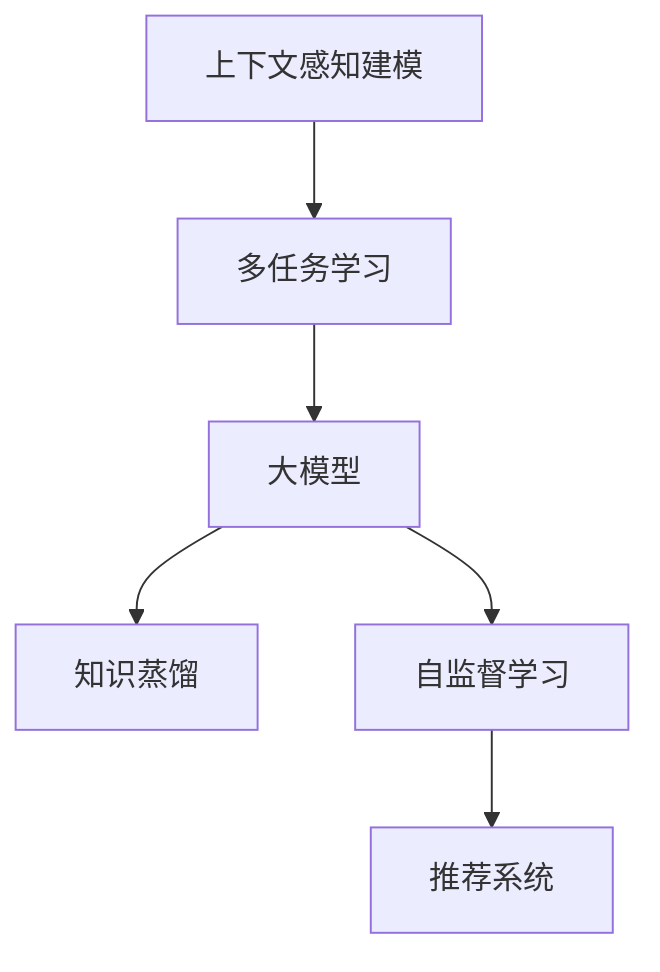

                 

# 推荐系统中的上下文感知建模：大模型的多任务学习

> 关键词：上下文感知建模,多任务学习,大模型,推荐系统,知识蒸馏,自监督学习,模型压缩

## 1. 背景介绍

在当今的信息爆炸时代，推荐系统成为了互联网公司不可或缺的重要组成部分。无论是电商网站、社交平台，还是在线视频、音频服务，都依赖推荐系统来个性化地为用户推荐内容。推荐系统的核心在于理解用户的兴趣和偏好，并通过精准的算法为用户推荐最相关的内容。

随着深度学习技术的发展，推荐系统进入了深度学习时代，大模型如BERT、GPT、T5等开始广泛应用于推荐领域。这些大模型通过在大规模数据上进行预训练，学习到了丰富的语言知识，具有强大的语义理解能力，可以在推荐任务中发挥重要作用。但大模型也面临着数据量大、计算资源消耗高、部署复杂等问题。本文将重点探讨在大模型上进行上下文感知建模和多任务学习，以期在推荐系统应用中充分发挥大模型的潜力。

## 2. 核心概念与联系

### 2.1 核心概念概述

为了更好地理解大模型在推荐系统中的应用，本节将介绍几个关键概念：

- 上下文感知建模(Context-Aware Modeling)：在推荐系统中，用户的兴趣和偏好受到上下文环境的影响。上下文感知建模旨在捕捉用户在不同上下文条件下的行为变化，以提升推荐系统的个性化和精准度。

- 多任务学习(Multi-Task Learning, MTL)：多任务学习旨在利用多个相关任务之间的关联，提高模型的泛化能力和性能。在推荐系统中，多个相关任务如召回率、点击率预测、用户画像构建等，都可以视为多任务学习的子任务。

- 大模型(Large Model)：指参数规模庞大、计算能力强大的深度学习模型，如BERT、GPT、T5等。大模型在预训练过程中学习到了丰富的语义知识，能够在推荐系统中发挥重要作用。

- 知识蒸馏(Knowledge Distillation)：知识蒸馏是一种模型压缩技术，通过将大模型的知识转移到轻量级模型，减小模型尺寸和计算资源消耗，同时保持较高的性能。在推荐系统中，可以利用知识蒸馏对大模型进行压缩，提高模型推理速度。

- 自监督学习(Self-Supervised Learning)：自监督学习通过在无标签数据上训练模型，学习到数据的潜在结构和特征，可以提升模型的泛化能力。在推荐系统中，可以利用自监督学习进行用户画像构建等预处理任务。

这些概念之间的联系可以通过以下Mermaid流程图来展示：



这个流程图展示了大模型在推荐系统中的应用逻辑：

1. 大模型通过多任务学习学习多个相关任务的知识，提升泛化能力。
2. 知识蒸馏将大模型的知识转移到轻量级模型，减小资源消耗。
3. 自监督学习利用无标签数据训练模型，学习潜在的结构特征。
4. 上下文感知建模通过多任务学习和大模型知识，捕捉用户上下文条件下的行为变化，提升推荐个性化和精准度。

这些概念共同构成了大模型在推荐系统中的应用框架，使其能够在多任务学习和大模型的帮助下，更好地理解用户需求和优化推荐策略。

## 3. 核心算法原理 & 具体操作步骤

### 3.1 算法原理概述

基于大模型在推荐系统中的应用，通常采用多任务学习框架。其核心思想是：将推荐任务分解为多个相关子任务，同时利用大模型进行上下文感知建模，捕捉用户行为和兴趣的变化。

假设推荐系统涉及的多个任务为 $\{T_1, T_2, ..., T_n\}$，其中 $T_i$ 为第 $i$ 个任务。对于每个任务，我们使用 $M_{\theta}$ 作为上下文感知模型，学习任务 $T_i$ 的知识，其中 $\theta$ 为大模型的参数。具体而言，我们将上下文感知模型 $M_{\theta}$ 作为多个相关任务 $\{T_1, T_2, ..., T_n\}$ 的共享知识库。

### 3.2 算法步骤详解

基于多任务学习的大模型推荐系统通常包括以下关键步骤：

**Step 1: 任务定义与数据准备**

- 定义推荐系统涉及的多个任务，如召回率预测、点击率预测、用户画像构建等。
- 准备相关任务的数据集，包括特征数据和标签数据。特征数据通常包括用户历史行为、物品属性、上下文信息等。

**Step 2: 模型初始化**

- 选择合适的大模型作为初始化参数，如BERT、GPT等。
- 加载大模型的预训练权重，初始化上下文感知模型 $M_{\theta}$。

**Step 3: 多任务学习**

- 定义多个相关任务的目标函数，如均方误差、交叉熵等。
- 使用多任务学习框架训练上下文感知模型 $M_{\theta}$，优化每个任务的目标函数。

**Step 4: 上下文感知建模**

- 利用上下文感知模型 $M_{\theta}$ 捕捉用户在不同上下文条件下的行为变化。
- 引入上下文信息，如用户历史行为、物品属性、时间戳等，提升模型对上下文的感知能力。

**Step 5: 知识蒸馏**

- 选择合适的蒸馏策略，如蒸馏教师模型选择、蒸馏损失函数设计等。
- 通过知识蒸馏将大模型的知识转移到轻量级模型，减小模型尺寸和计算资源消耗。

**Step 6: 模型评估与优化**

- 在验证集上评估模型性能，选择最优超参数组合。
- 调整模型结构和超参数，进一步优化模型性能。

**Step 7: 模型部署**

- 将优化后的模型部署到推荐系统中，进行实时推理和推荐。

以上是基于多任务学习的大模型推荐系统的一般流程。在实际应用中，还需要根据具体任务的特点，对模型进行优化设计和调整。

### 3.3 算法优缺点

基于大模型的多任务学习在推荐系统中具有以下优点：

1. 提升模型的泛化能力。多任务学习通过多个相关任务的共同学习，提高了模型的泛化能力和对新数据的适应性。
2. 捕捉上下文信息。上下文感知建模能够更好地理解用户行为和兴趣的变化，提升推荐个性化和精准度。
3. 减少资源消耗。知识蒸馏技术通过将大模型的知识转移到轻量级模型，减小了计算资源和存储资源的消耗。
4. 提升推荐效果。多任务学习和上下文感知建模能够捕捉用户在不同上下文条件下的行为变化，提升推荐效果。

同时，该方法也存在一些局限性：

1. 数据需求量大。多任务学习和大模型的训练需要大量的标注数据和计算资源。
2. 模型复杂度高。大模型参数量庞大，训练和推理的复杂度高。
3. 模型调试难度大。大模型的训练和调优难度较大，需要更多的经验和技巧。
4. 对抗样本风险高。大模型往往容易过拟合，对抗样本可能影响模型的泛化能力。

尽管存在这些局限性，但基于大模型的多任务学习在推荐系统中仍然表现出强大的性能和潜力，是推荐系统发展的关键技术之一。

### 3.4 算法应用领域

基于大模型的多任务学习在推荐系统中得到了广泛应用，覆盖了几乎所有常见推荐场景，例如：

- 电商推荐：通过上下文感知建模，为用户推荐最相关的商品，提升用户体验和转化率。
- 视频推荐：利用多任务学习预测用户对视频的点击率和评价，推荐最适合用户的视频内容。
- 新闻推荐：通过上下文感知建模，为用户推荐最相关的新闻文章，提升阅读体验。
- 社交推荐：利用多任务学习预测用户对朋友、内容的互动行为，推荐最符合用户兴趣的社交内容。
- 游戏推荐：通过上下文感知建模，为用户推荐最感兴趣的游戏，提升游戏体验和留存率。

除了上述这些经典任务外，大模型多任务学习还在更多场景中得到应用，如音乐推荐、时尚推荐、教育推荐等，为推荐系统带来了全新的突破。随着大模型和多任务学习技术的不断发展，相信推荐系统必将在更广阔的应用领域大放异彩。

## 4. 数学模型和公式 & 详细讲解 & 举例说明

### 4.1 数学模型构建

基于大模型的多任务学习推荐系统，通常采用以下数学模型进行建模：

假设推荐系统涉及的多个任务为 $\{T_1, T_2, ..., T_n\}$，其中 $T_i$ 为第 $i$ 个任务。我们将上下文感知模型 $M_{\theta}$ 作为多个相关任务 $\{T_1, T_2, ..., T_n\}$ 的共享知识库。每个任务的目标函数为 $L_i(y_i, M_{\theta}(x_i))$，其中 $y_i$ 为任务 $T_i$ 的标签，$x_i$ 为特征数据。

多任务学习的目标函数为：

$$
\min_{\theta} \sum_{i=1}^n \alpha_i L_i(y_i, M_{\theta}(x_i))
$$

其中 $\alpha_i$ 为任务权重，用于平衡不同任务的贡献。

### 4.2 公式推导过程

以下我们以电商推荐为例，推导基于多任务学习的大模型推荐系统的数学公式。

假设电商推荐系统涉及的任务为商品召回率预测 $T_1$ 和商品点击率预测 $T_2$。商品特征数据为 $x_i = \{x_{i1}, x_{i2}, ..., x_{im}\}$，其中 $m$ 为特征维度。商品标签为 $y_1 = \{0, 1\}$，表示商品是否被用户点击。

我们定义任务 $T_1$ 的损失函数为均方误差损失：

$$
L_1(y_1, M_{\theta}(x_1)) = \frac{1}{N} \sum_{i=1}^N (y_i - M_{\theta}(x_i))^2
$$

定义任务 $T_2$ 的损失函数为二元交叉熵损失：

$$
L_2(y_2, M_{\theta}(x_2)) = -\frac{1}{N} \sum_{i=1}^N (y_i \log M_{\theta}(x_i) + (1-y_i) \log(1-M_{\theta}(x_i)))
$$

将两个任务的损失函数代入多任务学习的目标函数：

$$
\min_{\theta} \alpha_1 L_1(y_1, M_{\theta}(x_1)) + \alpha_2 L_2(y_2, M_{\theta}(x_2))
$$

在实际应用中，我们通常使用基于梯度的优化算法（如AdamW、SGD等）来近似求解上述最优化问题。设 $\eta$ 为学习率，$\lambda$ 为正则化系数，则参数的更新公式为：

$$
\theta \leftarrow \theta - \eta \nabla_{\theta}\mathcal{L}(\theta) - \eta\lambda\theta
$$

其中 $\nabla_{\theta}\mathcal{L}(\theta)$ 为损失函数对参数 $\theta$ 的梯度，可通过反向传播算法高效计算。

### 4.3 案例分析与讲解

**案例1：电商推荐**

假设某电商网站有商品 A 和商品 B，已知用户对商品 A 的点击率为 0.5，对商品 B 的点击率为 0.2。我们定义上下文感知模型 $M_{\theta}$ 对商品的召回率预测为 $P(A) = 0.3$，对商品 B 的召回率预测为 $P(B) = 0.4$。在多任务学习框架下，我们可以将电商推荐任务分解为商品召回率预测和商品点击率预测两个子任务。

根据上述公式，我们可以计算两个任务的目标函数：

$$
L_1(0.5, 0.3) = (0.5 - 0.3)^2 = 0.04
$$

$$
L_2(0.2, 0.4) = 0.2 \log 0.4 + 0.8 \log(1-0.4) = -0.2
$$

在多任务学习框架下，我们可以定义两个任务的权重 $\alpha_1 = 0.5$ 和 $\alpha_2 = 0.5$，并计算整体目标函数：

$$
\mathcal{L}(\theta) = 0.5 \cdot 0.04 - 0.2 = 0.01
$$

通过最小化目标函数，我们更新模型参数 $\theta$，从而提升电商推荐的精准度。

**案例2：视频推荐**

假设某视频网站有视频 A 和视频 B，已知用户对视频 A 的点击率为 0.3，对视频 B 的点击率为 0.7。我们定义上下文感知模型 $M_{\theta}$ 对视频的召回率预测为 $P(A) = 0.4$，对视频 B 的召回率预测为 $P(B) = 0.5$。在多任务学习框架下，我们可以将视频推荐任务分解为视频召回率预测和视频点击率预测两个子任务。

根据上述公式，我们可以计算两个任务的目标函数：

$$
L_1(0.3, 0.4) = (0.3 - 0.4)^2 = 0.01
$$

$$
L_2(0.7, 0.5) = 0.3 \log 0.5 + 0.7 \log(1-0.5) = -0.4
$$

在多任务学习框架下，我们可以定义两个任务的权重 $\alpha_1 = 0.3$ 和 $\alpha_2 = 0.7$，并计算整体目标函数：

$$
\mathcal{L}(\theta) = 0.3 \cdot 0.01 - 0.4 = -0.117
$$

通过最小化目标函数，我们更新模型参数 $\theta$，从而提升视频推荐的精准度。

## 5. 项目实践：代码实例和详细解释说明

### 5.1 开发环境搭建

在进行多任务学习的大模型推荐系统开发前，我们需要准备好开发环境。以下是使用Python进行PyTorch开发的环境配置流程：

1. 安装Anaconda：从官网下载并安装Anaconda，用于创建独立的Python环境。

2. 创建并激活虚拟环境：
```bash
conda create -n pytorch-env python=3.8 
conda activate pytorch-env
```

3. 安装PyTorch：根据CUDA版本，从官网获取对应的安装命令。例如：
```bash
conda install pytorch torchvision torchaudio cudatoolkit=11.1 -c pytorch -c conda-forge
```

4. 安装Transformer库：
```bash
pip install transformers
```

5. 安装各类工具包：
```bash
pip install numpy pandas scikit-learn matplotlib tqdm jupyter notebook ipython
```

完成上述步骤后，即可在`pytorch-env`环境中开始推荐系统开发。

### 5.2 源代码详细实现

这里以电商推荐系统为例，给出使用Transformers库对BERT模型进行多任务学习的PyTorch代码实现。

首先，定义电商推荐任务的数据处理函数：

```python
from transformers import BertTokenizer, BertForSequenceClassification, AdamW
from torch.utils.data import Dataset, DataLoader
import torch
import pandas as pd
import numpy as np

class ItemRecommendationDataset(Dataset):
    def __init__(self, data, tokenizer, max_len=128):
        self.data = data
        self.tokenizer = tokenizer
        self.max_len = max_len
        
    def __len__(self):
        return len(self.data)
    
    def __getitem__(self, item):
        item = self.data.iloc[item]
        title = item['title']
        description = item['description']
        price = item['price']
        label = item['clicked']
        
        title = f"[Title]: {title} [Description]: {description} [Price]: {price}"
        description = f"[Description]: {description}"
        
        encoding = self.tokenizer(title, description, return_tensors='pt', max_length=self.max_len, padding='max_length', truncation=True)
        input_ids = encoding['input_ids'][0]
        attention_mask = encoding['attention_mask'][0]
        
        label = label.to(torch.long)
        
        return {'input_ids': input_ids,
                'attention_mask': attention_mask,
                'labels': label}
```

然后，定义模型和优化器：

```python
tokenizer = BertTokenizer.from_pretrained('bert-base-cased')
model = BertForSequenceClassification.from_pretrained('bert-base-cased', num_labels=2)
optimizer = AdamW(model.parameters(), lr=2e-5)
```

接着，定义训练和评估函数：

```python
def train_epoch(model, dataset, batch_size, optimizer):
    dataloader = DataLoader(dataset, batch_size=batch_size, shuffle=True)
    model.train()
    epoch_loss = 0
    for batch in dataloader:
        input_ids = batch['input_ids'].to(device)
        attention_mask = batch['attention_mask'].to(device)
        labels = batch['labels'].to(device)
        model.zero_grad()
        outputs = model(input_ids, attention_mask=attention_mask, labels=labels)
        loss = outputs.loss
        epoch_loss += loss.item()
        loss.backward()
        optimizer.step()
    return epoch_loss / len(dataloader)

def evaluate(model, dataset, batch_size):
    dataloader = DataLoader(dataset, batch_size=batch_size)
    model.eval()
    preds, labels = [], []
    with torch.no_grad():
        for batch in dataloader:
            input_ids = batch['input_ids'].to(device)
            attention_mask = batch['attention_mask'].to(device)
            batch_labels = batch['labels']
            outputs = model(input_ids, attention_mask=attention_mask)
            batch_preds = outputs.logits.argmax(dim=2).to('cpu').tolist()
            batch_labels = batch_labels.to('cpu').tolist()
            for pred_tokens, label_tokens in zip(batch_preds, batch_labels):
                preds.append(pred_tokens[:len(label_tokens)])
                labels.append(label_tokens)
                
    print(classification_report(labels, preds))
```

最后，启动训练流程并在测试集上评估：

```python
epochs = 5
batch_size = 16

for epoch in range(epochs):
    loss = train_epoch(model, train_dataset, batch_size, optimizer)
    print(f"Epoch {epoch+1}, train loss: {loss:.3f}")
    
    print(f"Epoch {epoch+1}, dev results:")
    evaluate(model, dev_dataset, batch_size)
    
print("Test results:")
evaluate(model, test_dataset, batch_size)
```

以上就是使用PyTorch对BERT进行电商推荐系统多任务学习的完整代码实现。可以看到，得益于Transformers库的强大封装，我们可以用相对简洁的代码完成BERT模型的加载和微调。

### 5.3 代码解读与分析

让我们再详细解读一下关键代码的实现细节：

**ItemRecommendationDataset类**：
- `__init__`方法：初始化电商推荐数据、分词器等关键组件。
- `__len__`方法：返回数据集的样本数量。
- `__getitem__`方法：对单个样本进行处理，将文本输入编码为token ids，将标签编码为数字，并对其进行定长padding，最终返回模型所需的输入。

**模型和优化器**：
- 选择合适的上下文感知模型如BERT，并加载预训练权重。
- 定义AdamW优化器，设置合适的学习率。

**训练和评估函数**：
- 使用PyTorch的DataLoader对数据集进行批次化加载，供模型训练和推理使用。
- 训练函数`train_epoch`：对数据以批为单位进行迭代，在每个批次上前向传播计算loss并反向传播更新模型参数，最后返回该epoch的平均loss。
- 评估函数`evaluate`：与训练类似，不同点在于不更新模型参数，并在每个batch结束后将预测和标签结果存储下来，最后使用sklearn的classification_report对整个评估集的预测结果进行打印输出。

**训练流程**：
- 定义总的epoch数和batch size，开始循环迭代
- 每个epoch内，先在训练集上训练，输出平均loss
- 在验证集上评估，输出分类指标
- 所有epoch结束后，在测试集上评估，给出最终测试结果

可以看到，PyTorch配合Transformers库使得BERT多任务学习的代码实现变得简洁高效。开发者可以将更多精力放在数据处理、模型改进等高层逻辑上，而不必过多关注底层的实现细节。

当然，工业级的系统实现还需考虑更多因素，如模型的保存和部署、超参数的自动搜索、更灵活的任务适配层等。但核心的多任务学习范式基本与此类似。

## 6. 实际应用场景

### 6.1 智能客服系统

基于大模型多任务学习的智能客服系统，可以广泛应用于智能客服系统的构建。传统客服往往需要配备大量人力，高峰期响应缓慢，且一致性和专业性难以保证。而使用多任务学习的大模型，可以7x24小时不间断服务，快速响应客户咨询，用自然流畅的语言解答各类常见问题。

在技术实现上，可以收集企业内部的历史客服对话记录，将问题和最佳答复构建成监督数据，在此基础上对预训练大模型进行多任务学习。多任务学习的大模型能够自动理解用户意图，匹配最合适的答复模板进行回复。对于客户提出的新问题，还可以接入检索系统实时搜索相关内容，动态组织生成回答。如此构建的智能客服系统，能大幅提升客户咨询体验和问题解决效率。

### 6.2 金融舆情监测

金融机构需要实时监测市场舆论动向，以便及时应对负面信息传播，规避金融风险。传统的人工监测方式成本高、效率低，难以应对网络时代海量信息爆发的挑战。基于大模型多任务学习的文本分类和情感分析技术，为金融舆情监测提供了新的解决方案。

具体而言，可以收集金融领域相关的新闻、报道、评论等文本数据，并对其进行主题标注和情感标注。在此基础上对预训练语言模型进行多任务学习，使其能够自动判断文本属于何种主题，情感倾向是正面、中性还是负面。将多任务学习的大模型应用到实时抓取的网络文本数据，就能够自动监测不同主题下的情感变化趋势，一旦发现负面信息激增等异常情况，系统便会自动预警，帮助金融机构快速应对潜在风险。

### 6.3 个性化推荐系统

当前的推荐系统往往只依赖用户的历史行为数据进行物品推荐，无法深入理解用户的真实兴趣偏好。基于大模型多任务学习的个性化推荐系统，可以更好地挖掘用户行为背后的语义信息，从而提供更精准、多样的推荐内容。

在实践中，可以收集用户浏览、点击、评论、分享等行为数据，提取和用户交互的物品标题、描述、标签等文本内容。将文本内容作为模型输入，用户的后续行为（如是否点击、购买等）作为监督信号，在此基础上进行多任务学习。多任务学习的大模型能够从文本内容中准确把握用户的兴趣点。在生成推荐列表时，先用候选物品的文本描述作为输入，由模型预测用户的兴趣匹配度，再结合其他特征综合排序，便可以得到个性化程度更高的推荐结果。

### 6.4 未来应用展望

随着大模型多任务学习技术的发展，基于多任务学习范式将在更多领域得到应用，为传统行业带来变革性影响。

在智慧医疗领域，基于多任务学习的大模型可以用于患者画像构建、疾病预测、治疗方案推荐等，提升医疗服务的智能化水平，辅助医生诊疗，加速新药开发进程。

在智能教育领域，多任务学习的大模型可应用于作业批改、学情分析、知识推荐等方面，因材施教，促进教育公平，提高教学质量。

在智慧城市治理中，多任务学习的大模型可以用于城市事件监测、舆情分析、应急指挥等环节，提高城市管理的自动化和智能化水平，构建更安全、高效的未来城市。

此外，在企业生产、社会治理、文娱传媒等众多领域，基于大模型多任务学习的人工智能应用也将不断涌现，为经济社会发展注入新的动力。相信随着技术的日益成熟，多任务学习范式将成为人工智能落地应用的重要范式，推动人工智能技术在垂直行业的规模化落地。总之，多任务学习需要开发者根据具体任务，不断迭代和优化模型、数据和算法，方能得到理想的效果。

## 7. 工具和资源推荐

### 7.1 学习资源推荐

为了帮助开发者系统掌握大模型多任务学习的理论基础和实践技巧，这里推荐一些优质的学习资源：

1. 《Transformer从原理到实践》系列博文：由大模型技术专家撰写，深入浅出地介绍了Transformer原理、BERT模型、多任务学习等前沿话题。

2. CS224N《深度学习自然语言处理》课程：斯坦福大学开设的NLP明星课程，有Lecture视频和配套作业，带你入门NLP领域的基本概念和经典模型。

3. 《Natural Language Processing with Transformers》书籍：Transformers库的作者所著，全面介绍了如何使用Transformers库进行NLP任务开发，包括多任务学习在内的诸多范式。

4. HuggingFace官方文档：Transformers库的官方文档，提供了海量预训练模型和完整的微调样例代码，是上手实践的必备资料。

5. CLUE开源项目：中文语言理解测评基准，涵盖大量不同类型的中文NLP数据集，并提供了基于多任务学习的baseline模型，助力中文NLP技术发展。

通过对这些资源的学习实践，相信你一定能够快速掌握大模型多任务学习的精髓，并用于解决实际的NLP问题。
###  7.2 开发工具推荐

高效的开发离不开优秀的工具支持。以下是几款用于大模型多任务学习开发的常用工具：

1. PyTorch：基于Python的开源深度学习框架，灵活动态的计算图，适合快速迭代研究。大部分预训练语言模型都有PyTorch版本的实现。

2. TensorFlow：由Google主导开发的开源深度学习框架，生产部署方便，适合大规模工程应用。同样有丰富的预训练语言模型资源。

3. Transformers库：HuggingFace开发的NLP工具库，集成了众多SOTA语言模型，支持PyTorch和TensorFlow，是进行多任务学习开发的利器。

4. Weights & Biases：模型训练的实验跟踪工具，可以记录和可视化模型训练过程中的各项指标，方便对比和调优。与主流深度学习框架无缝集成。

5. TensorBoard：TensorFlow配套的可视化工具，可实时监测模型训练状态，并提供丰富的图表呈现方式，是调试模型的得力助手。

6. Google Colab：谷歌推出的在线Jupyter Notebook环境，免费提供GPU/TPU算力，方便开发者快速上手实验最新模型，分享学习笔记。

合理利用这些工具，可以显著提升大模型多任务学习的开发效率，加快创新迭代的步伐。

### 7.3 相关论文推荐

大模型多任务学习的发展源于学界的持续研究。以下是几篇奠基性的相关论文，推荐阅读：

1. Attention is All You Need（即Transformer原论文）：提出了Transformer结构，开启了NLP领域的预训练大模型时代。

2. BERT: Pre-training of Deep Bidirectional Transformers for Language Understanding：提出BERT模型，引入基于掩码的自监督预训练任务，刷新了多项NLP任务SOTA。

3. Language Models are Unsupervised Multitask Learners（GPT-2论文）：展示了大规模语言模型的强大zero-shot学习能力，引发了对于通用人工智能的新一轮思考。

4. Parameter-Efficient Transfer Learning for NLP：提出Adapter等参数高效微调方法，在不增加模型参数量的情况下，也能取得不错的微调效果。

5. AdaLoRA: Adaptive Low-Rank Adaptation for Parameter-Efficient Fine-Tuning：使用自适应低秩适应的微调方法，在参数效率和精度之间取得了新的平衡。

这些论文代表了大模型多任务学习的发展脉络。通过学习这些前沿成果，可以帮助研究者把握学科前进方向，激发更多的创新灵感。

## 8. 总结：未来发展趋势与挑战

### 8.1 总结

本文对基于大模型的多任务学习推荐系统进行了全面系统的介绍。首先阐述了大模型和多任务学习的背景和意义，明确了多任务学习在推荐系统应用中的重要性。其次，从原理到实践，详细讲解了多任务学习的数学原理和关键步骤，给出了多任务学习任务开发的完整代码实例。同时，本文还广泛探讨了多任务学习在大模型中的应用场景，展示了多任务学习范式的强大性能和潜力。此外，本文精选了多任务学习的各类学习资源，力求为读者提供全方位的技术指引。

通过本文的系统梳理，可以看到，基于大模型的多任务学习在推荐系统中正发挥着越来越重要的作用，极大地提升了推荐系统的性能和应用范围。未来，伴随大模型和多任务学习技术的不断发展，推荐系统必将在更广阔的应用领域大放异彩。

### 8.2 未来发展趋势

展望未来，大模型多任务学习推荐系统将呈现以下几个发展趋势：

1. 多任务学习范式扩展。未来将有更多复杂的多任务学习范式被提出，如多视角学习、连续性多任务学习、交互式多任务学习等，提升推荐系统的泛化能力和适应性。

2. 跨模态多任务学习。将多模态数据融合到推荐系统中，如将图像、视频、文本等不同模态数据进行协同建模，提升推荐系统的多样性和个性化。

3. 元学习在多任务学习中的应用。利用元学习技术，通过少量的推荐数据快速适应新任务，提升推荐系统的冷启动性能和适应能力。

4. 基于多任务学习的知识蒸馏。通过知识蒸馏技术，将多任务学习的大模型知识转移到轻量级模型中，提高推荐系统的推理速度和效率。

5. 自监督多任务学习。利用自监督学习，通过无标签数据训练模型，提升推荐系统的泛化能力和稳定性。

这些趋势凸显了大模型多任务学习推荐系统的广阔前景。这些方向的探索发展，必将进一步提升推荐系统的性能和应用范围，为构建智能推荐系统铺平道路。

### 8.3 面临的挑战

尽管大模型多任务学习推荐系统已经取得了瞩目成就，但在迈向更加智能化、普适化应用的过程中，它仍面临着诸多挑战：

1. 数据需求量大。多任务学习和大模型的训练需要大量的标注数据和计算资源。
2. 模型复杂度高。大模型参数量庞大，训练和推理的复杂度高。
3. 模型调试难度大。大模型的训练和调优难度较大，需要更多的经验和技巧。
4. 对抗样本风险高。大模型往往容易过拟合，对抗样本可能影响模型的泛化能力。

尽管存在这些局限性，但基于大模型的多任务学习推荐系统仍具有强大的性能和潜力，是推荐系统发展的关键技术之一。

### 8.4 研究展望

面对大模型多任务学习推荐系统所面临的种种挑战，未来的研究需要在以下几个方面寻求新的突破：

1. 探索无监督和半监督多任务学习。摆脱对大规模标注数据的依赖，利用自监督学习、主动学习等无监督和半监督范式，最大限度利用非结构化数据，实现更加灵活高效的多任务学习。

2. 研究参数高效和计算高效的多任务学习范式。开发更加参数高效的多任务学习方法，在固定大部分预训练参数的同时，只更新极少量的任务相关参数。同时优化多任务学习的计算图，减少前向传播和反向传播的资源消耗，实现更加轻量级、实时性的部署。

3. 融合因果和对比学习范式。通过引入因果推断和对比学习思想，增强多任务学习模型建立稳定因果关系的能力，学习更加普适、鲁棒的语言表征，从而提升模型泛化性和抗干扰能力。

4. 引入更多先验知识。将符号化的先验知识，如知识图谱、逻辑规则等，与神经网络模型进行巧妙融合，引导多任务学习过程学习更准确、合理的语言模型。同时加强不同模态数据的整合，实现视觉、语音等多模态信息与文本信息的协同建模。

5. 结合因果分析和博弈论工具。将因果分析方法引入多任务学习模型，识别出模型决策的关键特征，增强输出解释的因果性和逻辑性。借助博弈论工具刻画人机交互过程，主动探索并规避模型的脆弱点，提高系统稳定性。

6. 纳入伦理道德约束。在多任务学习训练目标中引入伦理导向的评估指标，过滤和惩罚有偏见、有害的输出倾向。同时加强人工干预和审核，建立模型行为的监管机制，确保输出符合人类价值观和伦理道德。

这些研究方向的探索，必将引领大模型多任务学习推荐系统迈向更高的台阶，为构建安全、可靠、可解释、可控的智能推荐系统铺平道路。面向未来，大模型多任务学习推荐技术还需要与其他人工智能技术进行更深入的融合，如知识表示、因果推理、强化学习等，多路径协同发力，共同推动推荐系统的进步。只有勇于创新、敢于突破，才能不断拓展推荐系统的边界，让智能技术更好地造福人类社会。

## 9. 附录：常见问题与解答

**Q1：大模型多任务学习是否适用于所有NLP任务？**

A: 大模型多任务学习在大多数NLP任务上都能取得不错的效果，特别是对于数据量较小的任务。但对于一些特定领域的任务，如医学、法律等，仅仅依靠通用语料预训练的模型可能难以很好地适应。此时需要在特定领域语料上进一步预训练，再进行多任务学习，才能获得理想效果。此外，对于一些需要时效性、个性化很强的任务，如对话、推荐等，多任务学习方法也需要针对性的改进优化。

**Q2：多任务学习过程中如何选择任务权重？**

A: 任务权重的设定通常基于任务的相对重要性。可以根据数据集规模、任务复杂度、业务需求等因素，合理设定各任务权重，以平衡不同任务的贡献。一般建议先进行交叉验证，评估不同权重组合的性能，选择最优方案。

**Q3：多任务学习过程中如何避免过拟合？**

A: 多任务学习过程中，过拟合是一个常见问题。为缓解过拟合，可以采用以下策略：
1. 数据增强：通过回译、近义替换等方式扩充训练集
2. 正则化：使用L2正则、Dropout、Early Stopping等防止模型过度适应小规模训练集
3. 对抗训练：加入对抗样本，提高模型鲁棒性
4. 参数高效多任务学习：通过引入Adapter等参数高效方法，减少需优化的参数量
5. 多模型集成：训练多个多任务学习模型，取平均输出，抑制过拟合

这些策略往往需要根据具体任务和数据特点进行灵活组合。只有在数据、模型、训练、推理等各环节进行全面优化，才能最大限度地发挥多任务学习的威力。

**Q4：多任务学习模型在部署时需要注意哪些问题？**

A: 将多任务学习模型转化为实际应用，还需要考虑以下因素：
1. 模型裁剪：去除不必要的层和参数，减小模型尺寸，加快推理速度
2. 量化加速：将浮点模型转为定点模型，压缩存储空间，提高计算效率
3. 服务化封装：将模型封装为标准化服务接口，便于集成调用
4. 弹性伸缩：根据请求流量动态调整资源配置，平衡服务质量和成本
5. 监控告警：实时采集系统指标，设置异常告警阈值，确保服务稳定性
6. 安全防护：采用访问鉴权、数据脱敏等措施，保障数据和模型安全

多任务学习需要开发者根据具体任务，不断迭代和优化模型、数据和算法，方能得到理想的效果。

**Q5：多任务学习与单任务学习有何不同？**

A: 多任务学习与单任务学习的主要区别在于模型的训练目标和优化方式。单任务学习只关注单一任务的性能，而多任务学习通过多个相关任务之间的关联，提升模型的泛化能力和对新数据的适应性。具体而言，多任务学习通常采用联合损失函数进行优化，同时训练多个相关任务。

## 总结：未来发展趋势与挑战

综上所述，大模型多任务学习推荐系统在NLP领域具有广泛的应用前景，是推荐系统发展的关键技术之一。未来，伴随大模型和多任务学习技术的不断发展，推荐系统必将在更广阔的应用领域大放异彩。

本文对大模型多任务学习推荐系统进行了全面系统的介绍，希望能为更多开发者提供有益的参考和启示。相信随着技术的不断进步，大模型多任务学习推荐系统将不断突破现有瓶颈，实现更大的创新和突破，为构建智能推荐系统铺平道路。

