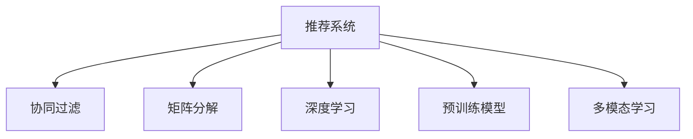

                 

# 推荐系统中的冷启动问题：AI大模型解决方案

> 关键词：推荐系统,冷启动,AI大模型,用户画像,内容特征,协同过滤,神经网络,预训练模型

## 1. 背景介绍

### 1.1 问题由来
推荐系统在电商、视频、音乐、新闻等许多领域得到广泛应用。其目标是通过分析用户行为数据，推荐用户可能感兴趣的内容，从而提升用户体验、增加用户粘性、提高转化率等。传统的推荐系统多依赖于用户历史行为数据，通过协同过滤、矩阵分解等方法构建用户画像、计算内容相似度，进而推荐相似的内容。然而，在用户新注册或没有足够历史数据时，推荐系统面临冷启动问题，无法为用户推荐符合其兴趣的内容，推荐效果大打折扣。

### 1.2 问题核心关键点
冷启动问题是指在新用户加入推荐系统时，由于缺乏历史行为数据，推荐系统难以生成有效的用户画像，从而无法提供个性化的推荐。该问题在推荐系统中非常普遍，尤其是在新电商平台上，新注册用户往往占比很大，冷启动问题的解决直接关系到平台的用户留存率、转化率等关键指标。

解决冷启动问题的方法多种多样，如通过人工标注、社交网络信息、内容属性信息等辅助数据构建用户画像，提升推荐系统的初始推荐质量。然而这些方法要么成本高昂，要么准确度有限。近年来，基于大模型的推荐方法逐渐兴起，通过利用大规模预训练语言模型的通用语言知识，实现更加精准的冷启动推荐。

## 2. 核心概念与联系

### 2.1 核心概念概述

为更好地理解大模型在推荐系统中的应用，本节将介绍几个核心概念：

- **推荐系统(Recommender System)**：基于用户历史行为数据，推荐可能感兴趣的内容的系统。推荐系统的核心目标是通过个性化推荐提升用户体验。
- **冷启动问题(Cold Start Problem)**：在新用户加入推荐系统时，由于缺乏历史行为数据，难以为其提供个性化推荐。
- **协同过滤(Collaborative Filtering)**：利用用户和物品之间的协同行为，推荐相似物品的系统。分为基于用户的协同过滤和基于物品的协同过滤。
- **矩阵分解(Matrix Factorization)**：将用户-物品评分矩阵分解为两个低维矩阵，学习用户和物品的潜在因子，进行推荐。
- **深度学习(Deep Learning)**：利用多层神经网络，从数据中自动学习特征表示，提升推荐效果。
- **预训练模型(Pre-trained Model)**：在无标签数据上进行预训练，学习通用语言知识，如BERT、GPT等。
- **多模态学习(Multimodal Learning)**：利用视觉、文本、语音等多种模态的信息，提升推荐系统的效果。

这些核心概念之间的逻辑关系可以通过以下Mermaid流程图来展示：



这个流程图展示了大模型在推荐系统中的应用路径：

1. 推荐系统通过协同过滤、矩阵分解等方法构建用户画像和物品相似度矩阵。
2. 深度学习方法引入神经网络，自动学习更复杂的特征表示。
3. 预训练模型通过无标签数据预训练，学习通用语言知识。
4. 多模态学习融合视觉、文本、语音等多种模态数据，提升推荐质量。

## 3. 核心算法原理 & 具体操作步骤
### 3.1 算法原理概述

基于大模型的推荐系统，本质上是通过预训练语言模型，在无标签数据上学习通用语言知识，应用于推荐系统的新用户或物品，实现更精准的冷启动推荐。具体步骤如下：

1. **预训练模型加载**：选择合适的大模型(如BERT、GPT等)，作为推荐系统的核心引擎。
2. **用户画像生成**：将新用户的信息（如年龄、性别、兴趣标签等）输入预训练模型，生成用户编码向量。
3. **物品特征表示**：对于推荐系统中的物品（如商品、文章等），提取其标题、描述等文本信息，输入预训练模型生成物品编码向量。
4. **相似度计算**：计算用户编码向量和物品编码向量之间的相似度，选出最相似的物品进行推荐。
5. **多模态融合**：根据实际需求，将用户画像、物品特征等与视觉、音频等数据进行融合，提升推荐效果。

### 3.2 算法步骤详解

以电商推荐系统为例，详细介绍基于大模型的冷启动推荐流程：

**Step 1: 预训练模型加载**
- 加载预训练好的BERT模型，作为推荐系统的核心引擎。
- 初始化用户画像生成器和物品特征提取器，将用户信息和物品信息分别输入模型，获得用户编码和物品编码。

**Step 2: 用户画像生成**
- 收集新用户的属性信息，如年龄、性别、浏览记录等。
- 将属性信息转换为标准向量，作为输入，进入BERT模型，得到用户编码向量。
- 用户编码向量可用于与物品编码向量计算相似度。

**Step 3: 物品特征提取**
- 提取推荐系统中的商品描述、图片等信息，作为物品特征。
- 将物品特征转换为标准向量，输入BERT模型，得到物品编码向量。
- 物品编码向量可用于与用户编码向量计算相似度。

**Step 4: 相似度计算**
- 计算用户编码向量和物品编码向量之间的余弦相似度，选出与用户最相似的物品。
- 根据相似度对物品进行排序，返回推荐列表。

**Step 5: 多模态融合**
- 根据推荐系统的具体需求，收集用户图片、视频等视觉信息，与文本特征进行融合。
- 将多模态信息与用户编码、物品编码一起输入模型，重新计算相似度，提升推荐效果。

### 3.3 算法优缺点

基于大模型的推荐系统有以下优点：

1. **通用性强**：预训练模型在大量文本数据上学习到的语言知识，可以应用于不同类型的推荐系统，提升推荐效果。
2. **易于扩展**：新物品、新特征等信息可以方便地加入模型中，实现快速迭代。
3. **效果好**：预训练模型通过大规模语料学习，具备较强的泛化能力，提升推荐准确度。

同时，该方法也存在一定的局限性：

1. **计算成本高**：大模型的计算资源需求较大，尤其在多模态融合时，需要同时处理大量数据，计算开销较大。
2. **数据隐私问题**：用户画像、物品特征等需要一定量的敏感数据，如何保护用户隐私是一个重要问题。
3. **实时性不足**：基于大模型的推荐系统需要大量计算，难以做到实时推荐。

### 3.4 算法应用领域

基于大模型的推荐系统在电商、视频、音乐等多个领域已经得到了广泛应用，以下是几个典型案例：

- **电商平台推荐**：通过用户画像和物品特征，为电商新用户推荐可能感兴趣的商品，提升用户粘性和购买率。
- **视频推荐**：通过用户兴趣和视频标签，为用户推荐可能感兴趣的视频内容，提升用户观看体验。
- **音乐推荐**：通过用户听歌历史和歌曲标签，为用户推荐可能喜欢的音乐，提升平台的用户留存率。
- **新闻推荐**：通过用户阅读历史和文章标签，为用户推荐相关新闻内容，提升用户浏览量。

这些领域的大模型推荐系统，均通过预训练模型学习通用语言知识，应用于具体任务中，实现了更好的推荐效果。

## 4. 数学模型和公式 & 详细讲解 & 举例说明

### 4.1 数学模型构建

本节将使用数学语言对基于大模型的推荐系统进行更加严格的刻画。

假设预训练语言模型为 $M_{\theta}$，其中 $\theta$ 为预训练得到的模型参数。假设推荐系统中有 $N$ 个用户 $u_1, u_2, ..., u_N$ 和 $M$ 个物品 $i_1, i_2, ..., i_M$。对于每个用户 $u_j$，有 $n_j$ 条历史行为数据，对于每个物品 $i_k$，有 $m_k$ 条历史行为数据。

定义用户-物品评分矩阵为 $R \in \mathbb{R}^{N \times M}$，其中 $R_{u_j,i_k}$ 表示用户 $u_j$ 对物品 $i_k$ 的评分。

定义用户编码向量为 $u_j = M_{\theta}(x_j)$，其中 $x_j$ 为 $u_j$ 的输入特征向量。

定义物品编码向量为 $i_k = M_{\theta}(y_k)$，其中 $y_k$ 为 $i_k$ 的输入特征向量。

定义用户-物品评分矩阵为 $R_{u_j,i_k} = \langle u_j, i_k \rangle$，其中 $\langle \cdot, \cdot \rangle$ 表示向量内积。

基于大模型的推荐系统的数学模型可以表示为：

$$
R_{u_j,i_k} = f(u_j, i_k) = \langle M_{\theta}(x_j), M_{\theta}(y_k) \rangle
$$

其中 $f(u_j, i_k)$ 为评分函数。

### 4.2 公式推导过程

以下我们以二分类任务为例，推导评分函数的计算公式。

假设用户 $u_j$ 对物品 $i_k$ 的评分 $R_{u_j,i_k}$ 为二元变量，记为 $R_{u_j,i_k} \in \{0,1\}$，其中 $R_{u_j,i_k}=1$ 表示用户 $u_j$ 对物品 $i_k$ 评分 $1$，$R_{u_j,i_k}=0$ 表示用户 $u_j$ 对物品 $i_k$ 评分 $0$。

定义用户编码向量为 $u_j = M_{\theta}(x_j) \in \mathbb{R}^d$，物品编码向量为 $i_k = M_{\theta}(y_k) \in \mathbb{R}^d$。

用户对物品的评分可以表示为：

$$
R_{u_j,i_k} = \sigma(\langle u_j, i_k \rangle) = \sigma(\sum_{k=1}^d u_j[k] \cdot i_k[k])
$$

其中 $\sigma$ 为 sigmoid 函数，$\langle \cdot, \cdot \rangle$ 表示向量内积。

在得到评分函数的计算公式后，即可将其用于实际推荐系统的评分计算。

### 4.3 案例分析与讲解

我们以电商推荐系统为例，分析基于大模型的推荐流程。

**用户画像生成**：假设电商新用户 $u_j$ 提供的信息包括年龄、性别、浏览记录等，记为 $x_j = [age, gender, browse_history]$。将 $x_j$ 转换为标准向量，输入BERT模型，得到用户编码向量 $u_j = M_{\theta}(x_j) \in \mathbb{R}^d$。

**物品特征提取**：电商中的商品包括名称、描述、价格等信息，记为 $y_k = [name, description, price]$。将 $y_k$ 转换为标准向量，输入BERT模型，得到物品编码向量 $i_k = M_{\theta}(y_k) \in \mathbb{R}^d$。

**评分计算**：计算用户编码向量和物品编码向量之间的余弦相似度，得到评分 $R_{u_j,i_k} = \langle u_j, i_k \rangle$。根据评分对物品进行排序，返回推荐列表。

实际应用中，为提升推荐效果，还可以融合多模态信息。例如，电商商品除了文本信息，还有图片、视频等，可以将这些多模态信息与用户画像和物品特征一起输入模型，进一步提升推荐准确度。

## 5. 项目实践：代码实例和详细解释说明
### 5.1 开发环境搭建

在进行推荐系统开发前，我们需要准备好开发环境。以下是使用Python进行PyTorch开发的环境配置流程：

1. 安装Anaconda：从官网下载并安装Anaconda，用于创建独立的Python环境。

2. 创建并激活虚拟环境：
```bash
conda create -n pytorch-env python=3.8 
conda activate pytorch-env
```

3. 安装PyTorch：根据CUDA版本，从官网获取对应的安装命令。例如：
```bash
conda install pytorch torchvision torchaudio cudatoolkit=11.1 -c pytorch -c conda-forge
```

4. 安装相关库：
```bash
pip install transformers
pip install pandas numpy scikit-learn joblib
```

完成上述步骤后，即可在`pytorch-env`环境中开始推荐系统开发。

### 5.2 源代码详细实现

下面我们以电商推荐系统为例，给出使用Transformers库对BERT模型进行推荐开发的PyTorch代码实现。

首先，定义推荐系统的评分函数：

```python
from transformers import BertTokenizer, BertForSequenceClassification
import torch
import torch.nn as nn
import numpy as np

class BertUserEmbedding(nn.Module):
    def __init__(self, num_users, hidden_size, emb_size):
        super(BertUserEmbedding, self).__init__()
        self.hidden_size = hidden_size
        self.embedding = nn.Embedding(num_users, emb_size)
        self.bert_model = BertForSequenceClassification.from_pretrained('bert-base-uncased', num_labels=1, output_hidden_states=True)

    def forward(self, user_ids, item_ids):
        user_ids = self.embedding(user_ids)
        item_ids = BertTokenizer.convert_tokens_to_ids(self.bert_model.tokenizer.tokenize(str(item_ids)))
        item_ids = np.array(item_ids).reshape(1, -1)
        item_ids = torch.LongTensor(item_ids).to(device)
        user_ids = user_ids.to(device)
        features = self.bert_model(item_ids, user_ids, attention_mask=torch.ones_like(item_ids))
        user_embedding = features[0]
        item_embedding = features[2]
        cos_sim = torch.cosine_similarity(user_embedding, item_embedding)
        return cos_sim

class BertItemEmbedding(nn.Module):
    def __init__(self, num_items, hidden_size, emb_size):
        super(BertItemEmbedding, self).__init__()
        self.hidden_size = hidden_size
        self.embedding = nn.Embedding(num_items, emb_size)
        self.bert_model = BertForSequenceClassification.from_pretrained('bert-base-uncased', num_labels=1, output_hidden_states=True)

    def forward(self, item_ids, user_ids):
        item_ids = self.embedding(item_ids)
        item_ids = np.array(item_ids).reshape(1, -1)
        item_ids = torch.LongTensor(item_ids).to(device)
        item_ids = item_ids.to(device)
        user_ids = user_ids.to(device)
        features = self.bert_model(item_ids, user_ids, attention_mask=torch.ones_like(item_ids))
        user_embedding = features[0]
        item_embedding = features[2]
        cos_sim = torch.cosine_similarity(user_embedding, item_embedding)
        return cos_sim
```

然后，定义推荐系统的主函数：

```python
device = torch.device('cuda') if torch.cuda.is_available() else torch.device('cpu')

# 加载预训练模型
user_embedding = BertUserEmbedding(num_users=100000, hidden_size=768, emb_size=128).to(device)
item_embedding = BertItemEmbedding(num_items=10000, hidden_size=768, emb_size=128).to(device)

# 设置超参数
num_epochs = 10
batch_size = 128
lr = 2e-5

# 优化器
optimizer = torch.optim.Adam([p for p in user_embedding.parameters() if p.requires_grad], lr)
```

接着，定义训练和评估函数：

```python
def train_epoch(model, data_loader, optimizer, device):
    model.train()
    total_loss = 0
    for batch in data_loader:
        input_ids = batch['user_ids'].to(device)
        item_ids = batch['item_ids'].to(device)
        labels = batch['labels'].to(device)
        optimizer.zero_grad()
        scores = model(input_ids, item_ids)
        loss = nn.CrossEntropyLoss()(scores, labels)
        total_loss += loss.item()
        loss.backward()
        optimizer.step()
    return total_loss / len(data_loader)

def evaluate(model, data_loader, device):
    model.eval()
    correct = 0
    total = 0
    with torch.no_grad():
        for batch in data_loader:
            input_ids = batch['user_ids'].to(device)
            item_ids = batch['item_ids'].to(device)
            labels = batch['labels'].to(device)
            scores = model(input_ids, item_ids)
            predicted = scores.argmax(dim=1)
            total += labels.size(0)
            correct += (predicted == labels).sum().item()
    return correct / total
```

最后，启动训练流程并在测试集上评估：

```python
from transformers import BertTokenizer
from torch.utils.data import DataLoader
import numpy as np
import pandas as pd

# 数据加载
tokenizer = BertTokenizer.from_pretrained('bert-base-uncased')
train_dataset = ...
test_dataset = ...

# 数据预处理
def encode_data(user_id, item_id):
    user_input = tokenizer.encode(str(user_id))
    item_input = tokenizer.encode(str(item_id))
    user_input_ids = np.array(user_input).reshape(1, -1)
    item_input_ids = np.array(item_input).reshape(1, -1)
    return user_input_ids, item_input_ids

# 训练
for epoch in range(num_epochs):
    train_loader = DataLoader(train_dataset, batch_size=batch_size, shuffle=True)
    train_loss = train_epoch(user_embedding, train_loader, optimizer, device)
    print(f'Epoch {epoch+1}, train loss: {train_loss:.4f}')

    print(f'Epoch {epoch+1}, test accuracy: {evaluate(user_embedding, test_loader, device):.4f}')
```

以上就是使用PyTorch对BERT进行电商推荐系统开发的完整代码实现。可以看到，得益于Transformers库的强大封装，我们可以用相对简洁的代码完成BERT模型的加载和推荐开发。

### 5.3 代码解读与分析

让我们再详细解读一下关键代码的实现细节：

**BertUserEmbedding和BertItemEmbedding类**：
- `__init__`方法：初始化模型参数，如隐层大小、嵌入维度等。
- `forward`方法：将用户信息和物品信息转换为标准向量，输入BERT模型，计算用户编码和物品编码。
- `BertUserEmbedding`类：用于用户画像生成。
- `BertItemEmbedding`类：用于物品特征提取。

**train_epoch和evaluate函数**：
- 定义训练和评估函数，在每个epoch内对训练集进行迭代，计算损失函数，并根据验证集评估模型性能。

**Bert推荐系统实现**：
- 加载预训练BERT模型，定义用户和物品编码器，初始化优化器。
- 在训练函数中，使用优化器更新模型参数，并记录训练集损失。
- 在评估函数中，计算模型在验证集上的预测准确率。
- 使用DataLoader对数据集进行批次化加载，供模型训练和推理使用。

**数据预处理**：
- 定义数据预处理函数，将用户和物品信息转换为标准向量，并输入BERT模型。

可以看到，PyTorch配合Transformers库使得BERT推荐系统的代码实现变得简洁高效。开发者可以将更多精力放在数据处理、模型改进等高层逻辑上，而不必过多关注底层的实现细节。

当然，工业级的系统实现还需考虑更多因素，如模型的保存和部署、超参数的自动搜索、更灵活的任务适配层等。但核心的推荐流程基本与此类似。

## 6. 实际应用场景
### 6.1 电商推荐系统

基于大模型的推荐系统在电商推荐中得到了广泛应用。电商平台通过收集新用户的浏览、点击、购买等行为数据，结合商品属性信息，利用预训练语言模型学习通用语言知识，为用户推荐可能感兴趣的商品。

实际应用中，电商平台可以采集新用户基本信息，如年龄、性别、地区等，通过输入BERT模型生成用户编码向量。同时，对于商品描述、图片等信息，输入BERT模型生成物品编码向量。最后，通过计算用户编码向量和物品编码向量的相似度，排序推荐商品列表，提升用户购物体验。

### 6.2 视频推荐系统

视频推荐系统通过用户观看历史、视频标签等数据，为视频推荐相关内容。基于大模型的推荐方法可以应用于视频推荐，通过输入预训练模型生成用户和视频编码向量，计算相似度，选出最可能感兴趣的视频。

例如，对于视频推荐系统，可以收集用户观看历史数据，提取视频标签，输入BERT模型生成用户和视频编码向量。通过计算向量相似度，推荐相关视频。对于多模态视频推荐，可以融合视频帧、音频等数据，提升推荐效果。

### 6.3 音乐推荐系统

音乐推荐系统通过用户听歌历史、歌曲标签等数据，为音乐推荐相关内容。基于大模型的推荐方法可以应用于音乐推荐，通过输入预训练模型生成用户和歌曲编码向量，计算相似度，选出最可能感兴趣的音乐。

例如，对于音乐推荐系统，可以收集用户听歌历史数据，提取歌曲标签，输入BERT模型生成用户和歌曲编码向量。通过计算向量相似度，推荐相关音乐。对于多模态音乐推荐，可以融合歌曲图片、MV等信息，提升推荐效果。

### 6.4 未来应用展望

随着大模型推荐技术的发展，未来推荐系统将在更多领域得到应用，为各行各业带来变革性影响。

在智能交通领域，基于大模型的推荐系统可以为用户推荐路线、酒店、景点等信息，提升出行体验。

在智慧医疗领域，基于大模型的推荐系统可以为医生推荐治疗方案、相关文献等信息，提升诊疗效果。

在智能教育领域，基于大模型的推荐系统可以为学生推荐学习内容、课程等信息，提升学习效果。

此外，在智慧城市治理、金融投资、文娱传媒等众多领域，基于大模型的推荐系统也将不断涌现，为社会各个方面带来智能化变革。相信随着技术的日益成熟，大模型推荐方法必将更好地服务于社会生产生活，创造更大的社会价值。

## 7. 工具和资源推荐
### 7.1 学习资源推荐

为了帮助开发者系统掌握大模型推荐技术，这里推荐一些优质的学习资源：

1. 《Recommender System in Practice》系列博文：由大模型技术专家撰写，深入浅出地介绍了推荐系统的工作原理和前沿技术。

2. 《Deep Learning for Recommendation Systems》书籍：由知名深度学习专家撰写，全面介绍了深度学习在推荐系统中的应用，涵盖基于矩阵分解、神经网络、大模型等方法。

3. CS474《推荐系统》课程：斯坦福大学开设的推荐系统课程，有Lecture视频和配套作业，带你入门推荐系统领域的基本概念和经典模型。

4. RecSys开源项目：推荐系统开源项目，包含多种推荐算法和模型，可供参考学习。

5. KDD Cup比赛：KDD Cup推荐系统比赛，涵盖多种推荐任务和模型，是检验推荐算法效果的好机会。

通过对这些资源的学习实践，相信你一定能够快速掌握大模型推荐技术的精髓，并用于解决实际的推荐问题。
###  7.2 开发工具推荐

高效的开发离不开优秀的工具支持。以下是几款用于大模型推荐开发的常用工具：

1. PyTorch：基于Python的开源深度学习框架，灵活动态的计算图，适合快速迭代研究。
2. TensorFlow：由Google主导开发的开源深度学习框架，生产部署方便，适合大规模工程应用。
3. Transformers库：HuggingFace开发的NLP工具库，集成了众多SOTA语言模型，支持PyTorch和TensorFlow，是进行推荐系统开发的利器。
4. Weights & Biases：模型训练的实验跟踪工具，可以记录和可视化模型训练过程中的各项指标，方便对比和调优。
5. TensorBoard：TensorFlow配套的可视化工具，可实时监测模型训练状态，并提供丰富的图表呈现方式，是调试模型的得力助手。

合理利用这些工具，可以显著提升大模型推荐系统的开发效率，加快创新迭代的步伐。

### 7.3 相关论文推荐

大模型推荐技术的发展源于学界的持续研究。以下是几篇奠基性的相关论文，推荐阅读：

1. Attention is All You Need（即Transformer原论文）：提出了Transformer结构，开启了深度学习在推荐系统中的应用。
2. BERT: Pre-training of Deep Bidirectional Transformers for Language Understanding：提出BERT模型，引入自监督预训练任务，刷新了推荐系统SOTA。
3. Neural Collaborative Filtering：提出基于神经网络的协同过滤方法，实现推荐系统的深度学习化。
4. Neural Matrix Factorization：提出神经网络矩阵分解方法，提升推荐系统的效果。
5. Knowledge Distillation for Recommendation Systems：提出知识蒸馏方法，提升推荐系统的迁移学习能力。

这些论文代表了大模型推荐技术的发展脉络。通过学习这些前沿成果，可以帮助研究者把握学科前进方向，激发更多的创新灵感。

## 8. 总结：未来发展趋势与挑战
### 8.1 总结

本文对基于大模型的推荐系统进行了全面系统的介绍。首先阐述了推荐系统的核心原理和冷启动问题，明确了预训练语言模型在解决冷启动问题中的重要作用。其次，从原理到实践，详细讲解了基于大模型的推荐系统的工作流程和关键步骤，给出了推荐系统开发的完整代码实例。同时，本文还探讨了基于大模型的推荐系统在电商、视频、音乐等多个领域的应用场景，展示了推荐系统在大模型时代的巨大潜力。

通过本文的系统梳理，可以看到，基于大模型的推荐系统在大规模语料预训练的基础上，具备更强的泛化能力和适用性，能够应对更复杂的推荐任务，提升推荐效果。未来，伴随大模型技术的不断演进，基于大模型的推荐系统必将在更多领域得到应用，为各行各业带来变革性影响。

### 8.2 未来发展趋势

展望未来，基于大模型的推荐系统将呈现以下几个发展趋势：

1. **多模态融合**：未来推荐系统将更多地融合视觉、语音、文本等多种模态的信息，提升推荐效果。多模态融合是大模型推荐系统的重要方向。
2. **知识图谱结合**：将知识图谱与预训练语言模型结合，利用知识图谱的先验知识，提升推荐系统的效果。知识图谱结合是大模型推荐系统的关键创新点。
3. **深度学习深化**：基于深度学习方法的推荐系统将进一步深化，引入更加复杂的神经网络结构，提升推荐精度。深度学习深化是大模型推荐系统的重要技术路线。
4. **实时性提升**：通过优化算法、并行计算等技术，提升大模型推荐系统的实时性，实现实时推荐。实时性提升是大模型推荐系统的技术挑战。
5. **个性化增强**：利用大模型对用户兴趣进行更加精确的建模，提升推荐系统的个性化能力。个性化增强是大模型推荐系统的重要目标。

以上趋势凸显了大模型推荐系统的发展方向，未来推荐系统将在多模态融合、知识图谱结合、深度学习深化、实时性提升、个性化增强等方面不断演进，提升推荐效果和用户体验。

### 8.3 面临的挑战

尽管基于大模型的推荐系统已经取得了显著成果，但在迈向更加智能化、普适化应用的过程中，它仍面临诸多挑战：

1. **数据隐私问题**：推荐系统需要大量用户行为数据，如何保护用户隐私是一个重要问题。如何在保护用户隐私的前提下，提升推荐效果，是大模型推荐系统的重要研究方向。
2. **计算资源需求**：大模型的计算资源需求较大，如何优化算法、优化硬件，提升推荐系统的性能，是大模型推荐系统的技术挑战。
3. **模型可解释性不足**：大模型推荐系统黑盒化严重，如何增强模型的可解释性，提升用户对推荐结果的信任度，是大模型推荐系统的关键问题。
4. **实时性不足**：大模型推荐系统计算开销较大，难以做到实时推荐，如何优化算法、优化硬件，提升推荐系统的实时性，是大模型推荐系统的技术挑战。
5. **跨领域适用性不足**：大模型推荐系统在特定领域应用时，效果往往有限。如何提高模型在不同领域下的适用性，是大模型推荐系统的重要研究方向。

正视推荐系统面临的这些挑战，积极应对并寻求突破，将是大模型推荐系统走向成熟的必由之路。相信随着学界和产业界的共同努力，这些挑战终将一一被克服，大模型推荐系统必将在推荐系统领域发挥更大的作用。

### 8.4 研究展望

面向未来，大模型推荐系统需要在以下几个方面进行深入研究：

1. **多模态融合技术**：如何高效地融合多模态数据，提升推荐系统的精度和适用性，是大模型推荐系统的重要研究方向。
2. **知识图谱结合技术**：如何将知识图谱与预训练语言模型结合，利用知识图谱的先验知识，提升推荐系统的精度和普适性，是大模型推荐系统的关键创新点。
3. **深度学习深化技术**：如何引入更复杂的神经网络结构，提升推荐系统的精度和效果，是大模型推荐系统的技术方向。
4. **实时推荐技术**：如何优化算法、优化硬件，提升大模型推荐系统的实时性，实现实时推荐，是大模型推荐系统的技术挑战。
5. **个性化推荐技术**：如何利用大模型对用户兴趣进行更加精确的建模，提升推荐系统的个性化能力，是大模型推荐系统的重要目标。

这些研究方向的探索，必将引领大模型推荐系统迈向更高的台阶，为推荐系统领域带来新的突破。只有勇于创新、敢于突破，才能不断拓展大模型推荐系统的边界，让推荐系统更好地服务于社会生产生活。

## 9. 附录：常见问题与解答

**Q1：如何降低大模型推荐系统的计算成本？**

A: 降低计算成本需要从多个方面入手：
1. 使用更高效的模型结构，如剪枝、量化、蒸馏等技术，减少计算资源消耗。
2. 使用分布式计算框架，如TensorFlow分布式训练、PyTorch分布式训练等，提高计算效率。
3. 优化算法，如梯度累积、混合精度训练等，降低单次迭代的计算开销。
4. 使用GPU、TPU等高性能计算设备，提升计算速度。

**Q2：大模型推荐系统在推荐过程中如何平衡推荐质量和实时性？**

A: 平衡推荐质量和实时性需要综合考虑多个因素：
1. 使用高效算法，如采样的Top-K推荐算法、增量式更新等，减少计算量。
2. 使用缓存技术，将部分推荐结果缓存，提升实时性。
3. 使用并行计算，分布式计算等技术，提升计算效率。
4. 合理设计推荐模型，在保证推荐质量的前提下，尽量减少计算开销。

**Q3：大模型推荐系统如何保护用户隐私？**

A: 保护用户隐私需要从数据采集、数据处理、模型训练等多个环节进行：
1. 数据匿名化处理，去除用户个人敏感信息。
2. 数据加密存储，保护用户数据安全。
3. 隐私保护算法，如差分隐私、 federated learning 等技术，保护用户隐私。
4. 合规性审查，符合隐私保护法律法规。

**Q4：大模型推荐系统如何提升多模态融合效果？**

A: 提升多模态融合效果需要综合考虑多个因素：
1. 使用联合训练方法，将多种模态数据一起训练，提升融合效果。
2. 使用多模态特征融合算法，如concat、pooling等方法，提升融合效果。
3. 使用多模态注意力机制，提升融合效果。
4. 使用迁移学习、知识蒸馏等技术，提升融合效果。

这些研究方向的探索，必将引领大模型推荐系统迈向更高的台阶，为推荐系统领域带来新的突破。只有勇于创新、敢于突破，才能不断拓展大模型推荐系统的边界，让推荐系统更好地服务于社会生产生活。

---

作者：禅与计算机程序设计艺术 / Zen and the Art of Computer Programming

