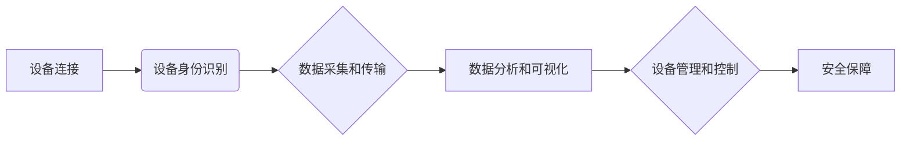

                 

## 物联网管理：连接和管理智能设备生态

> 关键词：物联网、设备管理、数据分析、云计算、安全、可视化、人工智能

### 1. 背景介绍

物联网（IoT）正以惊人的速度发展，连接着越来越多的智能设备，从家庭电器到工业机器，再到城市基础设施。这些设备通过传感器、网络和数据分析技术收集和交换信息，为我们带来便利、提高效率和创造新的商业模式。然而，随着物联网设备数量的激增，管理和维护这些设备的复杂性也随之增加。

传统的IT管理模式难以应对物联网的挑战。物联网设备通常分布广泛、资源有限、功耗低，且需要实时响应和处理数据。因此，我们需要新的管理方法和技术来有效地连接、管理和分析物联网设备生态系统。

### 2. 核心概念与联系

物联网管理的核心概念包括：

* **设备连接:**  实现设备与网络的连接，包括无线网络（Wi-Fi、蓝牙、NB-IoT等）和有线网络（以太网、RS-485等）。
* **设备身份识别:** 为每个设备赋予唯一的标识，以便进行管理和控制。
* **数据采集和传输:**  收集设备产生的数据，并将其传输到云平台或本地服务器进行处理。
* **数据分析和可视化:**  对收集到的数据进行分析，提取有价值的信息，并将其以可视化的形式呈现。
* **设备管理和控制:**  远程监控设备状态，执行远程控制操作，并进行设备升级和维护。
* **安全保障:**  保护设备和数据免受攻击和泄露。

**核心概念架构图:**



### 3. 核心算法原理 & 具体操作步骤

#### 3.1  算法原理概述

物联网管理中常用的算法包括：

* **数据压缩算法:**  减少数据传输量，提高网络效率。常见的算法包括LZ77、LZW、Huffman编码等。
* **数据加密算法:**  保护数据安全，防止未授权访问。常见的算法包括AES、RSA、ECC等。
* **设备身份认证算法:**  验证设备身份，确保设备合法访问网络。常见的算法包括TLS/SSL、OAuth、Kerberos等。
* **数据分析算法:**  从海量数据中提取有价值信息，例如趋势预测、异常检测、关联规则挖掘等。常见的算法包括机器学习、深度学习、统计分析等。

#### 3.2  算法步骤详解

以数据压缩算法为例，其基本步骤如下：

1. **数据预处理:**  去除数据中的冗余信息，例如空格、换行符等。
2. **模式识别:**  识别数据中的重复模式，例如重复的字符序列、数据块等。
3. **模式编码:**  将识别出的模式用更短的代码表示，例如用一个符号表示一个重复的字符序列。
4. **数据编码:**  将预处理后的数据按照编码规则进行编码，生成压缩后的数据。
5. **数据解码:**  接收端根据编码规则解码压缩后的数据，恢复原始数据。

#### 3.3  算法优缺点

数据压缩算法的优点包括：

* **减少数据传输量:**  提高网络效率，降低带宽成本。
* **节省存储空间:**  减少数据存储量，降低存储成本。

数据压缩算法的缺点包括：

* **压缩过程需要消耗计算资源:**  可能会增加设备的功耗。
* **压缩后的数据可能无法直接使用:**  需要进行解码才能恢复原始数据。

#### 3.4  算法应用领域

数据压缩算法广泛应用于物联网领域，例如：

* **传感器数据传输:**  压缩传感器数据，减少数据传输量，提高网络效率。
* **视频流传输:**  压缩视频流，降低带宽需求，提高视频播放质量。
* **图像存储:**  压缩图像数据，节省存储空间，降低存储成本。

### 4. 数学模型和公式 & 详细讲解 & 举例说明

#### 4.1  数学模型构建

物联网管理中，可以使用数学模型来描述设备之间的连接关系、数据传输过程、设备状态变化等。例如，可以使用图论模型来表示设备之间的拓扑结构，可以使用概率模型来描述设备故障的发生概率，可以使用差分方程来描述设备状态随时间的变化。

#### 4.2  公式推导过程

以设备故障概率为例，假设设备的故障概率为 $p$，则设备正常工作的概率为 $1-p$。如果有多个设备并行工作，则整个系统的故障概率可以根据设备之间的独立性进行计算。

假设有 $n$ 个设备，每个设备的故障概率为 $p$，则整个系统的故障概率为：

$$P_{fail} = 1 - (1-p)^n$$

#### 4.3  案例分析与讲解

例如，假设有 10 个设备，每个设备的故障概率为 0.01，则整个系统的故障概率为：

$$P_{fail} = 1 - (1-0.01)^{10} \approx 0.095$$

这意味着，在 10 个设备工作的情况下，整个系统的故障概率约为 9.5%。

### 5. 项目实践：代码实例和详细解释说明

#### 5.1  开发环境搭建

物联网管理项目可以使用多种开发环境，例如：

* **云平台:**  AWS IoT Core、Azure IoT Hub、Google Cloud IoT Core等。
* **本地服务器:**  使用 Linux 系统和 Docker 容器搭建本地服务器环境。

#### 5.2  源代码详细实现

以下是一个使用 Python 和 MQTT 协议实现设备连接和数据传输的简单代码示例：

```python
import paho.mqtt.client as mqtt

# MQTT Broker 地址
broker_address = "mqtt.example.com"

# 设备标识符
device_id = "my_device"

# 连接 MQTT Broker
client = mqtt.Client(device_id)
client.connect(broker_address)

# 发布数据
def publish_data(topic, payload):
    client.publish(topic, payload)

# 订阅数据
def subscribe_data(topic):
    client.subscribe(topic)

# 运行代码
publish_data("sensor/data", "temperature=25")
subscribe_data("control/command")

client.loop_forever()
```

#### 5.3  代码解读与分析

* 代码首先导入 `paho.mqtt.client` 库，用于连接和操作 MQTT Broker。
* 然后设置 MQTT Broker 地址和设备标识符。
* 创建一个 MQTT 客户端对象，并连接到 MQTT Broker。
* 定义两个函数：`publish_data` 用于发布数据，`subscribe_data` 用于订阅数据。
* 调用 `publish_data` 函数发布温度数据到主题 `sensor/data`。
* 调用 `subscribe_data` 函数订阅主题 `control/command`，接收控制命令。
* 使用 `client.loop_forever()` 方法启动循环，持续监听消息和执行操作。

#### 5.4  运行结果展示

运行代码后，设备将连接到 MQTT Broker，并开始发布温度数据。同时，设备会监听 `control/command` 主题，接收来自控制中心的命令。

### 6. 实际应用场景

物联网管理技术在各个领域都有广泛的应用场景，例如：

* **智能家居:**  远程控制家电、监控家居安全、自动调节温度和灯光等。
* **智慧城市:**  监控交通状况、管理公共资源、提高城市安全等。
* **工业自动化:**  远程监控设备状态、预测设备故障、优化生产流程等。
* **医疗健康:**  远程监测患者健康状况、提供个性化医疗服务等。

### 6.4  未来应用展望

物联网管理技术未来将朝着以下方向发展：

* **更智能化:**  利用人工智能技术，实现设备自学习、自诊断和自修复。
* **更安全可靠:**  采用更先进的加密算法和安全机制，保障设备和数据安全。
* **更可视化:**  提供更直观、易懂的设备管理和数据分析界面。
* **更边缘化:**  将数据处理和分析能力下沉到边缘设备，降低网络延迟和带宽需求。

### 7. 工具和资源推荐

#### 7.1  学习资源推荐

* **书籍:**  《物联网技术与应用》、《物联网架构设计》、《物联网安全》等。
* **在线课程:**  Coursera、edX、Udemy 等平台提供物联网相关课程。
* **技术博客:**  IoT World Today、The Things Network、Embedded.com 等网站提供物联网技术资讯和案例分析。

#### 7.2  开发工具推荐

* **云平台:**  AWS IoT Core、Azure IoT Hub、Google Cloud IoT Core 等。
* **物联网协议栈:**  MQTT、CoAP、AMQP 等。
* **数据分析工具:**  Grafana、Kibana、Prometheus 等。

#### 7.3  相关论文推荐

* **物联网安全:**  "A Survey of Security Issues and Solutions in the Internet of Things"
* **物联网数据分析:**  "Big Data Analytics in the Internet of Things: A Survey"
* **物联网边缘计算:**  "Edge Computing for the Internet of Things: A Survey"

### 8. 总结：未来发展趋势与挑战

#### 8.1  研究成果总结

物联网管理技术取得了显著的进展，为连接和管理智能设备生态系统提供了强大的工具和方法。

#### 8.2  未来发展趋势

物联网管理技术将朝着更智能化、更安全可靠、更可视化、更边缘化方向发展。

#### 8.3  面临的挑战

物联网管理技术还面临着一些挑战，例如：

* **设备多样性:**  不同类型的设备具有不同的特性和需求，需要开发通用且灵活的管理方案。
* **数据安全:**  物联网设备产生的数据量巨大，需要采用更先进的加密算法和安全机制来保障数据安全。
* **网络可靠性:**  物联网设备通常分布广泛，网络连接可能不稳定，需要提高网络可靠性和容错能力。

#### 8.4  研究展望

未来，物联网管理技术的研究将集中在以下几个方面：

* **人工智能驱动的物联网管理:**  利用人工智能技术，实现设备自学习、自诊断和自修复。
* **区块链技术在物联网管理中的应用:**  利用区块链技术，提高数据安全性和透明度。
* **边缘计算与物联网管理的融合:**  将数据处理和分析能力下沉到边缘设备，降低网络延迟和带宽需求。

### 9. 附录：常见问题与解答

#### 9.1  常见问题

* **如何选择合适的物联网管理平台？**

选择物联网管理平台需要考虑设备类型、数据量、安全需求、预算等因素。

* **如何保障物联网设备的安全？**

可以使用多种安全措施，例如设备身份认证、数据加密、安全协议等。

* **如何进行物联网设备的远程监控和控制？**

可以使用 MQTT、CoAP 等协议进行远程监控和控制。

#### 9.2  解答

* **如何选择合适的物联网管理平台？**

选择物联网管理平台需要考虑设备类型、数据量、安全需求、预算等因素。

* **如何保障物联网设备的安全？**

可以使用多种安全措施，例如设备身份认证、数据加密、安全协议等。

* **如何进行物联网设备的远程监控和控制？**

可以使用 MQTT、CoAP 等协议进行远程监控和控制。


作者：禅与计算机程序设计艺术 / Zen and the Art of Computer Programming 
<end_of_turn>

