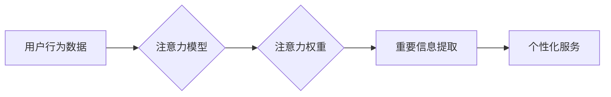

                 

## 物联网设备的注意力争夺与用户体验

> 关键词：物联网、注意力机制、用户体验、设备交互、数据分析、个性化推荐

### 1. 背景介绍

物联网 (Internet of Things, IoT) 的快速发展，将智能设备与网络连接，为人们的生活带来了便利和改变。然而，随着物联网设备数量的激增，用户面临着信息过载和注意力分散的挑战。 

传统的用户界面设计模式难以应对海量设备和信息带来的复杂交互场景。用户需要频繁切换设备和应用程序，才能获取所需的信息，这导致用户体验下降，甚至可能引发信息疲劳。

为了解决这个问题，注意力机制 (Attention Mechanism) 作为一种模仿人类注意力机制的机器学习技术，逐渐被应用于物联网设备的交互设计。注意力机制能够帮助设备识别用户关注的重点信息，并根据用户的行为和偏好，提供更精准、更个性化的服务。

### 2. 核心概念与联系

#### 2.1 物联网设备的注意力争夺

在物联网环境中，每个设备都试图获取用户的注意力，以实现其功能和目标。例如，智能音箱会播放音乐或新闻，智能手表会提醒用户日程安排，智能家居设备会提示用户设备状态。这些设备通过各种方式争夺用户的注意力，例如：

* **视觉提醒:** 使用闪烁的灯光、动画效果或醒目的图标吸引用户注意。
* **声音提醒:** 使用铃声、提示音或语音播报提醒用户。
* **触觉提醒:** 使用震动、振动或触感反馈提醒用户。

#### 2.2 用户体验与注意力机制

用户体验 (User Experience, UX) 是指用户使用产品或服务时的感受和评价。注意力机制能够提升用户体验，主要通过以下方式：

* **减少信息过载:** 通过识别用户关注的重点信息，过滤掉无关信息，避免用户被信息淹没。
* **个性化服务:** 根据用户的行为和偏好，提供更精准、更相关的服务，满足用户的个性化需求。
* **提升交互效率:** 通过预测用户的意图，提前提供相关信息或功能，减少用户操作步骤，提高交互效率。

#### 2.3  注意力机制的架构



### 3. 核心算法原理 & 具体操作步骤

#### 3.1 算法原理概述

注意力机制的核心思想是模拟人类的注意力机制，通过学习用户行为数据，识别用户关注的重点信息，并根据这些信息提供更精准、更个性化的服务。

注意力机制通常使用一个注意力权重来衡量不同信息的重要性。注意力权重可以根据用户的行为数据，例如点击记录、浏览时间、搜索关键词等，进行计算。

#### 3.2 算法步骤详解

1. **数据收集:** 收集用户行为数据，例如设备使用记录、交互行为、偏好设置等。
2. **数据预处理:** 对收集到的数据进行清洗、转换和特征提取，以便于模型训练。
3. **模型训练:** 使用深度学习算法，例如Transformer网络，训练注意力模型。
4. **注意力权重计算:** 将用户行为数据输入到训练好的注意力模型中，计算出每个信息的注意力权重。
5. **重要信息提取:** 根据注意力权重，提取用户关注的重点信息。
6. **个性化服务:** 根据提取的重点信息，提供个性化的服务，例如推荐相关内容、提醒重要事件、提供个性化设置等。

#### 3.3 算法优缺点

**优点:**

* 能够有效地减少信息过载，提高用户体验。
* 可以根据用户的行为和偏好，提供更精准、更个性化的服务。
* 能够提升交互效率，减少用户操作步骤。

**缺点:**

* 需要大量的用户行为数据进行训练，数据质量对模型性能有重要影响。
* 模型训练复杂，需要专业的技术人员进行操作。
* 可能会存在隐私泄露的风险，需要采取相应的安全措施。

#### 3.4 算法应用领域

注意力机制在物联网领域有着广泛的应用场景，例如：

* **智能家居:** 根据用户的行为和偏好，提供个性化的家居控制服务，例如自动调节灯光、温度和音乐。
* **智能医疗:** 分析用户的健康数据，识别潜在的健康风险，并提供个性化的健康建议。
* **智能交通:** 根据用户的出行需求，提供个性化的导航服务，例如推荐最佳路线、预警交通拥堵等。
* **智能零售:** 根据用户的购物记录和偏好，推荐相关的商品和服务。

### 4. 数学模型和公式 & 详细讲解 & 举例说明

#### 4.1 数学模型构建

注意力机制的核心是注意力权重计算。常用的注意力机制模型包括自注意力机制 (Self-Attention) 和多头注意力机制 (Multi-Head Attention)。

#### 4.2 公式推导过程

**自注意力机制:**

给定一个序列 $X = (x_1, x_2, ..., x_n)$，自注意力机制计算每个词 $x_i$ 与其他词之间的注意力权重。

注意力权重计算公式:

$$
\text{Attention}(x_i, X) = \frac{\text{softmax}( \text{score}(x_i, X))}{\sum_{j=1}^{n} \text{softmax}( \text{score}(x_i, X))}
$$

其中，$\text{score}(x_i, X)$ 是 $x_i$ 与其他词之间的相似度得分，通常使用一个查询 (Query)、键 (Key) 和值 (Value) 三个向量进行计算。

**多头注意力机制:**

多头注意力机制将自注意力机制扩展到多个头，每个头学习不同的注意力模式。

多头注意力机制的输出是一个融合了多个头的注意力权重的向量。

#### 4.3 案例分析与讲解

例如，在机器翻译任务中，可以使用多头注意力机制来学习源语言和目标语言之间的关系。

通过训练多头注意力机制，模型能够学习到不同词语之间的语义关系，并根据这些关系进行翻译。

### 5. 项目实践：代码实例和详细解释说明

#### 5.1 开发环境搭建

* Python 3.x
* TensorFlow 或 PyTorch 深度学习框架
* Jupyter Notebook 或 VS Code 代码编辑器

#### 5.2 源代码详细实现

```python
import tensorflow as tf

# 定义自注意力机制
def self_attention(query, key, value, mask=None):
    # 计算查询、键和值的点积
    scores = tf.matmul(query, key, transpose_b=True)
    # 应用注意力权重
    if mask is not None:
        scores += (mask * -1e9)
    attention_weights = tf.nn.softmax(scores, axis=-1)
    # 计算注意力输出
    context = tf.matmul(attention_weights, value)
    return context, attention_weights

# 定义多头注意力机制
def multi_head_attention(query, key, value, num_heads):
    # 将查询、键和值进行线性变换
    query = tf.keras.layers.Dense(units=query.shape[-1] * num_heads)(query)
    key = tf.keras.layers.Dense(units=key.shape[-1] * num_heads)(key)
    value = tf.keras.layers.Dense(units=value.shape[-1] * num_heads)(value)
    # 分割查询、键和值
    query = tf.reshape(query, shape=(-1, tf.shape(query)[1], num_heads, -1))
    key = tf.reshape(key, shape=(-1, tf.shape(key)[1], num_heads, -1))
    value = tf.reshape(value, shape=(-1, tf.shape(value)[1], num_heads, -1))
    # 计算每个头的注意力输出
    context_list = []
    for i in range(num_heads):
        context, attention_weights = self_attention(query[:, :, i, :], key[:, :, i, :], value[:, :, i, :])
        context_list.append(context)
    # 合并所有头的注意力输出
    context = tf.concat(context_list, axis=-1)
    return context, attention_weights

```

#### 5.3 代码解读与分析

* `self_attention` 函数实现了一个基本的自注意力机制，计算每个词与其他词之间的注意力权重。
* `multi_head_attention` 函数实现了一个多头注意力机制，将自注意力机制扩展到多个头，学习不同的注意力模式。

#### 5.4 运行结果展示

运行上述代码，可以得到每个词与其他词之间的注意力权重，以及多头注意力机制的输出。

### 6. 实际应用场景

#### 6.1 智能家居

* **个性化灯光控制:** 根据用户的活动时间和喜好，自动调节灯光亮度和颜色。
* **智能温度调节:** 根据用户的温度偏好和环境温度，自动调节空调温度。
* **语音控制家居设备:** 通过语音指令控制灯光、窗帘、音响等设备。

#### 6.2 智能医疗

* **健康监测:** 分析用户的健康数据，例如心率、血压、睡眠质量等，识别潜在的健康风险。
* **个性化医疗建议:** 根据用户的健康状况和生活习惯，提供个性化的健康建议和治疗方案。
* **远程医疗:** 通过视频通话和远程监测，提供远程医疗服务。

#### 6.3 智能交通

* **个性化导航:** 根据用户的出行需求和实时交通状况，推荐最佳路线和出行方式。
* **智能停车:** 通过传感器和地图数据，帮助用户找到空余停车位。
* **自动驾驶:** 利用注意力机制，帮助自动驾驶汽车识别道路环境和潜在危险。

#### 6.4 未来应用展望

随着物联网技术的不断发展，注意力机制将在更多领域得到应用，例如：

* **个性化教育:** 根据学生的学习进度和兴趣，提供个性化的学习内容和教学方法。
* **智能客服:** 利用注意力机制，帮助智能客服更精准地理解用户的需求，并提供更有效的服务。
* **增强现实 (AR) 和虚拟现实 (VR):** 利用注意力机制，增强用户在 AR 和 VR 环境中的沉浸感和交互体验。

### 7. 工具和资源推荐

#### 7.1 学习资源推荐

* **书籍:**
    * 《深度学习》 (Deep Learning) - Ian Goodfellow, Yoshua Bengio, Aaron Courville
    * 《注意力机制》 (Attention Is All You Need) - Vaswani et al.
* **在线课程:**
    * Coursera: 深度学习 Specialization
    * Udacity: 自然语言处理 Nanodegree
* **博客和网站:**
    * TensorFlow Blog: https://blog.tensorflow.org/
    * PyTorch Blog: https://pytorch.org/blog/

#### 7.2 开发工具推荐

* **深度学习框架:** TensorFlow, PyTorch
* **编程语言:** Python
* **数据可视化工具:** Matplotlib, Seaborn

#### 7.3 相关论文推荐

* **Attention Is All You Need:** https://arxiv.org/abs/1706.03762
* **BERT: Pre-training of Deep Bidirectional Transformers for Language Understanding:** https://arxiv.org/abs/1810.04805
* **Transformer-XL: Attentive Language Models Beyond a Fixed-Length Context:** https://arxiv.org/abs/1901.08316

### 8. 总结：未来发展趋势与挑战

#### 8.1 研究成果总结

注意力机制在物联网领域取得了显著的成果，能够有效地提升用户体验，并为智能设备提供更精准、更个性化的服务。

#### 8.2 未来发展趋势

* **更强大的注意力模型:** 研究更强大的注意力模型，例如基于图神经网络的注意力机制，能够更好地处理复杂的关系和结构化数据。
* **跨模态注意力机制:** 研究跨模态注意力机制，能够处理不同类型的数据，例如文本、图像、音频等，为用户提供更丰富的交互体验。
* **联邦学习与隐私保护:** 研究如何在联邦学习框架下应用注意力机制，同时保障用户隐私安全。

#### 8.3 面临的挑战

* **数据质量和隐私问题:** 注意力机制需要大量的用户行为数据进行训练，数据质量和隐私保护是需要重点关注的问题。
* **模型复杂性和计算效率:** 一些注意力模型过于复杂，计算效率较低，需要进一步优化。
* **解释性和可解释性:** 注意力机制的决策过程较为复杂，缺乏可解释性，需要研究更易于理解和解释的注意力模型。

#### 8.4 研究展望

未来，注意力机制将在物联网领域发挥越来越重要的作用，为用户提供更智能、更便捷、更个性化的服务。

### 9. 附录：常见问题与解答

**Q1: 注意力机制是如何工作的？**

A1: 注意力机制通过学习用户行为数据，识别用户关注的重点信息，并根据这些信息提供更精准、更个性化的服务。

**Q2: 注意力机制有哪些应用场景？**

A2: 注意力机制在物联网领域有着广泛的应用场景，例如智能家居、智能医疗、智能交通等。

**Q3: 注意力机制有哪些挑战？**

A3: 注意力机制面临着数据质量和隐私问题、模型复杂性和计算效率、解释性和可解释性等挑战。


作者：禅与计算机程序设计艺术 / Zen and the Art of Computer Programming 
<end_of_turn>

