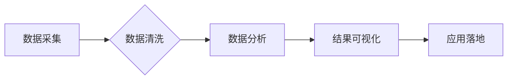

                 

## 用户点击流：电商搜索的数据金矿

> 关键词：用户点击流、电商搜索、数据挖掘、推荐系统、机器学习、深度学习、自然语言处理

## 1. 背景介绍

在当今数据爆炸的时代，电商平台积累了海量的用户行为数据，其中用户点击流数据尤为重要。用户点击流是指用户在电商平台上浏览商品、搜索关键词、点击广告等一系列行为的记录，它反映了用户的兴趣、需求和偏好，蕴藏着丰富的商业价值。

电商搜索作为用户获取商品信息的关键入口，其背后的用户点击流数据更是宝贵的资源。通过对用户点击流的分析和挖掘，电商平台可以洞察用户需求，优化搜索结果，提升用户体验，最终促进销售额增长。

## 2. 核心概念与联系

### 2.1 用户点击流的概念

用户点击流是指用户在电商平台上进行一系列交互行为的记录，包括：

* **搜索行为**: 用户输入关键词进行商品搜索。
* **浏览行为**: 用户点击商品链接进入商品详情页。
* **点击行为**: 用户点击商品图片、广告链接等。
* **加入购物车行为**: 用户将商品添加到购物车中。
* **购买行为**: 用户完成商品购买。

这些行为数据记录了用户在电商平台上的路径和决策过程，为理解用户行为模式提供了重要依据。

### 2.2 点击流与推荐系统的联系

推荐系统是电商平台的核心功能之一，其目的是根据用户的历史行为和偏好，推荐用户可能感兴趣的商品。用户点击流数据是推荐系统训练和优化的重要数据源。

通过分析用户点击流数据，可以发现用户对不同商品的偏好程度，以及用户在搜索、浏览、点击等不同阶段的行为模式。这些信息可以用于训练推荐算法，提高推荐系统的准确性和有效性。

### 2.3 点击流数据分析流程

用户点击流数据分析流程通常包括以下几个步骤：

1. **数据采集**: 收集用户在电商平台上的所有点击行为数据。
2. **数据清洗**: 去除无效数据、重复数据等，保证数据质量。
3. **数据分析**: 使用统计分析、机器学习等方法，挖掘用户点击流数据中的潜在规律和模式。
4. **结果可视化**: 将分析结果以图表、报告等形式呈现，方便用户理解和决策。
5. **应用落地**: 将分析结果应用于电商平台的搜索优化、推荐系统、用户画像等方面，提升用户体验和商业效益。

**Mermaid 流程图**



## 3. 核心算法原理 & 具体操作步骤

### 3.1 算法原理概述

用户点击流分析常用的算法包括：

* **协同过滤**: 基于用户的相似性或商品的相似性，推荐用户可能感兴趣的商品。
* **基于内容的推荐**: 根据商品的属性和描述，推荐与用户兴趣相符的商品。
* **深度学习**: 使用深度神经网络模型，学习用户点击流数据中的复杂模式，进行更精准的推荐。

### 3.2 算法步骤详解

以协同过滤算法为例，其步骤如下：

1. **构建用户-商品交互矩阵**: 将用户和商品作为行和列，记录用户对商品的交互行为（例如点击、购买等），构建一个用户-商品交互矩阵。
2. **计算用户相似度**: 使用余弦相似度、皮尔逊相关系数等方法，计算用户之间的相似度。
3. **计算商品相似度**: 使用余弦相似度、皮尔逊相关系数等方法，计算商品之间的相似度。
4. **推荐商品**: 对于给定的用户，根据其与其他用户的相似度，推荐其他用户喜欢的商品。

### 3.3 算法优缺点

**协同过滤算法**

* **优点**: 可以发现用户之间的隐性关系，推荐个性化商品。
* **缺点**: 对于新用户或新商品，难以进行推荐，容易陷入冷启动问题。

**基于内容的推荐算法**

* **优点**: 不需要用户历史行为数据，可以推荐与用户兴趣相符的商品。
* **缺点**: 难以捕捉用户细微的兴趣变化，推荐结果可能不够个性化。

**深度学习算法**

* **优点**: 可以学习用户点击流数据中的复杂模式，推荐更精准的商品。
* **缺点**: 需要大量的训练数据，模型训练复杂度高。

### 3.4 算法应用领域

用户点击流分析算法广泛应用于以下领域：

* **电商搜索**: 优化搜索结果排名，提高用户搜索体验。
* **商品推荐**: 推荐用户可能感兴趣的商品，提升转化率。
* **用户画像**: 建立用户画像，精准营销。
* **广告投放**: 优化广告投放策略，提高广告效果。

## 4. 数学模型和公式 & 详细讲解 & 举例说明

### 4.1 数学模型构建

用户点击流分析常用的数学模型包括：

* **概率模型**: 使用贝叶斯定理、马尔科夫链等模型，预测用户点击特定商品的概率。
* **回归模型**: 使用线性回归、逻辑回归等模型，预测用户点击行为与其他因素之间的关系。
* **深度学习模型**: 使用神经网络模型，学习用户点击流数据中的复杂模式。

### 4.2 公式推导过程

以概率模型为例，假设用户点击商品 $i$ 的概率为 $P(click_i)$，则可以使用贝叶斯定理推导用户点击商品 $i$ 的概率：

$$P(click_i) = \frac{P(click_i|feature_i) * P(feature_i)}{P(click)}$$

其中：

* $P(click_i|feature_i)$ 是给定用户特征 $feature_i$ 下，用户点击商品 $i$ 的条件概率。
* $P(feature_i)$ 是用户拥有特征 $feature_i$ 的概率。
* $P(click)$ 是用户点击任何商品的概率。

### 4.3 案例分析与讲解

假设电商平台收集了用户点击商品的记录，以及用户的性别、年龄、购买历史等特征数据。可以使用贝叶斯定理构建一个概率模型，预测用户点击特定商品的概率。

例如，假设用户是女性，年龄在 25-35 岁之间，并且之前购买过类似商品，则该用户点击该商品的概率会相对较高。

## 5. 项目实践：代码实例和详细解释说明

### 5.1 开发环境搭建

用户点击流分析项目可以使用 Python 语言进行开发，常用的库包括：

* **Pandas**: 数据处理和分析。
* **Scikit-learn**: 机器学习算法。
* **TensorFlow/PyTorch**: 深度学习框架。

### 5.2 源代码详细实现

以下是一个使用 Python 和 Scikit-learn 库实现协同过滤算法的简单代码示例：

```python
import pandas as pd
from sklearn.metrics.pairwise import cosine_similarity

# 加载用户-商品交互数据
data = pd.read_csv('user_item_interactions.csv')

# 构建用户-商品交互矩阵
user_item_matrix = data.pivot_table(index='user_id', columns='item_id', values='interaction', fill_value=0)

# 计算用户相似度
user_similarity = cosine_similarity(user_item_matrix)

# 预测用户对商品的点击概率
def predict_click_probability(user_id, item_id):
    # 获取用户与其他用户的相似度
    user_similarity_scores = user_similarity[user_id]

    # 计算用户对商品的预测点击概率
    predicted_probability = np.sum(user_similarity_scores * user_item_matrix.loc[user_id, :]) / np.sum(user_similarity_scores)
    return predicted_probability

# 预测用户对商品的点击概率
predicted_probability = predict_click_probability(user_id=1, item_id=5)
print(f'用户 {user_id} 对商品 {item_id} 的预测点击概率为: {predicted_probability}')
```

### 5.3 代码解读与分析

该代码首先加载用户-商品交互数据，构建用户-商品交互矩阵。然后使用余弦相似度计算用户之间的相似度。最后，定义一个函数 `predict_click_probability` 来预测用户对商品的点击概率。

该函数根据用户与其他用户的相似度，以及其他用户对商品的交互行为，计算用户对商品的预测点击概率。

### 5.4 运行结果展示

运行该代码后，会输出用户对特定商品的预测点击概率。

## 6. 实际应用场景

### 6.1 搜索结果优化

电商平台可以通过分析用户点击流数据，了解用户搜索关键词的意图，优化搜索结果排名，提高用户搜索体验。例如，如果用户经常搜索“女装”，则平台可以将女装商品优先展示在搜索结果中。

### 6.2 商品推荐

电商平台可以通过分析用户点击流数据，推荐用户可能感兴趣的商品。例如，如果用户购买过运动鞋，则平台可以推荐其他运动鞋品牌或款式。

### 6.3 用户画像

电商平台可以通过分析用户点击流数据，建立用户画像，了解用户的兴趣爱好、消费习惯等信息。这些信息可以用于精准营销，提高营销效果。

### 6.4 未来应用展望

随着人工智能技术的不断发展，用户点击流分析将更加智能化、个性化。未来，用户点击流分析可以应用于以下领域：

* **个性化广告投放**: 根据用户的兴趣爱好和行为模式，精准投放广告，提高广告效果。
* **智能客服**: 使用自然语言处理技术，分析用户点击流数据，提供更智能的客服服务。
* **产品设计**: 分析用户点击流数据，了解用户对产品的需求和反馈，改进产品设计。

## 7. 工具和资源推荐

### 7.1 学习资源推荐

* **书籍**:
    * 《推荐系统实践》
    * 《深度学习》
* **在线课程**:
    * Coursera: Recommender Systems
    * Udacity: Deep Learning Nanodegree

### 7.2 开发工具推荐

* **Python**: 
* **Pandas**: 数据处理和分析
* **Scikit-learn**: 机器学习算法
* **TensorFlow/PyTorch**: 深度学习框架

### 7.3 相关论文推荐

* **Collaborative Filtering for Implicit Feedback Datasets**
* **Deep Learning for Recommender Systems**

## 8. 总结：未来发展趋势与挑战

### 8.1 研究成果总结

用户点击流分析已经取得了显著的成果，在电商搜索、商品推荐、用户画像等领域发挥着重要作用。

### 8.2 未来发展趋势

未来，用户点击流分析将朝着以下方向发展：

* **更加智能化**: 使用更先进的机器学习和深度学习算法，挖掘用户点击流数据中的更深层次的模式。
* **更加个性化**: 根据用户的个性化需求，提供更加精准的推荐和服务。
* **更加跨平台**: 将用户点击流数据整合到不同的平台，提供更全面的用户体验。

### 8.3 面临的挑战

用户点击流分析也面临着一些挑战：

* **数据质量**: 用户点击流数据可能存在噪声、缺失值等问题，需要进行有效的数据清洗和处理。
* **冷启动问题**: 对于新用户或新商品，难以进行推荐，需要开发新的算法和方法解决冷启动问题。
* **隐私保护**: 用户点击流数据包含用户的隐私信息，需要采取有效的措施保护用户隐私。

### 8.4 研究展望

未来，用户点击流分析的研究方向包括：

* **开发更有效的算法**: 针对冷启动问题、数据质量问题等挑战，开发更有效的算法和模型。
* **探索新的应用场景**: 将用户点击流分析应用到更多领域，例如智能客服、产品设计等。
* **加强隐私保护**: 研究新的隐私保护技术，保障用户隐私安全。

## 9. 附录：常见问题与解答

### 9.1 如何处理用户点击流数据中的噪声和缺失值？

用户点击流数据中可能存在噪声、缺失值等问题，需要进行有效的数据清洗和处理。常见的处理方法包括：

* **删除异常值**: 使用统计方法识别和删除异常值。
* **填充缺失值**: 使用平均值、中位数等方法填充缺失值。
* **使用降维技术**: 使用主成分分析等降维技术，减少数据维度，降低噪声的影响。

### 9.2 如何解决用户点击流分析中的冷启动问题？

冷启动问题是指对于新用户或新商品，难以进行推荐。常见的解决方法包括：

* **利用用户特征**: 根据用户的性别、年龄、兴趣爱好等特征，进行推荐。
* **利用商品属性**: 根据商品的类别、价格、品牌等属性，进行推荐。
* **使用协同过滤的扩展算法**: 使用基于内容的推荐、混合推荐等算法，结合协同过滤算法，解决冷启动问题。


作者：禅与计算机程序设计艺术 / Zen and the Art of Computer Programming 
<end_of_turn>

