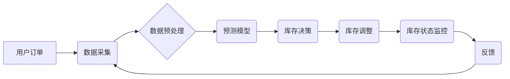

                 

## 电商平台中的AI实时库存管理系统

> 关键词：电商平台、AI、实时库存管理、预测模型、机器学习、优化算法、数据分析、供应链

## 1. 背景介绍

在当今以电子商务为核心的商业环境中，高效的库存管理已成为企业竞争力的关键因素。传统的库存管理方法往往依赖于预设的规则和历史数据，难以应对市场需求的快速变化和供应链的复杂性。随着人工智能技术的快速发展，AI实时库存管理系统应运而生，利用机器学习、数据分析等技术，实现对库存水平的智能预测和动态调整，从而提高库存周转率、降低库存成本，提升整体运营效率。

电商平台作为电子商务的典型代表，其库存管理面临着更大的挑战。平台上商品种类繁多，销售波动剧烈，用户需求变化迅速，传统的库存管理方法难以有效应对。因此，构建一个高效的AI实时库存管理系统对于电商平台来说至关重要。

## 2. 核心概念与联系

**2.1 核心概念**

* **实时库存管理:** 指的是通过实时获取和分析库存数据，动态调整库存水平，以满足不断变化的市场需求。
* **人工智能 (AI):**  指能够模拟人类智能行为的计算机系统，包括机器学习、深度学习、自然语言处理等技术。
* **机器学习 (ML):**  指通过算法训练，使计算机从数据中学习并不断改进的学习过程。
* **预测模型:**  指利用历史数据和相关因素，预测未来某个事件或变量发生情况的数学模型。

**2.2 架构关系**



**2.3 系统功能**

* **数据采集:** 收集来自各个环节的库存数据，包括销售数据、采购数据、库存盘点数据等。
* **数据预处理:** 对采集到的数据进行清洗、转换、整合等处理，使其符合预测模型的输入要求。
* **预测模型:** 利用机器学习算法，构建预测模型，预测未来一段时间内的商品需求量。
* **库存决策:** 根据预测模型的预测结果，制定合理的库存调整策略，例如采购、补货、调拨等。
* **库存调整:** 执行库存决策，调整库存水平，以满足预测的需求量。
* **库存状态监控:** 实时监控库存状态，及时发现库存不足或过剩的情况，并进行预警和处理。

## 3. 核心算法原理 & 具体操作步骤

**3.1 算法原理概述**

AI实时库存管理系统的核心算法通常是基于机器学习的预测模型，常用的算法包括：

* **ARIMA模型:** 自回归移动平均模型，适用于时间序列数据预测，能够捕捉数据中的趋势、季节性等特征。
* **Prophet模型:** 由Facebook开发的预测模型，专门针对时间序列数据，能够处理缺失数据、趋势变化等复杂情况。
* **神经网络模型:** 能够学习更复杂的非线性关系，具有更高的预测精度，但训练数据量和计算资源要求更高。

**3.2 算法步骤详解**

1. **数据收集:** 收集历史销售数据、库存数据、市场趋势数据等相关信息。
2. **数据预处理:** 清洗、转换、整合数据，处理缺失值、异常值等问题，并进行特征工程，提取有价值的特征。
3. **模型选择:** 根据数据特点和预测需求，选择合适的预测模型。
4. **模型训练:** 利用训练数据训练模型，调整模型参数，使模型能够准确预测未来需求量。
5. **模型评估:** 利用测试数据评估模型的预测精度，并进行模型调优，提高预测精度。
6. **模型部署:** 将训练好的模型部署到生产环境中，实时预测未来需求量。
7. **库存决策:** 根据预测结果，制定合理的库存调整策略，例如采购、补货、调拨等。
8. **库存调整:** 执行库存决策，调整库存水平，以满足预测的需求量。
9. **监控和优化:** 实时监控库存状态，及时发现问题，并对模型进行持续优化，提高预测精度和库存管理效率。

**3.3 算法优缺点**

* **优点:** 能够准确预测未来需求量，提高库存周转率，降低库存成本，提升运营效率。
* **缺点:** 需要大量的数据进行训练，模型训练和部署需要一定的技术难度，对数据质量要求较高。

**3.4 算法应用领域**

* 电商平台
* 制造业
* 零售业
* 供应链管理

## 4. 数学模型和公式 & 详细讲解 & 举例说明

**4.1 数学模型构建**

常用的预测模型数学模型包括ARIMA模型、Prophet模型等。

**4.1.1 ARIMA模型**

ARIMA模型是一种时间序列预测模型，其数学模型可以表示为：

$$
y_t = c + \phi_1 y_{t-1} + \phi_2 y_{t-2} + ... + \phi_p y_{t-p} + \theta_1 \epsilon_{t-1} + \theta_2 \epsilon_{t-2} + ... + \theta_q \epsilon_{t-q} + \epsilon_t
$$

其中：

* $y_t$ 表示时间t点的预测值
* $c$ 表示截距项
* $\phi_i$ 表示自回归系数
* $p$ 表示自回归阶数
* $\theta_i$ 表示移动平均系数
* $q$ 表示移动平均阶数
* $\epsilon_t$ 表示时间t点的随机误差项

**4.1.2 Prophet模型**

Prophet模型是一种基于分解的时间序列预测模型，其数学模型可以表示为：

$$
y_t = s_t + t_t + h_t + \epsilon_t
$$

其中：

* $y_t$ 表示时间t点的预测值
* $s_t$ 表示趋势项
* $t_t$ 表示周期性项
* $h_t$ 表示节日效应项
* $\epsilon_t$ 表示时间t点的随机误差项

**4.2 公式推导过程**

ARIMA模型和Prophet模型的公式推导过程较为复杂，需要深入了解时间序列分析和机器学习的相关知识。

**4.3 案例分析与讲解**

假设一家电商平台销售一款手机，其历史销售数据如下：

| 时间 | 销售量 |
|---|---|
| 2023-01-01 | 100 |
| 2023-01-02 | 120 |
| 2023-01-03 | 150 |
| 2023-01-04 | 180 |
| 2023-01-05 | 200 |

可以使用ARIMA模型或Prophet模型对该数据进行预测，预测未来一周的销售量。

## 5. 项目实践：代码实例和详细解释说明

**5.1 开发环境搭建**

* Python 3.x
* Jupyter Notebook
* pandas
* scikit-learn
* Prophet

**5.2 源代码详细实现**

```python
import pandas as pd
from prophet import Prophet

# 加载历史销售数据
data = pd.read_csv('sales_data.csv', parse_dates=['ds'])

# 创建Prophet模型
model = Prophet()

# 训练模型
model.fit(data)

# 预测未来一周的销售量
future = model.make_future_dataframe(periods=7)
forecast = model.predict(future)

# 展示预测结果
model.plot(forecast)
```

**5.3 代码解读与分析**

* 首先，需要加载历史销售数据，并将其转换为Pandas DataFrame格式。
* 然后，创建Prophet模型对象。
* 利用`fit()`方法训练模型，将历史数据作为训练集。
* 使用`make_future_dataframe()`方法生成未来一周的数据，并利用`predict()`方法预测未来一周的销售量。
* 最后，使用`plot()`方法展示预测结果。

**5.4 运行结果展示**

运行代码后，会生成一个包含预测结果的图表，展示未来一周的销售量预测值。

## 6. 实际应用场景

**6.1 电商平台库存管理**

* 预测商品需求量，优化库存水平，降低库存成本。
* 自动触发采购和补货流程，确保商品及时供应。
* 根据销售趋势，调整商品定价和促销策略。

**6.2 制造业生产计划**

* 预测原材料需求量，优化采购计划，降低库存成本。
* 预测产品需求量，优化生产计划，提高生产效率。
* 根据市场需求变化，调整产品生产结构。

**6.3 零售业商品管理**

* 预测商品需求量，优化商品库存水平，降低库存成本。
* 根据销售趋势，调整商品陈列和促销策略。
* 预测商品滞销情况，及时进行库存清理和促销活动。

**6.4 供应链管理**

* 预测商品需求量，优化物流配送计划，降低运输成本。
* 预测供应链风险，及时采取措施，降低供应链中断风险。
* 优化供应链库存水平，提高供应链效率。

**6.5 未来应用展望**

随着人工智能技术的不断发展，AI实时库存管理系统将更加智能化、自动化，能够更好地适应市场需求变化，提高库存管理效率。未来，AI实时库存管理系统还将应用于更多领域，例如：

* 个性化库存管理
* 预防性库存管理
* 智能仓储管理

## 7. 工具和资源推荐

**7.1 学习资源推荐**

* **书籍:**
    * 《Python机器学习》
    * 《时间序列分析》
    * 《深度学习》
* **在线课程:**
    * Coursera: Machine Learning
    * edX: Artificial Intelligence
    * Udemy: Time Series Analysis with Python

**7.2 开发工具推荐**

* **Python:** 
    * pandas
    * scikit-learn
    * Prophet
* **Jupyter Notebook:** 用于代码编写和结果展示
* **云平台:** AWS, Azure, GCP 等云平台提供丰富的机器学习服务

**7.3 相关论文推荐**

* **ARIMA模型:**
    * Box, G. E. P., & Jenkins, G. M. (1976). Time series analysis: Forecasting and control. Holden-Day.
* **Prophet模型:**
    * Taylor, J. W., & Letham, C. (2017). Prophet: Forecasting at scale. arXiv preprint arXiv:1703.07970.

## 8. 总结：未来发展趋势与挑战

**8.1 研究成果总结**

AI实时库存管理系统已取得了显著的成果，能够有效提高库存管理效率，降低库存成本。

**8.2 未来发展趋势**

* **更精准的预测:** 利用更先进的机器学习算法和更丰富的预测数据，提高预测精度。
* **更智能的决策:** 基于人工智能技术，实现库存决策的自动化和智能化。
* **更全面的应用:** 将AI实时库存管理系统应用于更多领域，例如个性化库存管理、预防性库存管理等。

**8.3 面临的挑战**

* **数据质量:** AI模型的预测精度依赖于数据质量，需要不断提高数据采集、清洗和预处理的效率。
* **模型复杂度:** 随着模型复杂度的增加，模型训练和部署的难度也随之增加。
* **解释性:** AI模型的决策过程往往难以解释，需要开发更易于理解的模型解释方法。

**8.4 研究展望**

未来，AI实时库存管理系统将朝着更智能化、自动化、个性化的方向发展，为企业提供更有效的库存管理解决方案。


## 9. 附录：常见问题与解答

**9.1 如何选择合适的预测模型？**

选择合适的预测模型需要根据数据的特点和预测需求进行综合考虑。

* **数据类型:** 时间序列数据、分类数据、回归数据等。
* **数据量:** 数据量大，可以选择更复杂的模型；数据量小，可以选择更简单的模型。
* **预测精度要求:** 预测精度要求高，可以选择更复杂的模型；预测精度要求不高，可以选择更简单的模型。

**9.2 如何评估模型的预测精度？**

常用的评估指标包括均方误差 (MSE)、平均绝对误差 (MAE)、R-squared 等。

**9.3 如何进行模型调优？**

模型调优可以通过调整模型参数、选择不同的特征、使用交叉验证等方法进行。

**9.4 如何部署模型到生产环境？**

可以使用云平台提供的机器学习服务，或者自行搭建模型部署环境。


作者：禅与计算机程序设计艺术 / Zen and the Art of Computer Programming 
<end_of_turn>

