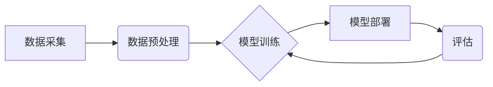

                 

## 电商平台的AI 大模型实践：搜索推荐系统是核心，数据质量控制与处理效率

> 关键词：电商平台、AI大模型、搜索推荐系统、数据质量控制、处理效率、推荐算法、深度学习、自然语言处理、模型训练、模型部署

## 1. 背景介绍

在当今数据爆炸的时代，电商平台面临着巨大的挑战和机遇。用户数量的激增、商品种类繁多、消费习惯多元化，使得传统的搜索和推荐系统难以满足用户的个性化需求。因此，电商平台迫切需要借助人工智能（AI）大模型的力量，提升用户体验，提高转化率。

AI大模型在电商平台的应用前景广阔，涵盖搜索推荐、个性化营销、智能客服、商品画像等多个领域。其中，搜索推荐系统作为电商平台的核心功能，其应用最为广泛。

搜索推荐系统旨在根据用户的搜索行为、浏览历史、购买记录等数据，推荐与用户兴趣相符的商品，帮助用户快速找到所需商品，提升购物体验。传统的搜索推荐系统主要依赖于规则引擎和基于特征的机器学习算法，但随着数据量的增加和用户需求的复杂化，这些方法逐渐显得力不从心。

AI大模型的出现为电商平台的搜索推荐系统带来了新的突破。其强大的学习能力和泛化能力，能够从海量数据中挖掘出更深层的用户需求和商品关联性，提供更精准、更个性化的推荐结果。

## 2. 核心概念与联系

### 2.1 搜索推荐系统架构

电商平台的搜索推荐系统通常由以下几个模块组成：

* **数据采集模块:** 收集用户行为数据、商品信息数据等。
* **数据预处理模块:** 对采集到的数据进行清洗、转换、特征提取等处理。
* **模型训练模块:** 利用机器学习算法训练推荐模型。
* **模型部署模块:** 将训练好的模型部署到线上环境，为用户提供推荐服务。
* **评估模块:** 对推荐系统的性能进行评估，并根据评估结果进行模型优化。



### 2.2 AI大模型在搜索推荐系统中的应用

AI大模型在电商平台的搜索推荐系统中主要应用于以下几个方面：

* **个性化推荐:** 利用大模型的强大的学习能力，从用户的历史行为数据中挖掘出用户的兴趣偏好，并根据用户的实时行为进行动态调整，提供更精准的个性化推荐。
* **内容推荐:** 利用大模型对商品描述、用户评论等文本数据进行理解和分析，推荐与用户兴趣相关的商品内容。
* **搜索结果排序:** 利用大模型对搜索结果进行排序，将与用户搜索意图最匹配的商品排在最前面，提升用户搜索体验。
* **新商品推荐:** 利用大模型对新商品进行分析和预测，推荐具有潜在价值的新商品，帮助用户发现新产品。

## 3. 核心算法原理 & 具体操作步骤

### 3.1 算法原理概述

深度学习是AI大模型的核心技术之一。在搜索推荐系统中，常用的深度学习算法包括：

* **神经网络:** 神经网络是一种模仿人脑神经网络结构的算法，能够学习复杂的非线性关系。
* **卷积神经网络(CNN):** CNN擅长处理图像数据，在电商平台的商品推荐中，可以利用CNN对商品图片进行特征提取，提高推荐的准确性。
* **循环神经网络(RNN):** RNN擅长处理序列数据，在电商平台的搜索推荐中，可以利用RNN对用户的历史搜索行为进行建模，提供更精准的推荐。
* **Transformer:** Transformer是一种新型的深度学习模型，其强大的并行处理能力和自注意力机制，使其在自然语言处理领域取得了突破性进展，在电商平台的搜索推荐中，可以利用Transformer对用户的搜索词进行理解和分析，提高推荐的准确性。

### 3.2 算法步骤详解

以深度学习算法为例，搜索推荐系统的具体操作步骤如下：

1. **数据采集:** 收集用户行为数据、商品信息数据等。
2. **数据预处理:** 对采集到的数据进行清洗、转换、特征提取等处理。
3. **模型构建:** 选择合适的深度学习算法，构建推荐模型。
4. **模型训练:** 利用训练数据对推荐模型进行训练，调整模型参数，使其能够准确预测用户的兴趣偏好。
5. **模型评估:** 利用测试数据对推荐模型进行评估，并根据评估结果进行模型优化。
6. **模型部署:** 将训练好的模型部署到线上环境，为用户提供推荐服务。
7. **实时更新:** 定期更新模型训练数据，并根据用户反馈进行模型调整，保证推荐系统的准确性和时效性。

### 3.3 算法优缺点

**优点:**

* **精准度高:** 深度学习算法能够从海量数据中挖掘出更深层的用户需求和商品关联性，提供更精准的推荐结果。
* **个性化强:** 深度学习算法能够根据用户的历史行为数据进行个性化建模，提供更符合用户兴趣的推荐。
* **可扩展性强:** 深度学习算法能够处理海量数据，并随着数据量的增加而不断提升推荐精度。

**缺点:**

* **训练成本高:** 深度学习算法需要大量的训练数据和计算资源，训练成本较高。
* **模型解释性差:** 深度学习算法的内部机制较为复杂，难以解释模型的推荐结果。
* **数据依赖性强:** 深度学习算法的性能依赖于训练数据的质量，如果训练数据不充分或存在偏差，则会影响推荐效果。

### 3.4 算法应用领域

深度学习算法在电商平台的搜索推荐系统中广泛应用，例如：

* **商品推荐:** 根据用户的历史购买记录、浏览记录、收藏记录等数据，推荐与用户兴趣相符的商品。
* **搜索结果排序:** 根据用户的搜索词、历史搜索记录等数据，对搜索结果进行排序，将与用户搜索意图最匹配的商品排在最前面。
* **个性化营销:** 根据用户的兴趣偏好、购买习惯等数据，进行个性化的营销推广，提高营销效果。

## 4. 数学模型和公式 & 详细讲解 & 举例说明

### 4.1 数学模型构建

在搜索推荐系统中，常用的数学模型包括协同过滤模型、内容过滤模型和混合模型。

**协同过滤模型:** 基于用户的历史行为数据，预测用户对商品的评分或购买意愿。

**内容过滤模型:** 基于商品的特征信息，预测用户对商品的兴趣。

**混合模型:** 将协同过滤模型和内容过滤模型相结合，利用两种模型的优势，提高推荐的准确性。

### 4.2 公式推导过程

以协同过滤模型为例，其核心公式为：

$$
r_{ui} = \mu + b_u + b_i + \epsilon_{ui}
$$

其中：

* $r_{ui}$ 表示用户 $u$ 对商品 $i$ 的评分或购买意愿。
* $\mu$ 表示全局平均评分。
* $b_u$ 表示用户 $u$ 的偏差。
* $b_i$ 表示商品 $i$ 的偏差。
* $\epsilon_{ui}$ 表示预测误差。

### 4.3 案例分析与讲解

假设有一个电商平台，用户 $A$ 对电影 $X$ 评分为 5，用户 $B$ 对电影 $Y$ 评分为 4。如果我们想要预测用户 $A$ 对电影 $Y$ 的评分，可以使用协同过滤模型进行预测。

首先，我们需要计算全局平均评分 $\mu$，用户 $A$ 的偏差 $b_A$，电影 $Y$ 的偏差 $b_Y$。然后，我们可以利用公式 $r_{AY} = \mu + b_A + b_Y + \epsilon_{AY}$ 来预测用户 $A$ 对电影 $Y$ 的评分。

## 5. 项目实践：代码实例和详细解释说明

### 5.1 开发环境搭建

* **操作系统:** Ubuntu 20.04 LTS
* **编程语言:** Python 3.8
* **深度学习框架:** TensorFlow 2.0
* **其他工具:** Jupyter Notebook、Git

### 5.2 源代码详细实现

```python
import tensorflow as tf

# 定义模型
model = tf.keras.Sequential([
    tf.keras.layers.Embedding(input_dim=vocab_size, output_dim=embedding_dim),
    tf.keras.layers.LSTM(units=128),
    tf.keras.layers.Dense(units=1, activation='sigmoid')
])

# 编译模型
model.compile(optimizer='adam', loss='binary_crossentropy', metrics=['accuracy'])

# 训练模型
model.fit(x_train, y_train, epochs=10, batch_size=32)

# 评估模型
loss, accuracy = model.evaluate(x_test, y_test)
print('Loss:', loss)
print('Accuracy:', accuracy)
```

### 5.3 代码解读与分析

* **Embedding层:** 将用户和商品的ID转换为稠密的向量表示，用于捕捉用户和商品之间的潜在关系。
* **LSTM层:** 利用循环神经网络的特性，对用户的历史行为数据进行建模，捕捉用户的动态变化和兴趣偏好。
* **Dense层:** 将LSTM层的输出进行分类，预测用户对商品的购买意愿。

### 5.4 运行结果展示

训练完成后，我们可以使用测试数据评估模型的性能。

## 6. 实际应用场景

### 6.1 个性化推荐

电商平台可以利用AI大模型，根据用户的历史购买记录、浏览记录、收藏记录等数据，推荐与用户兴趣相符的商品，提高用户购物体验。

### 6.2 内容推荐

电商平台可以利用AI大模型，对商品描述、用户评论等文本数据进行分析，推荐与用户兴趣相关的商品内容，帮助用户发现新产品。

### 6.3 搜索结果排序

电商平台可以利用AI大模型，对用户的搜索词进行理解和分析，对搜索结果进行排序，将与用户搜索意图最匹配的商品排在最前面，提升用户搜索体验。

### 6.4 未来应用展望

随着AI技术的不断发展，AI大模型在电商平台的应用场景将更加广泛，例如：

* **智能客服:** 利用AI大模型，构建智能客服系统，为用户提供更快速、更精准的客服服务。
* **商品画像:** 利用AI大模型，对商品进行画像分析，挖掘商品的潜在价值和用户需求。
* **营销预测:** 利用AI大模型，预测用户的购买行为，为营销活动提供数据支持。

## 7. 工具和资源推荐

### 7.1 学习资源推荐

* **书籍:**
    * 《深度学习》
    * 《自然语言处理》
    * 《机器学习实战》
* **在线课程:**
    * Coursera
    * edX
    * Udacity

### 7.2 开发工具推荐

* **深度学习框架:** TensorFlow, PyTorch, Keras
* **数据处理工具:** Pandas, NumPy
* **云计算平台:** AWS, Azure, Google Cloud

### 7.3 相关论文推荐

* **Attention Is All You Need:** https://arxiv.org/abs/1706.03762
* **BERT: Pre-training of Deep Bidirectional Transformers for Language Understanding:** https://arxiv.org/abs/1810.04805

## 8. 总结：未来发展趋势与挑战

### 8.1 研究成果总结

AI大模型在电商平台的搜索推荐系统中取得了显著的成果，能够提供更精准、更个性化的推荐结果，提升用户体验和商业价值。

### 8.2 未来发展趋势

* **模型规模化:** 随着计算资源的不断提升，AI大模型的规模将进一步扩大，模型的学习能力和泛化能力将得到进一步提升。
* **多模态融合:** AI大模型将融合文本、图像、视频等多模态数据，提供更全面的用户体验。
* **解释性增强:** 研究人员将致力于提高AI大模型的解释性，使模型的推荐结果更加透明和可理解。

### 8.3 面临的挑战

* **数据质量:** AI大模型的性能依赖于训练数据的质量，如何保证数据准确性和完整性是一个重要的挑战。
* **计算资源:** 训练大型AI模型需要大量的计算资源，如何降低训练成本是一个重要的研究方向。
* **伦理问题:** AI大模型的应用可能会带来一些伦理问题，例如数据隐私、算法偏见等，需要引起足够的重视。

### 8.4 研究展望

未来，AI大模型在电商平台的应用将更加广泛和深入，将为用户提供更智能、更便捷的购物体验。


## 9. 附录：常见问题与解答

### 9.1 如何选择合适的深度学习算法？

选择合适的深度学习算法需要根据具体应用场景和数据特点进行选择。

* **协同过滤模型:** 适合用户行为数据丰富的场景。
* **内容过滤模型:** 适合商品信息数据丰富的场景。
* **混合模型:** 可以结合协同过滤模型和内容过滤模型的优势，提高推荐的准确性。

### 9.2 如何处理数据质量问题？

数据质量问题是AI大模型应用中的一个重要挑战。

* **数据清洗:** 去除数据中的噪声、重复数据和错误数据。
* **数据转换:** 将数据转换为模型能够理解的格式。
* **数据增强:** 通过人工或自动的方式增加训练数据量。

### 9.3 如何降低训练成本？

训练大型AI模型需要大量的计算资源，可以采用以下方法降低训练成本：

* **模型压缩:** 通过量化、剪枝等方法压缩模型规模，减少计算量。
* **分布式训练:** 将模型训练任务分发到多个机器上进行并行训练，缩短训练时间。
* **云计算平台:** 利用云计算平台的计算资源，按需付费，降低硬件成本。


作者：禅与计算机程序设计艺术 / Zen and the Art of Computer Programming 
<end_of_turn>

