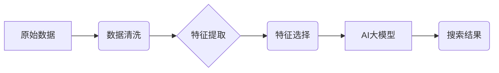

                 

## 电商搜索中AI大模型的特征工程

> 关键词：电商搜索、AI大模型、特征工程、自然语言处理、推荐系统、信息检索、深度学习

## 1. 背景介绍

电商平台的搜索引擎是用户获取商品信息和完成购买的关键入口。传统的基于关键词匹配的搜索方式难以满足用户日益复杂的搜索需求，例如长尾关键词、语义理解、个性化推荐等。近年来，随着人工智能技术的快速发展，特别是深度学习技术的突破，AI大模型在电商搜索领域展现出巨大的潜力。

AI大模型，例如BERT、GPT等，能够通过学习海量文本数据，理解语言的语义和上下文关系，从而实现更精准、更智能的搜索体验。然而，AI大模型的应用离不开高质量的特征工程。特征工程是将原始数据转化为模型能够理解的特征的过程，它直接影响着模型的性能和效果。

## 2. 核心概念与联系

### 2.1  电商搜索

电商搜索是指在电商平台上，用户输入关键词或其他查询信息，系统根据这些信息检索并返回相关商品的搜索过程。

### 2.2  AI大模型

AI大模型是指在海量数据上训练的深度学习模型，具有强大的泛化能力和语义理解能力。常见的AI大模型包括：

* **BERT (Bidirectional Encoder Representations from Transformers):** 用于理解文本的语义关系，常用于自然语言理解任务。
* **GPT (Generative Pre-trained Transformer):** 用于生成文本，常用于文本生成、机器翻译等任务。
* **T5 (Text-to-Text Transfer Transformer):** 将所有任务转化为文本到文本的格式，具有广泛的应用场景。

### 2.3  特征工程

特征工程是机器学习和深度学习模型训练的关键步骤，它涉及到以下几个方面：

* **数据清洗:** 去除数据中的噪声、缺失值等异常数据。
* **数据转换:** 将原始数据转化为模型能够理解的格式，例如将文本数据转化为词向量。
* **特征提取:** 从原始数据中提取有价值的特征，例如用户行为特征、商品属性特征等。
* **特征选择:** 选择最优的特征组合，提高模型的性能。

### 2.4  架构图



## 3. 核心算法原理 & 具体操作步骤

### 3.1  算法原理概述

电商搜索中的AI大模型特征工程主要基于自然语言处理（NLP）技术，通过以下几个步骤实现：

1. **文本预处理:** 对用户输入的搜索词进行清洗、分词、去停用词等处理，使其更适合模型训练。
2. **词向量化:** 将文本数据转化为稠密的向量表示，例如使用Word2Vec、GloVe等模型生成词向量。
3. **语义相似度计算:** 利用词向量之间的相似度，计算搜索词与商品描述之间的相关性。
4. **特征组合:** 将不同类型的特征组合在一起，例如用户行为特征、商品属性特征、语义相似度等，构建更丰富的商品表示。

### 3.2  算法步骤详解

1. **数据收集:** 收集电商平台的用户搜索词、商品描述、用户行为数据等。
2. **数据清洗:** 去除数据中的噪声、重复数据、缺失值等异常数据。
3. **文本预处理:** 对用户搜索词进行分词、去停用词、词形还原等处理。
4. **词向量化:** 使用Word2Vec、GloVe等模型训练词向量，将文本数据转化为稠密的向量表示。
5. **语义相似度计算:** 利用词向量之间的余弦相似度、点积相似度等方法计算搜索词与商品描述之间的相关性。
6. **特征组合:** 将用户行为特征、商品属性特征、语义相似度等特征组合在一起，构建更丰富的商品表示。
7. **模型训练:** 使用AI大模型，例如BERT、GPT等，对特征进行训练，学习商品与搜索词之间的关系。
8. **模型评估:** 使用测试数据评估模型的性能，例如准确率、召回率、F1-score等。
9. **模型部署:** 将训练好的模型部署到电商平台的搜索引擎中，实现智能搜索功能。

### 3.3  算法优缺点

**优点:**

* **语义理解能力强:** AI大模型能够理解文本的语义和上下文关系，提高搜索结果的准确性。
* **个性化推荐:** 可以根据用户的搜索历史、浏览记录等信息，提供个性化的商品推荐。
* **自动学习:** AI大模型能够自动学习用户需求和商品特征，不断优化搜索结果。

**缺点:**

* **数据依赖性强:** AI大模型需要大量的训练数据，否则性能会下降。
* **计算资源消耗大:** 训练和部署AI大模型需要大量的计算资源。
* **可解释性差:** AI大模型的决策过程比较复杂，难以解释其背后的逻辑。

### 3.4  算法应用领域

* **电商搜索:** 提供更精准、更智能的商品搜索体验。
* **推荐系统:** 根据用户的兴趣和行为，推荐相关商品。
* **内容推荐:** 根据用户的阅读习惯，推荐相关文章、视频等内容。
* **客服机器人:** 理解用户的自然语言问题，提供自动回复。

## 4. 数学模型和公式 & 详细讲解 & 举例说明

### 4.1  数学模型构建

在电商搜索中，AI大模型通常采用Transformer架构，其核心是注意力机制。注意力机制能够学习文本中不同词语之间的关系，并赋予重要词语更高的权重。

### 4.2  公式推导过程

注意力机制的计算公式如下：

$$
\text{Attention}(Q, K, V) = \text{softmax}\left(\frac{Q K^T}{\sqrt{d_k}}\right) V
$$

其中：

* $Q$：查询矩阵
* $K$：键矩阵
* $V$：值矩阵
* $d_k$：键向量的维度
* $\text{softmax}$：softmax函数，用于归一化注意力权重

### 4.3  案例分析与讲解

假设用户输入的搜索词为“智能手机”，商品描述为“这款手机拥有强大的处理器和高分辨率屏幕”。

1. 将搜索词和商品描述转化为词向量。
2. 计算搜索词和商品描述的词向量之间的注意力权重。
3. 根据注意力权重，将商品描述中的重要词语加权求和，得到商品与搜索词的语义相似度。

## 5. 项目实践：代码实例和详细解释说明

### 5.1  开发环境搭建

* Python 3.6+
* TensorFlow/PyTorch
* NLTK、spaCy等自然语言处理库

### 5.2  源代码详细实现

```python
# 使用BERT模型计算搜索词与商品描述的语义相似度
from transformers import AutoTokenizer, AutoModel

# 加载BERT模型和词表
tokenizer = AutoTokenizer.from_pretrained('bert-base-uncased')
model = AutoModel.from_pretrained('bert-base-uncased')

# 用户搜索词
query = "智能手机"
# 商品描述
description = "这款手机拥有强大的处理器和高分辨率屏幕"

# 将搜索词和商品描述转化为BERT输入格式
input_ids = tokenizer(query, description, return_tensors="pt").input_ids

# 使用BERT模型获取词向量
outputs = model(input_ids)
embeddings = outputs.last_hidden_state[:, 0, :]

# 计算词向量之间的余弦相似度
similarity = torch.cosine_similarity(embeddings[0], embeddings[1])

# 打印相似度
print(f"搜索词与商品描述的语义相似度: {similarity.item()}")
```

### 5.3  代码解读与分析

* 使用`transformers`库加载预训练的BERT模型和词表。
* 将搜索词和商品描述转化为BERT模型能够理解的输入格式。
* 使用BERT模型获取词向量。
* 计算词向量之间的余弦相似度，表示搜索词与商品描述的语义相似度。

### 5.4  运行结果展示

运行上述代码，会输出搜索词与商品描述的语义相似度值。

## 6. 实际应用场景

### 6.1  电商搜索推荐

AI大模型可以根据用户的搜索历史、浏览记录、购买行为等信息，学习用户的兴趣偏好，并推荐相关商品。

### 6.2  个性化商品展示

AI大模型可以根据用户的个人特征，例如年龄、性别、职业等，个性化展示商品，提高用户体验。

### 6.3  智能客服

AI大模型可以理解用户的自然语言问题，并提供自动回复，提高客服效率。

### 6.4  未来应用展望

* **多模态搜索:** 将文本、图像、视频等多种数据类型融合在一起，实现更全面的商品搜索。
* **跨语言搜索:** 支持多种语言的搜索，满足全球用户的需求。
* **实时搜索:** 实现实时搜索，快速响应用户的查询需求。

## 7. 工具和资源推荐

### 7.1  学习资源推荐

* **书籍:**
    * 《深度学习》
    * 《自然语言处理》
    * 《Transformers》
* **在线课程:**
    * Coursera: 深度学习
    * Udacity: 自然语言处理
    * fast.ai: 深度学习

### 7.2  开发工具推荐

* **Python:** 
    * TensorFlow
    * PyTorch
    * Hugging Face Transformers
* **云平台:**
    * AWS
    * Azure
    * Google Cloud

### 7.3  相关论文推荐

* BERT: Pre-training of Deep Bidirectional Transformers for Language Understanding
* GPT: Attention Is All You Need
* T5: Exploring the Limits of Transfer Learning with a Unified Text-to-Text Transformer

## 8. 总结：未来发展趋势与挑战

### 8.1  研究成果总结

AI大模型在电商搜索领域取得了显著的成果，例如提高了搜索结果的准确性、个性化程度和用户体验。

### 8.2  未来发展趋势

* **模型规模和能力的提升:** 训练更大规模的AI大模型，提高其语义理解能力和泛化能力。
* **多模态搜索的融合:** 将文本、图像、视频等多种数据类型融合在一起，实现更全面的商品搜索。
* **个性化推荐的精细化:** 基于用户的更细粒度的特征，提供更精准的商品推荐。

### 8.3  面临的挑战

* **数据安全和隐私保护:** AI大模型需要大量的训练数据，如何保证数据的安全和隐私保护是一个重要挑战。
* **模型解释性和可控性:** AI大模型的决策过程比较复杂，难以解释其背后的逻辑，如何提高模型的解释性和可控性是一个重要的研究方向。
* **计算资源的限制:** 训练和部署大型AI模型需要大量的计算资源，如何降低计算成本是一个重要的技术挑战。

### 8.4  研究展望

未来，AI大模型在电商搜索领域将继续发挥重要作用，并推动电商搜索的智能化、个性化和多模态化发展。


## 9. 附录：常见问题与解答

**Q1: 如何选择合适的AI大模型？**

**A1:** 选择合适的AI大模型需要根据具体应用场景和数据特点进行选择。例如，对于文本分类任务，BERT模型效果较好；对于文本生成任务，GPT模型效果较好。

**Q2: 如何评估AI大模型的性能？**

**A2:** AI大模型的性能可以评估指标包括准确率、召回率、F1-score、BLEU等。

**Q3: 如何解决AI大模型的过拟合问题？**

**A3:** 可以使用正则化、Dropout、数据增强等方法来解决AI大模型的过拟合问题。


作者：禅与计算机程序设计艺术 / Zen and the Art of Computer Programming 
<end_of_turn>

