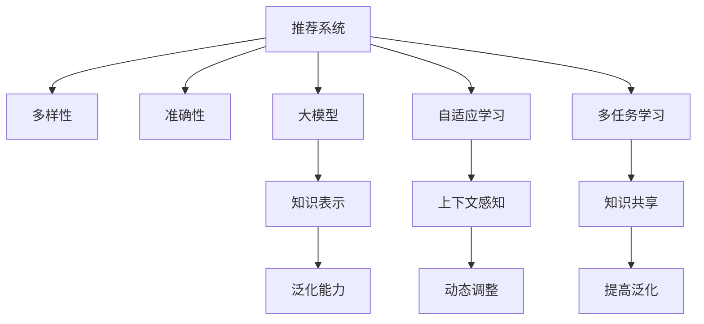

                 

# 推荐系统中的多样性与准确性平衡：大模型方案

> 关键词：推荐系统,多样性,准确性,大模型,自适应学习,推荐算法,多任务学习

## 1. 背景介绍

推荐系统（Recommender Systems）是指通过算法为用户推荐商品、服务、内容等信息的技术。随着互联网和数据技术的不断发展，推荐系统已经成为电子商务、社交媒体、视频网站等平台的核心功能，极大地提升了用户体验和平台价值。

推荐系统可以分为两大类：

- **基于协同过滤的推荐系统**：通过分析用户的行为数据，如浏览记录、购买历史等，来发现用户之间的相似性和物品之间的关联性，进而进行个性化推荐。协同过滤包括用户协同过滤、物品协同过滤和混合协同过滤等。
- **基于内容的推荐系统**：通过分析物品的属性特征，如商品描述、视频标签等，来找到与用户兴趣相关的物品，进行推荐。基于内容的推荐系统主要包括基于内容的过滤、基于规则的推荐等。

尽管推荐系统在算法上已经取得了不少进展，但在实际应用中仍然面临一些问题，例如：

- **推荐内容单一**：推荐系统容易过度关注用户的过往行为，导致推荐内容缺乏多样性。
- **推荐准确性不足**：单纯依赖历史数据，无法很好地应对数据稀疏和用户行为变化等问题。

因此，如何在推荐系统中同时保证多样性和准确性，成为一个重要的研究方向。本文将介绍一种基于大模型的推荐方案，探索如何在大模型的帮助下，实现推荐系统的多样性与准确性平衡。

## 2. 核心概念与联系

### 2.1 核心概念概述

为更好地理解推荐系统中的多样性与准确性平衡，本节将介绍几个密切相关的核心概念：

- **多样性（Diversity）**：指推荐结果中包含的不同的物品类型或风格。推荐多样性不仅能够避免用户陷入信息茧房，还能够发现更多潜在的兴趣点。
- **准确性（Accuracy）**：指推荐结果与用户真实需求的匹配程度。推荐准确性能够提高用户满意度和转化率，提升推荐系统的价值。
- **大模型（Large Models）**：指包含亿万级别参数，能够处理复杂数据结构的深度学习模型。大模型通常通过大规模数据预训练，学习到丰富的知识表示，具备强大的泛化能力。
- **自适应学习（Adaptive Learning）**：指模型能够根据不同的输入数据和上下文，动态调整自身的参数，从而更好地适应变化的环境。
- **多任务学习（Multi-task Learning）**：指在单一模型上同时完成多个相关任务，通过共享部分知识，提高模型泛化能力。

这些核心概念之间的逻辑关系可以通过以下Mermaid流程图来展示：



这个流程图展示了大模型在推荐系统中的核心概念及其之间的关系：

1. 推荐系统通过大模型获取用户和物品的复杂表示，从而能够更好地处理多样性需求。
2. 大模型结合自适应学习，能够动态调整参数，适应不同用户和上下文。
3. 多任务学习通过知识共享，提高模型泛化能力，进而提升推荐系统的多样性和准确性。
4. 大模型的知识表示能力，能够帮助推荐系统更好地理解复杂场景，从而提高推荐效果。

这些概念共同构成了推荐系统中多样性与准确性平衡的解决方案，使推荐系统能够兼顾用户的多样性需求和准确性要求。

## 3. 核心算法原理 & 具体操作步骤

### 3.1 算法原理概述

推荐系统中的多样性与准确性平衡问题，可以形式化地表达为：

$$
\max_{\theta} \quad f(\theta) \\
s.t. \quad g(\theta) \leq \epsilon
$$

其中，$f(\theta)$是推荐系统的评价指标，例如点击率（CTR）、转化率等；$g(\theta)$是多样性指标，例如覆盖率、新颖度等；$\epsilon$是多样性阈值。

推荐系统的目标是在满足多样性约束的前提下，最大化推荐效果。基于大模型的推荐方案，利用大模型强大的泛化能力和自适应学习特性，在多样性约束下进行优化，从而实现多样性和准确性的平衡。

### 3.2 算法步骤详解

基于大模型的推荐系统，主要包括以下几个关键步骤：

**Step 1: 准备大模型和数据集**

- 选择合适的预训练大模型作为初始化参数，如BERT、GPT等。
- 准备推荐系统所需的数据集，包括用户行为数据和物品属性数据。

**Step 2: 设计任务适配层**

- 根据推荐系统任务，设计合适的任务适配层，如用户兴趣预测层、物品属性预测层等。
- 设置损失函数，如交叉熵损失、均方误差损失等，用于衡量预测结果与真实值之间的差异。

**Step 3: 添加多样性约束**

- 将多样性指标$g(\theta)$作为约束条件，限制模型的多样性水平。
- 利用正则化技术，如L2正则、Dropout等，避免模型过度关注单一类型物品。

**Step 4: 执行自适应学习**

- 在大模型中引入自适应学习机制，根据不同用户和上下文，动态调整模型参数。
- 利用多任务学习，共享不同任务的特征表示，提高模型的泛化能力。

**Step 5: 评估与优化**

- 在验证集上评估推荐效果，对比多样性与准确性的表现。
- 根据评估结果，调整模型参数和约束条件，优化推荐系统性能。

**Step 6: 测试与部署**

- 在测试集上测试推荐系统性能，确保模型在实际应用中的效果。
- 将优化后的模型部署到实际应用环境中，进行持续监测和调优。

### 3.3 算法优缺点

基于大模型的推荐方案，具有以下优点：

1. **高效泛化**：大模型通过大规模数据预训练，学习到丰富的知识表示，能够高效泛化到不同用户和上下文，提升推荐准确性。
2. **多样性保障**：大模型结合多样性约束，避免模型过度关注单一类型物品，提升推荐多样性。
3. **动态调整**：大模型利用自适应学习特性，能够动态调整参数，适应不同场景，提升推荐效果。
4. **多任务学习**：大模型通过多任务学习，共享不同任务的特征表示，提高模型的泛化能力。

同时，该方法也存在一定的局限性：

1. **数据依赖**：大模型需要大量高质量的数据进行预训练，获取数据成本较高。
2. **计算资源需求高**：大模型参数规模庞大，训练和推理需要高性能计算资源。
3. **模型复杂性高**：大模型结构复杂，难以解释模型内部工作机制和决策逻辑。

尽管存在这些局限性，但就目前而言，基于大模型的推荐方案仍是一种高效、可靠、可扩展的推荐方式，具有很大的应用潜力。

### 3.4 算法应用领域

基于大模型的推荐系统已经在多个领域得到了应用，例如：

- **电子商务推荐**：电商平台通过大模型推荐系统，向用户推荐商品，提升用户满意度和转化率。
- **内容推荐**：视频网站、新闻网站等通过大模型推荐系统，向用户推荐视频、文章等内容，提高用户留存率和互动率。
- **金融推荐**：金融平台通过大模型推荐系统，向用户推荐理财产品、保险等金融产品，提升用户粘性和收益。

除了上述这些典型应用外，大模型推荐系统还被创新性地应用到更多场景中，如游戏推荐、社交网络推荐、移动应用推荐等，为推荐系统技术带来了新的突破。

## 4. 数学模型和公式 & 详细讲解 & 举例说明

### 4.1 数学模型构建

本节将使用数学语言对基于大模型的推荐系统进行更加严格的刻画。

记大模型为 $M_{\theta}:\mathcal{X} \rightarrow \mathcal{Y}$，其中 $\mathcal{X}$ 为用户特征向量，$\mathcal{Y}$ 为物品特征向量，$\theta \in \mathbb{R}^d$ 为模型参数。假设推荐系统任务为物品推荐，即给定用户特征 $x \in \mathcal{X}$，预测物品 $y \in \mathcal{Y}$ 被用户 $x$ 点击或购买的可能性。

定义模型 $M_{\theta}$ 在输入 $x$ 上的预测概率为 $\hat{p}(x,y)=M_{\theta}(x)$，则推荐系统损失函数为：

$$
\mathcal{L}(\theta) = \frac{1}{N} \sum_{i=1}^N \ell(M_{\theta}(x_i),y_i)
$$

其中 $\ell(\cdot,\cdot)$ 为交叉熵损失函数，用于衡量预测结果与真实值之间的差异。

### 4.2 公式推导过程

以下我们以物品推荐任务为例，推导交叉熵损失函数及其梯度的计算公式。

假设模型 $M_{\theta}$ 在输入 $x$ 上的预测概率为 $\hat{p}(x,y)=M_{\theta}(x)$，真实标签 $y \in \{0,1\}$。则交叉熵损失函数定义为：

$$
\ell(M_{\theta}(x),y) = -[y\log \hat{p}(x,y) + (1-y)\log(1-\hat{p}(x,y))]
$$

将其代入经验风险公式，得：

$$
\mathcal{L}(\theta) = -\frac{1}{N}\sum_{i=1}^N [y_i\log \hat{p}(x_i,y_i)+(1-y_i)\log(1-\hat{p}(x_i,y_i))]
$$

根据链式法则，损失函数对参数 $\theta_k$ 的梯度为：

$$
\frac{\partial \mathcal{L}(\theta)}{\partial \theta_k} = -\frac{1}{N}\sum_{i=1}^N (\frac{y_i}{\hat{p}(x_i,y_i)}-\frac{1-y_i}{1-\hat{p}(x_i,y_i)}) \frac{\partial M_{\theta}(x_i,y_i)}{\partial \theta_k}
$$

其中 $\frac{\partial M_{\theta}(x_i,y_i)}{\partial \theta_k}$ 可进一步递归展开，利用自动微分技术完成计算。

### 4.3 案例分析与讲解

**案例1: 点击率预测**

假设任务为点击率预测，即给定用户特征 $x$ 和物品特征 $y$，预测物品 $y$ 被用户 $x$ 点击的概率。

假设模型 $M_{\theta}$ 在输入 $(x,y)$ 上的预测概率为 $\hat{p}(x,y)=M_{\theta}(x,y)$。则点击率预测的损失函数为：

$$
\mathcal{L}(\theta) = -\frac{1}{N}\sum_{i=1}^N [y_i\log \hat{p}(x_i,y_i)+(1-y_i)\log(1-\hat{p}(x_i,y_i))]
$$

根据链式法则，损失函数对参数 $\theta_k$ 的梯度为：

$$
\frac{\partial \mathcal{L}(\theta)}{\partial \theta_k} = -\frac{1}{N}\sum_{i=1}^N (\frac{y_i}{\hat{p}(x_i,y_i)}-\frac{1-y_i}{1-\hat{p}(x_i,y_i)}) \frac{\partial M_{\theta}(x_i,y_i)}{\partial \theta_k}
$$

其中 $\frac{\partial M_{\theta}(x_i,y_i)}{\partial \theta_k}$ 可进一步递归展开，利用自动微分技术完成计算。

在得到损失函数的梯度后，即可带入参数更新公式，完成模型的迭代优化。重复上述过程直至收敛，最终得到适合物品推荐的模型参数 $\theta^*$。

## 5. 项目实践：代码实例和详细解释说明

### 5.1 开发环境搭建

在进行推荐系统微调实践前，我们需要准备好开发环境。以下是使用Python进行PyTorch开发的环境配置流程：

1. 安装Anaconda：从官网下载并安装Anaconda，用于创建独立的Python环境。

2. 创建并激活虚拟环境：
```bash
conda create -n pytorch-env python=3.8 
conda activate pytorch-env
```

3. 安装PyTorch：根据CUDA版本，从官网获取对应的安装命令。例如：
```bash
conda install pytorch torchvision torchaudio cudatoolkit=11.1 -c pytorch -c conda-forge
```

4. 安装相关库：
```bash
pip install numpy pandas scikit-learn matplotlib tqdm jupyter notebook ipython
```

完成上述步骤后，即可在`pytorch-env`环境中开始微调实践。

### 5.2 源代码详细实现

下面我们以点击率预测任务为例，给出使用Transformers库对BERT模型进行微调的PyTorch代码实现。

首先，定义点击率预测的任务适配层：

```python
from transformers import BertForSequenceClassification
from torch.utils.data import Dataset
import torch

class ClickRateDataset(Dataset):
    def __init__(self, texts, labels, tokenizer, max_len=128):
        self.texts = texts
        self.labels = labels
        self.tokenizer = tokenizer
        self.max_len = max_len
        
    def __len__(self):
        return len(self.texts)
    
    def __getitem__(self, item):
        text = self.texts[item]
        label = self.labels[item]
        
        encoding = self.tokenizer(text, return_tensors='pt', max_length=self.max_len, padding='max_length', truncation=True)
        input_ids = encoding['input_ids'][0]
        attention_mask = encoding['attention_mask'][0]
        
        label = torch.tensor([label], dtype=torch.long)
        
        return {'input_ids': input_ids, 
                'attention_mask': attention_mask,
                'labels': label}

# 创建dataset
tokenizer = BertTokenizer.from_pretrained('bert-base-cased')

train_dataset = ClickRateDataset(train_texts, train_labels, tokenizer)
dev_dataset = ClickRateDataset(dev_texts, dev_labels, tokenizer)
test_dataset = ClickRateDataset(test_texts, test_labels, tokenizer)
```

然后，定义模型和优化器：

```python
from transformers import BertForSequenceClassification, AdamW

model = BertForSequenceClassification.from_pretrained('bert-base-cased', num_labels=1)

optimizer = AdamW(model.parameters(), lr=2e-5)
```

接着，定义训练和评估函数：

```python
from torch.utils.data import DataLoader
from tqdm import tqdm
from sklearn.metrics import accuracy_score

device = torch.device('cuda') if torch.cuda.is_available() else torch.device('cpu')
model.to(device)

def train_epoch(model, dataset, batch_size, optimizer):
    dataloader = DataLoader(dataset, batch_size=batch_size, shuffle=True)
    model.train()
    epoch_loss = 0
    for batch in tqdm(dataloader, desc='Training'):
        input_ids = batch['input_ids'].to(device)
        attention_mask = batch['attention_mask'].to(device)
        labels = batch['labels'].to(device)
        model.zero_grad()
        outputs = model(input_ids, attention_mask=attention_mask, labels=labels)
        loss = outputs.loss
        epoch_loss += loss.item()
        loss.backward()
        optimizer.step()
    return epoch_loss / len(dataloader)

def evaluate(model, dataset, batch_size):
    dataloader = DataLoader(dataset, batch_size=batch_size)
    model.eval()
    preds, labels = [], []
    with torch.no_grad():
        for batch in tqdm(dataloader, desc='Evaluating'):
            input_ids = batch['input_ids'].to(device)
            attention_mask = batch['attention_mask'].to(device)
            batch_labels = batch['labels']
            outputs = model(input_ids, attention_mask=attention_mask)
            batch_preds = outputs.logits.sigmoid().to('cpu').tolist()
            batch_labels = batch_labels.to('cpu').tolist()
            for pred, label in zip(batch_preds, batch_labels):
                preds.append(pred[0])
                labels.append(label[0])
                
    print("Accuracy:", accuracy_score(labels, preds))
```

最后，启动训练流程并在测试集上评估：

```python
epochs = 5
batch_size = 16

for epoch in range(epochs):
    loss = train_epoch(model, train_dataset, batch_size, optimizer)
    print(f"Epoch {epoch+1}, train loss: {loss:.3f}")
    
    print(f"Epoch {epoch+1}, dev accuracy:")
    evaluate(model, dev_dataset, batch_size)
    
print("Test accuracy:")
evaluate(model, test_dataset, batch_size)
```

以上就是使用PyTorch对BERT进行点击率预测任务微调的完整代码实现。可以看到，得益于Transformers库的强大封装，我们可以用相对简洁的代码完成BERT模型的加载和微调。

### 5.3 代码解读与分析

让我们再详细解读一下关键代码的实现细节：

**ClickRateDataset类**：
- `__init__`方法：初始化文本、标签、分词器等关键组件。
- `__len__`方法：返回数据集的样本数量。
- `__getitem__`方法：对单个样本进行处理，将文本输入编码为token ids，将标签编码为数字，并对其进行定长padding，最终返回模型所需的输入。

**模型和优化器**：
- 选择合适的预训练语言模型 $M_{\theta}$ 作为初始化参数，如 BERT、GPT等。
- 选择优化器及其参数，如 AdamW、SGD 等，设置学习率、批大小、迭代轮数等。

**训练和评估函数**：
- 使用PyTorch的DataLoader对数据集进行批次化加载，供模型训练和推理使用。
- 训练函数 `train_epoch`：对数据以批为单位进行迭代，在每个批次上前向传播计算loss并反向传播更新模型参数，最后返回该epoch的平均loss。
- 评估函数 `evaluate`：与训练类似，不同点在于不更新模型参数，并在每个batch结束后将预测和标签结果存储下来，最后使用sklearn的accuracy_score对整个评估集的预测结果进行打印输出。

**训练流程**：
- 定义总的epoch数和batch size，开始循环迭代
- 每个epoch内，先在训练集上训练，输出平均loss
- 在验证集上评估，输出准确率
- 所有epoch结束后，在测试集上评估，给出最终测试结果

可以看到，PyTorch配合Transformers库使得BERT微调的代码实现变得简洁高效。开发者可以将更多精力放在数据处理、模型改进等高层逻辑上，而不必过多关注底层的实现细节。

当然，工业级的系统实现还需考虑更多因素，如模型的保存和部署、超参数的自动搜索、更灵活的任务适配层等。但核心的微调范式基本与此类似。

## 6. 实际应用场景
### 6.1 智能推荐系统

智能推荐系统已经广泛应用于电商、视频网站、社交网络等平台，极大地提升了用户体验和平台价值。推荐系统通过个性化推荐，帮助用户发现更多潜在的兴趣点，提升用户满意度和平台活跃度。

在大模型的帮助下，推荐系统能够更好地理解用户的多样性和个性化需求，从而实现更加精准、高效的推荐。例如，在电商平台，推荐系统可以根据用户的历史浏览记录和行为数据，结合物品的属性信息和用户的多样性需求，推荐最适合的商品，提升用户购物体验和转化率。

### 6.2 广告推荐系统

广告推荐系统是广告投放的重要组成部分，通过个性化推荐，提高广告投放效果和转化率。传统广告推荐系统主要依赖用户的历史行为数据，而大模型能够结合更多的上下文信息，提升推荐效果。

在大模型的帮助下，广告推荐系统能够更好地理解用户的多样性和个性化需求，从而实现更加精准、高效的广告投放。例如，在社交媒体平台，推荐系统可以根据用户的历史浏览记录和兴趣标签，结合广告的属性信息和用户的多样性需求，推荐最相关的广告，提高广告点击率和转化率。

### 6.3 新闻推荐系统

新闻推荐系统是新闻媒体的重要组成部分，通过个性化推荐，帮助用户发现更多有价值的新闻内容，提升用户粘性和互动率。传统新闻推荐系统主要依赖用户的点击行为数据，而大模型能够结合更多的上下文信息，提升推荐效果。

在大模型的帮助下，新闻推荐系统能够更好地理解用户的多样性和个性化需求，从而实现更加精准、高效的新闻推荐。例如，在新闻网站，推荐系统可以根据用户的阅读记录和兴趣标签，结合新闻的属性信息和用户的多样性需求，推荐最相关的新闻，提高用户粘性和互动率。

### 6.4 未来应用展望

随着大模型和推荐算法的不断发展，基于大模型的推荐系统将在更多领域得到应用，为推荐系统技术带来新的突破。

在智慧医疗领域，推荐系统可以根据患者的病历记录和症状描述，结合医生的知识库和专家推荐，推荐最适合的治疗方案，提升医疗服务的智能化水平。

在智能教育领域，推荐系统可以根据学生的学习记录和兴趣爱好，结合教学资源和专家推荐，推荐最适合的学习内容和教师，促进教育公平，提高教学质量。

在智慧城市治理中，推荐系统可以根据城市事件数据和用户反馈，结合城市管理政策和服务需求，推荐最优的城市管理方案，提高城市管理的自动化和智能化水平，构建更安全、高效的未来城市。

此外，在企业生产、社会治理、文娱传媒等众多领域，基于大模型的推荐系统也将不断涌现，为推荐系统技术带来新的应用场景。相信随着技术的日益成熟，推荐系统必将在更广阔的领域大放异彩，深刻影响人类的生产生活方式。

## 7. 工具和资源推荐
### 7.1 学习资源推荐

为了帮助开发者系统掌握推荐系统中的多样性与准确性平衡，这里推荐一些优质的学习资源：

1. 《Recommender Systems: Theory and Practice》书籍：由计算机科学家和推荐系统专家编写，全面介绍了推荐系统的理论基础和实践技术。

2. 《Introduction to Recommender Systems》课程：由知名大学开设的在线课程，涵盖推荐系统的基本概念和经典模型。

3. 《Neural Networks and Deep Learning》书籍：由深度学习专家编写，介绍了神经网络的基本原理和推荐系统的应用。

4. 《Recommender Systems in the Real World》论文：由多领域专家撰写，总结了推荐系统在实际应用中的成功经验和教训。

5. Kaggle竞赛：通过参加推荐系统相关的Kaggle竞赛，学习如何利用推荐系统解决实际问题，提升实战能力。

通过对这些资源的学习实践，相信你一定能够快速掌握推荐系统中的多样性与准确性平衡的精髓，并用于解决实际的推荐问题。
###  7.2 开发工具推荐

高效的开发离不开优秀的工具支持。以下是几款用于推荐系统开发的常用工具：

1. PyTorch：基于Python的开源深度学习框架，灵活动态的计算图，适合快速迭代研究。大部分推荐系统模型都有PyTorch版本的实现。

2. TensorFlow：由Google主导开发的开源深度学习框架，生产部署方便，适合大规模工程应用。推荐系统模型通常使用TensorFlow进行训练和部署。

3. LightFM：一个高效的推荐系统框架，支持多种模型和算法，可以高效地处理大规模推荐数据。

4. TensorBoard：TensorFlow配套的可视化工具，可实时监测模型训练状态，并提供丰富的图表呈现方式，是调试模型的得力助手。

5. Weights & Biases：模型训练的实验跟踪工具，可以记录和可视化模型训练过程中的各项指标，方便对比和调优。与主流深度学习框架无缝集成。

6. Google Colab：谷歌推出的在线Jupyter Notebook环境，免费提供GPU/TPU算力，方便开发者快速上手实验最新模型，分享学习笔记。

合理利用这些工具，可以显著提升推荐系统的开发效率，加快创新迭代的步伐。

### 7.3 相关论文推荐

推荐系统中的多样性与准确性平衡问题，是一个经典的研究方向。以下是几篇奠基性的相关论文，推荐阅读：

1. BPR: Bayesian Personalized Ranking from Unclicked Items：提出贝叶斯个性化排名模型，通过最大化模型对用户的期望排序得分，实现推荐系统的多样性与准确性平衡。

2. Matrix Factorization Techniques for Recommender Systems：总结了矩阵分解在推荐系统中的应用，提出多种模型，如ALS、SVD等，并通过实验证明其有效性。

3. Deep Neural Networks for Play Store Recommender Systems：提出深度神经网络在推荐系统中的应用，通过多任务学习，实现推荐系统的多样性与准确性平衡。

4. Learning from Clicks: Matrix Factorization with Side Information：提出基于点击的矩阵分解模型，通过引入用户属性和物品属性，提升推荐系统的多样性与准确性。

5. Dropout-Based Pre-Training Improves Few-Shot Classification：提出预训练模型在推荐系统中的应用，通过dropout技术，实现推荐系统的多样性与准确性平衡。

这些论文代表了大模型在推荐系统中的应用研究，为后续的研究提供了宝贵的参考。

## 8. 总结：未来发展趋势与挑战

### 8.1 总结

本文对基于大模型的推荐系统进行了全面系统的介绍。首先阐述了推荐系统中的多样性与准确性平衡问题，明确了在大模型的帮助下，推荐系统能够兼顾用户的多样性需求和准确性要求。其次，从原理到实践，详细讲解了基于大模型的推荐算法，包括模型的构建、损失函数的设计、多样性约束的添加、自适应学习的实现、多任务学习的融合等，给出了推荐系统开发的完整代码实例。同时，本文还广泛探讨了推荐系统在智能推荐、广告推荐、新闻推荐等多个领域的应用前景，展示了推荐系统技术在实际应用中的巨大潜力。

通过本文的系统梳理，可以看到，基于大模型的推荐系统能够高效地处理大规模数据，学习到丰富的知识表示，从而实现推荐系统的多样性与准确性平衡。大模型的强大泛化能力和自适应学习特性，使得推荐系统在面对不同用户和上下文时，能够动态调整参数，提升推荐效果。多任务学习通过知识共享，进一步提高了模型的泛化能力，能够更好地处理多样性和准确性的平衡问题。未来，随着大模型和推荐算法的不断发展，推荐系统必将在更广泛的领域中发挥重要作用，为人类生产生活方式带来深刻变革。

### 8.2 未来发展趋势

展望未来，推荐系统中的多样性与准确性平衡问题，将呈现以下几个发展趋势：

1. **数据驱动与自适应学习**：未来推荐系统将更加依赖数据驱动，结合用户行为数据、上下文信息、社交网络等，实现更加个性化的推荐。自适应学习将成为推荐系统的核心技术，通过动态调整模型参数，适应不同用户和上下文，提升推荐效果。

2. **多任务学习与知识共享**：多任务学习将进一步提升推荐系统的泛化能力，通过共享不同任务的特征表示，实现更加多样化和准确化的推荐。知识共享也将成为推荐系统的重要手段，结合外部知识库和规则库，提升推荐系统的智能水平。

3. **深度学习和混合模型**：深度学习在推荐系统中的应用将进一步深化，结合混合模型和经典算法，提升推荐系统的性能和鲁棒性。同时，深度学习与符号学习的结合也将成为新的研究热点，提升推荐系统的可解释性和鲁棒性。

4. **跨模态信息融合**：推荐系统将更加注重跨模态信息融合，结合视觉、语音、文本等多种模态信息，提升推荐系统的智能水平。视觉、语音等模态信息的加入，将进一步提升推荐系统的多样性和准确性。

5. **实时推荐与在线学习**：未来推荐系统将更加注重实时推荐和在线学习，通过实时采集用户行为数据，动态调整推荐策略，提升推荐效果。在线学习也将成为推荐系统的核心技术，通过不断学习新的数据，提升推荐系统的性能和鲁棒性。

6. **分布式推荐与联邦学习**：推荐系统将更加注重分布式推荐和联邦学习，通过分布式计算和联邦学习，提升推荐系统的性能和安全性。分布式推荐和联邦学习将进一步提升推荐系统的可扩展性和隐私保护能力。

以上趋势凸显了推荐系统中的多样性与准确性平衡问题的前景广阔，未来的研究将在数据驱动、自适应学习、多任务学习、跨模态信息融合、实时推荐等方面不断深化，为推荐系统技术带来新的突破。

### 8.3 面临的挑战

尽管推荐系统中的多样性与准确性平衡问题取得了不少进展，但在迈向更加智能化、普适化应用的过程中，它仍面临着诸多挑战：

1. **数据依赖**：推荐系统依赖大规模高质量的数据进行训练，获取数据成本较高。如何在大规模数据下高效地进行推荐系统训练，仍然是一个难题。

2. **计算资源需求高**：推荐系统需要高性能的计算资源进行训练和推理，如何降低计算资源需求，提高推荐系统性能，仍然是一个挑战。

3. **模型复杂性高**：推荐系统的模型结构复杂，难以解释模型内部工作机制和决策逻辑。如何提升推荐系统的可解释性，仍然是一个挑战。

4. **用户隐私保护**：推荐系统需要大量的用户数据进行训练，如何保护用户隐私，防止数据泄露，仍然是一个挑战。

5. **推荐公平性**：推荐系统容易出现偏见，如何保证推荐系统的公平性，避免歧视性，仍然是一个挑战。

6. **实时推荐性能**：实时推荐需要高效地处理大规模数据，如何提高实时推荐的性能，仍然是一个挑战。

7. **推荐系统鲁棒性**：推荐系统需要具备鲁棒性，防止模型过拟合，避免灾难性遗忘，仍然是一个挑战。

尽管存在这些挑战，但随着技术的不断进步，相信推荐系统中的多样性与准确性平衡问题将得到更好的解决。未来，通过跨模态信息融合、实时推荐、在线学习等技术，推荐系统必将在更多领域发挥重要作用，提升推荐系统的智能水平和性能。

### 8.4 研究展望

面向未来，推荐系统中的多样性与准确性平衡问题仍需要更多的研究关注，包括以下几个方面：

1. **跨模态信息融合**：结合视觉、语音、文本等多种模态信息，提升推荐系统的智能水平。视觉、语音等模态信息的加入，将进一步提升推荐系统的多样性和准确性。

2. **实时推荐与在线学习**：通过实时采集用户行为数据，动态调整推荐策略，提升推荐效果。在线学习也将成为推荐系统的核心技术，通过不断学习新的数据，提升推荐系统的性能和鲁棒性。

3. **分布式推荐与联邦学习**：通过分布式计算和联邦学习，提升推荐系统的性能和安全性。分布式推荐和联邦学习将进一步提升推荐系统的可扩展性和隐私保护能力。

4. **推荐系统公平性**：推荐系统容易出现偏见，如何保证推荐系统的公平性，避免歧视性，仍然是一个重要的研究方向。

5. **推荐系统可解释性**：推荐系统的模型结构复杂，难以解释模型内部工作机制和决策逻辑。如何提升推荐系统的可解释性，仍然是一个重要的研究方向。

6. **推荐系统鲁棒性**：推荐系统需要具备鲁棒性，防止模型过拟合，避免灾难性遗忘，仍然是一个重要的研究方向。

通过这些研究方向的研究，未来推荐系统中的多样性与准确性平衡问题必将在理论和应用方面取得新的突破，为推荐系统技术的发展注入新的动力。

## 9. 附录：常见问题与解答

**Q1：推荐系统中的多样性与准确性平衡问题如何处理？**

A: 推荐系统中的多样性与准确性平衡问题可以通过以下几种方式处理：

1. **自适应学习**：通过动态调整模型参数，适应不同用户和上下文，提升推荐效果。
2. **多任务学习**：通过共享不同任务的特征表示，提升模型的泛化能力，实现更加多样化和准确化的推荐。
3. **多样性约束**：通过限制模型的多样性水平，避免模型过度关注单一类型物品，提升推荐多样性。
4. **推荐策略优化**：通过设计合适的推荐策略，如混合推荐、排序推荐等，平衡多样性和准确性。

这些方法可以单独或组合使用，根据具体任务和数据特点进行灵活选择。

**Q2：大模型在推荐系统中的应用有哪些优势？**

A: 大模型在推荐系统中的应用具有以下优势：

1. **高效泛化**：大模型通过大规模数据预训练，学习到丰富的知识表示，能够高效泛化到不同用户和上下文，提升推荐准确性。
2. **动态调整**：大模型利用自适应学习特性，能够动态调整参数，适应不同场景，提升推荐效果。
3. **多样性保障**：大模型结合多样性约束，避免模型过度关注单一类型物品，提升推荐多样性。
4. **多任务学习**：大模型通过多任务学习，共享不同任务的特征表示，提高模型的泛化能力。

这些优势使得大模型在推荐系统中具有很好的应用前景。

**Q3：推荐系统中的多样性与准确性平衡问题的常见方法有哪些？**

A: 推荐系统中的多样性与准确性平衡问题可以通过以下几种常见方法处理：

1. **自适应学习**：通过动态调整模型参数，适应不同用户和上下文，提升推荐效果。
2. **多任务学习**：通过共享不同任务的特征表示，提升模型的泛化能力，实现更加多样化和准确化的推荐。
3. **多样性约束**：通过限制模型的多样性水平，避免模型过度关注单一类型物品，提升推荐多样性。
4. **推荐策略优化**：通过设计合适的推荐策略，如混合推荐、排序推荐等，平衡多样性和准确性。
5. **知识融合**：结合外部知识库和规则库，提升推荐系统的智能水平，实现更加多样化和准确化的推荐。

这些方法可以单独或组合使用，根据具体任务和数据特点进行灵活选择。

**Q4：推荐系统中的多样性与准确性平衡问题的挑战有哪些？**

A: 推荐系统中的多样性与准确性平衡问题面临以下挑战：

1. **数据依赖**：推荐系统依赖大规模高质量的数据进行训练，获取数据成本较高。
2. **计算资源需求高**：推荐系统需要高性能的计算资源进行训练和推理。
3. **模型复杂性高**：推荐系统的模型结构复杂，难以解释模型内部工作机制和决策逻辑。
4. **用户隐私保护**：推荐系统需要大量的用户数据进行训练，如何保护用户隐私，防止数据泄露，仍然是一个挑战。
5. **推荐公平性**：推荐系统容易出现偏见，如何保证推荐系统的公平性，避免歧视性，仍然是一个挑战。
6. **实时推荐性能**：实时推荐需要高效地处理大规模数据，如何提高实时推荐的性能，仍然是一个挑战。
7. **推荐系统鲁棒性**：推荐系统需要具备鲁棒性，防止模型过拟合，避免灾难性遗忘，仍然是一个挑战。

这些挑战需要结合多种技术手段，如自适应学习、多任务学习、数据保护技术等，才能得到有效解决。

**Q5：推荐系统中的多样性与准确性平衡问题如何处理？**

A: 推荐系统中的多样性与准确性平衡问题可以通过以下几种方式处理：

1. **自适应学习**：通过动态调整模型参数，适应不同用户和上下文，提升推荐效果。
2. **多任务学习**：通过共享不同任务的特征表示，提升模型的泛化能力，实现更加多样化和准确化的推荐。
3. **多样性约束**：通过限制模型的多样性水平，避免模型过度关注单一类型物品，提升推荐多样性。
4. **推荐策略优化**：通过设计合适的推荐策略，如混合推荐、排序推荐等，平衡多样性和准确性。
5. **知识融合**：结合外部知识库和规则库，提升推荐系统的智能水平，实现更加多样化和准确化的推荐。

这些方法可以单独或组合使用，根据具体任务和数据特点进行灵活选择。

**Q6：推荐系统中的多样性与准确性平衡问题的应用有哪些？**

A: 推荐系统中的多样性与准确性平衡问题在多个领域得到了应用：

1. **电子商务推荐**：电商平台通过推荐系统，向用户推荐商品，提升用户满意度和转化率。
2. **内容推荐**：视频网站、新闻网站等通过推荐系统，向用户推荐视频、文章等内容，提高用户留存率和互动率。
3. **金融推荐**：金融平台通过推荐系统，向用户推荐理财产品、保险等金融产品，提升用户粘性和收益。
4. **广告推荐**：社交媒体平台通过推荐系统，向用户推荐广告，提高广告点击率和转化率。
5. **新闻推荐**：新闻网站通过推荐系统，向用户推荐新闻，提高用户粘性和互动率。
6. **智能推荐**：智能推荐系统应用于医疗、教育、智慧城市等多个领域，提升用户体验和平台价值。

这些应用展示了推荐系统在实际场景中的广泛应用和巨大潜力。

---

作者：禅与计算机程序设计艺术 / Zen and the Art of Computer Programming

