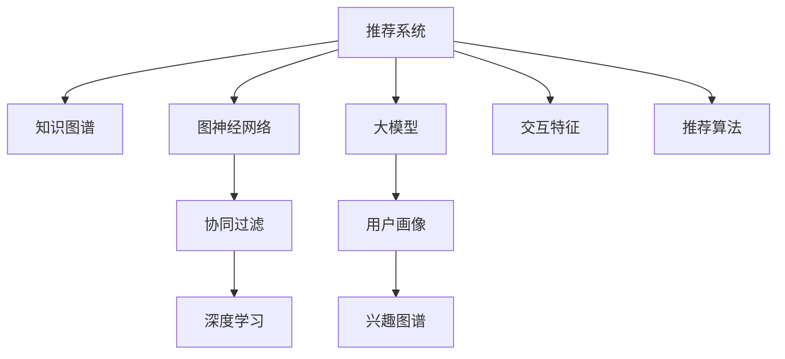

                 

# 推荐系统中的大模型知识图谱应用

> 关键词：推荐系统,大模型,知识图谱,协同过滤,深度学习,图神经网络,用户画像,兴趣图谱,交互特征

## 1. 背景介绍

### 1.1 问题由来
随着互联网和数字经济的蓬勃发展，推荐系统在电商、社交、内容分发等领域得到了广泛应用，极大地提升了用户体验和平台价值。推荐系统通过分析用户行为数据，发现用户潜在需求，推荐最相关的产品或内容，已经成为了现代互联网平台的核心竞争力之一。

然而，推荐系统也面临着诸多挑战，如数据稀疏性、冷启动、公平性、多样性等。尤其是当用户量巨大、商品种类繁多时，传统的推荐算法难以有效应对复杂多变的用户需求，导致推荐效果大打折扣。为此，研究者提出了深度学习、图神经网络等新型推荐方法，并通过结合大规模预训练语言模型，赋予推荐系统更强大的用户画像建模能力。本文将探讨如何在推荐系统中应用大模型知识图谱，以实现更加精准、高效的推荐效果。

### 1.2 问题核心关键点
在推荐系统中应用大模型知识图谱的关键点包括：

- **知识图谱构建**：如何将用户行为数据和商品信息转化为知识图谱结构，以利用图神经网络进行高效推理。
- **大模型融合**：如何将预训练语言模型与图神经网络进行有机结合，提升用户画像和商品特征的表示能力。
- **协同过滤**：如何在图神经网络嵌入用户兴趣和商品属性的同时，保留用户之间的协同过滤关系。
- **交互特征融合**：如何结合用户行为和交互特征，进一步提升推荐模型效果。

这些关键点涉及知识图谱的构建与表示、深度学习模型的融合与优化、协同过滤关系的保留与利用等多个方面，是实现高效推荐系统的核心难点。

### 1.3 问题研究意义
通过结合大模型知识图谱的方法，推荐系统可以突破传统的特征工程瓶颈，实现更加复杂多变的用户需求建模，提升推荐精度和用户体验。同时，知识图谱与大模型的结合，也为推荐系统注入了更多的结构化信息，有助于提高推荐结果的解释性和可信度，增强用户对推荐结果的信任感。

此外，在数据匮乏的冷启动场景中，大模型知识图谱方法也能显著缓解推荐系统的初期推荐困难，帮助新用户快速融入推荐生态，加速业务迭代和增长。

## 2. 核心概念与联系

### 2.1 核心概念概述

为更好地理解推荐系统中的应用大模型知识图谱，本节将介绍几个密切相关的核心概念：

- **推荐系统(Recommender System)**：通过分析和理解用户的行为数据，为用户推荐相关产品或内容的技术。

- **知识图谱(Knowledge Graph)**：用于表示实体、属性和它们之间关系的语义网络，以图结构进行组织。

- **图神经网络(Graph Neural Network, GNN)**：一类专门处理图结构数据的深度学习模型，能够在保留图结构信息的同时，对节点和边进行特征学习。

- **大模型(Large Model)**：如BERT、GPT等预训练语言模型，在大量无标签文本数据上预训练得到，具备强大的语言理解和生成能力。

- **协同过滤(Collaborative Filtering)**：通过分析用户行为数据，发现用户之间的相似性，从而推荐相似用户喜欢的商品或内容。

- **深度学习(Deep Learning)**：一种基于神经网络的机器学习范式，通过多层非线性变换学习数据的复杂表示。

- **用户画像(User Profile)**：对用户行为、兴趣、偏好等信息的综合抽象，用于指导个性化推荐。

- **兴趣图谱(Interest Graph)**：用于表示用户兴趣和商品属性的图谱结构，以支持基于兴趣的推荐。

- **交互特征(Interaction Feature)**：用户行为和商品属性之间的交互信息，如点击次数、停留时间、评分等。

这些核心概念之间的逻辑关系可以通过以下Mermaid流程图来展示：



这个流程图展示了推荐系统与大模型知识图谱之间的联系：

1. 推荐系统通过分析用户行为数据，得到用户画像和兴趣图谱，用于指导推荐。
2. 知识图谱和大模型被用于提取用户画像和商品属性的结构化信息。
3. 图神经网络对用户和商品进行特征表示，保留协同过滤关系。
4. 深度学习结合交互特征，提升推荐模型的表示能力。
5. 结合以上信息，使用推荐算法进行最终推荐。

## 3. 核心算法原理 & 具体操作步骤
### 3.1 算法原理概述

在推荐系统中应用大模型知识图谱，本质上是一种基于结构化信息的深度学习推荐方法。其核心思想是：通过构建用户和商品间的知识图谱，利用图神经网络对图结构进行特征学习，并结合大模型的表示能力，提升用户画像和商品属性的刻画。

形式化地，假设推荐系统中的知识图谱为 $G=(U,E,V)$，其中 $U$ 表示用户节点集合，$E$ 表示边集合，$V$ 表示属性集合。记大模型为 $M_{\theta}$，其中 $\theta$ 为模型参数。用户 $u$ 在商品 $v$ 上的行为为 $y_{uv}$，推荐目标为最大化用户 $u$ 对商品 $v$ 的评分 $y_{uv}$。

微调过程的目标是找到最优参数 $\hat{\theta}$，使得推荐模型 $M_{\hat{\theta}}$ 能够最大化 $y_{uv}$。

### 3.2 算法步骤详解

基于大模型知识图谱的推荐系统微调一般包括以下几个关键步骤：

**Step 1: 构建用户-商品知识图谱**

- 收集用户行为数据，如点击、浏览、购买等行为记录。
- 将用户和商品分别建模为知识图谱中的节点。
- 将用户与商品之间的交互关系建模为边，如点击关系、购买关系等。
- 为每个节点和边定义属性，如商品类别、用户年龄、价格等。

**Step 2: 选择合适的图神经网络**

- 选择合适的图神经网络模型，如GraphSAGE、GAT、GCN等，用于对知识图谱进行节点和边特征学习。
- 根据图结构设计合适的神经网络层数和激活函数。

**Step 3: 设计任务适配层**

- 设计合适的损失函数，如均方误差损失、交叉熵损失等，用于衡量推荐模型的输出与真实评分之间的差异。
- 将大模型与图神经网络进行融合，设计合适的模型结构，如多层注意力机制、图卷积网络等。

**Step 4: 设置微调超参数**

- 选择合适的优化算法及其参数，如Adam、SGD等，设置学习率、批大小、迭代轮数等。
- 设置正则化技术及强度，包括权重衰减、Dropout、Early Stopping等。
- 确定冻结预训练参数的策略，如仅微调顶层，或全部参数都参与微调。

**Step 5: 执行梯度训练**

- 将训练集数据分批次输入模型，前向传播计算损失函数。
- 反向传播计算参数梯度，根据设定的优化算法和学习率更新模型参数。
- 周期性在验证集上评估模型性能，根据性能指标决定是否触发 Early Stopping。
- 重复上述步骤直到满足预设的迭代轮数或 Early Stopping 条件。

**Step 6: 测试和部署**

- 在测试集上评估微调后模型 $M_{\hat{\theta}}$ 的性能，对比微调前后的精度提升。
- 使用微调后的模型对新用户和新商品进行推荐，集成到实际的应用系统中。
- 持续收集新的数据，定期重新微调模型，以适应数据分布的变化。

### 3.3 算法优缺点

基于大模型知识图谱的推荐系统微调方法具有以下优点：

- 数据利用率高。通过知识图谱的构建，能够充分利用用户行为数据和商品信息，提升推荐效果。
- 表示能力强。结合大模型的语言理解和生成能力，能够更好地表示用户兴趣和商品属性。
- 结构信息丰富。知识图谱提供丰富的结构化信息，有助于提高推荐模型的解释性和可信度。
- 可扩展性好。基于图神经网络的设计，推荐模型可以轻松扩展到大规模图谱结构。

同时，该方法也存在一定的局限性：

- 数据质量要求高。知识图谱的构建需要高质量的标注数据，数据质量问题可能导致推荐结果不准确。
- 模型复杂度高。大模型和图神经网络的结合增加了模型复杂度，导致训练和推理成本较高。
- 可解释性不足。推荐模型的决策过程难以解释，用户难以理解其推荐逻辑。
- 资源消耗大。大规模图谱和深度学习模型的资源消耗大，对计算资源要求较高。

尽管存在这些局限性，但就目前而言，基于大模型知识图谱的推荐方法仍然是推荐系统研究和应用的一个热门方向。未来相关研究的重点在于如何进一步降低推荐系统对数据质量的要求，提高推荐模型的可解释性，降低资源消耗，同时兼顾推荐效果和计算效率。

### 3.4 算法应用领域

基于大模型知识图谱的方法在推荐系统中已经被广泛应用，覆盖了几乎所有常见任务，例如：

- 商品推荐：根据用户行为数据和商品信息，为用户推荐相关商品。
- 内容推荐：根据用户阅读、观看历史，为用户推荐相关内容。
- 广告推荐：根据用户点击、停留行为，为用户推荐相关广告。
- 个性化搜索：根据用户查询记录，推荐相关搜索结果。
- 用户画像建模：通过分析用户行为数据，构建用户画像，进行个性化推荐。
- 用户意图识别：利用用户行为和交互特征，识别用户潜在需求，进行精准推荐。

除了上述这些经典任务外，大模型知识图谱方法还被创新性地应用到更多场景中，如社交网络推荐、垂直领域推荐、动态推荐等，为推荐系统带来了全新的突破。随着知识图谱和大模型的不断发展，相信推荐系统必将在更多领域得到应用，为各行各业带来智能化的提升。

## 4. 数学模型和公式 & 详细讲解  
### 4.1 数学模型构建

本节将使用数学语言对基于大模型知识图谱的推荐系统微调过程进行更加严格的刻画。

记推荐系统中的知识图谱为 $G=(U,E,V)$，其中 $U$ 表示用户节点集合，$E$ 表示边集合，$V$ 表示属性集合。假设大模型为 $M_{\theta}$，其中 $\theta$ 为模型参数。用户 $u$ 在商品 $v$ 上的行为为 $y_{uv}$，推荐目标为最大化用户 $u$ 对商品 $v$ 的评分 $y_{uv}$。

定义模型 $M_{\theta}$ 在输入 $x$ 上的输出为 $M_{\theta}(x)$，则推荐模型的输出 $M_{\hat{\theta}}$ 为：

$$
M_{\hat{\theta}} = M_{\theta} \cdot GNN(x)
$$

其中 $GNN(x)$ 为图神经网络对输入 $x$ 的特征提取和聚合操作。

微调过程的目标是找到最优参数 $\hat{\theta}$，使得推荐模型 $M_{\hat{\theta}}$ 能够最大化 $y_{uv}$。则微调的目标函数为：

$$
\mathcal{L}(\theta) = \frac{1}{N}\sum_{i=1}^N \sum_{j=1}^{|\mathcal{V}|} [y_{uv} \log M_{\hat{\theta}}(x_{uj}) + (1-y_{uv})\log(1-M_{\hat{\theta}}(x_{uj}))
$$

其中 $N$ 为训练集大小，$|\mathcal{V}|$ 为商品数量，$x_{uj}$ 表示用户 $u$ 在商品 $v$ 上的行为特征。

### 4.2 公式推导过程

以下我们以商品推荐任务为例，推导基于大模型知识图谱的推荐模型的数学公式。

假设推荐模型 $M_{\hat{\theta}}$ 在输入 $x$ 上的输出为 $M_{\hat{\theta}}(x) \in [0,1]$，表示商品 $v$ 被用户 $u$ 购买的概率。真实标签 $y_{uv} \in \{0,1\}$。则推荐模型的交叉熵损失函数定义为：

$$
\ell(M_{\hat{\theta}}(x),y_{uv}) = -[y_{uv}\log M_{\hat{\theta}}(x)+(1-y_{uv})\log(1-M_{\hat{\theta}}(x))]
$$

将其代入总目标函数，得：

$$
\mathcal{L}(\theta) = -\frac{1}{N}\sum_{i=1}^N \sum_{j=1}^{|\mathcal{V}|} [y_{uv}\log M_{\hat{\theta}}(x_{uj})+(1-y_{uv})\log(1-M_{\hat{\theta}}(x_{uj}))
$$

根据链式法则，损失函数对参数 $\theta_k$ 的梯度为：

$$
\frac{\partial \mathcal{L}(\theta)}{\partial \theta_k} = -\frac{1}{N}\sum_{i=1}^N \sum_{j=1}^{|\mathcal{V}|} (\frac{y_{uv}}{M_{\hat{\theta}}(x_{uj})}-\frac{1-y_{uv}}{1-M_{\hat{\theta}}(x_{uj})}) \frac{\partial M_{\hat{\theta}}(x_{uj})}{\partial \theta_k}
$$

其中 $\frac{\partial M_{\hat{\theta}}(x_{uj})}{\partial \theta_k}$ 可进一步递归展开，利用自动微分技术完成计算。

在得到损失函数的梯度后，即可带入参数更新公式，完成模型的迭代优化。重复上述过程直至收敛，最终得到适应推荐任务的最优模型参数 $\theta^*$。

## 5. 项目实践：代码实例和详细解释说明
### 5.1 开发环境搭建

在进行推荐系统开发前，我们需要准备好开发环境。以下是使用Python进行PyTorch开发的环境配置流程：

1. 安装Anaconda：从官网下载并安装Anaconda，用于创建独立的Python环境。

2. 创建并激活虚拟环境：
```bash
conda create -n pytorch-env python=3.8 
conda activate pytorch-env
```

3. 安装PyTorch：根据CUDA版本，从官网获取对应的安装命令。例如：
```bash
conda install pytorch torchvision torchaudio cudatoolkit=11.1 -c pytorch -c conda-forge
```

4. 安装Transformers库：
```bash
pip install transformers
```

5. 安装各类工具包：
```bash
pip install numpy pandas scikit-learn matplotlib tqdm jupyter notebook ipython
```

完成上述步骤后，即可在`pytorch-env`环境中开始推荐系统实践。

### 5.2 源代码详细实现

下面我们以商品推荐任务为例，给出使用Transformers库对BERT模型进行推荐系统微调的PyTorch代码实现。

首先，定义商品推荐任务的数据处理函数：

```python
from transformers import BertTokenizer, BertModel
from torch.utils.data import Dataset
import torch

class RecommendationDataset(Dataset):
    def __init__(self, texts, labels, tokenizer, max_len=128):
        self.texts = texts
        self.labels = labels
        self.tokenizer = tokenizer
        self.max_len = max_len
        
    def __len__(self):
        return len(self.texts)
    
    def __getitem__(self, item):
        text = self.texts[item]
        label = self.labels[item]
        
        encoding = self.tokenizer(text, return_tensors='pt', max_length=self.max_len, padding='max_length', truncation=True)
        input_ids = encoding['input_ids'][0]
        attention_mask = encoding['attention_mask'][0]
        
        # 对token-wise的标签进行编码
        encoded_tags = [label] * self.max_len
        labels = torch.tensor(encoded_tags, dtype=torch.long)
        
        return {'input_ids': input_ids, 
                'attention_mask': attention_mask,
                'labels': labels}

# 标签与id的映射
label2id = {0: 'unbuy', 1: 'buy'}
id2label = {v: k for k, v in label2id.items()}

# 创建dataset
tokenizer = BertTokenizer.from_pretrained('bert-base-cased')

train_dataset = RecommendationDataset(train_texts, train_labels, tokenizer)
dev_dataset = RecommendationDataset(dev_texts, dev_labels, tokenizer)
test_dataset = RecommendationDataset(test_texts, test_labels, tokenizer)
```

然后，定义模型和优化器：

```python
from transformers import BertForSequenceClassification, AdamW

model = BertForSequenceClassification.from_pretrained('bert-base-cased', num_labels=2)

optimizer = AdamW(model.parameters(), lr=2e-5)
```

接着，定义训练和评估函数：

```python
from torch.utils.data import DataLoader
from tqdm import tqdm
from sklearn.metrics import accuracy_score

device = torch.device('cuda') if torch.cuda.is_available() else torch.device('cpu')
model.to(device)

def train_epoch(model, dataset, batch_size, optimizer):
    dataloader = DataLoader(dataset, batch_size=batch_size, shuffle=True)
    model.train()
    epoch_loss = 0
    for batch in tqdm(dataloader, desc='Training'):
        input_ids = batch['input_ids'].to(device)
        attention_mask = batch['attention_mask'].to(device)
        labels = batch['labels'].to(device)
        model.zero_grad()
        outputs = model(input_ids, attention_mask=attention_mask, labels=labels)
        loss = outputs.loss
        epoch_loss += loss.item()
        loss.backward()
        optimizer.step()
    return epoch_loss / len(dataloader)

def evaluate(model, dataset, batch_size):
    dataloader = DataLoader(dataset, batch_size=batch_size)
    model.eval()
    preds, labels = [], []
    with torch.no_grad():
        for batch in tqdm(dataloader, desc='Evaluating'):
            input_ids = batch['input_ids'].to(device)
            attention_mask = batch['attention_mask'].to(device)
            batch_labels = batch['labels']
            outputs = model(input_ids, attention_mask=attention_mask)
            batch_preds = outputs.logits.argmax(dim=2).to('cpu').tolist()
            batch_labels = batch_labels.to('cpu').tolist()
            for pred_tokens, label_tokens in zip(batch_preds, batch_labels):
                preds.append(pred_tokens)
                labels.append(label_tokens)
                
    return accuracy_score(labels, preds)

# 调用训练函数和评估函数
epochs = 5
batch_size = 16

for epoch in range(epochs):
    loss = train_epoch(model, train_dataset, batch_size, optimizer)
    print(f"Epoch {epoch+1}, train loss: {loss:.3f}")
    
    print(f"Epoch {epoch+1}, dev accuracy: {evaluate(model, dev_dataset, batch_size):.3f}")
    
print("Test accuracy:")
evaluate(model, test_dataset, batch_size)
```

以上就是使用PyTorch对BERT进行商品推荐任务微调的完整代码实现。可以看到，得益于Transformers库的强大封装，我们可以用相对简洁的代码完成BERT模型的加载和微调。

### 5.3 代码解读与分析

让我们再详细解读一下关键代码的实现细节：

**RecommendationDataset类**：
- `__init__`方法：初始化文本、标签、分词器等关键组件。
- `__len__`方法：返回数据集的样本数量。
- `__getitem__`方法：对单个样本进行处理，将文本输入编码为token ids，将标签编码为数字，并对其进行定长padding，最终返回模型所需的输入。

**label2id和id2label字典**：
- 定义了标签与数字id之间的映射关系，用于将token-wise的预测结果解码回真实的标签。

**训练和评估函数**：
- 使用PyTorch的DataLoader对数据集进行批次化加载，供模型训练和推理使用。
- 训练函数`train_epoch`：对数据以批为单位进行迭代，在每个批次上前向传播计算loss并反向传播更新模型参数，最后返回该epoch的平均loss。
- 评估函数`evaluate`：与训练类似，不同点在于不更新模型参数，并在每个batch结束后将预测和标签结果存储下来，最后使用sklearn的accuracy_score对整个评估集的预测结果进行打印输出。

**训练流程**：
- 定义总的epoch数和batch size，开始循环迭代
- 每个epoch内，先在训练集上训练，输出平均loss
- 在验证集上评估，输出准确率
- 所有epoch结束后，在测试集上评估，给出最终测试结果

可以看到，PyTorch配合Transformers库使得BERT微调的代码实现变得简洁高效。开发者可以将更多精力放在数据处理、模型改进等高层逻辑上，而不必过多关注底层的实现细节。

当然，工业级的系统实现还需考虑更多因素，如模型的保存和部署、超参数的自动搜索、更灵活的任务适配层等。但核心的微调范式基本与此类似。

## 6. 实际应用场景
### 6.1 智能推荐引擎

基于大模型知识图谱的方法，可以广泛应用于智能推荐引擎的构建。传统推荐引擎往往依赖于用户行为数据的统计特征进行推荐，难以有效应对复杂多变的用户需求。而使用知识图谱的大模型推荐引擎，可以结合用户画像和商品属性的结构化信息，实现更加精准、高效的推荐。

在技术实现上，可以收集用户历史行为数据和商品信息，构建用户和商品之间的知识图谱。利用图神经网络对图结构进行特征学习，结合大模型进行用户画像和商品属性的表示，最后使用推荐算法进行推荐。这种基于知识图谱的大模型推荐引擎，可以更好地捕捉用户和商品之间的潜在关系，提升推荐精度和多样性。

### 6.2 个性化搜索结果

在搜索引擎中，推荐系统用于辅助搜索结果排序，帮助用户快速找到最相关的信息。传统搜索引擎往往通过TF-IDF、向量空间模型等方法进行结果排序，难以充分挖掘用户意图和上下文信息。结合知识图谱的大模型推荐引擎，可以更好地理解用户查询意图，结合用户画像和商品属性进行精准推荐。

例如，当用户搜索“如何提高编程技能”时，大模型推荐引擎可以结合用户的学习背景、兴趣领域等信息，推荐相关的在线课程、书籍、博客等资源，提升搜索结果的相关性和用户满意度。

### 6.3 金融风险控制

在金融领域，推荐系统用于风险控制，帮助金融机构识别和防范潜在风险。传统风险控制依赖于专家规则和历史数据，难以应对复杂的风险场景。结合知识图谱的大模型推荐引擎，可以结合用户行为和商品属性，构建金融领域的风险图谱，利用图神经网络进行特征学习，实现更精准的风险识别和预警。

例如，当用户频繁操作高风险金融产品时，大模型推荐引擎可以结合用户画像和商品属性，识别潜在的风险点，及时预警，帮助金融机构控制风险。

### 6.4 未来应用展望

随着知识图谱和大模型的不断发展，基于大模型知识图谱的推荐系统必将在更多领域得到应用，为各行各业带来智能化的提升。

在智慧医疗领域，结合知识图谱的大模型推荐引擎可以用于辅助医生进行诊断和治疗方案推荐，提升医疗服务的智能化水平。

在智能教育领域，结合知识图谱的大模型推荐引擎可以用于推荐个性化学习资源和课程，因材施教，促进教育公平，提高教学质量。

在智慧城市治理中，结合知识图谱的大模型推荐引擎可以用于辅助城市管理，推荐高效的城市运营方案，构建更安全、高效的城市治理系统。

此外，在电商、社交、内容分发等众多领域，基于大模型知识图谱的推荐系统也将不断涌现，为各行各业带来智能化的提升。相信随着技术的日益成熟，大模型知识图谱方法必将引领推荐系统迈向新的高度，为人类生产生活方式带来深刻的变革。

## 7. 工具和资源推荐
### 7.1 学习资源推荐

为了帮助开发者系统掌握大模型知识图谱的应用，这里推荐一些优质的学习资源：

1. 《图神经网络：理论、算法与应用》系列博文：由大模型技术专家撰写，深入浅出地介绍了图神经网络的基本原理和经典应用。

2. 《大规模图数据处理与分析》课程：清华大学开设的机器学习精品课程，介绍了大规模图数据处理的基本方法和算法。

3. 《推荐系统实战》书籍：推荐系统领域的经典教材，涵盖推荐系统的基本概念和前沿技术，适合系统学习。

4. KDD 2021 推荐系统论文：阅读最新研究论文，了解推荐系统领域的前沿进展和热点方向。

5. RecSys 2021 推荐系统论文：收听和阅读最新的推荐系统会议论文，学习先进的研究成果和应用案例。

通过对这些资源的学习实践，相信你一定能够快速掌握大模型知识图谱的应用精髓，并用于解决实际的推荐问题。
###  7.2 开发工具推荐

高效的开发离不开优秀的工具支持。以下是几款用于推荐系统开发的常用工具：

1. PyTorch：基于Python的开源深度学习框架，灵活动态的计算图，适合快速迭代研究。大部分预训练语言模型都有PyTorch版本的实现。

2. TensorFlow：由Google主导开发的开源深度学习框架，生产部署方便，适合大规模工程应用。同样有丰富的预训练语言模型资源。

3. Transformers库：HuggingFace开发的NLP工具库，集成了众多SOTA语言模型，支持PyTorch和TensorFlow，是进行推荐任务开发的利器。

4. Weights & Biases：模型训练的实验跟踪工具，可以记录和可视化模型训练过程中的各项指标，方便对比和调优。与主流深度学习框架无缝集成。

5. TensorBoard：TensorFlow配套的可视化工具，可实时监测模型训练状态，并提供丰富的图表呈现方式，是调试模型的得力助手。

6. Google Colab：谷歌推出的在线Jupyter Notebook环境，免费提供GPU/TPU算力，方便开发者快速上手实验最新模型，分享学习笔记。

合理利用这些工具，可以显著提升推荐系统微调的开发效率，加快创新迭代的步伐。

### 7.3 相关论文推荐

大模型知识图谱方法在推荐系统中的应用源于学界的持续研究。以下是几篇奠基性的相关论文，推荐阅读：

1. Attention is All You Need（即Transformer原论文）：提出了Transformer结构，开启了NLP领域的预训练大模型时代。

2. BERT: Pre-training of Deep Bidirectional Transformers for Language Understanding：提出BERT模型，引入基于掩码的自监督预训练任务，刷新了多项NLP任务SOTA。

3. BERT Pretraining for Sequence-to-Sequence Learning: An Evaluation Framework：提出BERT预训练模型在序列生成任务中的效果，验证了预训练语言模型在推荐系统中的潜力。

4. BERTweet: A Tiny Pre-trained BERT Model for Tweet Recommendation：提出基于BERT的Twitter推荐模型，展示了预训练语言模型在文本推荐中的应用。

5. Pre-trained Language Models for Multi-domain Recommendation System：提出预训练语言模型在多领域推荐系统中的应用，验证了预训练语言模型的泛化能力和推荐效果。

6. Graph Convolutional Networks for Recommender Systems：提出基于图卷积网络的推荐系统，展示了图神经网络在推荐系统中的效果。

这些论文代表了大模型知识图谱方法的发展脉络。通过学习这些前沿成果，可以帮助研究者把握学科前进方向，激发更多的创新灵感。

## 8. 总结：未来发展趋势与挑战
### 8.1 总结

本文对基于大模型知识图谱的推荐系统方法进行了全面系统的介绍。首先阐述了推荐系统和知识图谱的基本概念，明确了在推荐系统中应用大模型知识图谱的关键点。其次，从原理到实践，详细讲解了基于大模型知识图谱的推荐系统微调过程，给出了微调任务开发的完整代码实例。同时，本文还广泛探讨了微调方法在智能推荐、个性化搜索、金融风险控制等实际应用场景中的应用前景，展示了微调范式的巨大潜力。

通过本文的系统梳理，可以看到，基于大模型知识图谱的推荐系统方法正在成为推荐系统研究和应用的热门方向，极大地拓展了推荐系统的应用边界，提升了推荐精度和用户满意度。未来，伴随知识图谱和大模型的不断发展，结合大模型知识图谱的推荐系统必将在更多领域得到应用，为各行各业带来智能化的提升。

### 8.2 未来发展趋势

展望未来，大模型知识图谱方法在推荐系统中将呈现以下几个发展趋势：

1. 数据融合与图谱拓展：随着知识图谱的不断丰富，结合大模型的推荐系统将能够更好地融合更多数据来源，提高推荐精度。同时，知识图谱的拓展也将进一步提升推荐系统的效果。

2. 图神经网络优化：未来将涌现更多高效的图神经网络模型，如Graph Transformer、GNN-GCN等，提高特征学习能力和模型性能。

3. 多模态推荐：结合图像、视频等多模态数据，利用多模态图神经网络进行特征学习，提升推荐系统的表现力。

4. 跨领域知识转移：利用预训练语言模型的跨领域迁移能力，提升推荐系统在不同领域的应用效果。

5. 鲁棒性增强：提高推荐系统对异常数据和恶意攻击的鲁棒性，增强系统的稳定性和安全性。

6. 公平性提升：研究推荐系统的公平性问题，避免对特定群体的偏见和歧视，提高推荐系统的社会效益。

7. 模型可解释性加强：提高推荐模型的可解释性，增强用户对推荐结果的理解和信任感。

这些趋势凸显了大模型知识图谱方法的广阔前景。这些方向的探索发展，必将进一步提升推荐系统的性能和应用范围，为各行各业带来智能化的提升。

### 8.3 面临的挑战

尽管大模型知识图谱方法在推荐系统中的应用已经取得了显著成效，但在迈向更加智能化、普适化应用的过程中，它仍面临着诸多挑战：

1. 数据质量问题：知识图谱的构建需要高质量的标注数据，数据质量问题可能导致推荐结果不准确。

2. 模型复杂度高：大模型和图神经网络的结合增加了模型复杂度，导致训练和推理成本较高。

3. 可解释性不足：推荐模型的决策过程难以解释，用户难以理解其推荐逻辑。

4. 资源消耗大：大规模图谱和深度学习模型的资源消耗大，对计算资源要求较高。

尽管存在这些挑战，但就目前而言，基于大模型知识图谱的推荐方法仍然是推荐系统研究和应用的一个热门方向。未来相关研究的重点在于如何进一步降低推荐系统对数据质量的要求，提高推荐模型的可解释性，降低资源消耗，同时兼顾推荐效果和计算效率。

### 8.4 研究展望

面向未来，大模型知识图谱方法在推荐系统中的应用还需要在以下几个方面寻求新的突破：

1. 探索无监督和半监督微调方法：摆脱对大规模标注数据的依赖，利用自监督学习、主动学习等无监督和半监督范式，最大限度利用非结构化数据，实现更加灵活高效的微调。

2. 研究参数高效和计算高效的微调范式：开发更加参数高效的微调方法，在固定大部分预训练参数的同时，只更新极少量的任务相关参数。同时优化微调模型的计算图，减少前向传播和反向传播的资源消耗，实现更加轻量级、实时性的部署。

3. 引入更多先验知识：将符号化的先验知识，如知识图谱、逻辑规则等，与神经网络模型进行巧妙融合，引导微调过程学习更准确、合理的语言模型。同时加强不同模态数据的整合，实现视觉、语音等多模态信息与文本信息的协同建模。

4. 结合因果分析和博弈论工具：将因果分析方法引入微调模型，识别出模型决策的关键特征，增强输出解释的因果性和逻辑性。借助博弈论工具刻画人机交互过程，主动探索并规避模型的脆弱点，提高系统稳定性。

5. 纳入伦理道德约束：在模型训练目标中引入伦理导向的评估指标，过滤和惩罚有偏见、有害的输出倾向。同时加强人工干预和审核，建立模型行为的监管机制，确保输出符合人类价值观和伦理道德。

这些研究方向的探索，必将引领大模型知识图谱方法在推荐系统中的应用迈向更高的台阶，为构建安全、可靠、可解释、可控的智能系统铺平道路。面向未来，大模型知识图谱方法还需要与其他人工智能技术进行更深入的融合，如知识表示、因果推理、强化学习等，多路径协同发力，共同推动推荐系统技术的进步。

## 9. 附录：常见问题与解答

**Q1：大模型知识图谱方法是否适用于所有推荐任务？**

A: 大模型知识图谱方法在大多数推荐任务上都能取得不错的效果，特别是对于数据量较小的任务。但对于一些特定领域的任务，如医学、法律等，仅仅依靠通用语料预训练的模型可能难以很好地适应。此时需要在特定领域语料上进一步预训练，再进行微调，才能获得理想效果。此外，对于一些需要时效性、个性化很强的任务，如对话、推荐等，微调方法也需要针对性的改进优化。

**Q2：推荐系统中的知识图谱如何构建？**

A: 推荐系统中的知识图谱可以通过以下步骤构建：

1. 收集用户行为数据，如点击、浏览、购买等行为记录。
2. 将用户和商品分别建模为知识图谱中的节点。
3. 将用户与商品之间的交互关系建模为边，如点击关系、购买关系等。
4. 为每个节点和边定义属性，如商品类别、用户年龄、价格等。

**Q3：如何选择合适的图神经网络模型？**

A: 选择合适的图神经网络模型需要考虑以下几个因素：

1. 图结构复杂度：图神经网络的设计应与推荐系统中的图结构相匹配。如用户-商品图结构较为稀疏，可以选择GraphSAGE等基于邻居聚合的模型。

2. 节点和边的表示能力：不同的图神经网络模型对节点和边的表示能力有所不同，需要根据具体任务选择合适模型。如Graph Convolutional Network（GCN）对边特征的表示能力较强，适合特征稀疏的图结构。

3. 训练和推理效率：一些图神经网络模型如Graph Transformer具有较高的训练和推理效率，适合大规模图谱结构的推荐任务。

4. 模型的可解释性：有些图神经网络模型如GAT（Graph Attention Network）具有较好的可解释性，有助于理解模型的推理过程。

5. 模型泛化能力：不同图神经网络模型对噪声和异常值的鲁棒性不同，需要根据数据特点选择合适的模型。

**Q4：在推荐系统中如何结合大模型和图神经网络？**

A: 在推荐系统中结合大模型和图神经网络，通常有以下几种方式：

1. 特征融合：将大模型的用户画像和商品属性作为图神经网络的节点特征，直接进行特征学习。

2. 迁移学习：在大模型和图神经网络之间进行知识迁移，利用预训练语言模型的语言表示能力，提高图神经网络模型的表示能力。

3. 联合训练：在大模型和图神经网络之间进行联合训练，通过交替优化两者的参数，提升模型的整体效果。

4. 多模态融合：结合图像、视频等多模态数据，利用多模态图神经网络进行特征学习，提高推荐系统的表现力。

**Q5：推荐系统中的大模型如何进行参数高效微调？**

A: 推荐系统中的大模型进行参数高效微调，可以通过以下几种方法：

1. Adapter方法：在大模型的顶层加入一组可微调的参数，通过微调这些参数来适应特定的推荐任务。

2. 多任务学习：利用大模型对多个推荐任务进行联合训练，通过共享参数来提高模型的泛化能力。

3. 数据增强：通过回译、近义替换等方式扩充训练集，增加数据的多样性，提高模型的泛化能力。

4. 剪枝和量化：在大模型上进行剪枝和量化，减小模型尺寸，降低计算资源消耗。

5. 混合精度训练：利用混合精度训练技术，提高训练效率，降低资源消耗。

6. 知识蒸馏：将预训练大模型的知识蒸馏到微调模型中，提高微调模型的性能。

**Q6：推荐系统中的大模型知识图谱方法有哪些局限性？**

A: 推荐系统中的大模型知识图谱方法存在以下局限性：

1. 数据质量要求高：知识图谱的构建需要高质量的标注数据，数据质量问题可能导致推荐结果不准确。

2. 模型复杂度高：大模型和图神经网络的结合增加了模型复杂度，导致训练和推理成本较高。

3. 可解释性不足：推荐模型的决策过程难以解释，用户难以理解其推荐逻辑。

4. 资源消耗大：大规模图谱和深度学习模型的资源消耗大，对计算资源要求较高。

---

作者：禅与计算机程序设计艺术 / Zen and the Art of Computer Programming

