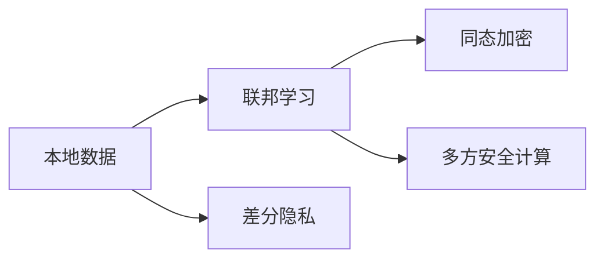

                 

# 推荐系统中的大模型联邦学习与隐私保护

## 1. 背景介绍

### 1.1 问题由来
推荐系统是互联网公司为用户提供个性化推荐服务的重要工具。随着用户规模的不断扩大，推荐系统需要处理的数据量也呈指数级增长，如何在不泄露用户隐私的前提下进行高质量推荐，成为推荐系统的核心难题。

在传统推荐系统中，用户数据通常集中存储在单一的数据中心，但由于单个数据中心的存储和计算能力有限，无法应对海量数据和实时计算的需求。为了解决这一问题，联邦学习(Federated Learning)作为一种分布式学习范式，通过在多个分布式节点上并行训练模型，最大化利用本地数据，降低对中央数据中心的依赖。

然而，由于推荐系统涉及大量的用户行为数据，这些数据往往包含用户的隐私信息，如果直接将数据传输到中央服务器进行模型训练，存在严重的隐私泄露风险。为了保护用户隐私，推荐系统中的联邦学习需要引入隐私保护技术，如差分隐私、同态加密、多方安全计算等。

本论文将深入探讨大模型在推荐系统中的应用，以及如何在联邦学习框架下，实现高效的隐私保护推荐系统。

### 1.2 问题核心关键点
联邦学习和大模型推荐系统涉及的核心问题包括：
- 如何设计合适的联邦学习架构，最大化本地数据利用率，同时减少对中央服务器的依赖。
- 如何在联邦学习过程中，保证模型参数和用户数据的安全性和隐私性。
- 如何优化模型训练效率，提升推荐系统性能。

## 2. 核心概念与联系

### 2.1 核心概念概述

为更好地理解大模型联邦学习与隐私保护的实现过程，本节将介绍几个关键概念：

- **联邦学习(Federated Learning)**：一种分布式机器学习方法，通过在多个本地设备或服务器上并行训练模型，而不是将数据传输到中央服务器，以保护数据隐私。联邦学习通过聚合本地模型参数进行全局模型更新，各本地节点保持本地数据和模型隐私。

- **差分隐私(Differential Privacy)**：一种隐私保护技术，通过添加噪声扰动，使得单一用户数据泄露对全局模型的影响可以忽略不计，从而保护用户隐私。

- **同态加密(Homomorphic Encryption)**：一种加密技术，可以在加密数据上进行计算，计算结果解密后仍与对原始数据直接计算的结果相同，用于保护计算过程中数据隐私。

- **多方安全计算(Multiparty Secure Computation)**：一种密码学协议，允许多个参与方在不泄露自身数据的情况下，合作计算一个共同的结果。

这些核心概念通过Mermaid流程图关联起来：



这个流程图展示了本地数据在联邦学习过程中如何通过隐私保护技术进行保护。

## 3. 核心算法原理 & 具体操作步骤
### 3.1 算法原理概述

大模型联邦学习与隐私保护的推荐系统，核心思想是通过联邦学习在多个本地设备上并行训练推荐模型，同时在本地设备上应用隐私保护技术，防止用户隐私泄露。

形式化地，假设推荐系统包含 $N$ 个本地设备，每个设备有本地数据集 $D_i$，全局模型为 $M_{\theta}$，其中 $\theta$ 为模型参数。联邦学习的目标是找到最优的参数 $\hat{\theta}$，使得全局推荐模型 $M_{\hat{\theta}}$ 在本地数据集上的性能最佳：

$$
\hat{\theta} = \mathop{\arg\min}_{\theta} \mathcal{L}(M_{\theta},D)
$$

其中 $\mathcal{L}$ 为推荐模型在本地数据集上的损失函数。由于各个本地设备的本地数据和计算资源各不相同，因此本地设备需要各自维护一个本地模型 $M_{\theta_i}$，并通过本地更新迭代，生成全局模型 $M_{\hat{\theta}}$。

### 3.2 算法步骤详解

大模型联邦学习与隐私保护的推荐系统，主要包括以下几个关键步骤：

**Step 1: 数据准备与联邦架构设计**
- 收集推荐系统各个本地设备的数据集 $D_i$，进行本地预处理和划分，保证本地数据的质量和一致性。
- 设计联邦学习架构，选择合适的聚合方式（如联邦平均值、联邦梯度聚合等），保证全局模型参数的聚合效果。
- 确定联邦学习的通信协议和数据传输机制，保证数据传输的安全性和隐私性。

**Step 2: 模型初始化和本地训练**
- 在中央服务器上初始化全局推荐模型 $M_{\theta_0}$，各本地设备在本地初始化本地模型 $M_{\theta_{i,0}}$。
- 各本地设备在本地数据集 $D_i$ 上并行训练本地推荐模型 $M_{\theta_i}$，生成本地更新 $\Delta\theta_i$。

**Step 3: 隐私保护和模型聚合**
- 在本地更新 $\Delta\theta_i$ 上应用隐私保护技术，如差分隐私、同态加密等，保护本地数据隐私。
- 将各本地更新 $\Delta\theta_i$ 上传至中央服务器，聚合得到全局更新 $\Delta\theta_{ag}$。
- 对中央服务器上的全局模型 $M_{\theta}$ 进行更新，得到新的全局模型 $M_{\theta+\Delta\theta_{ag}}$。

**Step 4: 模型评估和参数调整**
- 在测试数据集上评估全局推荐模型的性能，根据性能指标调整模型参数。
- 重复以上步骤，直至模型达到预定的性能指标。

### 3.3 算法优缺点

大模型联邦学习与隐私保护的推荐系统具有以下优点：
1. 增强模型泛化能力。通过联邦学习聚合多个本地设备的数据，利用更广泛的数据分布，提升模型的泛化性能。
2. 降低对中央服务器的依赖。联邦学习分散了数据和计算负担，减少了对中央服务器的依赖，提高了系统的稳定性和可靠性。
3. 保护用户隐私。通过差分隐私、同态加密等隐私保护技术，保护用户数据隐私，符合用户隐私保护需求。
4. 提升推荐系统性能。大模型在推荐系统中的应用，可以显著提升推荐精度和召回率。

同时，该方法也存在一定的局限性：
1. 通信开销较大。各本地设备之间的通信开销较大，可能会影响系统的训练效率。
2. 隐私保护技术复杂。隐私保护技术的应用需要设计复杂的加密算法和协议，增加了系统实现的复杂度。
3. 数据分布差异。各个本地设备的数据分布可能存在差异，影响全局模型的性能。
4. 计算资源不均衡。各本地设备的计算资源差异较大，可能影响全局模型的训练效果。

尽管存在这些局限性，但就目前而言，大模型联邦学习与隐私保护方法在推荐系统中的应用前景广阔，有望推动推荐系统向更加智能化、个性化、隐私保护的方向发展。

### 3.4 算法应用领域

大模型联邦学习与隐私保护的推荐系统，已经在多个领域得到了广泛的应用，例如：

- 电商推荐系统：通过联邦学习汇聚用户行为数据，提升个性化推荐效果，保护用户隐私。
- 新闻推荐系统：结合不同媒体平台的用户行为数据，提升新闻内容推荐质量，保护用户隐私。
- 视频推荐系统：融合多平台用户观看行为数据，提升视频内容推荐精度，保护用户隐私。
- 游戏推荐系统：通过联邦学习聚合不同游戏平台的用户游戏行为数据，提升游戏内容推荐效果，保护用户隐私。

除了上述这些经典应用外，大模型联邦学习与隐私保护方法也在社交网络、金融、医疗等更多领域得到应用，为推荐系统带来新的发展机遇。

## 4. 数学模型和公式 & 详细讲解 & 举例说明

### 4.1 数学模型构建

本节将使用数学语言对大模型联邦学习与隐私保护的推荐系统进行更加严格的刻画。

记推荐系统全局模型为 $M_{\theta}:\mathcal{X} \rightarrow \mathcal{Y}$，其中 $\mathcal{X}$ 为输入空间，$\mathcal{Y}$ 为输出空间，$\theta \in \mathbb{R}^d$ 为模型参数。假设联邦学习包含 $N$ 个本地设备，本地数据集为 $D_i=\{(x_{i,j},y_{i,j})\}_{j=1}^{N_i}, x_{i,j} \in \mathcal{X}, y_{i,j} \in \mathcal{Y}$，其中 $N_i$ 为本地设备 $i$ 的数据量。

定义全局模型在本地数据集上的损失函数为 $\ell_i(M_{\theta},D_i)$，在本地设备 $i$ 上的本地模型更新为 $\Delta\theta_i$，则全局模型更新公式为：

$$
\Delta\theta_{ag} = \mathop{\arg\min}_{\Delta\theta} \sum_{i=1}^N \ell_i(M_{\theta+\Delta\theta},D_i)
$$

在实践中，我们通常使用梯度下降等优化算法进行模型更新，设全局模型初始参数为 $\theta_0$，则全局模型在第 $t$ 次更新后的参数为：

$$
\theta^{(t+1)} = \theta^{(t)} + \Delta\theta_{ag}
$$

### 4.2 公式推导过程

以下我们以二分类推荐任务为例，推导差分隐私联邦学习推荐模型的数学模型。

假设推荐系统全局模型为 $M_{\theta}(x) = \sigma(\theta^T x)$，其中 $\sigma(\cdot)$ 为 sigmoid 函数，$\theta \in \mathbb{R}^d$ 为模型参数，$x \in \mathbb{R}^n$ 为输入特征向量。

定义推荐系统全局模型在本地数据集上的损失函数为：

$$
\ell_i(M_{\theta},D_i) = -\frac{1}{N_i}\sum_{j=1}^{N_i} [y_{i,j}\log M_{\theta}(x_{i,j}) + (1-y_{i,j})\log (1-M_{\theta}(x_{i,j}))
$$

本地模型更新为 $\Delta\theta_i = \nabla_{\theta}\ell_i(M_{\theta},D_i)$，其中 $\nabla_{\theta}\ell_i(M_{\theta},D_i)$ 为全局模型在本地数据集上的梯度。

在本地模型更新 $\Delta\theta_i$ 上应用差分隐私技术，生成差分隐私更新 $\Delta\tilde{\theta}_i$：

$$
\Delta\tilde{\theta}_i = \Delta\theta_i + \mathcal{N}(0,\sigma^2\mathbf{I})
$$

其中 $\mathcal{N}(0,\sigma^2\mathbf{I})$ 为均值为零、方差为 $\sigma^2\mathbf{I}$ 的高斯分布噪声，$\sigma$ 为隐私参数，控制隐私保护的程度。

最终，全局模型更新为：

$$
\Delta\theta_{ag} = \sum_{i=1}^N \Delta\tilde{\theta}_i
$$

### 4.3 案例分析与讲解

考虑一个电商推荐系统，包含 $N$ 个本地设备，每个设备有 $m$ 个用户行为数据，数据集中包含用户ID、商品ID、评分等特征，目标是为每个用户推荐最合适的商品。

**案例1: 差分隐私联邦学习**
假设每个本地设备的数据集 $D_i$ 包含 $m_i$ 个用户行为数据，定义全局模型为二分类模型，输入为 $x_{i,j}=(u_i,v_j)$，其中 $u_i$ 为用户ID，$v_j$ 为商品ID。目标为推荐模型 $M_{\theta}(u_i,v_j)=\sigma(\theta^T x_{i,j})$，预测用户 $u_i$ 对商品 $v_j$ 的评分是否为正。

使用差分隐私联邦学习推荐模型，每个本地设备在本地数据集 $D_i$ 上训练本地模型，生成本地更新 $\Delta\theta_i$。在本地更新 $\Delta\theta_i$ 上添加高斯噪声，生成差分隐私更新 $\Delta\tilde{\theta}_i$。

**案例2: 同态加密联邦学习**
假设每个本地设备的数据集 $D_i$ 包含 $m_i$ 个用户行为数据，定义全局模型为线性回归模型，输入为 $x_{i,j}=(u_i,v_j)$，其中 $u_i$ 为用户ID，$v_j$ 为商品ID。目标为推荐模型 $M_{\theta}(u_i,v_j)=\sigma(\theta^T x_{i,j})$，预测用户 $u_i$ 对商品 $v_j$ 的评分。

使用同态加密联邦学习推荐模型，每个本地设备在本地数据集 $D_i$ 上训练本地模型，生成本地更新 $\Delta\theta_i$。对本地更新 $\Delta\theta_i$ 进行同态加密，生成同态加密更新 $\Delta\tilde{\theta}_i$。

## 5. 项目实践：代码实例和详细解释说明
### 5.1 开发环境搭建

在进行联邦学习推荐系统的实践前，我们需要准备好开发环境。以下是使用Python进行TensorFlow联邦学习环境配置流程：

1. 安装Anaconda：从官网下载并安装Anaconda，用于创建独立的Python环境。

2. 创建并激活虚拟环境：
```bash
conda create -n federated-learning python=3.8 
conda activate federated-learning
```

3. 安装TensorFlow：根据CUDA版本，从官网获取对应的安装命令。例如：
```bash
conda install tensorflow==2.7.0 -c tf -c conda-forge
```

4. 安装TensorFlow Federated：
```bash
pip install tensorflow-federated
```

5. 安装各类工具包：
```bash
pip install numpy pandas scikit-learn matplotlib tqdm jupyter notebook ipython
```

完成上述步骤后，即可在`federated-learning`环境中开始联邦学习推荐系统的实践。

### 5.2 源代码详细实现

下面我们以电商推荐系统为例，给出使用TensorFlow Federated库对联邦学习推荐系统进行实现的Python代码。

首先，定义推荐系统的全局模型和本地模型：

```python
import tensorflow as tf
import tensorflow_federated as tff
import tensorflow_federated.layers as tflayers

# 定义全局模型
class Model(tf.keras.Model):
    def __init__(self):
        super(Model, self).__init__()
        self.layers = [tf.keras.layers.Dense(64, activation='relu'), tf.keras.layers.Dense(1, activation='sigmoid')]
        
    def call(self, x):
        for layer in self.layers:
            x = layer(x)
        return x
    
# 定义本地模型
class LocalModel(Model):
    pass
```

然后，定义本地数据集和本地损失函数：

```python
# 定义本地数据集
def client_data(next_client_data):
    (x_train, y_train) = next_client_data
    return tf.data.Dataset.from_tensor_slices((x_train, y_train))

# 定义本地损失函数
def local_loss_fn(model, data):
    x, y = data
    return tf.keras.losses.binary_crossentropy(y, model(x)), None
```

接着，定义联邦聚合函数和全局损失函数：

```python
# 定义联邦聚合函数
def federated_aggregate_fn(unaggregated_result, state):
    return unaggregated_result

# 定义全局损失函数
def global_loss_fn(model, dataset):
    loss = tf.keras.losses.binary_crossentropy(y_true, model(y_pred))
    return loss
```

最后，启动联邦学习推荐系统的训练流程：

```python
# 创建联邦学习训练循环
iterative_process = tff.learning.build_federated_learning_process(
    model_fn=LocalModel,
    client_data_fn=client_data,
    server_update_fn=federated_aggregate_fn,
    global_loss_fn=global_loss_fn,
    steps_per_epoch=10,
    max_epochs=10,
    state=tflayers.basic_model.TFBasicModel.get_initial_state()
)

# 启动联邦学习推荐系统训练
iterative_process.run(dataset)
```

以上就是使用TensorFlow Federated对联邦学习推荐系统进行实现的完整代码实现。可以看到，TensorFlow Federated为联邦学习提供了强大的封装和优化，使得模型训练变得简单高效。

### 5.3 代码解读与分析

让我们再详细解读一下关键代码的实现细节：

**Model类和LocalModel类**：
- `Model`类：定义全局推荐模型的结构，包含两个全连接层，输出为 sigmoid 函数。
- `LocalModel`类：继承自全局模型，代表本地推荐模型，在本地设备上进行训练。

**client_data函数和local_loss_fn函数**：
- `client_data`函数：定义本地数据集的输入格式，将本地数据集转换为适合联邦学习的数据集格式。
- `local_loss_fn`函数：定义本地损失函数，用于计算每个本地设备的损失值。

**federated_aggregate_fn函数和global_loss_fn函数**：
- `federated_aggregate_fn`函数：定义联邦聚合函数，用于将各个本地设备的更新结果进行聚合，得到全局更新。
- `global_loss_fn`函数：定义全局损失函数，用于计算全局推荐模型在全局数据集上的损失值。

**联邦学习训练循环**：
- `iterative_process.run(dataset)`：启动联邦学习训练循环，循环中每个迭代包含本地训练、联邦聚合、全局更新等步骤。
- `steps_per_epoch`参数：设置每个epoch内每个本地设备需要迭代的次数。
- `max_epochs`参数：设置联邦学习的总轮数。

可以看到，TensorFlow Federated的封装使得联邦学习推荐系统的代码实现变得简洁高效。开发者可以将更多精力放在模型结构设计、数据处理等方面，而不必过多关注底层的实现细节。

当然，工业级的系统实现还需考虑更多因素，如模型参数传输方式、数据加密机制、通信协议优化等。但核心的联邦学习范式基本与此类似。

## 6. 实际应用场景
### 6.1 智能推荐系统
联邦学习推荐系统已经在电商推荐、新闻推荐、视频推荐等智能推荐系统中得到广泛应用。传统推荐系统往往集中存储用户数据，面临数据隐私和计算效率的双重挑战。而联邦学习推荐系统通过在本地设备上并行训练模型，最大化利用本地数据，降低对中央服务器的依赖，有效保护用户隐私。

在电商推荐系统中，联邦学习可以融合不同平台的用户行为数据，提升推荐效果，同时保护用户隐私。例如，某电商企业可以根据不同平台的用户数据，进行全局模型训练，生成个性化推荐结果。

在新闻推荐系统中，联邦学习可以结合不同媒体平台的用户行为数据，提升推荐效果，同时保护用户隐私。例如，某新闻媒体可以通过联邦学习汇聚不同平台的用户阅读和点击行为数据，生成新闻内容推荐结果。

在视频推荐系统中，联邦学习可以融合多平台的用户观看行为数据，提升推荐效果，同时保护用户隐私。例如，某视频平台可以通过联邦学习汇聚不同平台的用户观看历史和点击行为数据，生成视频内容推荐结果。

### 6.2 未来应用展望

随着联邦学习推荐系统的发展，其在更多领域将得到应用，为推荐系统带来新的发展机遇。

在金融推荐系统中，联邦学习可以融合不同银行和金融机构的用户消费和理财行为数据，提升推荐效果，同时保护用户隐私。例如，某银行可以通过联邦学习汇聚不同用户的历史交易记录和理财行为数据，生成金融产品推荐结果。

在健康推荐系统中，联邦学习可以融合不同医院和健康平台的用户健康数据和行为数据，提升推荐效果，同时保护用户隐私。例如，某健康平台可以通过联邦学习汇聚不同用户的就诊历史和健康行为数据，生成健康产品推荐结果。

在社交网络推荐系统中，联邦学习可以融合不同社交平台的用户社交行为数据，提升推荐效果，同时保护用户隐私。例如，某社交媒体可以通过联邦学习汇聚不同平台的用户社交行为数据，生成社交内容推荐结果。

总之，联邦学习推荐系统在更多领域将得到应用，推动推荐系统向更加智能化、个性化、隐私保护的方向发展。

## 7. 工具和资源推荐
### 7.1 学习资源推荐

为了帮助开发者系统掌握联邦学习推荐系统的理论基础和实践技巧，这里推荐一些优质的学习资源：

1. TensorFlow Federated官方文档：TensorFlow Federated是Google推出的联邦学习框架，提供了丰富的教程和样例，帮助开发者理解联邦学习的实现细节。

2. Federated Learning for Mobile and Edge Applications: A Survey: 该文献详细介绍了联邦学习的基本概念和实际应用场景，适合对联邦学习感兴趣的读者。

3. TensorFlow Federated Notebooks：TensorFlow Federated提供了Notebook样例，帮助开发者快速上手联邦学习推荐系统开发。

4. federated-learning-basics: 该开源项目提供了联邦学习推荐系统的入门教程和样例，适合初学者。

5. Multi-Party Machine Learning: A Survey: 该文献对多方安全计算和联邦学习进行了系统总结，适合对联邦学习有深入了解的读者。

通过对这些资源的学习实践，相信你一定能够快速掌握联邦学习推荐系统的精髓，并用于解决实际的推荐问题。

### 7.2 开发工具推荐

高效的开发离不开优秀的工具支持。以下是几款用于联邦学习推荐系统开发的常用工具：

1. TensorFlow Federated：Google推出的联邦学习框架，提供了丰富的API和样例，支持分布式训练和联邦学习。

2. PyTorch Federated：Facebook开发的联邦学习框架，提供了丰富的API和样例，支持分布式训练和联邦学习。

3. HuggingFace Federated：HuggingFace开发的联邦学习框架，提供了丰富的API和样例，支持分布式训练和联邦学习。

4. Federated-AI-Studio：一个联邦学习平台，支持TensorFlow Federated和PyTorch Federated，提供了可视化界面和自动化调参功能。

5. Jupyter Notebook：一个常用的交互式开发环境，支持多种编程语言和框架，适合进行联邦学习推荐系统的开发和调试。

合理利用这些工具，可以显著提升联邦学习推荐系统的开发效率，加快创新迭代的步伐。

### 7.3 相关论文推荐

联邦学习推荐系统的发展离不开学界的持续研究。以下是几篇奠基性的相关论文，推荐阅读：

1. Federated Learning: Strategies and Tactics Towards Scalable and Decentralized Deep Learning: 该文献综述了联邦学习的基本概念、算法和应用，适合对联邦学习感兴趣的读者。

2. Multi-party Neural Network with Privacy Protection: 该文献提出了多方安全计算和神经网络的结合方法，适合对联邦学习有深入了解的读者。

3. Federated Learning with Data Privacy: 该文献综述了联邦学习的隐私保护技术，适合对隐私保护感兴趣的读者。

4. TFF: A TensorFlow-Based Python Library for Federated Learning: 该文献介绍了TensorFlow Federated的使用方法，适合对TensorFlow Federated感兴趣的读者。

5. Privacy-Preserving Collaborative Filtering: 该文献提出了一系列隐私保护方法，适合对隐私保护感兴趣的读者。

这些论文代表了大模型联邦学习与隐私保护技术的发展脉络。通过学习这些前沿成果，可以帮助研究者把握学科前进方向，激发更多的创新灵感。

## 8. 总结：未来发展趋势与挑战

### 8.1 总结

本文对联邦学习推荐系统进行了全面系统的介绍。首先阐述了联邦学习和大模型推荐系统涉及的核心问题，明确了微调在提升推荐系统性能方面的独特价值。其次，从原理到实践，详细讲解了联邦学习推荐系统的数学原理和关键步骤，给出了联邦学习推荐系统的完整代码实例。同时，本文还广泛探讨了联邦学习推荐系统在智能推荐、金融推荐、健康推荐等多个行业领域的应用前景，展示了联邦学习推荐系统的广泛应用潜力。

通过本文的系统梳理，可以看到，联邦学习推荐系统在推荐系统中具有重要的应用价值，能够显著提升推荐系统的性能，保护用户隐私。未来，伴随联邦学习推荐系统的不断发展，推荐系统将向更加智能化、个性化、隐私保护的方向发展，为推荐系统带来更多的应用场景和机遇。

### 8.2 未来发展趋势

展望未来，联邦学习推荐系统将呈现以下几个发展趋势：

1. 模型泛化能力增强。通过联邦学习聚合多个本地设备的数据，利用更广泛的数据分布，提升模型的泛化性能。
2. 通信和计算优化。联邦学习推荐系统需要优化通信开销和计算效率，提升系统的训练速度。
3. 隐私保护技术发展。差分隐私、同态加密、多方安全计算等隐私保护技术将不断发展，保护用户隐私。
4. 联邦学习平台化。联邦学习推荐系统将向平台化方向发展，提供统一的界面和API，便于开发者进行开发和部署。

以上趋势凸显了联邦学习推荐系统的广阔前景。这些方向的探索发展，必将进一步提升联邦学习推荐系统的性能和应用范围，为推荐系统带来更多的应用场景和机遇。

### 8.3 面临的挑战

尽管联邦学习推荐系统已经取得了瞩目成就，但在迈向更加智能化、个性化、隐私保护的应用过程中，它仍面临着诸多挑战：

1. 通信开销较大。联邦学习推荐系统需要频繁进行本地模型上传和更新，通信开销较大，可能会影响系统的训练效率。
2. 隐私保护技术复杂。隐私保护技术的应用需要设计复杂的加密算法和协议，增加了系统实现的复杂度。
3. 数据分布差异。各个本地设备的数据分布可能存在差异，影响全局模型的性能。
4. 计算资源不均衡。各本地设备的计算资源差异较大，可能影响全局模型的训练效果。

尽管存在这些挑战，但就目前而言，联邦学习推荐系统在推荐系统中的应用前景广阔，有望推动推荐系统向更加智能化、个性化、隐私保护的方向发展。

### 8.4 研究展望

面对联邦学习推荐系统所面临的种种挑战，未来的研究需要在以下几个方面寻求新的突破：

1. 探索无监督和半监督微调方法。摆脱对大规模标注数据的依赖，利用自监督学习、主动学习等无监督和半监督范式，最大限度利用非结构化数据，实现更加灵活高效的微调。
2. 研究参数高效和计算高效的微调范式。开发更加参数高效的微调方法，在固定大部分预训练参数的同时，只更新极少量的任务相关参数。同时优化微调模型的计算图，减少前向传播和反向传播的资源消耗，实现更加轻量级、实时性的部署。
3. 引入更多先验知识。将符号化的先验知识，如知识图谱、逻辑规则等，与神经网络模型进行巧妙融合，引导微调过程学习更准确、合理的语言模型。同时加强不同模态数据的整合，实现视觉、语音等多模态信息与文本信息的协同建模。
4. 结合因果分析和博弈论工具。将因果分析方法引入微调模型，识别出模型决策的关键特征，增强输出解释的因果性和逻辑性。借助博弈论工具刻画人机交互过程，主动探索并规避模型的脆弱点，提高系统稳定性。
5. 纳入伦理道德约束。在模型训练目标中引入伦理导向的评估指标，过滤和惩罚有偏见、有害的输出倾向。同时加强人工干预和审核，建立模型行为的监管机制，确保输出符合人类价值观和伦理道德。

这些研究方向的探索，必将引领联邦学习推荐技术迈向更高的台阶，为构建安全、可靠、可解释、可控的智能系统铺平道路。面向未来，联邦学习推荐技术还需要与其他人工智能技术进行更深入的融合，如知识表示、因果推理、强化学习等，多路径协同发力，共同推动自然语言理解和智能交互系统的进步。只有勇于创新、敢于突破，才能不断拓展语言模型的边界，让智能技术更好地造福人类社会。

## 9. 附录：常见问题与解答

**Q1：联邦学习推荐系统是否适用于所有推荐任务？**

A: 联邦学习推荐系统在大多数推荐任务上都能取得不错的效果，特别是对于数据量较小的任务。但对于一些特定领域的任务，如医学、法律等，仅仅依靠通用语料预训练的模型可能难以很好地适应。此时需要在特定领域语料上进一步预训练，再进行微调，才能获得理想效果。此外，对于一些需要时效性、个性化很强的任务，如对话、推荐等，联邦学习方法也需要针对性的改进优化。

**Q2：联邦学习推荐系统中，如何选择合适的聚合方式？**

A: 联邦学习推荐系统中的聚合方式需要根据具体任务选择合适的算法。常见的聚合方式包括联邦平均值、联邦梯度聚合、联邦梯度下降等。在实际应用中，联邦平均值简单高效，联邦梯度聚合能够利用局部数据分布特性，联邦梯度下降则能够适应不同局部数据的计算效率差异。需要根据具体任务和数据分布选择合适的聚合方式。

**Q3：联邦学习推荐系统中，如何解决通信开销问题？**

A: 联邦学习推荐系统中的通信开销主要来源于本地模型参数的传输和更新。为了减少通信开销，可以采用以下几种方法：
1. 模型裁剪：去除不必要的层和参数，减小模型尺寸，加快推理速度。
2. 量化加速：将浮点模型转为定点模型，压缩存储空间，提高计算效率。
3. 本地更新聚合：在本地设备上直接对本地更新进行聚合，减少通信开销。
4. 数据压缩：对本地模型参数进行压缩，减少传输量。
5. 多轮聚合：多次进行联邦聚合，减少单次通信开销。

这些方法可以显著降低通信开销，提升联邦学习推荐系统的训练效率。

**Q4：联邦学习推荐系统中，如何保护用户数据隐私？**

A: 联邦学习推荐系统通过差分隐私、同态加密、多方安全计算等隐私保护技术，保护用户数据隐私。具体而言：
1. 差分隐私：在本地模型更新中，添加高斯噪声扰动，保护用户数据隐私。
2. 同态加密：在本地模型计算中，对计算结果进行加密，保护用户数据隐私。
3. 多方安全计算：在多设备合作计算中，保证各个设备的数据隐私。

这些隐私保护技术可以确保在推荐系统联邦学习过程中，用户数据不被泄露。

**Q5：联邦学习推荐系统中，如何提升推荐系统性能？**

A: 联邦学习推荐系统中的模型训练需要优化各个环节。具体而言：
1. 本地数据质量：提高本地数据的质量和多样性，提升推荐效果。
2. 本地模型训练：优化本地模型训练过程，提升模型性能。
3. 联邦聚合方式：选择合适的聚合方式，提高全局模型性能。
4. 全局模型优化：对全局模型进行优化，提升推荐效果。
5. 超参数调整：调整超参数，提高推荐系统性能。

通过优化各个环节，可以显著提升联邦学习推荐系统的性能。

---

作者：禅与计算机程序设计艺术 / Zen and the Art of Computer Programming

