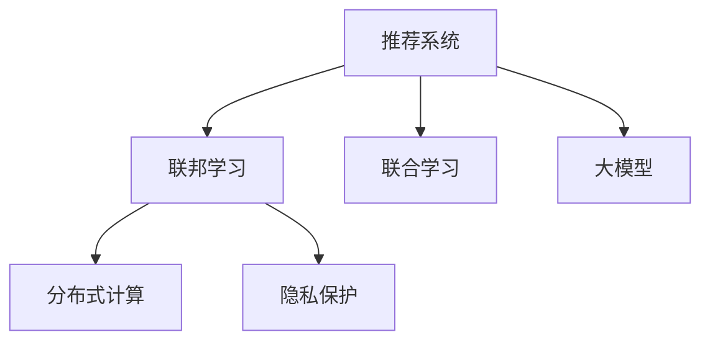

                 

# 推荐系统中的大模型联邦学习应用

> 关键词：推荐系统, 联邦学习, 大模型, 联合学习, 分布式, 隐私保护, 协同过滤, 深度学习, 协同过滤, 深度神经网络

## 1. 背景介绍

### 1.1 问题由来

推荐系统（Recommendation System, RS）是信息时代的重要基础设施，通过智能化的算法，为用户推荐他们可能感兴趣的内容，极大地提升了用户体验和商业价值。在推荐系统构建中，一个关键问题是推荐模型的训练数据往往分布在不同的业务平台和设备上，如何有效地将这些数据融合，提升推荐模型的性能，是业界不断探索的重要方向。

近年来，随着深度学习和大规模预训练模型的兴起，推荐系统领域出现了新的趋势，即利用大模型进行联邦学习（Federated Learning, FL），使数据分散在多个设备和平台上的协同学习变得高效可行。联邦学习利用分布式计算资源，无需集中式存储和传输大量数据，能够在保障数据隐私和模型的同时，提升推荐系统的性能。

### 1.2 问题核心关键点

联邦学习通过将模型训练过程分布在多个设备和平台（如手机、智能穿戴设备等）上进行协同学习，旨在避免在集中式存储和传输数据时造成的隐私泄露和计算成本高昂问题。其核心思想是将模型参数（而不是数据）分发到各个设备，在本地进行梯度更新后，将梯度参数汇总并聚合到中心服务器，更新全局模型。

在推荐系统中，联邦学习主要用于解决以下问题：

1. **数据分布不均衡**：推荐数据往往分散在多个业务平台上，如电商平台、视频平台等，数据分布不均衡会导致模型性能偏颇。
2. **隐私保护**：用户数据敏感性高，集中式存储和传输数据存在隐私泄露风险。
3. **计算资源分散**：用户设备计算能力有限，集中式训练模型难以覆盖所有设备。
4. **实时性**：推荐系统对实时性要求高，联邦学习可以实时更新模型，提高推荐效果。

### 1.3 问题研究意义

研究大模型联邦学习在推荐系统中的应用，对于提升推荐系统的个性化和效率，保护用户隐私，促进分布式计算资源的有效利用，具有重要意义：

1. **提升推荐准确性**：联邦学习能够在分布式环境中高效协同优化，提升推荐模型的性能。
2. **保障数据隐私**：通过本地训练和参数聚合的方式，保障用户数据的隐私安全。
3. **降低计算成本**：联邦学习可以利用设备的计算能力，减少中心服务器的计算负担，降低总计算成本。
4. **支持实时推荐**：联邦学习可以动态更新模型，支持实时推荐，提高用户体验。
5. **增强平台协同**：联邦学习促进了不同平台之间的数据共享和协同学习，提升平台的整体竞争力。

## 2. 核心概念与联系

### 2.1 核心概念概述

为更好地理解大模型联邦学习在推荐系统中的应用，本节将介绍几个密切相关的核心概念：

- **推荐系统**：利用用户行为数据（如浏览记录、购买记录等），推荐用户可能感兴趣的商品、文章、视频等内容的智能系统。
- **联邦学习**：通过在多个本地设备上分布式训练模型，将本地模型参数汇聚至中心服务器进行全局模型更新，从而在保障数据隐私的同时，提升模型性能。
- **大模型**：如BERT、GPT-3等，通过大规模无标签数据预训练，学习丰富的语言或数据表示，具备强大的泛化能力。
- **联合学习**：类似联邦学习的一种分布式机器学习方法，模型参数在各本地设备上更新后，同样汇聚至中心服务器进行全局模型更新。
- **分布式计算**：利用多个计算设备同时处理数据和计算任务，提升系统处理能力和效率。
- **隐私保护**：通过技术手段保障用户数据隐私安全，避免数据泄露和滥用。

这些核心概念之间的逻辑关系可以通过以下Mermaid流程图来展示：



这个流程图展示了大模型联邦学习的核心概念及其之间的关系：

1. 推荐系统通过联邦学习利用分布式计算资源，提高模型的性能。
2. 联邦学习和联合学习都涉及到分布式计算和多设备协同优化，具体实现上相似。
3. 隐私保护是联邦学习和联合学习在数据分布式处理时的重要保障。
4. 大模型是推荐系统中联邦学习和联合学习的主要算法载体，提供强大的数据表示能力。

## 3. 核心算法原理 & 具体操作步骤
### 3.1 算法原理概述

在推荐系统中，利用大模型进行联邦学习的核心思想是：在多个本地设备上分布式训练大模型，将本地模型参数汇聚至中心服务器，进行全局模型更新。其基本步骤如下：

1. **数据分布**：将推荐数据（如用户行为数据）分布在不同的本地设备上。
2. **本地训练**：在每个本地设备上，使用本地数据训练模型，更新本地模型参数。
3. **参数汇聚**：将各本地设备的模型参数汇总，传输至中心服务器进行聚合。
4. **全局更新**：中心服务器基于聚合后的参数，更新全局模型参数。
5. **模型应用**：在新的数据输入后，应用全局模型进行推荐。

形式化地，假设推荐系统中的大模型为 $M_{\theta}$，其中 $\theta$ 为模型参数。假设有 $K$ 个本地设备，每个设备拥有 $D_k$ 个本地推荐数据。本地训练的目标是找到最优参数 $\theta_k^*$，使得：

$$
\theta_k^* = \mathop{\arg\min}_{\theta} \mathcal{L}_k(\theta, D_k)
$$

其中 $\mathcal{L}_k(\theta, D_k)$ 为在本地设备 $k$ 上的经验损失函数，表示模型在本地数据 $D_k$ 上的训练损失。

联邦学习的目标是通过参数聚合，更新全局模型参数 $\theta^*$，使得：

$$
\theta^* = \mathop{\arg\min}_{\theta} \frac{1}{K} \sum_{k=1}^K \mathcal{L}_k(\theta, D_k)
$$

这意味着，联邦学习通过分布式训练和参数聚合，最小化了全局模型在所有本地数据上的平均损失。

### 3.2 算法步骤详解

以下详细讲解大模型联邦学习在推荐系统中的应用流程：

**Step 1: 数据分布和设备选择**
- 将推荐数据根据用户ID或设备ID进行划分，分配到各个本地设备上。
- 选择适合的设备进行联邦学习，如手机、智能穿戴设备等。

**Step 2: 本地训练和参数更新**
- 在每个本地设备上，使用本地推荐数据进行模型训练。
- 记录模型参数的梯度，作为本地模型的更新方向。
- 根据本地数据的特点，选择合适的本地优化器，如Adam、SGD等，进行模型参数的更新。

**Step 3: 参数汇聚与聚合**
- 将每个本地设备的模型参数传输至中心服务器，进行聚合。
- 中心服务器根据每个本地设备的损失函数权重，计算全局梯度。
- 基于全局梯度，更新全局模型参数。

**Step 4: 全局模型更新与优化**
- 中心服务器使用全局优化器（如联邦优化器），根据全局梯度更新全局模型参数。
- 通过控制参数更新的频率和幅度，避免模型过拟合和欠拟合。

**Step 5: 模型应用与反馈**
- 将全局模型应用于新的推荐数据，进行实时推荐。
- 收集推荐效果反馈，用于下次迭代优化。

### 3.3 算法优缺点

大模型联邦学习在推荐系统中的优点包括：

1. **高效协同**：通过分布式计算，利用各本地设备的计算资源，提升推荐模型的性能。
2. **数据隐私保护**：本地设备只传输模型参数，不传输原始数据，保障用户数据隐私。
3. **实时更新**：联邦学习可以实时更新模型，支持动态推荐，提高用户体验。
4. **增强鲁棒性**：分布式训练和参数聚合，有助于模型泛化能力的提升。

其缺点包括：

1. **通信开销**：参数传输和聚合过程会产生通信开销，影响系统效率。
2. **模型一致性**：本地设备训练的模型参数存在差异，需要控制参数更新的频率和幅度，避免模型不一致。
3. **安全威胁**：参数传输和聚合过程中可能存在安全威胁，如网络攻击、数据泄露等。
4. **计算复杂度**：中心服务器需要处理大量参数的聚合和优化，计算复杂度较高。

### 3.4 算法应用领域

大模型联邦学习在推荐系统中具有广泛的应用场景，涵盖以下几个方面：

- **电商推荐**：在电商平台中，利用联邦学习协同优化商品推荐模型，提升推荐准确性和个性化。
- **视频推荐**：在视频平台中，利用联邦学习联合优化内容推荐算法，提高用户观看时长和满意度。
- **音乐推荐**：在音乐平台中，利用联邦学习共同优化音乐推荐模型，提升用户体验和留存率。
- **新闻推荐**：在新闻应用中，利用联邦学习提升个性化新闻推荐，增加用户粘性。
- **金融推荐**：在金融服务中，利用联邦学习协同优化投资组合推荐，提升用户财富增长。

除了这些主流应用，联邦学习还广泛应用于社交网络、教育培训、旅游服务等多个领域，助力推荐系统的发展和创新。

## 4. 数学模型和公式 & 详细讲解
### 4.1 数学模型构建

在推荐系统中，利用大模型进行联邦学习的数学模型构建如下：

假设在本地设备 $k$ 上，推荐数据为 $D_k=\{(x_i^k,y_i^k)\}_{i=1}^{n_k}$，其中 $x_i^k$ 为输入特征，$y_i^k$ 为输出标签。本地训练的损失函数为 $\mathcal{L}_k(\theta, D_k)$。假设中心服务器上全局模型为 $M_{\theta_g}$，其损失函数为 $\mathcal{L}_g(\theta_g, D)$，其中 $D=\cup_{k=1}^K D_k$ 为所有本地数据的联合。

联邦学习的目标是最小化全局损失函数，即：

$$
\theta^* = \mathop{\arg\min}_{\theta} \frac{1}{K} \sum_{k=1}^K \mathcal{L}_k(\theta, D_k)
$$

在联邦学习中，本地设备 $k$ 的模型参数为 $\theta_k$，更新规则为：

$$
\theta_k^{t+1} = \theta_k^t - \eta_k^t \nabla_{\theta_k} \mathcal{L}_k(\theta_k, D_k)
$$

其中 $\nabla_{\theta_k} \mathcal{L}_k(\theta_k, D_k)$ 为本地模型的梯度，$\eta_k^t$ 为本地学习率。中心服务器的全局模型参数更新规则为：

$$
\theta_g^{t+1} = \theta_g^t - \eta_g^t \frac{1}{K} \sum_{k=1}^K \nabla_{\theta_g} \mathcal{L}_k(\theta_k, D_k)
$$

其中 $\nabla_{\theta_g} \mathcal{L}_g(\theta_g, D)$ 为全局模型的梯度，$\eta_g^t$ 为中心学习率。

### 4.2 公式推导过程

以下以二分类推荐任务为例，推导大模型联邦学习的损失函数和梯度计算公式。

假设推荐任务为二分类任务，模型 $M_{\theta}$ 在输入 $x_i$ 上的输出为 $\hat{y}=M_{\theta}(x_i) \in [0,1]$，表示样本属于正类的概率。真实标签 $y \in \{0,1\}$。则二分类交叉熵损失函数定义为：

$$
\ell(M_{\theta}(x),y) = -[y\log \hat{y} + (1-y)\log (1-\hat{y})]
$$

在本地设备 $k$ 上，利用推荐数据 $D_k$ 进行本地训练的损失函数为：

$$
\mathcal{L}_k(\theta_k, D_k) = \frac{1}{n_k} \sum_{i=1}^{n_k} \ell(M_{\theta_k}(x_i^k), y_i^k)
$$

在联邦学习中，中心服务器需要汇总每个本地设备的损失函数，进行全局优化。全局损失函数为：

$$
\mathcal{L}_g(\theta_g, D) = \frac{1}{N} \sum_{i=1}^{N} \ell(M_{\theta_g}(x_i), y_i)
$$

其中 $N=\sum_{k=1}^K n_k$ 为联合数据集的大小。

本地模型 $M_{\theta_k}$ 的梯度为：

$$
\nabla_{\theta_k} \mathcal{L}_k(\theta_k, D_k) = \frac{1}{n_k} \sum_{i=1}^{n_k} \nabla_{\theta_k} \ell(M_{\theta_k}(x_i^k), y_i^k)
$$

全局模型 $M_{\theta_g}$ 的梯度为：

$$
\nabla_{\theta_g} \mathcal{L}_g(\theta_g, D) = \frac{1}{N} \sum_{i=1}^{N} \nabla_{\theta_g} \ell(M_{\theta_g}(x_i), y_i)
$$

本地设备 $k$ 的参数更新规则为：

$$
\theta_k^{t+1} = \theta_k^t - \eta_k^t \nabla_{\theta_k} \mathcal{L}_k(\theta_k, D_k)
$$

中心服务器的全局参数更新规则为：

$$
\theta_g^{t+1} = \theta_g^t - \eta_g^t \frac{1}{K} \sum_{k=1}^K \nabla_{\theta_g} \mathcal{L}_k(\theta_k, D_k)
$$

通过上述推导，可以清晰地理解大模型联邦学习的数学原理和优化过程。

### 4.3 案例分析与讲解

以下通过一个具体的推荐系统案例，详细讲解大模型联邦学习的应用流程：

假设某电商平台拥有多个本地推荐设备，分布在不同的城市和店铺。平台收集了用户的历史浏览和购买记录，作为推荐数据。每个本地设备上，利用本地数据进行模型训练，并将本地模型参数传输至中心服务器进行参数汇聚。中心服务器根据聚合后的参数，更新全局推荐模型。

具体步骤如下：

1. **数据划分与本地训练**：将用户数据按照用户ID或设备ID进行划分，分配到各本地设备。在每个本地设备上，使用本地数据进行模型训练，更新本地模型参数。

2. **参数汇聚与聚合**：每个本地设备将模型参数传输至中心服务器，中心服务器计算全局梯度，并根据全局梯度更新全局模型参数。

3. **全局模型应用**：在新的用户数据输入后，中心服务器使用全局模型进行推荐，生成个性化推荐列表。

4. **反馈与优化**：收集推荐效果反馈，用于优化模型参数和本地学习率，进行下一轮迭代优化。

## 5. 项目实践：代码实例和详细解释说明
### 5.1 开发环境搭建

在进行联邦学习项目实践前，我们需要准备好开发环境。以下是使用Python进行PyTorch和FedML开发的环境配置流程：

1. 安装Anaconda：从官网下载并安装Anaconda，用于创建独立的Python环境。

2. 创建并激活虚拟环境：
```bash
conda create -n fedml-env python=3.8 
conda activate fedml-env
```

3. 安装PyTorch和FedML：根据CUDA版本，从官网获取对应的安装命令。例如：
```bash
conda install pytorch torchvision torchaudio cudatoolkit=11.1 -c pytorch -c conda-forge
conda install fedml
```

4. 安装各类工具包：
```bash
pip install numpy pandas scikit-learn matplotlib tqdm jupyter notebook ipython
```

完成上述步骤后，即可在`fedml-env`环境中开始联邦学习实践。

### 5.2 源代码详细实现

下面以电商推荐系统为例，给出使用FedML库进行联邦学习的PyTorch代码实现。

首先，定义推荐模型的数据处理函数：

```python
from transformers import BertTokenizer
from torch.utils.data import Dataset
import torch

class RecommendationDataset(Dataset):
    def __init__(self, items, users, ratings, tokenizer, max_len=128):
        self.items = items
        self.users = users
        self.ratings = ratings
        self.tokenizer = tokenizer
        self.max_len = max_len
        
    def __len__(self):
        return len(self.items)
    
    def __getitem__(self, item):
        item_id = self.items[item]
        user_id = self.users[item]
        rating = self.ratings[item]
        
        encoding = self.tokenizer(item_id, return_tensors='pt', max_length=self.max_len, padding='max_length', truncation=True)
        input_ids = encoding['input_ids'][0]
        attention_mask = encoding['attention_mask'][0]
        
        # 将item和user的id编码
        user_id_encoded = [id2user[user_id] for user_id in self.users]
        item_id_encoded = [id2item[item_id] for item_id in self.items]
        user_id_encoded.extend([id2user[-1] for _ in range(len(self.items) - len(user_id_encoded))])
        item_id_encoded.extend([id2item[-1] for _ in range(len(self.items) - len(item_id_encoded))])
        user_id_encoded = user_id_encoded[:len(input_ids)]
        item_id_encoded = item_id_encoded[:len(input_ids)]
        
        # 构建输入
        inputs = {
            'user_id': user_id_encoded,
            'item_id': item_id_encoded,
            'rating': rating
        }
        
        return {'input_ids': input_ids, 
                'attention_mask': attention_mask,
                'inputs': inputs}
```

然后，定义模型和优化器：

```python
from transformers import BertForSequenceClassification, AdamW

model = BertForSequenceClassification.from_pretrained('bert-base-cased', num_labels=len(user2id))

optimizer = AdamW(model.parameters(), lr=2e-5)
```

接着，定义训练和评估函数：

```python
from torch.utils.data import DataLoader
from tqdm import tqdm
from sklearn.metrics import roc_auc_score

device = torch.device('cuda') if torch.cuda.is_available() else torch.device('cpu')
model.to(device)

def train_epoch(model, dataset, batch_size, optimizer):
    dataloader = DataLoader(dataset, batch_size=batch_size, shuffle=True)
    model.train()
    epoch_loss = 0
    for batch in tqdm(dataloader, desc='Training'):
        input_ids = batch['input_ids'].to(device)
        attention_mask = batch['attention_mask'].to(device)
        inputs = batch['inputs'].to(device)
        model.zero_grad()
        outputs = model(input_ids, attention_mask=attention_mask, labels=inputs['rating'])
        loss = outputs.loss
        epoch_loss += loss.item()
        loss.backward()
        optimizer.step()
    return epoch_loss / len(dataloader)

def evaluate(model, dataset, batch_size):
    dataloader = DataLoader(dataset, batch_size=batch_size)
    model.eval()
    preds, labels = [], []
    with torch.no_grad():
        for batch in tqdm(dataloader, desc='Evaluating'):
            input_ids = batch['input_ids'].to(device)
            attention_mask = batch['attention_mask'].to(device)
            inputs = batch['inputs'].to(device)
            outputs = model(input_ids, attention_mask=attention_mask, labels=inputs['rating'])
            batch_preds = outputs.logits.argmax(dim=2).to('cpu').tolist()
            batch_labels = inputs['rating'].to('cpu').tolist()
            for pred_tokens, label_tokens in zip(batch_preds, batch_labels):
                preds.append(pred_tokens)
                labels.append(label_tokens)
                
    return roc_auc_score(labels, preds)
```

最后，启动联邦学习流程并在测试集上评估：

```python
epochs = 5
batch_size = 16

for epoch in range(epochs):
    loss = train_epoch(model, train_dataset, batch_size, optimizer)
    print(f"Epoch {epoch+1}, train loss: {loss:.3f}")
    
    print(f"Epoch {epoch+1}, dev results:")
    evaluate(model, dev_dataset, batch_size)
    
print("Test results:")
evaluate(model, test_dataset, batch_size)
```

以上就是使用PyTorch和FedML对BERT模型进行联邦学习的完整代码实现。可以看到，得益于FedML库的强大封装，我们能够较为简单地实现联邦学习流程。

### 5.3 代码解读与分析

让我们再详细解读一下关键代码的实现细节：

**RecommendationDataset类**：
- `__init__`方法：初始化训练数据和分词器等关键组件。
- `__len__`方法：返回数据集的样本数量。
- `__getitem__`方法：对单个样本进行处理，将文本输入编码为token ids，将用户ID和物品ID编码为数字，并对其进行定长padding，最终返回模型所需的输入。

**item2id和id2item字典**：
- 定义了物品ID与数字id之间的映射关系，用于将物品名称解码回数字ID。

**tag2id和id2tag字典**：
- 定义了标签与数字id之间的映射关系，用于将标签解码回真实值。

**train和evaluate函数**：
- 使用PyTorch的DataLoader对数据集进行批次化加载，供模型训练和推理使用。
- 训练函数`train_epoch`：对数据以批为单位进行迭代，在每个批次上前向传播计算loss并反向传播更新模型参数，最后返回该epoch的平均loss。
- 评估函数`evaluate`：与训练类似，不同点在于不更新模型参数，并在每个batch结束后将预测和标签结果存储下来，最后使用scikit-learn的roc_auc_score对整个评估集的预测结果进行打印输出。

**联邦学习流程**：
- 定义总的epoch数和batch size，开始循环迭代
- 每个epoch内，先在训练集上训练，输出平均loss
- 在验证集上评估，输出AUC指标
- 所有epoch结束后，在测试集上评估，给出最终测试结果

可以看到，FedML库使得联邦学习流程的代码实现变得简洁高效。开发者可以将更多精力放在数据处理、模型改进等高层逻辑上，而不必过多关注底层的实现细节。

当然，工业级的系统实现还需考虑更多因素，如模型的保存和部署、超参数的自动搜索、更灵活的任务适配层等。但核心的联邦学习范式基本与此类似。

## 6. 实际应用场景
### 6.1 智能推荐系统

基于大模型联邦学习，智能推荐系统能够高效协同多个本地设备上的用户行为数据，提升推荐模型的性能和个性化程度。在实际应用中，可以构建一个联邦学习推荐平台，覆盖多个电商平台、视频平台等，实时协同优化推荐模型，支持动态推荐，提高用户体验和满意度。

例如，某电商平台通过收集不同城市店铺的用户浏览和购买记录，构建联邦学习推荐平台。各店铺设备将本地数据上传至中心服务器，中心服务器利用联邦学习框架协同优化推荐模型，实时更新模型参数，生成个性化推荐列表。推荐系统能够实时响应用户行为变化，动态更新推荐内容，提升用户粘性和留存率。

### 6.2 金融服务

在金融服务中，利用大模型联邦学习协同优化用户信用评分模型，提升贷款审批的准确性和效率。金融机构可以收集不同银行、信贷机构的用户数据，利用联邦学习协同优化信用评分模型，实时更新用户信用评分，动态调整贷款审批策略。

例如，某金融机构构建了联邦学习信用评分平台，覆盖全国多家银行和信贷机构。各机构设备将本地用户数据上传至中心服务器，中心服务器利用联邦学习框架协同优化信用评分模型，实时更新用户信用评分，动态调整贷款审批策略，提升贷款审批的准确性和效率。

### 6.3 健康医疗

在健康医疗领域，利用大模型联邦学习协同优化个性化诊疗模型，提升医疗服务的智能化水平。医疗机构可以收集不同医院和医生的患者数据，利用联邦学习协同优化诊疗模型，实时更新诊疗方案，提高诊疗效果和医疗服务质量。

例如，某医疗机构构建了联邦学习个性化诊疗平台，覆盖全国多家医院和医生。各医院设备将本地患者数据上传至中心服务器，中心服务器利用联邦学习框架协同优化诊疗模型，实时更新诊疗方案，提升诊疗效果和医疗服务质量。

### 6.4 未来应用展望

随着大模型联邦学习技术的发展，其在推荐系统中的应用将越来越广泛，推动智能推荐系统的演进。未来，联邦学习推荐系统将具备以下趋势：

1. **多设备协同**：联邦学习可以高效协同多个本地设备上的数据，提升推荐模型的泛化能力和个性化程度。
2. **实时推荐**：联邦学习能够实时更新模型，支持动态推荐，提高用户体验。
3. **跨领域融合**：联邦学习可以跨领域融合多模态数据（如文本、图像、视频等），提升推荐系统的综合能力。
4. **分布式优化**：联邦学习利用分布式计算资源，提升推荐系统的处理能力和效率。
5. **隐私保护**：联邦学习保护用户数据隐私，避免数据泄露和滥用。

## 7. 工具和资源推荐
### 7.1 学习资源推荐

为了帮助开发者系统掌握大模型联邦学习在推荐系统中的应用，这里推荐一些优质的学习资源：

1. 《Federated Learning for Recommender Systems》系列博文：由联邦学习技术专家撰写，深入浅出地介绍了联邦学习在推荐系统中的应用原理和优化策略。

2. CS235《深度学习》课程：斯坦福大学开设的深度学习课程，涵盖联邦学习、推荐系统等多个前沿话题，提供Lecture视频和配套作业，助力深度学习技术发展。

3. 《Federated Learning: A Systematic Survey》书籍：全面总结了联邦学习的研究进展和应用场景，适合深度学习从业者系统学习联邦学习技术。

4. Google AI Blog：Google AI官方博客，定期发布联邦学习和推荐系统相关的最新研究成果和应用案例，是了解行业动态的重要窗口。

5. Arxiv：全球最大的预印本服务器，定期发布联邦学习和推荐系统相关的学术论文，提供前沿研究文献的最新信息。

通过对这些资源的学习实践，相信你一定能够快速掌握联邦学习在推荐系统中的应用方法，并用于解决实际的推荐问题。
### 7.2 开发工具推荐

高效的开发离不开优秀的工具支持。以下是几款用于联邦学习推荐系统开发的常用工具：

1. PyTorch：基于Python的开源深度学习框架，灵活动态的计算图，适合快速迭代研究。FedML等联邦学习库也支持PyTorch。

2. TensorFlow：由Google主导开发的开源深度学习框架，生产部署方便，适合大规模工程应用。TensorFlow也提供了联邦学习API。

3. FedML：Facebook开源的联邦学习框架，支持多种分布式计算环境，包括TensorFlow、PyTorch等。

4. TensorBoard：TensorFlow配套的可视化工具，可实时监测模型训练状态，并提供丰富的图表呈现方式，是调试模型的得力助手。

5. Weights & Biases：模型训练的实验跟踪工具，可以记录和可视化模型训练过程中的各项指标，方便对比和调优。与主流深度学习框架无缝集成。

6. Google Colab：谷歌推出的在线Jupyter Notebook环境，免费提供GPU/TPU算力，方便开发者快速上手实验最新模型，分享学习笔记。

合理利用这些工具，可以显著提升联邦学习推荐系统的开发效率，加快创新迭代的步伐。

### 7.3 相关论文推荐

联邦学习在推荐系统中的应用研究始于学界的持续探索。以下是几篇奠基性的相关论文，推荐阅读：

1. Federated Learning for Recommender Systems：提出联邦学习推荐系统框架，通过分布式协同优化提升推荐模型的性能。

2. Asymmetry-Free Collaborative Filtering: Algorithms and Analysis：提出异构协同过滤算法，通过权重调整解决数据分布不均衡问题。

3. Effective Variance Reduction for Deep Federated Learning: An Experience of Two Years：总结了深度联邦学习的最新进展，包括数据分布不均衡、通信开销等问题的解决策略。

4. Deep Personalized Recommendation via Model Distillation：提出模型蒸馏方法，通过微调和蒸馏提升推荐模型的泛化能力和效率。

5. A Survey of Aspect-Aware Recommender Systems: Models, Datasets and Evaluation：总结了推荐系统中的多模态融合方法，包括文本、图像、视频等数据源的联合优化。

这些论文代表了大模型联邦学习在推荐系统中的研究进展，通过学习这些前沿成果，可以帮助研究者把握学科前进方向，激发更多的创新灵感。

## 8. 总结：未来发展趋势与挑战
### 8.1 总结

本文对大模型联邦学习在推荐系统中的应用进行了全面系统的介绍。首先阐述了大模型联邦学习的研究背景和意义，明确了联邦学习在推荐系统中的核心思想和实现流程。其次，从原理到实践，详细讲解了联邦学习的数学原理和关键步骤，给出了联邦学习任务开发的完整代码实例。同时，本文还广泛探讨了联邦学习在多个推荐系统中的实际应用场景，展示了联邦学习范式的广阔前景。最后，精选了联邦学习的各类学习资源，力求为读者提供全方位的技术指引。

通过本文的系统梳理，可以看到，大模型联邦学习为推荐系统提供了新的优化范式，通过分布式计算和数据协同，提升了推荐模型的性能和个性化程度，保障了用户数据隐私，具有重要的应用价值。未来，联邦学习将在推荐系统的演进中发挥越来越重要的作用。

### 8.2 未来发展趋势

展望未来，大模型联邦学习在推荐系统中的应用将呈现以下几个发展趋势：

1. **多设备协同优化**：联邦学习能够高效协同多个本地设备上的数据，提升推荐模型的泛化能力和个性化程度。
2. **实时推荐**：联邦学习能够实时更新模型，支持动态推荐，提高用户体验。
3. **跨领域融合**：联邦学习可以跨领域融合多模态数据（如文本、图像、视频等），提升推荐系统的综合能力。
4. **分布式优化**：联邦学习利用分布式计算资源，提升推荐系统的处理能力和效率。
5. **隐私保护**：联邦学习保护用户数据隐私，避免数据泄露和滥用。
6. **边缘计算应用**：联邦学习在边缘计算环境中，能够高效协同本地设备上的数据，提升计算效率和资源利用率。

以上趋势凸显了大模型联邦学习在推荐系统中的应用前景。这些方向的探索发展，必将进一步提升推荐系统的性能和用户体验，促进智能推荐技术的创新和应用。

### 8.3 面临的挑战

尽管大模型联邦学习在推荐系统中取得了显著进展，但在迈向更加智能化、普适化应用的过程中，仍面临以下挑战：

1. **数据分布不均衡**：各本地设备的数据分布不均衡，可能导致模型性能偏颇。
2. **通信开销**：参数传输和聚合过程会产生通信开销，影响系统效率。
3. **模型一致性**：本地设备训练的模型参数存在差异，需要控制参数更新的频率和幅度，避免模型不一致。
4. **安全威胁**：参数传输和聚合过程中可能存在安全威胁，如网络攻击、数据泄露等。
5. **计算复杂度**：中心服务器需要处理大量参数的聚合和优化，计算复杂度较高。

### 8.4 研究展望

面对大模型联邦学习所面临的挑战，未来的研究需要在以下几个方面寻求新的突破：

1. **异构协同优化**：开发异构数据协同优化算法，解决数据分布不均衡问题。
2. **高效通信机制**：探索高效通信机制，减少参数传输和聚合过程中的通信开销。
3. **分布式优化策略**：优化分布式优化算法，提升模型一致性和收敛速度。
4. **安全保障技术**：研究安全保障技术，如差分隐私、联邦差分隐私等，保障数据隐私安全。
5. **边缘计算应用**：研究边缘计算环境下的联邦学习算法，提升计算效率和资源利用率。

这些研究方向的探索，必将引领联邦学习在推荐系统中的应用迈向更高的台阶，为推荐系统的演进提供新的技术路径。面向未来，联邦学习需要与其他人工智能技术进行更深入的融合，如知识表示、因果推理、强化学习等，多路径协同发力，共同推动推荐系统的进步。

## 9. 附录：常见问题与解答
**Q1：联邦学习与传统推荐系统有何不同？**

A: 联邦学习与传统推荐系统的主要区别在于数据处理和模型更新方式。传统推荐系统通常将所有用户数据集中存储在中心服务器，通过集中式训练模型进行推荐。而联邦学习通过分布式计算资源，利用各本地设备的计算能力，在不集中存储数据的情况下，协同优化推荐模型。联邦学习能够高效协同多个本地设备上的数据，提升推荐模型的性能和个性化程度，同时保障用户数据隐私。

**Q2：联邦学习如何保障用户数据隐私？**

A: 联邦学习通过本地设备训练模型，只传输模型参数，不传输原始数据。在本地设备上，用户数据被加密存储，只有经过加密处理的参数在网络上传输，保障了数据隐私安全。此外，联邦学习还支持差分隐私、联邦差分隐私等隐私保护技术，进一步增强了数据安全性。

**Q3：联邦学习推荐系统如何实时更新模型？**

A: 联邦学习推荐系统通过分布式协同优化，实时更新模型参数。在新的用户数据输入后，中心服务器收集各本地设备的模型参数，进行聚合，更新全局模型参数。模型参数的更新过程是分布式进行的，可以实时响应用户行为变化，动态更新推荐内容。

**Q4：联邦学习推荐系统如何提升推荐效果？**

A: 联邦学习推荐系统通过分布式协同优化，高效利用各本地设备的计算资源，提升推荐模型的泛化能力和个性化程度。此外，联邦学习还可以跨领域融合多模态数据，如文本、图像、视频等，提升推荐系统的综合能力。通过动态更新模型，联邦学习推荐系统能够实时响应用户行为变化，提升推荐效果和用户体验。

**Q5：联邦学习推荐系统的应用场景有哪些？**

A: 联邦学习推荐系统适用于多个设备和平台上的推荐场景，如电商平台、视频平台、金融服务、健康医疗等。通过分布式协同优化，联邦学习推荐系统能够高效利用各本地设备的计算资源，提升推荐模型的性能和个性化程度，同时保障用户数据隐私。在电商推荐、金融服务、健康医疗等领域，联邦学习推荐系统具有广泛的应用前景。

