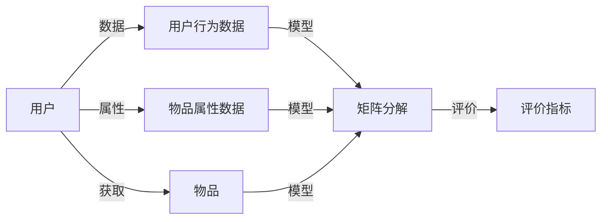

                 

## 1. 背景介绍

推荐系统在信息时代中扮演了至关重要的角色，通过精准的个性化推荐，帮助用户发现感兴趣的内容，提升用户体验和满意度。然而，随着数据量的爆炸式增长和推荐算法的不断演进，推荐系统也面临着一系列挑战，尤其是过拟合、偏见与多样性问题，这些问题严重影响了推荐系统的质量和公平性。本文将从这三个角度深入探讨推荐系统的局限，并提出相应的改进策略。

### 1.1 问题由来

推荐系统是基于用户行为数据和物品属性数据进行模型训练的，通过学习用户和物品间的相似度关系，为用户推荐相关物品。然而，随着数据量的增加和推荐算法的复杂度提高，推荐系统面临的挑战也日益凸显。

1. **过拟合**：随着推荐系统模型的复杂度提高，容易在训练数据上过度拟合，导致模型在新数据上的泛化能力不足。
2. **偏见**：推荐系统算法中可能存在的用户、物品、特征等偏见，可能导致推荐结果的不公平。
3. **多样性**：推荐算法可能倾向于推荐相似物品，忽略不同种类的物品，导致推荐结果过于单一，缺乏多样性。

这些局限问题不仅影响了用户体验，还对推荐系统的信任度和覆盖面造成了负面影响。因此，有必要深入研究这些问题，并提出有效的改进措施。

## 2. 核心概念与联系

### 2.1 核心概念概述

推荐系统的核心概念主要包括用户、物品、模型和评价指标。本文将详细解释这些概念，并展示它们之间的联系。

1. **用户**：推荐系统的最终用户，具有不同的兴趣、需求和行为。
2. **物品**：推荐系统中的实体，包括商品、视频、新闻等，具有不同的属性和特征。
3. **模型**：推荐系统中的关键组件，用于学习用户和物品之间的关系，包括协同过滤、基于内容的推荐、矩阵分解等。
4. **评价指标**：用于衡量推荐系统性能的指标，包括准确率、召回率、F1分数等。

这些概念之间的关系可以用以下Mermaid流程图表示：



## 3. 核心算法原理 & 具体操作步骤

### 3.1 算法原理概述

推荐系统的主要原理是通过学习用户和物品间的相似度关系，为用户推荐相关物品。常用的推荐算法包括协同过滤、基于内容的推荐和矩阵分解等。本文将重点介绍这些算法的原理和操作步骤。

### 3.2 算法步骤详解

#### 3.2.1 协同过滤算法

协同过滤算法通过计算用户和物品的相似度，为用户推荐相似的物品。其操作步骤如下：

1. **数据预处理**：收集用户行为数据和物品属性数据，去除噪声和缺失值。
2. **计算相似度**：根据用户和物品的特征向量，计算它们之间的相似度。
3. **生成推荐**：根据相似度矩阵，生成推荐结果。

#### 3.2.2 基于内容的推荐算法

基于内容的推荐算法通过物品的属性特征，为用户推荐相似的物品。其操作步骤如下：

1. **数据预处理**：收集物品的属性数据，构建特征向量。
2. **特征选择**：选择与用户兴趣相关的物品特征。
3. **生成推荐**：根据特征向量，计算用户和物品之间的相似度，生成推荐结果。

#### 3.2.3 矩阵分解算法

矩阵分解算法通过分解用户和物品之间的矩阵，得到用户和物品的隐含特征，从而生成推荐结果。其操作步骤如下：

1. **数据预处理**：收集用户行为数据和物品属性数据，构建用户-物品矩阵。
2. **矩阵分解**：将用户-物品矩阵分解为用户特征矩阵和物品特征矩阵。
3. **生成推荐**：根据分解后的特征矩阵，计算用户和物品之间的相似度，生成推荐结果。

### 3.3 算法优缺点

#### 3.3.1 协同过滤算法的优缺点

协同过滤算法的优点包括：

1. 不需要物品的属性数据，适用于冷启动用户。
2. 简单易实现，计算复杂度较低。

其缺点包括：

1. 数据稀疏性问题，用户-物品矩阵中很多条目为0。
2. 存在用户和物品的隐性数据，难以准确捕捉用户和物品之间的关系。

#### 3.3.2 基于内容的推荐算法的优缺点

基于内容的推荐算法的优点包括：

1. 利用物品的属性特征，推荐更具针对性的物品。
2. 适用于新物品的推荐，冷启动效果好。

其缺点包括：

1. 需要较多的物品属性数据，数据获取成本较高。
2. 推荐结果依赖于物品属性的选择，推荐效果可能不稳定。

#### 3.3.3 矩阵分解算法的优缺点

矩阵分解算法的优点包括：

1. 能够捕捉用户和物品之间的隐性关系。
2. 适用于大规模数据集，计算效率高。

其缺点包括：

1. 需要训练模型参数，计算复杂度高。
2. 对数据分布和特征的假设较强，可能存在模型过拟合问题。

### 3.4 算法应用领域

推荐系统广泛应用于电子商务、在线视频、新闻阅读等场景。其应用领域包括：

1. 电子商务：为用户推荐商品、商品分类、个性化营销等。
2. 在线视频：为用户推荐视频、热门视频、视频推荐列表等。
3. 新闻阅读：为用户推荐新闻、专题、热门新闻等。
4. 社交网络：为用户推荐好友、兴趣群体、社区等。

## 4. 数学模型和公式 & 详细讲解 & 举例说明

### 4.1 数学模型构建

推荐系统的数学模型通常由用户-物品评分矩阵 $Y$、用户特征向量 $U$ 和物品特征向量 $V$ 组成。假设用户 $u$ 对物品 $i$ 的评分是 $y_{ui}$，则用户-物品评分矩阵可以表示为 $Y \in \mathbb{R}^{U \times I}$。

### 4.2 公式推导过程

矩阵分解算法常用的公式为：

$$
Y = UV^\top
$$

其中 $U \in \mathbb{R}^{U \times F}$ 为用户特征矩阵，$V \in \mathbb{R}^{I \times F}$ 为物品特征矩阵，$F$ 为特征维度。

### 4.3 案例分析与讲解

假设用户 $u$ 对物品 $i$ 的评分是 $y_{ui} = 4$，则可以根据矩阵分解公式计算用户 $u$ 和物品 $i$ 的隐含特征 $u_u$ 和 $v_i$。

$$
u_u = U^\top Y
$$

$$
v_i = V Y^\top
$$

其中 $u_u$ 和 $v_i$ 表示用户和物品的隐含特征向量，可以根据这些特征向量计算用户和物品之间的相似度，从而生成推荐结果。

## 5. 项目实践：代码实例和详细解释说明

### 5.1 开发环境搭建

推荐系统的开发环境搭建通常需要以下步骤：

1. 安装Python环境：通过Anaconda或PyCharm等工具安装Python。
2. 安装推荐系统库：安装如Scikit-learn、TensorFlow等推荐系统库。
3. 数据预处理：收集和处理用户行为数据和物品属性数据，去除噪声和缺失值。
4. 模型训练：使用推荐系统算法进行模型训练。
5. 模型评估：使用评价指标对模型进行评估和优化。

### 5.2 源代码详细实现

以下是使用TensorFlow实现矩阵分解算法的代码示例：

```python
import tensorflow as tf
from tensorflow.keras.layers import Input, Dense, Dot
from tensorflow.keras.models import Model

# 定义用户和物品特征矩阵
U = Input(shape=(U, F))
V = Input(shape=(I, F))

# 矩阵分解
Y = Dot(axes=1)([U, V])

# 定义模型
model = Model(inputs=[U, V], outputs=Y)

# 编译模型
model.compile(optimizer='adam', loss='mse')

# 训练模型
model.fit([X_train, Y_train], Y_train, batch_size=64, epochs=10)
```

### 5.3 代码解读与分析

在上述代码中，我们使用TensorFlow实现了一个基于矩阵分解的推荐系统模型。首先定义了用户特征矩阵 $U$ 和物品特征矩阵 $V$，然后使用 `Dot` 层进行矩阵分解，得到用户-物品评分矩阵 $Y$。接着定义了模型并编译，使用 `fit` 方法进行模型训练，并使用均方误差损失函数进行优化。

### 5.4 运行结果展示

训练完成后，我们可以使用测试数据集对模型进行评估，并计算评价指标。例如，计算准确率和召回率：

```python
from sklearn.metrics import accuracy_score, recall_score

# 预测测试集评分
Y_pred = model.predict([X_test, Y_test])

# 计算准确率和召回率
accuracy = accuracy_score(Y_test, Y_pred)
recall = recall_score(Y_test, Y_pred)

print(f'Accuracy: {accuracy:.4f}')
print(f'Recall: {recall:.4f}')
```

## 6. 实际应用场景

### 6.1 电子商务推荐

电子商务平台通过推荐系统为用户推荐商品，提升用户购买率和平台收益。推荐系统需要处理大规模数据，并实时响应用户请求，计算复杂度高。

### 6.2 在线视频推荐

在线视频平台通过推荐系统为用户推荐视频，提升用户观看率和平台收益。推荐系统需要处理高维特征数据，并实时推荐热门视频和个性化视频。

### 6.3 新闻阅读推荐

新闻阅读平台通过推荐系统为用户推荐新闻，提升用户阅读量和平台流量。推荐系统需要处理大规模数据，并实时推荐热门新闻和个性化新闻。

### 6.4 未来应用展望

未来，推荐系统将在更多场景中得到应用，为用户的生产生活带来便利。同时，推荐系统的质量也会不断提高，更加公平、透明和可解释。

## 7. 工具和资源推荐

### 7.1 学习资源推荐

1. 《推荐系统：原理与实践》：详细介绍了推荐系统的原理和实践方法，是推荐系统学习的好书。
2. 《Python推荐系统实战》：通过实际案例介绍了推荐系统的实现方法和应用场景。
3. Coursera《Recommender Systems Specialization》：由斯坦福大学提供，系统讲解了推荐系统的原理和实现方法。

### 7.2 开发工具推荐

1. PyTorch：灵活高效的深度学习框架，支持推荐系统模型的实现。
2. TensorFlow：大规模生产推荐系统的首选框架，支持分布式计算和模型优化。
3. Scikit-learn：简单易用的推荐系统库，适用于小规模推荐系统实现。

### 7.3 相关论文推荐

1. "Collaborative Filtering for Implicit Feedback Datasets"（Koren, 2009）：经典协同过滤算法论文，详细介绍了协同过滤的实现方法。
2. "Scalable Text Categorization Using Distributed Representations"（Mikolov, 2013）：基于内容推荐的经典论文，详细介绍了特征向量和矩阵分解的实现方法。
3. "Neural Collaborative Filtering"（He, 2017）：深度神经网络在推荐系统中的应用论文，详细介绍了深度神经网络的推荐方法。

## 8. 总结：未来发展趋势与挑战

### 8.1 总结

推荐系统在信息时代中扮演了重要角色，通过精准的个性化推荐，提升用户满意度和平台收益。然而，推荐系统也面临过拟合、偏见和多样性等问题。本文通过介绍推荐系统的核心概念和核心算法，详细分析了这些问题，并提出相应的改进策略。

### 8.2 未来发展趋势

未来，推荐系统将在更多场景中得到应用，为用户的生产生活带来便利。同时，推荐系统的质量也会不断提高，更加公平、透明和可解释。

### 8.3 面临的挑战

推荐系统在未来仍面临一些挑战，需要不断改进和优化：

1. 数据稀疏性问题：用户和物品的评分数据可能非常稀疏，需要通过数据增强和模型优化来解决。
2. 偏见问题：推荐系统算法中可能存在的用户、物品、特征等偏见，需要通过公平性优化和算法改进来解决。
3. 多样性问题：推荐算法可能倾向于推荐相似物品，忽略不同种类的物品，需要通过多样性优化和算法改进来解决。

### 8.4 研究展望

未来的推荐系统研究将重点关注以下几个方向：

1. 推荐系统的公平性研究：研究如何减少推荐系统中的偏见，提升公平性。
2. 推荐系统的多样性研究：研究如何推荐多样化的物品，提升用户体验。
3. 推荐系统的效率研究：研究如何提高推荐系统的计算效率，支持大规模数据集。

总之，推荐系统需要不断优化和改进，才能更好地满足用户的需求和期望。只有不断创新和突破，才能让推荐系统在未来的智能社会中发挥更大的作用。

## 9. 附录：常见问题与解答

**Q1: 推荐系统中的过拟合问题如何解决？**

A: 推荐系统中的过拟合问题可以通过以下方法解决：

1. 数据增强：通过合成数据、生成对抗样本等方式扩充训练集。
2. 正则化：使用L2正则化、Dropout等方法抑制过拟合。
3. 模型压缩：通过模型剪枝、特征选择等方法减小模型复杂度。
4. 集成学习：通过集成多个推荐模型，降低单个模型的过拟合风险。

**Q2: 推荐系统中的偏见问题如何解决？**

A: 推荐系统中的偏见问题可以通过以下方法解决：

1. 数据预处理：在数据收集和处理阶段，去除偏见数据和特征。
2. 算法改进：改进推荐算法，避免算法中的偏见。
3. 公平性优化：在模型训练和评估阶段，引入公平性评估指标，避免模型偏见。

**Q3: 推荐系统中的多样性问题如何解决？**

A: 推荐系统中的多样性问题可以通过以下方法解决：

1. 数据多样性：在数据收集和处理阶段，确保数据的多样性。
2. 算法优化：改进推荐算法，提升推荐结果的多样性。
3. 反馈机制：在推荐系统中引入反馈机制，用户可以手动选择多样化推荐。

---

作者：禅与计算机程序设计艺术 / Zen and the Art of Computer Programming

