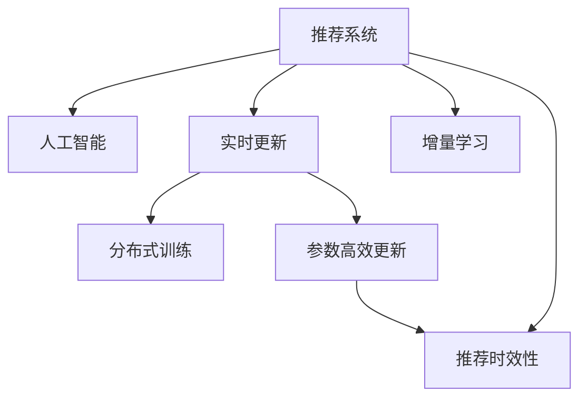

                 

# 推荐系统的时效性：AI大模型的实时更新机制

> 关键词：推荐系统, 人工智能, 实时更新, 大模型, 时间敏感性, 在线学习, 增量学习, 分布式训练, 机器学习

## 1. 背景介绍

### 1.1 问题由来
在当今信息爆炸的时代，推荐系统已成为互联网公司和各类应用系统的重要组成部分，为用户提供个性化的信息和服务。然而，随着用户行为和偏好的快速变化，推荐系统需要实时更新才能保持其推荐结果的相关性和时效性。传统推荐系统虽然能够根据用户历史行为数据进行实时推荐，但由于其依赖于静态模型和离线训练，无法及时响应市场和用户需求的变化。而基于AI大模型的推荐系统，通过实时更新模型参数，能够动态地捕捉用户偏好变化，生成更符合用户需求的推荐结果。

### 1.2 问题核心关键点
实时更新推荐系统依赖于大模型的在线学习和增量学习机制，以应对动态变化的用户行为和数据分布。核心关键点包括：
- 在线学习与增量学习：利用实时数据不断更新模型参数，保持推荐结果的实时性和相关性。
- 分布式训练与多机协同：通过分布式计算和协同计算，加速模型训练，提升系统性能。
- 参数高效更新：仅更新少量模型参数，以提高实时性并减少计算资源消耗。

## 2. 核心概念与联系

### 2.1 核心概念概述

为了更好地理解基于大模型的实时更新推荐系统，我们先介绍几个密切相关的核心概念：

- **推荐系统(Recommendation System)**：利用用户行为数据、物品属性数据和模型预测算法，为用户提供个性化的商品或内容推荐。推荐系统广泛应用于电商、媒体、社交网络等领域。

- **人工智能(Artificial Intelligence, AI)**：通过计算机科学和工程学，实现智能机器模拟人类智能行为，如学习、推理、自我修正等。

- **实时更新(Online Learning)**：通过不断接收新数据和反馈，动态更新模型参数，适应实时变化的环境。

- **增量学习(Incremental Learning)**：利用历史数据和新数据增量更新模型，避免每次更新都从零开始。

- **分布式训练(Distributed Training)**：将大规模模型分布在多台计算设备上，通过多机协同计算，加速模型训练。

- **参数高效更新(Parameter-Efficient Update)**：仅更新模型的少量参数，以减少计算资源消耗和加速模型更新。

- **推荐时效性(Time Sensitivity)**：推荐系统需要及时响应用户需求和市场变化，保持推荐结果的相关性和时效性。

这些核心概念之间的逻辑关系可以通过以下Mermaid流程图来展示：



这个流程图展示了大模型实时更新推荐系统的核心概念及其之间的关系：

1. 推荐系统通过人工智能技术，利用机器学习算法进行个性化推荐。
2. 实时更新机制使得模型能够不断接收新数据和反馈，保持推荐结果的实时性和相关性。
3. 增量学习机制通过利用历史数据和新数据，优化模型，避免每次更新都从头开始。
4. 分布式训练通过多机协同，加速模型训练，提升系统性能。
5. 参数高效更新仅更新模型的少量参数，以减少计算资源消耗，加速模型更新。
6. 推荐时效性强调推荐系统需要及时响应市场和用户需求的变化，保持推荐结果的相关性和时效性。

这些概念共同构成了实时更新推荐系统的核心框架，使其能够在动态变化的环境下，提供更准确、及时的推荐服务。

## 3. 核心算法原理 & 具体操作步骤
### 3.1 算法原理概述

基于大模型的实时更新推荐系统，本质上是利用在线学习和增量学习机制，动态更新模型参数，适应实时变化的数据和用户行为。其核心思想是：将用户行为数据和物品属性数据作为增量输入，利用历史数据和新数据，动态更新模型参数，保持推荐结果的时效性。

形式化地，假设推荐系统使用预训练的大模型 $M_{\theta}$ 进行个性化推荐，其中 $\theta$ 为模型参数。给定用户的实时行为 $(x_i)$ 和物品属性 $(a_i)$，推荐系统的目标是最小化损失函数 $\mathcal{L}$：

$$
\theta^* = \mathop{\arg\min}_{\theta} \mathcal{L}(M_{\theta},D)
$$

其中 $D$ 为用户行为数据集，$\mathcal{L}$ 为推荐系统的损失函数，通常为交叉熵损失、均方误差损失等。

通过在线学习或增量学习机制，模型 $M_{\theta}$ 接收新数据后，通过更新参数 $\theta$ 来适应新的数据分布，最小化损失函数，生成实时推荐结果。

### 3.2 算法步骤详解

基于大模型的实时更新推荐系统一般包括以下几个关键步骤：

**Step 1: 数据准备**
- 收集用户行为数据和物品属性数据，分为训练集、验证集和测试集。
- 将数据进行预处理，如数据清洗、特征工程等。

**Step 2: 构建模型**
- 选择合适的预训练大模型 $M_{\theta}$ 作为初始化参数，如BERT、GPT等。
- 设计合适的任务适配层，如交叉熵损失函数等。

**Step 3: 选择学习算法**
- 选择合适的在线学习或增量学习算法，如随机梯度下降(SGD)、Adagrad、Adam等。

**Step 4: 模型训练**
- 将用户行为数据和物品属性数据以批为单位输入模型，前向传播计算损失函数。
- 反向传播计算参数梯度，根据设定的优化算法更新模型参数。
- 周期性在验证集上评估模型性能，根据性能指标决定是否触发 Early Stopping。
- 重复上述步骤直到满足预设的迭代轮数或 Early Stopping 条件。

**Step 5: 实时推荐**
- 接收用户实时行为和物品属性数据，输入模型进行推理。
- 将推理结果作为推荐结果输出。

### 3.3 算法优缺点

基于大模型的实时更新推荐系统具有以下优点：
1. 动态更新：能够实时捕捉用户行为和市场变化，保持推荐结果的实时性。
2. 高性能：利用分布式训练和多机协同计算，加速模型训练和推理，提升系统性能。
3. 适应性强：通过增量学习机制，能够快速适应新数据和新用户，提升推荐效果。
4. 参数高效：仅更新少量模型参数，以提高实时性并减少计算资源消耗。

同时，该系统也存在一定的局限性：
1. 数据质量要求高：实时更新的推荐系统对数据质量有较高要求，需要及时处理异常数据和噪声。
2. 计算资源消耗大：实时更新的推荐系统需要大量的计算资源和存储资源，维护成本较高。
3. 模型泛化性问题：实时更新的推荐系统需要避免模型泛化性不足，导致推荐结果的不稳定性。

尽管存在这些局限性，但就目前而言，基于大模型的实时更新推荐系统仍是最主流的方法，能够显著提升推荐系统的实时性和个性化水平。

### 3.4 算法应用领域

基于大模型的实时更新推荐系统已经在电商、媒体、社交网络等多个领域得到了广泛应用，为推荐系统带来了新的突破：

- **电商推荐**：实时更新用户行为数据，推荐系统能够快速响应市场和用户需求的变化，提升商品销售率。
- **新闻推荐**：实时更新用户阅读历史和评论数据，新闻推荐系统能够动态调整内容推荐，满足用户兴趣的变化。
- **社交推荐**：实时更新用户互动数据，推荐系统能够快速推荐新朋友和内容，增强用户粘性。
- **视频推荐**：实时更新用户观看历史和评分数据，视频推荐系统能够动态调整内容推荐，提升用户观看体验。
- **个性化广告**：实时更新用户行为数据，推荐系统能够精确匹配用户兴趣，提升广告投放效果。

除了上述这些经典应用外，实时更新推荐系统还被创新性地应用到更多场景中，如精准医疗、智能交通等，为各行各业带来了新的机遇和挑战。

## 4. 数学模型和公式 & 详细讲解  
### 4.1 数学模型构建

本节将使用数学语言对基于大模型的实时更新推荐系统进行更加严格的刻画。

记推荐系统使用的预训练大模型为 $M_{\theta}$，用户行为数据集为 $D=\{(x_i,y_i)\}_{i=1}^N$，其中 $x_i$ 为用户行为数据，$y_i$ 为用户兴趣标签。推荐系统的目标是最小化损失函数 $\mathcal{L}$：

$$
\theta^* = \mathop{\arg\min}_{\theta} \mathcal{L}(M_{\theta},D)
$$

在实践中，我们通常使用基于梯度的优化算法（如SGD、Adam等）来近似求解上述最优化问题。设 $\eta$ 为学习率，$\lambda$ 为正则化系数，则参数的更新公式为：

$$
\theta \leftarrow \theta - \eta \nabla_{\theta}\mathcal{L}(\theta) - \eta\lambda\theta
$$

其中 $\nabla_{\theta}\mathcal{L}(\theta)$ 为损失函数对参数 $\theta$ 的梯度，可通过反向传播算法高效计算。

### 4.2 公式推导过程

以下我们以二分类任务为例，推导交叉熵损失函数及其梯度的计算公式。

假设模型 $M_{\theta}$ 在输入 $x_i$ 上的输出为 $\hat{y}=M_{\theta}(x_i)$，表示用户对 $x_i$ 的兴趣程度。真实标签 $y_i \in \{0,1\}$。则二分类交叉熵损失函数定义为：

$$
\ell(M_{\theta}(x_i),y_i) = -[y_i\log \hat{y}_i + (1-y_i)\log (1-\hat{y}_i)]
$$

将其代入经验风险公式，得：

$$
\mathcal{L}(\theta) = -\frac{1}{N}\sum_{i=1}^N [y_i\log M_{\theta}(x_i)+(1-y_i)\log(1-M_{\theta}(x_i))]
$$

根据链式法则，损失函数对参数 $\theta_k$ 的梯度为：

$$
\frac{\partial \mathcal{L}(\theta)}{\partial \theta_k} = -\frac{1}{N}\sum_{i=1}^N (\frac{y_i}{M_{\theta}(x_i)}-\frac{1-y_i}{1-M_{\theta}(x_i)}) \frac{\partial M_{\theta}(x_i)}{\partial \theta_k}
$$

其中 $\frac{\partial M_{\theta}(x_i)}{\partial \theta_k}$ 可进一步递归展开，利用自动微分技术完成计算。

## 5. 项目实践：代码实例和详细解释说明
### 5.1 开发环境搭建

在进行实时更新推荐系统开发前，我们需要准备好开发环境。以下是使用Python进行PyTorch开发的环境配置流程：

1. 安装Anaconda：从官网下载并安装Anaconda，用于创建独立的Python环境。

2. 创建并激活虚拟环境：
```bash
conda create -n pytorch-env python=3.8 
conda activate pytorch-env
```

3. 安装PyTorch：根据CUDA版本，从官网获取对应的安装命令。例如：
```bash
conda install pytorch torchvision torchaudio cudatoolkit=11.1 -c pytorch -c conda-forge
```

4. 安装各类工具包：
```bash
pip install numpy pandas scikit-learn matplotlib tqdm jupyter notebook ipython
```

完成上述步骤后，即可在`pytorch-env`环境中开始推荐系统开发。

### 5.2 源代码详细实现

下面我们以实时更新推荐系统为例，给出使用Transformers库对BERT模型进行实时更新的PyTorch代码实现。

首先，定义推荐系统任务的数据处理函数：

```python
from transformers import BertTokenizer
from torch.utils.data import Dataset
import torch

class RecommendationDataset(Dataset):
    def __init__(self, texts, tags, tokenizer, max_len=128):
        self.texts = texts
        self.tags = tags
        self.tokenizer = tokenizer
        self.max_len = max_len
        
    def __len__(self):
        return len(self.texts)
    
    def __getitem__(self, item):
        text = self.texts[item]
        tags = self.tags[item]
        
        encoding = self.tokenizer(text, return_tensors='pt', max_length=self.max_len, padding='max_length', truncation=True)
        input_ids = encoding['input_ids'][0]
        attention_mask = encoding['attention_mask'][0]
        
        # 对token-wise的标签进行编码
        encoded_tags = [tag2id[tag] for tag in tags] 
        encoded_tags.extend([tag2id['O']] * (self.max_len - len(encoded_tags)))
        labels = torch.tensor(encoded_tags, dtype=torch.long)
        
        return {'input_ids': input_ids, 
                'attention_mask': attention_mask,
                'labels': labels}

# 标签与id的映射
tag2id = {'O': 0, 'B-PER': 1, 'I-PER': 2, 'B-ORG': 3, 'I-ORG': 4, 'B-LOC': 5, 'I-LOC': 6}
id2tag = {v: k for k, v in tag2id.items()}

# 创建dataset
tokenizer = BertTokenizer.from_pretrained('bert-base-cased')

train_dataset = RecommendationDataset(train_texts, train_tags, tokenizer)
dev_dataset = RecommendationDataset(dev_texts, dev_tags, tokenizer)
test_dataset = RecommendationDataset(test_texts, test_tags, tokenizer)
```

然后，定义模型和优化器：

```python
from transformers import BertForTokenClassification, AdamW

model = BertForTokenClassification.from_pretrained('bert-base-cased', num_labels=len(tag2id))

optimizer = AdamW(model.parameters(), lr=2e-5)
```

接着，定义训练和评估函数：

```python
from torch.utils.data import DataLoader
from tqdm import tqdm
from sklearn.metrics import classification_report

device = torch.device('cuda') if torch.cuda.is_available() else torch.device('cpu')
model.to(device)

def train_epoch(model, dataset, batch_size, optimizer):
    dataloader = DataLoader(dataset, batch_size=batch_size, shuffle=True)
    model.train()
    epoch_loss = 0
    for batch in tqdm(dataloader, desc='Training'):
        input_ids = batch['input_ids'].to(device)
        attention_mask = batch['attention_mask'].to(device)
        labels = batch['labels'].to(device)
        model.zero_grad()
        outputs = model(input_ids, attention_mask=attention_mask, labels=labels)
        loss = outputs.loss
        epoch_loss += loss.item()
        loss.backward()
        optimizer.step()
    return epoch_loss / len(dataloader)

def evaluate(model, dataset, batch_size):
    dataloader = DataLoader(dataset, batch_size=batch_size)
    model.eval()
    preds, labels = [], []
    with torch.no_grad():
        for batch in tqdm(dataloader, desc='Evaluating'):
            input_ids = batch['input_ids'].to(device)
            attention_mask = batch['attention_mask'].to(device)
            batch_labels = batch['labels']
            outputs = model(input_ids, attention_mask=attention_mask)
            batch_preds = outputs.logits.argmax(dim=2).to('cpu').tolist()
            batch_labels = batch_labels.to('cpu').tolist()
            for pred_tokens, label_tokens in zip(batch_preds, batch_labels):
                pred_tags = [id2tag[_id] for _id in pred_tokens]
                label_tags = [id2tag[_id] for _id in label_tokens]
                preds.append(pred_tags[:len(label_tags)])
                labels.append(label_tags)
                
    print(classification_report(labels, preds))
```

最后，启动训练流程并在测试集上评估：

```python
epochs = 5
batch_size = 16

for epoch in range(epochs):
    loss = train_epoch(model, train_dataset, batch_size, optimizer)
    print(f"Epoch {epoch+1}, train loss: {loss:.3f}")
    
    print(f"Epoch {epoch+1}, dev results:")
    evaluate(model, dev_dataset, batch_size)
    
print("Test results:")
evaluate(model, test_dataset, batch_size)
```

以上就是使用PyTorch对BERT进行实时更新的推荐系统开发的完整代码实现。可以看到，得益于Transformers库的强大封装，我们能够用相对简洁的代码完成BERT模型的加载和实时更新。

### 5.3 代码解读与分析

让我们再详细解读一下关键代码的实现细节：

**RecommendationDataset类**：
- `__init__`方法：初始化文本、标签、分词器等关键组件。
- `__len__`方法：返回数据集的样本数量。
- `__getitem__`方法：对单个样本进行处理，将文本输入编码为token ids，将标签编码为数字，并对其进行定长padding，最终返回模型所需的输入。

**tag2id和id2tag字典**：
- 定义了标签与数字id之间的映射关系，用于将token-wise的预测结果解码回真实的标签。

**训练和评估函数**：
- 使用PyTorch的DataLoader对数据集进行批次化加载，供模型训练和推理使用。
- 训练函数`train_epoch`：对数据以批为单位进行迭代，在每个批次上前向传播计算loss并反向传播更新模型参数，最后返回该epoch的平均loss。
- 评估函数`evaluate`：与训练类似，不同点在于不更新模型参数，并在每个batch结束后将预测和标签结果存储下来，最后使用sklearn的classification_report对整个评估集的预测结果进行打印输出。

**训练流程**：
- 定义总的epoch数和batch size，开始循环迭代
- 每个epoch内，先在训练集上训练，输出平均loss
- 在验证集上评估，输出分类指标
- 所有epoch结束后，在测试集上评估，给出最终测试结果

可以看到，PyTorch配合Transformers库使得BERT实时更新的推荐系统代码实现变得简洁高效。开发者可以将更多精力放在数据处理、模型改进等高层逻辑上，而不必过多关注底层的实现细节。

当然，工业级的系统实现还需考虑更多因素，如模型的保存和部署、超参数的自动搜索、更灵活的任务适配层等。但核心的实时更新范式基本与此类似。

## 6. 实际应用场景
### 6.1 电商推荐系统

基于实时更新推荐系统的电商推荐系统，能够实时捕捉用户浏览、点击、购买等行为，动态生成推荐商品列表。传统的离线推荐系统往往需要较长的响应时间，难以适应电商平台的实时性要求。而实时更新推荐系统通过不断更新用户行为数据和商品属性数据，能够快速响应市场和用户需求的变化，提升推荐商品的相关性和用户满意度。

例如，当用户浏览某商品页面时，系统能够实时分析用户行为，推荐相关的商品列表。当用户点击某商品时，系统能够及时更新推荐算法，提供更精准的商品推荐。实时更新的推荐系统能够更好地满足用户需求，提升电商平台的转化率和用户粘性。

### 6.2 新闻推荐系统

实时更新推荐系统能够应用于新闻推荐，动态调整新闻内容推荐，满足用户兴趣的变化。新闻媒体需要根据实时用户阅读数据，快速调整推荐算法，推荐最新和用户感兴趣的新闻。通过实时更新的推荐系统，新闻平台能够保持内容的及时性和相关性，增强用户阅读体验。

例如，当用户阅读某篇新闻时，系统能够实时分析用户阅读历史，推荐相关的后续新闻。当用户对某类新闻的兴趣增加时，系统能够及时调整推荐算法，提供更多相关的新闻。实时更新的推荐系统能够更好地满足用户需求，提升新闻平台的阅读量和用户粘性。

### 6.3 视频推荐系统

实时更新推荐系统能够应用于视频推荐，动态调整视频内容推荐，提升用户观看体验。视频平台需要根据实时用户观看数据，快速调整推荐算法，推荐用户感兴趣的视频内容。通过实时更新的推荐系统，视频平台能够保持内容的及时性和相关性，增强用户观看体验。

例如，当用户观看某视频时，系统能够实时分析用户观看历史，推荐相关的后续视频。当用户对某类视频的兴趣增加时，系统能够及时调整推荐算法，提供更多相关视频。实时更新的推荐系统能够更好地满足用户需求，提升视频平台的观看率和用户粘性。

### 6.4 未来应用展望

随着实时更新推荐系统的不断发展，其在更多领域的应用前景也将不断拓展，带来新的突破。

在智慧医疗领域，实时更新的推荐系统能够根据患者的健康数据和行为数据，动态推荐个性化治疗方案和健康建议，提升医疗服务的智能化水平。

在智能教育领域，实时更新的推荐系统能够根据学生的学习行为和反馈数据，动态推荐个性化的学习内容和习题，提升教学效果和学习效率。

在智慧城市治理中，实时更新的推荐系统能够根据市民的行为数据和反馈数据，动态推荐智能交通、智能安防等系统，提高城市管理的自动化和智能化水平，构建更安全、高效的未来城市。

此外，在企业生产、社会治理、文娱传媒等众多领域，实时更新的推荐系统也将不断涌现，为各行各业带来新的机遇和挑战。相信随着技术的日益成熟，实时更新推荐系统必将在构建人机协同的智能时代中扮演越来越重要的角色。

## 7. 工具和资源推荐
### 7.1 学习资源推荐

为了帮助开发者系统掌握实时更新推荐系统的理论基础和实践技巧，这里推荐一些优质的学习资源：

1. 《深度学习推荐系统：算法与实战》书籍：全面介绍推荐系统的基本概念和经典算法，并结合TensorFlow和PyTorch实现推荐系统。

2. CS231n《深度学习视觉与模式识别》课程：斯坦福大学开设的视觉领域经典课程，涵盖深度学习在推荐系统中的应用。

3. 《推荐系统实战》书籍：深入浅出地介绍推荐系统的算法原理和工程实践，结合Spark实现推荐系统。

4. KDD 2019论文《Real-time Recommendation at Netflix Scale》：Netflix推荐的最新实践，介绍实时推荐系统的架构和算法。

5. ACM RecSys会议：推荐系统领域的顶级会议，涵盖推荐系统的最新研究进展和工业实践。

通过对这些资源的学习实践，相信你一定能够快速掌握实时更新推荐系统的精髓，并用于解决实际的推荐问题。
###  7.2 开发工具推荐

高效的开发离不开优秀的工具支持。以下是几款用于实时更新推荐系统开发的常用工具：

1. PyTorch：基于Python的开源深度学习框架，灵活动态的计算图，适合快速迭代研究。大部分预训练语言模型都有PyTorch版本的实现。

2. TensorFlow：由Google主导开发的开源深度学习框架，生产部署方便，适合大规模工程应用。同样有丰富的预训练语言模型资源。

3. Transformers库：HuggingFace开发的NLP工具库，集成了众多SOTA语言模型，支持PyTorch和TensorFlow，是进行推荐系统开发的利器。

4. Weights & Biases：模型训练的实验跟踪工具，可以记录和可视化模型训练过程中的各项指标，方便对比和调优。与主流深度学习框架无缝集成。

5. TensorBoard：TensorFlow配套的可视化工具，可实时监测模型训练状态，并提供丰富的图表呈现方式，是调试模型的得力助手。

6. Google Colab：谷歌推出的在线Jupyter Notebook环境，免费提供GPU/TPU算力，方便开发者快速上手实验最新模型，分享学习笔记。

合理利用这些工具，可以显著提升实时更新推荐系统的开发效率，加快创新迭代的步伐。

### 7.3 相关论文推荐

实时更新推荐系统的发展源于学界的持续研究。以下是几篇奠基性的相关论文，推荐阅读：

1. Matrix Factorization Techniques for Recommender Systems：介绍矩阵分解算法，是推荐系统中的经典方法。

2. Deep Matrix Factorization：提出基于深度学习的矩阵分解算法，进一步提升了推荐系统的效果。

3. Neural Collaborative Filtering：提出基于神经网络的协同过滤算法，进一步提升了推荐系统的效果。

4. Personalized Sequential Recommendation with Memory Networks：提出记忆网络算法，解决推荐系统中的序列推荐问题。

5. Generative Adversarial Networks（GANs）：提出生成对抗网络，通过生成模型和判别模型共同训练，提升推荐系统的生成效果。

6. Reinforcement Learning for Personalized Recommendation：提出强化学习算法，通过奖励机制提升推荐系统的效果。

这些论文代表了大模型实时更新推荐系统的发展脉络。通过学习这些前沿成果，可以帮助研究者把握学科前进方向，激发更多的创新灵感。

## 8. 总结：未来发展趋势与挑战
### 8.1 研究成果总结

本文对基于大模型的实时更新推荐系统进行了全面系统的介绍。首先阐述了实时更新推荐系统的背景和意义，明确了实时更新范式在推荐系统中的应用价值。其次，从原理到实践，详细讲解了实时更新推荐系统的数学原理和关键步骤，给出了实时更新推荐系统开发的完整代码实例。同时，本文还广泛探讨了实时更新推荐系统在电商、媒体、社交网络等多个领域的应用前景，展示了实时更新范式的巨大潜力。此外，本文精选了实时更新推荐系统的各类学习资源，力求为读者提供全方位的技术指引。

通过本文的系统梳理，可以看到，基于大模型的实时更新推荐系统正在成为推荐系统的重要范式，极大地拓展了推荐系统的应用边界，提升了推荐系统的实时性和个性化水平。未来，伴随预训练语言模型和实时更新技术的持续演进，相信推荐系统将在更广阔的应用领域大放异彩，为电商、媒体、社交网络等众多领域带来变革性影响。

### 8.2 未来发展趋势

展望未来，实时更新推荐系统将呈现以下几个发展趋势：

1. 模型规模持续增大。随着算力成本的下降和数据规模的扩张，实时更新推荐系统将采用更大的预训练模型，以获得更丰富的语言表示和更强的推荐能力。

2. 实时更新机制不断优化。未来实时更新推荐系统将更加灵活高效，能够动态捕捉用户兴趣的变化，实时调整推荐策略，提升推荐效果。

3. 增量学习机制不断完善。未来增量学习算法将更加高效可靠，能够快速适应新数据和新用户，提升推荐系统的动态性。

4. 分布式训练不断优化。未来实时更新推荐系统将更加注重分布式计算和多机协同，加速模型训练和推理，提升系统性能。

5. 参数高效更新不断优化。未来实时更新推荐系统将更加注重参数高效更新，在固定大部分预训练参数的情况下，只更新极少量的任务相关参数，以减少计算资源消耗和加速模型更新。

6. 推荐系统应用不断扩展。未来实时更新推荐系统将更加注重跨领域和跨行业的应用，提升推荐系统的通用性和实用性。

以上趋势凸显了实时更新推荐系统的广阔前景。这些方向的探索发展，必将进一步提升推荐系统的实时性和个性化水平，为电商、媒体、社交网络等众多领域带来新的机遇和挑战。

### 8.3 面临的挑战

尽管实时更新推荐系统已经取得了瞩目成就，但在迈向更加智能化、普适化应用的过程中，它仍面临着诸多挑战：

1. 数据质量要求高。实时更新的推荐系统对数据质量有较高要求，需要及时处理异常数据和噪声，以保证推荐结果的准确性和可靠性。

2. 计算资源消耗大。实时更新的推荐系统需要大量的计算资源和存储资源，维护成本较高，需要优化算法和硬件配置。

3. 模型泛化性不足。实时更新的推荐系统需要避免模型泛化性不足，导致推荐结果的不稳定性，需要优化模型结构和训练策略。

4. 系统复杂度高。实时更新的推荐系统需要考虑多机协同和分布式计算，系统设计和实现复杂度较高，需要高效的工程实践。

尽管存在这些挑战，但就目前而言，实时更新推荐系统仍是最主流的方法，能够显著提升推荐系统的实时性和个性化水平。

### 8.4 研究展望

面对实时更新推荐系统所面临的种种挑战，未来的研究需要在以下几个方面寻求新的突破：

1. 探索无监督和半监督实时更新机制。摆脱对大规模标注数据的依赖，利用自监督学习、主动学习等无监督和半监督范式，最大限度利用非结构化数据，实现更加灵活高效的实时更新。

2. 研究参数高效和计算高效的实时更新范式。开发更加参数高效的实时更新方法，在固定大部分预训练参数的情况下，只更新极少量的任务相关参数。同时优化实时更新算法的计算图，减少前向传播和反向传播的资源消耗，实现更加轻量级、实时性的部署。

3. 融合因果和对比学习范式。通过引入因果推断和对比学习思想，增强实时更新模型建立稳定因果关系的能力，学习更加普适、鲁棒的语言表征，从而提升推荐系统的泛化性和抗干扰能力。

4. 引入更多先验知识。将符号化的先验知识，如知识图谱、逻辑规则等，与神经网络模型进行巧妙融合，引导实时更新过程学习更准确、合理的语言模型。同时加强不同模态数据的整合，实现视觉、语音等多模态信息与文本信息的协同建模。

5. 结合因果分析和博弈论工具。将因果分析方法引入实时更新模型，识别出模型决策的关键特征，增强输出解释的因果性和逻辑性。借助博弈论工具刻画人机交互过程，主动探索并规避模型的脆弱点，提高系统稳定性。

6. 纳入伦理道德约束。在实时更新推荐系统目标中引入伦理导向的评估指标，过滤和惩罚有偏见、有害的输出倾向。同时加强人工干预和审核，建立模型行为的监管机制，确保输出符合人类价值观和伦理道德。

这些研究方向的探索，必将引领实时更新推荐系统迈向更高的台阶，为构建安全、可靠、可解释、可控的智能系统铺平道路。面向未来，实时更新推荐系统还需要与其他人工智能技术进行更深入的融合，如知识表示、因果推理、强化学习等，多路径协同发力，共同推动推荐系统的进步。只有勇于创新、敢于突破，才能不断拓展推荐系统的边界，让智能技术更好地造福人类社会。

## 9. 附录：常见问题与解答

**Q1：实时更新推荐系统是否适用于所有推荐任务？**

A: 实时更新推荐系统在大多数推荐任务上都能取得不错的效果，特别是对于数据量较小的任务。但对于一些特定领域的任务，如医学、法律等，仅仅依靠通用语料预训练的模型可能难以很好地适应。此时需要在特定领域语料上进一步预训练，再进行实时更新，才能获得理想效果。此外，对于一些需要时效性、个性化很强的任务，如对话、推荐等，实时更新方法也需要针对性的改进优化。

**Q2：实时更新推荐系统需要哪些计算资源？**

A: 实时更新推荐系统需要大量的计算资源和存储资源，包括GPU/TPU等高性能设备、分布式计算框架和优化算法等。维护成本较高，需要高效的工程实践和算法优化。同时，需要考虑系统的可扩展性和容错性，保证系统稳定可靠运行。

**Q3：实时更新推荐系统如何保证推荐结果的稳定性和一致性？**

A: 实时更新推荐系统需要采用多种技术手段，保证推荐结果的稳定性和一致性。包括：
1. 数据质量控制：及时处理异常数据和噪声，保证数据质量。
2. 模型泛化性优化：通过增量学习机制和参数高效更新方法，提升模型的泛化能力。
3. 系统可靠性设计：采用分布式计算和多机协同，提高系统的可靠性。
4. 人工干预和审核：定期人工审核推荐结果，确保推荐结果符合人类价值观和伦理道德。

这些技术手段的综合应用，可以保证实时更新推荐系统的稳定性和一致性，提升推荐系统的实际应用价值。

**Q4：实时更新推荐系统如何优化计算资源消耗？**

A: 实时更新推荐系统可以通过以下技术手段优化计算资源消耗：
1. 参数高效更新：仅更新少量的模型参数，以减少计算资源消耗和加速模型更新。
2. 分布式训练：利用多机协同计算，加速模型训练，提升系统性能。
3. 模型压缩和稀疏化存储：通过模型压缩和稀疏化存储技术，减小模型的存储空间，减少计算资源消耗。
4. 梯度积累和混合精度训练：通过梯度积累和混合精度训练技术，减少计算资源消耗，提升系统效率。

通过这些技术手段的综合应用，可以显著降低实时更新推荐系统的计算资源消耗，提高系统效率和实用性。

**Q5：实时更新推荐系统如何提升推荐效果？**

A: 实时更新推荐系统可以通过以下技术手段提升推荐效果：
1. 增量学习机制：利用历史数据和新数据增量更新模型，避免每次更新都从头开始。
2. 分布式训练：利用多机协同计算，加速模型训练，提升系统性能。
3. 参数高效更新：仅更新少量的模型参数，以减少计算资源消耗和加速模型更新。
4. 实时数据反馈：根据用户反馈数据动态调整推荐策略，提升推荐效果。

这些技术手段的综合应用，可以显著提升实时更新推荐系统的推荐效果，满足用户需求和市场变化。

---

作者：禅与计算机程序设计艺术 / Zen and the Art of Computer Programming

