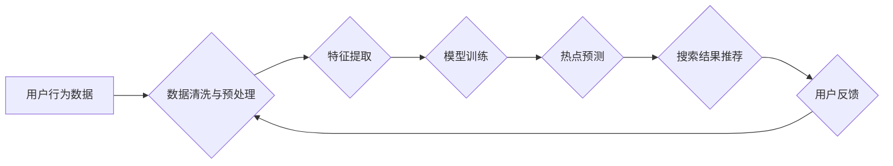

                 

## 电商搜索中的AI实时热点感知技术

> 关键词：电商搜索、实时热点感知、AI算法、自然语言处理、推荐系统、用户行为分析、数据挖掘

## 1. 背景介绍

在当今数据爆炸的时代，电商平台面临着日益激烈的竞争压力。用户搜索行为的多样性和瞬息万变的市场趋势，使得传统的搜索引擎难以满足用户对个性化、精准的商品推荐需求。因此，实时感知用户兴趣和市场热点，并将其融入搜索结果中，成为电商平台提升用户体验和商业价值的关键。

AI实时热点感知技术正是应运而生。它通过对海量用户行为数据、商品信息和市场趋势的分析，能够快速识别出当下热门的商品、关键词和话题，并将其反馈到搜索引擎中，为用户提供更精准、更符合当前市场需求的搜索结果。

## 2. 核心概念与联系

### 2.1  实时热点感知

实时热点感知是指通过对海量数据进行实时分析，识别出当下用户关注度高、传播速度快的商品、关键词和话题。它需要具备以下关键特性：

* **实时性:**  能够快速捕捉数据变化，及时识别热点。
* **精准性:**  能够准确识别出真正具有热度的内容，避免虚假热点。
* **动态性:**  能够随着用户行为和市场趋势的变化而动态更新热点信息。

### 2.2  AI算法

AI算法是实时热点感知的核心技术。常用的算法包括：

* **自然语言处理 (NLP):** 用于分析用户搜索词、评论和社交媒体内容，识别出关键词和话题。
* **机器学习 (ML):** 用于训练模型，预测商品的热度和用户兴趣。
* **深度学习 (DL):** 用于更深入地理解用户行为和市场趋势，识别出更细粒度的热点。

### 2.3  数据源

实时热点感知需要依赖于海量数据源，包括：

* **用户行为数据:** 用户搜索历史、浏览记录、购买记录、评论等。
* **商品信息数据:** 商品标题、描述、价格、分类、销量等。
* **市场趋势数据:** 新闻、博客、社交媒体等平台上的热门话题和关键词。

**Mermaid 流程图**



## 3. 核心算法原理 & 具体操作步骤

### 3.1  算法原理概述

本文将介绍一种基于深度学习的实时热点感知算法，该算法利用长短期记忆网络 (LSTM) 来捕捉用户行为数据中的时间依赖性，并结合注意力机制来识别出最重要的特征。

### 3.2  算法步骤详解

1. **数据收集与预处理:** 收集用户行为数据、商品信息数据和市场趋势数据，并进行清洗、预处理，例如去除噪声、转换数据格式等。
2. **特征提取:** 从数据中提取特征，例如用户搜索词、商品类别、用户购买历史等。
3. **模型训练:** 使用 LSTM 网络和注意力机制训练模型，将提取的特征作为输入，预测商品的热度和用户兴趣。
4. **热点预测:** 将实时用户行为数据输入到训练好的模型中，预测出当下热门的商品、关键词和话题。
5. **搜索结果推荐:** 将预测出的热点信息融入到搜索结果中，为用户提供更精准、更符合当前市场需求的搜索结果。

### 3.3  算法优缺点

**优点:**

* **能够捕捉时间依赖性:** LSTM 网络能够捕捉用户行为数据中的时间依赖性，识别出短期和长期热点。
* **识别重要特征:** 注意力机制能够识别出最重要的特征，提高预测精度。
* **实时性强:** 算法能够实时更新热点信息，满足电商平台对实时性的需求。

**缺点:**

* **数据依赖性强:** 算法的性能取决于数据质量和数量。
* **计算资源消耗大:** LSTM 网络训练和预测需要大量的计算资源。

### 3.4  算法应用领域

* **电商搜索:** 为用户提供更精准、更符合当前市场需求的搜索结果。
* **商品推荐:** 推荐热门商品和用户感兴趣的商品。
* **内容推荐:** 推荐热门新闻、博客文章和视频。
* **社交媒体分析:** 分析用户兴趣和市场趋势。

## 4. 数学模型和公式 & 详细讲解 & 举例说明

### 4.1  数学模型构建

本文采用 LSTM 网络作为核心模型，其结构如图所示：


其中，$x_t$ 表示时间步 $t$ 的输入，$h_t$ 表示时间步 $t$ 的隐藏状态，$y_t$ 表示时间步 $t$ 的输出。

### 4.2  公式推导过程

LSTM 网络的隐藏状态更新公式如下：

$$
\begin{aligned}
f_t &= \sigma(W_f \cdot [h_{t-1}, x_t] + b_f) \\
i_t &= \sigma(W_i \cdot [h_{t-1}, x_t] + b_i) \\
g_t &= \tanh(W_g \cdot [h_{t-1}, x_t] + b_g) \\
o_t &= \sigma(W_o \cdot [h_{t-1}, x_t] + b_o) \\
C_t &= f_t \cdot C_{t-1} + i_t \cdot g_t \\
h_t &= o_t \cdot \tanh(C_t)
\end{aligned}
$$

其中，$\sigma$ 表示 sigmoid 函数，$\tanh$ 表示 hyperbolic tangent 函数，$W_f$, $W_i$, $W_g$, $W_o$ 表示权重矩阵，$b_f$, $b_i$, $b_g$, $b_o$ 表示偏置项。

### 4.3  案例分析与讲解

假设我们想要预测某个商品的热度，可以使用 LSTM 网络将该商品的搜索词、评论、购买记录等数据作为输入，并训练模型预测该商品的热度值。

例如，如果某个商品的搜索词是“新款手机”，评论中提到“拍照效果很好”，购买记录显示该商品销量很高，那么 LSTM 网络可以根据这些信息预测该商品的热度值较高。

## 5. 项目实践：代码实例和详细解释说明

### 5.1  开发环境搭建

* Python 3.6+
* TensorFlow 2.0+
* PyTorch 1.0+
* Jupyter Notebook

### 5.2  源代码详细实现

```python
import tensorflow as tf

# 定义 LSTM 网络模型
model = tf.keras.Sequential([
    tf.keras.layers.Embedding(input_dim=vocab_size, output_dim=embedding_dim),
    tf.keras.layers.LSTM(units=128),
    tf.keras.layers.Dense(units=1, activation='sigmoid')
])

# 编译模型
model.compile(optimizer='adam', loss='binary_crossentropy', metrics=['accuracy'])

# 训练模型
model.fit(x_train, y_train, epochs=10, batch_size=32)

# 预测热点
predictions = model.predict(x_test)
```

### 5.3  代码解读与分析

* **Embedding 层:** 将用户搜索词转换为稠密的向量表示。
* **LSTM 层:** 捕捉用户行为数据中的时间依赖性。
* **Dense 层:** 将 LSTM 输出转换为预测结果。
* **编译模型:** 选择优化器、损失函数和评价指标。
* **训练模型:** 使用训练数据训练模型。
* **预测热点:** 使用训练好的模型预测新数据的热点信息。

### 5.4  运行结果展示

训练完成后，可以评估模型的性能，例如准确率、召回率等。

## 6. 实际应用场景

### 6.1  电商搜索推荐

实时热点感知技术可以用于电商搜索推荐，为用户提供更精准、更符合当前市场需求的搜索结果。例如，当用户搜索“新款手机”时，系统可以根据实时热点数据，推荐最新的手机型号和热门的手机配件。

### 6.2  商品分类与标签

实时热点感知技术可以用于商品分类和标签，识别出当下热门的商品类别和标签。例如，系统可以根据用户搜索词和评论数据，识别出当下热门的服装款式和颜色。

### 6.3  营销活动策划

实时热点感知技术可以用于营销活动策划，识别出当下热门的商品和话题，并策划相应的营销活动。例如，系统可以根据用户搜索词和社交媒体数据，识别出当下热门的节日和促销活动，并策划相应的营销活动。

### 6.4  未来应用展望

随着人工智能技术的不断发展，实时热点感知技术将有更广泛的应用场景，例如：

* **个性化推荐:** 为每个用户提供更个性化的商品推荐。
* **内容创作:** 自动生成热门内容，例如新闻、博客文章和视频。
* **市场预测:** 预测市场趋势，帮助企业做出更明智的决策。

## 7. 工具和资源推荐

### 7.1  学习资源推荐

* **书籍:**
    * 《深度学习》
    * 《自然语言处理》
* **在线课程:**
    * Coursera: 深度学习
    * Udacity: 自然语言处理
* **博客:**
    * TensorFlow Blog
    * PyTorch Blog

### 7.2  开发工具推荐

* **TensorFlow:** 开源深度学习框架
* **PyTorch:** 开源深度学习框架
* **Jupyter Notebook:** 用于代码编写和可视化分析的工具

### 7.3  相关论文推荐

* **Attention Is All You Need:** https://arxiv.org/abs/1706.03762
* **Recurrent Neural Networks for Sequence Learning:** https://arxiv.org/abs/1409.2329

## 8. 总结：未来发展趋势与挑战

### 8.1  研究成果总结

本文介绍了一种基于深度学习的实时热点感知算法，该算法能够有效地识别出当下热门的商品、关键词和话题。该算法在电商搜索推荐、商品分类和营销活动策划等领域具有广泛的应用前景。

### 8.2  未来发展趋势

* **模型更深更广:** 探索更深层次的网络结构和更广泛的特征，提高预测精度。
* **多模态融合:** 将文本、图像、视频等多模态数据融合，构建更全面的热点感知模型。
* **实时性更强:** 探索更快速的模型训练和预测方法，满足电商平台对实时性的更高要求。

### 8.3  面临的挑战

* **数据质量:** 算法的性能取决于数据质量和数量，需要不断收集和清洗高质量的数据。
* **计算资源:** 训练深度学习模型需要大量的计算资源，需要探索更有效的训练方法和硬件平台。
* **解释性:** 深度学习模型的决策过程难以解释，需要探索更可解释的模型架构和算法。

### 8.4  研究展望

未来，实时热点感知技术将继续朝着更智能、更精准、更可解释的方向发展，为电商平台提供更强大的数据分析和决策支持能力。

## 9. 附录：常见问题与解答

**Q1: 如何评估实时热点感知算法的性能？**

**A1:** 可以使用准确率、召回率、F1-score等指标来评估算法的性能。

**Q2: 如何处理数据中的噪声和缺失值？**

**A2:** 可以使用数据清洗和预处理方法来处理数据中的噪声和缺失值。例如，可以使用滑动窗口法过滤掉异常值，使用平均值或众数填充缺失值。

**Q3: 如何选择合适的深度学习模型？**

**A3:** 可以根据具体应用场景和数据特点选择合适的深度学习模型。例如，对于文本数据，可以使用 LSTM 或 Transformer 模型；对于图像数据，可以使用 CNN 模型。


作者：禅与计算机程序设计艺术 / Zen and the Art of Computer Programming 
<end_of_turn>

