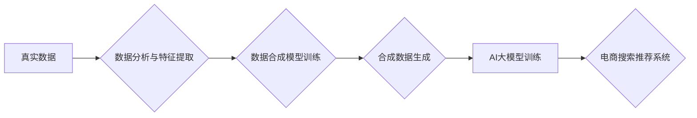

                 

## 电商搜索推荐中的AI大模型数据合成技术应用调研报告

> 关键词：电商搜索推荐、AI大模型、数据合成、数据隐私、数据增强、推荐系统

## 1. 背景介绍

随着电商行业的蓬勃发展，搜索推荐系统已成为电商平台的核心竞争力之一。高效精准的搜索推荐能够显著提升用户体验，促进商品销售，并为商家提供更精准的营销策略。传统的搜索推荐系统主要依赖于用户行为数据、商品特征数据等，但这些数据往往存在以下问题：

* **数据稀疏性:** 用户行为数据和商品特征数据往往存在稀疏性，导致模型训练效果不佳。
* **数据隐私问题:** 用户隐私数据敏感，直接使用存在泄露风险。
* **数据标注成本高:**  高质量的标注数据成本高昂，难以满足模型训练需求。

为了解决这些问题，近年来，AI大模型技术在电商搜索推荐领域得到了广泛应用。AI大模型能够学习海量数据中的复杂模式，提升推荐效果。然而，AI大模型的训练也需要大量高质量的数据支持。数据合成技术应运而生，它能够通过算法生成模拟真实数据的样本，有效缓解数据稀疏性、隐私问题和标注成本等挑战。

## 2. 核心概念与联系

### 2.1 数据合成技术概述

数据合成技术是指利用机器学习算法，根据真实数据的统计特征和分布规律，生成与真实数据相似的伪数据。这些伪数据在统计学上与真实数据相似，但每个样本都是独立生成的，不包含真实用户的隐私信息。

### 2.2 AI大模型与数据合成技术的关系

AI大模型的训练需要大量数据，而数据合成技术能够有效补充真实数据的不足，为AI大模型提供更多训练样本。数据合成技术与AI大模型的结合，能够有效提升电商搜索推荐系统的性能，并解决数据隐私和标注成本等问题。

**数据合成技术与AI大模型的应用流程:**



## 3. 核心算法原理 & 具体操作步骤

### 3.1 算法原理概述

数据合成技术常用的算法包括：

* **基于统计模型的合成:** 利用统计模型，如高斯分布、贝叶斯网络等，根据真实数据的统计特征生成伪数据。
* **基于生成对抗网络 (GAN) 的合成:** GAN由生成器和判别器两部分组成，生成器生成伪数据，判别器判断数据真实性，两者相互对抗，最终生成与真实数据相似的伪数据。
* **基于变分自编码器 (VAE) 的合成:** VAE通过编码器将数据压缩成低维表示，然后通过解码器将低维表示恢复成数据，可以生成与真实数据相似的伪数据。

### 3.2 算法步骤详解

以基于GAN的合成为例，具体步骤如下：

1. **数据预处理:** 对真实数据进行清洗、转换、归一化等预处理操作。
2. **模型构建:** 建立生成器和判别器模型，并选择合适的损失函数。
3. **模型训练:** 利用真实数据训练生成器和判别器模型，使其相互对抗，生成器生成越来越逼真的伪数据，判别器越来越难区分真实数据和伪数据。
4. **数据生成:** 利用训练好的生成器模型，生成新的伪数据。
5. **数据评估:** 对生成的伪数据进行评估，例如与真实数据进行对比分析，评估其质量。

### 3.3 算法优缺点

**优点:**

* 可以生成与真实数据相似的伪数据，有效缓解数据稀疏性和隐私问题。
* 可以生成多种类型的数据，例如文本、图像、音频等。

**缺点:**

* 训练复杂度高，需要大量的计算资源和时间。
* 生成的伪数据可能存在一些偏差，与真实数据不完全一致。

### 3.4 算法应用领域

数据合成技术广泛应用于以下领域：

* **电商搜索推荐:** 生成用户行为数据、商品特征数据等，提升推荐效果。
* **医疗健康:** 生成患者数据、医疗影像数据等，用于疾病诊断、药物研发等。
* **金融保险:** 生成交易数据、客户画像数据等，用于风险控制、精准营销等。

## 4. 数学模型和公式 & 详细讲解 & 举例说明

### 4.1 数学模型构建

以基于GAN的合成为例，生成器模型可以采用多层感知机 (MLP) 或卷积神经网络 (CNN) 等结构，判别器模型通常采用多层感知机 (MLP)。

### 4.2 公式推导过程

GAN的训练目标是使生成器生成的伪数据尽可能逼真，使其难以被判别器区分。

* **生成器损失函数:**  $$L_G = E_{z \sim p_z(z)}[log D(G(z))]$$
* **判别器损失函数:** $$L_D = E_{x \sim p_{data}(x)}[log D(x)] + E_{z \sim p_z(z)}[log(1 - D(G(z)))]$$

其中：

* $G(z)$ 表示生成器生成的伪数据，$z$ 是随机噪声向量。
* $D(x)$ 表示判别器对数据 $x$ 的判断概率。
* $p_{data}(x)$ 是真实数据的分布。
* $p_z(z)$ 是随机噪声向量的分布。

### 4.3 案例分析与讲解

假设我们想要生成电商商品的描述文本。我们可以使用基于GAN的合成技术，训练一个生成器模型，使其能够生成与真实商品描述文本相似的文本。

**训练数据:**  收集大量电商商品的真实描述文本。

**模型训练:**  利用训练数据训练生成器和判别器模型，使其相互对抗，生成越来越逼真的商品描述文本。

**数据评估:**  评估生成的商品描述文本的质量，例如使用BLEU分数评估其与真实文本的相似度。

## 5. 项目实践：代码实例和详细解释说明

### 5.1 开发环境搭建

* Python 3.7+
* TensorFlow 2.0+
* PyTorch 1.0+
* Jupyter Notebook

### 5.2 源代码详细实现

```python
# 生成器模型
class Generator(tf.keras.Model):
    def __init__(self):
        super(Generator, self).__init__()
        # 定义生成器模型结构
        # ...

    def call(self, z):
        # 生成商品描述文本
        # ...

# 判别器模型
class Discriminator(tf.keras.Model):
    def __init__(self):
        super(Discriminator, self).__init__()
        # 定义判别器模型结构
        # ...

    def call(self, x):
        # 判断数据真实性
        # ...

# 训练模型
optimizer = tf.keras.optimizers.Adam(learning_rate=0.0002)
generator = Generator()
discriminator = Discriminator()

# 训练循环
for epoch in range(num_epochs):
    for batch in dataset:
        # ...
```

### 5.3 代码解读与分析

* 生成器模型负责生成商品描述文本，判别器模型负责判断文本真实性。
* 训练过程中，生成器和判别器模型相互对抗，生成器试图生成逼真的文本，判别器试图区分真实文本和伪文本。
* 损失函数用于衡量模型的训练效果，优化器用于更新模型参数。

### 5.4 运行结果展示

训练完成后，可以使用生成器模型生成新的商品描述文本，并评估其质量。

## 6. 实际应用场景

### 6.1 数据增强

数据合成技术可以用于增强电商搜索推荐系统的训练数据，例如生成模拟不同用户行为的数据，提升模型的泛化能力。

### 6.2 个性化推荐

数据合成技术可以用于生成个性化的推荐数据，例如根据用户的兴趣爱好生成个性化的商品推荐列表。

### 6.3 隐私保护

数据合成技术可以用于保护用户隐私，例如生成模拟用户行为数据的样本，用于模型训练，而不会泄露用户的真实信息。

### 6.4 未来应用展望

随着AI大模型技术的不断发展，数据合成技术在电商搜索推荐领域将有更广泛的应用场景，例如：

* 生成更逼真的商品描述文本，提升用户体验。
* 生成更精准的商品推荐，提高转化率。
* 生成更个性化的推荐，满足用户的个性化需求。

## 7. 工具和资源推荐

### 7.1 学习资源推荐

* **论文:**

    * "Generative Adversarial Networks" (Goodfellow et al., 2014)
    * "Improved Techniques for Training GANs" (Radford et al., 2015)
    * "Wasserstein GAN" (Arjovsky et al., 2017)

* **书籍:**

    * "Deep Learning" (Goodfellow et al., 2016)
    * "Generative Deep Learning" (Goodfellow et al., 2018)

### 7.2 开发工具推荐

* **TensorFlow:** https://www.tensorflow.org/
* **PyTorch:** https://pytorch.org/
* **Keras:** https://keras.io/

### 7.3 相关论文推荐

* **电商搜索推荐中的数据合成技术:**

    * "Data Augmentation for Recommender Systems: A Survey" (Wang et al., 2021)
    * "Synthetic Data Generation for Recommender Systems: A Survey" (Li et al., 2022)

## 8. 总结：未来发展趋势与挑战

### 8.1 研究成果总结

数据合成技术在电商搜索推荐领域取得了显著成果，能够有效缓解数据稀疏性和隐私问题，提升推荐效果。

### 8.2 未来发展趋势

* **更逼真的数据生成:** 研究更先进的生成模型，生成与真实数据更加相似的伪数据。
* **更个性化的数据生成:** 研究根据用户特征生成个性化的推荐数据。
* **更安全的隐私保护:** 研究更有效的隐私保护技术，确保数据合成过程中的隐私安全。

### 8.3 面临的挑战

* **数据质量问题:** 生成的伪数据可能存在一些偏差，需要不断改进算法和模型，提高数据质量。
* **计算资源需求:** 训练大型生成模型需要大量的计算资源，成本较高。
* **伦理问题:** 数据合成技术可能被用于生成虚假信息，需要关注其伦理问题，确保其安全和可控使用。

### 8.4 研究展望

未来，数据合成技术将继续发展，在电商搜索推荐领域发挥更重要的作用。研究者需要不断探索新的算法和模型，提高数据合成技术的效率和准确性，并关注其伦理问题，确保其安全和可控使用。

## 9. 附录：常见问题与解答

* **Q1: 数据合成技术与数据标注有什么区别？**

* **A1:** 数据标注是指人工对数据进行标记，例如对文本进行分类、对图像进行识别等。数据合成技术则是利用算法生成模拟真实数据的样本，无需人工标注。

* **Q2: 数据合成技术是否可以完全替代真实数据？**

* **A2:** 数据合成技术可以有效补充真实数据的不足，但不能完全替代真实数据。真实数据包含丰富的细节和复杂模式，而合成数据可能存在一些偏差。

* **Q3: 数据合成技术有哪些应用场景？**

* **A3:** 数据合成技术广泛应用于电商搜索推荐、医疗健康、金融保险等领域，用于数据增强、个性化推荐、隐私保护等。


作者：禅与计算机程序设计艺术 / Zen and the Art of Computer Programming 
<end_of_turn>

