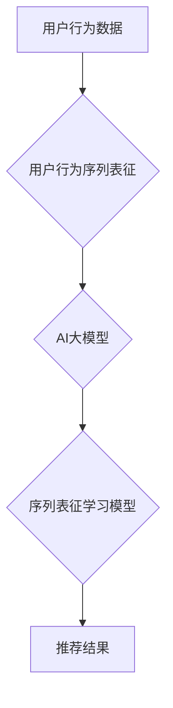

                 

## 电商搜索推荐中的AI大模型用户行为序列表征学习模型评估体系

> 关键词：电商搜索推荐、AI大模型、用户行为序列表征、学习模型、评估体系、推荐算法

## 1. 背景介绍

在当今数据爆炸的时代，电商平台面临着海量商品和用户数据，如何精准推荐用户感兴趣的商品，提升用户体验和转化率成为关键挑战。传统的基于规则或协同过滤的推荐算法难以有效应对用户行为的多样性和复杂性。近年来，随着深度学习技术的快速发展，基于AI大模型的用户行为序列表征学习模型逐渐成为电商搜索推荐领域的研究热点。

AI大模型能够学习用户行为背后的复杂模式，并生成更精准的用户画像，从而实现个性化推荐。用户行为序列表征学习模型则通过学习用户行为序列中的潜在特征，挖掘用户兴趣和偏好，为推荐提供更丰富的语义信息。

然而，由于AI大模型的复杂性和用户行为序列的动态性，如何有效评估用户行为序列表征学习模型的性能，并选择最优模型方案，仍然是一个重要的研究课题。

## 2. 核心概念与联系

### 2.1 用户行为序列表征

用户行为序列表征是指对用户在电商平台上的行为序列进行抽象和表示，以捕捉用户兴趣、偏好和购物习惯等信息。常见的用户行为序列包括：

* **浏览历史:** 用户浏览过的商品、分类、页面等信息。
* **搜索历史:** 用户搜索过的关键词、商品名称等信息。
* **购买历史:** 用户购买过的商品、数量、价格等信息。
* **评价历史:** 用户对商品的评价、评分等信息。
* **收藏历史:** 用户收藏过的商品、分类等信息。

### 2.2 AI大模型

AI大模型是指具有海量参数和强大的学习能力的深度学习模型，能够处理复杂的数据模式和任务。常见的AI大模型包括：

* **Transformer:** 能够捕捉长距离依赖关系的模型，在自然语言处理领域取得了突破性进展。
* **Recurrent Neural Network (RNN):** 能够处理序列数据的模型，常用于文本生成、机器翻译等任务。
* **Graph Neural Network (GNN):** 能够处理图结构数据的模型，常用于社交网络分析、推荐系统等任务。

### 2.3 序列表征学习模型

序列表征学习模型是指利用AI大模型学习用户行为序列中的潜在特征，并将其表示为向量，用于推荐系统中。常见的序列表征学习模型包括：

* **BERT:** 基于Transformer架构的模型，能够学习用户行为序列的上下文语义信息。
* **LSTM:** 基于RNN架构的模型，能够捕捉用户行为序列中的时间依赖关系。
* **GraphSAGE:** 基于GNN架构的模型，能够学习用户行为网络中的节点关系和特征。

**核心概念与联系流程图:**



## 3. 核心算法原理 & 具体操作步骤

### 3.1 算法原理概述

用户行为序列表征学习模型的核心原理是利用AI大模型学习用户行为序列中的潜在特征，并将其表示为向量。这些向量能够捕捉用户兴趣、偏好和购物习惯等信息，为推荐系统提供更丰富的语义信息。

常见的序列表征学习模型包括：

* **Transformer-based模型:** 

Transformer模型能够捕捉长距离依赖关系，因此在学习用户行为序列中的上下文语义信息方面表现出色。BERT模型是Transformer架构的经典应用，能够通过预训练和微调的方式学习用户行为序列的语义表示。

* **RNN-based模型:** 

RNN模型能够处理序列数据，并捕捉时间依赖关系。LSTM模型是RNN架构的改进版本，能够解决梯度消失问题，在学习用户行为序列中的时间依赖关系方面表现优异。

* **GNN-based模型:** 

GNN模型能够处理图结构数据，并学习节点之间的关系和特征。GraphSAGE模型是GNN架构的经典应用，能够学习用户行为网络中的节点关系和特征，例如用户-商品交互关系、用户-用户交互关系等。

### 3.2 算法步骤详解

**以BERT模型为例，详细说明其学习用户行为序列表征的步骤:**

1. **数据预处理:** 将用户行为数据转换为BERT模型可识别的格式，例如将商品名称、用户ID等信息转换为词向量。
2. **模型预训练:** 使用大量的文本数据对BERT模型进行预训练，学习语言模型的通用知识和语义表示能力。
3. **模型微调:** 将预训练好的BERT模型应用于用户行为数据，并进行微调，使其能够更好地学习用户行为序列的语义信息。
4. **序列表征提取:** 将用户行为序列输入到微调后的BERT模型中，提取每个用户行为的语义表示向量。
5. **推荐系统集成:** 将提取的用户行为序列表征向量作为推荐系统的输入特征，用于预测用户对商品的兴趣和偏好。

### 3.3 算法优缺点

**优点:**

* 能够学习用户行为序列中的复杂模式和语义信息。
* 能够捕捉用户兴趣和偏好的动态变化。
* 能够实现个性化推荐，提升用户体验和转化率。

**缺点:**

* 训练数据量大，计算资源消耗高。
* 模型复杂度高，需要专业的技术人员进行开发和维护。
* 难以解释模型的决策过程，缺乏可解释性。

### 3.4 算法应用领域

* 电商搜索推荐
* 内容推荐
* 个性化广告
* 用户行为分析
* 情绪识别

## 4. 数学模型和公式 & 详细讲解 & 举例说明

### 4.1 数学模型构建

用户行为序列表征学习模型通常采用以下数学模型：

* **嵌入层:** 将用户行为序列中的每个元素（例如商品ID、用户ID）映射到一个低维向量空间中，称为嵌入向量。

* **注意力层:** 学习用户行为序列中不同元素之间的关系和重要性，并赋予每个元素不同的权重。

* **聚合层:** 将注意力层输出的加权向量进行聚合，得到用户行为序列的整体表示向量。

### 4.2 公式推导过程

**嵌入层:**

假设用户行为序列为 $x = (x_1, x_2, ..., x_T)$，其中 $x_i$ 表示序列中的第 $i$ 个元素。嵌入层将每个元素 $x_i$ 映射到一个低维向量 $e_i$ 中，可以通过以下公式表示：

$$e_i = W_e x_i$$

其中 $W_e$ 是嵌入矩阵。

**注意力层:**

注意力层的目的是学习用户行为序列中不同元素之间的关系和重要性。常用的注意力机制包括自注意力机制和多头注意力机制。

**自注意力机制:**

对于序列中的每个元素 $x_i$，其注意力权重 $a_{ij}$ 可以通过以下公式计算：

$$a_{ij} = \frac{exp(score(e_i, e_j))}{\sum_{k=1}^{T} exp(score(e_i, e_k))}$$

其中 $score(e_i, e_j)$ 是 $e_i$ 和 $e_j$ 之间的相似度得分，可以使用点积或其他相似度度量方法计算。

**聚合层:**

聚合层将注意力层输出的加权向量进行聚合，得到用户行为序列的整体表示向量。常用的聚合方法包括平均聚合和最大聚合。

**平均聚合:**

$$h = \frac{1}{T} \sum_{i=1}^{T} a_{i} e_i$$

其中 $h$ 是用户行为序列的整体表示向量。

### 4.3 案例分析与讲解

假设我们有一个用户行为序列：

$$x = (商品A, 商品B, 商品C, 商品A)$$

我们可以使用BERT模型学习该序列的序列表征。首先，将每个商品ID映射到嵌入向量空间中。然后，使用注意力机制计算每个商品之间的关系和重要性。最后，使用聚合层将加权向量聚合，得到该用户行为序列的整体表示向量。

这个整体表示向量能够捕捉用户对商品A和C的兴趣，以及对商品B的较低兴趣。

## 5. 项目实践：代码实例和详细解释说明

### 5.1 开发环境搭建

* Python 3.7+
* TensorFlow 2.0+
* PyTorch 1.0+
* CUDA 10.0+ (可选)

### 5.2 源代码详细实现

```python
# 使用BERT模型学习用户行为序列表征

from transformers import BertModel, BertTokenizer

# 加载预训练的BERT模型和词典
model_name = "bert-base-uncased"
tokenizer = BertTokenizer.from_pretrained(model_name)
model = BertModel.from_pretrained(model_name)

# 用户行为序列
user_behavior_sequence = ["商品A", "商品B", "商品C", "商品A"]

# 将用户行为序列转换为BERT模型可识别的格式
input_ids = tokenizer.encode(user_behavior_sequence, add_special_tokens=True)

# 将输入序列送入BERT模型进行处理
outputs = model(input_ids)

# 获取用户行为序列的整体表示向量
sequence_representation = outputs.last_hidden_state[:, 0, :]

# 打印用户行为序列的整体表示向量
print(sequence_representation)
```

### 5.3 代码解读与分析

* 首先，我们使用`transformers`库加载预训练的BERT模型和词典。
* 然后，我们将用户行为序列转换为BERT模型可识别的格式，即将每个单词转换为其对应的词向量。
* 将输入序列送入BERT模型进行处理，模型会输出每个单词的隐藏状态。
* 我们选择第一个单词的隐藏状态作为用户行为序列的整体表示向量，因为它包含了整个序列的信息。

### 5.4 运行结果展示

运行上述代码后，会输出一个包含用户行为序列整体表示向量的数组。这个向量能够捕捉用户对商品的兴趣和偏好等信息，可以用于推荐系统中。

## 6. 实际应用场景

### 6.1 电商搜索推荐

用户行为序列表征学习模型可以用于电商搜索推荐，例如：

* **个性化搜索结果:** 根据用户的浏览历史、搜索历史和购买历史等信息，为用户提供个性化的搜索结果。
* **商品推荐:** 根据用户的行为序列，推荐用户可能感兴趣的商品。
* **搜索建议:** 根据用户的输入关键词，提供相关的搜索建议。

### 6.2 内容推荐

用户行为序列表征学习模型可以用于内容推荐，例如：

* **个性化新闻推荐:** 根据用户的阅读历史、点赞历史和评论历史等信息，推荐用户可能感兴趣的新闻。
* **个性化视频推荐:** 根据用户的观看历史、点赞历史和评论历史等信息，推荐用户可能感兴趣的视频。
* **个性化音乐推荐:** 根据用户的播放历史、收藏历史和评论历史等信息，推荐用户可能感兴趣的音乐。

### 6.3 个性化广告

用户行为序列表征学习模型可以用于个性化广告，例如：

* **精准广告投放:** 根据用户的行为序列，精准投放用户感兴趣的广告。
* **广告点击率预测:** 根据用户的行为序列，预测用户点击广告的概率。
* **广告转化率预测:** 根据用户的行为序列，预测用户购买广告产品的概率。

### 6.4 未来应用展望

随着AI技术的不断发展，用户行为序列表征学习模型将在更多领域得到应用，例如：

* **用户行为分析:** 挖掘用户行为背后的潜在模式和趋势，帮助企业更好地了解用户需求。
* **情感识别:** 通过分析用户的行为序列，识别用户的真实情感和态度。
* **欺诈检测:** 通过分析用户的行为序列，识别潜在的欺诈行为。

## 7. 工具和资源推荐

### 7.1 学习资源推荐

* **书籍:**
    * Deep Learning by Ian Goodfellow, Yoshua Bengio, and Aaron Courville
    * Natural Language Processing with Python by Steven Bird, Ewan Klein, and Edward Loper
* **在线课程:**
    * Stanford CS224N: Natural Language Processing with Deep Learning
    * DeepLearning.AI Specialization by Andrew Ng

### 7.2 开发工具推荐

* **Python:** 
    * TensorFlow
    * PyTorch
    * Keras
* **数据处理工具:**
    * Pandas
    * NumPy

### 7.3 相关论文推荐

* BERT: Pre-training of Deep Bidirectional Transformers for Language Understanding
* Attention Is All You Need
* GraphSAGE: Inductive Representation Learning on Large Graphs

## 8. 总结：未来发展趋势与挑战

### 8.1 研究成果总结

用户行为序列表征学习模型在电商搜索推荐等领域取得了显著成果，能够有效提升推荐系统的性能。

### 8.2 未来发展趋势

* **模型复杂度提升:** 探索更复杂的模型架构，例如Transformer-XL、GPT-3等，以更好地捕捉用户行为序列的复杂模式。
* **跨模态学习:** 将文本、图像、视频等多模态数据融合到用户行为序列表征学习模型中，以获得更全面的用户画像。
* **联邦学习:** 利用联邦学习技术，在保护用户隐私的前提下，训练更强大的用户行为序列表征学习模型。

### 8.3 面临的挑战

* **数据稀疏性:** 用户行为数据往往是稀疏的，难以训练出准确的模型。
* **模型解释性:** 现有的用户行为序列表征学习模型难以解释其决策过程，缺乏可解释性。
* **计算资源消耗:** 训练大型用户行为序列表征学习模型需要大量的计算资源。

### 8.4 研究展望

未来，用户行为序列表征学习模型的研究将继续深入，探索更有效的模型架构、训练方法和应用场景，为电商搜索推荐等领域带来更多创新和突破。

## 9. 附录：常见问题与解答

**Q1: 如何评估用户行为序列表征学习模型的性能？**

**A1:** 常见的评估指标包括：

* **准确率:** 模型预测用户行为的准确率。
* **召回率:** 模型预测出所有真实用户行为的比例。
* **F1-score:** 准确率和召回率的调和平均值。
* **AUC:** 曲线下面积，衡量模型的排序能力。

**Q2: 如何处理用户行为数据中的缺失值？**

**A2:** 常见的处理方法包括：

* **删除缺失值:** 如果缺失值较少，可以删除包含缺失值的样本。
* **用均值或中位数填充缺失值:** 如果缺失值较多，可以将缺失值填充为该特征的均值或中位数。
* **使用机器学习模型预测缺失值:** 可以使用机器学习模型预测缺失值。

**Q3: 如何选择合适的用户行为序列表征学习模型？**

**A3:** 选择合适的模型需要考虑以下因素：

* **数据规模:** 数据规模较小，可以选择简单的模型，例如LSTM模型。数据规模较大，可以选择更复杂的模型，例如BERT模型。
* **任务类型:** 不同的任务类型需要选择不同的模型。例如，搜索建议任务可以选择自注意力机制，推荐任务可以选择多头注意力机制。
* **计算资源:** 不同的模型对计算资源的需求不同。


作者：禅与计算机程序设计艺术 / Zen and the Art of Computer Programming<end_of_turn>

