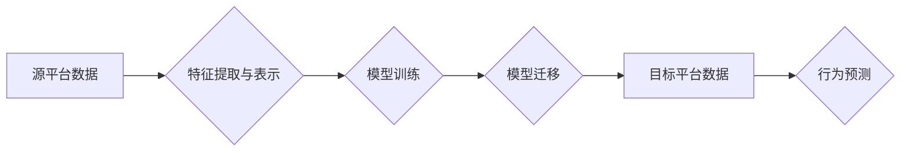

                 

## 1. 背景介绍

电子商务行业在全球范围内蓬勃发展，用户行为预测已成为其核心竞争力之一。传统的用户行为预测模型通常依赖于单个平台的数据，但随着用户在多个平台（如网站、移动应用、社交媒体等）之间频繁切换，单平台数据难以全面反映用户的真实行为模式。

迁移学习作为一种机器学习范式，旨在利用已训练好的模型在源域（拥有大量数据的平台）的知识迁移到目标域（数据较少的平台），从而提高目标域模型的性能。在大模型时代，迁移学习的应用场景更加广泛，其强大的泛化能力和参数共享机制为跨平台用户行为预测提供了新的思路和方法。

## 2. 核心概念与联系

### 2.1 迁移学习

迁移学习是一种机器学习范式，旨在利用已训练好的模型在源域（拥有大量数据的平台）的知识迁移到目标域（数据较少的平台），从而提高目标域模型的性能。

**核心概念：**

* **源域:** 拥有大量 labeled 数据的平台。
* **目标域:** 数据较少的平台，需要预测用户行为。
* **知识迁移:** 将源域模型的知识（如特征表示、参数初始化等）迁移到目标域模型。

**迁移学习的优势:**

* **数据效率:** 减少目标域数据需求，提高模型训练效率。
* **泛化能力:** 利用源域知识，提高模型在目标域的泛化能力。
* **可解释性:** 通过分析源域模型的知识迁移过程，提高模型的可解释性。

**迁移学习的类型:**

* **实例迁移学习:** 直接迁移源域的实例到目标域。
* **特征迁移学习:** 迁移源域学习到的特征表示到目标域。
* **参数迁移学习:** 迁移源域模型的参数到目标域。

### 2.2 大模型

大模型是指参数量巨大、训练数据量庞大的深度学习模型。

**大模型的特点:**

* **参数量大:** 通常包含数十亿甚至千亿个参数。
* **训练数据量大:** 需要海量数据进行训练。
* **强大的泛化能力:** 可以应用于多种下游任务。

**大模型的优势:**

* **更高的准确率:** 由于参数量大，可以学习更复杂的特征表示。
* **更好的泛化能力:** 由于训练数据量大，可以更好地泛化到未知数据。
* **可微调性:** 可以对大模型进行微调，使其适应特定任务。

**大模型的应用:**

* **自然语言处理:** 文本生成、机器翻译、问答系统等。
* **计算机视觉:** 图像识别、目标检测、图像生成等。
* **语音识别:** 语音转文本、语音合成等。

### 2.3 跨平台用户行为预测

跨平台用户行为预测是指利用多个平台的用户行为数据，预测用户在目标平台的行为。

**跨平台用户行为预测的挑战:**

* **数据异构性:** 不同平台的用户行为数据格式、特征维度等存在差异。
* **数据隐私:** 用户数据跨平台共享存在隐私安全问题。
* **数据关联性:** 不同平台的用户行为数据难以关联。

**跨平台用户行为预测的应用:**

* **个性化推荐:** 根据用户在多个平台的行为，推荐个性化的商品或服务。
* **用户画像:** 建立用户全面的画像，了解用户的兴趣、偏好和行为模式。
* **营销策略:** 根据用户行为预测，制定更有效的营销策略。

**Mermaid 流程图:**



## 3. 核心算法原理 & 具体操作步骤

### 3.1 算法原理概述

迁移学习的核心算法原理是利用源域模型的知识迁移到目标域，从而提高目标域模型的性能。常见的迁移学习算法包括：

* **特征迁移学习:** 将源域模型学习到的特征表示迁移到目标域。
* **参数迁移学习:** 将源域模型的参数迁移到目标域。
* **领域自适应:** 通过调整模型参数，使模型适应目标域的数据分布。

### 3.2 算法步骤详解

**特征迁移学习:**

1. 在源域训练一个深度学习模型，并提取其特征表示。
2. 将源域特征表示作为目标域模型的输入特征。
3. 在目标域训练一个新的模型，并利用源域特征表示进行微调。

**参数迁移学习:**

1. 在源域训练一个深度学习模型，并保存其模型参数。
2. 在目标域初始化一个新的模型，并将其参数设置为源域模型的参数。
3. 在目标域训练新的模型，并利用源域模型的参数进行微调。

**领域自适应:**

1. 在源域和目标域分别训练两个模型。
2. 利用源域模型的知识，调整目标域模型的参数，使其适应目标域的数据分布。

### 3.3 算法优缺点

**特征迁移学习:**

* **优点:** 数据效率高，可以利用源域模型学习到的特征表示，减少目标域数据需求。
* **缺点:** 需要设计合适的特征提取方法，才能有效地迁移源域知识。

**参数迁移学习:**

* **优点:** 可以直接利用源域模型的参数，快速初始化目标域模型。
* **缺点:** 如果源域和目标域的数据分布差异较大，则参数迁移效果可能不佳。

**领域自适应:**

* **优点:** 可以有效地适应目标域的数据分布，提高模型的泛化能力。
* **缺点:** 需要更多的训练数据和计算资源。

### 3.4 算法应用领域

迁移学习在多个领域都有广泛的应用，例如：

* **自然语言处理:** 文本分类、情感分析、机器翻译等。
* **计算机视觉:** 图像识别、目标检测、图像分割等。
* **语音识别:** 语音转文本、语音合成等。
* **医疗诊断:** 病例分类、疾病预测等。

## 4. 数学模型和公式 & 详细讲解 & 举例说明

### 4.1 数学模型构建

假设我们有源域数据 $D_s = {(x_i, y_i)}^N_{i=1}$ 和目标域数据 $D_t = {(x_j, y_j)}^M_{j=1}$，其中 $x_i$ 和 $x_j$ 分别表示源域和目标域的输入特征，$y_i$ 和 $y_j$ 分别表示源域和目标域的输出标签。

迁移学习的目标是利用源域知识 $D_s$ 提高目标域模型 $f_t$ 的性能，即最小化目标域的损失函数 $L_t(f_t, D_t)$。

### 4.2 公式推导过程

常用的迁移学习损失函数包括：

* **源域损失函数:** $L_s(f_s, D_s)$，用于训练源域模型 $f_s$。
* **目标域损失函数:** $L_t(f_t, D_t)$，用于评估目标域模型 $f_t$ 的性能。
* **迁移损失函数:** $L_{tr}(f_s, f_t)$，用于衡量源域模型 $f_s$ 和目标域模型 $f_t$ 之间的差异。

常见的迁移损失函数包括：

* **KL散度:** $L_{tr} = KL(P_s || P_t)$，其中 $P_s$ 和 $P_t$ 分别表示源域和目标域的特征分布。
* **最大均值差异 (MMD):** $L_{tr} = ||\mu_s - \mu_t||^2$，其中 $\mu_s$ 和 $\mu_t$ 分别表示源域和目标域的特征均值。

总的损失函数可以定义为：

$$L = L_s + \lambda L_t + \gamma L_{tr}$$

其中 $\lambda$ 和 $\gamma$ 是超参数，用于平衡不同损失函数的权重。

### 4.3 案例分析与讲解

假设我们想要预测用户在电商平台上的购买行为。我们可以利用用户在社交媒体平台上的行为数据作为源域数据，并利用用户在电商平台上的行为数据作为目标域数据。

我们可以训练一个源域模型，并提取其特征表示。然后，我们可以将源域特征表示作为目标域模型的输入特征，并利用源域模型的知识进行微调。

通过迁移学习，我们可以利用社交媒体平台上的用户行为数据，提高电商平台用户购买行为预测的准确率。

## 5. 项目实践：代码实例和详细解释说明

### 5.1 开发环境搭建

* **操作系统:** Ubuntu 20.04
* **Python 版本:** 3.8
* **深度学习框架:** PyTorch 1.8
* **其他依赖库:** numpy, pandas, matplotlib

### 5.2 源代码详细实现

```python
import torch
import torch.nn as nn
import torch.optim as optim

# 定义源域模型
class SourceModel(nn.Module):
    def __init__(self):
        super(SourceModel, self).__init__()
        # ... 模型结构定义 ...

    def forward(self, x):
        # ... 模型前向传播过程 ...

# 定义目标域模型
class TargetModel(nn.Module):
    def __init__(self):
        super(TargetModel, self).__init__()
        # ... 模型结构定义 ...

    def forward(self, x):
        # ... 模型前向传播过程 ...

# 训练源域模型
source_model = SourceModel()
source_optimizer = optim.Adam(source_model.parameters(), lr=0.001)
source_loss_fn = nn.CrossEntropyLoss()

# 训练目标域模型
target_model = TargetModel()
target_optimizer = optim.Adam(target_model.parameters(), lr=0.001)
target_loss_fn = nn.CrossEntropyLoss()

# 迁移学习
for epoch in range(num_epochs):
    # 训练源域模型
    for batch in source_dataloader:
        source_optimizer.zero_grad()
        source_outputs = source_model(batch['input'])
        source_loss = source_loss_fn(source_outputs, batch['label'])
        source_loss.backward()
        source_optimizer.step()

    # 训练目标域模型
    for batch in target_dataloader:
        target_optimizer.zero_grad()
        target_outputs = target_model(batch['input'])
        target_loss = target_loss_fn(target_outputs, batch['label'])
        target_loss.backward()
        target_optimizer.step()

# 保存模型
torch.save(source_model.state_dict(), 'source_model.pth')
torch.save(target_model.state_dict(), 'target_model.pth')
```

### 5.3 代码解读与分析

* **模型定义:** 代码中定义了源域模型和目标域模型，并指定了模型结构和前向传播过程。
* **数据加载:** 代码中使用 DataLoader 加载源域数据和目标域数据。
* **模型训练:** 代码中使用 Adam 优化器和交叉熵损失函数训练源域模型和目标域模型。
* **迁移学习:** 代码中利用源域模型的知识进行目标域模型的微调。
* **模型保存:** 代码中保存了训练好的源域模型和目标域模型。

### 5.4 运行结果展示

运行代码后，可以观察到目标域模型的性能随着训练epochs的增加而提高。

## 6. 实际应用场景

### 6.1 个性化推荐

电商平台可以利用用户在多个平台（如网站、移动应用、社交媒体）的行为数据，构建跨平台用户行为预测模型，并根据预测结果提供个性化的商品推荐。

### 6.2 用户画像

电商平台可以利用跨平台用户行为预测模型，建立用户全面的画像，了解用户的兴趣、偏好和行为模式，从而提供更精准的营销服务。

### 6.3 营销策略

电商平台可以利用跨平台用户行为预测模型，预测用户对不同营销策略的响应，制定更有效的营销策略。

### 6.4 未来应用展望

随着大模型和迁移学习技术的不断发展，跨平台用户行为预测将在电商行业得到更广泛的应用，例如：

* **跨平台用户行为分析:** 利用大模型分析用户在多个平台的行为模式，发现用户行为的潜在规律。
* **跨平台用户关系挖掘:** 利用迁移学习挖掘用户之间的关系，构建用户社交网络。
* **跨平台用户体验优化:** 利用跨平台用户行为预测模型，优化用户在多个平台的体验。

## 7. 工具和资源推荐

### 7.1 学习资源推荐

* **书籍:**
    * 《深度学习》 by Ian Goodfellow, Yoshua Bengio, Aaron Courville
    * 《迁移学习》 by Sinno Jernite
* **在线课程:**
    * Coursera: 深度学习 Specialization
    * Udacity: 迁移学习 Nanodegree

### 7.2 开发工具推荐

* **深度学习框架:** PyTorch, TensorFlow
* **数据处理库:** Pandas, NumPy
* **可视化工具:** Matplotlib, Seaborn

### 7.3 相关论文推荐

* **迁移学习:**
    * Pan, S. J., & Yang, Q. (2010). A survey on transfer learning. IEEE Transactions on Knowledge and Data Engineering, 22(10), 1345-1359.
    * Yosinski, J., Clune, J., Bengio, Y., & Lipson, H. (2014). How transferable are features in deep neural networks?. In Advances in neural information processing systems (pp. 3320-3328).
* **大模型:**
    * Devlin, J., Chang, M. W., Lee, K., & Toutanova, K. (2018). Bert: Pre-training of deep bidirectional transformers for language understanding. arXiv preprint arXiv:1810.04805.
    * Radford, A., Wu, J., Child, R., Luan, D., Amodei, D., & Sutskever, I. (2019). Language models are few-shot learners. arXiv preprint arXiv:1905.00537.

## 8. 总结：未来发展趋势与挑战

### 8.1 研究成果总结

迁移学习在跨平台用户行为预测领域取得了显著的成果，能够有效利用源域知识提高目标域模型的性能。大模型的出现为迁移学习提供了更强大的工具，使得迁移学习在更复杂的任务中得到应用。

### 8.2 未来发展趋势

* **更有效的迁移学习算法:** 研究更有效的迁移学习算法，例如基于对抗训练的迁移学习算法、基于知识蒸馏的迁移学习算法等。
* **跨平台数据融合:** 研究更有效的跨平台数据融合方法，例如联邦学习、隐私保护数据共享等。
* **个性化迁移学习:** 研究个性化迁移学习方法，根据用户的不同特征和需求，定制化的迁移学习模型。

### 8.3 面临的挑战

* **数据异构性:** 不同平台的用户行为数据格式、特征维度等存在差异，需要开发更有效的跨平台数据融合方法。
* **数据隐私:** 用户数据跨平台共享存在隐私安全问题，需要开发更有效的隐私保护技术。
* **模型解释性:** 迁移学习模型的决策过程较为复杂，需要提高模型的解释性，方便用户理解模型的预测结果。

### 8.4 研究展望

未来，迁移学习将在跨平台用户行为预测领域发挥更重要的作用，为电商行业提供更精准、更个性化的服务。


## 9. 附录：常见问题与解答

### 9.1 Q1: 迁移学习的优势是什么？

**A1:** 迁移学习的优势在于能够利用源域知识，提高目标域模型的性能，尤其是在目标域数据有限的情况下。

### 9.2 Q2: 迁移学习有哪些常见的算法？

**A2:** 常见的迁移学习算法包括特征迁移学习、参数迁移学习和领域自适应。

### 9.3 Q3: 迁移学习有哪些应用场景？

**A3:** 迁移学习在多个领域都有广泛的应用，例如自然语言处理、计算机视觉、语音识别、医疗诊断等。

### 9.4 Q4: 如何评估迁移学习模型的性能？

**A4:** 迁移学习模型的性能通常通过在目标域上的测试集准确率、召回率、F1-score等指标进行评估。

### 9.5 Q5: 迁移学习有哪些挑战？

**A5:** 迁移学习面临的挑战包括数据异构性、数据隐私和模型解释性等。


作者：禅与计算机程序设计艺术 / Zen and the Art of Computer Programming<end_of_turn>

