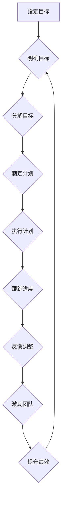

                 

## 目标管理与团队激励的关系

> 关键词：目标管理、团队激励、绩效提升、沟通协作、文化建设、可视化目标、反馈机制、员工参与

## 1. 背景介绍

在当今快速变化的科技环境中，团队的绩效和效率至关重要。为了实现组织目标，高效地管理团队并激发员工的积极性是企业面临的重大挑战。目标管理和团队激励是解决这一挑战的关键要素，两者相互关联，共同推动团队进步。

目标管理是指设定明确、可衡量的目标，并制定相应的计划和措施，以确保团队朝着既定的方向前进。而团队激励则是指通过各种激励机制，激发员工的内在动力，提高工作热情和效率。

## 2. 核心概念与联系

目标管理和团队激励之间存在着密切的联系，两者共同构成了一个高效的团队管理体系。

**2.1  目标管理与团队激励的关系**

目标管理为团队激励提供了方向和动力。明确的目标可以帮助员工理解自己的工作职责和价值，并为他们提供奋斗的目标。当员工对团队目标有清晰的认识和认同时，他们更容易被激励，并愿意为团队的成功贡献力量。

团队激励则为目标管理提供了动力和保障。通过有效的激励机制，可以增强员工的积极性和主动性，帮助他们克服困难，并最终实现目标。

**2.2  目标管理与团队激励的流程图**



## 3. 核心算法原理 & 具体操作步骤

### 3.1  算法原理概述

目标管理和团队激励的有效实施需要遵循一定的算法原理，这些原理可以帮助企业制定合理的策略，并提高激励效果。

**3.1.1  SMART目标设定原则**

SMART目标设定原则是指目标应该具有以下特点：

* **Specific (具体):** 目标应该明确具体，避免模糊不清。
* **Measurable (可衡量):** 目标应该能够量化，以便于跟踪和评估。
* **Achievable (可实现):** 目标应该具有可实现性，避免设定过高或过低的期望。
* **Relevant (相关):** 目标应该与团队的整体目标和战略相一致。
* **Time-bound (有时间限制):** 目标应该设定一个明确的时间期限，以便于督促执行。

**3.1.2  激励机制设计原则**

激励机制的设计应该考虑以下原则：

* **差异化激励:** 不同的员工有不同的需求和动机，激励机制应该根据员工的特点进行差异化设计。
* **公平公正:** 激励机制应该公平公正，避免出现偏袒或不公平现象。
* **及时反馈:** 激励机制应该及时反馈员工的成果和表现，帮助他们了解自己的进步和不足。
* **持续改进:** 激励机制应该不断进行评估和改进，以适应团队的发展变化。

### 3.2  算法步骤详解

**3.2.1  目标设定阶段**

* 组织领导层制定团队的整体目标。
* 根据团队目标，分解成具体的子目标，并分配给各个成员。
* 确保每个目标都符合SMART原则。

**3.2.2  计划制定阶段**

* 针对每个子目标，制定详细的计划和措施。
* 明确每个成员的职责和任务。
* 制定进度跟踪和评估机制。

**3.2.3  执行阶段**

* 团队成员按照计划执行任务。
* 定期跟踪进度，及时发现问题并进行调整。
* 领导层提供必要的支持和指导。

**3.2.4  评估阶段**

* 定期评估团队目标的完成情况。
* 分析团队成员的表现，并进行反馈和改进。
* 根据评估结果，调整目标和计划。

**3.2.5  激励阶段**

* 根据团队目标的完成情况和成员的表现，进行相应的激励。
* 激励机制可以包括物质奖励、精神奖励、晋升机会等。
* 激励机制应该及时、公平、公正。

### 3.3  算法优缺点

**3.3.1  优点**

* 明确目标，提高团队凝聚力。
* 增强员工的责任感和主动性。
* 提高团队效率和绩效。
* 促进团队成员的成长和发展。

**3.3.2  缺点**

* 目标设定过于严格，可能导致员工压力过大。
* 激励机制设计不当，可能导致公平问题。
* 缺乏灵活性和适应性，难以应对突发情况。

### 3.4  算法应用领域

目标管理和团队激励的算法原理可以应用于各种团队管理场景，例如：

* 软件开发团队
* 市场营销团队
* 销售团队
* 研究开发团队
* 项目管理团队

## 4. 数学模型和公式 & 详细讲解 & 举例说明

### 4.1  数学模型构建

目标管理和团队激励可以抽象为一个数学模型，其中目标的完成程度和团队成员的激励程度是两个关键变量。

**4.1.1  目标完成度模型**

$$
GoalCompletionRate = \frac{ActualGoalCompletion}{PlannedGoalCompletion}
$$

其中：

* **GoalCompletionRate:** 目标完成度
* **ActualGoalCompletion:** 实际完成的目标
* **PlannedGoalCompletion:** 计划完成的目标

**4.1.2  激励程度模型**

$$
MotivationLevel = f(Reward, Recognition, GrowthOpportunity)
$$

其中：

* **MotivationLevel:** 激励程度
* **Reward:** 物质奖励
* **Recognition:** 精神奖励
* **GrowthOpportunity:** 成长机会

### 4.2  公式推导过程

目标完成度和激励程度之间存在着正相关关系。当目标完成度越高时，团队成员的激励程度也越高。

**4.2.1  正相关关系推导**

$$
MotivationLevel \propto GoalCompletionRate
$$

### 4.3  案例分析与讲解

假设一个软件开发团队的目标是开发一个新的应用程序。团队成员的激励程度取决于以下因素：

* **物质奖励:** 团队成员可以获得开发完成应用程序后的奖金。
* **精神奖励:** 团队成员可以获得开发完成应用程序后的表彰和认可。
* **成长机会:** 团队成员可以获得参与开发新应用程序的机会，并学习新的技术。

如果团队能够高效地完成应用程序开发，那么团队成员的激励程度就会提高。

## 5. 项目实践：代码实例和详细解释说明

### 5.1  开发环境搭建

为了实现目标管理和团队激励的自动化，可以搭建一个专门的开发环境。

* **项目管理工具:** 使用如Jira、Trello等项目管理工具来设定目标、分配任务、跟踪进度。
* **沟通协作工具:** 使用如Slack、Microsoft Teams等沟通协作工具来促进团队成员之间的沟通和协作。
* **数据分析工具:** 使用如Google Analytics、Tableau等数据分析工具来收集和分析团队绩效数据。

### 5.2  源代码详细实现

以下是一个简单的代码示例，演示如何使用Python语言实现目标管理和团队激励的自动化功能。

```python
# 目标管理模块
class Goal:
    def __init__(self, name, description, target, deadline):
        self.name = name
        self.description = description
        self.target = target
        self.deadline = deadline
        self.status = "未完成"

    def update_status(self, status):
        self.status = status

# 激励机制模块
class Incentive:
    def __init__(self, type, reward):
        self.type = type
        self.reward = reward

    def apply_incentive(self, member):
        print(f"为成员{member}应用激励：{self.reward}")

# 示例代码
goal = Goal("开发新应用程序", "开发一个新的移动应用程序", "完成应用程序原型", "2024年3月31日")
incentive = Incentive("物质奖励", "1000美元奖金")

# 模拟目标完成情况
goal.update_status("已完成")

# 应用激励机制
incentive.apply_incentive("张三")
```

### 5.3  代码解读与分析

* **目标管理模块:** 定义了`Goal`类，用于表示一个目标，包括目标名称、描述、目标值、截止日期和状态。
* **激励机制模块:** 定义了`Incentive`类，用于表示一个激励机制，包括激励类型和奖励。
* **示例代码:** 创建了一个目标实例，并模拟目标完成情况。然后，应用激励机制，为完成目标的成员提供奖励。

### 5.4  运行结果展示

运行上述代码，将输出以下结果：

```
为成员张三应用激励：1000美元奖金
```

## 6. 实际应用场景

目标管理和团队激励的应用场景非常广泛，以下是一些具体的例子：

### 6.1  软件开发团队

* **目标设定:** 开发团队可以设定目标，例如开发一个新的应用程序、修复一个已知的bug、提高代码质量等。
* **激励机制:** 开发团队可以采用各种激励机制，例如奖金、晋升机会、技术培训等。

### 6.2  市场营销团队

* **目标设定:** 市场营销团队可以设定目标，例如提高品牌知名度、增加销售额、提升客户满意度等。
* **激励机制:** 市场营销团队可以采用各种激励机制，例如销售额奖金、客户满意度奖励、营销活动表彰等。

### 6.3  销售团队

* **目标设定:** 销售团队可以设定目标，例如达成销售额目标、拓展新客户、提高客户转化率等。
* **激励机制:** 销售团队可以采用各种激励机制，例如销售额奖金、业绩排名奖励、客户忠诚度奖励等。

### 6.4  未来应用展望

随着科技的发展，目标管理和团队激励的应用场景将会更加广泛。例如，人工智能技术可以帮助企业更精准地设定目标和设计激励机制，虚拟现实技术可以帮助企业创造更加沉浸式的团队协作环境。

## 7. 工具和资源推荐

### 7.1  学习资源推荐

* **书籍:**
    * 《目标管理》 - Peter Drucker
    * 《激励团队》 - Patrick Lencioni
    * 《高效能团队》 - Patrick Lencioni
* **在线课程:**
    * Coursera: "Goal Setting and Achievement"
    * Udemy: "Team Motivation and Leadership"

### 7.2  开发工具推荐

* **项目管理工具:** Jira, Trello, Asana
* **沟通协作工具:** Slack, Microsoft Teams, Google Chat
* **数据分析工具:** Google Analytics, Tableau, Power BI

### 7.3  相关论文推荐

* "The Impact of Goal Setting on Employee Performance" - Locke & Latham
* "Motivation and Performance: A Review of the Literature" - Deci & Ryan
* "Teamwork and Performance: A Review of the Literature" - Katzenbach & Smith

## 8. 总结：未来发展趋势与挑战

### 8.1  研究成果总结

目标管理和团队激励的研究成果表明，明确的目标和有效的激励机制可以显著提高团队的绩效和效率。

### 8.2  未来发展趋势

未来，目标管理和团队激励的研究将更加注重以下方面：

* **个性化目标设定:** 根据员工的个性特点和职业发展目标，设定更加个性化的目标。
* **数据驱动的激励机制:** 利用数据分析技术，设计更加精准和有效的激励机制。
* **人工智能辅助管理:** 利用人工智能技术，辅助企业进行目标管理和团队激励。

### 8.3  面临的挑战

目标管理和团队激励的实施也面临着一些挑战：

* **目标设定难度:** 如何设定既有挑战性又可实现的目标是一个难题。
* **激励机制设计复杂:** 如何设计一种公平、公正、有效的激励机制是一个复杂的问题。
* **文化差异:** 不同文化背景的团队成员对目标和激励的理解可能存在差异。

### 8.4  研究展望

未来，需要进一步研究目标管理和团队激励的最佳实践，并探索新的技术和方法，以更好地帮助企业提升团队绩效和效率。

## 9. 附录：常见问题与解答

### 9.1  问题：如何设定SMART目标？

**解答：**

* **具体 (Specific):** 目标应该明确具体，避免模糊不清。例如，不要设定“提高销售额”，而应该设定“在今年年底前，将销售额提高20%”。
* **可衡量 (Measurable):** 目标应该能够量化，以便于跟踪和评估。例如，可以使用销售额、客户数量、项目完成率等指标来衡量目标的完成情况。
* **可实现 (Achievable):** 目标应该具有可实现性，避免设定过高或过低的期望。
* **相关 (Relevant):** 目标应该与团队的整体目标和战略相一致。
* **有时间限制 (Time-bound):** 目标应该设定一个明确的时间期限，以便于督促执行。例如，可以设定“在2024年3月31日之前完成目标”。

### 9.2  问题：如何设计有效的激励机制？

**解答：**

* **差异化激励:** 不同的员工有不同的需求和动机，激励机制应该根据员工的特点进行差异化设计。例如，一些员工可能更看重物质奖励，而另一些员工可能更看重精神奖励。
* **公平公正:** 激励机制应该公平公正，避免出现偏袒或不公平现象。
* **及时反馈:** 激励机制应该及时反馈员工的成果和表现，帮助他们了解自己的进步和不足。
* **持续改进:** 激励机制应该不断进行评估和改进，以适应团队的发展变化。


作者：禅与计算机程序设计艺术 / Zen and the Art of Computer Programming<end_of_turn>

