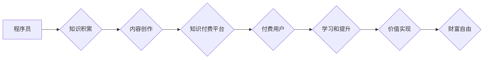

                 

## 关键词：知识付费、程序员、财富自由、在线教育、技能提升、技术博客、内容创作、社区建设

## 1. 背景介绍

在当今科技飞速发展的时代，程序员作为数字时代的核心力量，备受瞩目。然而，程序员的职业发展道路并非一帆风顺，竞争激烈，薪资增长也面临着瓶颈。面对这些挑战，越来越多的程序员开始寻求新的途径来实现财富自由，而知识付费逐渐成为一种备受关注的解决方案。

知识付费是指通过线上平台或线下活动，将知识、技能、经验等转化为商品，并向付费用户提供学习和获取价值的服务。近年来，随着互联网技术的普及和移动互联网的兴起，知识付费市场蓬勃发展，涵盖了各个领域，其中程序员领域的知识付费更是呈现出强劲的增长势头。

## 2. 核心概念与联系

### 2.1 知识付费的本质

知识付费的核心在于价值交换。程序员通过将自身积累的知识、技能和经验转化为有价值的内容，并通过线上平台或线下活动向付费用户提供学习和获取价值的服务，从而实现知识的流通和价值的实现。

### 2.2 程序员知识付费的优势

* **高收益潜力:** 程序员拥有专业的技术技能和经验，其知识和技能具有很高的市场价值，可以通过知识付费获得丰厚的收益。
* **灵活自由:** 程序员可以根据自己的时间安排和兴趣爱好，自主创作和分享知识，不受传统工作模式的限制。
* **提升个人品牌:** 通过知识付费，程序员可以建立自己的个人品牌，提升行业影响力，获得更多合作机会。
* **促进技术交流:** 知识付费平台可以成为程序员交流学习的平台，促进技术分享和共同进步。

### 2.3 程序员知识付费的模式

* **在线课程:** 通过视频、文档、代码等形式，教授程序员相关的技术知识和技能。
* **技术博客:** 通过撰写技术文章、分享经验和案例，吸引程序员读者，并通过广告、赞助等方式获得收益。
* **开源项目:** 开发开源软件，并通过提供付费支持服务，例如技术咨询、定制开发等，获得收益。
* **线下培训:** 举办线下技术培训课程，教授程序员相关的技术知识和技能。

**Mermaid 流程图**



## 3. 核心算法原理 & 具体操作步骤

### 3.1 算法原理概述

知识付费的核心算法原理在于内容推荐和用户匹配。通过分析用户的学习兴趣、技术水平和学习目标，推荐与用户需求相匹配的知识付费内容，从而提高用户学习体验和付费意愿。

### 3.2 算法步骤详解

1. **用户画像构建:** 收集用户的学习行为数据，例如学习记录、浏览历史、评论反馈等，构建用户的学习画像，包括用户的技术领域、学习目标、学习偏好等。
2. **内容分类和标签化:** 对知识付费内容进行分类和标签化，例如编程语言、框架、工具、算法等，以便于用户搜索和筛选。
3. **推荐算法:** 基于用户的学习画像和内容的分类标签，使用推荐算法，例如协同过滤、内容过滤、深度学习等，推荐与用户需求相匹配的知识付费内容。
4. **个性化推荐:** 根据用户的学习反馈和行为数据，不断优化推荐算法，提供更加个性化的学习推荐。

### 3.3 算法优缺点

**优点:**

* **提高用户匹配度:** 通过算法推荐，可以将用户与最合适的知识付费内容进行匹配，提高用户学习体验和付费意愿。
* **个性化学习:** 算法可以根据用户的学习行为和偏好，提供个性化的学习推荐，满足用户的个性化需求。
* **内容发现:** 算法可以帮助用户发现新的知识付费内容，拓宽学习视野。

**缺点:**

* **数据依赖:** 算法推荐需要大量用户数据作为支撑，如果数据不足或质量不高，算法效果会受到影响。
* **算法偏差:** 算法本身可能存在偏差，导致推荐结果不准确或不公平。
* **用户体验:** 过度依赖算法推荐，可能会导致用户缺乏自主选择权，影响用户学习体验。

### 3.4 算法应用领域

* **在线教育平台:** 推荐课程、学习资源和学习路径。
* **技术博客平台:** 推荐相关技术文章、案例和社区讨论。
* **开源项目平台:** 推荐与用户项目相关的开源代码、文档和社区支持。

## 4. 数学模型和公式 & 详细讲解 & 举例说明

### 4.1 数学模型构建

知识付费平台可以构建一个用户-内容-评分的评分模型，用于预测用户对特定内容的评分。

**用户-内容-评分模型:**

```latex
score(u, c) = w_1 * feature_u(u) * feature_c(c) + w_2 * interaction(u, c) + bias
```

其中:

* $score(u, c)$: 用户 $u$ 对内容 $c$ 的评分。
* $feature_u(u)$: 用户 $u$ 的特征向量。
* $feature_c(c)$: 内容 $c$ 的特征向量。
* $interaction(u, c)$: 用户 $u$ 与内容 $c$ 的交互信息，例如浏览次数、学习时间等。
* $w_1$, $w_2$: 权重参数。
* $bias$: 内容或用户固有偏置。

### 4.2 公式推导过程

该模型基于协同过滤和内容过滤的思想，将用户特征、内容特征和用户-内容交互信息作为输入，通过线性组合和权重调整，预测用户对内容的评分。

### 4.3 案例分析与讲解

假设有一个用户 $u$ 和一个内容 $c$，用户 $u$ 的特征向量为 $[age, education, interest]$, 内容 $c$ 的特征向量为 $[topic, difficulty, length] $. 

用户 $u$ 与内容 $c$ 的交互信息为浏览次数为 $5$ 次。

通过训练模型，得到权重参数 $w_1 = 0.6$, $w_2 = 0.4$，以及内容和用户固有偏置。

最终，模型可以预测用户 $u$ 对内容 $c$ 的评分。

## 5. 项目实践：代码实例和详细解释说明

### 5.1 开发环境搭建

* **操作系统:** Linux/macOS/Windows
* **编程语言:** Python
* **框架:** Flask/Django
* **数据库:** MySQL/PostgreSQL
* **工具:** Git、Docker

### 5.2 源代码详细实现

```python
# Flask 框架示例

from flask import Flask, render_template, request

app = Flask(__name__)

# 模拟用户数据
users = {
    1: {'name': 'Alice', 'age': 25, 'interest': ['Python', 'Machine Learning']},
    2: {'name': 'Bob', 'age': 30, 'interest': ['Java', 'Web Development']}
}

# 模拟内容数据
contents = {
    1: {'title': 'Python入门教程', 'topic': 'Python', 'difficulty': '初级'},
    2: {'title': '机器学习算法', 'topic': 'Machine Learning', 'difficulty': '中级'}
}

@app.route('/')
def index():
    return render_template('index.html')

@app.route('/recommend', methods=['POST'])
def recommend():
    user_id = request.form.get('user_id')
    # 根据用户ID获取用户数据
    user = users.get(user_id)
    # 根据用户兴趣推荐内容
    recommendations = []
    for content_id, content in contents.items():
        if any(interest in content['topic'] for interest in user['interest']):
            recommendations.append(content)
    return render_template('recommend.html', recommendations=recommendations)

if __name__ == '__main__':
    app.run(debug=True)
```

### 5.3 代码解读与分析

* **Flask 框架:** 使用 Flask 框架构建了一个简单的知识付费平台。
* **用户数据和内容数据:** 模拟了用户和内容的数据结构。
* **推荐算法:** 基于用户兴趣推荐内容，简单地判断用户兴趣是否与内容主题相关。
* **前端模板:** 使用 HTML 模板渲染页面。

### 5.4 运行结果展示

运行代码后，访问 `http://127.0.0.1:5000/`，可以访问平台首页。

点击 `推荐` 按钮，输入用户ID，可以获取基于用户兴趣的推荐内容列表。

## 6. 实际应用场景

### 6.1 在线教育平台

* **课程推荐:** 根据用户的学习目标、技术水平和学习偏好，推荐合适的课程。
* **学习路径规划:** 根据用户的学习目标，规划个性化的学习路径，帮助用户高效学习。
* **知识社区:** 建立知识社区，方便用户交流学习，分享经验。

### 6.2 技术博客平台

* **文章推荐:** 根据用户的阅读历史、点赞记录和评论内容，推荐相关的技术文章。
* **技术话题追踪:** 帮助用户追踪感兴趣的技术话题，及时获取最新资讯。
* **技术社区建设:** 建立技术社区，方便用户交流学习，分享经验。

### 6.3 开源项目平台

* **项目推荐:** 根据用户的技术兴趣和项目需求，推荐相关的开源项目。
* **技术文档推荐:** 推荐与开源项目相关的技术文档和教程。
* **社区支持:** 提供社区支持，帮助用户解决开源项目相关问题。

### 6.4 未来应用展望

随着人工智能技术的不断发展，知识付费平台将更加智能化、个性化和高效化。

* **更精准的推荐:** 利用深度学习等算法，实现更精准的用户画像和内容推荐。
* **个性化的学习体验:** 提供个性化的学习内容、学习节奏和学习方式。
* **沉浸式学习体验:** 利用虚拟现实、增强现实等技术，打造沉浸式的学习体验。

## 7. 工具和资源推荐

### 7.1 学习资源推荐

* **在线课程平台:** Coursera, Udemy, edX
* **技术博客平台:** Medium, Dev.to, Hacker News
* **开源项目平台:** GitHub, GitLab, Bitbucket

### 7.2 开发工具推荐

* **编程语言:** Python, JavaScript, Java
* **框架:** Flask, Django, React, Angular
* **数据库:** MySQL, PostgreSQL, MongoDB

### 7.3 相关论文推荐

* **推荐系统:** "Collaborative Filtering for Implicit Feedback Datasets"
* **深度学习:** "Deep Learning"
* **知识图谱:** "Knowledge Graph Embedding: A Survey"

## 8. 总结：未来发展趋势与挑战

### 8.1 研究成果总结

知识付费为程序员实现财富自由提供了新的途径，通过内容创作和知识分享，程序员可以获得丰厚的收益，提升个人品牌，促进技术交流。

### 8.2 未来发展趋势

* **智能化推荐:** 利用人工智能技术，实现更精准的用户画像和内容推荐。
* **个性化学习体验:** 提供个性化的学习内容、学习节奏和学习方式。
* **沉浸式学习体验:** 利用虚拟现实、增强现实等技术，打造沉浸式的学习体验。

### 8.3 面临的挑战

* **内容质量:** 确保知识付费内容的质量和价值，避免低质量内容泛滥。
* **用户信任:** 建立用户对知识付费平台的信任，保证用户数据安全和隐私保护。
* **商业模式创新:** 探索新的商业模式，实现知识付费平台的可持续发展。

### 8.4 研究展望

未来，知识付费平台将更加智能化、个性化和高效化，为程序员提供更优质的学习和成长平台。


## 9. 附录：常见问题与解答

**Q1: 如何成为一名成功的知识付费创作者？**

**A1:** 

* **确定你的目标受众:** 了解你的目标受众的学习需求和兴趣爱好。
* **打造优质内容:** 提供有价值、实用、原创的内容。
* **建立个人品牌:** 通过博客、社交媒体等平台，建立自己的个人品牌。
* **推广你的内容:** 利用各种渠道推广你的知识付费内容。

**Q2: 如何选择合适的知识付费平台？**

**A2:** 

* **平台用户群体:** 选择与你的目标受众相匹配的平台。
* **平台收费模式:** 了解平台的收费模式和分成比例。
* **平台功能和服务:** 选择功能完善、服务优质的平台。

**Q3: 如何保证知识付费内容的质量？**

**A3:** 

* **深入研究:** 对所讲内容进行深入研究，确保内容的准确性和可靠性。
* **实践经验:** 将理论知识与实践经验结合，提供更实用的学习内容。
* **用户反馈:** 收集用户反馈，不断改进和完善内容。


作者：禅与计算机程序设计艺术 / Zen and the Art of Computer Programming 
<end_of_turn>

