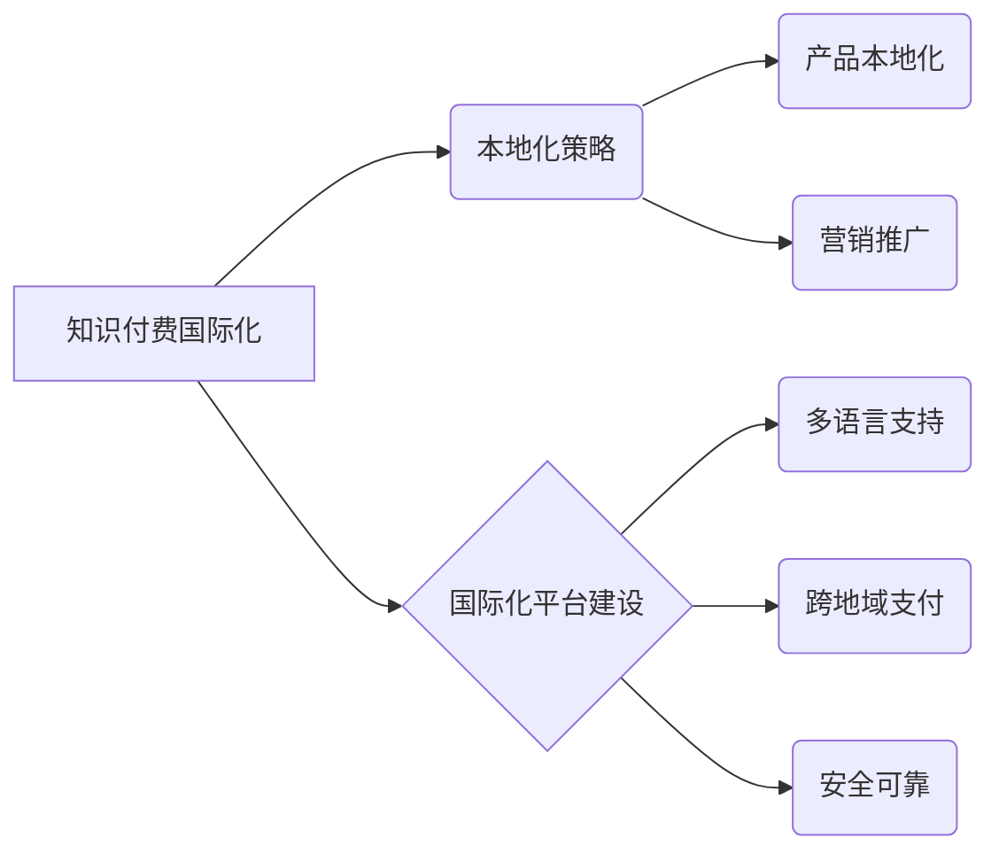

                 

## 知识付费产品的国际化策略

> 关键词：知识付费、国际化、市场策略、文化差异、本地化、营销推广、平台建设

## 1. 背景介绍

知识付费行业近年来发展迅速，从国内到国际，越来越多的创作者和学习者参与其中。知识付费产品以其便捷性、个性化和高性价比的特点，逐渐成为人们获取知识和技能的重要途径。然而，随着市场竞争的加剧，国内知识付费平台面临着新的挑战，即如何拓展海外市场，实现国际化发展。

国际化对于知识付费平台来说，意味着要将产品和服务推广到全球范围，并适应不同国家和地区的文化、语言、法律法规等差异。这不仅需要平台具备强大的技术实力和运营能力，更需要深入了解目标市场的需求和特点，制定切实可行的国际化策略。

## 2. 核心概念与联系

**2.1 知识付费国际化**

知识付费国际化是指将知识付费产品和服务推广到海外市场，并根据目标市场的文化、语言、法律法规等差异进行本地化运营。

**2.2 本地化策略**

本地化策略是指根据目标市场的文化、语言、法律法规等差异，对知识付费产品和服务进行调整和优化，使其更符合当地用户的需求和习惯。

**2.3 国际化平台建设**

国际化平台建设是指为支持知识付费产品的国际化运营，构建一个具备多语言支持、跨地域支付、安全可靠等功能的国际化平台。

**2.4 核心概念关系图**



## 3. 核心算法原理 & 具体操作步骤

**3.1 算法原理概述**

知识付费产品的国际化涉及到多个算法和技术，例如机器翻译、内容推荐、用户画像分析等。这些算法的原理和应用可以帮助平台更好地理解用户需求，提供个性化服务，并进行有效的营销推广。

**3.2 算法步骤详解**

* **机器翻译:** 利用机器学习算法将知识付费内容翻译成目标语言，确保内容的可读性和理解性。
* **内容推荐:** 基于用户行为数据和内容标签，推荐与用户兴趣相关的知识付费产品，提高用户粘性和转化率。
* **用户画像分析:** 分析用户 demographics、兴趣爱好、学习习惯等数据，构建用户画像，为个性化推荐和营销提供依据。

**3.3 算法优缺点**

* **机器翻译:** 优点是速度快、成本低，缺点是翻译质量可能不如人工翻译准确。
* **内容推荐:** 优点是能够提高用户体验和转化率，缺点是需要大量的用户数据和算法训练。
* **用户画像分析:** 优点是能够精准定位目标用户，缺点是需要收集和分析大量用户数据，并保证数据隐私安全。

**3.4 算法应用领域**

* **内容本地化:** 将知识付费内容翻译成目标语言，并根据当地文化习惯进行调整。
* **营销推广:** 根据用户画像，精准投放广告和推荐产品，提高营销效果。
* **用户服务:** 提供多语言客服支持，解决用户遇到的问题。

## 4. 数学模型和公式 & 详细讲解 & 举例说明

**4.1 数学模型构建**

知识付费产品的国际化可以构建一个数学模型来分析和预测市场趋势，例如：

* **用户增长模型:**  预测目标市场用户增长率，并分析影响因素。
* **收入预测模型:**  预测目标市场知识付费收入，并分析影响因素。

**4.2 公式推导过程**

例如，用户增长模型可以采用以下公式：

```latex
N(t) = N_0 * e^{rt}
```

其中：

* $N(t)$ 是时间 $t$ 时刻的用户数量
* $N_0$ 是初始用户数量
* $r$ 是用户增长率
* $t$ 是时间

**4.3 案例分析与讲解**

假设一个知识付费平台计划进入日本市场，初始用户数量为 1000 人，用户增长率为 10% per month。

使用上述公式，可以预测 3 个月后的用户数量：

```latex
N(3) = 1000 * e^{0.1 * 3} ≈ 1344 人
```

## 5. 项目实践：代码实例和详细解释说明

**5.1 开发环境搭建**

* 操作系统：Linux/macOS/Windows
* 编程语言：Python
* 开发工具：VS Code/PyCharm
* 框架：Django/Flask

**5.2 源代码详细实现**

以下是一个简单的 Python 代码示例，用于实现知识付费产品的国际化功能：

```python
import locale

# 设置语言环境
locale.setlocale(locale.LC_ALL, 'zh_CN.UTF-8')  # 中文

# 获取用户语言偏好
user_language = request.cookies.get('language')

# 根据用户语言偏好选择翻译内容
if user_language == 'en':
    translated_content = translate_to_english(original_content)
else:
    translated_content = original_content

# 返回翻译后的内容
return render_template('index.html', content=translated_content)
```

**5.3 代码解读与分析**

* 代码首先设置了语言环境，并根据用户浏览器语言偏好选择翻译内容。
* `translate_to_english()` 函数用于将内容翻译成英文。
* `render_template()` 函数将翻译后的内容渲染到 HTML 页面中。

**5.4 运行结果展示**

当用户访问网站时，根据其语言偏好，会自动显示相应的语言版本的内容。

## 6. 实际应用场景

**6.1 在线课程平台**

在线课程平台可以将课程内容翻译成多种语言，并根据不同国家的文化背景进行调整，以吸引全球用户。

**6.2 在线咨询平台**

在线咨询平台可以提供多语言客服支持，帮助用户解决问题，并根据用户语言偏好推荐合适的咨询专家。

**6.3 数字出版平台**

数字出版平台可以将书籍和电子杂志翻译成多种语言，并根据不同国家的阅读习惯进行格式调整，以满足全球用户的需求。

**6.4 未来应用展望**

随着人工智能技术的不断发展，知识付费产品的国际化将更加便捷和智能化。例如，未来可能出现自动翻译、个性化推荐、跨语言互动等功能，进一步降低知识付费产品的国际化门槛。

## 7. 工具和资源推荐

**7.1 学习资源推荐**

* **Coursera:** 提供各种在线课程，包括国际化营销和跨文化沟通等。
* **edX:** 提供来自世界知名大学的在线课程，包括国际商务和全球化战略等。
* **Udacity:** 提供技术类在线课程，包括机器翻译和自然语言处理等。

**7.2 开发工具推荐**

* **Google Translate API:** 提供机器翻译服务，支持多种语言。
* **Amazon Translate:** 提供机器翻译服务，支持多种语言。
* **DeepL:** 提供高精度机器翻译服务，支持多种语言。

**7.3 相关论文推荐**

* **The Globalization of Knowledge Sharing: A Literature Review**
* **Internationalization Strategies for Online Education Platforms**
* **The Impact of Cultural Differences on Knowledge Transfer**

## 8. 总结：未来发展趋势与挑战

**8.1 研究成果总结**

知识付费产品的国际化是一个充满机遇和挑战的领域。通过构建合适的数学模型、应用先进的算法技术、制定有效的本地化策略，知识付费平台可以成功拓展海外市场，实现全球化发展。

**8.2 未来发展趋势**

* **人工智能驱动的国际化:** 人工智能技术将进一步推动知识付费产品的国际化，例如自动翻译、个性化推荐、跨语言互动等功能将更加智能化和便捷化。
* **沉浸式学习体验:** 虚拟现实和增强现实技术将为知识付费产品提供更加沉浸式的学习体验，打破语言和地域的限制。
* **全球化知识社区:** 知识付费平台将构建更加活跃的全球化知识社区，促进跨文化交流和知识共享。

**8.3 面临的挑战**

* **文化差异:** 不同国家的文化背景、价值观和学习习惯差异较大，需要平台进行深入的文化研究和本地化调整。
* **语言障碍:** 不同国家的语言差异较大，需要平台提供高质量的翻译服务，并考虑语言的多样性。
* **法律法规:** 不同国家的法律法规对知识产权、数据隐私等方面有不同的规定，平台需要遵守当地法律法规，并做好风险控制。

**8.4 研究展望**

未来，研究者可以继续探索知识付费产品的国际化策略，例如：

* 研究不同文化背景下用户学习行为的差异，并开发相应的个性化学习方案。
* 研究跨语言沟通的最佳实践，并开发更加有效的跨语言互动工具。
* 研究知识付费产品的国际化运营模式，并探索新的商业模式。


## 9. 附录：常见问题与解答

**9.1 如何进行知识付费产品的本地化？**

知识付费产品的本地化需要考虑以下几个方面：

* **语言翻译:** 将知识付费内容翻译成目标语言，并根据当地文化习惯进行调整。
* **文化适应:** 了解目标市场的文化背景、价值观和学习习惯，并根据这些差异调整知识付费内容和服务。
* **法律法规:** 遵守目标国家的法律法规，例如知识产权、数据隐私等方面。

**9.2 如何推广知识付费产品到海外市场？**

推广知识付费产品到海外市场可以采用以下几种方式：

* **社交媒体营销:** 利用社交媒体平台，例如 Facebook、Twitter、Instagram 等，进行产品推广。
* **搜索引擎优化:** 优化产品网站和内容，使其在目标国家的搜索引擎中排名靠前。
* **内容合作:** 与目标国家的媒体、博主、KOL 等合作，进行产品推广。
* **线下活动:** 参加目标国家的教育展、科技展等线下活动，进行产品推广。

**9.3 如何选择合适的国际化平台建设方案？**

选择合适的国际化平台建设方案需要考虑以下几个因素：

* **目标市场:** 不同的目标市场有不同的需求和特点，需要选择相应的平台建设方案。
* **技术能力:** 平台需要具备相应的技术能力，才能构建一个稳定可靠的国际化平台。
* **成本预算:** 平台需要根据自身的成本预算，选择合适的平台建设方案。


作者：禅与计算机程序设计艺术 / Zen and the Art of Computer Programming 
<end_of_turn>

