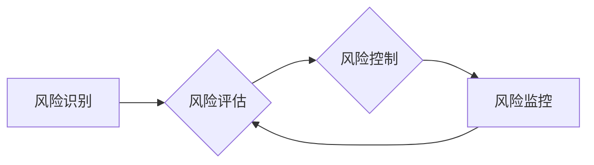

                 

## 知识付费创业中的风险管理

> 关键词：知识付费、风险管理、创业、在线教育、内容创作、商业模式、用户运营、法律合规

## 1. 背景介绍

知识付费行业近年来发展迅速，成为互联网经济的新热点。随着互联网技术的普及和人们对知识的需求不断增长，越来越多的创作者和企业涌入这个领域，提供各种类型的知识产品和服务。然而，知识付费创业也面临着诸多风险，例如内容质量问题、用户流失、商业模式不稳定、法律合规等。

知识付费创业的风险主要体现在以下几个方面：

* **内容质量风险:** 知识付费的核心是内容，内容质量直接影响用户体验和付费意愿。如果内容质量低劣、缺乏原创性或实用性，将难以吸引用户并获得持续的收益。
* **用户运营风险:** 知识付费平台需要不断吸引和留住用户，才能形成稳定的收入来源。用户运营需要考虑用户需求、内容推荐、社区建设等多个方面，如果运营不当，容易导致用户流失和平台衰退。
* **商业模式风险:** 知识付费的商业模式多种多样，例如订阅制、课程销售、会员体系等。不同的商业模式有不同的优缺点，需要根据自身情况选择合适的模式，并不断优化和调整。
* **法律合规风险:** 知识付费涉及版权、隐私、数据安全等法律问题，需要企业严格遵守相关法律法规，避免法律纠纷。

## 2. 核心概念与联系

知识付费创业的风险管理是一个系统工程，需要从多个方面入手，建立完善的风险控制体系。

**2.1 核心概念**

* **风险识别:** 首先要识别出可能存在的风险，包括内容质量风险、用户运营风险、商业模式风险、法律合规风险等。
* **风险评估:** 对识别出的风险进行评估，分析其发生的可能性和潜在的影响，确定风险的优先级。
* **风险控制:** 根据风险评估结果，制定相应的风险控制措施，例如加强内容审核、优化用户运营策略、完善商业模式、加强法律合规管理等。
* **风险监控:**  持续监控风险的发生和发展，及时发现和处理潜在的风险。

**2.2 架构图**



## 3. 核心算法原理 & 具体操作步骤

知识付费创业的风险管理中，算法可以帮助我们进行数据分析、用户画像、内容推荐等，提高风险控制的效率和准确性。

**3.1 算法原理概述**

常见的算法包括：

* **推荐算法:** 基于用户的历史行为、兴趣偏好等数据，推荐相关的内容，提高用户粘性和付费意愿。
* **用户画像算法:**  通过分析用户的行为数据、社交信息等，构建用户的画像，了解用户的需求和特征，为内容创作和用户运营提供参考。
* **内容质量评估算法:**  利用自然语言处理、机器学习等技术，对内容的质量进行评估，识别低质量内容，避免用户体验下降。

**3.2 算法步骤详解**

* **数据收集:** 收集用户行为数据、内容数据、市场数据等，为算法训练和应用提供数据支撑。
* **数据预处理:** 对收集到的数据进行清洗、转换、格式化等处理，确保数据质量和算法的运行效率。
* **模型训练:** 选择合适的算法模型，利用训练数据对模型进行训练，使其能够准确地完成预设的任务。
* **模型评估:**  评估模型的性能，例如推荐准确率、用户画像的准确性等，并根据评估结果进行模型优化。
* **模型部署:** 将训练好的模型部署到线上环境，用于实际应用。

**3.3 算法优缺点**

* **优点:** 算法可以自动化处理大量数据，提高效率和准确性，为风险管理提供数据支持。
* **缺点:** 算法的准确性依赖于训练数据的质量，如果训练数据不足或存在偏差，算法的性能将受到影响。

**3.4 算法应用领域**

* **内容推荐:**  推荐用户感兴趣的内容，提高用户粘性和付费意愿。
* **用户画像:**  构建用户的画像，了解用户的需求和特征，为内容创作和用户运营提供参考。
* **内容质量评估:**  识别低质量内容，避免用户体验下降。
* **风险预警:**  通过分析用户行为数据、市场数据等，预警潜在的风险，例如用户流失、内容抄袭等。

## 4. 数学模型和公式 & 详细讲解 & 举例说明

在知识付费创业的风险管理中，数学模型可以帮助我们量化风险，评估风险的严重程度，制定更科学的风险控制策略。

**4.1 数学模型构建**

例如，我们可以构建一个用户流失风险模型，将用户流失率作为模型输出，并根据用户行为数据、内容质量等因素构建模型输入。

**4.2 公式推导过程**

用户流失率可以定义为：

$$
\text{流失率} = \frac{\text{流失用户数}}{\text{总用户数}}
$$

我们可以利用回归分析、逻辑回归等方法，建立用户流失率与输入因素之间的关系模型。

**4.3 案例分析与讲解**

假设我们收集了用户行为数据，包括用户活跃度、内容消费时长、付费次数等，以及内容质量数据，例如内容评分、评论数量等。我们可以利用这些数据，构建一个用户流失率预测模型，并根据模型预测结果，制定针对性的风险控制措施，例如提高内容质量、优化用户运营策略等。

## 5. 项目实践：代码实例和详细解释说明

以下是一个简单的用户流失率预测模型的代码实例，使用Python语言实现：

**5.1 开发环境搭建**

需要安装Python语言环境，以及数据科学相关的库，例如pandas、scikit-learn等。

**5.2 源代码详细实现**

```python
import pandas as pd
from sklearn.linear_model import LogisticRegression

# 加载数据
data = pd.read_csv('user_data.csv')

# 特征工程
# ...

# 训练模型
model = LogisticRegression()
model.fit(data[['特征1', '特征2', ...]], data['流失'])

# 预测流失率
predictions = model.predict_proba(new_data[['特征1', '特征2', ...]])[:, 1]

# ...
```

**5.3 代码解读与分析**

* 数据加载：使用pandas库加载用户数据。
* 特征工程：对原始数据进行处理，提取特征变量，例如用户活跃度、内容消费时长等。
* 模型训练：使用LogisticRegression模型训练用户流失率预测模型。
* 模型预测：使用训练好的模型预测新用户的流失率。

**5.4 运行结果展示**

模型预测结果可以用于评估用户的流失风险，并制定相应的风险控制措施。

## 6. 实际应用场景

知识付费创业的风险管理可以应用于多个场景，例如：

* **内容创作:**  根据用户画像和内容质量评估结果，优化内容创作方向和策略，提高内容的吸引力和价值。
* **用户运营:**  根据用户行为数据和流失风险预测结果，制定个性化的用户运营策略，提高用户粘性和付费意愿。
* **商业模式:**  根据市场数据和风险评估结果，选择合适的商业模式，并不断优化和调整，提高商业模式的稳定性和盈利能力。
* **法律合规:**  根据法律法规和风险评估结果，加强法律合规管理，避免法律纠纷。

**6.4 未来应用展望**

随着人工智能技术的不断发展，知识付费创业的风险管理将更加智能化、自动化。例如，我们可以利用深度学习算法，构建更精准的用户画像和内容质量评估模型，并利用机器学习算法，自动识别和处理潜在的风险。

## 7. 工具和资源推荐

**7.1 学习资源推荐**

* **书籍:** 《风险管理基础》、《数据科学实战》、《机器学习》
* **在线课程:** Coursera、edX、Udemy等平台提供相关课程。

**7.2 开发工具推荐**

* **Python:**  数据分析、机器学习、算法开发的常用语言。
* **pandas:**  数据处理和分析库。
* **scikit-learn:**  机器学习库。
* **TensorFlow、PyTorch:**  深度学习框架。

**7.3 相关论文推荐**

* **用户流失预测:**  "A Survey on User Churn Prediction"
* **内容质量评估:**  "Content Quality Assessment: A Survey"

## 8. 总结：未来发展趋势与挑战

**8.1 研究成果总结**

知识付费创业的风险管理是一个不断发展和完善的领域，已经取得了一定的成果。例如，算法模型的不断改进，使得风险识别和评估更加精准，风险控制措施更加有效。

**8.2 未来发展趋势**

未来，知识付费创业的风险管理将更加智能化、自动化，并更加注重用户体验和数据隐私保护。

**8.3 面临的挑战**

* **数据质量:**  算法的准确性依赖于训练数据的质量，如何获取高质量的数据仍然是一个挑战。
* **算法解释性:**  一些深度学习算法的决策过程难以解释，这可能会导致风险控制的透明度不足。
* **数据隐私保护:**  知识付费创业涉及大量用户数据，如何保护用户隐私是一个重要的挑战。

**8.4 研究展望**

未来，需要进一步研究更精准的风险预测模型，提高算法的解释性，并加强数据隐私保护机制，为知识付费创业提供更安全、可靠的风险管理解决方案。

## 9. 附录：常见问题与解答

**9.1 如何识别知识付费创业中的风险？**

可以通过分析市场环境、竞争对手、自身运营情况等多个方面，识别潜在的风险。例如，市场竞争激烈、用户需求变化快、内容质量难以保证等都是需要关注的风险因素。

**9.2 如何评估知识付费创业中的风险？**

可以通过风险矩阵、风险评估模型等工具，评估风险的发生概率和潜在影响，确定风险的优先级。

**9.3 如何控制知识付费创业中的风险？**

可以通过制定风险控制措施，例如加强内容审核、优化用户运营策略、完善商业模式、加强法律合规管理等，降低风险发生的可能性和影响。


作者：禅与计算机程序设计艺术 / Zen and the Art of Computer Programming 
<end_of_turn>

