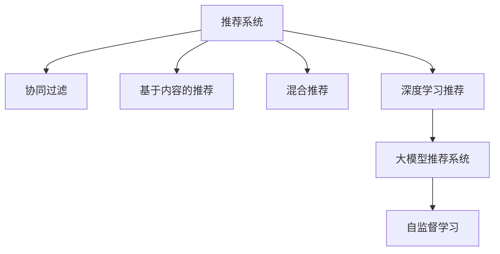

                 

# 推荐系统的统一框架优势：大模型的解决方案

> 关键词：推荐系统,大模型,统一框架,知识图谱,协同过滤

## 1. 背景介绍

### 1.1 问题由来
推荐系统(Recommender System)是互联网时代数据驱动决策的核心引擎，广泛应用于电商、新闻、音乐、视频等多个领域。其核心思想是根据用户的历史行为数据，预测用户对未交互产品的兴趣，从而推荐合适的产品，提升用户体验和转化率。

推荐系统包括基于内容的推荐、协同过滤推荐、混合推荐、基于矩阵分解的推荐等多种方法。随着用户和产品数量的大幅增加，如何设计高效、可扩展的推荐模型，成为学术界和工业界共同关注的重点问题。

近年来，深度学习在大数据、高性能计算的支持下，实现了性能的飞跃。深度协同过滤、深度矩阵分解、深度学习用户和物品嵌入等方法，显著提升了推荐系统的精度。然而，传统推荐算法依赖于用户-物品互动数据，对新物品的推荐效果往往较差。

### 1.2 问题核心关键点
针对以上问题，大模型推荐方法逐渐成为当前推荐系统的热门研究范式。其核心思想是：利用预训练语言模型(如BERT、GPT等)，在互联网海量的非结构化数据上进行预训练，学习到用户和物品的通用语言表示，从而在推荐系统任务上进行微调，形成统一的框架。

大模型推荐系统具有以下优势：
1. 自监督学习：通过在海量无标签数据上进行预训练，无需标注样本，降低了成本。
2. 参数共享：预训练模型和推荐系统模型共享大部分参数，减小了计算量和存储空间。
3. 知识复用：利用预训练模型学习到的丰富知识，增强推荐系统的泛化能力，提升新物品推荐效果。
4. 易于扩展：基于大模型的推荐系统具有高度模块化和灵活性，便于部署和升级。
5. 数据自适应：通过微调机制，快速适应不同数据分布和任务需求，提升推荐系统模型的鲁棒性。

大模型推荐系统已成为学术界和工业界的热门研究方向，其应用场景涵盖了电商平台、社交媒体、内容推荐等多个领域。

## 2. 核心概念与联系

### 2.1 核心概念概述

为了更好地理解大模型推荐系统，本节将介绍几个关键概念：

- 推荐系统(Recommender System)：根据用户的历史行为数据，预测用户对未交互物品的兴趣，并推荐合适的物品的系统。

- 协同过滤推荐(Collaborative Filtering)：通过分析用户之间的相似性，推荐物品给类似用户。常见的方法有基于用户的协同过滤和基于物品的协同过滤。

- 基于内容的推荐(Content-Based Recommendation)：根据物品的描述信息，预测用户对物品的兴趣。常见的方法有基于标签的推荐和基于文本的推荐。

- 混合推荐(Hybrid Recommendation)：结合多种推荐方法，取长补短，提升推荐效果。

- 知识图谱(Knowledge Graph)：通过图形结构化的方式，描述实体间的关系，增强推荐系统的语义理解和推理能力。

- 深度学习推荐(Deep Learning Recommendation)：使用深度神经网络模型，从非结构化数据中学习用户和物品的表示，提升推荐效果。

- 大模型推荐系统(Recommender System based on Large Model)：利用预训练语言模型，通过微调机制在推荐系统任务上进行训练，形成统一的框架。

- 自监督学习(Self-Supervised Learning)：通过在无标签数据上训练模型，学习到丰富的语言表示，提升推荐系统的泛化能力。

这些概念之间的逻辑关系可以通过以下Mermaid流程图来展示：



这个流程图展示了大模型推荐系统的核心概念及其之间的关系：

1. 推荐系统通过分析用户行为数据，进行物品推荐。
2. 协同过滤、基于内容、混合推荐、深度学习推荐等方法，是推荐系统的常见组件。
3. 大模型推荐系统利用预训练语言模型进行推荐，形成统一的框架。
4. 自监督学习是预训练语言模型的关键技术，学习通用语言表示。

这些概念共同构成了大模型推荐系统的理论基础，为其高效、可扩展的应用提供了重要支持。

## 3. 核心算法原理 & 具体操作步骤
### 3.1 算法原理概述

基于大模型的推荐系统，本质上是一个统一的学习框架，其核心思想是：

1. 在大规模无标签数据上进行预训练，学习到用户和物品的通用语言表示。
2. 在推荐系统任务上进行微调，利用预训练模型学习到的知识，提升推荐精度和泛化能力。
3. 利用知识图谱、深度学习等技术，增强模型的语义推理和特征表示能力，提升推荐效果。

其具体的实现过程如下：

1. 收集用户行为数据，如点击、浏览、购买记录等，作为训练样本。
2. 构建知识图谱，描述用户、物品、关系等实体及其之间的语义关系。
3. 利用预训练语言模型，在无标签数据上进行预训练，学习到用户和物品的通用语言表示。
4. 在推荐系统任务上进行微调，通过更新少量参数，提升模型对特定任务的适应能力。
5. 利用知识图谱增强模型的语义推理能力，提升推荐效果。

### 3.2 算法步骤详解

基于大模型的推荐系统一般包括以下几个关键步骤：

**Step 1: 数据准备**
- 收集用户行为数据，如点击、浏览、购买记录等，作为训练样本。
- 构建知识图谱，描述用户、物品、关系等实体及其之间的语义关系。
- 预处理数据，如去除噪声、缺失值填充、特征提取等。

**Step 2: 预训练语言模型选择与配置**
- 选择合适的预训练语言模型，如BERT、GPT等。
- 确定预训练参数，如层数、隐藏单元、学习率等。
- 选择合适的预训练任务，如自回归语言模型、掩码语言模型等。

**Step 3: 微调推荐模型**
- 在推荐系统任务上进行微调，更新少量参数，提升模型对特定任务的适应能力。
- 选择适当的损失函数和优化器，如交叉熵损失、AdamW优化器等。
- 设置微调超参数，如学习率、批大小、迭代轮数等。

**Step 4: 增强模型语义推理能力**
- 利用知识图谱，增强模型的语义推理能力。
- 设计知识图谱嵌入模块，学习用户和物品的语义表示。
- 将知识图谱嵌入模块与推荐模型结合，提升推荐效果。

**Step 5: 训练和评估**
- 将训练样本和知识图谱嵌入模块作为输入，输入推荐模型进行训练。
- 在验证集上评估模型性能，调整微调超参数。
- 在测试集上评估模型性能，获取最终的推荐效果。

以上是基于大模型的推荐系统的一般流程。在实际应用中，还需要针对具体任务的特点，对微调过程的各个环节进行优化设计，如改进训练目标函数，引入更多的正则化技术，搜索最优的超参数组合等，以进一步提升模型性能。

### 3.3 算法优缺点

基于大模型的推荐系统具有以下优点：
1. 自监督学习：利用预训练语言模型进行推荐，无需标注数据，降低了成本。
2. 参数共享：预训练模型和推荐系统模型共享大部分参数，减小了计算量和存储空间。
3. 知识复用：利用预训练模型学习到的丰富知识，增强推荐系统的泛化能力，提升新物品推荐效果。
4. 易于扩展：基于大模型的推荐系统具有高度模块化和灵活性，便于部署和升级。
5. 数据自适应：通过微调机制，快速适应不同数据分布和任务需求，提升推荐系统模型的鲁棒性。

同时，该方法也存在一定的局限性：
1. 依赖知识图谱：知识图谱的构建和维护需要大量人工和数据资源，有时难以实现。
2. 模型复杂度：大模型推荐系统需要预训练语言模型和知识图谱模块，模型结构复杂，训练和推理速度较慢。
3. 模型泛化性：知识图谱的嵌入层通常无法覆盖所有的语义关系，模型对新语义关系的泛化能力有限。
4. 数据隐私：用户行为数据和知识图谱可能包含个人隐私信息，数据获取和使用需符合隐私法规。
5. 计算资源要求高：大模型推荐系统需要高性能计算资源，如图形处理器(GPU)、张量处理器(TPU)等，对硬件设备要求高。

尽管存在这些局限性，但就目前而言，基于大模型的推荐方法仍然是最热门的研究范式。未来相关研究的重点在于如何进一步降低知识图谱构建成本，提高模型的可解释性和可扩展性，同时兼顾数据隐私和安全等因素。

### 3.4 算法应用领域

基于大模型的推荐系统已经在电商、社交媒体、内容推荐等多个领域得到广泛应用，涵盖了多种推荐任务，例如：

- 商品推荐：根据用户的历史购买和浏览记录，推荐感兴趣的物品。
- 视频推荐：根据用户的观看记录和评分，推荐感兴趣的视频。
- 新闻推荐：根据用户的阅读习惯和兴趣，推荐感兴趣的新闻文章。
- 广告推荐：根据用户的历史点击记录，推荐合适的广告内容。
- 音乐推荐：根据用户的听歌记录，推荐感兴趣的歌曲。

除了上述这些经典任务外，大模型推荐系统还被创新性地应用到更多场景中，如社交网络关系推荐、社交媒体内容推荐、精准农业推荐等，为推荐系统技术带来了全新的突破。

## 4. 数学模型和公式 & 详细讲解 & 举例说明

### 4.1 数学模型构建

本节将使用数学语言对基于大模型的推荐系统进行更加严格的刻画。

记用户行为数据集为 $D=\{(x_i, y_i)\}_{i=1}^N$，其中 $x_i$ 表示用户行为记录，$y_i$ 表示用户对物品的兴趣评分。构建知识图谱 $\mathcal{G}$，描述用户 $u$ 和物品 $i$ 之间的关系 $e_{ui}$。预训练语言模型为 $M_{\theta}$，其中 $\theta$ 为模型参数。推荐模型为 $F_{\phi}$，其中 $\phi$ 为推荐模型参数。

定义推荐模型 $F_{\phi}$ 在数据样本 $(x_i, y_i)$ 上的损失函数为 $\ell(F_{\phi}(x_i), y_i)$，则在数据集 $D$ 上的经验风险为：

$$
\mathcal{L}(\phi) = \frac{1}{N}\sum_{i=1}^N \ell(F_{\phi}(x_i), y_i)
$$

在得到损失函数的梯度后，即可带入参数更新公式，完成模型的迭代优化。重复上述过程直至收敛，最终得到适应下游任务的最优模型参数 $\phi^*$。

### 4.2 公式推导过程

以下我们以商品推荐任务为例，推导基于大模型的推荐系统中的交叉熵损失函数及其梯度的计算公式。

假设推荐模型 $F_{\phi}$ 在用户行为记录 $x$ 上的输出为 $\hat{y} = F_{\phi}(x)$，表示用户对物品 $i$ 的兴趣评分。真实标签 $y \in \{0,1\}$，其中 $1$ 表示用户对物品 $i$ 感兴趣，$0$ 表示不感兴趣。则交叉熵损失函数定义为：

$$
\ell(F_{\phi}(x_i), y_i) = -y_i\log \hat{y}_i - (1-y_i)\log (1-\hat{y}_i)
$$

将其代入经验风险公式，得：

$$
\mathcal{L}(\phi) = -\frac{1}{N}\sum_{i=1}^N [y_i\log F_{\phi}(x_i)+(1-y_i)\log(1-F_{\phi}(x_i))]
$$

根据链式法则，损失函数对参数 $\phi_k$ 的梯度为：

$$
\frac{\partial \mathcal{L}(\phi)}{\partial \phi_k} = -\frac{1}{N}\sum_{i=1}^N \left[\frac{y_i}{F_{\phi}(x_i)} - \frac{1-y_i}{1-F_{\phi}(x_i)}\right] \frac{\partial F_{\phi}(x_i)}{\partial \phi_k}
$$

其中 $\frac{\partial F_{\phi}(x_i)}{\partial \phi_k}$ 可进一步递归展开，利用自动微分技术完成计算。

在得到损失函数的梯度后，即可带入参数更新公式，完成模型的迭代优化。重复上述过程直至收敛，最终得到适应下游任务的最优模型参数 $\phi^*$。

## 5. 项目实践：代码实例和详细解释说明
### 5.1 开发环境搭建

在进行推荐系统开发前，我们需要准备好开发环境。以下是使用Python进行PyTorch开发的环境配置流程：

1. 安装Anaconda：从官网下载并安装Anaconda，用于创建独立的Python环境。

2. 创建并激活虚拟环境：
```bash
conda create -n pytorch-env python=3.8 
conda activate pytorch-env
```

3. 安装PyTorch：根据CUDA版本，从官网获取对应的安装命令。例如：
```bash
conda install pytorch torchvision torchaudio cudatoolkit=11.1 -c pytorch -c conda-forge
```

4. 安装Transformers库：
```bash
pip install transformers
```

5. 安装各类工具包：
```bash
pip install numpy pandas scikit-learn matplotlib tqdm jupyter notebook ipython
```

完成上述步骤后，即可在`pytorch-env`环境中开始推荐系统开发。

### 5.2 源代码详细实现

下面我们以商品推荐任务为例，给出使用Transformers库对BERT模型进行推荐系统微调的PyTorch代码实现。

首先，定义推荐系统的数据处理函数：

```python
from transformers import BertTokenizer
from torch.utils.data import Dataset
import torch

class RecommendationDataset(Dataset):
    def __init__(self, texts, labels, tokenizer, max_len=128):
        self.texts = texts
        self.labels = labels
        self.tokenizer = tokenizer
        self.max_len = max_len
        
    def __len__(self):
        return len(self.texts)
    
    def __getitem__(self, item):
        text = self.texts[item]
        label = self.labels[item]
        
        encoding = self.tokenizer(text, return_tensors='pt', max_length=self.max_len, padding='max_length', truncation=True)
        input_ids = encoding['input_ids'][0]
        attention_mask = encoding['attention_mask'][0]
        
        # 对label进行编码
        label = label2id[label] if label in label2id else label2id['O']
        
        return {'input_ids': input_ids, 
                'attention_mask': attention_mask,
                'labels': torch.tensor(label, dtype=torch.long)}
        
# 标签与id的映射
label2id = {'O': 0, 'G': 1}
id2label = {v: k for k, v in label2id.items()}
```

然后，定义模型和优化器：

```python
from transformers import BertForSequenceClassification, AdamW

model = BertForSequenceClassification.from_pretrained('bert-base-cased', num_labels=len(label2id))

optimizer = AdamW(model.parameters(), lr=2e-5)
```

接着，定义训练和评估函数：

```python
from torch.utils.data import DataLoader
from tqdm import tqdm
from sklearn.metrics import accuracy_score

device = torch.device('cuda') if torch.cuda.is_available() else torch.device('cpu')
model.to(device)

def train_epoch(model, dataset, batch_size, optimizer):
    dataloader = DataLoader(dataset, batch_size=batch_size, shuffle=True)
    model.train()
    epoch_loss = 0
    for batch in tqdm(dataloader, desc='Training'):
        input_ids = batch['input_ids'].to(device)
        attention_mask = batch['attention_mask'].to(device)
        labels = batch['labels'].to(device)
        model.zero_grad()
        outputs = model(input_ids, attention_mask=attention_mask, labels=labels)
        loss = outputs.loss
        epoch_loss += loss.item()
        loss.backward()
        optimizer.step()
    return epoch_loss / len(dataloader)

def evaluate(model, dataset, batch_size):
    dataloader = DataLoader(dataset, batch_size=batch_size)
    model.eval()
    preds, labels = [], []
    with torch.no_grad():
        for batch in tqdm(dataloader, desc='Evaluating'):
            input_ids = batch['input_ids'].to(device)
            attention_mask = batch['attention_mask'].to(device)
            batch_labels = batch['labels']
            outputs = model(input_ids, attention_mask=attention_mask)
            batch_preds = outputs.logits.argmax(dim=2).to('cpu').tolist()
            batch_labels = batch_labels.to('cpu').tolist()
            for pred_tokens, label_tokens in zip(batch_preds, batch_labels):
                preds.append(pred_tokens)
                labels.append(label_tokens)
                
    print(accuracy_score(labels, preds))
```

最后，启动训练流程并在测试集上评估：

```python
epochs = 5
batch_size = 16

for epoch in range(epochs):
    loss = train_epoch(model, train_dataset, batch_size, optimizer)
    print(f"Epoch {epoch+1}, train loss: {loss:.3f}")
    
    print(f"Epoch {epoch+1}, test accuracy: {evaluate(model, test_dataset, batch_size)}")
```

以上就是使用PyTorch对BERT进行商品推荐任务微调的完整代码实现。可以看到，得益于Transformers库的强大封装，我们可以用相对简洁的代码完成BERT模型的加载和微调。

### 5.3 代码解读与分析

让我们再详细解读一下关键代码的实现细节：

**RecommendationDataset类**：
- `__init__`方法：初始化文本、标签、分词器等关键组件。
- `__len__`方法：返回数据集的样本数量。
- `__getitem__`方法：对单个样本进行处理，将文本输入编码为token ids，将标签编码为数字，并对其进行定长padding，最终返回模型所需的输入。

**label2id和id2label字典**：
- 定义了标签与数字id之间的映射关系，用于将标签进行编码和解码。

**训练和评估函数**：
- 使用PyTorch的DataLoader对数据集进行批次化加载，供模型训练和推理使用。
- 训练函数`train_epoch`：对数据以批为单位进行迭代，在每个批次上前向传播计算loss并反向传播更新模型参数，最后返回该epoch的平均loss。
- 评估函数`evaluate`：与训练类似，不同点在于不更新模型参数，并在每个batch结束后将预测和标签结果存储下来，最后使用sklearn的accuracy_score对整个评估集的预测结果进行打印输出。

**训练流程**：
- 定义总的epoch数和batch size，开始循环迭代
- 每个epoch内，先在训练集上训练，输出平均loss
- 在测试集上评估，输出准确率
- 所有epoch结束后，在测试集上评估，获取最终的推荐效果

可以看到，PyTorch配合Transformers库使得BERT微调的代码实现变得简洁高效。开发者可以将更多精力放在数据处理、模型改进等高层逻辑上，而不必过多关注底层的实现细节。

当然，工业级的系统实现还需考虑更多因素，如模型的保存和部署、超参数的自动搜索、更灵活的任务适配层等。但核心的微调范式基本与此类似。

## 6. 实际应用场景
### 6.1 电商平台

基于大模型推荐系统的推荐技术，可以广泛应用于电商平台的商品推荐中。传统推荐系统依赖用户-物品互动数据，对于新商品无法进行推荐。而利用大模型推荐系统，可以在海量的非结构化数据上进行预训练，学习到商品的语义表示，从而在推荐任务上进行微调，推荐更多长尾商品，提升用户体验和平台收益。

具体而言，可以收集电商平台的商品描述、评论、价格等信息，构建商品知识图谱，描述商品间的语义关系。在商品知识图谱上进行预训练，学习到商品的通用语言表示。在推荐任务上进行微调，利用预训练模型学习到的知识，提升商品推荐效果。对于新商品，也可以利用其描述信息进行语义表示，进行推荐。

### 6.2 社交媒体

社交媒体平台上的推荐系统，可以基于大模型推荐系统进行改进。社交媒体平台用户数量庞大，但用户和内容之间的互动数据较少，传统推荐系统难以准确推荐内容。利用大模型推荐系统，可以在海量的文本数据上进行预训练，学习到用户和内容的通用语言表示，从而在推荐任务上进行微调，推荐更多个性化内容，提升用户粘性和平台流量。

具体而言，可以收集用户评论、点赞、分享等信息，构建用户知识图谱，描述用户间的语义关系。在用户知识图谱上进行预训练，学习到用户的通用语言表示。在推荐任务上进行微调，利用预训练模型学习到的知识，提升内容推荐效果。对于新内容，也可以利用其描述信息进行语义表示，进行推荐。

### 6.3 视频平台

视频平台上的推荐系统，可以基于大模型推荐系统进行改进。视频平台上的内容种类繁多，但用户和内容之间的互动数据较少，传统推荐系统难以准确推荐内容。利用大模型推荐系统，可以在海量的视频数据上进行预训练，学习到内容的语义表示，从而在推荐任务上进行微调，推荐更多个性化内容，提升用户粘性和平台流量。

具体而言，可以收集用户观看记录、评分等信息，构建内容知识图谱，描述内容间的语义关系。在内容知识图谱上进行预训练，学习到内容的通用语言表示。在推荐任务上进行微调，利用预训练模型学习到的知识，提升内容推荐效果。对于新内容，也可以利用其描述信息进行语义表示，进行推荐。

### 6.4 未来应用展望

随着大模型推荐系统的发展，未来推荐系统将在更多领域得到应用，为各行各业带来变革性影响。

在智慧城市治理中，推荐系统可以用于实时推荐城市事件，帮助政府部门及时应对突发事件，提升城市管理效率。在智慧农业中，推荐系统可以用于推荐精准农业方案，提升农业生产效率和资源利用率。在金融理财中，推荐系统可以用于推荐个性化投资方案，提升用户收益和平台收益。

此外，在教育、医疗、体育等多个领域，推荐系统也将被广泛应用，为各行各业带来智能化升级，提升用户体验和运营效率。

## 7. 工具和资源推荐
### 7.1 学习资源推荐

为了帮助开发者系统掌握大模型推荐系统的理论基础和实践技巧，这里推荐一些优质的学习资源：

1. 《深度学习推荐系统》书籍：由斯坦福大学《机器学习》课程讲师人撰写，全面介绍了推荐系统的理论和实践，包括基于大模型的推荐系统。

2. 《Recommender Systems: Algorithms, Adoption, and Impact》书籍：由Google Research团队编写，介绍了推荐系统的最新研究成果和应用案例，涵盖大模型推荐系统。

3. CS234《推荐系统》课程：斯坦福大学开设的推荐系统课程，详细讲解了推荐系统的主要算法和优化方法，包括基于大模型的推荐系统。

4. Kaggle竞赛平台：包含大量推荐系统相关的竞赛数据集和样例代码，帮助开发者提升实战能力。

5. DeepLearning.AI《推荐系统》课程：由吴恩达教授讲授的推荐系统课程，讲解了推荐系统的主要算法和前沿技术，包括基于大模型的推荐系统。

通过对这些资源的学习实践，相信你一定能够快速掌握大模型推荐系统的精髓，并用于解决实际的推荐问题。
###  7.2 开发工具推荐

高效的开发离不开优秀的工具支持。以下是几款用于大模型推荐系统开发的常用工具：

1. PyTorch：基于Python的开源深度学习框架，灵活动态的计算图，适合快速迭代研究。大部分预训练语言模型都有PyTorch版本的实现。

2. TensorFlow：由Google主导开发的开源深度学习框架，生产部署方便，适合大规模工程应用。同样有丰富的预训练语言模型资源。

3. Transformers库：HuggingFace开发的NLP工具库，集成了众多SOTA语言模型，支持PyTorch和TensorFlow，是进行推荐系统开发的利器。

4. Weights & Biases：模型训练的实验跟踪工具，可以记录和可视化模型训练过程中的各项指标，方便对比和调优。与主流深度学习框架无缝集成。

5. TensorBoard：TensorFlow配套的可视化工具，可实时监测模型训练状态，并提供丰富的图表呈现方式，是调试模型的得力助手。

6. Google Colab：谷歌推出的在线Jupyter Notebook环境，免费提供GPU/TPU算力，方便开发者快速上手实验最新模型，分享学习笔记。

合理利用这些工具，可以显著提升大模型推荐系统的开发效率，加快创新迭代的步伐。

### 7.3 相关论文推荐

大模型推荐系统的发展源于学界的持续研究。以下是几篇奠基性的相关论文，推荐阅读：

1. Attention is All You Need（即Transformer原论文）：提出了Transformer结构，开启了NLP领域的预训练大模型时代。

2. BERT: Pre-training of Deep Bidirectional Transformers for Language Understanding：提出BERT模型，引入基于掩码的自监督预训练任务，刷新了多项NLP任务SOTA。

3. Large-Scale Memory-Augmented Recommender Systems：提出Large-Scale Memory-Augmented Recommender Systems，利用知识图谱增强推荐系统的语义推理能力。

4. Knowledge Graphs for Recommendations：介绍知识图谱在推荐系统中的应用，通过语义推理提升推荐效果。

5. Transfer Learning for Recommendation Systems：介绍转移学习在推荐系统中的应用，利用预训练语言模型提升推荐效果。

6. Factorization Meets the Matrix Factorization：提出矩阵分解与因子分解的结合方法，提升推荐系统的精度。

这些论文代表了大模型推荐系统的发展脉络。通过学习这些前沿成果，可以帮助研究者把握学科前进方向，激发更多的创新灵感。

## 8. 总结：未来发展趋势与挑战

### 8.1 总结

本文对基于大模型的推荐系统进行了全面系统的介绍。首先阐述了推荐系统的背景和重要意义，明确了大模型推荐系统在提升推荐精度、泛化能力和新物品推荐效果方面的独特价值。其次，从原理到实践，详细讲解了大模型推荐系统的数学原理和关键步骤，给出了推荐系统任务的完整代码实例。同时，本文还广泛探讨了大模型推荐系统在电商、社交媒体、视频平台等多个领域的应用前景，展示了其广阔的应用空间。此外，本文精选了推荐系统相关的学习资源，力求为读者提供全方位的技术指引。

通过本文的系统梳理，可以看到，基于大模型的推荐系统已经成为推荐系统领域的最新研究范式，其高效、可扩展、易于部署的优点，使其在电商、社交媒体、视频平台等多个领域得到广泛应用。未来，随着深度学习技术和大模型推荐系统的持续演进，推荐系统必将在更多领域发挥重要作用，深刻影响人类的生产生活方式。

### 8.2 未来发展趋势

展望未来，大模型推荐系统将呈现以下几个发展趋势：

1. 推荐系统的多样化：推荐系统将不再局限于传统的协同过滤、基于内容的推荐等方法，而是融合更多的大模型技术，如知识图谱、深度学习、因果推理等，提升推荐效果。

2. 推荐系统的智能化：推荐系统将更加智能化，能够通过自监督学习等方式，从海量非结构化数据中学习用户的隐式兴趣，提升推荐系统的泛化能力。

3. 推荐系统的实时化：推荐系统将更加实时化，能够根据用户的实时行为数据进行动态推荐，提升用户体验。

4. 推荐系统的个性化：推荐系统将更加个性化，能够根据用户的个性化需求进行推荐，提升推荐系统的精准度和用户满意度。

5. 推荐系统的可解释性：推荐系统将更加可解释，能够通过因果推理、博弈论等工具，解释推荐系统的决策机制，增强用户的信任度。

6. 推荐系统的跨平台化：推荐系统将更加跨平台化，能够适应多种设备和应用场景，提升推荐系统的普及度和用户粘性。

以上趋势凸显了大模型推荐系统的广阔前景。这些方向的探索发展，必将进一步提升推荐系统的精度、效率和智能化水平，为各行各业带来深刻的变革。

### 8.3 面临的挑战

尽管大模型推荐系统已经取得了瞩目成就，但在迈向更加智能化、普适化应用的过程中，它仍面临着诸多挑战：

1. 知识图谱构建难度大：知识图谱的构建需要大量人工和数据资源，有时难以实现。如何高效构建知识图谱，成为大模型推荐系统的一大难题。

2. 模型复杂度较高：大模型推荐系统需要预训练语言模型和知识图谱模块，模型结构复杂，训练和推理速度较慢。如何提高模型效率，优化模型结构，也是重要研究方向。

3. 数据隐私问题：用户行为数据和知识图谱可能包含个人隐私信息，数据获取和使用需符合隐私法规。如何在推荐系统开发中保护用户隐私，也是重要研究方向。

4. 数据分布变化：推荐系统的性能往往依赖于历史数据，数据分布的变化可能影响推荐效果。如何在模型中引入自适应机制，提升推荐系统的鲁棒性，也是重要研究方向。

5. 计算资源要求高：大模型推荐系统需要高性能计算资源，如图形处理器(GPU)、张量处理器(TPU)等，对硬件设备要求高。如何提高推荐系统的计算效率，优化资源利用，也是重要研究方向。

尽管存在这些挑战，但就目前而言，基于大模型的推荐方法仍然是最热门的研究范式。未来相关研究的重点在于如何进一步降低知识图谱构建成本，提高模型的可解释性和可扩展性，同时兼顾数据隐私和安全等因素。

### 8.4 研究展望

面对大模型推荐系统所面临的挑战，未来的研究需要在以下几个方面寻求新的突破：

1. 探索无监督和半监督推荐方法。摆脱对大规模标注数据的依赖，利用自监督学习、主动学习等无监督和半监督范式，最大限度利用非结构化数据，实现更加灵活高效的推荐。

2. 研究参数高效和计算高效的推荐范式。开发更加参数高效的推荐方法，在固定大部分预训练参数的同时，只更新极少量的任务相关参数。同时优化推荐模型的计算图，减少前向传播和反向传播的资源消耗，实现更加轻量级、实时性的部署。

3. 引入更多先验知识。将符号化的先验知识，如知识图谱、逻辑规则等，与神经网络模型进行巧妙融合，引导推荐过程学习更准确、合理的用户表示。同时加强不同模态数据的整合，实现视觉、语音等多模态信息与文本信息的协同建模。

4. 结合因果分析和博弈论工具。将因果分析方法引入推荐系统，识别出推荐系统的关键特征，增强输出解释的因果性和逻辑性。借助博弈论工具刻画人机交互过程，主动探索并规避推荐系统的脆弱点，提高系统稳定性。

5. 纳入伦理道德约束。在推荐系统训练目标中引入伦理导向的评估指标，过滤和惩罚有偏见、有害的推荐结果。同时加强人工干预和审核，建立推荐系统的监管机制，确保推荐系统输出的合理性。

这些研究方向将引领大模型推荐系统走向更高的台阶，为构建安全、可靠、可解释、可控的智能推荐系统铺平道路。面向未来，大模型推荐系统还需要与其他人工智能技术进行更深入的融合，如知识表示、因果推理、强化学习等，多路径协同发力，共同推动智能推荐技术的进步。只有勇于创新、敢于突破，才能不断拓展推荐系统的边界，让智能技术更好地造福人类社会。

## 9. 附录：常见问题与解答

**Q1：大模型推荐系统是否适用于所有推荐任务？**

A: 大模型推荐系统在大多数推荐任务上都能取得不错的效果，特别是对于数据量较小的任务。但对于一些特定领域的任务，如医学、法律等，仅仅依靠通用语料预训练的模型可能难以很好地适应。此时需要在特定领域语料上进一步预训练，再进行微调，才能获得理想效果。此外，对于一些需要时效性、个性化很强的任务，如对话、推荐等，微调方法也需要针对性的改进优化。

**Q2：微调过程中如何选择合适的学习率？**

A: 微调的学习率一般要比预训练时小1-2个数量级，如果使用过大的学习率，容易破坏预训练权重，导致过拟合。一般建议从1e-5开始调参，逐步减小学习率，直至收敛。也可以使用warmup策略，在开始阶段使用较小的学习率，再逐渐过渡到预设值。需要注意的是，不同的优化器(如AdamW、Adafactor等)以及不同的学习率调度策略，可能需要设置不同的学习率阈值。

**Q3：采用大模型推荐时会面临哪些资源瓶颈？**

A: 目前主流的预训练大模型动辄以亿计的参数规模，对算力、内存、存储都提出了很高的要求。GPU/TPU等高性能设备是必不可少的，但即便如此，超大批次的训练和推理也可能遇到显存不足的问题。因此需要采用一些资源优化技术，如梯度积累、混合精度训练、模型并行等，来突破硬件瓶颈。同时，模型的存储和读取也可能占用大量时间和空间，需要采用模型压缩、稀疏化存储等方法进行优化。

**Q4：如何缓解推荐系统中的过拟合问题？**

A: 过拟合是推荐系统面临的主要挑战，尤其是在标注数据不足的情况下。常见的缓解策略包括：
1. 数据增强：通过回译、近义替换等方式扩充训练集
2. 正则化：使用L2正则、Dropout、Early Stopping等避免过拟合
3. 对抗训练：引入对抗样本，提高模型鲁棒性
4. 参数高效微调：只调整少量参数(如Adapter、Prefix等)，减小过拟合风险
5. 多模型集成：训练多个推荐模型，取平均输出，抑制过拟合

这些策略往往需要根据具体任务和数据特点进行灵活组合。只有在数据、模型、训练、推理等各环节进行全面优化，才能最大限度地发挥大模型推荐系统的威力。

**Q5：如何提高推荐系统的泛化能力和跨领域迁移能力？**

A: 推荐系统的泛化能力和跨领域迁移能力，主要取决于预训练语言模型的能力和预训练数据的泛化能力。以下是几个提高泛化能力和跨领域迁移能力的策略：
1. 预训练数据的泛化能力：使用大规模、多样化的数据进行预训练，学习到更加通用的语言表示。
2. 预训练模型的泛化能力：选择具有良好泛化能力的预训练模型，如BERT、GPT等。
3. 预训练任务的泛化能力：选择具有良好泛化能力的预训练任务，如自回归语言模型、掩码语言模型等。
4. 知识图谱的泛化能力：构建具有良好泛化能力的知识图谱，覆盖更多的语义关系。
5. 多模态数据的融合：将视觉、语音等多模态数据与文本数据进行融合，提升推荐系统的语义理解和推理能力。

通过这些策略，可以提高推荐系统的泛化能力和跨领域迁移能力，提升推荐系统的性能和应用范围。

**Q6：如何降低推荐系统中的负面推荐效果？**

A: 推荐系统中的负面推荐效果，主要由偏见和过拟合引起。以下是几个降低负面推荐效果的策略：
1. 数据清洗：去除低质量、有偏见的训练数据，减少偏见和过拟合风险。
2. 公平性约束：在推荐系统的训练目标中引入公平性约束，过滤和惩罚有偏见的推荐结果。
3. 对抗训练：引入对抗样本，提高模型鲁棒性，减少负面推荐。
4. 参数高效微调：只调整少量参数，减小过拟合风险，避免负面推荐。
5. 多模型集成：训练多个推荐模型，取平均输出，抑制负面推荐。

通过这些策略，可以降低推荐系统中的负面推荐效果，提升推荐系统的公平性和可靠性。

**Q7：如何保证推荐系统的透明性和可解释性？**

A: 推荐系统的透明性和可解释性，主要取决于推荐模型的可解释性和推荐过程的可理解性。以下是几个保证透明性和可解释性的策略：
1. 推荐模型的可解释性：选择具有良好可解释性的推荐模型，如基于规则的推荐模型、基于知识图谱的推荐模型等。
2. 推荐过程的可理解性：在推荐系统的设计和实现中，引入可理解性设计，如解释性输出、可视化界面等。
3. 透明性约束：在推荐系统的训练目标中引入透明性约束，过滤和惩罚不透明的推荐结果。
4. 公平性约束：在推荐系统的训练目标中引入公平性约束，过滤和惩罚不公平的推荐结果。

通过这些策略，可以保证推荐系统的透明性和可解释性，增强用户的信任度和满意度。

总之，推荐系统需要开发者根据具体任务，不断迭代和优化模型、数据和算法，方能得到理想的效果。

---

作者：禅与计算机程序设计艺术 / Zen and the Art of Computer Programming

