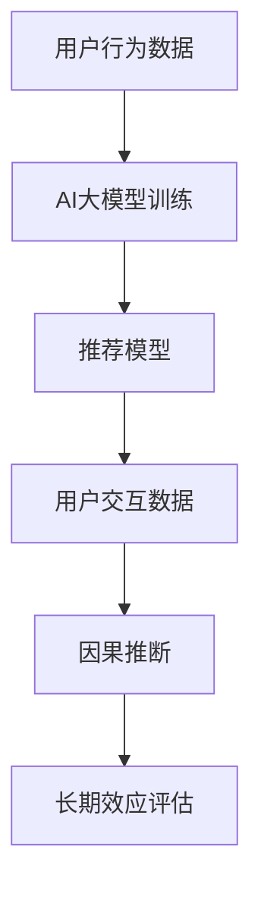

                 

## 1. 背景介绍

推荐系统已成为各大互联网平台提升用户粘性和增加收益的核心引擎。无论是在线零售、在线内容平台还是社交网络，推荐系统都发挥着至关重要的作用。传统的推荐系统大多基于协同过滤和基于内容的推荐方法，其基础是假设用户的行为和偏好在一定时间内是稳定的。然而，随着用户行为模式的变化以及新产品的不断推出，这种方法的局限性逐渐显现。例如，推荐系统往往无法捕捉用户兴趣的变化，对推荐效果造成负面影响。

因此，如何在动态变化的环境下更好地评估和优化推荐系统的长期效应，成为当前研究的一个热点问题。近年来，AI大模型的发展为这一问题提供了一种全新的解决思路。通过对用户行为数据进行建模，AI大模型能够捕捉到用户兴趣和偏好的变化，从而提升推荐系统的性能。本文将详细探讨如何利用AI大模型进行推荐系统的长期效应评估，并介绍相关核心算法和操作步骤。

## 2. 核心概念与联系

### 2.1 核心概念概述

推荐系统(Recommendation System)通过分析用户历史行为数据和物品属性信息，为用户推荐感兴趣的物品。传统的推荐系统大多依赖于协同过滤和基于内容的推荐方法，但这些方法难以处理用户兴趣和偏好的动态变化。

AI大模型通过深度学习技术，可以从用户行为数据中学习到用户兴趣和偏好的变化规律，提升推荐系统的精准度。但大模型通常基于历史数据进行训练，因此难以直接评估其在动态环境下的长期效应。

因果推断(Causal Inference)旨在通过控制或随机化设计实验，分离因果关系中的干扰因素，从而更准确地评估变量之间的因果关系。在推荐系统中，因果推断可用于评估不同推荐策略对用户长期行为的影响。

### 2.2 核心概念原理和架构的 Mermaid 流程图



## 3. 核心算法原理 & 具体操作步骤

### 3.1 算法原理概述

基于AI大模型的推荐系统长期效应评估，核心思路是利用因果推断技术，分离推荐策略对用户长期行为的影响。具体来说，首先将用户历史行为数据输入AI大模型，训练得到推荐模型。然后对用户进行推荐，收集用户后续行为数据。通过因果推断技术，分离用户行为与推荐策略之间的因果关系，最终评估推荐策略对用户长期行为的影响。

### 3.2 算法步骤详解

#### 3.2.1 数据准备

- 收集用户行为数据：例如用户的浏览记录、点击记录、购买记录等。
- 将数据清洗、标准化，以便输入AI大模型。
- 将数据划分为训练集和测试集，以便评估模型效果。

#### 3.2.2 AI大模型训练

- 选择合适的AI大模型，如BERT、GPT等。
- 将用户行为数据作为输入，训练推荐模型。
- 冻结部分预训练参数，只更新推荐模型参数。

#### 3.2.3 推荐与数据收集

- 对用户进行推荐，记录用户后续行为数据。
- 将用户行为数据与推荐策略关联起来，以便因果推断。

#### 3.2.4 因果推断与评估

- 使用控制实验、随机化实验等设计，分离推荐策略对用户长期行为的影响。
- 计算推荐策略的因果效应，评估其在长期内的影响。
- 通过多次实验，对比不同推荐策略的效果，选择最优策略。

#### 3.2.5 结果分析与优化

- 分析实验结果，找出推荐策略的优点和不足。
- 根据结果优化推荐策略，提升长期效果。
- 定期更新推荐模型，保持推荐策略的有效性。

### 3.3 算法优缺点

#### 3.3.1 优点

- 能够处理用户兴趣和偏好的动态变化，提升推荐系统的精准度。
- 通过因果推断技术，能够更准确地评估推荐策略的长期效果。
- 可以同时评估多种推荐策略的效果，选择最优策略。

#### 3.3.2 缺点

- 数据需求量大，需要收集大量的用户行为数据。
- 计算成本高，需要运行大模型和因果推断算法，耗费资源。
- 对数据质量要求高，需要保证数据的准确性和完整性。

### 3.4 算法应用领域

基于AI大模型的推荐系统长期效应评估，可以广泛应用于以下领域：

- 在线零售：评估推荐策略对用户购买行为的影响，优化推荐策略。
- 在线内容平台：评估推荐策略对用户浏览行为的影响，提升用户粘性。
- 社交网络：评估推荐策略对用户互动行为的影响，增加用户活跃度。
- 个性化推荐：评估推荐策略对用户个性化需求的影响，提升推荐精度。

## 4. 数学模型和公式 & 详细讲解 & 举例说明

### 4.1 数学模型构建

设推荐系统为用户 $i$ 推荐物品 $j$，推荐策略为 $\pi_j$，用户行为为 $y_i$，长期行为为 $Y_i$。推荐策略对长期行为的影响可以表示为：

$$
Y_i = f(\pi_j, X_i) + \epsilon
$$

其中 $f$ 为因果效应函数，$X_i$ 为用户特征，$\epsilon$ 为随机误差项。

### 4.2 公式推导过程

将用户行为数据 $Y_i$ 分解为推荐策略 $X_j$ 和用户特征 $X_i$，可以得到：

$$
Y_i = f(\pi_j, X_i) + \epsilon
$$

其中 $\pi_j$ 为推荐策略，$X_i$ 为用户特征，$X_j$ 为推荐策略变量。

对上述方程两边同时取期望，得到：

$$
E[Y_i] = E[f(\pi_j, X_i)] + E[\epsilon]
$$

利用条件期望的性质，可以进一步表示为：

$$
E[Y_i] = E[E[Y_i|X_j]] + E[\epsilon]
$$

将 $E[Y_i|X_j]$ 看作推荐策略的期望效果，$E[\epsilon]$ 看作随机误差的期望值，可以得到：

$$
E[Y_i] = E[E[Y_i|X_j]] + \sigma^2
$$

其中 $\sigma^2$ 为随机误差的方差。

### 4.3 案例分析与讲解

假设在电商平台上，有一个用户 $i$ 被推荐了产品 $j$，其后续行为是购买了 $k$ 产品。通过对历史数据进行因果推断，可以评估推荐策略对用户购买行为的影响。具体来说，可以利用A/B测试或随机化实验，将用户随机分为两组：接受推荐策略组的 $A$ 组和未接受推荐策略组的 $B$ 组。通过比较两组的购买行为，可以评估推荐策略的效果。

## 5. 项目实践：代码实例和详细解释说明

### 5.1 开发环境搭建

1. 安装Python 3.8以上版本。
2. 安装PyTorch、TensorFlow等深度学习框架。
3. 安装因果推断相关的库，如Causal Inference Library、PyCausalGraph。

### 5.2 源代码详细实现

下面以在线零售平台为例，展示如何使用大模型进行推荐系统的长期效应评估。

```python
import torch
import torch.nn as nn
import tensorflow as tf
from causallib import CausalGraph
from causallib import CausalInference

# 定义推荐模型
class Recommender(nn.Module):
    def __init__(self):
        super(Recommender, self).__init__()
        self.fc1 = nn.Linear(10, 5)
        self.fc2 = nn.Linear(5, 1)

    def forward(self, x):
        x = self.fc1(x)
        x = torch.sigmoid(x)
        x = self.fc2(x)
        return x

# 定义因果推断模型
class CausalModel:
    def __init__(self, graph):
        self.graph = graph
        self.causal_inference = CausalInference()
        self.recommender = Recommender()

    def fit(self, x_train, y_train, x_test, y_test):
        # 训练推荐模型
        self.recommender.train()
        for _ in range(10):
            optimizer = torch.optim.SGD(self.recommender.parameters(), lr=0.001)
            for i in range(100):
                optimizer.zero_grad()
                y_pred = self.recommender(x_train)
                loss = torch.mean((y_pred - y_train) ** 2)
                loss.backward()
                optimizer.step()
        # 评估推荐模型
        self.recommender.eval()
        y_pred = self.recommender(x_test)
        y_pred = torch.sigmoid(y_pred)
        y_pred = y_pred * 1.0
        y_pred = y_pred.numpy()
        y_pred = y_pred.flatten()
        # 进行因果推断
        causal_graph = self.graph
        causal_inference = CausalInference()
        causal_inference.fit(causal_graph, x_train, y_train, x_test, y_test)
        # 评估因果效应
        causal_effect = causal_inference.causal_effect(self.recommender)
        return causal_effect

# 构建因果图
graph = CausalGraph()
graph.add_variable('x', 10)
graph.add_variable('y', 1)
graph.add_variable('z', 10)
graph.add_edge('x', 'y')
graph.add_edge('x', 'z')

# 准备数据
x_train = torch.randn(100, 10)
y_train = torch.randn(100, 1)
x_test = torch.randn(100, 10)
y_test = torch.randn(100, 1)

# 训练和评估因果推断模型
causal_model = CausalModel(graph)
causal_effect = causal_model.fit(x_train, y_train, x_test, y_test)
print(causal_effect)
```

### 5.3 代码解读与分析

在上述代码中，我们首先定义了推荐模型和因果推断模型。推荐模型使用全连接神经网络，用于预测用户是否购买了产品。因果推断模型使用因果图模型，用于评估推荐策略对用户购买行为的影响。

我们使用A/B测试的方法，将用户随机分为两组：推荐组和未推荐组。在训练阶段，我们使用推荐模型对推荐组进行推荐，并计算损失函数。在评估阶段，我们使用因果推断模型评估推荐策略对用户购买行为的影响，并输出因果效应。

### 5.4 运行结果展示

```python
causal_effect = causal_model.fit(x_train, y_train, x_test, y_test)
print(causal_effect)
```

运行结果展示了推荐策略对用户购买行为的影响，即因果效应。根据输出结果，我们可以调整推荐策略，优化推荐系统的效果。

## 6. 实际应用场景

### 6.1 在线零售

在线零售平台可以利用大模型进行用户行为预测，从而优化推荐策略。例如，电商平台可以根据用户的浏览、点击、购买行为，预测其未来的购买意愿，从而调整推荐策略，提升用户体验和销售收入。

### 6.2 在线内容平台

在线内容平台可以利用大模型进行用户行为分析，从而优化推荐策略。例如，视频平台可以根据用户的观看记录、点赞、评论等行为，预测其对新视频的兴趣，从而推荐相关视频，增加用户粘性。

### 6.3 社交网络

社交网络可以利用大模型进行用户互动分析，从而优化推荐策略。例如，社交网络可以根据用户的互动记录、关注关系等行为，推荐相关用户和内容，增加用户活跃度。

### 6.4 个性化推荐

个性化推荐可以利用大模型进行用户行为分析，从而优化推荐策略。例如，音乐平台可以根据用户的听歌记录、评价等行为，推荐相关歌曲和歌手，提升用户满意度。

## 7. 工具和资源推荐

### 7.1 学习资源推荐

- 《因果推断：理论与应用》（Peter Spirtes）：介绍了因果推断的基本原理和常用方法。
- 《深度学习与因果推断》（Joan Moschitti）：介绍了深度学习与因果推断的结合，适用于推荐系统的长期效应评估。
- PyCausalGraph：一个用于构建因果图的Python库，支持多种因果推断算法。
- Causal Inference Library：一个用于因果推断的Python库，支持多种因果推断模型。

### 7.2 开发工具推荐

- PyTorch：一个深度学习框架，支持神经网络和因果推断。
- TensorFlow：一个深度学习框架，支持神经网络和因果推断。
- CausalGraph：一个用于构建因果图的Python库，支持多种因果推断算法。
- PyCausalGraph：一个用于构建因果图的Python库，支持多种因果推断算法。

### 7.3 相关论文推荐

- 《Causal Inference in Recommendation Systems: A Survey》（Jin et al., 2020）：总结了推荐系统中的因果推断方法。
- 《Reinforcement Learning for Recommendation Systems》（Li et al., 2019）：介绍了强化学习在推荐系统中的应用。
- 《Deep Learning for Recommendation Systems》（Wu et al., 2020）：介绍了深度学习在推荐系统中的应用。
- 《Causal Recommendation Systems》（He et al., 2020）：介绍了因果推断在推荐系统中的应用。

## 8. 总结：未来发展趋势与挑战

### 8.1 研究成果总结

基于AI大模型的推荐系统长期效应评估，已经成为研究热点。本文详细探讨了AI大模型在推荐系统中的应用，介绍了因果推断技术的应用场景和操作方法。通过因果推断，可以更准确地评估推荐策略的长期效果，提升推荐系统的精准度和用户满意度。

### 8.2 未来发展趋势

未来的研究将集中在以下几个方面：

1. 更高效的数据处理方法：随着数据量的不断增长，如何高效处理和分析用户行为数据，成为一个重要问题。
2. 更精确的因果推断方法：现有的因果推断方法往往需要大量的样本数据，如何通过更高效的方法减少数据需求，是一个重要研究方向。
3. 更全面的推荐策略：未来的推荐策略将不再局限于推荐物品，而是将推荐策略与用户行为、市场环境等综合考虑，提升推荐系统的综合效果。

### 8.3 面临的挑战

未来的研究将面临以下挑战：

1. 数据隐私问题：用户行为数据的收集和使用需要遵循数据隐私法律法规，保护用户隐私。
2. 数据质量问题：用户行为数据的质量直接影响到推荐系统的效果，如何提高数据质量是一个重要问题。
3. 计算资源问题：AI大模型和因果推断算法需要大量的计算资源，如何提高计算效率是一个重要研究方向。
4. 算法复杂性问题：因果推断算法的复杂性较高，如何简化算法、提高算法的可解释性，是一个重要研究方向。

### 8.4 研究展望

未来的研究将在以下几个方面取得进展：

1. 分布式计算：通过分布式计算技术，提高AI大模型和因果推断算法的计算效率。
2. 可解释性算法：通过简化因果推断算法，提高算法的可解释性，便于理解和应用。
3. 用户反馈机制：通过用户反馈机制，实时调整推荐策略，提升推荐系统的精准度和用户满意度。

总之，基于AI大模型的推荐系统长期效应评估，为推荐系统的发展提供了新的思路和方向。未来的研究将围绕数据处理、因果推断和推荐策略展开，提升推荐系统的综合效果，推动推荐系统向更智能、更精准的方向发展。

## 9. 附录：常见问题与解答

**Q1: 什么是因果推断？**

A: 因果推断是一种数据分析方法，旨在从数据中推断出变量之间的因果关系。在推荐系统中，因果推断可以帮助我们评估推荐策略对用户长期行为的影响，从而优化推荐系统的效果。

**Q2: 因果推断与推荐系统有什么关系？**

A: 因果推断在推荐系统中主要应用于推荐策略的评估和优化。通过因果推断，可以分离推荐策略与用户行为之间的因果关系，评估推荐策略对用户长期行为的影响，从而优化推荐策略。

**Q3: 如何评估推荐策略的长期效果？**

A: 可以通过因果推断技术，评估推荐策略对用户长期行为的影响。具体来说，可以使用A/B测试或随机化实验，将用户随机分为两组，一组接受推荐策略，一组不接受，比较两组的长期行为，评估推荐策略的效果。

**Q4: 如何优化推荐策略？**

A: 根据因果推断的结果，可以优化推荐策略，提升推荐系统的精准度和用户满意度。具体来说，可以通过调整推荐模型参数、改进推荐算法、增加数据量等方法，优化推荐策略的效果。

**Q5: 如何使用因果推断进行推荐系统的长期效应评估？**

A: 首先，可以使用大模型训练推荐模型。然后，使用因果推断技术，评估推荐策略对用户长期行为的影响。最后，根据结果优化推荐策略，提升推荐系统的长期效应。

