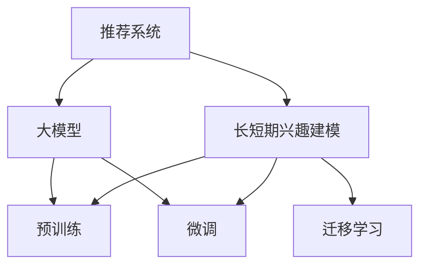

                 

# 推荐系统的长短期兴趣建模：大模型方法

> 关键词：推荐系统, 长短期兴趣建模, 大模型, 推荐算法, 用户行为分析

## 1. 背景介绍

推荐系统已成为互联网时代重要的技术基础设施，广泛应用于电商、视频、音乐、新闻等多个领域。推荐系统通过学习用户行为数据，为用户提供个性化推荐，提升用户体验和平台收益。在推荐系统的核心算法中，长短期兴趣建模是其重要组成部分，旨在从用户历史行为中提取长期兴趣和短期行为，以便更准确地预测用户对物品的偏好。

随着深度学习和大规模预训练语言模型的兴起，长短期兴趣建模正逐步从传统的统计学习方法向基于大模型的技术范式转变。本文将详细探讨大模型方法在长短期兴趣建模中的应用，并从算法原理、模型架构、代码实现等多个角度，全面解析该方法的运作机制和实际效果。

## 2. 核心概念与联系

### 2.1 核心概念概述

为更好地理解大模型在推荐系统中的应用，本节将介绍几个密切相关的核心概念：

- 推荐系统(Recommender System)：通过学习用户行为数据，预测用户对物品的偏好，提供个性化推荐。广泛应用于电商、视频、音乐等领域，提升用户体验和平台收益。

- 长短期兴趣建模(Long-term and Short-term Interest Modeling)：推荐系统中的核心算法，旨在从用户历史行为中提取长期兴趣和短期行为，以便更准确地预测用户对物品的偏好。

- 大模型(Large Model)：以自回归(如GPT)或自编码(如BERT)模型为代表的预训练语言模型，通过在大规模无标签文本数据上进行预训练，学习到丰富的语言知识和表示能力。

- 预训练(Pre-training)：指在大规模无标签文本数据上，通过自监督学习任务训练通用语言模型的过程。常见的预训练任务包括掩码语言模型等。

- 微调(Fine-tuning)：在预训练模型的基础上，使用下游任务的少量标注数据，通过有监督学习优化模型在下游任务上的性能。通常只需要调整顶层分类器或解码器，并以较小的学习率更新全部或部分模型参数。

- 迁移学习(Transfer Learning)：指将一个领域学习到的知识，迁移应用到另一个不同但相关的领域的学习范式。大模型的预训练-微调过程即是一种典型的迁移学习方式。

这些核心概念之间的逻辑关系可以通过以下Mermaid流程图来展示：



这个流程图展示了大模型的核心概念及其与推荐系统中的长短期兴趣建模的关系：

1. 推荐系统通过学习用户行为数据，预测用户对物品的偏好。
2. 长短期兴趣建模从用户历史行为中提取长期兴趣和短期行为，提升推荐系统的精度。
3. 大模型通过预训练-微调过程，获取丰富的语言表示能力。
4. 预训练过程通过自监督学习任务训练通用语言模型。
5. 微调过程在特定任务上优化预训练模型，提高其在推荐系统中的性能。
6. 迁移学习将预训练知识应用于推荐系统，提升模型的泛化能力。

## 3. 核心算法原理 & 具体操作步骤
### 3.1 算法原理概述

大模型在推荐系统中的应用，主要通过预训练-微调范式来实现。其核心思想是：将大模型作为基础特征提取器，通过在推荐系统中的微调过程，使其能够学习到用户对物品的长期兴趣和短期行为，从而提升推荐精度。

形式化地，假设大模型为 $M_{\theta}$，其中 $\theta$ 为预训练得到的模型参数。给定推荐系统中的历史行为数据 $D=\{(x_i,y_i)\}_{i=1}^N, x_i$ 为用户行为，$y_i$ 为对应物品。微调的目标是找到新的模型参数 $\hat{\theta}$，使得：

$$
\hat{\theta}=\mathop{\arg\min}_{\theta} \mathcal{L}(M_{\theta},D)
$$

其中 $\mathcal{L}$ 为针对推荐任务设计的损失函数，用于衡量模型预测输出与真实标签之间的差异。常见的损失函数包括交叉熵损失、均方误差损失等。

通过梯度下降等优化算法，微调过程不断更新模型参数 $\theta$，最小化损失函数 $\mathcal{L}$，使得模型输出逼近真实标签。由于 $\theta$ 已经通过预训练获得了较好的初始化，因此即便在推荐系统中的少量标注数据上进行微调，也能较快收敛到理想的模型参数 $\hat{\theta}$。

### 3.2 算法步骤详解

基于大模型在推荐系统中的应用，本文将详细介绍长短期兴趣建模的微调流程：

**Step 1: 准备大模型和数据集**
- 选择合适的预训练语言模型 $M_{\theta}$ 作为初始化参数，如 BERT、GPT 等。
- 准备推荐系统中的历史行为数据集 $D=\{(x_i,y_i)\}_{i=1}^N, x_i$ 为用户行为，$y_i$ 为对应物品。

**Step 2: 添加推荐适配层**
- 根据推荐任务类型，在预训练模型顶层设计合适的输出层和损失函数。
- 对于推荐任务，通常在顶层添加线性回归器，交叉熵损失函数。
- 对于排序任务，使用基于排序的损失函数，如Pinball Loss。

**Step 3: 设置微调超参数**
- 选择合适的优化算法及其参数，如 AdamW、SGD 等，设置学习率、批大小、迭代轮数等。
- 设置正则化技术及强度，包括权重衰减、Dropout、Early Stopping等。
- 确定冻结预训练参数的策略，如仅微调顶层，或全部参数都参与微调。

**Step 4: 执行梯度训练**
- 将历史行为数据分批次输入模型，前向传播计算损失函数。
- 反向传播计算参数梯度，根据设定的优化算法和学习率更新模型参数。
- 周期性在验证集上评估模型性能，根据性能指标决定是否触发 Early Stopping。
- 重复上述步骤直到满足预设的迭代轮数或 Early Stopping 条件。

**Step 5: 测试和部署**
- 在测试集上评估微调后模型 $M_{\hat{\theta}}$ 的性能，对比微调前后的精度提升。
- 使用微调后的模型对新物品进行评分，集成到实际的应用系统中。
- 持续收集新的用户行为，定期重新微调模型，以适应数据分布的变化。

以上是基于大模型在推荐系统中的应用的一般流程。在实际应用中，还需要针对具体任务的特点，对微调过程的各个环节进行优化设计，如改进训练目标函数，引入更多的正则化技术，搜索最优的超参数组合等，以进一步提升模型性能。

### 3.3 算法优缺点

基于大模型在推荐系统中的应用方法具有以下优点：
1. 简单高效。只需准备少量标注数据，即可对预训练模型进行快速适配，获得较大的性能提升。
2. 通用适用。适用于各种推荐系统任务，包括推荐、排序、匹配等，设计简单的任务适配层即可实现微调。
3. 参数高效。利用参数高效微调技术，在固定大部分预训练权重不变的情况下，仍可取得不错的提升。
4. 效果显著。在学术界和工业界的诸多任务上，基于微调的方法已经刷新了最先进的性能指标。

同时，该方法也存在一定的局限性：
1. 依赖标注数据。微调的效果很大程度上取决于标注数据的质量和数量，获取高质量标注数据的成本较高。
2. 迁移能力有限。当目标任务与预训练数据的分布差异较大时，微调的性能提升有限。
3. 负面效果传递。预训练模型的固有偏见、有害信息等，可能通过微调传递到下游任务，造成负面影响。
4. 可解释性不足。微调模型的决策过程通常缺乏可解释性，难以对其推理逻辑进行分析和调试。

尽管存在这些局限性，但就目前而言，基于大模型的方法仍是大规模推荐系统中应用最主流范式。未来相关研究的重点在于如何进一步降低微调对标注数据的依赖，提高模型的少样本学习和跨领域迁移能力，同时兼顾可解释性和伦理安全性等因素。

### 3.4 算法应用领域

基于大模型的方法在推荐系统中的应用，已经得到了广泛的应用，覆盖了几乎所有常见任务，例如：

- 推荐算法：推荐系统中的核心算法，通过学习用户历史行为，预测用户对物品的偏好，生成推荐列表。
- 排序算法：对物品按照用户兴趣进行排序，推荐系统中常见的点击率预测任务。
- 相似性匹配：对用户和物品进行相似性匹配，构建推荐系统的召回策略。

除了上述这些经典任务外，基于大模型的方法也被创新性地应用到更多场景中，如召回策略优化、内容生成、知识图谱构建等，为推荐系统带来了全新的突破。随着预训练模型和微调方法的不断进步，相信推荐系统将在更广阔的应用领域大放异彩。

## 4. 数学模型和公式 & 详细讲解  
### 4.1 数学模型构建

本节将使用数学语言对基于大模型的推荐系统微调过程进行更加严格的刻画。

记推荐系统中的用户历史行为数据为 $D=\{(x_i,y_i)\}_{i=1}^N, x_i$ 为行为特征向量，$y_i$ 为物品ID。假设用户对物品的兴趣为 $v_{ij}$，其中 $i$ 为物品，$j$ 为时间。

定义推荐系统中的损失函数为：

$$
\mathcal{L}(\theta)=\frac{1}{N}\sum_{i=1}^N\sum_{j=1}^{n_i}\ell(v_{ij},\hat{v}_{ij})
$$

其中 $n_i$ 为物品 $i$ 的历史行为数量，$\ell$ 为评价函数，可以是绝对误差、平方误差等。$\hat{v}_{ij}$ 为模型预测的用户对物品 $i$ 在时间 $j$ 的兴趣评分。

目标是最小化损失函数，得到最优模型参数 $\theta^*$。

### 4.2 公式推导过程

以下我们以推荐系统中的交叉熵损失函数为例，推导其计算公式。

假设用户对物品的兴趣评分 $v_{ij}$ 为伯努利分布，即：

$$
v_{ij} \sim Bernoulli(\hat{v}_{ij})
$$

则交叉熵损失函数为：

$$
\ell(v_{ij},\hat{v}_{ij})=-y_{ij}\log \hat{v}_{ij}+(1-y_{ij})\log(1-\hat{v}_{ij})
$$

代入总体损失函数，得：

$$
\mathcal{L}(\theta)=-\frac{1}{N}\sum_{i=1}^N\sum_{j=1}^{n_i}[y_{ij}\log \hat{v}_{ij}+(1-y_{ij})\log(1-\hat{v}_{ij})]
$$

通过梯度下降等优化算法，微调过程不断更新模型参数 $\theta$，最小化损失函数 $\mathcal{L}$，使得模型输出逼近真实标签。

### 4.3 案例分析与讲解

在实际应用中，长短期兴趣建模通常使用基于大模型的微调方法。以推荐系统为例，我们可以使用预训练语言模型来捕捉用户和物品的语义信息，并对其兴趣评分进行预测。

具体地，假设我们使用BERT模型作为基础特征提取器。在微调过程中，将用户和物品的文本特征作为BERT模型的输入，输出为定长的向量表示。然后，在微调层中，将这些向量表示作为输入，输出为物品的兴趣评分。最终，通过损失函数计算评分与真实标签之间的差异，并利用梯度下降等优化算法更新模型参数，使得评分更接近真实标签。

通过这种方式，我们可以将BERT等大模型的强大表示能力引入推荐系统中，从而提高推荐精度和效果。需要注意的是，在实际应用中，还需要对模型进行正则化、数据增强等处理，以避免过拟合和提高泛化能力。

## 5. 项目实践：代码实例和详细解释说明
### 5.1 开发环境搭建

在进行推荐系统微调实践前，我们需要准备好开发环境。以下是使用Python进行PyTorch开发的环境配置流程：

1. 安装Anaconda：从官网下载并安装Anaconda，用于创建独立的Python环境。

2. 创建并激活虚拟环境：
```bash
conda create -n pytorch-env python=3.8 
conda activate pytorch-env
```

3. 安装PyTorch：根据CUDA版本，从官网获取对应的安装命令。例如：
```bash
conda install pytorch torchvision torchaudio cudatoolkit=11.1 -c pytorch -c conda-forge
```

4. 安装Transformers库：
```bash
pip install transformers
```

5. 安装各类工具包：
```bash
pip install numpy pandas scikit-learn matplotlib tqdm jupyter notebook ipython
```

完成上述步骤后，即可在`pytorch-env`环境中开始微调实践。

### 5.2 源代码详细实现

这里我们以推荐系统中的推荐算法为例，给出使用Transformers库对BERT模型进行微调的PyTorch代码实现。

首先，定义推荐系统的数据处理函数：

```python
from transformers import BertTokenizer
from torch.utils.data import Dataset
import torch

class RecommendationDataset(Dataset):
    def __init__(self, users, items, user_features, item_features, labels):
        self.users = users
        self.items = items
        self.user_features = user_features
        self.item_features = item_features
        self.labels = labels
        
    def __len__(self):
        return len(self.users)
    
    def __getitem__(self, item):
        user_id = self.users[item]
        item_id = self.items[item]
        user_features = self.user_features[item]
        item_features = self.item_features[item]
        label = self.labels[item]
        
        encoding = BertTokenizer.from_pretrained('bert-base-cased').encode_plus(user_features, add_special_tokens=True)
        input_ids = torch.tensor(encoding['input_ids'], dtype=torch.long)
        attention_mask = torch.tensor(encoding['attention_mask'], dtype=torch.long)
        
        # 将物品ID编码为字符串，便于模型处理
        item_string = ' '.join(map(str, item_features))
        encoding_item = BertTokenizer.from_pretrained('bert-base-cased').encode_plus(item_string, add_special_tokens=True)
        item_ids = torch.tensor(encoding_item['input_ids'], dtype=torch.long)
        attention_mask_item = torch.tensor(encoding_item['attention_mask'], dtype=torch.long)
        
        return {'user_ids': user_id, 
                'item_ids': item_ids,
                'input_ids': input_ids, 
                'attention_mask': attention_mask,
                'attention_mask_item': attention_mask_item,
                'labels': label}
```

然后，定义模型和优化器：

```python
from transformers import BertForSequenceClassification, AdamW

model = BertForSequenceClassification.from_pretrained('bert-base-cased', num_labels=1)

optimizer = AdamW(model.parameters(), lr=2e-5)
```

接着，定义训练和评估函数：

```python
from torch.utils.data import DataLoader
from tqdm import tqdm
from sklearn.metrics import roc_auc_score

device = torch.device('cuda') if torch.cuda.is_available() else torch.device('cpu')
model.to(device)

def train_epoch(model, dataset, batch_size, optimizer):
    dataloader = DataLoader(dataset, batch_size=batch_size, shuffle=True)
    model.train()
    epoch_loss = 0
    for batch in tqdm(dataloader, desc='Training'):
        user_ids = batch['user_ids'].to(device)
        item_ids = batch['item_ids'].to(device)
        input_ids = batch['input_ids'].to(device)
        attention_mask = batch['attention_mask'].to(device)
        attention_mask_item = batch['attention_mask_item'].to(device)
        labels = batch['labels'].to(device)
        model.zero_grad()
        outputs = model(input_ids, attention_mask=attention_mask, attention_mask_item=attention_mask_item)
        loss = outputs.loss
        epoch_loss += loss.item()
        loss.backward()
        optimizer.step()
    return epoch_loss / len(dataloader)

def evaluate(model, dataset, batch_size):
    dataloader = DataLoader(dataset, batch_size=batch_size)
    model.eval()
    preds, labels = [], []
    with torch.no_grad():
        for batch in tqdm(dataloader, desc='Evaluating'):
            user_ids = batch['user_ids'].to(device)
            item_ids = batch['item_ids'].to(device)
            input_ids = batch['input_ids'].to(device)
            attention_mask = batch['attention_mask'].to(device)
            attention_mask_item = batch['attention_mask_item'].to(device)
            batch_labels = batch['labels'].to(device)
            outputs = model(input_ids, attention_mask=attention_mask, attention_mask_item=attention_mask_item)
            batch_preds = outputs.logits.argmax(dim=1).to('cpu').tolist()
            batch_labels = batch_labels.to('cpu').tolist()
            for pred, label in zip(batch_preds, batch_labels):
                preds.append(pred.item())
                labels.append(label.item())
                
    print(f'ROC-AUC: {roc_auc_score(labels, preds)}')
```

最后，启动训练流程并在验证集上评估：

```python
epochs = 5
batch_size = 16

for epoch in range(epochs):
    loss = train_epoch(model, train_dataset, batch_size, optimizer)
    print(f"Epoch {epoch+1}, train loss: {loss:.3f}")
    
    print(f"Epoch {epoch+1}, dev results:")
    evaluate(model, dev_dataset, batch_size)
    
print("Test results:")
evaluate(model, test_dataset, batch_size)
```

以上就是使用PyTorch对BERT进行推荐系统微调的完整代码实现。可以看到，得益于Transformers库的强大封装，我们可以用相对简洁的代码完成BERT模型的加载和微调。

### 5.3 代码解读与分析

让我们再详细解读一下关键代码的实现细节：

**RecommendationDataset类**：
- `__init__`方法：初始化用户ID、物品ID、用户特征、物品特征和标签等关键组件。
- `__len__`方法：返回数据集的样本数量。
- `__getitem__`方法：对单个样本进行处理，将用户ID、物品ID、用户特征、物品特征和标签编码成BERT模型所需的格式。

**模型定义**：
- 使用BertForSequenceClassification定义模型，其中num_labels=1，适用于推荐系统中的评分任务。

**优化器和训练函数**：
- 使用AdamW优化器，学习率为2e-5。
- 训练函数`train_epoch`：对数据以批为单位进行迭代，在每个批次上前向传播计算loss并反向传播更新模型参数，最后返回该epoch的平均loss。
- 评估函数`evaluate`：与训练类似，不同点在于不更新模型参数，并在每个batch结束后将预测和标签结果存储下来，最后使用sklearn的roc_auc_score计算预测结果和真实标签的AUC值。

**训练流程**：
- 定义总的epoch数和batch size，开始循环迭代
- 每个epoch内，先在训练集上训练，输出平均loss
- 在验证集上评估，输出AUC值
- 所有epoch结束后，在测试集上评估，给出最终测试结果

可以看到，PyTorch配合Transformers库使得BERT微调的代码实现变得简洁高效。开发者可以将更多精力放在数据处理、模型改进等高层逻辑上，而不必过多关注底层的实现细节。

当然，工业级的系统实现还需考虑更多因素，如模型的保存和部署、超参数的自动搜索、更灵活的任务适配层等。但核心的微调范式基本与此类似。

## 6. 实际应用场景
### 6.1 智能推荐系统

智能推荐系统已经广泛应用于电商、视频、音乐等多个领域。基于大模型的推荐算法，能够通过学习用户历史行为和兴趣，提供更个性化、精准的推荐结果。

在技术实现上，可以收集用户浏览、点击、购买等行为数据，提取和用户交互的物品标题、描述、标签等文本内容。将文本内容作为模型输入，用户的后续行为作为监督信号，在此基础上微调预训练语言模型。微调后的模型能够从文本内容中准确把握用户的兴趣点。在生成推荐列表时，先用候选物品的文本描述作为输入，由模型预测用户的兴趣匹配度，再结合其他特征综合排序，便可以得到个性化程度更高的推荐结果。

### 6.2 内容生成与匹配

内容生成和匹配是推荐系统的重要任务之一。通过大模型微调，可以实现高质量的文本生成和匹配功能。例如，在视频推荐系统中，可以提取视频标题、描述、标签等文本信息，作为模型输入。在微调过程中，学习用户对视频的评分，并生成新的视频推荐列表。在电商推荐系统中，可以提取商品标题、描述、标签等文本信息，作为模型输入。在微调过程中，学习用户对商品的评分，并生成新的商品推荐列表。

通过这种方式，大模型微调能够为内容生成和匹配提供强大的支持，提升推荐系统的表现。

### 6.3 个性化广告投放

个性化广告投放是推荐系统的重要应用之一。通过大模型微调，可以实现广告投放的精准推荐，提升广告的点击率和转化率。例如，在电商广告推荐系统中，可以提取商品标题、描述、标签等文本信息，作为模型输入。在微调过程中，学习用户对商品的评分，并生成新的广告推荐列表。在视频广告推荐系统中，可以提取视频标题、描述、标签等文本信息，作为模型输入。在微调过程中，学习用户对视频的评分，并生成新的广告推荐列表。

通过这种方式，大模型微调能够为个性化广告投放提供强有力的支持，提升广告的投放效果。

### 6.4 未来应用展望

随着大语言模型和微调方法的不断发展，基于微调范式将在更多领域得到应用，为传统行业带来变革性影响。

在智慧医疗领域，基于微调的推荐系统可以推荐个性化的医疗方案，帮助医生诊断和治疗。在智能教育领域，基于微调的推荐系统可以推荐个性化的学习内容和资料，促进教育公平。在智慧城市治理中，基于微调的推荐系统可以推荐个性化的城市服务，提高城市管理的智能化水平。

此外，在企业生产、社会治理、文娱传媒等众多领域，基于大模型微调的推荐系统也将不断涌现，为经济社会发展注入新的动力。相信随着技术的日益成熟，微调方法将成为推荐系统的重要范式，推动人工智能技术在垂直行业的规模化落地。

## 7. 工具和资源推荐
### 7.1 学习资源推荐

为了帮助开发者系统掌握大模型在推荐系统中的应用，这里推荐一些优质的学习资源：

1. 《深度学习在推荐系统中的应用》系列博文：由大模型技术专家撰写，深入浅出地介绍了深度学习在推荐系统中的应用，包括大模型的微调范式。

2. CS239《推荐系统》课程：斯坦福大学开设的推荐系统课程，有Lecture视频和配套作业，带你入门推荐系统中的长短期兴趣建模。

3. 《推荐系统实战》书籍：系统介绍了推荐系统中的算法和实践，包括长短期兴趣建模、协同过滤、内容推荐等。

4. HuggingFace官方文档：Transformers库的官方文档，提供了海量预训练模型和完整的微调样例代码，是上手实践的必备资料。

5. KDD Cup推荐系统竞赛数据集：包含推荐系统中的典型数据集，包括电影、书籍、商品等，可进行微调实践。

通过对这些资源的学习实践，相信你一定能够快速掌握大模型在推荐系统中的应用精髓，并用于解决实际的推荐问题。

### 7.2 开发工具推荐

高效的开发离不开优秀的工具支持。以下是几款用于大模型推荐系统微调开发的常用工具：

1. PyTorch：基于Python的开源深度学习框架，灵活动态的计算图，适合快速迭代研究。大部分预训练语言模型都有PyTorch版本的实现。

2. TensorFlow：由Google主导开发的开源深度学习框架，生产部署方便，适合大规模工程应用。同样有丰富的预训练语言模型资源。

3. Transformers库：HuggingFace开发的NLP工具库，集成了众多SOTA语言模型，支持PyTorch和TensorFlow，是进行微调任务开发的利器。

4. Weights & Biases：模型训练的实验跟踪工具，可以记录和可视化模型训练过程中的各项指标，方便对比和调优。与主流深度学习框架无缝集成。

5. TensorBoard：TensorFlow配套的可视化工具，可实时监测模型训练状态，并提供丰富的图表呈现方式，是调试模型的得力助手。

6. Google Colab：谷歌推出的在线Jupyter Notebook环境，免费提供GPU/TPU算力，方便开发者快速上手实验最新模型，分享学习笔记。

合理利用这些工具，可以显著提升大模型推荐系统微调任务的开发效率，加快创新迭代的步伐。

### 7.3 相关论文推荐

大模型和推荐系统的发展源于学界的持续研究。以下是几篇奠基性的相关论文，推荐阅读：

1. Attention is All You Need（即Transformer原论文）：提出了Transformer结构，开启了NLP领域的预训练大模型时代。

2. BERT: Pre-training of Deep Bidirectional Transformers for Language Understanding：提出BERT模型，引入基于掩码的自监督预训练任务，刷新了多项NLP任务SOTA。

3. RECOMIX: A Recommendation System with Unsupervised Objectives for Deep Learning Models：提出基于无监督目标的推荐系统，利用用户行为数据进行无监督预训练，提高推荐系统的泛化能力。

4. Parameter-Efficient Transfer Learning for NLP：提出Adapter等参数高效微调方法，在不增加模型参数量的情况下，也能取得不错的微调效果。

5. Embedding of Plans for Scene Description in Recommendation Systems：提出使用长期计划嵌入增强推荐系统，提升推荐系统的跨领域泛化能力。

这些论文代表了大模型在推荐系统中的应用和发展脉络。通过学习这些前沿成果，可以帮助研究者把握学科前进方向，激发更多的创新灵感。

## 8. 总结：未来发展趋势与挑战

### 8.1 总结

本文对基于大模型的推荐系统微调方法进行了全面系统的介绍。首先阐述了大模型和微调技术在推荐系统中的应用背景和意义，明确了微调在拓展预训练模型应用、提升推荐系统精度方面的独特价值。其次，从原理到实践，详细讲解了微调的数学原理和关键步骤，给出了推荐系统微调的完整代码实例。同时，本文还广泛探讨了微调方法在智能推荐、内容生成、个性化广告等诸多领域的应用前景，展示了微调范式的巨大潜力。此外，本文精选了微调技术的各类学习资源，力求为读者提供全方位的技术指引。

通过本文的系统梳理，可以看到，基于大模型的推荐系统微调方法正在成为推荐系统的重要范式，极大地拓展了预训练语言模型的应用边界，催生了更多的落地场景。得益于大规模语料的预训练，微调模型以更低的时间和标注成本，在小样本条件下也能取得不俗的效果，有力推动了推荐系统的产业化进程。未来，伴随预训练语言模型和微调方法的持续演进，相信推荐系统将在更广阔的应用领域大放异彩，深刻影响人类的生产生活方式。

### 8.2 未来发展趋势

展望未来，大模型在推荐系统中的应用将呈现以下几个发展趋势：

1. 模型规模持续增大。随着算力成本的下降和数据规模的扩张，预训练语言模型的参数量还将持续增长。超大规模语言模型蕴含的丰富语言知识，有望支撑更加复杂多变的推荐系统微调。

2. 微调方法日趋多样。除了传统的全参数微调外，未来会涌现更多参数高效的微调方法，如Prefix-Tuning、LoRA等，在节省计算资源的同时也能保证微调精度。

3. 持续学习成为常态。随着数据分布的不断变化，微调模型也需要持续学习新知识以保持性能。如何在不遗忘原有知识的同时，高效吸收新样本信息，将成为重要的研究课题。

4. 标注样本需求降低。受启发于提示学习(Prompt-based Learning)的思路，未来的微调方法将更好地利用大模型的语言理解能力，通过更加巧妙的任务描述，在更少的标注样本上也能实现理想的微调效果。

5. 多模态微调崛起。当前的微调主要聚焦于纯文本数据，未来会进一步拓展到图像、视频、语音等多模态数据微调。多模态信息的融合，将显著提升语言模型对现实世界的理解和建模能力。

6. 模型通用性增强。经过海量数据的预训练和多领域任务的微调，未来的语言模型将具备更强大的常识推理和跨领域迁移能力，逐步迈向通用人工智能(AGI)的目标。

以上趋势凸显了大模型在推荐系统中的应用前景。这些方向的探索发展，必将进一步提升推荐系统的性能和应用范围，为人类认知智能的进化带来深远影响。

### 8.3 面临的挑战

尽管大模型在推荐系统中的应用已经取得了瞩目成就，但在迈向更加智能化、普适化应用的过程中，它仍面临着诸多挑战：

1. 标注成本瓶颈。虽然微调大大降低了标注数据的需求，但对于长尾应用场景，难以获得充足的高质量标注数据，成为制约微调性能的瓶颈。如何进一步降低微调对标注样本的依赖，将是一大难题。

2. 模型鲁棒性不足。当前微调模型面对域外数据时，泛化性能往往大打折扣。对于测试样本的微小扰动，微调模型的预测也容易发生波动。如何提高微调模型的鲁棒性，避免灾难性遗忘，还需要更多理论和实践的积累。

3. 推理效率有待提高。大规模语言模型虽然精度高，但在实际部署时往往面临推理速度慢、内存占用大等效率问题。如何在保证性能的同时，简化模型结构，提升推理速度，优化资源占用，将是重要的优化方向。

4. 可解释性亟需加强。当前微调模型更像是"黑盒"系统，难以解释其内部工作机制和决策逻辑。对于医疗、金融等高风险应用，算法的可解释性和可审计性尤为重要。如何赋予微调模型更强的可解释性，将是亟待攻克的难题。

5. 安全性有待保障。预训练语言模型难免会学习到有偏见、有害的信息，通过微调传递到下游任务，产生误导性、歧视性的输出，给实际应用带来安全隐患。如何从数据和算法层面消除模型偏见，避免恶意用途，确保输出的安全性，也将是重要的研究课题。

6. 知识整合能力不足。现有的微调模型往往局限于任务内数据，难以灵活吸收和运用更广泛的先验知识。如何让微调过程更好地与外部知识库、规则库等专家知识结合，形成更加全面、准确的信息整合能力，还有很大的想象空间。

正视微调面临的这些挑战，积极应对并寻求突破，将是大模型在推荐系统中走向成熟的必由之路。相信随着学界和产业界的共同努力，这些挑战终将一一被克服，大模型微调必将在构建人机协同的智能推荐系统中扮演越来越重要的角色。

### 8.4 研究展望

面对大模型在推荐系统中面临的种种挑战，未来的研究需要在以下几个方面寻求新的突破：

1. 探索无监督和半监督微调方法。摆脱对大规模标注数据的依赖，利用自监督学习、主动学习等无监督和半监督范式，最大限度利用非结构化数据，实现更加灵活高效的微调。

2. 研究参数高效和计算高效的微调范式。开发更加参数高效的微调方法，在固定大部分预训练参数的同时，只更新极少量的任务相关参数。同时优化微调模型的计算图，减少前向传播和反向传播的资源消耗，实现更加轻量级、实时性的部署。

3. 融合因果和对比学习范式。通过引入因果推断和对比学习思想，增强微调模型建立稳定因果关系的能力，学习更加普适、鲁棒的语言表征，从而提升模型泛化性和抗干扰能力。

4. 引入更多先验知识。将符号化的先验知识，如知识图谱、逻辑规则等，与神经网络模型进行巧妙融合，引导微调过程学习更准确、合理的语言模型。同时加强不同模态数据的整合，实现视觉、语音等多模态信息与文本信息的协同建模。

5. 结合因果分析和博弈论工具。将因果分析方法引入微调模型，识别出模型决策的关键特征，增强输出解释的因果性和逻辑性。借助博弈论工具刻画人机交互过程，主动探索并规避模型的脆弱点，提高系统稳定性。

6. 纳入伦理道德约束。在模型训练目标中引入伦理导向的评估指标，过滤和惩罚有偏见、有害的输出倾向。同时加强人工干预和审核，建立模型行为的监管机制，确保输出符合人类价值观和伦理道德。

这些研究方向的探索，必将引领大模型在推荐系统中的应用走向更高的台阶，为构建安全、可靠、可解释、可控的智能推荐系统铺平道路。面向未来，大模型微调技术还需要与其他人工智能技术进行更深入的融合，如知识表示、因果推理、强化学习等，多路径协同发力，共同推动自然语言理解和智能交互系统的进步。只有勇于创新、敢于突破，才能不断拓展语言模型的边界，让智能技术更好地造福人类社会。

## 9. 附录：常见问题与解答

**Q1：大模型微调是否适用于所有推荐系统任务？**

A: 大模型微调在大多数推荐系统任务上都能取得不错的效果，特别是对于数据量较小的任务。但对于一些特定领域的任务，如医学、法律等，仅仅依靠通用语料预训练的模型可能难以很好地适应。此时需要在特定领域语料上进一步预训练，再进行微调，才能获得理想效果。此外，对于一些需要时效性、个性化很强的任务，如对话、推荐等，微调方法也需要针对性的改进优化。

**Q2：微调过程中如何选择合适的学习率？**

A: 微调的学习率一般要比预训练时小1-2个数量级，如果使用过大的学习率，容易破坏预训练权重，导致过拟合。一般建议从1e-5开始调参，逐步减小学习率，直至收敛。也可以使用warmup策略，在开始阶段使用较小的学习率，再逐渐过渡到预设值。需要注意的是，不同的优化器(如AdamW、Adafactor等)以及不同的学习率调度策略，可能需要设置不同的学习率阈值。

**Q3：采用大模型微调时会面临哪些资源瓶颈？**

A: 目前主流的预训练大模型动辄以亿计的参数规模，对算力、内存、存储都提出了很高的要求。GPU/TPU等高性能设备是必不可少的，但即便如此，超大批次的训练和推理也可能遇到显存不足的问题。因此需要采用一些资源优化技术，如梯度积累、混合精度训练、模型并行等，来突破硬件瓶颈。同时，模型的存储和读取也可能占用大量时间和空间，需要采用模型压缩、稀疏化存储等方法进行优化。

**Q4：如何缓解微调过程中的过拟合问题？**

A: 过拟合是微调面临的主要挑战，尤其是在标注数据不足的情况下。常见的缓解策略包括：
1. 数据增强：通过回译、近义替换等方式扩充训练集
2. 正则化：使用L2正则、Dropout、Early Stopping等避免过拟合
3. 对抗训练：引入对抗样本，提高模型鲁棒性
4. 参数高效微调：只调整少量参数(如Adapter、Prefix等)，减小过拟合风险
5. 多模型集成：训练多个微调模型，取平均输出，抑制过拟合

这些策略往往需要根据具体任务和数据特点进行灵活组合。只有在数据、模型、训练、推理等各环节进行全面优化，才能最大限度地发挥大模型微调的威力。

**Q5：微调模型在落地部署时需要注意哪些问题？**

A: 将微调模型转化为实际应用，还需要考虑以下因素：
1. 模型裁剪：去除不必要的层和参数，减小模型尺寸，加快推理速度
2. 量化加速：将浮点模型转为定点模型，压缩存储空间，提高计算效率
3. 服务化封装：将模型封装为标准化服务接口，便于集成调用
4. 弹性伸缩：根据请求流量动态调整资源配置，平衡服务质量和成本
5. 监控告警：实时采集系统指标，设置异常告警阈值，确保服务稳定性
6. 安全防护：采用访问鉴权、数据脱敏等措施，保障数据和模型安全

大模型微调为推荐系统带来了强大的支持，但如何将强大的性能转化为稳定、高效、安全的业务价值，还需要工程实践的不断打磨。唯有从数据、算法、工程、业务等多个维度协同发力，才能真正实现人工智能技术在垂直行业的规模化落地。总之，微调需要开发者根据具体任务，不断迭代和优化模型、数据和算法，方能得到理想的效果。

---

作者：禅与计算机程序设计艺术 / Zen and the Art of Computer Programming

