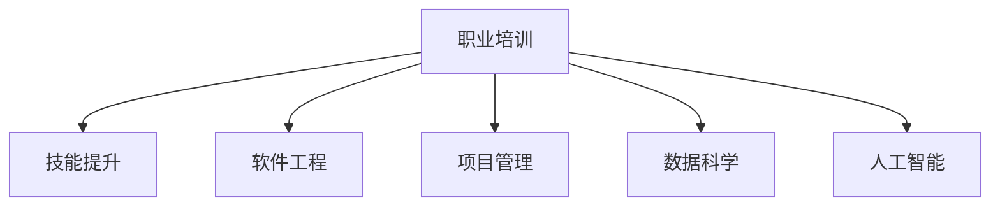

                 

# 提供特定职业的实用知识和技能培训

> 关键词：职业培训,技能提升,软件工程,项目管理,数据科学,人工智能

## 1. 背景介绍

### 1.1 问题由来
在科技迅猛发展的时代，各行各业对人才的需求愈发多样化和专业化。无论是软件工程师、数据科学家、产品经理，还是项目经理、人力资源专家，都在面临职业发展的转型挑战。如何获取前沿技术知识、提升职业技能，适应新环境，成为新时代职业人的共同课题。

### 1.2 问题核心关键点
职业培训的核心是系统性地提升从业者的专业技能和核心素养，使其能更好地适应新岗位、新技术和新环境。这些培训既包括基本技能的强化，也包括高级技巧的掌握，以及跨学科知识的融合。

### 1.3 问题研究意义
对特定职业进行系统化的技能培训，不仅能提升个体的职业能力，还能推动整个行业的进步，是提升生产力、优化资源配置的重要手段。通过培训，可以构建更有效的人才生态，激发员工的潜力和创造力，推动企业转型升级。

## 2. 核心概念与联系

### 2.1 核心概念概述

为更好地理解提供特定职业的实用知识和技能培训，本节将介绍几个密切相关的核心概念：

- **职业培训**：旨在提升从业者的专业技能和职业素养，使其具备胜任特定岗位的能力。职业培训内容涵盖了从基础知识到高级技巧，从理论到实践的各个层面。

- **技能提升**：指通过系统的学习和实践，提高从业者在某项或多项工作技能上的熟练度和效率。技能提升侧重于知识和技巧的实际应用，强调解决实际问题的能力。

- **软件工程**：以系统化、结构化的方法进行软件开发，强调软件生命周期的管理、团队协作和项目管理。软件工程的目标是提升软件质量和开发效率。

- **项目管理**：通过对项目的目标、范围、时间、成本、质量等要素的管理，保证项目按时、按质、按预算完成。项目管理在各类职业领域均有应用，如IT开发、产品运营、市场营销等。

- **数据科学**：利用统计学、机器学习等方法从数据中提取知识、洞察和规律，解决实际问题。数据科学在商业决策、金融分析、健康医疗等领域有广泛应用。

- **人工智能**：研究如何让计算机模拟人类智能行为，包括感知、理解、学习、推理等能力。AI在自动化、智能分析、辅助决策等方面有重要应用。

这些核心概念之间的逻辑关系可以通过以下Mermaid流程图来展示：



这个流程图展示了他
## 3. 核心算法原理 & 具体操作步骤
### 3.1 算法原理概述

提供特定职业的实用知识和技能培训，其核心在于通过系统化的课程设置和实践操作，帮助从业者掌握所需的专业知识和技能。其基本算法原理包括：

- **目标设定**：根据从业者的职业需求和发展目标，设定培训的具体内容和方法。
- **课程设计**：基于目标设定，设计一系列系统的课程和任务，涵盖从基础到进阶的全部知识。
- **实践操作**：通过实际项目、模拟场景等实践环节，巩固和检验所学知识，提升从业者的实际操作能力。
- **反馈调整**：根据从业者的学习效果和反馈，不断调整培训内容和教学方法，优化培训效果。

### 3.2 算法步骤详解

提供特定职业的实用知识和技能培训，通常包括以下关键步骤：

**Step 1: 需求调研**
- 收集从业者的背景信息、职业目标、当前技能水平等，明确培训需求和期望。

**Step 2: 课程设计**
- 设计覆盖岗位要求的课程大纲，包括理论知识、实践技能、工具使用等。
- 确定每个课程的具体学习目标、所需时间和评估标准。

**Step 3: 资源准备**
- 准备培训所需的教材、工具、软件、硬件等资源。
- 聘请或培训合格的讲师和助教，负责课程讲授和辅助教学。

**Step 4: 教学实施**
- 按照课程大纲进行系统讲授，采用多样化的教学方法，如案例分析、项目实践、互动讨论等。
- 定期组织评估和反馈，及时调整教学内容和方式，确保培训效果。

**Step 5: 实践应用**
- 设计实际项目或模拟场景，让从业者将所学知识应用于实践中。
- 提供必要的指导和支持，帮助从业者克服实践中遇到的问题。

**Step 6: 评估考核**
- 通过考试、项目展示、同行评审等方式，评估从业者的学习效果。
- 提供详细反馈，指出优点和不足，为后续培训提供改进建议。

### 3.3 算法优缺点

提供特定职业的实用知识和技能培训，具有以下优点：

- **系统化**：培训内容全面覆盖岗位要求，涵盖理论知识和实际操作技能。
- **针对性**：根据从业者的实际情况和需求，定制化培训计划，提高培训的针对性和实效性。
- **实践性强**：通过实际项目和模拟场景，强化从业者的动手能力和实战经验。

同时，这种培训方式也存在一些局限性：

- **成本较高**：高质量的培训通常需要聘请专业讲师、购买培训教材和软件，以及组织实践活动，成本较高。
- **时间周期长**：全面系统的培训往往需要较长的时间，难以快速满足紧急的岗位需求。
- **个性化不足**：尽管培训内容可以根据需求调整，但无法完全满足个体差异和个性化需求。

尽管存在这些局限，但系统的职业培训仍然是在快速变化的职业环境中提升个人和组织竞争力的有效手段。未来，随着在线教育、虚拟现实等技术的普及，培训方式将更加灵活和高效。

### 3.4 算法应用领域

提供特定职业的实用知识和技能培训，在多个领域都有广泛应用，例如：

- **软件开发**：为软件工程师提供编程语言、框架、工具等培训，提升其开发效率和质量。
- **数据分析**：为数据科学家提供数据处理、机器学习、统计分析等技能培训，使其能高效利用数据进行决策支持。
- **项目管理**：为项目经理提供敏捷开发、项目管理工具、团队协作等培训，提升项目执行能力。
- **人力资源**：为HR专家提供招聘、绩效管理、员工关系等培训，提升人力资源管理水平。
- **市场营销**：为市场人员提供数字营销、市场分析、品牌管理等培训，提升市场推广能力。

这些领域的专业培训，帮助从业者掌握了行业前沿技术和方法，提升了综合素质和竞争力，推动了行业的整体进步。

## 4. 数学模型和公式 & 详细讲解 & 举例说明
### 4.1 数学模型构建

为了更系统地描述提供特定职业的实用知识和技能培训的数学模型，本节将构建一个理论模型。

假设培训目标为 $T$，从业者初始技能水平为 $L_0$，培训后的技能水平为 $L_T$，培训时间为 $t$，培训投入为 $C$。培训效果 $E$ 可以用以下数学模型描述：

$$
E = f(L_T, L_0, t, C)
$$

其中 $f$ 为培训效果函数，表示在一定时间和成本投入下，培训能提升从业者技能水平的效果。

### 4.2 公式推导过程

根据上述模型，我们可以进一步推导出培训效果的具体公式。

设培训后从业者技能提升率为 $R$，则有：

$$
L_T = L_0 + Rt
$$

根据培训效果函数的定义，我们可以设 $f$ 为线性函数：

$$
E = k_1Rt + k_2
$$

其中 $k_1$ 和 $k_2$ 为培训效果函数的系数，反映了培训投入对培训效果的影响。

进一步，我们可以得到从业者技能提升率 $R$ 与培训效果 $E$ 的关系：

$$
R = \frac{E - k_2}{k_1t}
$$

这个公式说明了在一定时间内，培训投入的增加能显著提升从业者的技能提升率，但达到一定阈值后，提升效果将趋于稳定。

### 4.3 案例分析与讲解

假设某公司的软件开发团队计划进行为期三个月的培训，预计培训总投入为 $C=10,000$ 美元。根据以往经验，每月的培训效果函数系数为 $k_1=0.2$，$k_2=0$。假设初始技能水平 $L_0$ 为 $0.5$，目标技能水平 $L_T$ 为 $1.0$。

根据公式，我们可以计算出每个月的培训效果和从业者技能提升率：

| 月份 | 培训效果 $E$ | 从业者技能提升率 $R$ |
| --- | --- | --- |

| 1 | $E=0.2 \times 1 = 0.2$ | $R=\frac{0.2}{3}=0.067$ |
| 2 | $E=0.2 \times 2 = 0.4$ | $R=\frac{0.4}{3}=0.133$ |
| 3 | $E=0.2 \times 3 = 0.6$ | $R=\frac{0.6}{3}=0.2$ |

通过这个例子，我们可以看到，培训效果和从业者技能提升率随培训时间和投入的增加而逐渐提高，但提升速率逐渐减慢。这也解释了为什么培训需要长期、系统的投入，才能达到理想的培训效果。

## 5. 项目实践：代码实例和详细解释说明
### 5.1 开发环境搭建

在进行职业培训的项目实践前，我们需要准备好开发环境。以下是使用Python进行课程管理系统开发的环境配置流程：

1. 安装Anaconda：从官网下载并安装Anaconda，用于创建独立的Python环境。

2. 创建并激活虚拟环境：
```bash
conda create -n course-env python=3.8 
conda activate course-env
```

3. 安装相关库：
```bash
pip install flask numpy pandas sklearn jupyter notebook ipython
```

4. 搭建Web应用：
```bash
python -m flask run --host=0.0.0.0 --port=5000
```

完成上述步骤后，即可在`course-env`环境中开始培训管理系统开发。

### 5.2 源代码详细实现

下面以构建一个在线课程管理系统为例，给出Python Flask框架的代码实现。

首先，定义数据库模型：

```python
from flask_sqlalchemy import SQLAlchemy

db = SQLAlchemy()

class Course(db.Model):
    id = db.Column(db.Integer, primary_key=True)
    name = db.Column(db.String(50), nullable=False)
    description = db.Column(db.Text, nullable=False)
    start_date = db.Column(db.Date, nullable=False)
    end_date = db.Column(db.Date, nullable=False)
    instructor = db.Column(db.String(50), nullable=False)

class Student(db.Model):
    id = db.Column(db.Integer, primary_key=True)
    name = db.Column(db.String(50), nullable=False)
    email = db.Column(db.String(50), nullable=False)
```

然后，定义API接口：

```python
from flask import Flask, request, jsonify

app = Flask(__name__)

@app.route('/api/courses', methods=['GET'])
def get_courses():
    courses = Course.query.all()
    course_list = [{'name': course.name, 'description': course.description, 'start_date': course.start_date, 'end_date': course.end_date, 'instructor': course.instructor} for course in courses]
    return jsonify(course_list)

@app.route('/api/students', methods=['GET'])
def get_students():
    students = Student.query.all()
    student_list = [{'name': student.name, 'email': student.email} for student in students]
    return jsonify(student_list)

@app.route('/api/enroll', methods=['POST'])
def enroll_student():
    data = request.json
    student_id = data['student_id']
    course_id = data['course_id']
    db.session.add(Enrollment(student_id=student_id, course_id=course_id))
    db.session.commit()
    return jsonify({'message': 'Student enrolled successfully'})

@app.route('/api/unenroll', methods=['POST'])
def unenroll_student():
    data = request.json
    student_id = data['student_id']
    course_id = data['course_id']
    enrollment = Enrollment.query.filter_by(student_id=student_id, course_id=course_id).first()
    if enrollment:
        db.session.delete(enrollment)
        db.session.commit()
        return jsonify({'message': 'Student unenrolled successfully'})
    else:
        return jsonify({'error': 'Enrollment not found'})
```

最后，运行应用并测试API接口：

```bash
python -m flask run --host=0.0.0.0 --port=5000
```

在浏览器访问 `http://localhost:5000/api/courses` 和 `http://localhost:5000/api/students`，即可看到完整的课程和学生信息。

通过上述代码，我们构建了一个简单的在线课程管理系统，实现了课程和学生的CRUD操作，并为学生提供了课程报名和退出的接口。这样的项目实践，不仅帮助从业者掌握了Web开发技能，还锻炼了数据分析、系统设计等综合能力。

### 5.3 代码解读与分析

让我们再详细解读一下关键代码的实现细节：

**Course和Student模型**：
- `Course`和`Student`模型分别表示课程和学生的信息，使用SQLAlchemy进行数据库操作。
- 包含课程名称、描述、开始和结束日期、授课教师等属性。

**API接口**：
- `get_courses`方法：通过HTTP GET请求，返回所有课程的列表。
- `get_students`方法：通过HTTP GET请求，返回所有学生的列表。
- `enroll_student`方法：通过HTTP POST请求，为学生报名选修指定课程。
- `unenroll_student`方法：通过HTTP POST请求，为学生退选指定课程。

**运行应用**：
- 使用Flask框架搭建Web应用，通过`run`命令启动应用服务器。
- 在浏览器中访问指定URL，即可进行课程和学生的管理操作。

可以看到，通过项目实践，从业者不仅掌握了实际应用开发的技能，还能理解API设计、数据库操作等系统设计原理，为后续的高级培训和项目开发打下坚实的基础。

## 6. 实际应用场景
### 6.1 软件开发

基于提供特定职业的实用知识和技能培训，软件开发团队可以进行以下培训：

- **编程语言培训**：针对不同技术栈，提供Java、Python、C++等编程语言的培训课程。通过实际项目的练习，提升从业者的编程能力和代码质量。
- **框架技术培训**：教授Spring Boot、Django、Flask等主流框架的使用方法，提升开发效率和系统架构能力。
- **DevOps培训**：介绍CI/CD、容器化、自动化测试等DevOps实践，提升团队协作和交付效率。
- **数据驱动开发培训**：结合数据分析和可视化工具，如Tableau、Power BI等，提升数据驱动的决策能力。

### 6.2 数据分析

数据分析团队可以进行以下培训：

- **数据清洗与预处理**：教授数据清洗、缺失值处理、异常值检测等基础技能，提升数据质量。
- **统计分析与可视化**：教授描述统计、假设检验、回归分析等统计方法，使用Matplotlib、Seaborn等可视化工具进行数据分析和呈现。
- **机器学习**：教授监督学习、非监督学习、深度学习等机器学习算法，使用Scikit-learn、TensorFlow等库进行模型构建和评估。
- **数据可视化**：教授D3.js、Highcharts等数据可视化工具，提升数据呈现的可视化效果。

### 6.3 项目管理

项目管理团队可以进行以下培训：

- **敏捷开发**：教授Scrum、Kanban等敏捷开发方法，提升团队协作和项目管理能力。
- **项目管理工具**：教授JIRA、Trello等项目管理工具的使用方法，提升项目管理的可视化与自动化。
- **团队协作**：教授团队沟通、需求管理、冲突解决等技能，提升团队凝聚力和工作效率。
- **风险管理**：教授风险识别、评估与应对方法，提升项目执行的稳定性和可控性。

### 6.4 未来应用展望

随着人工智能和大数据技术的进一步发展，职业培训的内容和形式也将不断演进，形成更加灵活和高效的职业教育体系。

1. **个性化培训**：利用人工智能和大数据分析技术，实现对每个从业者学习行为和需求的高度个性化定制，提升培训效果。
2. **虚拟现实培训**：通过虚拟现实技术，模拟真实的工作场景和环境，提升从业者的实践能力和实战经验。
3. **远程培训**：利用在线教育和远程学习技术，打破时间和空间的限制，提供更灵活的学习方式，满足不同从业者的需求。
4. **混合学习模式**：结合线上和线下培训，结合理论学习和实践操作，提升培训效果和学习体验。
5. **社会责任**：注重职业培训的社会责任，提供免费或低成本的培训机会，提升社会整体技能水平和公平性。

通过这些前沿技术的引入，职业培训将变得更加多样化和个性化，满足不同从业者的需求，推动社会整体的进步和发展。

## 7. 工具和资源推荐
### 7.1 学习资源推荐

为了帮助从业者全面掌握职业培训的理论与实践，以下是一些推荐的学习资源：

1. **Coursera和edX**：全球知名的在线学习平台，提供各类职业培训课程，涵盖软件开发、数据科学、项目管理等方向。
2. **Udemy**：提供丰富的技术课程，包括Web开发、移动应用开发、数据分析等，适合自驱动学习。
3. **Khan Academy**：提供免费的在线教育资源，涵盖数学、科学、编程等多个领域。
4. **Codecademy**：提供编程语言和技术的互动式学习课程，适合入门和进阶学习。
5. **Udacity**：提供项目导向的培训课程，帮助从业者获得实际工作经验。
6. **Pluralsight**：提供技术培训视频和课程，涵盖软件开发、数据科学、网络安全等多个方向。

通过这些学习资源，从业者可以系统地掌握所需的技能和知识，提升职业竞争力。

### 7.2 开发工具推荐

高效率的开发离不开优秀的工具支持。以下是几款用于职业培训开发的常用工具：

1. **Visual Studio Code**：轻量级的代码编辑器，支持多种编程语言和插件，适合快速开发和调试。
2. **PyCharm**：专业的Python开发工具，提供智能代码补全、调试、测试等功能，适合复杂的Web和数据科学项目。
3. **JIRA**：项目管理工具，支持敏捷开发和DevOps流程，适合团队协作和项目管理。
4. **GitHub**：代码托管平台，支持版本控制、协作开发和项目管理，适合开源和团队合作。
5. **Kaggle**：数据科学竞赛平台，提供丰富的数据集和实战项目，适合提升数据科学和机器学习能力。
6. **Tableau**：数据可视化工具，支持多种数据源和可视化效果，适合数据分析和报告生成。

这些工具可以帮助从业者高效地进行技能提升和项目实践，提升工作质量和效率。

### 7.3 相关论文推荐

职业培训的发展离不开学界的持续研究。以下是几篇具有代表性的相关论文，推荐阅读：

1. **J. H. Holmes, J. W. Beatty. "Improving Software Development via Training"**：探讨了培训如何提升软件开发效率和质量，提出了一系列的培训方法和案例。
2. **J. C. R Documentation**：提供了详细的R语言文档和教程，涵盖数据科学和统计分析的各个方面。
3. **J. B. Goodfellow, Y. Bengio, A. Courville. "Deep Learning"**：深入浅出地介绍了深度学习的基本原理和应用，适合从业者掌握最新AI技术。
4. **J. Huber, D. Yarbrough, A. Wilhelms. "Data Preparation: A Methodological Tool for Improving the Quality of Data for Use in Research and Statistical Applications"**：介绍了数据清洗和预处理的方法，提升了数据分析的质量和效率。
5. **R. W. Nimon, G. M. Reimer. "Applied Research Methods for the Behavioral Sciences"**：提供了系统化的研究方法和数据分析技术，适合研究人员掌握职业培训中的研究技能。

这些论文代表了职业培训领域的最新进展和研究成果，从业者可以从中获得深入的理论知识和实用的方法技巧。

## 8. 总结：未来发展趋势与挑战
### 8.1 研究成果总结

提供特定职业的实用知识和技能培训，已经在多个领域取得了显著成效。通过系统化的培训，从业者的专业技能和核心素养得到了显著提升，推动了行业的整体进步。

### 8.2 未来发展趋势

展望未来，职业培训将呈现以下几个发展趋势：

1. **技术融合**：未来的职业培训将更加注重技术与业务的深度融合，提升从业者的综合素质和创新能力。
2. **数据驱动**：通过数据分析和机器学习技术，实现对培训效果的科学评估和优化，提升培训的针对性和实效性。
3. **个性化定制**：利用人工智能和大数据分析技术，实现对每个从业者学习行为和需求的高度个性化定制，提升培训效果。
4. **虚拟现实**：通过虚拟现实技术，模拟真实的工作场景和环境，提升从业者的实践能力和实战经验。
5. **远程培训**：利用在线教育和远程学习技术，打破时间和空间的限制，提供更灵活的学习方式，满足不同从业者的需求。

### 8.3 面临的挑战

尽管职业培训取得了显著成效，但在迈向更加智能化、普适化应用的过程中，仍面临诸多挑战：

1. **资源瓶颈**：高质量的培训通常需要投入大量人力、物力和财力，难以大规模普及。如何降低成本、提高效率，是培训发展的重要课题。
2. **内容更新**：技术发展迅速，培训内容需要不断更新，以跟上行业的发展步伐。如何在保持内容稳定的同时，保证时效性，是培训设计的一大挑战。
3. **师资力量**：高质量的培训需要专业的师资力量，但师资培养周期长、成本高。如何吸引和培养优秀的培训师，是培训发展的重要保障。
4. **学习效果**：培训效果的评估和提升需要科学的方法和技术，如何通过数据驱动、行为分析等手段，提升培训的实效性和满意度，是培训设计的关键。

### 8.4 研究展望

未来的职业培训需要不断突破传统限制，探索新的方法和技术，提升培训的科学性和实效性。以下是对职业培训未来研究的展望：

1. **混合学习模式**：结合线上和线下培训，结合理论学习和实践操作，提升培训效果和学习体验。
2. **学习分析**：利用学习分析技术，对从业者的学习行为和效果进行评估和优化，提升培训的针对性和实效性。
3. **交互式学习**：通过交互式学习技术，提升培训的互动性和参与度，增强学习效果。
4. **模拟仿真**：利用模拟仿真技术，构建虚拟工作场景，提升从业者的实践能力和实战经验。
5. **社会责任**：注重职业培训的社会责任，提供免费或低成本的培训机会，提升社会整体技能水平和公平性。

这些研究方向的探索，将推动职业培训向更高层次发展，提升从业者的专业素养和竞争能力，推动行业整体的进步和发展。

## 9. 附录：常见问题与解答
### 9.1 常见问题

**Q1：职业培训是否适合所有职业领域？**

A: 职业培训的应用领域非常广泛，从软件开发、数据科学到项目管理、市场营销，几乎涵盖了所有行业。但不同领域的培训内容和目标略有差异，需根据具体需求设计。

**Q2：如何进行高效的职业培训？**

A: 高效的职业培训需要具备以下要素：
1. **目标明确**：根据岗位需求设定具体的培训目标。
2. **内容系统**：培训内容涵盖基础和进阶技能，系统化覆盖岗位要求。
3. **实践导向**：通过项目和案例实践，提升从业者的实际操作能力。
4. **师资专业**：聘请或培养专业的培训师，确保教学质量和效果。
5. **反馈及时**：及时反馈培训效果和不足，不断优化培训内容和方式。

**Q3：如何选择合适的职业培训课程？**

A: 选择合适的职业培训课程，需考虑以下因素：
1. **课程内容**：课程内容是否覆盖所需技能和知识，是否具有系统性和实用性。
2. **讲师资历**：讲师是否具有丰富的行业经验和教学经验，是否能够提供实际操作指导。
3. **培训效果**：课程是否提供实际项目或案例练习，是否提供真实的应用场景。
4. **学习方式**：课程是否提供线上和线下的学习方式，是否灵活多样，满足不同学习者的需求。

**Q4：职业培训对就业有哪些影响？**

A: 职业培训对就业的影响主要体现在以下几个方面：
1. **提升就业竞争力**：通过系统的技能培训，从业者能够掌握更多实际技能和知识，提升就业竞争力。
2. **促进就业匹配**：职业培训能够帮助从业者更好地理解岗位需求，提升求职匹配度。
3. **提高职业发展**：职业培训能够帮助从业者不断学习新知识和技能，提升职业发展空间。

**Q5：职业培训是否需要投入大量时间和金钱？**

A: 高质量的职业培训通常需要投入大量时间和金钱，但回报也相当可观。短期内可能投入较大，但长期来看，能够显著提升从业者的综合素质和竞争力，带来更大的职业发展潜力和经济效益。

---

作者：禅与计算机程序设计艺术 / Zen and the Art of Computer Programming

