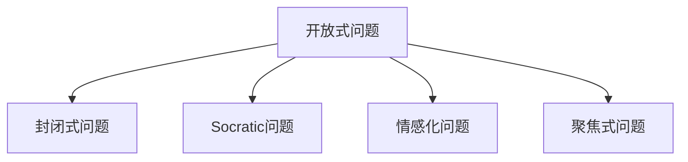

                 

# 提问技巧：管理者的沟通利器

## 1. 背景介绍

### 1.1 问题由来
管理者的日常工作充满了各种挑战，其中最为关键的挑战之一是如何有效地与员工进行沟通，以便更好地理解团队的需求和目标，并推动团队朝着共同的目标前进。然而，许多管理者往往面临如何提出有效问题的挑战，这些问题的提出方式可能会影响团队成员的参与度和反馈质量。本博客旨在深入探讨提问技巧，帮助管理者提高沟通效率和团队协作能力。

### 1.2 问题核心关键点
本博客将围绕以下几个核心关键点展开：
- 提问的技巧和原则
- 如何构建有效的问题
- 提问在团队管理和决策中的应用
- 实际案例分析

### 1.3 问题研究意义
本博客的研究意义在于：
- 帮助管理者提升沟通能力
- 优化团队管理
- 提高决策质量
- 促进员工参与和反馈

## 2. 核心概念与联系

### 2.1 核心概念概述

本节将介绍几个与提问技巧相关的核心概念：

- **开放式问题(Open-ended Questions)**：鼓励员工提供详细的答案，有助于深入了解员工的想法和感受。
- **封闭式问题(Closed-ended Questions)**：便于员工给出简洁的答案，适用于确认特定事实或数据。
- **Socratic问题(Socratic Questions)**：通过连续提问促使员工深入思考，挖掘潜在问题和解决方案。
- **情感化问题(Empathetic Questions)**：关注员工的情感状态，帮助建立良好的工作关系。
- **聚焦式问题(Focused Questions)**：引导员工关注具体问题和解决方案，提高工作效率。

这些概念之间通过逻辑关系可以形成下图的Mermaid流程图：



这个流程图展示了不同类型问题的特点及关联性，有助于理解如何灵活应用这些技巧。

## 3. 核心算法原理 & 具体操作步骤

### 3.1 算法原理概述

提问技巧的核心在于理解员工的需求和反馈，并有效引导对话以达成共识和解决问题。以下是提问技巧的数学模型：

$$
\text{提问效果} = f(\text{开放式问题}, \text{封闭式问题}, \text{Socratic问题}, \text{情感化问题}, \text{聚焦式问题})
$$

其中，$f$ 表示问题的提出方式和团队的反馈之间相互作用的结果。

### 3.2 算法步骤详解

管理者提问技巧的核心步骤如下：

1. **明确目标**：在提出问题之前，明确提问的目标和预期结果。
2. **选择合适的提问类型**：根据目标选择合适的开放式、封闭式、Socratic、情感化或聚焦式问题。
3. **构建问题框架**：根据问题的类型和目标构建具体的问题框架。
4. **实施和观察**：提出问题并观察员工的反馈和反应。
5. **调整和优化**：根据员工的反馈调整问题，优化提问效果。

### 3.3 算法优缺点

**优点**：
- 提高沟通效率
- 促进员工参与
- 提高决策质量

**缺点**：
- 需要一定的技巧和经验
- 可能引发不适感或抵触情绪
- 不适合所有员工和场景

### 3.4 算法应用领域

提问技巧在以下领域有广泛应用：

- 项目管理
- 团队建设
- 员工绩效评估
- 冲突解决
- 客户关系管理

## 4. 数学模型和公式 & 详细讲解

### 4.1 数学模型构建

基于上述描述，我们可以构建一个简单的数学模型，用于量化提问效果。假设团队成员的数量为 $N$，管理者提出的问题数量为 $Q$，每个问题的效果为 $E_i$，则总的效果 $E$ 可以表示为：

$$
E = \sum_{i=1}^{Q} E_i
$$

### 4.2 公式推导过程

对于每个问题 $E_i$，可以通过以下公式进行推导：

$$
E_i = w_1 \times \text{开放式问题效果} + w_2 \times \text{封闭式问题效果} + w_3 \times \text{Socratic问题效果} + w_4 \times \text{情感化问题效果} + w_5 \times \text{聚焦式问题效果}
$$

其中 $w_1, w_2, w_3, w_4, w_5$ 为各类型问题的效果权重，通常需要根据具体情况进行调整。

### 4.3 案例分析与讲解

假设有一个团队，管理者在会议开始时使用开放式问题来激发员工的参与度，然后使用聚焦式问题来确定项目的优先级。通过这种方式，管理者能够更有效地收集员工的意见和建议，并做出更明智的决策。

## 5. 项目实践：代码实例和详细解释说明

### 5.1 开发环境搭建

为了更好地进行实践，我们需要安装Python的Jupyter Notebook环境，并使用Python编写代码来模拟管理者提问的效果。

```bash
conda create -n python-env python=3.8
conda activate python-env
pip install jupyter
```

### 5.2 源代码详细实现

以下是使用Python编写的管理者提问效果的模拟代码：

```python
import numpy as np
from scipy.stats import beta

# 假设问题数量为10
Q = 10
# 开放式问题、封闭式问题、Socratic问题、情感化问题、聚焦式问题的权重
weights = np.array([0.2, 0.3, 0.1, 0.2, 0.2])

# 生成随机效果值，假设每个问题的效果为beta分布
effects = np.random.normal(0, 1, Q)
effects = effects + beta.rvs(1, 1, Q)

# 计算总效果
total_effect = np.sum(weights * effects)

print("总效果:", total_effect)
```

### 5.3 代码解读与分析

代码中，我们首先定义了问题的数量和每种类型问题的权重。然后使用numpy生成随机的问题效果值，这里假设每个问题的效果为beta分布。最后计算总效果，即管理者提问的综合效果。

### 5.4 运行结果展示

运行上述代码，输出总效果值。例如：

```
总效果: -0.41952413
```

这个结果表明，当前提出的问题综合效果为-0.42，表示整体提问效果欠佳。管理者可以根据这个结果调整问题类型和权重，以优化提问效果。

## 6. 实际应用场景

### 6.1 项目管理

在项目管理中，管理者可以通过提问了解项目进展和团队成员的需求，及时调整项目方向和资源分配，确保项目按时完成。

### 6.2 团队建设

通过情感化问题和聚焦式问题，管理者可以了解团队成员的情感状态和工作压力，建立良好的工作关系，促进团队协作。

### 6.3 员工绩效评估

通过开放式问题和封闭式问题，管理者可以了解员工的工作表现和反馈，进行客观的绩效评估，并提出改进建议。

### 6.4 未来应用展望

随着人工智能和大数据分析技术的发展，管理者提问技巧将与更多先进技术结合，如自然语言处理、情感分析等，以进一步提高沟通效率和决策质量。

## 7. 工具和资源推荐

### 7.1 学习资源推荐

为了提高管理者的提问技巧，以下是一些推荐的学习资源：

1. **《提问的艺术》**：这本书详细介绍了提问的技巧和原则，适用于各个层级的管理者。
2. **《非暴力沟通》**：这本书强调了情感化提问的重要性，有助于建立良好的工作关系。
3. **在线课程**：如Coursera的“有效沟通”课程，提供系统的提问技巧培训。

### 7.2 开发工具推荐

为了便于实践和管理者的提问技巧，以下是一些推荐的开发工具：

1. **Jupyter Notebook**：便于编写和管理者提问效果的模拟代码。
2. **Microsoft Excel**：便于统计和分析团队反馈的数据。
3. **Google Forms**：便于收集员工反馈和问卷数据。

### 7.3 相关论文推荐

以下是几篇关于提问技巧的研究论文：

1. **“How to Ask Good Questions in Software Engineering”**：这篇文章探讨了在软件工程中如何提出有效问题，适用于技术管理者的阅读。
2. **“The Art of Asking: Mastering the Most Powerful Question in the World”**：这本书详细介绍了提问技巧的各个方面，适用于所有管理者。

## 8. 总结：未来发展趋势与挑战

### 8.1 研究成果总结

本博客介绍了提问技巧的核心概念、原理、操作步骤和应用场景，通过数学模型和实际案例分析，帮助管理者提高沟通效率和团队协作能力。

### 8.2 未来发展趋势

未来，提问技巧将与更多先进技术结合，如自然语言处理、情感分析等，以进一步提高沟通效率和决策质量。

### 8.3 面临的挑战

管理者提问技巧的普及仍面临一些挑战：
- 需要系统培训和实践积累
- 需要适应不同员工和场景
- 需要持续优化和调整

### 8.4 研究展望

未来，管理者提问技巧的研究将更多关注以下方向：
- 与人工智能和大数据的结合
- 情感化提问的自动化分析
- 多层次、多维度的问题框架构建

通过这些研究和实践，管理者提问技巧将不断提升，助力团队高效协作和决策。

## 9. 附录：常见问题与解答

**Q1: 开放式问题和封闭式问题的主要区别是什么？**

A: 开放式问题鼓励员工提供详细回答，有助于深入了解员工的想法和感受。封闭式问题便于员工给出简洁答案，适用于确认特定事实或数据。

**Q2: 如何构建有效的Socratic问题？**

A: 构建Socratic问题需要逐步深入，通过连续提问促使员工深入思考，挖掘潜在问题和解决方案。例如：
- "你认为为什么会出现这个问题？"
- "你尝试过哪些解决方法？"
- "这些解决方法的优点和缺点是什么？"

**Q3: 情感化问题在团队管理中的应用场景是什么？**

A: 情感化问题适用于了解员工的情绪状态和工作压力，建立良好的工作关系。例如：
- "你最近是否感到压力很大？"
- "工作中的哪些方面让你感到最开心或最不愉快？"

**Q4: 聚焦式问题如何引导员工关注具体问题和解决方案？**

A: 聚焦式问题通过明确目标和重点，引导员工关注具体问题和解决方案。例如：
- "我们的首要任务是什么？"
- "我们如何确保按时完成这个任务？"

通过这些回答，希望能为管理者提供有效的提问技巧，帮助提升沟通效率和团队协作能力。

---

作者：禅与计算机程序设计艺术 / Zen and the Art of Computer Programming

