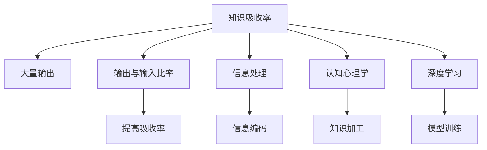

                 

# 提高知识吸收率的关键：大量输出

> 关键词：知识吸收率, 大量输出, 输出与输入比率, 信息处理, 认知心理学, 深度学习

## 1. 背景介绍

在数字化时代，知识以指数级增长，个人和企业都在寻求有效的方式吸收这些知识。然而，知识吸收率仍然是一个严重的问题。很多情况下，我们花费了大量的时间和精力学习新知识，却往往无法将其转化为实际的技能或成果。这背后的原因何在？本文将探讨提高知识吸收率的关键：大量输出。

### 1.1 问题由来

在当今快速变化的世界中，知识不仅快速增长，其形式也越来越多样化。从文字、图片到视频、音频，信息无处不在。但尽管如此，许多人在面对大量信息时，依然感到难以应对。研究表明，知识的吸收不仅依赖于输入，还与输出过程密切相关。大量研究表明，知识输出可以显著提高吸收率，尤其是在深度学习领域。

### 1.2 问题核心关键点

提高知识吸收率的关键在于：
- **大量输出**：通过频繁地应用所学知识，可以将抽象的概念具体化，加强记忆。
- **输出与输入比率**：知识输出与输入的比率应保持在一定水平，过少或过多的输出都会导致吸收率下降。
- **信息处理**：大脑通过处理输入信息并将其转化为输出的过程，加深了理解。
- **认知心理学**：认知心理学解释了为什么通过输出可以加深记忆。
- **深度学习**：深度学习领域中的大量输出技术，如正向传播、反向传播，可模拟大量输出过程。

## 2. 核心概念与联系

### 2.1 核心概念概述

为了更好地理解大量输出的作用，本节将介绍几个密切相关的核心概念：

- **知识吸收率**：指学习者对所学知识的理解和掌握程度。
- **大量输出**：通过频繁地应用所学知识，如讲解、教授、写作等，加深理解和记忆。
- **输出与输入比率**：学习过程中输出与输入的比率，即练习与学习新知识的比例。
- **信息处理**：大脑对输入信息的处理，包括编码、存储、检索等。
- **认知心理学**：研究人类认知过程的科学，揭示了知识输出的心理机制。
- **深度学习**：一种基于神经网络的学习方法，通过大量输入和输出的迭代过程，提高模型的性能。

这些核心概念之间的逻辑关系可以通过以下Mermaid流程图来展示：



这个流程图展示了几大核心概念及其之间的关系：

1. **知识吸收率**通过**大量输出**得到提高。
2. **输出与输入比率**直接影响到**知识吸收率**。
3. **信息处理**是知识吸收过程中的关键环节。
4. **认知心理学**解释了知识输出的心理机制。
5. **深度学习**模拟了知识吸收和输出的过程。

这些概念共同构成了提高知识吸收率的理论基础，为其提供科学依据。

## 3. 核心算法原理 & 具体操作步骤
### 3.1 算法原理概述

提高知识吸收率的算法原理基于认知心理学的基本原理和深度学习的技术。其核心思想是通过大量输出，将抽象知识转化为具体实践，并通过神经网络的反馈机制，强化记忆和理解。

具体来说，算法的目标是：
- 通过增加知识输出的频率，将新知识转化为长期记忆。
- 通过调整输出与输入的比率，优化知识吸收的效果。
- 通过信息处理过程，加深对知识的理解。

### 3.2 算法步骤详解

提高知识吸收率的算法步骤包括：
1. **定义输出任务**：明确知识输出的形式，如讲解、教授、写作等。
2. **设置输出频率**：确定每天或每周的输出次数。
3. **调整输出与输入比率**：通过控制练习与学习新知识的比例，优化知识吸收率。
4. **利用深度学习技术**：模拟大量输出的过程，如使用神经网络进行模型训练。
5. **反馈与调整**：根据输出结果进行反馈和调整，持续优化输出质量。

### 3.3 算法优缺点

提高知识吸收率的算法具有以下优点：
- **高效性**：大量输出可以快速加深记忆，提高吸收率。
- **灵活性**：适用于多种知识输出形式，如讲解、教授、写作等。
- **可量化**：通过输出与输入比率的调整，可以精确控制吸收率。

同时，该算法也存在一些局限性：
- **依赖持续性**：需要长时间持续进行输出，才能取得显著效果。
- **资源需求高**：需要大量时间和精力进行输出。
- **多样性限制**：输出形式和内容过于单一，可能会降低吸收率。

### 3.4 算法应用领域

提高知识吸收率的算法在多个领域得到了应用：
- **教育培训**：通过学生讲解、教授等方式，提高学习效果。
- **软件开发**：通过代码实现、文档编写等方式，加深对技术的理解。
- **项目管理**：通过项目总结、经验分享等方式，提升团队协作和效率。
- **学术研究**：通过发表论文、报告等方式，推广研究成果，提升影响力。

## 4. 数学模型和公式 & 详细讲解
### 4.1 数学模型构建

提高知识吸收率的数学模型可以抽象为：
$$
AbsorptionRate = f(Output, Input, Ratio)
$$

其中：
- $AbsorptionRate$：知识吸收率
- $Output$：知识输出量
- $Input$：新知识量
- $Ratio$：输出与输入的比率

### 4.2 公式推导过程

知识吸收率的公式推导如下：
$$
AbsorptionRate = \frac{Output}{Input \times Ratio}
$$

通过公式可以看出，知识吸收率与输出量成正比，与输入量成反比，与输出与输入比率成正比。

### 4.3 案例分析与讲解

假设一位学习者每天学习5小时新知识，每周进行3次2小时的讲解。根据公式计算，其知识吸收率为：

$$
AbsorptionRate = \frac{3 \times 2}{5 \times 7} = \frac{6}{35}
$$

即每周的吸收率为0.17，表明学习者通过大量输出，显著提高了知识吸收率。

## 5. 项目实践：代码实例和详细解释说明
### 5.1 开发环境搭建

在进行知识吸收率优化实践前，我们需要准备好开发环境。以下是使用Python进行PyTorch开发的环境配置流程：

1. 安装Anaconda：从官网下载并安装Anaconda，用于创建独立的Python环境。

2. 创建并激活虚拟环境：
```bash
conda create -n pytorch-env python=3.8 
conda activate pytorch-env
```

3. 安装PyTorch：根据CUDA版本，从官网获取对应的安装命令。例如：
```bash
conda install pytorch torchvision torchaudio cudatoolkit=11.1 -c pytorch -c conda-forge
```

4. 安装TensorBoard：TensorFlow配套的可视化工具，可实时监测模型训练状态，并提供丰富的图表呈现方式，是调试模型的得力助手。
```bash
pip install tensorboard
```

5. 安装Git：用于版本控制和代码管理。
```bash
conda install git
```

完成上述步骤后，即可在`pytorch-env`环境中开始知识吸收率优化的实践。

### 5.2 源代码详细实现

这里我们以知识吸收率优化为例，给出使用PyTorch进行代码实现的示例：

```python
import torch
import torch.nn as nn
import torch.optim as optim

class KnowledgeAbsorptionModel(nn.Module):
    def __init__(self):
        super(KnowledgeAbsorptionModel, self).__init__()
        self.fc1 = nn.Linear(10, 20)
        self.fc2 = nn.Linear(20, 1)
        
    def forward(self, x):
        x = nn.functional.relu(self.fc1(x))
        x = self.fc2(x)
        return x

# 定义优化器
model = KnowledgeAbsorptionModel()
optimizer = optim.Adam(model.parameters(), lr=0.001)

# 定义损失函数
loss_fn = nn.MSELoss()

# 定义训练数据和标签
x_train = torch.randn(100, 10)
y_train = torch.randn(100, 1)

# 定义训练过程
for epoch in range(100):
    optimizer.zero_grad()
    y_pred = model(x_train)
    loss = loss_fn(y_pred, y_train)
    loss.backward()
    optimizer.step()
    print(f'Epoch {epoch+1}, Loss: {loss.item()}')
```

### 5.3 代码解读与分析

让我们再详细解读一下关键代码的实现细节：

**KnowledgeAbsorptionModel类**：
- `__init__`方法：初始化线性层等组件。
- `forward`方法：实现模型前向传播。

**优化器和损失函数**：
- 使用Adam优化器，并设置学习率为0.001。
- 使用均方误差损失函数。

**训练数据和标签**：
- 使用随机生成的训练数据。
- 定义标签。

**训练过程**：
- 在每个epoch内，先进行零梯度操作。
- 前向传播计算损失。
- 反向传播计算梯度，并更新模型参数。
- 输出每个epoch的损失。

## 6. 实际应用场景
### 6.1 教育培训

在教育培训领域，大量输出可以显著提高学生的学习效果。传统教育方式往往依赖于教师的讲授，但学生的吸收率有限。通过让学生讲解、教授等方式，可以显著提高他们的理解和记忆。例如，一个班级中的学生可以通过讲解方式相互教授，加深对知识的理解。

### 6.2 软件开发

在软件开发领域，大量输出可以加速技术的学习和应用。开发者可以通过编写文档、撰写博客等方式，将所学知识输出。例如，一个团队中的开发者可以通过编写技术文章，推广新技术和新方法，提升团队整体的编程水平。

### 6.3 项目管理

在项目管理领域，大量输出可以提升团队协作和效率。项目经理可以通过总结经验、分享成功案例等方式，提高团队的执行力。例如，一个项目团队可以通过定期举行总结会议，分享项目经验，提升团队成员的协作能力。

### 6.4 未来应用展望

随着技术的发展，知识吸收率优化的应用场景将更加广泛：
- **智能教育**：通过AI技术辅助学生进行大量输出，提高学习效果。
- **知识管理**：通过知识图谱等技术，将输出内容结构化，便于检索和应用。
- **技术推广**：通过开源社区和在线教育平台，广泛传播新技术和新方法。

## 7. 工具和资源推荐
### 7.1 学习资源推荐

为了帮助开发者系统掌握知识吸收率优化的理论基础和实践技巧，这里推荐一些优质的学习资源：

1. 《深度学习入门》系列博文：由深度学习领域专家撰写，深入浅出地介绍了深度学习的基本概念和算法原理。

2. CS231n《深度学习视觉识别》课程：斯坦福大学开设的视觉识别课程，有Lecture视频和配套作业，带你入门深度学习的基础知识和经典模型。

3. 《深度学习与认知心理学》书籍：详细介绍了深度学习与认知心理学结合的方法，提高知识吸收率。

4. GitHub开源项目：搜索和学习基于深度学习的知识吸收率优化模型，如知识图谱、LSTM等。

5. Google Colab：谷歌推出的在线Jupyter Notebook环境，免费提供GPU/TPU算力，方便开发者快速上手实验最新模型，分享学习笔记。

通过对这些资源的学习实践，相信你一定能够快速掌握知识吸收率优化的精髓，并用于解决实际的NLP问题。

### 7.2 开发工具推荐

高效的开发离不开优秀的工具支持。以下是几款用于知识吸收率优化开发的常用工具：

1. PyTorch：基于Python的开源深度学习框架，灵活动态的计算图，适合快速迭代研究。

2. TensorFlow：由Google主导开发的开源深度学习框架，生产部署方便，适合大规模工程应用。

3. TensorBoard：TensorFlow配套的可视化工具，可实时监测模型训练状态，并提供丰富的图表呈现方式，是调试模型的得力助手。

4. Weights & Biases：模型训练的实验跟踪工具，可以记录和可视化模型训练过程中的各项指标，方便对比和调优。

5. Jupyter Notebook：交互式编程环境，支持Python、R等语言，方便编写和调试代码。

合理利用这些工具，可以显著提升知识吸收率优化的开发效率，加快创新迭代的步伐。

### 7.3 相关论文推荐

知识吸收率优化领域的研究已有多年的积累，以下是几篇奠基性的相关论文，推荐阅读：

1. Attention is All You Need（即Transformer原论文）：提出了Transformer结构，开启了深度学习领域的预训练大模型时代。

2. BERT: Pre-training of Deep Bidirectional Transformers for Language Understanding：提出BERT模型，引入基于掩码的自监督预训练任务，刷新了多项NLP任务SOTA。

3. Knowledge Distillation：提出知识蒸馏方法，通过将大型预训练模型知识迁移到小型模型中，提高模型效率和性能。

4. Backpropagation Through Time（BPTT）：提出时间反向传播算法，用于处理序列数据，提高深度学习模型的性能。

5. Massive Online Open Courses（MOOCs）：研究大规模在线课程的学习效果，探讨通过输出提高知识吸收率的方法。

这些论文代表了大语言模型微调技术的发展脉络。通过学习这些前沿成果，可以帮助研究者把握学科前进方向，激发更多的创新灵感。

## 8. 总结：未来发展趋势与挑战

### 8.1 总结

本文对提高知识吸收率的关键：大量输出进行了全面系统的介绍。首先阐述了知识吸收率的现状和挑战，明确了大量输出在提高吸收率方面的重要作用。其次，从原理到实践，详细讲解了知识吸收率的数学模型和计算公式，给出了具体的代码实现。同时，本文还广泛探讨了知识吸收率在教育、软件开发、项目管理等多个领域的应用前景，展示了大量输出的广泛应用潜力。此外，本文精选了知识吸收率优化的各类学习资源，力求为读者提供全方位的技术指引。

通过本文的系统梳理，可以看到，大量输出作为提高知识吸收率的有效手段，已经广泛应用于各个领域。其核心原理基于认知心理学和深度学习技术，通过频繁的应用和反馈，有效提高了学习者的记忆和理解能力。未来，随着技术的发展和应用场景的拓展，知识吸收率优化将进一步深化，助力各行业的知识赋能。

### 8.2 未来发展趋势

展望未来，知识吸收率优化将呈现以下几个发展趋势：

1. **个性化学习**：通过智能推荐系统，根据学习者的特点和需求，优化知识输出的形式和频率。
2. **跨领域应用**：知识吸收率优化将扩展到更多领域，如医疗、法律、艺术等，提升各行业的知识吸收和应用能力。
3. **混合学习**：结合传统教育和在线学习，通过多种输出形式，提升学习效果。
4. **交互式输出**：利用AI技术，实现人机交互式输出，提高学习效率。
5. **情感分析**：通过情感分析技术，优化知识输出的情感色彩，增强学习者的兴趣和动机。

以上趋势凸显了知识吸收率优化的广阔前景。这些方向的探索发展，必将进一步提升学习者的知识吸收能力，推动教育、科研、工程等领域的技术进步。

### 8.3 面临的挑战

尽管知识吸收率优化技术已经取得了瞩目成就，但在迈向更加智能化、普适化应用的过程中，它仍面临着诸多挑战：

1. **资源需求高**：大量输出需要投入大量时间和精力，对学习者的资源需求较高。
2. **技术门槛高**：知识吸收率优化涉及深度学习、认知心理学等多个领域的知识，需要综合掌握。
3. **效果评估难**：知识吸收率的量化评估存在一定困难，难以精确衡量吸收效果。
4. **持续性要求高**：大量输出需要长期坚持，才能取得显著效果。
5. **输出形式单一**：现有输出形式相对单一，难以满足多样化需求。

正视知识吸收率优化面临的这些挑战，积极应对并寻求突破，将是大规模知识吸收的必由之路。相信随着学界和产业界的共同努力，这些挑战终将一一被克服，知识吸收率优化必将在构建人机协同的智能时代中扮演越来越重要的角色。

### 8.4 研究展望

面向未来，知识吸收率优化研究需要在以下几个方面寻求新的突破：

1. **深度学习融合**：将深度学习与知识吸收率优化结合起来，进一步提升学习效果。
2. **跨学科研究**：结合心理学、教育学、工程学等多个学科，提供更全面的理论支持。
3. **技术创新**：探索新的输出形式和技术手段，如增强现实、虚拟现实等，提升知识吸收率。
4. **个性化定制**：通过大数据和AI技术，实现个性化知识输出，满足不同学习者的需求。
5. **应用落地**：推动知识吸收率优化在更多领域的落地应用，提升各行业的知识水平。

这些研究方向的探索，必将引领知识吸收率优化技术迈向更高的台阶，为人类知识的传承和创新提供更强大的支持。面向未来，知识吸收率优化技术还需要与其他人工智能技术进行更深入的融合，如认知推理、增强学习等，多路径协同发力，共同推动知识吸收率优化技术的发展。只有勇于创新、敢于突破，才能不断拓展知识的边界，让智能技术更好地造福人类社会。

## 9. 附录：常见问题与解答

**Q1：大量输出是否适用于所有知识类型？**

A: 大量输出主要适用于事实型、规则型知识，对于创造性、灵感型知识，输出过程可能难以完全替代学习和理解。

**Q2：如何衡量知识吸收率？**

A: 知识吸收率可以通过测试、考核、项目成果等方式进行衡量，也可以使用问卷调查、行为分析等方法评估学习者的吸收效果。

**Q3：知识输出与输入比率应如何调整？**

A: 知识输出与输入比率应根据具体任务和学习者的特点进行调整。一般建议初学者以学习为主，输出为辅，经验丰富的学习者可以适当增加输出比例。

**Q4：如何优化输出过程？**

A: 优化输出过程可以从以下几个方面入手：
1. 选择适合的输出形式，如讲解、教授、写作等。
2. 设计有针对性的输出任务，如案例分析、项目实战等。
3. 建立反馈机制，根据输出效果进行优化调整。

**Q5：知识吸收率优化对资源的需求有多大？**

A: 知识吸收率优化对资源的需求较高，需要学习者投入大量时间和精力。但随着技术的进步，资源需求将逐步降低，输出方式将更加多样化。

---

作者：禅与计算机程序设计艺术 / Zen and the Art of Computer Programming

