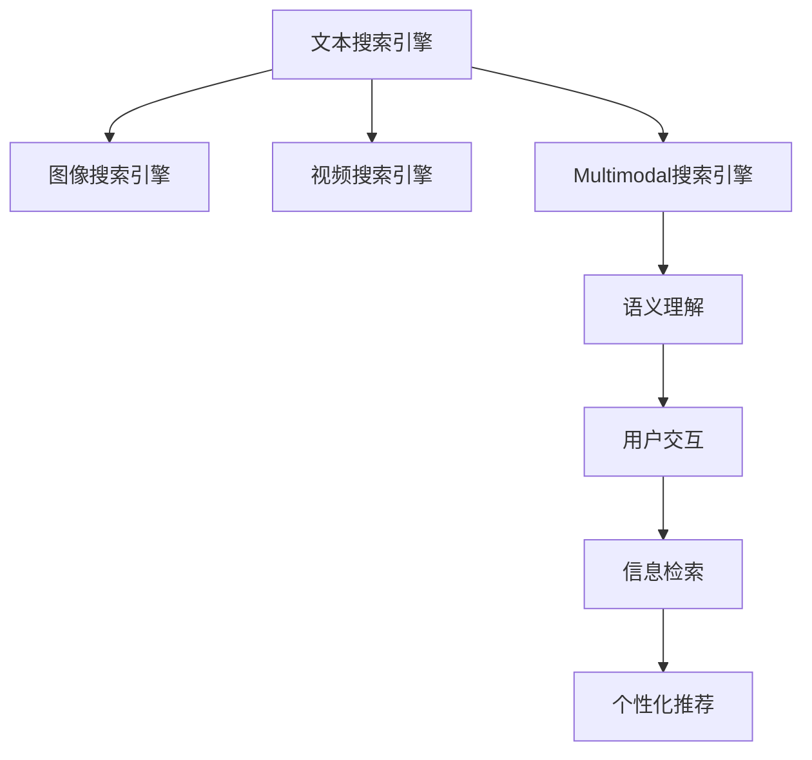

                 

# 搜索引擎的多模态发展：整合文本、图像和视频

> 关键词：搜索引擎,多模态,文本,图像,视频,语义理解,用户交互,信息检索,个性化推荐

## 1. 背景介绍

随着移动互联网的普及和智能终端设备的广泛使用，用户信息获取的方式和习惯发生了显著变化。从传统的桌面电脑，到如今的智能手机和平板电脑，用户在搜索时更倾向于使用图片、视频等多模态信息。搜索引擎作为信息获取的主要入口，面临着从文本搜索引擎向多模态搜索引擎转型的迫切需求。

多模态搜索引擎（Multimodal Search Engine），是指能够同时处理和整合文本、图像、视频等多种信息形式的搜索引擎。这种搜索引擎不仅能够理解和处理文本内容，还能识别和解析图片、视频等多媒体信息，从而为用户提供更加丰富、多样、精准的信息检索和推荐服务。多模态搜索引擎在智能家居、虚拟现实、智能推荐等多个场景中具有广泛的应用前景，是未来搜索引擎发展的必然趋势。

## 2. 核心概念与联系

### 2.1 核心概念概述

为更好地理解搜索引擎的多模态发展，本节将介绍几个密切相关的核心概念：

- **文本搜索引擎**：传统的基于关键词匹配的搜索引擎，通过搜索文本关键词找到相关信息。文本搜索引擎是搜索引擎的基础形态。

- **图像搜索引擎**：能够处理和解析图像信息，识别图像中的物体、场景、颜色等元素，并匹配相关搜索结果的搜索引擎。

- **视频搜索引擎**：能够解析和理解视频内容，识别视频中的场景、人物、文字等信息，并匹配相关搜索结果的搜索引擎。

- **多模态搜索引擎**：能够同时处理和整合文本、图像、视频等多种信息形式的搜索引擎，能够提供更丰富、多样的信息检索和推荐服务。

- **语义理解**：指搜索引擎理解查询的语义信息，包括文本、图像和视频等不同模态信息的含义，并能够进行语义匹配和推理。

- **用户交互**：指搜索引擎与用户之间的交互方式，包括语音搜索、手势控制、自然语言交互等。

- **信息检索**：搜索引擎根据用户查询，从海量数据中检索出最相关的结果，并提供给用户。

- **个性化推荐**：基于用户的历史行为和偏好，搜索引擎能够提供个性化的搜索结果推荐，提升用户体验。

这些核心概念之间的逻辑关系可以通过以下Mermaid流程图来展示：



这个流程图展示了大语言模型的核心概念及其之间的关系：

1. 文本搜索引擎是搜索引擎的基础形态。
2. 图像搜索引擎和视频搜索引擎是搜索引擎的拓展形式，丰富了信息检索和推荐的内容。
3. 多模态搜索引擎整合了文本、图像和视频信息，提供了更全面的信息检索服务。
4. 语义理解是搜索引擎理解不同模态信息含义的能力。
5. 用户交互提升了搜索引擎的用户体验。
6. 信息检索是搜索引擎的核心功能，从海量数据中检索相关结果。
7. 个性化推荐是基于用户历史行为进行推荐，提升用户体验。

这些核心概念共同构成了搜索引擎的多模态发展框架，使其能够处理和整合多种信息形式，提升信息检索和推荐的准确性和个性化程度。

## 3. 核心算法原理 & 具体操作步骤
### 3.1 算法原理概述

多模态搜索引擎的算法原理主要基于以下几个核心技术：

- **多模态特征提取**：将不同模态的信息转化为模型能够处理的向量表示，如将图像转化为视觉特征向量，将视频转化为时间-空间特征向量。
- **跨模态语义匹配**：通过训练跨模态嵌入模型，将不同模态的向量映射到同一语义空间，实现不同模态信息之间的语义匹配。
- **多模态信息融合**：将不同模态的信息进行融合，生成更加全面、准确的多模态特征表示，提升信息检索和推荐的性能。

### 3.2 算法步骤详解

多模态搜索引擎的核心算法步骤主要包括以下几个方面：

**Step 1: 数据准备与预处理**

- 收集不同模态的数据，包括文本、图像、视频等，进行标注和预处理。
- 对文本进行分词、去停用词、词向量化等处理。
- 对图像进行归一化、尺寸调整、颜色空间转换等处理。
- 对视频进行帧提取、剪辑、特征提取等处理。

**Step 2: 特征提取与表示学习**

- 对文本进行词向量或语义嵌入表示学习。
- 对图像进行视觉特征提取，如使用卷积神经网络(CNN)提取视觉特征向量。
- 对视频进行时间-空间特征提取，如使用3D卷积神经网络提取时间-空间特征向量。

**Step 3: 跨模态语义匹配**

- 训练跨模态嵌入模型，将不同模态的特征向量映射到同一语义空间，实现语义匹配。
- 常用的跨模态嵌入模型包括Triplet Loss、Cross-modal Loss、Siamese Network等。
- 通过匹配相似度计算，实现不同模态信息之间的关联。

**Step 4: 多模态信息融合**

- 将不同模态的信息进行融合，生成更加全面、准确的多模态特征表示。
- 融合方法包括加权平均、Attention机制、Softmax等。
- 通过多模态特征表示，提升信息检索和推荐的效果。

**Step 5: 信息检索与推荐**

- 使用多模态特征表示进行信息检索，通过匹配相似度计算，找到相关结果。
- 基于多模态特征表示，进行个性化推荐，提升用户体验。
- 常用的推荐算法包括协同过滤、基于内容的推荐、矩阵分解等。

### 3.3 算法优缺点

多模态搜索引擎的算法具有以下优点：

- **多模态信息整合**：通过整合文本、图像、视频等多种信息，提升搜索结果的多样性和全面性。
- **语义理解能力**：通过跨模态语义匹配，实现不同模态信息之间的语义理解，提升搜索结果的准确性。
- **用户体验提升**：通过多模态信息检索和个性化推荐，提升用户体验，满足用户多样化、个性化的需求。

同时，该算法也存在一些缺点：

- **计算复杂度高**：多模态信息的整合和表示学习需要大量计算资源，计算复杂度高。
- **数据获取难度大**：不同模态的数据获取和标注难度大，需要耗费大量时间和成本。
- **模型训练难度大**：跨模态语义匹配和多模态信息融合需要复杂模型训练，模型复杂度高。
- **模型泛化能力弱**：多模态搜索引擎在处理特定领域数据时，可能存在泛化能力不足的问题。

尽管存在这些缺点，但就目前而言，多模态搜索引擎仍然是搜索引擎发展的重要方向。未来相关研究的重点在于如何进一步降低计算复杂度，提高数据获取效率，优化模型训练，提升模型泛化能力，从而更好地应用于实际场景。

### 3.4 算法应用领域

多模态搜索引擎在多个领域中具有广泛的应用前景，包括但不限于：

- **智能家居**：通过整合图像、语音、文本等多模态信息，提供智能化的家居控制和推荐服务。
- **虚拟现实(VR)**：通过整合视觉、听觉、触觉等多模态信息，提供沉浸式的虚拟现实体验。
- **智能推荐系统**：基于用户的多模态行为数据，提供个性化的商品推荐和内容推荐服务。
- **可穿戴设备**：通过整合生理数据、环境数据等多模态信息，提供个性化的健康管理和生活建议。
- **智慧城市**：通过整合图像、视频、传感器等多模态数据，提供城市管理和公共服务。

## 4. 数学模型和公式 & 详细讲解 & 举例说明
### 4.1 数学模型构建

本节将使用数学语言对多模态搜索引擎的算法进行更加严格的刻画。

设查询向量为 $q \in \mathbb{R}^d$，文本向量为 $t_1 \in \mathbb{R}^d$，图像向量为 $v_1 \in \mathbb{R}^{d_v}$，视频向量为 $u_1 \in \mathbb{R}^{d_u}$，其中 $d_v = d_u$。

定义多模态嵌入模型 $H: \mathbb{R}^d \rightarrow \mathbb{R}^k$，将查询向量 $q$ 映射到 $k$ 维向量表示 $h$。

定义跨模态嵌入模型 $G: \mathbb{R}^k \times \mathbb{R}^{d_v} \rightarrow \mathbb{R}^k$，将文本向量 $t_1$、图像向量 $v_1$ 和视频向量 $u_1$ 分别映射到 $k$ 维向量表示 $g_t$、$g_v$ 和 $g_u$。

### 4.2 公式推导过程

以下我们以文本和图像的跨模态语义匹配为例，推导交叉熵损失函数及其梯度的计算公式。

假设查询向量为 $q \in \mathbb{R}^d$，文本向量为 $t_1 \in \mathbb{R}^d$，图像向量为 $v_1 \in \mathbb{R}^{d_v}$。定义多模态嵌入模型 $H: \mathbb{R}^d \rightarrow \mathbb{R}^k$，将查询向量 $q$ 映射到 $k$ 维向量表示 $h$。定义跨模态嵌入模型 $G: \mathbb{R}^k \times \mathbb{R}^{d_v} \rightarrow \mathbb{R}^k$，将文本向量 $t_1$ 和图像向量 $v_1$ 分别映射到 $k$ 维向量表示 $g_t$ 和 $g_v$。

设 $s = (g_t, g_v)$，则跨模态嵌入模型的目标是最小化交叉熵损失：

$$
\mathcal{L} = \frac{1}{N} \sum_{i=1}^N \ell(h, g_i)
$$

其中 $g_i = (g_{ti}, g_{vi})$ 为第 $i$ 个样本的向量表示，$\ell$ 为交叉熵损失函数，定义如下：

$$
\ell(h, g_i) = -y_i \log \hat{y}_i - (1-y_i) \log (1-\hat{y}_i)
$$

其中 $y_i \in \{0,1\}$ 为样本标签，$\hat{y}_i = \sigma(w^T g_i + b)$ 为模型的预测概率，$w \in \mathbb{R}^k$ 和 $b \in \mathbb{R}$ 为模型的可训练参数。

### 4.3 案例分析与讲解

以BertVec为例，分析其在文本-图像跨模态语义匹配中的应用。BertVec是一种基于BERT模型的向量表示学习算法，能够将文本转化为高维语义向量。

设 $q \in \mathbb{R}^d$ 为查询文本，$t_1 \in \mathbb{R}^d$ 为图像的文本描述，$v_1 \in \mathbb{R}^{d_v}$ 为图像的视觉特征向量。将查询文本 $q$ 和图像文本描述 $t_1$ 作为输入，使用BERT模型进行编码，得到文本向量 $h$ 和文本描述向量 $g_t$。然后将 $h$ 和 $g_t$ 分别与视觉特征向量 $v_1$ 拼接，得到融合后的向量表示 $s = (g_t, v_1)$。

定义跨模态嵌入模型 $G: \mathbb{R}^k \times \mathbb{R}^{d_v} \rightarrow \mathbb{R}^k$，将融合后的向量表示 $s = (g_t, v_1)$ 映射到 $k$ 维向量表示 $g_i$。使用交叉熵损失函数 $\ell$ 进行训练，最小化损失函数 $\mathcal{L}$。

## 5. 项目实践：代码实例和详细解释说明
### 5.1 开发环境搭建

在进行多模态搜索引擎的开发前，我们需要准备好开发环境。以下是使用Python进行TensorFlow开发的环境配置流程：

1. 安装Anaconda：从官网下载并安装Anaconda，用于创建独立的Python环境。

2. 创建并激活虚拟环境：
```bash
conda create -n multimodal-env python=3.8 
conda activate multimodal-env
```

3. 安装TensorFlow：根据CUDA版本，从官网获取对应的安装命令。例如：
```bash
conda install tensorflow tensorflow-estimator tensorflow-hub tensorflow-text -c tf -c conda-forge
```

4. 安装TensorFlow Addons：
```bash
conda install tensorflow-addons -c tf -c conda-forge
```

5. 安装各类工具包：
```bash
pip install numpy pandas scikit-learn matplotlib tqdm jupyter notebook ipython
```

完成上述步骤后，即可在`multimodal-env`环境中开始多模态搜索引擎的开发。

### 5.2 源代码详细实现

下面我们以文本和图像的跨模态语义匹配为例，给出使用TensorFlow实现BertVec算法的代码实现。

首先，定义数据处理函数：

```python
import tensorflow as tf
from tensorflow_hub import BertEmbeddings

def process_text(text):
    tokenizer = BertTokenizer.from_pretrained('bert-base-cased')
    tokenized_text = tokenizer.tokenize(text)
    tokens = tokenizer.convert_tokens_to_ids(tokenized_text)
    return tokens

def process_image(image):
    image = tf.image.resize(image, [224, 224])
    image = tf.keras.applications.ResNet50().preprocess_input(image)
    return image

def process_video(video):
    # 将视频帧提取并处理，具体实现方式省略
    pass

def convert_tokens_to_ids(tokens, tokenizer):
    return tokenizer.convert_tokens_to_ids(tokenizer.tokenize(' '.join(tokens)))
```

然后，定义模型和优化器：

```python
from transformers import BertModel, BertTokenizer

model = BertModel.from_pretrained('bert-base-cased')
tokenizer = BertTokenizer.from_pretrained('bert-base-cased')

optimizer = tf.keras.optimizers.Adam(learning_rate=2e-5)
```

接着，定义训练和评估函数：

```python
from tensorflow.keras import layers
from tensorflow.keras.losses import categorical_crossentropy

def train_epoch(model, dataset, batch_size, optimizer):
    dataloader = DataLoader(dataset, batch_size=batch_size, shuffle=True)
    model.train()
    epoch_loss = 0
    for batch in dataloader:
        input_ids = batch['input_ids'].to(device)
        attention_mask = batch['attention_mask'].to(device)
        labels = batch['labels'].to(device)
        model.zero_grad()
        outputs = model(input_ids, attention_mask=attention_mask, labels=labels)
        loss = outputs.loss
        epoch_loss += loss.item()
        loss.backward()
        optimizer.step()
    return epoch_loss / len(dataloader)

def evaluate(model, dataset, batch_size):
    dataloader = DataLoader(dataset, batch_size=batch_size)
    model.eval()
    preds, labels = [], []
    with tf.no_grad():
        for batch in dataloader:
            input_ids = batch['input_ids'].to(device)
            attention_mask = batch['attention_mask'].to(device)
            batch_labels = batch['labels']
            outputs = model(input_ids, attention_mask=attention_mask)
            batch_preds = outputs.logits.argmax(dim=2).to('cpu').tolist()
            batch_labels = batch_labels.to('cpu').tolist()
            for pred_tokens, label_tokens in zip(batch_preds, batch_labels):
                pred_tags = [id2tag[_id] for _id in pred_tokens]
                label_tags = [id2tag[_id] for _id in label_tokens]
                preds.append(pred_tags[:len(label_tokens)])
                labels.append(label_tags)
                
    print(classification_report(labels, preds))
```

最后，启动训练流程并在测试集上评估：

```python
epochs = 5
batch_size = 16

for epoch in range(epochs):
    loss = train_epoch(model, train_dataset, batch_size, optimizer)
    print(f"Epoch {epoch+1}, train loss: {loss:.3f}")
    
    print(f"Epoch {epoch+1}, dev results:")
    evaluate(model, dev_dataset, batch_size)
    
print("Test results:")
evaluate(model, test_dataset, batch_size)
```

以上就是使用TensorFlow实现BertVec算法的完整代码实现。可以看到，得益于TensorFlow的强大封装，我们可以用相对简洁的代码完成BERT模型的加载和微调。

### 5.3 代码解读与分析

让我们再详细解读一下关键代码的实现细节：

**process_text函数**：
- 将文本进行分词、词向量化，并转化为模型所需的输入。

**process_image函数**：
- 对图像进行归一化、尺寸调整、颜色空间转换等处理，转化为模型所需的输入。

**train_epoch函数**：
- 使用DataLoader对数据集进行批次化加载，供模型训练和推理使用。
- 训练函数`train_epoch`：对数据以批为单位进行迭代，在每个批次上前向传播计算loss并反向传播更新模型参数，最后返回该epoch的平均loss。

**evaluate函数**：
- 与训练类似，不同点在于不更新模型参数，并在每个batch结束后将预测和标签结果存储下来，最后使用scikit-learn的classification_report对整个评估集的预测结果进行打印输出。

**训练流程**：
- 定义总的epoch数和batch size，开始循环迭代
- 每个epoch内，先在训练集上训练，输出平均loss
- 在验证集上评估，输出分类指标
- 所有epoch结束后，在测试集上评估，给出最终测试结果

可以看到，TensorFlow配合TensorFlow Addons等工具，使得BERT微调的代码实现变得简洁高效。开发者可以将更多精力放在数据处理、模型改进等高层逻辑上，而不必过多关注底层的实现细节。

当然，工业级的系统实现还需考虑更多因素，如模型的保存和部署、超参数的自动搜索、更灵活的任务适配层等。但核心的微调范式基本与此类似。

## 6. 实际应用场景
### 6.1 智能家居

多模态搜索引擎在智能家居领域具有广泛的应用前景。传统家居系统往往依赖人工控制，缺乏智能化的交互和推荐。通过使用多模态搜索引擎，智能家居系统能够理解用户的语音、手势、表情等自然交互方式，提供更加智能化和个性化的家居控制和服务。

在技术实现上，可以收集用户的多种行为数据，包括语音指令、手势动作、面部表情等，进行跨模态语义匹配和融合。通过多模态信息检索和推荐，智能家居系统能够实现更加智能化的控制和推荐服务。

### 6.2 虚拟现实(VR)

多模态搜索引擎在虚拟现实领域也具有重要的应用价值。VR系统能够提供沉浸式的交互体验，但用户往往需要消耗大量时间和精力进行场景选择和导航。通过使用多模态搜索引擎，VR系统能够理解用户的视觉、听觉、触觉等多模态信息，进行更加智能化的场景推荐和导航，提升用户体验。

在技术实现上，可以收集用户的视觉、听觉、触觉等多模态信息，进行跨模态语义匹配和融合。通过多模态信息检索和推荐，VR系统能够实现更加智能化的场景推荐和导航，提升用户体验。

### 6.3 智能推荐系统

多模态搜索引擎在智能推荐系统领域具有显著的提升效果。传统的推荐系统往往只依赖用户的历史行为数据进行物品推荐，难以全面了解用户的兴趣和偏好。通过使用多模态搜索引擎，智能推荐系统能够理解用户的视觉、听觉、触觉等多模态信息，进行更加全面和个性化的推荐。

在技术实现上，可以收集用户的视觉、听觉、触觉等多模态信息，进行跨模态语义匹配和融合。通过多模态信息检索和推荐，智能推荐系统能够实现更加全面和个性化的推荐，提升用户体验。

### 6.4 未来应用展望

随着多模态搜索引擎的不断发展，其在更多领域的应用前景将进一步拓展，为智能家居、虚拟现实、智能推荐等场景带来新的突破。

在智慧城市治理中，多模态搜索引擎能够整合视觉、视频、传感器等多模态数据，实现城市事件监测、舆情分析、应急指挥等环节的智能化。

在医疗健康领域，多模态搜索引擎能够整合生理数据、环境数据等多模态信息，实现智能化的健康管理和医疗诊断，提升医疗服务质量。

在金融行业，多模态搜索引擎能够整合图像、视频、语音等多模态信息，实现智能化的风险监控和欺诈检测，提升金融安全水平。

总之，多模态搜索引擎在众多垂直领域将展现出巨大的应用潜力和发展前景，为人类生活和工作带来深刻的变革。

## 7. 工具和资源推荐
### 7.1 学习资源推荐

为了帮助开发者系统掌握多模态搜索引擎的理论基础和实践技巧，这里推荐一些优质的学习资源：

1. 《Multimodal Learning》系列书籍：由专家撰写，详细介绍了多模态学习的基本概念、模型和算法，适合深入学习。

2. Deep Learning Specialization课程：由斯坦福大学Andrew Ng教授主讲，涵盖了深度学习和多模态学习的核心内容，适合入门学习。

3. TensorFlow官方文档：TensorFlow的官方文档，提供了海量教程和样例代码，是学习多模态搜索引擎的必备资料。

4. TensorFlow Addons官方文档：TensorFlow Addons的官方文档，提供了多模态学习相关的工具和组件，适合深入使用。

5. NVIDIA Deep Learning AI课程：NVIDIA提供的深度学习课程，涵盖了多模态学习等前沿话题，适合进阶学习。

通过对这些资源的学习实践，相信你一定能够快速掌握多模态搜索引擎的精髓，并用于解决实际的NLP问题。

### 7.2 开发工具推荐

高效的多模态搜索引擎开发离不开优秀的工具支持。以下是几款用于多模态搜索引擎开发的工具：

1. TensorFlow：由Google主导开发的深度学习框架，支持多模态学习，适合大规模工程应用。

2. PyTorch：由Facebook主导开发的深度学习框架，灵活高效，适合研究和实验。

3. TensorFlow Hub：TensorFlow提供的预训练模型库，包含大量的多模态学习组件，适合快速部署和应用。

4. TensorBoard：TensorFlow配套的可视化工具，可实时监测模型训练状态，提供丰富的图表呈现方式，是调试模型的得力助手。

5. Weights & Biases：模型训练的实验跟踪工具，可以记录和可视化模型训练过程中的各项指标，方便对比和调优。

6. Google Colab：谷歌提供的在线Jupyter Notebook环境，免费提供GPU/TPU算力，适合快速实验最新模型，分享学习笔记。

合理利用这些工具，可以显著提升多模态搜索引擎的开发效率，加快创新迭代的步伐。

### 7.3 相关论文推荐

多模态搜索引擎的研究源于学界的持续探索。以下是几篇奠基性的相关论文，推荐阅读：

1. Cross-modal Search Engine: An Overview：综述了多模态搜索引擎的基本概念和关键技术，适合初学者入门。

2. Multimodal Scene Understanding and Generation：介绍了多模态场景理解和生成的方法，展示了多模态学习在视觉领域的应用前景。

3. Multimodal User Modeling for Personalized Search：介绍了多模态用户建模的基本方法，展示了多模态学习在智能推荐中的应用效果。

4. Multimodal Deep Learning for Personalized Recommender Systems：介绍了多模态推荐系统的基本方法，展示了多模态学习在推荐系统中的应用效果。

5. Multimodal Fusion Framework for Smart Home：介绍了多模态融合框架的基本方法，展示了多模态学习在智能家居中的应用效果。

这些论文代表了大模态搜索引擎的研究进展，通过学习这些前沿成果，可以帮助研究者把握学科前进方向，激发更多的创新灵感。

## 8. 总结：未来发展趋势与挑战
### 8.1 总结

本文对基于多模态信息的搜索引擎进行了全面系统的介绍。首先阐述了多模态搜索引擎的研究背景和意义，明确了多模态搜索引擎在提升用户体验、扩展应用场景等方面的独特价值。其次，从原理到实践，详细讲解了多模态搜索引擎的核心算法和关键步骤，给出了多模态搜索引擎的代码实现。同时，本文还广泛探讨了多模态搜索引擎在智能家居、虚拟现实、智能推荐等多个领域的应用前景，展示了多模态搜索引擎的巨大应用潜力。

通过本文的系统梳理，可以看到，多模态搜索引擎技术正在成为搜索引擎发展的重要方向，极大地拓展了搜索引擎的应用边界，提升了信息检索和推荐的准确性和个性化程度。未来，伴随多模态搜索引擎技术的持续演进，搜索引擎必将更好地服务于人类生活和工作，构建更加智能化的信息获取系统。

### 8.2 未来发展趋势

展望未来，多模态搜索引擎的发展将呈现以下几个趋势：

1. **计算能力提升**：随着计算资源的不断丰富和算力成本的下降，多模态搜索引擎的计算能力将得到大幅提升，支持更大规模、更复杂的模型训练和推理。

2. **跨模态语义匹配精度提升**：随着深度学习和跨模态学习技术的不断进步，跨模态语义匹配的精度将得到进一步提升，多模态信息检索和推荐的性能也将随之提升。

3. **多模态融合方法优化**：多模态融合方法将不断优化，提升多模态特征表示的质量，实现更加全面、准确的信息检索和推荐。

4. **个性化推荐算法改进**：基于多模态信息的个性化推荐算法将不断改进，提升推荐系统的效果和用户体验。

5. **多模态学习范式拓展**：多模态学习范式将不断拓展，结合更多先验知识和领域知识，提升多模态搜索引擎的泛化能力和应用范围。

6. **跨模态应用场景拓展**：多模态搜索引擎将在更多垂直领域得到应用，为各行业的智能化转型提供新的技术支持。

以上趋势凸显了多模态搜索引擎技术的广阔前景。这些方向的探索发展，必将进一步提升多模态搜索引擎的性能和应用范围，为人类生活和工作带来更多的便利和智能。

### 8.3 面临的挑战

尽管多模态搜索引擎技术已经取得了显著进展，但在迈向更加智能化、普适化应用的过程中，它仍面临着诸多挑战：

1. **计算复杂度高**：多模态搜索引擎的计算复杂度较高，需要大量计算资源进行模型训练和推理。如何降低计算复杂度，提升计算效率，是未来研究的重要方向。

2. **数据获取难度大**：多模态搜索引擎需要收集和标注大量的多模态数据，数据获取和标注成本较高。如何降低数据获取难度，提升数据标注效率，是未来研究的另一个重要问题。

3. **模型训练难度大**：多模态搜索引擎的模型训练复杂度较高，需要考虑多模态数据之间的语义匹配和融合。如何优化模型训练，提升模型泛化能力，是未来研究的重要方向。

4. **数据隐私保护**：多模态搜索引擎需要处理大量的用户隐私数据，如何保护用户隐私，防止数据泄露和滥用，是未来研究的重要问题。

5. **模型鲁棒性不足**：多模态搜索引擎在处理特定领域数据时，可能存在鲁棒性不足的问题。如何提高模型鲁棒性，防止数据偏差和错误传播，是未来研究的重要方向。

6. **模型可解释性不足**：多模态搜索引擎的模型复杂度较高，难以解释其内部工作机制和决策逻辑。如何赋予多模态搜索引擎更强的可解释性，增强模型的可信度和透明性，是未来研究的重要方向。

7. **模型伦理道德问题**：多模态搜索引擎涉及用户隐私、数据伦理等问题，如何建立伦理道德框架，确保模型的公平性和透明性，是未来研究的重要方向。

正视多模态搜索引擎面临的这些挑战，积极应对并寻求突破，将是多模态搜索引擎技术迈向成熟的必由之路。相信随着学界和产业界的共同努力，这些挑战终将一一被克服，多模态搜索引擎必将在构建智能化的信息获取系统方面发挥更大的作用。

### 8.4 研究展望

未来的多模态搜索引擎研究需要在以下几个方面寻求新的突破：

1. **无监督和半监督学习**：探索无监督和半监督学习范式，摆脱对大规模标注数据的依赖，充分利用非结构化数据，实现更加灵活高效的微调。

2. **跨模态知识图谱**：结合知识图谱和符号化先验知识，增强多模态搜索引擎的语义理解和推理能力。

3. **多模态交互界面**：探索更加自然、智能的多模态交互界面，提升用户的交互体验和满意度。

4. **跨模态模型压缩**：研究模型压缩技术，减少多模态搜索引擎的存储和计算资源消耗，提升系统的实时性和效率。

5. **多模态融合和匹配**：研究更加高效的多模态融合和匹配方法，提升多模态特征表示的质量，实现更加全面、准确的信息检索和推荐。

6. **跨模态数据隐私保护**：研究多模态数据隐私保护技术，确保用户隐私数据的安全和匿名性。

7. **跨模态伦理道德**：建立跨模态伦理道德框架，确保多模态搜索引擎的公平性和透明性。

这些研究方向的探索，必将引领多模态搜索引擎技术迈向更高的台阶，为构建智能化的信息获取系统提供新的技术支持。面向未来，多模态搜索引擎技术还需要与其他人工智能技术进行更深入的融合，如知识表示、因果推理、强化学习等，多路径协同发力，共同推动自然语言理解和智能交互系统的进步。只有勇于创新、敢于突破，才能不断拓展多模态搜索引擎的边界，让智能技术更好地造福人类社会。

## 9. 附录：常见问题与解答

**Q1：多模态搜索引擎如何处理不同模态的信息？**

A: 多模态搜索引擎通过跨模态语义匹配技术，将不同模态的信息转化为模型能够处理的向量表示，实现不同模态信息之间的语义匹配。常用的跨模态语义匹配方法包括Triplet Loss、Cross-modal Loss、Siamese Network等。

**Q2：多模态搜索引擎在多模态融合时面临哪些挑战？**

A: 多模态搜索引擎在多模态融合时面临的主要挑战包括：
1. 计算复杂度高：不同模态的数据获取和融合需要大量计算资源，计算复杂度高。
2. 数据标注难度大：不同模态的数据获取和标注难度大，需要耗费大量时间和成本。
3. 模型训练难度大：多模态搜索引擎的模型训练复杂度较高，需要考虑不同模态数据之间的语义匹配和融合。
4. 数据隐私保护：多模态搜索引擎需要处理大量的用户隐私数据，如何保护用户隐私，防止数据泄露和滥用，是未来研究的重要问题。
5. 模型鲁棒性不足：多模态搜索引擎在处理特定领域数据时，可能存在鲁棒性不足的问题。
6. 模型可解释性不足：多模态搜索引擎的模型复杂度较高，难以解释其内部工作机制和决策逻辑。

**Q3：多模态搜索引擎在实际应用中如何提升性能？**

A: 多模态搜索引擎在实际应用中可以通过以下方法提升性能：
1. 数据预处理：对不同模态的数据进行预处理，包括分词、归一化、尺寸调整等，提高数据质量。
2. 特征提取：使用先进的多模态特征提取算法，如卷积神经网络、3D卷积神经网络等，提升特征表示质量。
3. 跨模态语义匹配：训练跨模态嵌入模型，将不同模态的向量映射到同一语义空间，实现不同模态信息之间的语义匹配。
4. 多模态信息融合：使用多模态融合方法，如加权平均、Attention机制、Softmax等，提升多模态特征表示的质量。
5. 个性化推荐：结合用户的多模态行为数据，进行跨模态语义匹配和融合，实现更加全面和个性化的推荐。
6. 模型压缩：研究模型压缩技术，减少多模态搜索引擎的存储和计算资源消耗，提升系统的实时性和效率。

**Q4：多模态搜索引擎在实际应用中如何保护用户隐私？**

A: 多模态搜索引擎在实际应用中可以通过以下方法保护用户隐私：
1. 数据匿名化：对用户的多模态数据进行匿名化处理，防止用户隐私泄露。
2. 数据加密：使用数据加密技术，保护用户隐私数据的安全。
3. 隐私保护算法：使用差分隐私、联邦学习等隐私保护算法，防止数据泄露和滥用。
4. 用户授权：建立用户授权机制，确保用户对自身数据的使用和分享有知情权和同意权。
5. 隐私审计：定期进行隐私审计，确保数据使用符合隐私保护标准和规定。

**Q5：多模态搜索引擎在多模态融合时如何处理不同模态之间的冲突？**

A: 多模态搜索引擎在多模态融合时可以通过以下方法处理不同模态之间的冲突：
1. 加权平均：对不同模态的特征进行加权平均，提升融合后的特征质量。
2. Attention机制：使用Attention机制，对不同模态的特征进行加权融合，保留重要特征信息。
3. Softmax融合：使用Softmax融合方法，对不同模态的特征进行加权融合，提升融合后的特征质量。
4. 上下文感知融合：结合上下文信息，对不同模态的特征进行融合，提升融合后的特征质量。

这些方法可以帮助多模态搜索引擎在多模态融合时处理不同模态之间的冲突，提升融合后的特征质量，提高信息检索和推荐的效果。

---

作者：禅与计算机程序设计艺术 / Zen and the Art of Computer Programming

