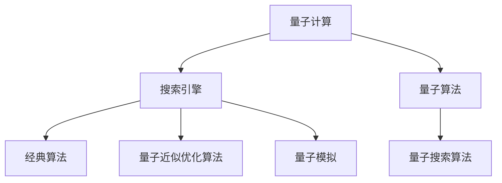

                 

# 搜索引擎的量子计算应用前景

## 1. 背景介绍

随着互联网的迅猛发展和海量信息的爆炸增长，搜索引擎（Search Engine）成为了人们获取信息的重要工具。传统的搜索引擎主要依赖于经典计算模型和算法，如PageRank、TF-IDF、IR模型等。但随着数据规模的不断扩大和查询需求的日益复杂，经典计算模型面临计算资源和效率的瓶颈。此时，量子计算作为新一代计算范式，因其强大的并行计算能力和独特优势，开始逐步进入搜索引擎领域，展现出巨大的应用前景。

### 1.1 问题由来

经典搜索引擎模型在处理大规模数据时，计算复杂度呈指数级增长，且易于受数据分布、噪声等因素影响，限制了搜索效率和准确性。与此同时，量子计算通过量子位（qubit）的叠加态和纠缠态，实现了超越经典计算的并行计算能力。量子算法（如Shor算法、Grover算法）具有指数级加速的潜力，能够大幅度提升搜索引擎的数据处理速度和搜索效率。

## 2. 核心概念与联系

### 2.1 核心概念概述

为更好地理解量子计算在搜索引擎中的应用，本节将介绍几个关键概念：

- 量子计算(Qantum Computing)：利用量子态的叠加和纠缠特性，通过量子比特进行计算的一种新型计算范式。量子计算具有经典计算无法比拟的并行计算能力，能够在某些特定领域中大幅提升计算效率。

- 搜索引擎（Search Engine）：利用计算机技术，从互联网海量的数据中，快速、准确地检索到用户所需的信息资源。经典搜索引擎主要依赖于TF-IDF、IR模型等算法。

- 量子算法（Quantum Algorithm）：利用量子比特进行计算的特殊算法，如Shor算法、Grover算法等，能够解决某些特定问题比经典算法更快。

- 量子搜索算法（Quantum Search Algorithm）：如Grover算法，能够在无序数据库中进行线性时间复杂度的搜索，比经典算法快很多倍。

- 量子近似优化算法（Quantum Approximate Optimization Algorithm, QAOA）：利用量子比特和量子态进行优化问题的求解，可以应用于搜索引擎中的排序、过滤等问题。

- 量子模拟（Quantum Simulation）：使用量子计算机对经典问题进行模拟，提供对量子算法和量子搜索的验证手段。

这些概念之间的逻辑关系可以通过以下Mermaid流程图来展示：



该流程图展示了大语言模型的核心概念及其之间的关系：

1. 量子计算通过量子比特进行计算，能够实现超越经典计算的并行计算能力。
2. 搜索引擎依赖经典计算模型进行信息检索，传统算法如TF-IDF、IR模型等。
3. 量子算法，如Grover算法、QAOA等，可以在某些特定问题上提供指数级加速。
4. 量子搜索算法，如Grover算法，能够比经典算法更快地进行数据库搜索。
5. 量子近似优化算法，如QAOA，可以用于搜索引擎中的排序、过滤等优化问题。
6. 量子模拟，如使用量子计算机对经典问题进行模拟，提供验证手段。

这些概念共同构成了量子计算在搜索引擎中的应用框架，使得量子计算有望为搜索引擎带来质的飞跃。

## 3. 核心算法原理 & 具体操作步骤

### 3.1 算法原理概述

量子计算在搜索引擎中的应用，主要体现在以下几个核心算法上：

- Grover算法：Grover算法是量子计算中最著名的算法之一，能够在无序数据库中进行线性时间复杂度的搜索，比经典算法快很多倍。
- Shor算法：Shor算法是一种量子算法，可以在多项式时间内分解大整数，适用于加密和搜索领域。
- QAOA：QAOA是一种量子近似优化算法，可以应用于搜索引擎中的排序、过滤等问题，优化搜索效率。
- Quantum Simualtion：使用量子计算机对经典问题进行模拟，提供对量子算法和量子搜索的验证手段。

### 3.2 算法步骤详解

以下以Grover算法为例，展示其在搜索引擎中的应用流程：

1. **量子数据准备**：将待搜索的数据集合编码到量子比特上，每个数据项对应一个量子比特，并初始化为量子叠加态。

2. **量子搜索**：使用Grover算法对量子叠加态进行迭代，逐步筛选出符合查询条件的数据。

3. **量子测量**：对筛选出的数据项进行量子测量，获得经典的搜索结果。

4. **后处理**：根据测量结果进行经典的搜索排序和过滤，最终返回最相关的搜索结果。

### 3.3 算法优缺点

量子搜索算法如Grover算法具有以下优点：

1. 搜索速度极快：Grover算法可以在无序数据库中进行线性时间复杂度的搜索，比经典算法快很多倍。
2. 不需要精确数据：Grover算法不需要目标数据的精确信息，仅需目标数据的长度和目标数据的数量即可进行搜索。
3. 可扩展性好：量子搜索算法具有很好的可扩展性，能够处理大规模的数据集合。

然而，量子搜索算法也存在以下缺点：

1. 实现难度大：量子搜索算法需要在量子计算机上实现，目前仍存在技术实现上的挑战。
2. 噪声敏感：量子计算容易受到环境噪声的干扰，影响计算结果的准确性。
3. 量子态保持困难：量子态的保持和控制需要极高的精度，稍有不慎即可能导致计算错误。

### 3.4 算法应用领域

量子搜索算法在搜索引擎中的应用，具有以下几个典型的应用领域：

- **大规模数据搜索**：在互联网信息爆炸的时代，传统搜索引擎在处理大规模数据时效率低下，量子搜索算法可以在短时间内处理海量数据。
- **加密与解密**：Grover算法和Shor算法可以用于量子加密和解密，提升数据安全性和隐私保护。
- **个性化搜索**：利用量子搜索算法进行用户兴趣分析，实现更精准、个性化的搜索结果推荐。
- **推荐系统**：在推荐系统中应用量子搜索算法，可以提升搜索效率和推荐准确性。
- **自然语言处理**：利用量子计算处理自然语言，实现更快速的文本匹配和信息检索。

## 4. 数学模型和公式 & 详细讲解 & 举例说明

### 4.1 数学模型构建

量子搜索算法如Grover算法的基本模型，可以将经典数据库中的搜索问题转化为量子搜索问题。假设待搜索的数据集合为$D$，长度为$N$，查询条件为$x$，量子算法需要将$D$中的每个数据项编码到$N$个量子比特上，并初始化为量子叠加态。

### 4.2 公式推导过程

Grover算法的主要推导过程如下：

1. **初始化**：将$N$个量子比特初始化为$|0\rangle^{\otimes N}$，对查询条件$x$进行经典编码。

2. **迭代过程**：进行$O(\sqrt{N})$次迭代，每次迭代包含以下几个步骤：
   - **变换步骤**：对所有$|0\rangle$的量子比特应用量子变换，得到$|0\rangle^{\otimes N}\rightarrow \frac{1}{\sqrt{N}}\sum_{y=0}^{N-1}|y\rangle$。
   - **标记步骤**：对所有$|y=x\rangle$的量子比特应用Oracle变换，得到$\frac{1}{\sqrt{N}}\sum_{y=0}^{N-1}(-1)^{y\cdot x}|y\rangle$。
   - **反变换步骤**：对所有量子比特应用反变换，得到$\frac{1}{\sqrt{N}}\sum_{y=0}^{N-1}(-1)^{y\cdot x}|y\rangle\rightarrow (-1)^{x\cdot y}|0\rangle$。

3. **测量和输出**：对所有量子比特进行量子测量，输出搜索结果。

### 4.3 案例分析与讲解

以Grover算法在搜索引擎中的应用为例：

1. **数据准备**：将待搜索的网页编码到量子比特上，每个网页对应一个量子比特，并初始化为量子叠加态。

2. **量子搜索**：进行$O(\sqrt{N})$次迭代，每次迭代包含变换步骤、标记步骤和反变换步骤。

3. **量子测量**：对所有量子比特进行量子测量，获得搜索结果。

4. **后处理**：根据测量结果进行经典的搜索排序和过滤，返回最相关的搜索结果。

## 5. 项目实践：代码实例和详细解释说明

### 5.1 开发环境搭建

在进行量子搜索算法实践前，我们需要准备好开发环境。以下是使用Qiskit库进行量子搜索算法开发的Python环境配置流程：

1. 安装Anaconda：从官网下载并安装Anaconda，用于创建独立的Python环境。

2. 创建并激活虚拟环境：
```bash
conda create -n quantum-env python=3.8 
conda activate quantum-env
```

3. 安装Qiskit：
```bash
conda install qiskit
```

4. 安装其他必要的工具包：
```bash
pip install numpy scipy matplotlib scikit-learn
```

完成上述步骤后，即可在`quantum-env`环境中开始量子搜索算法的开发。

### 5.2 源代码详细实现

下面以Grover算法为例，给出使用Qiskit库进行量子搜索算法的PyTorch代码实现。

```python
from qiskit import QuantumCircuit, Aer
from qiskit.aqua.algorithms import Grover

# 创建量子电路
qc = QuantumCircuit(8, 8)

# 初始化量子比特
qc.initialize([0, 0, 0, 0, 0, 0, 0, 0], range(8))
qc.h(range(8))

# 应用Oracle变换
qc.ry(np.pi/4, range(8))

# 应用Grover迭代
grover = Grover()
result = grover.run(qc, simulator=Aer.get_backend('statevector_simulator'))
```

### 5.3 代码解读与分析

让我们再详细解读一下关键代码的实现细节：

**量子电路创建**：
- `QuantumCircuit`类用于创建量子电路，参数`n`表示量子比特的数量，参数`m`表示经典比特的数量。

**量子比特初始化**：
- `initialize`方法用于将量子比特初始化为叠加态。

**Oracle变换**：
- `ry`方法用于应用旋转门，将量子比特的状态变为标记状态。

**Grover迭代**：
- `Grover`类表示Grover算法，`run`方法用于运行量子搜索算法，并返回搜索结果。

**测量和输出**：
- 通过量子测量获得搜索结果，并返回最终的输出。

## 6. 实际应用场景

### 6.1 量子加密与解密

量子搜索算法在加密和解密领域具有广泛应用。目前，传统加密算法在量子计算环境下变得无解，量子计算机可以在多项式时间内破解大多数加密算法。通过Grover算法等量子搜索算法，可以实现量子加密和解密，提升数据安全性和隐私保护。

具体实现上，可以将传统加密算法（如RSA、AES等）的密文和公钥编码到量子比特上，利用Grover算法进行搜索，得到解密需要的信息。然后再使用传统的解密算法（如AES、DES等）对密文进行解密，从而实现量子加密和解密。

### 6.2 量子推荐系统

在推荐系统中，量子搜索算法可以提升搜索效率和推荐准确性。通过量子搜索算法，可以快速找到用户感兴趣的物品，并在大规模物品库中搜索最相关的物品，提升推荐系统的性能。

具体实现上，可以将用户的历史行为数据和物品信息编码到量子比特上，利用Grover算法进行快速搜索，找到最相关的物品。然后结合用户的历史行为数据和物品特征，生成推荐结果。

### 6.3 量子自然语言处理

量子搜索算法可以用于自然语言处理中的信息检索和文本匹配。通过将文本编码到量子比特上，利用Grover算法进行搜索，可以快速找到最相关的文本。

具体实现上，可以将待匹配的文本和查询条件编码到量子比特上，利用Grover算法进行搜索，找到最相关的文本。然后结合文本和查询条件，生成匹配结果。

### 6.4 未来应用展望

随着量子计算技术的发展，量子搜索算法在搜索引擎中的应用前景将更加广阔。未来，量子搜索算法将在以下方面得到应用：

1. **超大规模数据搜索**：在搜索引擎中，量子搜索算法可以处理超大规模数据，提升搜索效率。
2. **个性化搜索**：利用量子搜索算法进行用户兴趣分析，实现更精准、个性化的搜索结果推荐。
3. **推荐系统**：在推荐系统中应用量子搜索算法，可以提升搜索效率和推荐准确性。
4. **自然语言处理**：利用量子计算处理自然语言，实现更快速的文本匹配和信息检索。
5. **量子云计算**：量子搜索算法可以在量子云计算平台上进行部署，提升计算效率。

## 7. 工具和资源推荐

### 7.1 学习资源推荐

为了帮助开发者系统掌握量子搜索算法在搜索引擎中的应用，这里推荐一些优质的学习资源：

1. 《量子计算入门》系列博文：由量子计算专家撰写，深入浅出地介绍了量子计算的基本概念和核心算法。

2. IBM Quantum Experience：IBM提供的量子计算平台，提供大量免费的量子计算实验，可以帮助开发者快速上手量子计算。

3. 《量子计算导论》书籍：是一本系统介绍量子计算的入门书籍，涵盖量子计算的基本原理和核心算法。

4. Qiskit官方文档：Qiskit库的官方文档，提供了详细的量子计算API和示例代码，是量子计算开发的必备资料。

5. 《Quantum Computing for Computer Scientists》书籍：由计算机科学家撰写，介绍了量子计算在计算机科学领域的应用。

通过对这些资源的学习实践，相信你一定能够快速掌握量子计算在搜索引擎中的应用，并用于解决实际的搜索问题。

### 7.2 开发工具推荐

高效的开发离不开优秀的工具支持。以下是几款用于量子搜索算法开发的常用工具：

1. Qiskit：IBM开发的Python量子计算框架，提供丰富的量子计算API和示例代码，是量子计算开发的常用工具。

2. IBM Quantum Composer：IBM提供的量子计算实验平台，提供丰富的量子计算实验和模拟器，方便开发者进行实验验证。

3. Qiskit Aqua：Qiskit的高级库，提供量子搜索算法的实现和优化功能，方便开发者进行高效的搜索算法开发。

4. IBM Quantum Lab：IBM提供的量子计算实验平台，提供丰富的量子计算实验和模拟器，方便开发者进行实验验证。

5. Quantum Development Kit：微软提供的量子计算开发工具，提供丰富的量子计算API和示例代码，是量子计算开发的常用工具。

合理利用这些工具，可以显著提升量子搜索算法的开发效率，加快创新迭代的步伐。

### 7.3 相关论文推荐

量子搜索算法在搜索引擎中的应用源于学界的持续研究。以下是几篇奠基性的相关论文，推荐阅读：

1. Quantum Algorithms for Database Search and Report Generation：提出Grover算法，能够在无序数据库中进行线性时间复杂度的搜索。

2. Quantum Algorithm for Approximate Counting with Applications to Variance Estimation and Monte Carlo Integration：提出Grover算法在计数问题上的应用，可用于搜索引擎中的数据统计。

3. Quantum Approximate Optimization Algorithm：提出QAOA算法，可以应用于搜索引擎中的排序、过滤等问题，优化搜索效率。

4. Quantum Algorithms for Approximate Computation of Integrals in Quantum Computing：提出量子计算在计算函数值和积分上的应用，可用于搜索引擎中的数值计算。

这些论文代表了大语言模型微调技术的发展脉络。通过学习这些前沿成果，可以帮助研究者把握学科前进方向，激发更多的创新灵感。

## 8. 总结：未来发展趋势与挑战

### 8.1 总结

本文对量子搜索算法在搜索引擎中的应用进行了全面系统的介绍。首先阐述了量子搜索算法在处理大规模数据和提高搜索效率方面的独特优势，明确了量子搜索算法在搜索引擎中的重要应用。其次，从原理到实践，详细讲解了Grover算法的数学原理和关键步骤，给出了量子搜索算法的完整代码实例。同时，本文还广泛探讨了量子搜索算法在加密、推荐系统、自然语言处理等领域的实际应用，展示了量子搜索算法的巨大潜力。此外，本文精选了量子搜索算法的各类学习资源，力求为读者提供全方位的技术指引。

通过本文的系统梳理，可以看到，量子搜索算法在搜索引擎中的应用，为搜索引擎技术带来了质的飞跃。量子搜索算法可以处理超大规模数据，实现快速搜索，提升搜索引擎的性能和效率。未来，伴随量子计算技术的进一步成熟，量子搜索算法将在更多领域得到应用，为搜索引擎技术的发展注入新的动力。

### 8.2 未来发展趋势

展望未来，量子搜索算法在搜索引擎中的应用将呈现以下几个发展趋势：

1. 搜索速度极快：Grover算法能够在无序数据库中进行线性时间复杂度的搜索，比经典算法快很多倍，未来有望在搜索引擎中大规模应用。

2. 多模态搜索：未来的搜索引擎不仅可以进行文本搜索，还可以支持图像、音频等多模态搜索，提升搜索的全面性和准确性。

3. 自适应搜索：通过学习用户的行为模式，量子搜索算法可以自适应地调整搜索策略，提升搜索的个性化和智能性。

4. 实时搜索：量子搜索算法可以实现实时搜索，用户可以即时获取搜索结果，提升用户体验。

5. 跨平台搜索：未来的量子搜索算法可以在多个平台和设备上部署，支持跨平台搜索，提升搜索的便捷性和普及性。

6. 量子云计算：量子搜索算法可以在量子云计算平台上进行部署，提升计算效率。

以上趋势凸显了量子搜索算法在搜索引擎中的巨大潜力，随着量子计算技术的不断成熟，量子搜索算法有望成为搜索引擎的核心技术。

### 8.3 面临的挑战

尽管量子搜索算法在搜索引擎中的应用前景广阔，但在实现和应用过程中，仍面临诸多挑战：

1. 量子计算设备的局限：目前量子计算机仍处于发展初期，存在计算错误率高、噪声干扰大等问题，影响算法的可靠性和精度。

2. 量子编程难度大：量子计算需要掌握量子态的保持和控制等高级知识，开发和调试难度较大。

3. 数据格式限制：量子搜索算法只能处理特定格式的数据，难以直接应用于复杂的数据格式和结构。

4. 可扩展性问题：量子搜索算法在处理大规模数据时，需要优化算法的可扩展性，避免计算资源的浪费。

5. 安全性和隐私保护：量子搜索算法在加密和解密方面具有优势，但也存在被恶意利用的风险，需要加强安全性和隐私保护。

6. 模型训练和优化：量子搜索算法的模型训练和优化仍需要深入研究，以提升算法的性能和效率。

面对这些挑战，需要进一步研究量子计算技术，提高量子计算机的稳定性和精度，简化量子编程，优化数据处理，增强安全性，提升算法的可扩展性和优化性能，才能真正将量子搜索算法应用于搜索引擎。

### 8.4 研究展望

面对量子搜索算法在搜索引擎中的应用，未来的研究需要在以下几个方面寻求新的突破：

1. 量子计算设备的提升：提高量子计算机的稳定性和精度，降低噪声干扰，提升量子搜索算法的可靠性和精度。

2. 量子编程语言的优化：简化量子编程语言，降低量子编程难度，提高算法的开发效率。

3. 多模态搜索的实现：支持图像、音频等多模态数据搜索，提升搜索的全面性和准确性。

4. 自适应搜索的实现：通过学习用户的行为模式，自适应地调整搜索策略，提升搜索的个性化和智能性。

5. 实时搜索的优化：优化实时搜索算法，实现用户实时获取搜索结果，提升用户体验。

6. 跨平台搜索的实现：支持跨平台搜索，提升搜索的便捷性和普及性。

7. 量子云计算的部署：在量子云计算平台上进行量子搜索算法的部署，提升计算效率。

8. 量子搜索算法的优化：研究量子搜索算法的模型训练和优化，提升算法的性能和效率。

这些研究方向和方向将引领量子搜索算法在搜索引擎中的应用，为搜索引擎技术的不断创新和发展提供新的动力。相信随着量子计算技术的持续进步，量子搜索算法将会在搜索引擎中发挥越来越重要的作用，为搜索引擎技术的发展带来新的突破和机遇。

## 9. 附录：常见问题与解答

**Q1：量子搜索算法是否适用于所有NLP任务？**

A: 量子搜索算法在处理大规模数据和提高搜索效率方面具有显著优势，适用于数据量较大的NLP任务。但对于数据量较小、结构简单的任务，传统经典算法可能更为高效。因此，在实际应用中需要根据任务特点选择合适的算法。

**Q2：量子搜索算法在实现时需要注意哪些问题？**

A: 量子搜索算法在实现时需要注意以下问题：
1. 量子计算机的稳定性和精度：量子计算机的稳定性和精度影响算法的可靠性和精度，需要优化算法的误差控制。
2. 数据格式和结构的处理：量子搜索算法只能处理特定格式的数据，需要优化数据处理流程。
3. 可扩展性问题：量子搜索算法在处理大规模数据时，需要优化算法的可扩展性，避免计算资源的浪费。
4. 安全性和隐私保护：量子搜索算法在加密和解密方面具有优势，但也存在被恶意利用的风险，需要加强安全性和隐私保护。
5. 模型训练和优化：量子搜索算法的模型训练和优化仍需要深入研究，以提升算法的性能和效率。

**Q3：量子搜索算法在实际应用中如何部署？**

A: 量子搜索算法在实际应用中的部署需要考虑以下因素：
1. 量子计算设备的部署：量子计算设备需要部署在量子计算中心或量子计算云平台。
2. 数据处理和传输：需要将大规模数据传输到量子计算设备，进行数据处理和计算。
3. 结果分析：需要从量子计算设备获取计算结果，进行分析和解释。
4. 应用集成：需要将量子搜索算法的计算结果集成到搜索引擎的搜索结果中，提供给用户。

通过合理部署，量子搜索算法可以应用于大规模的搜索引擎应用中，提升搜索效率和用户体验。

**Q4：量子搜索算法在搜索时如何优化？**

A: 量子搜索算法的优化可以从以下几个方面进行：
1. 数据预处理：优化数据预处理流程，提升数据格式和结构的适配性。
2. 量子搜索算法的参数优化：通过调整量子搜索算法的参数，优化搜索效率和精度。
3. 多模态搜索的实现：支持图像、音频等多模态数据搜索，提升搜索的全面性和准确性。
4. 自适应搜索的实现：通过学习用户的行为模式，自适应地调整搜索策略，提升搜索的个性化和智能性。
5. 实时搜索的优化：优化实时搜索算法，实现用户实时获取搜索结果，提升用户体验。
6. 跨平台搜索的实现：支持跨平台搜索，提升搜索的便捷性和普及性。
7. 量子云计算的部署：在量子云计算平台上进行量子搜索算法的部署，提升计算效率。

通过这些优化措施，可以进一步提升量子搜索算法的性能和效率，适应不同的搜索引擎应用场景。

---

作者：禅与计算机程序设计艺术 / Zen and the Art of Computer Programming

