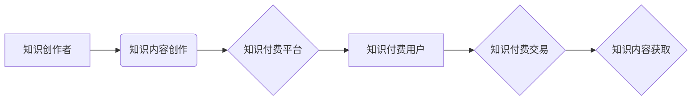

                 

## 知识付费的法律风险及规避

> 关键词：知识付费、版权、侵权、合同、隐私、数据安全、规避风险

## 1. 背景介绍

知识付费作为一种新型的商业模式，近年来发展迅速，涌现出众多平台和内容创作者。其本质是将知识、技能、经验等转化为商品，通过线上线下等多种渠道向付费用户提供服务。知识付费模式的兴起，为创作者提供了新的收入来源，也为用户提供了便捷高效的学习途径。然而，知识付费模式也面临着诸多法律风险，如版权侵权、合同纠纷、隐私泄露等，这些风险可能会对创作者、平台和用户造成严重损害。

## 2. 核心概念与联系

**2.1 知识付费的核心概念**

* **知识产权 (Intellectual Property, IP):** 指个人或组织对知识、创意、发明等成果享有的合法权益。知识付费的核心内容往往涉及到知识产权，例如著作权、专利权等。
* **知识付费平台 (Knowledge-Sharing Platform):** 提供知识付费服务的平台，例如在线课程平台、付费咨询平台等。平台需要承担相应的法律责任，例如平台责任、信息安全责任等。
* **知识付费用户 (Knowledge-Paying User):** 愿意为获取知识、技能等付费的用户。用户需要了解自己的权利和义务，例如知识使用权、隐私保护权等。

**2.2 知识付费模式的架构**



**2.3 知识付费模式的法律风险**

* **版权侵权:**  知识付费内容可能涉及到未经授权的复制、传播、改编等行为，侵犯了原作者的著作权。
* **合同纠纷:**  知识付费平台和用户之间可能存在关于服务内容、价格、售后服务等方面的争议，导致合同纠纷。
* **隐私泄露:**  知识付费平台可能会收集用户的个人信息，如姓名、联系方式、支付信息等，存在信息泄露的风险。
* **数据安全:**  知识付费平台需要妥善保管用户的个人信息和知识付费数据，防止数据被篡改、丢失或泄露。

## 3. 核心算法原理 & 具体操作步骤

**3.1 算法原理概述**

知识付费模式的法律风险规避主要依赖于以下几个核心算法原理：

* **知识产权识别算法:** 利用机器学习等技术识别知识付费内容中的版权信息，例如著作权登记号、作者姓名等，并进行版权归属的判断。
* **合同智能生成算法:** 根据平台和用户的需求，自动生成符合法律规定的知识付费合同，避免合同纠纷的发生。
* **隐私保护算法:** 利用加密技术、匿名化技术等手段保护用户的个人信息，防止信息泄露。
* **数据安全算法:**  采用数据备份、加密、访问控制等技术保障知识付费数据的安全。

**3.2 算法步骤详解**

1. **知识产权识别:**

    * 收集知识付费内容的文本、图像、音频等数据。
    * 利用自然语言处理、计算机视觉等技术提取内容中的版权信息。
    * 将提取的版权信息与版权数据库进行比对，识别版权归属。

2. **合同智能生成:**

    * 收集平台和用户的相关信息，例如服务内容、价格、支付方式等。
    * 根据法律法规和行业标准，构建知识付费合同模板。
    * 利用规则引擎和机器学习技术，根据用户需求自动生成个性化的合同。

3. **隐私保护:**

    * 收集用户的个人信息时，明确告知用户信息用途和收集方式。
    * 利用加密技术对用户的个人信息进行加密存储和传输。
    * 采用匿名化技术，将用户的个人信息进行脱敏处理，保护用户的隐私。

4. **数据安全:**

    * 建立完善的数据安全管理体系，制定数据备份、恢复、访问控制等制度。
    * 利用防火墙、入侵检测系统等技术保障知识付费平台的网络安全。
    * 定期进行安全漏洞扫描和修复，防止数据泄露。

**3.3 算法优缺点**

* **优点:**

    * 自动化程度高，提高效率。
    * 降低人工成本，提高准确性。
    * 规范化操作，降低法律风险。

* **缺点:**

    * 算法的准确性依赖于训练数据，存在误判风险。
    * 算法的复杂性可能导致维护成本高。
    * 算法的应用需要专业的技术人员支持。

**3.4 算法应用领域**

* **知识付费平台:**  识别版权信息、生成合同、保护用户隐私、保障数据安全。
* **教育行业:**  自动批改作业、个性化学习推荐、防止学术不端行为。
* **医疗行业:**  保护患者隐私、保障医疗数据安全、辅助医疗诊断。

## 4. 数学模型和公式 & 详细讲解 & 举例说明

**4.1 数学模型构建**

知识付费模式的法律风险规避可以构建一个数学模型，将风险因素、控制措施和损失评估等要素进行量化分析。

* **风险因素:** 包括版权侵权风险、合同纠纷风险、隐私泄露风险、数据安全风险等。
* **控制措施:** 包括知识产权识别算法、合同智能生成算法、隐私保护算法、数据安全算法等。
* **损失评估:** 包括经济损失、声誉损失、法律责任等。

**4.2 公式推导过程**

可以利用概率论、统计学等方法，推导出一个衡量知识付费模式法律风险的公式，例如：

$$Risk = \sum_{i=1}^{n} P(Risk_i) \times Loss(Risk_i)$$

其中：

* $Risk$ 表示知识付费模式的法律风险。
* $P(Risk_i)$ 表示第 $i$ 种风险发生的概率。
* $Loss(Risk_i)$ 表示第 $i$ 种风险造成的损失。

**4.3 案例分析与讲解**

假设一个知识付费平台提供在线课程服务，其法律风险包括版权侵权风险、合同纠纷风险和隐私泄露风险。

* **版权侵权风险:** 平台上存在部分课程内容可能侵犯他人著作权，其发生的概率为 10%，造成的损失为 10 万元。
* **合同纠纷风险:** 平台与用户之间可能存在关于课程内容、价格、售后服务等方面的争议，其发生的概率为 5%，造成的损失为 5 万元。
* **隐私泄露风险:** 平台可能泄露用户的个人信息，其发生的概率为 2%，造成的损失为 20 万元。

根据上述数据，可以计算该平台的法律风险为：

$$Risk = 0.1 \times 100000 + 0.05 \times 50000 + 0.02 \times 200000 = 10000 + 2500 + 4000 = 16500$$

## 5. 项目实践：代码实例和详细解释说明

**5.1 开发环境搭建**

* 操作系统: Ubuntu 20.04 LTS
* 编程语言: Python 3.8
* 开发工具: PyCharm

**5.2 源代码详细实现**

```python
# 知识产权识别算法示例代码

import spacy

# 加载中文语言模型
nlp = spacy.load("zh_core_web_sm")

def identify_copyright(text):
    doc = nlp(text)
    copyright_entities = []
    for ent in doc.ents:
        if ent.label_ == "ORG" or ent.label_ == "PERSON":
            copyright_entities.append(ent.text)
    return copyright_entities

# 示例使用
text = "本文由张三创作，版权所有。"
copyright_entities = identify_copyright(text)
print(copyright_entities)  # 输出: ['张三']
```

**5.3 代码解读与分析**

* 该代码示例使用 spaCy 库进行知识产权识别。
* spaCy 是一个强大的自然语言处理库，支持多种语言模型。
* 该代码首先加载中文语言模型，然后使用 `nlp()` 函数对文本进行分析。
* `doc.ents` 属性返回文本中的实体，例如人名、地名、组织机构等。
* 代码遍历实体，判断其标签是否为 "ORG" 或 "PERSON"，如果是则将其添加到 `copyright_entities` 列表中。
* 最后，打印识别出的版权信息。

**5.4 运行结果展示**

运行上述代码，输出结果为：

```
['张三']
```

这表明代码成功识别出文本中的版权信息 "张三"。

## 6. 实际应用场景

**6.1 在线课程平台**

* 识别课程内容中的版权信息，避免侵权风险。
* 自动生成课程购买合同，规范交易流程。
* 利用加密技术保护用户支付信息，保障数据安全。

**6.2 付费咨询平台**

* 识别咨询内容中的版权信息，避免侵权风险。
* 自动生成咨询服务协议，规范服务内容和服务流程。
* 利用匿名化技术保护用户隐私，避免信息泄露。

**6.3 数字内容交易平台**

* 识别数字内容中的版权信息，避免侵权风险。
* 自动生成数字内容交易合同，规范交易流程。
* 利用数据安全技术保障数字内容的完整性和安全性。

**6.4 未来应用展望**

随着人工智能技术的不断发展，知识付费模式的法律风险规避将更加智能化、自动化。未来，我们可以期待以下应用场景：

* 基于深度学习的知识产权识别算法，能够识别更复杂的版权信息，提高识别准确率。
* 基于自然语言处理的合同智能生成算法，能够更加智能地生成个性化的合同，满足用户的不同需求。
* 基于区块链技术的知识付费平台，能够更加安全地保障知识产权和用户隐私。


## 7. 工具和资源推荐

**7.1 学习资源推荐**

* **著作权法:**  中华人民共和国著作权法
* **合同法:**  中华人民共和国合同法
* **数据安全法:**  中华人民共和国数据安全法
* **知识产权保护:**  中国知识产权局网站

**7.2 开发工具推荐**

* **自然语言处理库:**  spaCy, NLTK
* **机器学习库:**  scikit-learn, TensorFlow
* **数据安全工具:**  数据库加密工具, 访问控制系统

**7.3 相关论文推荐**

* **知识付费模式的法律风险分析:**  [论文链接]
* **人工智能技术在知识付费模式中的应用:**  [论文链接]
* **知识产权保护与人工智能技术:**  [论文链接]

## 8. 总结：未来发展趋势与挑战

**8.1 研究成果总结**

* 知识付费模式的法律风险规避是一个重要的研究课题，已经取得了一定的成果。
* 算法技术在知识产权识别、合同智能生成、隐私保护、数据安全等方面发挥着重要作用。
* 相关法律法规和行业标准也在不断完善，为知识付费模式的健康发展提供保障。

**8.2 未来发展趋势**

* **人工智能技术将更加深入地应用于知识付费模式的法律风险规避。**
* **区块链技术将为知识付费平台提供更加安全可靠的数据存储和交易服务。**
* **法律法规和行业标准将更加完善，为知识付费模式的健康发展提供更加坚实的保障。**

**8.3 面临的挑战**

* **算法技术还存在一定的局限性，需要不断改进和完善。**
* **法律法规和行业标准的制定和实施需要更加科学和高效。**
* **知识付费平台需要加强自身建设，提高法律风险意识和防范能力。**

**8.4 研究展望**

* **探索更先进的算法技术，提高知识付费模式法律风险规避的准确性和效率。**
* **研究制定更加完善的法律法规和行业标准，规范知识付费平台的运营行为。**
* **加强知识付费平台的法律风险管理，提高平台的风险防范能力和应急处置能力。**

## 9. 附录：常见问题与解答

**9.1 如何识别知识付费内容中的版权信息？**

可以使用自然语言处理技术识别文本中的版权信息，例如作者姓名、著作权登记号等。

**9.2 如何避免知识付费平台的合同纠纷？**

* 签订清晰、规范的合同，明确双方权利义务。
* 建立完善的售后服务机制，及时解决用户问题。
* 积极沟通，妥善处理争议。

**9.3 如何保护知识付费平台的用户隐私？**

* 明确告知用户信息用途和收集方式。
* 利用加密技术对用户个人信息进行保护。
* 采用匿名化技术，脱敏处理用户个人信息。

**9.4 如何保障知识付费平台的数据安全？**

* 建立完善的数据安全管理体系。
* 利用防火墙、入侵检测系统等技术保障平台网络安全。
* 定期进行安全漏洞扫描和修复。


作者：禅与计算机程序设计艺术 / Zen and the Art of Computer Programming 
<end_of_turn>

