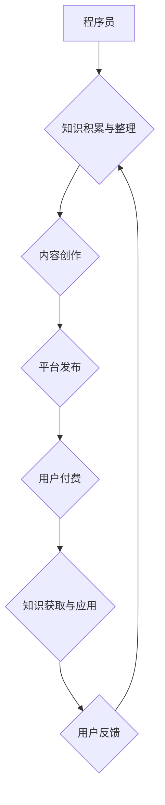

                 

## 知识付费让程序员实现财务自由的方法

> 关键词：程序员、知识付费、财务自由、技术博客、在线课程、内容创作、被动收入、个人品牌

## 1. 背景介绍

在当今科技飞速发展的时代，程序员作为数字时代的核心力量，拥有着极高的社会价值和职业发展潜力。然而，程序员的职业生涯也面临着诸多挑战，例如技术迭代速度快、竞争激烈、收入不稳定等。在这种情况下，如何实现财务自由，成为许多程序员的共同追求。

知识付费作为一种新型的商业模式，近年来在互联网领域蓬勃发展，为程序员实现财务自由提供了新的途径。通过将自身的技术经验和知识转化为有价值的内容，程序员可以建立个人品牌，获得稳定的被动收入，最终实现财务自由。

## 2. 核心概念与联系

**2.1 知识付费的本质**

知识付费是指通过互联网平台，将知识、技能、经验等转化为有价值的内容，并向付费用户提供学习、获取和应用的机会。它本质上是一种价值交换，用户通过支付费用获得知识和技能的提升，而知识创作者则通过内容销售获得收益。

**2.2 程序员的知识付费优势**

程序员具备以下优势，使其成为知识付费的理想参与者：

* **专业技能:** 程序员拥有扎实的技术基础和丰富的实践经验，能够将专业知识转化为有价值的内容。
* **技术洞察力:** 程序员对技术发展趋势有敏锐的洞察力，能够预判市场需求，创作具有前瞻性的内容。
* **沟通能力:** 程序员具备良好的沟通能力，能够将复杂的技术概念以易懂的方式传达给用户。
* **网络资源:** 程序员熟悉互联网平台和工具，能够高效地进行内容创作、推广和销售。

**2.3 知识付费的商业模式**

知识付费的商业模式多种多样，常见的有：

* **在线课程:** 将课程内容录制成视频或音频，通过平台进行销售。
* **付费博客:** 通过订阅服务，提供独家技术文章、代码库和社区支持。
* **电子书:** 将技术知识和经验整理成电子书，通过平台或个人网站销售。
* **技术咨询:** 提供一对一技术咨询服务，解决用户遇到的技术难题。

**2.4 知识付费的流程图**



## 3. 核心算法原理 & 具体操作步骤

**3.1 算法原理概述**

知识付费的核心算法原理在于价值评估和内容匹配。

* **价值评估:** 评估知识内容的价值，包括实用性、原创性、深度和针对性。
* **内容匹配:** 将知识内容与用户的需求进行匹配，提供个性化的学习体验。

**3.2 算法步骤详解**

1. **数据采集:** 收集用户学习兴趣、技术水平、学习习惯等数据。
2. **知识库构建:** 建立知识库，包含各种技术领域的知识内容。
3. **内容分类:** 对知识内容进行分类和标签化，方便用户搜索和筛选。
4. **推荐算法:** 基于用户数据和知识库，使用推荐算法推荐个性化的知识内容。
5. **用户反馈:** 收集用户对知识内容的反馈，不断优化算法和内容质量。

**3.3 算法优缺点**

* **优点:** 能够提高知识内容的匹配度，提升用户学习体验。
* **缺点:** 算法需要不断迭代优化，才能准确地评估知识价值和匹配用户需求。

**3.4 算法应用领域**

* **在线教育平台:** 推荐个性化的学习课程。
* **技术社区:** 推荐相关技术文章和代码库。
* **知识付费平台:** 推荐适合用户学习的知识内容。

## 4. 数学模型和公式 & 详细讲解 & 举例说明

**4.1 数学模型构建**

知识付费平台可以构建一个基于用户行为和内容特征的数学模型，用于评估知识内容的价值和推荐的精准度。

**4.2 公式推导过程**

假设：

* $u_i$ 表示用户 $i$ 的特征向量。
* $c_j$ 表示知识内容 $j$ 的特征向量。
* $r_{ij}$ 表示用户 $i$ 对知识内容 $j$ 的评分。

则可以构建一个基于协同过滤的推荐算法模型：

$$r_{ij} = \sigma(u_i^T c_j + b_i + b_j)$$

其中：

* $\sigma$ 是激活函数，例如 sigmoid 函数。
* $b_i$ 和 $b_j$ 分别是用户 $i$ 和知识内容 $j$ 的偏差项。

**4.3 案例分析与讲解**

例如，一个用户对机器学习算法感兴趣，平台可以根据用户的特征向量和机器学习算法的特征向量，计算出用户对该算法的评分。如果评分较高，则表明用户对该算法有较高的兴趣，平台可以推荐更多相关的机器学习算法内容。

## 5. 项目实践：代码实例和详细解释说明

**5.1 开发环境搭建**

* Python 3.x
* Flask 或 Django 框架
* 数据库 (例如 MySQL 或 PostgreSQL)

**5.2 源代码详细实现**

```python
# 使用 Flask 框架构建知识付费平台

from flask import Flask, render_template, request

app = Flask(__name__)

# 模拟用户数据
users = {
    1: {'name': 'Alice', 'interests': ['机器学习', '深度学习']},
    2: {'name': 'Bob', 'interests': ['数据结构', '算法']},
}

# 模拟知识内容数据
contents = {
    1: {'title': '机器学习入门', 'category': '机器学习'},
    2: {'title': '深度学习实战', 'category': '深度学习'},
    3: {'title': '数据结构与算法', 'category': '数据结构'},
}

@app.route('/')
def index():
    return render_template('index.html')

@app.route('/content/<int:content_id>')
def content(content_id):
    content = contents.get(content_id)
    return render_template('content.html', content=content)

if __name__ == '__main__':
    app.run(debug=True)
```

**5.3 代码解读与分析**

* 代码使用 Flask 框架构建了一个简单的知识付费平台。
* 用户数据和知识内容数据使用字典模拟。
* `/` 路由返回首页模板 `index.html`。
* `/content/<int:content_id>` 路由根据 `content_id` 返回对应的知识内容模板 `content.html`。

**5.4 运行结果展示**

运行代码后，访问 `http://127.0.0.1:5000/`，即可看到简单的知识付费平台首页。点击内容链接，即可查看对应的知识内容。

## 6. 实际应用场景

**6.1 在线课程平台**

知识付费平台可以为在线课程提供一个完整的解决方案，包括课程录制、发布、销售、用户管理和学习跟踪等功能。

**6.2 技术博客平台**

程序员可以通过知识付费平台建立个人博客，发布技术文章、代码库和社区支持，获得稳定的被动收入。

**6.3 技术咨询平台**

程序员可以利用知识付费平台提供一对一技术咨询服务，帮助用户解决技术难题，获得更高的收入。

**6.4 未来应用展望**

随着人工智能和虚拟现实技术的不断发展，知识付费平台将更加智能化、个性化和沉浸式。

## 7. 工具和资源推荐

**7.1 学习资源推荐**

* **Coursera:** https://www.coursera.org/
* **edX:** https://www.edx.org/
* **Udemy:** https://www.udemy.com/

**7.2 开发工具推荐**

* **Flask:** https://flask.palletsprojects.com/en/2.2.x/
* **Django:** https://www.djangoproject.com/
* **MySQL:** https://www.mysql.com/
* **PostgreSQL:** https://www.postgresql.org/

**7.3 相关论文推荐**

* **Collaborative Filtering for Recommender Systems**
* **Matrix Factorization Techniques for Recommender Systems**

## 8. 总结：未来发展趋势与挑战

**8.1 研究成果总结**

知识付费为程序员实现财务自由提供了新的途径，并推动了在线教育、技术博客和技术咨询等领域的创新发展。

**8.2 未来发展趋势**

* **个性化推荐:** 利用人工智能技术，提供更加个性化的知识推荐。
* **沉浸式学习:** 利用虚拟现实技术，打造更加沉浸式的学习体验。
* **社区化学习:** 构建更加活跃的学习社区，促进用户之间的交流和互动。

**8.3 面临的挑战**

* **内容质量:** 确保知识内容的质量和原创性。
* **用户信任:** 建立用户对平台和内容的信任。
* **商业模式:** 探索更加可持续的商业模式。

**8.4 研究展望**

未来，知识付费平台将更加智能化、个性化和沉浸式，为程序员提供更加便捷、高效和丰富的学习体验。


## 9. 附录：常见问题与解答

**9.1 如何选择合适的知识付费平台？**

* 考虑平台的专业领域、用户规模、内容质量和商业模式。
* 比较不同平台的收费标准、服务内容和用户评价。

**9.2 如何打造优质的知识付费内容？**

* 深入研究目标用户需求，提供有价值和实用的知识内容。
* 采用清晰易懂的语言和丰富的教学素材，提升内容质量。
* 保证内容的原创性和时效性，避免抄袭和滞后。

**9.3 如何推广自己的知识付费内容？**

* 利用社交媒体、技术社区和个人网站进行推广。
* 与其他创作者合作，扩大内容传播范围。
* 参加行业活动和线上线下课程，提升品牌知名度。


作者：禅与计算机程序设计艺术 / Zen and the Art of Computer Programming 
<end_of_turn>

